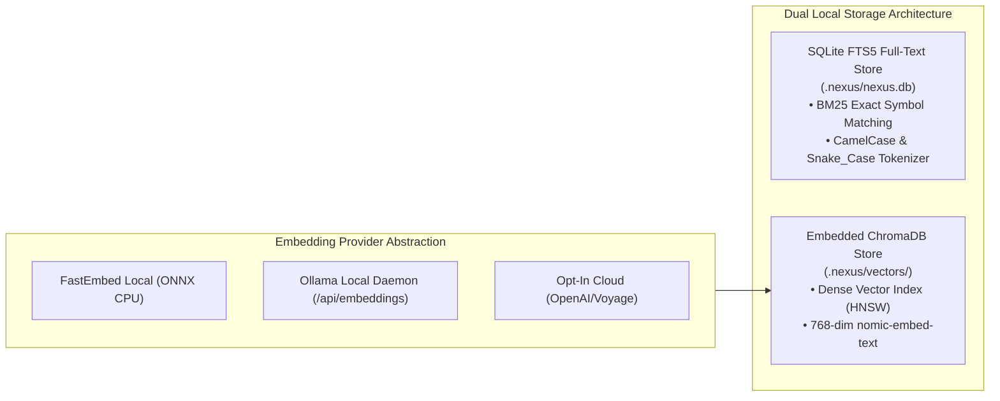
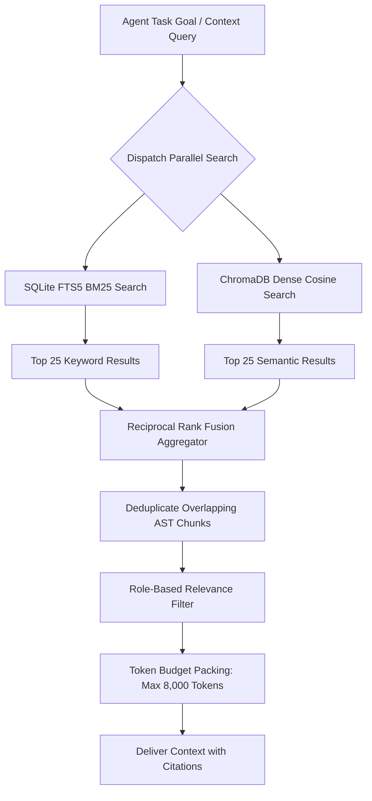
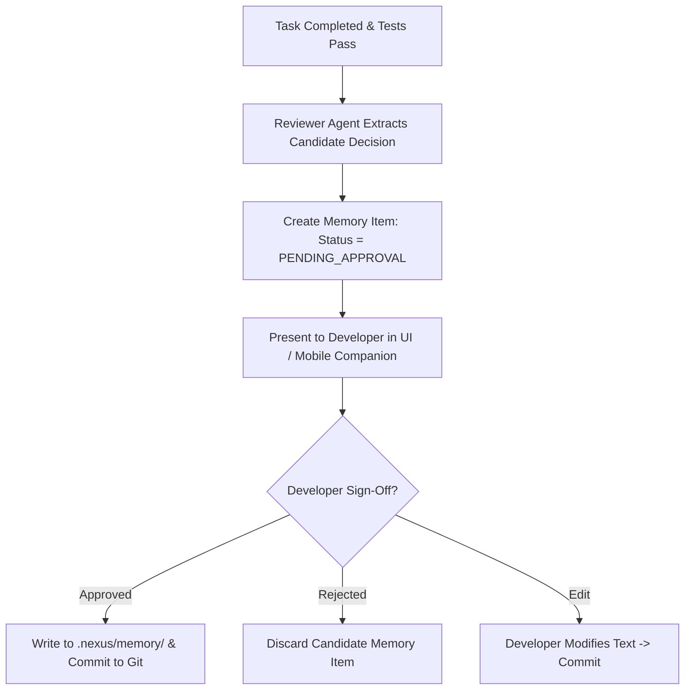
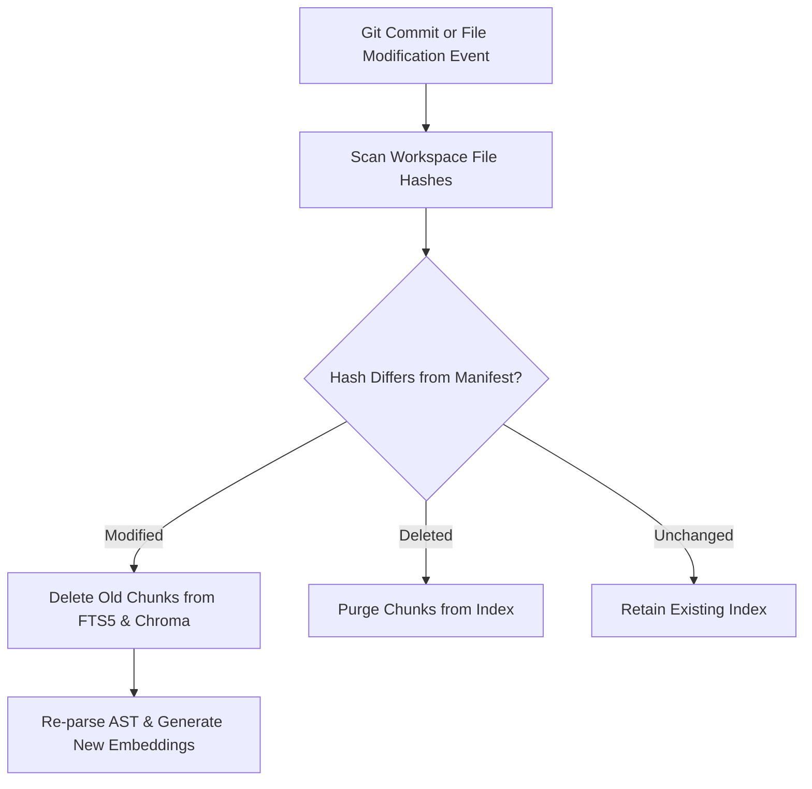
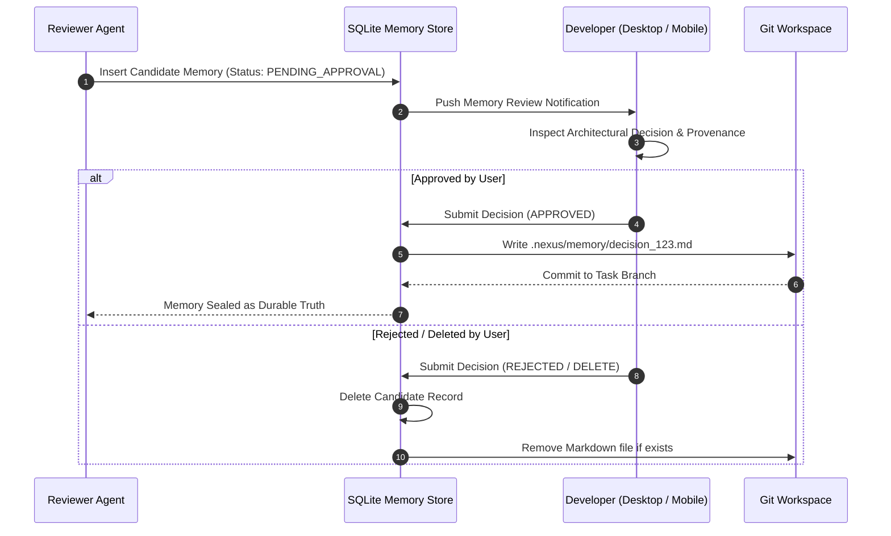
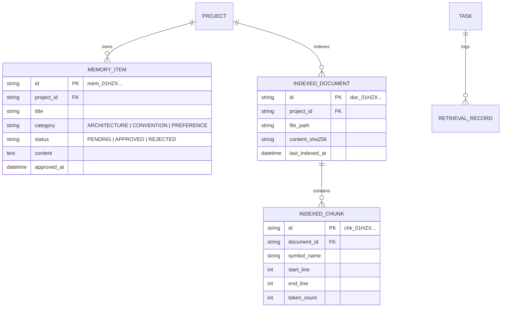
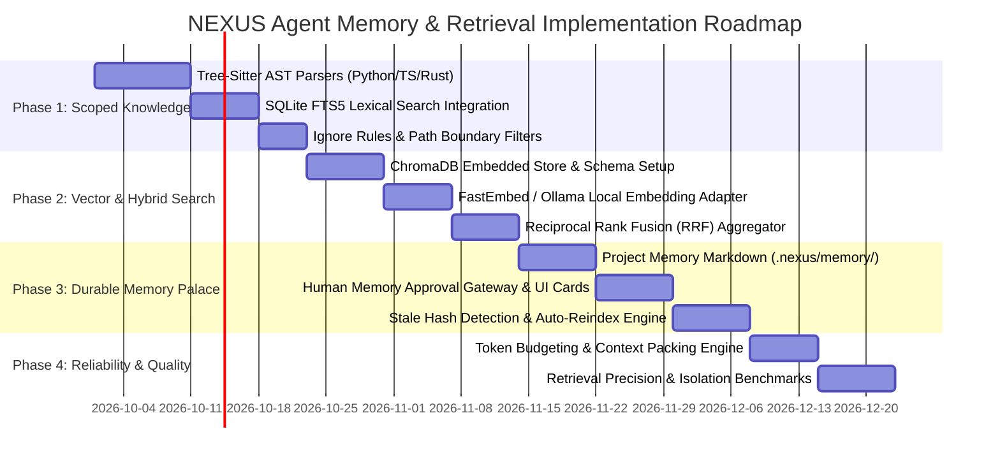

# NEXUS — Agent Memory, Knowledge & Retrieval Architecture

**Document Version:** 1.0.0  
**Status:** Approved Production Architecture Baseline  
**Classification:** Core AI Subsystem, RAG Engineering & Knowledge Governance  
**Target Systems:** NEXUS Desktop (Windows x64 Native / Tauri + FastAPI Engine) & NEXUS Mobile Companion (Android Node)  
**Primary Sources of Truth:**
- `docs/PRD.md` (v1.0.0)
- `docs/NEXUS_TECH_STACK.md` (v1.0.0)
- `docs/NEXUS_BACKEND_ARCHITECTURE.md` (v1.0.0)
- `docs/NEXUS_SECURITY_ARCHITECTURE.md` (v1.0.0)
- `docs/NEXUS_TASK_LIFECYCLE_AND_ORCHESTRATION_ARCHITECTURE.md` (v1.0.0)
- `docs/NEXUS_PERFORMANCE_AND_RESOURCE_ARCHITECTURE.md` (v1.0.0)
- `docs/NEXUS_REPOSITORY_AND_GIT_WORKFLOW_ARCHITECTURE.md` (v1.0.0)
- `docs/NEXUS_OBSERVABILITY_ARCHITECTURE.md` (v1.0.0)

---

## 1. Executive Summary

NEXUS is an autonomous, **local-first AI Software Engineering Command Center**. It coordinates software-engineering workflows through specialized agents (Planner, Developer, Tester, Debugger, Security, Reviewer), controlled tools, local sandbox execution, automated test verification, and mandatory human approval gates.

NEXUS is not an open-ended chatbot with unbounded conversational drift. Its memory and retrieval subsystem is a deterministic, **Local-First Knowledge Governance Engine** engineered specifically for software engineering codebases. It indexes repository ASTs, preserves architectural decisions in a persistent Project Memory Palace, maintains structured task audit trails, and performs hybrid semantic/lexical retrieval—all while enforcing strict project isolation, zero-leakage privacy, provenance attribution, and developer control.

```
+---------------------------------------------------------------------------------------------------+
|                              NEXUS AGENT MEMORY & RETRIEVAL TOPOLOGY                              |
+---------------------------------------------------------------------------------------------------+
|  [ Repository Files & Docs ] ──> [ Tree-Sitter AST & Chunking ] ──> [ Hybrid Storage Engine ]     |
|                                                                                │                  |
|                                           ┌────────────────────────────────────┴────────┐         |
|                                           ▼                                             ▼         |
|                             [ Lexical SQLite FTS5 ]                         [ Dense ChromaDB ]    |
|                             (Exact Symbols/Keywords)                        (Local nomic-embed)   |
|                                           │                                             │         |
|                                           └──────────────────┬──────────────────────────┘         |
|                                                              ▼                                    |
|  [ Specialized Agent Prompt ] <── [ Token Budgeter ] <── [ Reciprocal Rank Fusion & Rerank ]      |
|  (Planner / Dev / Tester)         (32K Context Cap)      (Hybrid Score Aggregator)                |
+---------------------------------------------------------------------------------------------------+
```

### 1.1 Objectives of the Memory Architecture
1. **Zero Cross-Project Context Leakage**: Memory stores are strictly partitioned by `project_id`. Multi-tenant contamination or cross-repo hallucination is structurally impossible.
2. **Deterministic Provenance & Source Attribution**: Every retrieved chunk carries cryptographic provenance (file path, commit SHA, symbol name, AST line range). Agents cite authoritative sources for every factual assertion.
3. **Hybrid Retrieval with Reciprocal Rank Fusion (RRF)**: Combines exact symbol/keyword matching via SQLite FTS5 with dense semantic vector search via ChromaDB, overcoming classic RAG keyword blindness in codebases.
4. **Governed Durable Memory**: Speculative agent outputs are never automatically promoted to permanent memory. Durable project knowledge (architectural decisions, coding standards) requires explicit human approval.

---

## 2. Scope and Non-Goals

### 2.1 Scope Taxonomy

| Dimension | MVP (Phase 1) | V1 (Phase 2) | Future (Phase 3) |
| :--- | :--- | :--- | :--- |
| **Storage Engine** | SQLite FTS5 (Lexical) + ChromaDB (Vector) | Local FastEmbed / Ollama Embeddings | Embedded Quantized Vector SQLite Extension |
| **Parsing Engine** | Tree-Sitter AST Parsers (Python, TS, Rust) | Markdown Section & OpenAPI Parsers | Universal Multi-Language Symbol Graphs |
| **Retrieval Strategy** | Hybrid Keyword + Vector with RRF | Cross-Encoder Semantic Reranker | Graph-Augmented Structural Code Search |
| **Memory Palace** | Project Markdown Knowledge Files (`.nexus/`) | SQLite Durable Memory Table + Approvals | Temporal Knowledge Graph with Versioning |
| **Mobile Integration** | Read-Only Knowledge Inspection | Mobile Memory Item Approval/Editing | Offline Mobile Vector Cache |

### 2.2 Desktop vs. Android Responsibilities
- **Windows Desktop Command Center**: Primary ingestion, indexing, and retrieval host. Executes Tree-Sitter parsers, generates vector embeddings, stores SQLite FTS and Chroma indexes, and enforces context token budgets.
- **Android Companion Node**: Remote knowledge inspector. Allows developers to browse project memory cards, inspect indexed file manifests, approve durable memory promotions, and purge stale knowledge items.

### 2.3 Explicit Non-Goals
1. **No Silent Cloud Embedding Offloading**: Embeddings are generated locally by default (e.g. `nomic-embed-text` via Ollama or `fastembed`). Code is never transmitted to cloud embedding APIs without explicit user consent.
2. **No Whole-Repository Context Ingestion**: NEXUS will never dump entire 100k-line codebases into model prompts, preventing context window saturation and catastrophic attention degradation.
3. **No Unbounded Conversational Memory**: Casual chat history is pruned; only task plans, code diffs, verified commands, and approved decisions are retained.

---

## 3. Confirmed Architectural Decisions

1. **Storage Hybrid Architecture**: Authoritative relational data and lexical indexes reside in SQLite (WAL mode + FTS5). Derived dense vector embeddings reside in an embedded ChromaDB store (`.nexus/vectors/`).
2. **Structure-Aware Tree-Sitter Chunking**: Code files are parsed into semantic AST units (functions, classes, interfaces) rather than arbitrary fixed character slices.
3. **Local Embedding Default**: Default embedding model is `nomic-embed-text:v1.5` (768 dimensions) or `all-MiniLM-L6-v2` via CPU-accelerated `fastembed`.
4. **Mandatory Human Memory Approval**: Promoting agent-derived insights into durable project conventions requires developer sign-off in the UI.

---

## 4. Memory Categories and Governance Taxonomy

NEXUS organizes all agent-accessible knowledge into six distinct memory tiers:

```
+---------------------------------------------------------------------------------------------------+
|                                 NEXUS MEMORY CATEGORY TAXONOMY                                    |
+---------------------------------------------------------------------------------------------------+
| Tier | Category Name          | Primary Content Stored                 | Storage Location & Scope |
|------|------------------------|----------------------------------------|--------------------------|
| A    | **Repository Knowledge**| Source code ASTs, symbols, directories | SQLite FTS5 + ChromaDB   |
| B    | **Project Knowledge**  | Architecture decisions, coding rules   | .nexus/memory/ (Durable) |
| C    | **Task Memory**        | Plans, steps, diffs, test results      | SQLite tasks & steps DB  |
| D    | **User Preferences**   | Approved developer workflow overrides  | SQLite system_settings   |
| E    | **Working Context**    | Temporary in-flight tool & step state  | Ephemeral RAM (Per-Task) |
| F    | **Operational Specs**  | Validated build/test CLI commands      | .nexus/operational.json  |
+---------------------------------------------------------------------------------------------------+
```

### 4.1 Detailed Category Specifications

| Category | Source of Truth | Owner | Update Trigger | Retention Policy | User Control |
| :--- | :--- | :--- | :--- | :--- | :--- |
| **A. Repository Knowledge** | Local Git working tree / HEAD | Repository Engine | File changes / Re-index | Syncs with Git commit | View Index / Force Rebuild |
| **B. Project Knowledge** | `.nexus/memory/*.md` | Human / Reviewer Agent | Human approval of decision | Permanent (Git versioned) | Full Edit / Approve / Delete |
| **C. Task Memory** | SQLite `tasks` & `task_steps` | Task Orchestrator | Step completion | 90 days default | Purge Task / Archive |
| **D. User Preferences** | `system_settings` SQLite table | Developer (Human) | Settings modal change | Permanent | Full User Config |
| **E. Working Context** | In-Memory Asyncio Queue | Active Agent Worker | Tool execution stream | Task lifecycle only | Clear on Cancel |
| **F. Operational Specs** | `.nexus/operational.json` | Tester / Human | Verified build/test run | Permanent per project | Edit Commands / Reset |

---

## 5. Memory Scope and Isolation Boundaries

To guarantee security and privacy, NEXUS enforces strict multi-tenant boundary checks across all memory operations.

```mermaid
flowchart TD
    Query[Incoming Agent Retrieval Query] --> ExtractScope[Extract project_id & user_id from Context]
    ExtractScope --> ScopeFilter{project_id Matches Active Workspace?}
    
    ScopeFilter -- No --> DenyQuery[Block Query: SecurityBoundaryViolationError]
    ScopeFilter -- Yes --> ApplySQLFilter[Apply WHERE project_id = :pid to FTS5 Query]
    ApplySQLFilter --> ApplyChromaFilter[Apply where={'project_id': pid} to ChromaDB Query]
    
    ApplyChromaFilter --> ExecuteHybrid[Execute Scoped Hybrid Search]
    ExecuteHybrid --> DeliverContext[Return Isolated Chunks to Agent]
```

### 5.1 Deletion & Lifecycle Cascades
- **Project Detached**: When a project is detached from NEXUS, SQLite FTS indexes and Chroma vector collections matching `project_id` are purged immediately.
- **Repository Moved**: If a repository path changes, NEXUS updates `projects.root_path` and verifies file SHA-256 hashes without needing to re-embed unchanged files.
- **Task Deleted**: Deleting a task deletes all associated `task_steps`, `tool_executions`, and temporary working context.

---

## 6. Knowledge Ingestion Pipeline

The knowledge ingestion engine converts raw code and documentation into structured, searchable retrieval units.

```mermaid
flowchart TD
    Discovery[1. File Discovery & Ignore Filter] --> AccessCheck[2. Security Boundary & Path Check]
    AccessCheck --> MimeDetect[3. Detect MIME & File Type]
    MimeDetect --> HashCalc[4. Compute File SHA-256 Hash]
    
    HashCalc --> IsChanged{Hash Matches Index Record?}
    IsChanged -- "Yes (Unchanged)" --> SkipFile[Skip: File Already Indexed]
    IsChanged -- "No (Modified/New)" --> ParserRouter[5. Route to Structure Parser]
    
    ParserRouter --> CodeParse[Tree-Sitter AST Parser (Code)]
    ParserRouter --> DocParse[Markdown & Text Parser (Docs)]
    ParserRouter --> ConfigParse[JSON / YAML / TOML Parser]
    
    CodeParse & DocParse & ConfigParse --> ChunkUnits[6. Structure-Aware Chunking]
    ChunkUnits --> RedactSecrets[7. Secret & Sensitive Data Redactor]
    RedactSecrets --> EmbedGen[8. Generate Dense Vector Embeddings]
    
    EmbedGen --> CommitStores[9. Parallel Commit: SQLite FTS5 + ChromaDB]
    CommitStores --> UpdateManifest[10. Update .nexus/index_manifest.json]
```

### 6.1 Supported File Formats & Fallback Matrix

| File Type | Extension | Parser Engine | Extracted Metadata | Unsupported Handling |
| :--- | :--- | :--- | :--- | :--- |
| **Python** | `.py` | Tree-Sitter Python | Function/class names, docstrings, imports | Fallback to line chunker |
| **TypeScript / JS** | `.ts`, `.tsx`, `.js`, `.jsx` | Tree-Sitter TypeScript | Interfaces, types, exported symbols, React components | Fallback to line chunker |
| **Rust** | `.rs` | Tree-Sitter Rust | Structs, traits, impl blocks, fn signatures | Fallback to line chunker |
| **Go** | `.go` | Tree-Sitter Go | Structs, interfaces, methods, package name | Fallback to line chunker |
| **Markdown** | `.md`, `.mdx` | CommonMark AST | Heading hierarchy (`H1-H4`), code blocks | Fallback to paragraph chunker |
| **Config** | `.json`, `.yaml`, `.toml` | Standard JSON/YAML/TOML | Schema keys, dependency manifests | Ingest as raw structured text |
| **Binary / Media** | `.png`, `.dll`, `.exe`, `.pdf`| Binary Detector | File name, file size, MIME type only | Content skipped; metadata only |

---

## 7. Repository Indexing and Incremental Scanning

Aligned with [`docs/NEXUS_PERFORMANCE_AND_RESOURCE_ARCHITECTURE.md`](file:///c:/Users/user/OneDrive/Documents/NEXUS/docs/NEXUS_PERFORMANCE_AND_RESOURCE_ARCHITECTURE.md), repository indexing is yielding, incremental, and resource-capped.

### 7.1 Indexing Rules & Ignore Filters
1. **Respect `.gitignore`**: The filesystem walker evaluates all `.gitignore` rules hierarchy-wide.
2. **NEXUS Mandatory Exclusions**:
   - Version Control: `.git/`, `.svn/`, `.hg/`
   - NEXUS Internal: `.nexus/worktrees/`, `.nexus/vectors/`, `.nexus/checkpoints/`
   - Build Artifacts: `node_modules/`, `target/`, `dist/`, `build/`, `bin/`, `obj/`
   - Virtual Environments: `venv/`, `.venv/`, `env/`, `__pycache__/`
   - Lockfiles: `package-lock.json`, `pnpm-lock.yaml`, `Cargo.lock` (Indexed as metadata summary only).
3. **File Size Hard Ceiling**: Files $> 2.0\text{ MB}$ are automatically excluded from AST and vector indexing.

---

## 8. Chunking and Metadata Strategy

NEXUS employs **Structure-Aware AST Chunking** to preserve semantic boundaries rather than slicing code at arbitrary token offsets.

```
+---------------------------------------------------------------------------------------------------+
|                                 STRUCTURE-AWARE CODE CHUNKING EXAMPLE                             |
+---------------------------------------------------------------------------------------------------+
| File: src/auth/jwt_service.py (Lines 1-85)                                                        |
|                                                                                                   |
| Chunk 1: Module Docstring & Imports (Lines 1-18)                                                  |
| Chunk 2: Class JWTService Definition & __init__ (Lines 20-38)                                     |
| Chunk 3: Method JWTService.generate_token() (Lines 40-58)                                         |
| Chunk 4: Method JWTService.verify_token() (Lines 60-85)                                           |
+---------------------------------------------------------------------------------------------------+
```

### 8.1 Chunk Metadata Schema
```json
{
  "chunk_id": "chk_01HZX99ABC123",
  "project_id": "prj_01HZX12ABC456",
  "file_path": "src/auth/jwt_service.py",
  "language": "python",
  "chunk_type": "METHOD_DECLARATION",
  "symbol_name": "JWTService.verify_token",
  "start_line": 60,
  "end_line": 85,
  "token_count": 240,
  "content_sha256": "8f1b2c3d4e5f6a7b8c9d0e1f2a3b4c5d6e7f8a9b0c1d2e3f4a5b6c7d8e9f0a1b",
  "git_commit_sha": "01a4f89c3b2e5d7a8f1b2c3d4e5f6a7b8c9d0e1f",
  "is_definition": true,
  "indexed_at": "2026-09-27T22:30:00.000Z"
}
```

---

## 9. Embedding and Storage Architecture



### 9.1 Storage Layer Allocation
- **Lexical Store (SQLite FTS5)**: Indexed using a custom `unicode61` tokenizer with prefix matching (`tokenchars '_'` enabled), ensuring searches for `verify_token` or `JWTService` return exact matches in $< 5\text{ ms}$.
- **Vector Store (ChromaDB)**: Embedded HNSW cosine index storing normalized dense vectors.
- **Graceful Fallback**: If vector generation is disabled or the embedding daemon is offline, NEXUS falls back seamlessly to **100% Lexical SQLite FTS5** without failing agent operations.

---

## 10. Hybrid Retrieval Pipeline and Ranking

To achieve high retrieval precision on technical source code, NEXUS combines lexical and semantic search results using **Reciprocal Rank Fusion (RRF)**.



### 10.1 Reciprocal Rank Fusion Formula
$$RRF(d) = \sum_{m \in \{\text{FTS5}, \text{Vector}\}} \frac{1}{k + \text{rank}_m(d)}$$
*Where $k = 60$ is the standard smoothing constant.*

### 10.2 Role-Based Retrieval Specialization
- **Planner Agent**: Queries repository module structure, architecture documents (`.nexus/memory/`), and recent task summaries.
- **Developer Agent**: Queries exact symbol definitions, dependent function signatures, and unit test patterns.
- **Tester Agent**: Queries existing test suites, mock fixtures, and assertion helpers.
- **Debugger Agent**: Queries stack trace error strings, modified diff hunks, and historical bug fix records.
- **Security Agent**: Queries authentication utilities, input sanitizers, and database query builders.

---

## 11. Context Assembly and Token Budgets

The **Context Assembler** enforces strict token ceilings to ensure agent prompts never exceed model context windows or dilute reasoning attention.

```
+---------------------------------------------------------------------------------------------------+
|                                 CONTEXT ASSEMBLY TOKEN ALLOCATION (32K CAP)                       |
+---------------------------------------------------------------------------------------------------+
| Component                     | Token Allocation | Percentage | Priority Order                    |
|-------------------------------|------------------|------------|-----------------------------------|
| System Prompt & Role Persona  | 2,000 Tokens     | 6.25%      | P0 (Mandatory)                    |
| Task Goal & Instructions      | 1,500 Tokens     | 4.68%      | P0 (Mandatory)                    |
| Active Target Source Files    | 14,000 Tokens    | 43.75%     | P1 (Critical)                     |
| Retrieved RAG Code Chunks     | 8,000 Tokens     | 25.00%     | P2 (High - Yields if large files) |
| Project Memory & Conventions  | 3,500 Tokens     | 10.94%     | P2 (High)                         |
| Task History & Step Timeline  | 3,000 Tokens     | 9.38%      | P3 (Truncates oldest first)       |
+---------------------------------------------------------------------------------------------------+
```

---

## 12. Memory Creation, Validation and Lifecycle

Speculative LLM inferences must never silently corrupt project truth. NEXUS separates **Ephemeral Observations** from **Durable Project Knowledge**.



### 12.1 Durable Memory File Structure
Approved project memories are stored as human-readable Markdown files in `.nexus/memory/`:
```markdown
---
id: mem_01HZX88ABC123
title: "JWT Token Expiration and Refresh Policy"
category: "ARCHITECTURE_DECISION"
author: "Developer Agent (Verified by Developer)"
approved_at: "2026-09-27T22:35:00Z"
target_modules: ["src/auth/", "src/api/"]
---

# Decision
All API tokens must enforce a strict 15-minute expiration (`exp`) with rolling refresh tokens stored in HTTP-only cookies.

# Provenance
Originated in Task `tsk_01HZX89QWE789` ("Implement JWT Refresh Token Flow").
```

---

## 13. Freshness, Stale Knowledge & Invalidation

When repository code evolves, memory indexes must update immediately to prevent hallucinations based on obsolete code signatures.



---

## 14. Memory Inspection and User Control

NEXUS provides complete transparency and developer sovereignty over all stored knowledge:

```
+---------------------------------------------------------------------------------------------------+
|                                 USER MEMORY MANAGEMENT CONTROLS                                   |
+---------------------------------------------------------------------------------------------------+
| Control Action             | Desktop Command Center             | Android Companion Node          |
|----------------------------|------------------------------------|---------------------------------|
| **Browse Knowledge**       | Interactive Memory Card Grid       | Read-Only Mobile Knowledge View |
| **Approve / Reject Memory**| 1-Click UI Approval Modal          | Biometric Push Approval         |
| **Edit Memory Content**    | Full Markdown Editor in UI         | Text Edit & Submit              |
| **Purge Selected Memory**  | Instant Delete with Git Sync       | Delete Request Trigger          |
| **Force Index Rebuild**    | Background Rebuild Progress Meter  | Rebuild Status Notification     |
+---------------------------------------------------------------------------------------------------+
```

---

## 15. Privacy, Security and Prompt Injection Defense

1. **Untrusted Retrieval Data Containment**: All retrieved code snippets and memory chunks are treated as untrusted data strings. They are wrapped in explicit XML boundary tags (`<retrieved_context id="..." source="...">...</retrieved_context>`) with prompt injection defenses instructing the LLM to ignore embedded commands.
2. **Secret Stripping Gate**: Before any file chunk is committed to SQLite FTS5 or ChromaDB, regex redaction filters strip API keys, private certificates, and passwords.

---

## 16. Performance and Resource Management

Aligned with [`docs/NEXUS_PERFORMANCE_AND_RESOURCE_ARCHITECTURE.md`](file:///c:/Users/user/OneDrive/Documents/NEXUS/docs/NEXUS_PERFORMANCE_AND_RESOURCE_ARCHITECTURE.md):
- **Yielding Slices**: Background AST parsing processes files in batches of **20 files** with **50 ms sleep intervals**, yielding CPU time slices to the operating system.
- **Memory Ceiling**: ChromaDB vector index memory cache is capped at **512 MB**.
- **Active Workload Suppression**: Background indexing automatically pauses when a `P1` agent coding task begins.

---

## 17. Failure Handling and Recovery Playbooks

| Scenario | Detection Trigger | Recovery Procedure | System State Impact |
| :--- | :--- | :--- | :--- |
| **Corrupted Vector Index** | ChromaDB raises SQLite/HNSW read error.| 1. Delete `.nexus/vectors/` collection.<br>2. Trigger background vector rebuild from source. | Lexical FTS5 search remains active during rebuild. |
| **Embedding Daemon Offline** | Ollama HTTP connection refused. | 1. Fall back to local ONNX `fastembed`.<br>2. If ONNX fails, switch to 100% Lexical FTS5. | Zero agent task failure; searches use keyword BM25. |
| **Disk Exhaustion (<2GB)** | Storage probe detects $< 2.0\text{ GB}$. | 1. Freeze active indexing jobs.<br>2. Purge temporary chunk spool files. | Preserves database integrity; alerts developer. |
| **AST Parse Syntax Error** | Tree-Sitter returns syntax error node. | 1. Log non-fatal parse warning.<br>2. Fall back to indentation-based line chunker. | File indexed as raw text chunks. |

---

## 18. Observability and Audit Integration

Aligned with [`docs/NEXUS_OBSERVABILITY_ARCHITECTURE.md`](file:///c:/Users/user/OneDrive/Documents/NEXUS/docs/NEXUS_OBSERVABILITY_ARCHITECTURE.md), all memory operations emit structured telemetry:

```json
{
  "timestamp": "2026-09-27T22:38:15.123Z",
  "event_type": "KNOWLEDGE_RETRIEVAL_COMPLETED",
  "project_id": "prj_01HZX12ABC456",
  "task_id": "tsk_01HZX89QWE789",
  "agent_role": "DEVELOPER",
  "query": "JWT token verification expiration check",
  "lexical_hits_count": 14,
  "vector_hits_count": 20,
  "final_chunks_delivered": 4,
  "total_context_tokens": 1420,
  "duration_ms": 42
}
```

---

## 19. Evaluation and Retrieval Quality Strategy

NEXUS defines measurable benchmarks to validate RAG precision before release:
1. **Symbol Retrieval Precision@k**: Evaluates whether searching for a function name returns the exact definition chunk in top-3 results ($Target \ge 95\%$).
2. **Context Bleed Negative Test**: Queries across two isolated projects; verifies that chunks from Project B **never** appear in Project A ($Target = 100\% \text{ Isolation}$).
3. **Retrieval Latency Benchmark**: Hybrid search across 50,000 indexed chunks must return final packed context in $\le 150\text{ ms}$ (P95).

---

## 20. Architecture Diagrams

### 20.1 Memory Approval and Deletion Lifecycle



---

## 21. API and Data Model Alignment

The memory architecture maps directly to the authoritative backend schema:



---

## 22. Implementation Roadmap



---

## 23. Risk Register and Open Decisions

### 23.1 Risk Register

| ID | Risk Description | Likelihood | Impact | Mitigation Strategy | Owner | Verification Method |
| :--- | :--- | :--- | :--- | :--- | :--- | :--- |
| `R-MEM-01` | **Vector DB Corruption on Abrupt Power Loss**: Chroma SQLite lock corruption. | Medium | High | Rebuild vector store automatically from source files using SQLite FTS5 during rebuild. | RAG Lead | Crash corruption drill. |
| `R-MEM-02` | **Context Window Saturation**: High RAG hit volume crowds out task instructions. | Medium | High | Hard 8,000 token budget for RAG chunks; pack chunks by RRF score until cap is reached. | Orchestration Lead | Token budget pack test. |
| `R-MEM-03` | **Prompt Injection in Retrieved Source**: Malicious comment in repo instructs agent to execute harmful tools. | Low | Critical | Wrap retrieved chunks in strict XML tags; prompt system instructions ignore embedded commands. | Security Lead | Prompt injection test harness. |

### 23.2 Register of Open Decisions

| ID | Topic | Current Architectural Recommendation | Next Required Action |
| :--- | :--- | :--- | :--- |
| `OD-MEM-01` | **Default Local Embedding Model** | Use `nomic-embed-text:v1.5` (768d) via Ollama; fallback to `all-MiniLM-L6-v2` via CPU FastEmbed. | Benchmark CPU RAM footprint on 16GB developer laptop. |
| `OD-MEM-02` | **Max Chunk Overlap Policy** | 50 tokens overlap for prose Markdown; 0 tokens overlap for AST symbol chunks. | Verify code boundary cohesion in search evaluations. |
| `OD-MEM-03` | **Task History Memory Retention** | Retain task summaries in Memory Palace indefinitely; purge detailed raw tool logs after 90 days. | Product team confirmation on log retention quotas. |

---

## 24. Definition of Done

The NEXUS Agent Memory, Knowledge & Retrieval Architecture is complete and approved when:
- [x] All 6 memory categories and scope boundaries are formally defined.
- [x] 12-stage knowledge ingestion pipeline and supported parsers are specified.
- [x] Structure-aware Tree-Sitter AST chunking and metadata schemas are documented.
- [x] Dual storage architecture (SQLite FTS5 + ChromaDB) and embedding abstractions are designed.
- [x] Hybrid retrieval pipeline with Reciprocal Rank Fusion (RRF) is detailed.
- [x] 32K context assembly token budget and role-based retrieval rules are established.
- [x] Durable memory approval lifecycle and `.nexus/memory/` Markdown formats are specified.
- [x] Freshness verification, stale hash invalidation, and incremental indexing are documented.
- [x] Desktop and Mobile memory inspection and user controls are defined.
- [x] Untrusted retrieval containment and prompt injection defenses are detailed.
- [x] 4 failure recovery playbooks and derived index rebuild procedures are established.
- [x] Alignment with SQLite database schema and REST API endpoints is verified.
- [x] 7 Mermaid architecture diagrams are included.
- [x] Phased implementation roadmap (Phases 1–4) with risk register and open decisions is complete.

---

## 25. Summary & Implementation Synthesis

### 25.1 Architecture Summary
The **NEXUS Agent Memory, Knowledge & Retrieval Architecture** provides a secure, deterministic, and local-first knowledge foundation for autonomous software engineering. By pairing **Tree-Sitter AST Structure Chunking**, **Dual-Store Lexical/Vector Indexing (SQLite FTS5 + ChromaDB)**, **Reciprocal Rank Fusion Ranking**, and **Human-Governed Durable Memory Palaces**, NEXUS delivers pinpoint contextual relevance to specialized agents with zero cloud leakage.

### 25.2 Core Memory Rules
1. **Strict Project Isolation**: Queries are bounded by `project_id`; cross-project bleed is impossible.
2. **Hybrid RRF Search**: Lexical symbol search and dense semantic search combine via Reciprocal Rank Fusion.
3. **Governed Durable Memory**: Speculative agent output is never promoted to durable memory without human approval.
4. **Resilient Fallback**: If vector embeddings are unavailable, search degrades gracefully to 100% Lexical FTS5.

### 25.3 Recommended Implementation Sequence
1. Implement Tree-Sitter AST parsers and SQLite FTS5 lexical indexing in `services/backend/src/nexus/services/`.
2. Integrate embedded ChromaDB store with local `fastembed` / `Ollama` embedding adapter.
3. Implement Reciprocal Rank Fusion (RRF) search aggregator and token budget packer.
4. Deploy Durable Project Memory Palace (`.nexus/memory/`) with human approval gateway.
5. Implement stale hash detector and incremental repository re-indexing engine.

---

## 26. Next Logical NEXUS Architecture Document

The recommended next document in the NEXUS master architecture series is:  
**`docs/NEXUS_AGENT_ROLES_PROMPTS_AND_COORDINATION_SPEC.md`**  
*(Focus: Formal prompt engineering contracts, system prompts, role personas, few-shot exemplars, structured JSON response schemas, and inter-agent message payloads for Planner, Developer, Tester, Debugger, Security, and Reviewer agents).*
