# NEXUS — AI Model Runtime & Provider Management Architecture

**Document Version:** 2.0.0  
**Status:** Approved Production Architecture Baseline  
**Supersedes:** v1.0.0  
**Classification:** Core AI Infrastructure, Model Runtime Engineering & Provider Governance  
**Target Systems:** NEXUS Desktop (Windows x64 Native / Tauri + FastAPI Engine) & NEXUS Mobile Companion (Android Node)  
**Primary Sources of Truth:**
- `docs/PRD.md` (v1.0.0)
- `docs/NEXUS_TECH_STACK.md` (v1.0.0)
- `docs/NEXUS_BACKEND_ARCHITECTURE.md` (v1.0.0)
- `docs/NEXUS_SECURITY_ARCHITECTURE.md` (v1.0.0)
- `docs/NEXUS_API_GATEWAY_AND_INTEGRATION_ARCHITECTURE.md` (v1.0.0)
- `docs/NEXUS_AGENT_MEMORY_AND_RETRIEVAL_ARCHITECTURE.md` (v1.0.0)
- `docs/NEXUS_PERFORMANCE_AND_RESOURCE_ARCHITECTURE.md` (v1.0.0)
- `docs/NEXUS_TASK_LIFECYCLE_AND_ORCHESTRATION_ARCHITECTURE.md` (v1.0.0)
- `docs/NEXUS_OBSERVABILITY_ARCHITECTURE.md` (v1.0.0)
- `docs/NEXUS_AI_EVALUATION_ARCHITECTURE.md` (v1.0.0)

---

## 1. Executive Summary

NEXUS is an autonomous, **local-first AI Software Engineering Command Center**. It coordinates complex engineering workflows through six specialized agents (Planner, Developer, Tester, Debugger, Security, Reviewer), structured tool invocations, local Docker sandboxing, repository semantic indexing, and local/remote LLM inference on developer hardware.

This document defines the **AI Model Runtime & Provider Management Architecture** — the complete infrastructure layer responsible for discovering, configuring, selecting, invoking, monitoring, and managing AI models across local runtimes and optional external providers. This is not a chatbot integration layer. It is the deterministic inference backbone that powers specialized software engineering agents producing structured outputs, tool calls, and verified code artifacts.

```
+---------------------------------------------------------------------------------------------------+
|                          NEXUS AI MODEL RUNTIME & PROVIDER MANAGEMENT                              |
+---------------------------------------------------------------------------------------------------+
|  [ Agent Request ] ──> [ Privacy Gate ] ──> [ Model Router ] ──> [ Provider Adapter ]              |
|                                                   │                       │                        |
|                              ┌────────────────────┴──────────┐            │                        |
|                              ▼                                ▼            ▼                        |
|                  [ Capability Matcher ]        [ Fallback Policy ]   [ Health Monitor ]             |
|                              │                                             │                        |
|              ┌───────────────┴───────────────┐                             │                        |
|              ▼                               ▼                             ▼                        |
|   [ Ollama Local Runtime ]       [ External Provider ]        [ Resource Scheduler ]                |
|   (127.0.0.1:11434)             (Opt-in / Consent-Gated)      (CPU/VRAM/Concurrency)               |
+---------------------------------------------------------------------------------------------------+
```

### 1.1 Objectives

1. **Model-Agnostic Determinism**: Agents interact with a single normalized inference interface regardless of whether inference executes on a local Ollama daemon, a local vLLM server, or an opt-in external cloud API.
2. **Local-First Privacy Guarantee**: All model inference defaults to localhost. External providers are strictly opt-in, consent-gated, and subject to project-level data-routing policies.
3. **Capability-Driven Routing**: Model selection is driven by verified capability metadata (structured output, tool calling, context window, latency) — not by unverified benchmark claims.
4. **Resource-Aware Scheduling**: Inference requests are admitted only when measured hardware capacity (CPU, VRAM, RAM) can safely support them, preventing desktop freezes and OOM terminations.
5. **Reliable Task Execution**: Provider failures trigger structured fallback chains with privacy-preserving constraints, bounded retries, and explicit user notification — never silent data exfiltration.

---

## 2. Scope and Non-Goals

### 2.1 Scope Taxonomy

| Dimension | MVP (Phase 1) | V1 (Phase 2) | Future (Phase 3) |
| :--- | :--- | :--- | :--- |
| **Provider Runtime** | Ollama Local Daemon (HTTP REST) | LiteLLM Multi-Provider Adapter | Custom vLLM / TGI Local Servers |
| **External Providers** | OpenAI-Compatible API (Opt-in) | Anthropic Claude + Google Gemini | Pluggable Custom Provider SDK |
| **Model Registry** | In-Memory Discovery Cache | SQLite Persistent Model Catalog | Versioned Model Configuration DB |
| **Routing** | Static Config + Capability Check | Agent-Specific Model Profiles | Dynamic ML-Based Model Selector |
| **Structured Output** | JSON Schema Validation | Provider-Native JSON Mode | Multi-Modal Structured Outputs |
| **Resource Governance** | psutil VRAM/RAM Checks | Admission Control + Queueing | NVML GPU Telemetry + Preemption |

### 2.2 Explicit Non-Goals

1. **No Model Training or Fine-Tuning**: NEXUS consumes pre-trained models; it does not train, fine-tune, or modify model weights.
2. **No Silent Cloud Offloading**: Local resource exhaustion triggers queueing or user notification, never silent redirection to cloud providers.
3. **No Model Marketplace or Download Manager**: NEXUS does not operate a model marketplace. Model installation is the user's responsibility via Ollama CLI or equivalent.
4. **No Prompt Engineering Framework**: Prompt template design is the responsibility of individual agent implementations, not the model runtime layer.
5. **No Multi-Tenant Model Serving**: NEXUS is a single-user desktop application. Multi-tenant model routing is out of scope.

---

## 3. Existing Architecture Reconciliation

A thorough audit of the active codebase and all architecture documents has been performed. The following table records the verified baseline state of every relevant component, distinguishing **existing implementation** from **proposed extensions**.

### 3.1 Codebase Baseline Audit

| Dimension | Active Specification | Implemented Code | Baseline Status | Reconciliation Decision |
| :--- | :--- | :--- | :--- | :--- |
| **Provider Interface** | `ModelProvider` ABC | `ai/provider.py` — `check_health()`, `list_models()`, `chat()`, `chat_stream()` | **Implemented** (83 lines) | **Extend**: Add `get_model_capabilities()`, `chat_with_tools()`, `chat_structured()`, `get_health_state()`, `cancel_request()`. Do not replace. |
| **Data Types** | `ChatMessage`, `StreamChunk`, `ModelInfo` | Frozen dataclasses in `ai/provider.py` | **Implemented** | **Extend**: Add `ModelCapability`, `InferenceRequest`, `InferenceResult`, `ToolCallChunk`. |
| **Ollama Adapter** | `OllamaAdapter` | `ai/ollama_adapter.py` — HTTP REST with NDJSON streaming, `_build_payload()` | **Implemented** (200 lines) | **Extend**: Add tool-call parsing, model metadata discovery via `/api/show`, context-window verification, health state granularity. |
| **Configuration** | `Settings` | `config.py` — `OLLAMA_BASE_URL`, `OLLAMA_DEFAULT_MODEL`, `OLLAMA_MODEL` | **Implemented** (53 lines) | **Extend**: Add `ModelRuntimeSettings` with provider registry, privacy toggles, resource limits. |
| **Exception Hierarchy** | `ModelProviderError` → `LLMConnectionError`, `LLMResponseError` | `core/exceptions.py` (147 lines) | **Implemented** | **Extend**: Add `ModelUnavailableError`, `ContextOverflowError`, `StructuredOutputError`, `ProviderRateLimitError`. |
| **Event System** | `EventEnvelope`, `EventType` enum | `core/events.py` — 15 event types, no inference events | **Implemented** (76 lines) | **Extend**: Add `inference.*` and `provider.*` event types. |
| **API Schema** | `ModelItemResponse`, `ModelListResponse`, `ModelStatusResponse` | `schemas/model.py` (34 lines) | **Implemented** | **Extend**: Add capability metadata, provider health states, routing info. |
| **API Gateway** | `ModelProviderInterface` with `generate_completion()`, `generate_stream()`, `get_capabilities()` | Conceptual in API Gateway doc (INT-05/INT-06) | **Specified, Not Implemented** | **Align**: This document provides the definitive implementation specification. |

### 3.2 Architectural Conflicts & Resolutions

| Conflict | Source Documents | Resolution |
| :--- | :--- | :--- |
| Tech Stack §12 references `LiteLLM / Custom Adapter` while Backend shows only `OllamaAdapter`. | Tech Stack vs. Backend Architecture | This document specifies `LiteLLM` as the V1 external provider bridge. MVP uses direct `OllamaAdapter` + optional `OpenAICompatibleAdapter`. |
| API Gateway §13 defines `ModelProviderInterface` with `generate_completion()` while `ai/provider.py` uses `chat()` / `chat_stream()`. | API Gateway vs. `ai/provider.py` | Align on the existing `ModelProvider` ABC as the canonical interface. Extend it to match gateway contract capabilities. |
| Memory Architecture references `nomic-embed-text:v1.5` via Ollama while Tech Stack specifies `FastEmbed (bge-small-en-v1.5)`. | Memory Architecture vs. Tech Stack | Embeddings remain under the RAG/Memory subsystem. This document governs LLM inference providers only. Embedding generation is out of scope. |
| `events.py` defines `EventType` enum with no inference-related events, but this architecture requires `inference.*` and `provider.*` events. | `core/events.py` vs. This Document | Extend `EventType` enum with new inference/provider event constants. No separate event system. |
| `config.py` uses `NEXUS_` env prefix with flat settings; this architecture requires nested model runtime settings. | `config.py` vs. This Document | Add model runtime fields to existing `Settings` class via composition. Do not create a separate settings module. |

### 3.3 Missing Documents Inventory

| Expected Reference | Status | Impact |
| :--- | :--- | :--- |
| `NEXUS_AGENT_ORCHESTRATION_AND_DAG_ARCHITECTURE.md` | Does not exist | Agent-to-model handoff protocol specified conceptually in this document; detailed DAG sequencing deferred to that future document. |
| Tool Registry / Tool Runtime Architecture | Specified in Backend Architecture §50; no standalone doc | Tool-call authorization pipeline references existing `ToolRegistry` and 5-Tier Permission Gate from Security Architecture. |

---

## 4. Confirmed Architectural Decisions

1. **Single Provider Interface**: The existing `ModelProvider` ABC in `ai/provider.py` is the canonical provider interface. All extensions defined in this document augment this interface without replacing it.
2. **Ollama Primary MVP Runtime**: Ollama v0.4+ at `127.0.0.1:11434` is the primary local inference daemon for MVP.
3. **OpenAI-Compatible API Format**: All provider adapters normalize to OpenAI-compatible request/response schemas internally.
4. **Pydantic v2 Contracts**: All request/response DTOs use Pydantic v2 strict models, consistent with the existing schema layer in `schemas/`.
5. **Privacy-First Default**: External provider communication is disabled by default and requires explicit user opt-in per project.
6. **Structured Event Bus**: All model runtime events emit through the existing `EventEnvelope` in `core/events.py`.
7. **OS Keyring for API Keys**: External provider credentials are stored exclusively in the Windows Credential Manager / OS Keyring, never in SQLite, logs, or environment files.

---

## 5. Assumptions and Unresolved Decisions

### 5.1 Assumptions

- Users install and manage Ollama and model weights independently of NEXUS.
- Local hardware capabilities (GPU/VRAM) are detectable via `psutil` and optional NVML bindings.
- Ollama's `/api/show` endpoint reliably reports model metadata including context window and capability flags.
- The existing `httpx` async HTTP client (used in `OllamaAdapter`) is the standard HTTP library for all provider adapters.

### 5.2 Unresolved Decisions

| ID | Topic | Current Recommendation | Resolution Required |
| :--- | :--- | :--- | :--- |
| `TBD-MR-01` | **LiteLLM vs. Direct Provider Adapters** | MVP uses direct adapters; V1 evaluates LiteLLM for multi-provider normalization. | Benchmark LiteLLM overhead vs. direct `httpx` adapters before V1. **TBD — Requires Approval**. |
| `TBD-MR-02` | **Model Download Orchestration** | NEXUS does not manage model downloads in MVP. | Evaluate whether to expose Ollama `pull` API in V1 UI. **TBD — Requires Approval**. |
| `TBD-MR-03` | **Embedding Provider Unification** | Embeddings use FastEmbed (separate from LLM providers). | Evaluate whether to route embedding requests through the unified provider layer in V1. **TBD — Requires Approval**. |
| `TBD-MR-04` | **GPU Memory Reservation Protocol** | psutil-based VRAM estimation for MVP. | Evaluate NVML direct telemetry for precise VRAM allocation tracking. **TBD — Requires Approval**. |
| `TBD-MR-05` | **Tokenizer Selection for Context Budget** | Use model-specific tokenizer when available; fall back to `tiktoken` for OpenAI-compatible models and character-based estimation otherwise. | Validate tokenizer accuracy for Qwen-family models. **TBD — Requires Approval**. |

---

## 6. Provider Abstraction

### 6.1 Extended Provider Interface

The existing `ModelProvider` ABC (`ai/provider.py`) is the canonical provider contract. This document specifies backward-compatible extensions for capability discovery, structured output, tool calling, granular health, and cancellation. The existing methods (`check_health`, `list_models`, `chat`, `chat_stream`) remain unchanged.

```python
from abc import ABC, abstractmethod
from collections.abc import AsyncIterator
from dataclasses import dataclass, field
from typing import Any
from enum import Enum


class ProviderType(str, Enum):
    """Classification of provider runtime location."""
    LOCAL = "local"
    REMOTE = "remote"


class ProviderHealthState(str, Enum):
    """Granular provider health states."""
    AVAILABLE = "available"
    STARTING = "starting"
    LOADING_MODEL = "loading_model"
    BUSY = "busy"
    DEGRADED = "degraded"
    UNAVAILABLE = "unavailable"
    MISCONFIGURED = "misconfigured"
    AUTH_REQUIRED = "auth_required"


@dataclass(frozen=True)
class ModelCapability:
    """Verified capability metadata for a specific model."""
    model_id: str
    provider_id: str
    context_window: int = 0              # Maximum token context
    supports_streaming: bool = True
    supports_tool_calling: bool = False
    supports_structured_output: bool = False
    supports_vision: bool = False
    max_output_tokens: int | None = None
    supported_roles: list[str] = field(
        default_factory=lambda: ["system", "user", "assistant"]
    )
    provider_type: ProviderType = ProviderType.LOCAL
    verified: bool = False               # True if capabilities were runtime-verified


@dataclass(frozen=True)
class InferenceRequest:
    """Normalized inference request across all providers."""
    messages: list[dict[str, Any]]       # OpenAI-format messages
    model: str
    temperature: float = 0.2
    max_tokens: int | None = None
    stop: list[str] | None = None
    tools: list[dict[str, Any]] | None = None
    response_format: dict[str, Any] | None = None  # JSON schema for structured output
    stream: bool = True
    task_id: str | None = None
    agent_type: str | None = None
    correlation_id: str | None = None
    provider_options: dict[str, Any] = field(default_factory=dict)  # Opaque provider params


@dataclass(frozen=True)
class InferenceResult:
    """Normalized inference result."""
    content: str
    model: str
    provider_id: str
    tool_calls: list[dict[str, Any]] = field(default_factory=list)
    prompt_tokens: int = 0
    completion_tokens: int = 0
    total_tokens: int = 0
    finish_reason: str = "stop"
    latency_ms: float = 0.0


@dataclass(frozen=True)
class ToolCallChunk:
    """A streamed tool-call fragment."""
    tool_call_id: str
    function_name: str
    arguments_delta: str   # Incremental JSON string
    is_complete: bool = False


class ModelProvider(ABC):
    """Abstract interface for LLM backends.

    Extended from the existing ai/provider.py contract to support
    capability negotiation, structured outputs, and tool calling.

    EXISTING METHODS (unchanged):
      - check_health() -> bool
      - list_models() -> list[ModelInfo]
      - chat(messages, model, temperature, max_tokens, stop) -> str
      - chat_stream(messages, model, temperature, max_tokens, stop) -> AsyncIterator[StreamChunk]

    NEW METHODS (proposed extensions):
      - get_model_capabilities(model) -> ModelCapability
      - chat_with_tools(messages, tools, model, temperature) -> InferenceResult
      - chat_structured(messages, response_schema, model, temperature) -> InferenceResult
      - get_health_state() -> ProviderHealthState
      - cancel_request(request_id) -> bool
    """

    provider_id: str = ""
    provider_type: ProviderType = ProviderType.LOCAL

    @abstractmethod
    async def check_health(self) -> bool:
        """Check if the model provider backend is reachable."""
        ...

    @abstractmethod
    async def list_models(self) -> list[ModelInfo]:
        """List all available models in the provider."""
        ...

    @abstractmethod
    async def get_model_capabilities(self, model: str) -> ModelCapability:
        """Retrieve verified capability metadata for a specific model."""
        ...

    @abstractmethod
    async def chat(
        self,
        messages: list[ChatMessage],
        *,
        model: str | None = None,
        temperature: float = 0.2,
        max_tokens: int | None = None,
        stop: list[str] | None = None,
    ) -> str:
        """Generate a non-streaming chat completion."""
        ...

    @abstractmethod
    async def chat_stream(
        self,
        messages: list[ChatMessage],
        *,
        model: str | None = None,
        temperature: float = 0.2,
        max_tokens: int | None = None,
        stop: list[str] | None = None,
    ) -> AsyncIterator[StreamChunk]:
        """Stream chat completion tokens."""
        ...

    async def chat_with_tools(
        self,
        messages: list[ChatMessage],
        tools: list[dict[str, Any]],
        *,
        model: str | None = None,
        temperature: float = 0.2,
    ) -> InferenceResult:
        """Generate a completion with tool-calling support.

        Default implementation raises NotImplementedError.
        Providers override when tool calling is supported.
        """
        raise NotImplementedError(
            f"Provider {self.provider_id} does not support tool calling"
        )

    async def chat_structured(
        self,
        messages: list[ChatMessage],
        response_schema: dict[str, Any],
        *,
        model: str | None = None,
        temperature: float = 0.2,
    ) -> InferenceResult:
        """Generate a completion constrained to a JSON schema.

        Default implementation raises NotImplementedError.
        Providers override when structured output is supported.
        """
        raise NotImplementedError(
            f"Provider {self.provider_id} does not support structured output"
        )

    async def get_health_state(self) -> ProviderHealthState:
        """Return granular health state. Default delegates to check_health()."""
        return (
            ProviderHealthState.AVAILABLE
            if await self.check_health()
            else ProviderHealthState.UNAVAILABLE
        )

    async def cancel_request(self, request_id: str) -> bool:
        """Cancel an in-flight inference request. Returns True if cancelled."""
        return False  # Default: no cancellation support
```

### 6.2 Provider-Specific Capabilities

Provider-specific features (e.g., Ollama's `num_ctx`, Anthropic's `thinking` blocks) are passed via the opaque `provider_options: dict[str, Any]` field in `InferenceRequest`. The provider adapter maps these to provider-native parameters internally. Agents and the task orchestrator never reference provider-specific option keys directly.

### 6.3 Consistent Error Normalization

All providers map their native errors to the existing NEXUS exception hierarchy in `core/exceptions.py`:

| Provider Error | NEXUS Exception | Error Code | Retryable |
| :--- | :--- | :--- | :--- |
| Connection refused / timeout | `LLMConnectionError` (existing) | `LLM_CONNECTION_FAILED` | Yes |
| HTTP 4xx (auth, validation) | `LLMResponseError` (existing) | `LLM_RESPONSE_ERROR` | No |
| HTTP 429 (rate limit) | `ProviderRateLimitError` (new) | `PROVIDER_RATE_LIMITED` | Yes |
| HTTP 5xx (server error) | `LLMResponseError` (existing) | `LLM_RESPONSE_ERROR` | Yes |
| Invalid structured output | `StructuredOutputError` (new) | `STRUCTURED_OUTPUT_INVALID` | Yes (retry with prompt repair) |
| Context window exceeded | `ContextOverflowError` (new) | `CONTEXT_OVERFLOW` | No |
| Model not found / unavailable | `ModelUnavailableError` (new) | `MODEL_UNAVAILABLE` | No |

New exceptions extend the existing `ModelProviderError` parent class:

```python
# Proposed additions to core/exceptions.py

class ModelUnavailableError(ModelProviderError):
    """Requested model is not available in the provider."""
    error_code = "MODEL_UNAVAILABLE"
    retryable = False

class ContextOverflowError(ModelProviderError):
    """Request context exceeds the model's maximum context window."""
    error_code = "CONTEXT_OVERFLOW"
    retryable = False

class StructuredOutputError(ModelProviderError):
    """Model produced invalid structured output after retry attempts."""
    error_code = "STRUCTURED_OUTPUT_INVALID"
    retryable = True

class ProviderRateLimitError(ModelProviderError):
    """External provider rate limit reached."""
    error_code = "PROVIDER_RATE_LIMITED"
    retryable = True
```

### 6.4 Request and Response Contract

All provider adapters normalize requests and responses to the `InferenceRequest` / `InferenceResult` contracts defined in §6.1. This ensures that the `ModelRouter` and agent runtime interact with a single, provider-independent schema. Provider-specific wire formats (Ollama NDJSON, OpenAI SSE, Anthropic content blocks) are translated within each adapter and never leak to callers.

---

## 7. Local Model Runtime — Ollama Integration

### 7.1 Runtime Discovery & Configuration

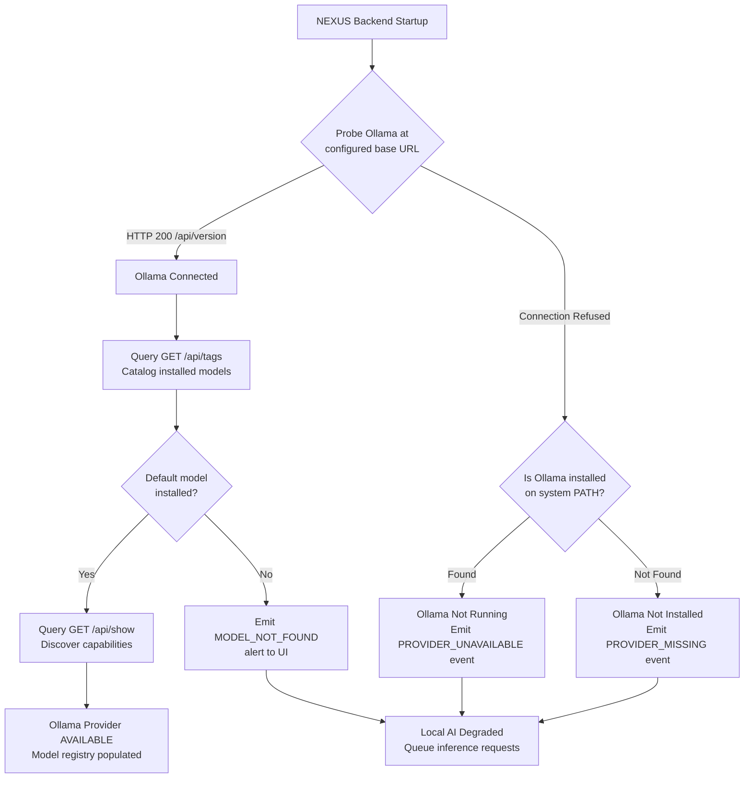

### 7.2 Ollama Adapter Extension

The existing `OllamaAdapter` in `ai/ollama_adapter.py` (200 lines) is extended with the following capabilities. All existing methods (`check_health`, `list_models`, `chat`, `chat_stream`, `_build_payload`) remain unchanged.

| Capability | Ollama API Endpoint | Implementation Status |
| :--- | :--- | :--- |
| **Runtime Version** | `GET /api/version` | **Existing** — `check_health()` probes this. Enhance to capture version string. |
| **Model Listing** | `GET /api/tags` | **Existing** — `list_models()` returns `ModelInfo` list with name, size, family, param size, quantization. |
| **Model Metadata** | `GET /api/show` | **Proposed** — New method to query context window (`num_ctx`), parameter count, template format, model digest hash. |
| **Capability Verification** | `POST /api/chat` (test call) | **Proposed** — Sends minimal test prompt to verify tool-call and structured-output support at registration time. |
| **Model Loading** | `POST /api/chat` (first request) | Ollama auto-loads models on first request; NEXUS detects loading state via response timing. |
| **Running Models** | `GET /api/ps` | **Proposed** — New probe to inspect which models are currently loaded in memory. |
| **Health State** | `GET /api/version` + `GET /api/ps` | **Proposed** — Combines version check with running model inspection for granular `ProviderHealthState`. |
| **Cancellation** | HTTP client socket close | **Existing** — Aborting the `httpx` stream causes Ollama to halt generation. |

### 7.3 Connection Configuration

The following settings extend the existing `Settings` class in `config.py`:

```python
# Proposed additions to config.py Settings class

# Ollama Local Runtime (extends existing OLLAMA_BASE_URL, OLLAMA_DEFAULT_MODEL, OLLAMA_MODEL)
OLLAMA_TIMEOUT_SECONDS: float = 120.0
OLLAMA_HEALTH_CHECK_INTERVAL_SECONDS: float = 60.0
OLLAMA_DEFAULT_NUM_CTX: int = 32768

# Provider Registry
EXTERNAL_PROVIDERS_ENABLED: bool = False    # Master switch — disabled by default
LOCAL_ONLY_MODE: bool = True                # Privacy enforcement toggle

# Resource Limits
MAX_CONCURRENT_INFERENCE_REQUESTS: int = 1  # MVP: serial inference
INFERENCE_QUEUE_MAX_SIZE: int = 10
```

### 7.4 Runtime Failure Handling

| Failure Scenario | Detection | System Behavior |
| :--- | :--- | :--- |
| **Ollama not installed** | Binary not found on PATH; connection refused on startup probe | Emit `provider.missing` event. Display setup guidance in UI. Queue inference requests in `PENDING` state. |
| **Ollama not running** | Connection refused on configured `OLLAMA_BASE_URL` | Emit `provider.unavailable` event. Attempt 3 reconnection probes at 10s intervals. Alert user. |
| **Ollama running, model not installed** | `GET /api/tags` returns empty list or requested model absent | Emit `model.not_found` event. Display model installation guidance in UI. Do not auto-pull. |
| **Ollama busy (model loading)** | Response latency > 30s on first request | Emit `provider.loading_model` health state. Report loading status to user. Do not time out prematurely. |
| **Ollama OOM / crash during inference** | HTTP stream terminated unexpectedly; non-zero error in NDJSON | Emit `inference.failed` event. Transition task step to error state. Attempt fallback if configured. |
| **Ollama version incompatible** | `/api/version` returns version < minimum required | Emit `provider.misconfigured` event. Log version mismatch. Continue with capability degradation warnings. |

**Critical Rule**: NEXUS does not assume a model is available merely because it appears in configuration. Model availability is verified at task launch time via `GET /api/tags`.

### 7.5 Model Download and Installation

NEXUS does not manage model downloads in MVP. Model installation is the user's responsibility:

1. User installs models via `ollama pull <model>` CLI.
2. NEXUS discovers installed models via `GET /api/tags` at startup and periodic refresh.
3. If a configured default model is not installed, NEXUS emits a `model.not_found` event with actionable guidance ("Run `ollama pull qwen2.5-coder:14b` to install").
4. **TBD-MR-02**: V1 may expose Ollama's `POST /api/pull` endpoint via the NEXUS UI, subject to approval.

### 7.6 Model Loading and Unloading

Ollama manages model loading and unloading internally:

1. Models are loaded into memory on first inference request.
2. Ollama auto-unloads idle models after a configurable timeout (default: 5 minutes).
3. NEXUS detects the loading state by monitoring response latency and the `GET /api/ps` endpoint.
4. During model loading, the provider health state transitions to `LOADING_MODEL`.
5. NEXUS does not explicitly request model loading or unloading in MVP.

### 7.7 Runtime Startup and Shutdown

1. **Startup**: NEXUS probes Ollama at `OLLAMA_BASE_URL` during backend startup. If Ollama is not reachable, the backend starts in degraded mode — all non-AI features remain functional.
2. **Shutdown**: NEXUS does not manage Ollama's lifecycle. Ollama runs as an independent system service. Backend shutdown cleanly closes all active `httpx` connections.
3. **Reconnection**: If Ollama becomes available after backend startup, periodic health probes (60s interval) detect the change and automatically populate the model registry.

---

## 8. External Model Providers

### 8.1 Registration & Consent Architecture

External providers are opt-in and subject to explicit, project-level consent:

```
+---------------------------------------------------------------------------------------------------+
|                              EXTERNAL PROVIDER CONSENT & DATA ROUTING                              |
+---------------------------------------------------------------------------------------------------+
|                                                                                                    |
|  [ User Configures Provider ]                                                                      |
|        │                                                                                           |
|        ▼                                                                                           |
|  [ Credential Stored in OS Keyring ]  ──>  NEVER in SQLite, .env, or logs                         |
|        │                                                                                           |
|        ▼                                                                                           |
|  [ Project-Level Opt-In Toggle ]  ──>  Each project independently enables/disables                |
|        │                                                                                           |
|        ▼                                                                                           |
|  [ Inference Request ]  ──>  [ Privacy Gate: Is external routing permitted? ]                      |
|                                     │                            │                                 |
|                                 NO  │                        YES │                                 |
|                                     ▼                            ▼                                 |
|                            [ Reject / Use Local ]     [ Redact Secrets ]                           |
|                                                              │                                     |
|                                                              ▼                                     |
|                                                   [ Send to Provider via TLS 1.3 ]                 |
|                                                   [ Log: "External provider used" ]                |
+---------------------------------------------------------------------------------------------------+
```

### 8.2 Supported External Provider Adapters

No single external provider is hardcoded as the only supported option. The provider abstraction supports any provider that implements the `ModelProvider` interface:

| Provider | Adapter Class | Auth Method | Streaming Format | Tool Calling | Phase |
| :--- | :--- | :--- | :--- | :--- | :--- |
| **OpenAI-Compatible** | `OpenAICompatibleAdapter` | API Key (Bearer) | SSE (`data: [DONE]`) | Native JSON Schema | MVP |
| **Anthropic Claude** | `AnthropicAdapter` | API Key (`x-api-key`) | SSE (`content_block_delta`) | Tool Use Blocks | V1 |
| **Google Gemini** | `GeminiAdapter` | API Key (query param) | REST / gRPC stream | Function Declarations | V1 |
| **DeepSeek** | `OpenAICompatibleAdapter` | API Key (Bearer) | SSE (OpenAI-format) | JSON Tool Calls | V1 |
| **Custom / Self-Hosted** | `OpenAICompatibleAdapter` | Configurable | SSE (OpenAI-format) | Provider-dependent | V1 |

### 8.3 External Provider Security Constraints

1. **Credential Isolation**: API keys are stored in the Windows Credential Manager via the `keyring` library (per Security Architecture §30). Keys are decrypted into a memory arena, used for the request, and zeroed after use.
2. **Pre-Transmission Secret Redaction**: Before any prompt content is sent to an external provider, the pre-persistence redaction engine (per Observability Architecture §4) scans and strips API keys, passwords, and secrets from the message payload.
3. **No Credential Logging**: API keys are never logged, emitted in events, or displayed in the UI. Error messages referencing credentials display redacted placeholders (`sk-****...****`).
4. **Provider Disclosure**: When a task uses a remote model, the UI displays a visible indicator and the `inference.started` event records `provider_type: "remote"`.
5. **TLS Enforcement**: All external provider communication uses TLS 1.2+ (TLS 1.3 preferred). Certificate validation is enforced; self-signed certificates are not accepted by default.

### 8.4 External Provider Configuration

```python
# Conceptual provider configuration schema (Pydantic v2)
class ExternalProviderConfig(BaseModel):
    """Configuration for an external AI model provider."""
    provider_id: str                     # e.g., "openai", "anthropic"
    display_name: str                    # e.g., "OpenAI"
    base_url: str                        # e.g., "https://api.openai.com/v1"
    enabled: bool = False                # Disabled by default
    credential_key: str                  # OS Keyring lookup key
    default_model: str                   # e.g., "gpt-4o"
    timeout_seconds: float = 60.0
    max_retries: int = 3
    rate_limit_rpm: int | None = None    # Requests per minute cap
    supported_models: list[str] = []     # Allowlisted model identifiers
```

### 8.5 Provider Registration

New external providers are registered through:

1. **Configuration file** (`~/.nexus/config.toml`) — static provider definitions.
2. **Settings UI** — user configures provider ID, base URL, credential key, and supported models.
3. **Runtime validation** — on registration, NEXUS probes the provider's health endpoint and lists available models.
4. Provider registration does not activate the provider for any project. Project-level opt-in is required separately.

### 8.6 Request and Rate Limits

| Constraint | Enforcement | Behavior on Violation |
| :--- | :--- | :--- |
| Requests per minute | In-memory sliding window counter | Delay request; emit `provider.rate_limited` event |
| Provider-reported rate limit (429) | Parse `Retry-After` header | Wait specified duration; retry up to 3 times |
| Network timeout | `httpx` timeout configuration | Raise `LLMConnectionError`; retry if retryable |
| Maximum request payload | Provider-specific limit | Validate before transmission; raise `ContextOverflowError` |

### 8.7 Usage Reporting

Each external provider request records:
- Token usage (prompt + completion) from provider response headers/body
- Estimated cost (if pricing metadata available in provider config)
- Request latency
- Provider ID and model ID

Usage data is stored locally and never transmitted externally.

### 8.8 Provider Availability

External provider availability is determined by:
1. **Health probes** at configured intervals (default: 120s for external).
2. **Credential validation** — provider marked `AUTH_REQUIRED` if credential key is missing or invalid.
3. **Model availability** — provider lists models on registration; unavailable models are flagged.
4. **Network reachability** — DNS resolution and TCP connection are verified during health probes.

---

## 9. Model Registry & Capability Metadata

### 9.1 Registry Architecture

The Model Registry is an in-memory cache (MVP) backed by periodic Ollama discovery and static external provider configuration. It maintains a unified catalog of all configured and discovered models.

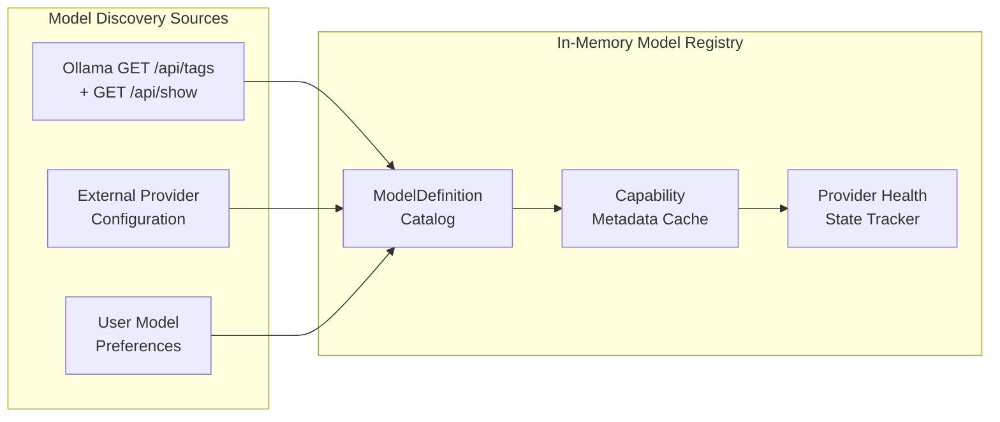

### 9.2 Model Definition Schema

```python
@dataclass
class ModelDefinition:
    """Registry entry for a configured or discovered model."""
    
    # Identity
    model_id: str                        # Provider-specific identifier (e.g., "qwen2.5-coder:14b")
    provider_id: str                     # Provider that serves this model (e.g., "ollama")
    display_name: str                    # Human-readable name (e.g., "Qwen 2.5 Coder 14B")
    
    # Classification
    provider_type: ProviderType          # LOCAL or REMOTE
    runtime_type: str                    # "ollama", "openai_compatible", "anthropic", etc.
    
    # Version & Metadata
    model_version: str = ""              # Model version identifier
    model_digest: str = ""               # Content hash for change detection
    family: str = ""                     # Model family (e.g., "qwen2.5")
    parameter_size: str = ""             # e.g., "14B"
    quantization_level: str = ""         # e.g., "Q4_K_M"
    size_bytes: int = 0                  # Weight file size on disk
    
    # Capabilities (verified or declared)
    context_window: int = 0              # Maximum context tokens
    max_output_tokens: int | None = None
    supports_streaming: bool = True
    supports_tool_calling: bool = False
    supports_structured_output: bool = False
    supports_vision: bool = False
    supported_input_modalities: list[str] = field(default_factory=lambda: ["text"])
    supports_embedding: bool = False     # Whether model supports embedding generation
    
    # Verification
    capabilities_verified: bool = False  # True if verified via runtime test
    capabilities_source: str = "declared"  # "declared", "runtime_verified", "user_configured"
    
    # Availability
    availability: str = "unknown"        # "available", "not_installed", "loading", "unavailable"
    last_health_check: str = ""
    
    # Resource Requirements (estimated)
    estimated_vram_mb: int = 0
    estimated_ram_mb: int = 0
    
    # Configuration Parameters
    default_temperature: float = 0.2
    default_num_ctx: int | None = None   # Override for context window
```

### 9.3 Capability Verification Protocol

Provider-declared capabilities are not trusted by default. NEXUS verifies critical capabilities at model registration time:

| Capability | Verification Method | Fallback on Failure |
| :--- | :--- | :--- |
| **Context Window** | Parse `num_ctx` from Ollama `/api/show`; external providers use declared limits | Default to 4096 if unknown |
| **Streaming** | All HTTP-based providers assumed to support streaming | Fallback to non-streaming `chat()` |
| **Tool Calling** | Send test prompt with minimal tool definition; validate response format | Mark `supports_tool_calling = False` |
| **Structured Output** | Send test prompt with JSON schema constraint; validate output parsability | Mark `supports_structured_output = False` |
| **Vision** | Check model metadata for multimodal support flags | Mark `supports_vision = False` |

Capability verification test prompts are minimal (< 50 tokens input) and do not process user data. Verification occurs once per model registration, not per inference request.

### 9.4 Distinguishing Verified vs. Declared Capabilities

| Source | `capabilities_source` Value | Trust Level | Usage |
| :--- | :--- | :--- | :--- |
| Ollama `/api/show` metadata | `"declared"` | Low — provider claims, not verified | Used as initial defaults |
| NEXUS runtime test prompt | `"runtime_verified"` | High — empirically confirmed | Preferred for routing decisions |
| User manual override | `"user_configured"` | Medium — user knows their setup | Overrides declared if set |

The `ModelRouter` (§10) prefers runtime-verified models over declared-only models when multiple candidates exist.

### 9.5 Registry Refresh Policy

| Event | Refresh Action |
| :--- | :--- |
| Backend startup | Full discovery: Ollama model list + health probe |
| Periodic timer (60s) | Lightweight health probe (Ollama version check only) |
| User changes model config | Targeted model capability verification |
| Provider health state change | Re-probe affected provider's model list |
| Explicit user refresh action | Full re-discovery of all providers |
| Model not found during routing | Immediate re-discovery of the affected provider |

### 9.6 Handling Unsupported Capabilities

When an agent requires a capability the selected model does not support:

1. The `ModelRouter` attempts to find an alternative model with the required capability.
2. If no alternative is found locally and external providers are not permitted, the system emits a `model.capability_mismatch` event.
3. The user is notified with specific guidance: "Planner agent requires structured output, but the selected model does not support it. Consider using model X or enabling external providers."
4. The task step fails safely — it does not proceed with degraded capability unless the capability is explicitly optional for the agent.

---

## 10. Agent-to-Model Routing

### 10.1 Routing Decision Flow

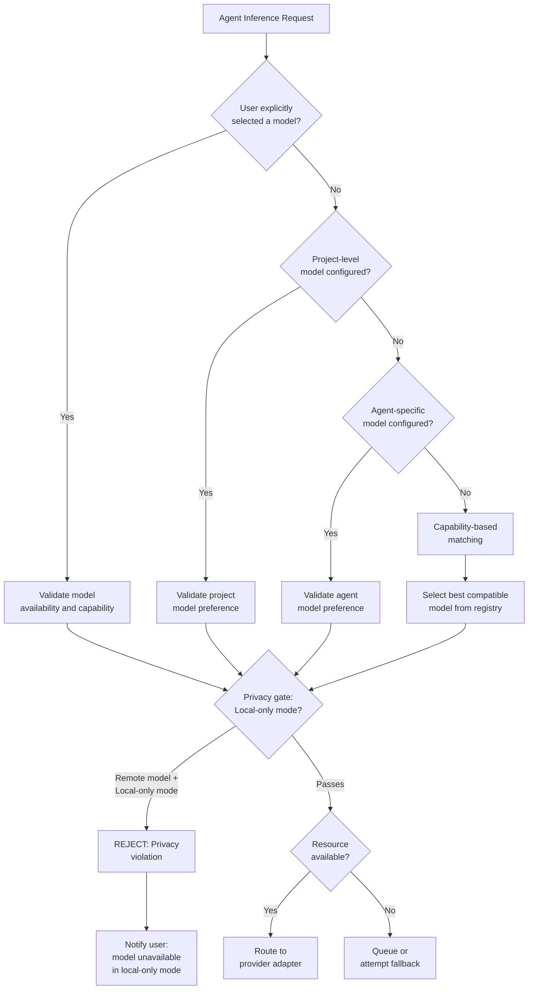

### 10.2 Routing Precedence Order

1. **Explicit User Selection** — Model specified at task creation time via `model_override` field (per API contract in `POST /api/v1/projects/{project_id}/tasks`).
2. **Project-Level Configuration** — Model configured in `.nexus/config.json` or project settings UI.
3. **Agent-Specific Configuration** — Model assigned to a specific agent type in global config (`~/.nexus/config.toml`).
4. **Task Requirement & Capability Matching** — System selects the best available model based on:
   - Required capabilities (tool calling, structured output, context window)
   - Agent type and task complexity heuristics
   - Local availability preference
5. **System Default** — Falls back to `OLLAMA_DEFAULT_MODEL` from `config.py` (currently `qwen2.5-coder:14b`).

### 10.3 Agent Capability Requirements Matrix

| Agent | Minimum Context | Tool Calling Required | Structured Output | Latency Sensitivity | Recommended Model Class |
| :--- | :--- | :--- | :--- | :--- | :--- |
| **Planner** | 32K tokens | No | Yes (PlanDocument) | Low | Large reasoning model (14B+) |
| **Developer** | 32K tokens | Yes | Yes (CodeExecution) | Medium | Code-specialized model |
| **Tester** | 16K tokens | Yes | Yes (TestReport) | Medium | Code-specialized model |
| **Debugger** | 32K tokens | Yes | Yes (PatchProposal) | Medium | Large reasoning model |
| **Security** | 16K tokens | No | Yes (SecurityAudit) | Low | General-purpose model |
| **Reviewer** | 16K tokens | No | Yes (ReviewSummary) | Low | General-purpose model |

### 10.4 Capability Matching Algorithm

```python
def select_model(
    required_capabilities: set[str],
    min_context_window: int,
    privacy_mode: str,          # "local_only" | "prefer_local" | "allow_external"
    available_models: list[ModelDefinition],
) -> ModelDefinition | None:
    """Select the best model matching requirements.
    
    Filters by:
      1. Privacy constraints (exclude remote if local_only)
      2. Required capabilities (tool_calling, structured_output)
      3. Minimum context window
      4. Availability status
    Ranks by:
      1. Local models preferred over remote
      2. Larger context window preferred
      3. Capabilities-verified models preferred over declared-only
    """
    candidates = [
        m for m in available_models
        if m.availability == "available"
        and m.context_window >= min_context_window
        and _has_capabilities(m, required_capabilities)
        and _passes_privacy_filter(m, privacy_mode)
    ]
    
    if not candidates:
        return None
    
    # Rank: local first, then by context window, then by verification status
    candidates.sort(key=lambda m: (
        0 if m.provider_type == ProviderType.LOCAL else 1,
        -m.context_window,
        0 if m.capabilities_verified else 1,
    ))
    
    return candidates[0]


def _has_capabilities(model: ModelDefinition, required: set[str]) -> bool:
    """Check if model satisfies all required capabilities."""
    capability_map = {
        "tool_calling": model.supports_tool_calling,
        "structured_output": model.supports_structured_output,
        "vision": model.supports_vision,
        "streaming": model.supports_streaming,
    }
    return all(capability_map.get(cap, False) for cap in required)


def _passes_privacy_filter(model: ModelDefinition, privacy_mode: str) -> bool:
    """Check if model passes privacy constraints."""
    if privacy_mode == "local_only":
        return model.provider_type == ProviderType.LOCAL
    return True  # "prefer_local" and "allow_external" accept all
```

---

## 11. Model Selection & Fallback Policy

### 11.1 Fallback Decision Matrix

| Failure Scenario | Fallback Action | Privacy Constraint | User Notification |
| :--- | :--- | :--- | :--- |
| **Requested model unavailable** | Select next compatible local model | Must respect `local_only_mode` | Info toast: "Model X unavailable, using Y" |
| **Model lacks required capability** | Select capable model from registry | Must respect privacy settings | Info toast with capability mismatch details |
| **Context exceeds model limit** | Truncate context (per §14); if still too large, select larger-context model | Same provider type preference | Warning: "Context truncated to fit model limit" |
| **Local hardware overloaded** | Queue request; do NOT auto-route to external | Never silently switch to external | Warning: "Inference queued — system under load" |
| **Provider times out** | Retry up to 2 times with backoff; then fail task step | N/A | Error: "Model provider timed out" |
| **Provider rate limit reached** | Wait `retry_after_seconds`; retry up to 3 times | N/A | Warning: "Rate limit reached, retrying in Ns" |
| **Invalid structured output** | Retry with prompt repair up to 2 times | Same provider | Warning after 2nd failure |
| **Tool calling fails** | Retry with simplified tool schema up to 2 times | Same provider | Warning after 2nd failure |
| **Model removed or updated** | Re-discover models; select replacement | Must match original provider type | Alert: "Model X no longer available" |

### 11.2 Privacy-Safe Fallback Rules

```
CRITICAL INVARIANT:
  If the user has configured `local_only_mode = true` for a project,
  the system MUST NEVER fall back to an external provider —
  even if all local models are unavailable.
  
  Instead, the system MUST:
    1. Queue the request if transient failure is suspected.
    2. Alert the user with actionable guidance.
    3. Fail the task step safely if no local model can serve the request.
```

### 11.3 Fallback Flow

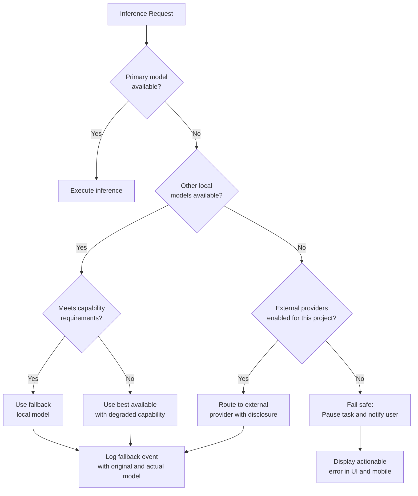

### 11.4 When to Retry vs. Fail vs. Request User Input

| Condition | Action |
| :--- | :--- |
| Transient provider error (connection timeout, 5xx) | Retry with backoff |
| Rate limit (429) | Wait and retry |
| Permanent provider error (auth failure, model not found) | Fail immediately; notify user |
| Invalid structured output | Retry with prompt repair |
| All local models unavailable + local-only mode | Fail safely; request user to install models or disable local-only |
| All providers unavailable | Fail safely; display comprehensive diagnostics |

---

## 12. Inference Request Lifecycle

### 12.1 Complete Lifecycle Sequence

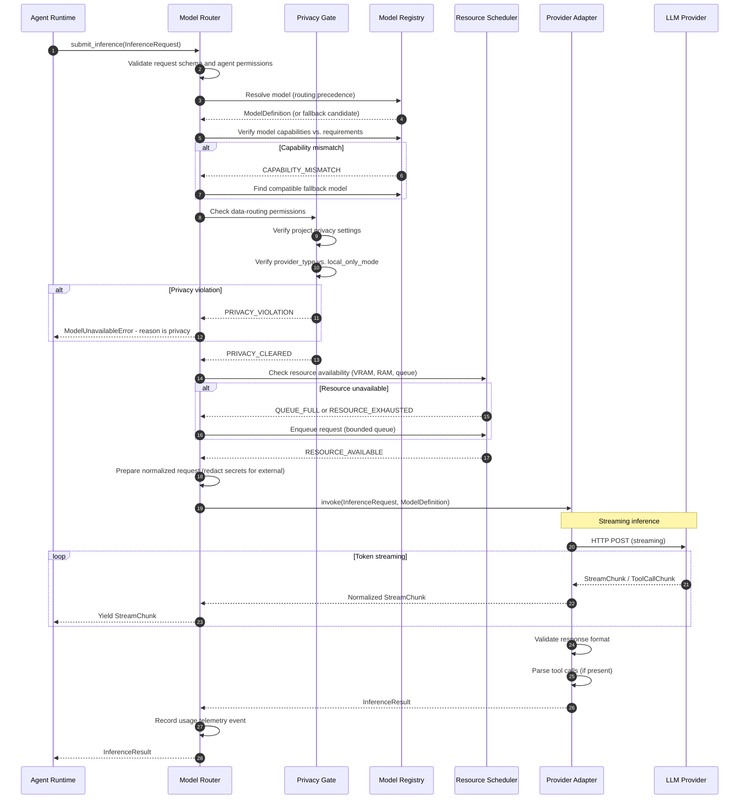

### 12.2 Cancellation Behavior

| Trigger | Cancellation Mechanism | Resource Cleanup |
| :--- | :--- | :--- |
| User clicks "Cancel Task" | `task.is_cancelled` flag propagated via `asyncio.Event` | HTTP client socket closed immediately; Ollama halts token generation |
| Approval timeout (15 min) | `ApprovalTimeoutError` raised (existing `core/exceptions.py`) | In-flight inference cancelled if task was waiting for tool approval mid-stream |
| System resource pressure | Resource scheduler preempts lowest-priority request | HTTP stream aborted; request re-queued when resources free |
| Agent runtime cancellation | Agent context manager `__aexit__` triggers cleanup | Pending inference requests cancelled; partial results discarded |

### 12.3 Timeout Policy (Aligned with API Gateway INT-05 / INT-06)

| Provider Type | Request Timeout | First-Token Timeout | Health Check Timeout |
| :--- | :--- | :--- | :--- |
| **Ollama (Local)** | 120s | 60s (model loading) | 5s |
| **External API** | 60s | 30s | 10s |
| **Tool-Call Inference** | 180s | 60s | 5s |

### 12.4 Partial Response and Interrupted Stream Handling

When a stream is interrupted (timeout, cancellation, network error):

1. Tokens already received are preserved in a partial `InferenceResult` with `finish_reason = "interrupted"`.
2. The partial result is returned to the agent with a flag indicating incomplete generation.
3. The agent runtime decides whether to use the partial content, retry, or fail the task step.
4. Partial responses are never presented to the user as complete results.

---

## 13. Structured Outputs & Tool Calling

### 13.1 Structured Output Validation Pipeline

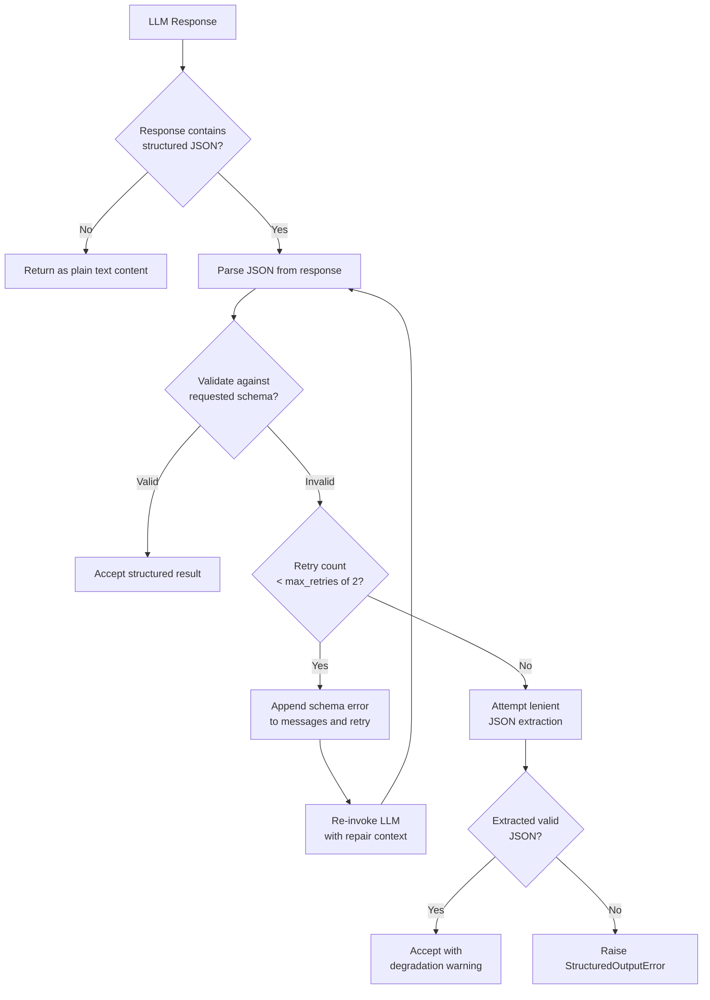

### 13.2 Schema Validation

Structured output validation uses Pydantic v2 schema validation (consistent with the existing schema layer in `schemas/`):

1. The agent specifies a JSON schema (derived from a Pydantic model) in the `InferenceRequest.response_format` field.
2. The model's response is parsed and validated against this schema.
3. Validation errors include field-level details (missing fields, type mismatches, constraint violations).
4. Repair prompts include the specific validation error, not just a generic retry instruction.

### 13.3 Tool-Call Authorization Pipeline

Model-generated tool calls are **untrusted input**. They must pass through the existing 5-Tier Permission Gate (per Security Architecture §5 and Backend Architecture §50) before any execution.

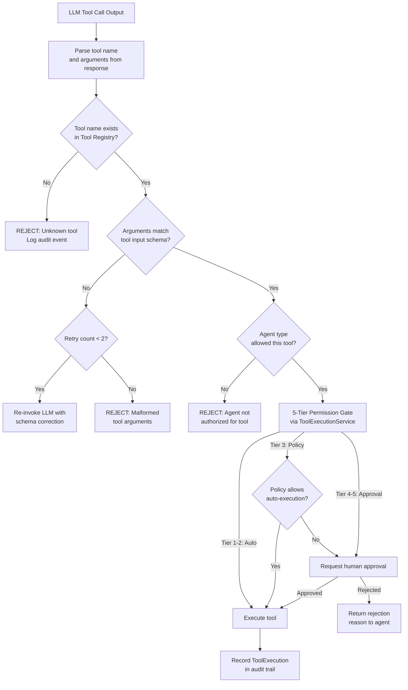

### 13.4 Tool-Call Contract Enforcement

1. **Tool Registry Binding**: Tool calls must reference tools in the `ToolRegistry` (`tools/registry.py`). The LLM cannot invent new tool names.
2. **Schema Validation**: Tool arguments are validated against the tool's `input_schema` (Pydantic v2) before execution.
3. **Agent Permission Matrix**: Tool calls are filtered by the agent-to-tool permission matrix (Backend Architecture §50). A Planner agent cannot call `write_file`; a Security agent cannot call `git_commit`.
4. **Sandbox Enforcement**: Tool calls requiring subprocess execution route through the Docker sandbox (per Security Architecture) or host boundary guard.
5. **Retry Limits**: Malformed tool-call outputs trigger up to 2 re-invocations with schema correction context. After 2 failures, the tool call is rejected and the error is reported to the orchestrator.
6. **Rejected Tool-Call Behavior**: When a tool call is rejected (unknown tool, schema violation, permission denied), the rejection reason is included in the next inference request so the agent can adjust its approach.

### 13.5 Structured Response Versioning

Agent output schemas are versioned alongside agent implementations. When a schema version changes:

1. In-flight tasks continue using the schema version from task creation time.
2. New tasks use the current schema version.
3. Schema backward compatibility is maintained for at least one major version.

---

## 14. Context-Window Management

### 14.1 Context Budget Allocation

Context budget management aligns with the Agent Memory, Knowledge & Retrieval Architecture and the existing Context Assembler concept (`orchestration/context.py`).

```
+---------------------------------------------------------------------------------------------------+
|                           CONTEXT WINDOW BUDGET ALLOCATION                                         |
+---------------------------------------------------------------------------------------------------+
| Priority | Category                    | Budget Share | Truncation Policy                          |
|----------|-----------------------------|--------------|-------------------------------------------|
| 1 (Fixed)| System Prompt & Safety      | 2,000 tokens | NEVER truncated — security invariant       |
| 2 (Fixed)| Agent Persona & Instructions| 1,500 tokens | NEVER truncated — agent identity           |
| 3 (High) | User Task Goal & Constraints| 1,000 tokens | Summarized if > budget                     |
| 4 (High) | Active Plan / Step Context  | 3,000 tokens | Compress completed steps                   |
| 5 (Med)  | RAG Retrieved Code Chunks   | Dynamic      | RRF-ranked; lowest-scoring chunks dropped  |
| 6 (Med)  | Tool Results & File Diffs   | Dynamic      | Truncate large outputs to 2,000 tokens     |
| 7 (Low)  | Conversation / Task History | Dynamic      | Sliding window; oldest messages removed    |
| 8 (Rsv)  | Output Token Reservation    | 4,096 tokens | Reserved for model generation output       |
+---------------------------------------------------------------------------------------------------+
```

### 14.2 Context Overflow Handling

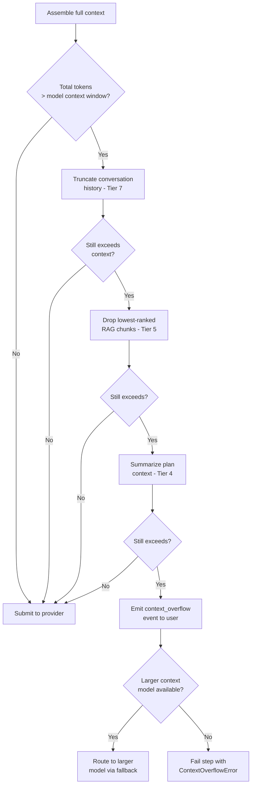

### 14.3 Critical Context Invariants

1. **System prompt safety instructions** and **agent persona** are **never truncated**. They form the security boundary preventing prompt injection.
2. **User task constraints** (e.g., "do not modify files in `vendor/`") are **never silently discarded**. If truncation would remove a user constraint, the system reports a `ContextOverflowError` instead.
3. **Output token reservation** is always subtracted from the available context budget before content assembly.
4. The system reports to the user when task complexity exceeds available context or model capability, including actionable guidance (e.g., "Consider using a model with a larger context window").
5. **Security instructions and approval requirements** are never truncated — they are Priority 1/Fixed.

### 14.4 Token Counting

Token estimation uses the following strategy (per TBD-MR-05):

1. **Model-specific tokenizer** when available (e.g., model's published tokenizer).
2. **`tiktoken`** for OpenAI-compatible models.
3. **Character-based estimation** (4 characters per token) as a last resort with a 10% safety buffer.

The system always uses conservative estimates (rounding up) to avoid exceeding context limits.

---

## 15. Resource Management

### 15.1 Resource-Aware Inference Scheduling

Aligned with the Performance, Resource Management & Scalability Architecture:

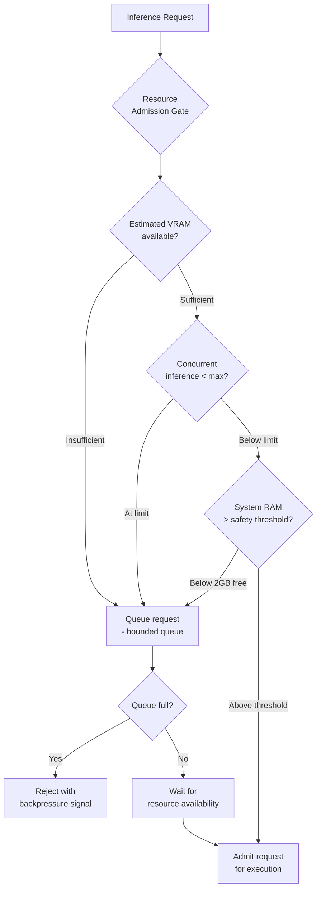

### 15.2 Resource Budget Matrix

| Subsystem | Resource Budget | Enforcement | Source |
| :--- | :--- | :--- | :--- |
| **Ollama Inference** | Up to 16GB VRAM / RAM | Ollama runtime GPU layer limits | Backend Architecture §42 |
| **Concurrent Inference** | 1 active request (MVP) | In-process `asyncio.Semaphore` | This document |
| **Inference Queue** | 10 pending requests max | Bounded `asyncio.Queue` | This document |
| **Model Loading Memory** | Ollama-managed | Ollama auto-unloads idle models after timeout | Ollama runtime |
| **Docker Sandbox** | 2GB RAM / 2.0 CPUs | Docker cgroups | Backend Architecture §42 |
| **Embedding Engine** | 1GB RAM | ONNX Runtime thread pool | Backend Architecture §42 |
| **Backend Process** | 512MB RSS | Process monitoring | Backend Architecture §42 |

### 15.3 Contention Resolution

| Contention Scenario | Resolution | Priority |
| :--- | :--- | :--- |
| Inference vs. Background Indexing | Pause indexing during active inference | Inference > Indexing |
| Inference vs. Docker Test Execution | Allow concurrent (separate resource pools) | Equal |
| Multiple inference requests | Serial execution with FIFO queue (MVP) | First-come-first-served |
| Inference vs. UI Responsiveness | Inference runs on background thread; UI never blocked | UI > Inference |

### 15.4 Thermal and Resource Pressure

Where observable (via `psutil` CPU frequency and temperature APIs on supported hardware):

1. If CPU temperature exceeds safe thresholds, the system logs a warning but does not throttle inference — Ollama and the OS manage thermal throttling.
2. If available RAM drops below 1GB, the system pauses non-critical background tasks (indexing, log rotation) to free memory.
3. The system does not assume specific hardware specifications. Resource checks use runtime-detected values.

---

## 16. Privacy & Data Routing

### 16.1 Data Routing Rules

```
+---------------------------------------------------------------------------------------------------+
|                                DATA ROUTING DECISION MATRIX                                        |
+---------------------------------------------------------------------------------------------------+
| Privacy Setting              | Local Model          | External Model        | Behavior             |
|------------------------------|----------------------|-----------------------|----------------------|
| local_only_mode = true       | ALLOWED              | BLOCKED               | Strict local-only    |
| local_only_mode = false +    | ALLOWED              | ALLOWED               | External opt-in      |
|   project external_enabled   |                      | (with disclosure)     |                      |
| local_only_mode = false +    | ALLOWED              | BLOCKED               | Per-project control  |
|   project external_disabled  |                      |                       |                      |
+---------------------------------------------------------------------------------------------------+
```

### 16.2 Privacy Enforcement Checklist

- [ ] External providers are disabled by default (`EXTERNAL_PROVIDERS_ENABLED = False`).
- [ ] Each project independently opts in/out of external model usage.
- [ ] The UI displays a visible indicator when a remote model is in use.
- [ ] The `inference.started` event records `provider_type` for auditability.
- [ ] Secret redaction runs on all content before transmission to external providers.
- [ ] API keys are never stored in SQLite, logs, `.env` files, or event payloads.
- [ ] The system never silently switches from local to external inference.
- [ ] Fallback chains respect the project's privacy configuration.
- [ ] Data retention policies for external providers are documented and disclosed.
- [ ] Logging of prompt content to external providers is restricted per Observability Architecture §4.

### 16.3 Sensitive Data Classification

| Data Type | Classification | Local Inference | External Inference |
| :--- | :--- | :--- | :--- |
| Source code files | Sensitive (Proprietary) | Allowed | Allowed only if project opts in |
| API keys / secrets | Critical | Redacted before prompt assembly | Redacted before transmission |
| User task descriptions | Standard | Allowed | Allowed if project opts in |
| Test results / error traces | Standard | Allowed | Allowed if project opts in |
| Git diffs | Sensitive (Proprietary) | Allowed | Allowed only if project opts in |
| System prompt / agent instructions | Internal | Allowed | Allowed (no proprietary content) |

### 16.4 Provider Disclosure

The system makes it clear when a task uses a remote model:

1. **UI Indicator**: A visible badge appears in the task panel showing the external provider and model.
2. **Event Logging**: `inference.started` events include `provider_type: "remote"` and `provider_id`.
3. **Mobile Companion**: Approval requests display which model is being used (local vs. external).
4. **Task History**: Task step records include the provider and model used for each inference.

---

## 17. Model Configuration & User Control

### 17.1 Configuration Hierarchy

```
+---------------------------------------------------------------------------------------------------+
|                           NEXUS MODEL CONFIGURATION HIERARCHY                                      |
+---------------------------------------------------------------------------------------------------+
| Priority | Source                          | Scope           | Storage                            |
|----------|--------------------------------|-----------------|------------------------------------+
| 1 (High) | Task-level model_override      | Single task     | Task record in SQLite              |
| 2        | Session model selection (UI)    | Current session | In-memory volatile                 |
| 3        | Project-level model config     | Per project     | .nexus/config.json                 |
| 4        | Agent-specific model config    | Per agent type  | ~/.nexus/config.toml               |
| 5        | Global default model           | System-wide     | ~/.nexus/config.toml               |
| 6 (Low)  | Hardcoded system default       | Fallback        | config.py OLLAMA_DEFAULT_MODEL     |
+---------------------------------------------------------------------------------------------------+
```

### 17.2 User-Configurable Parameters

| Parameter | Scope | Default | Validation |
| :--- | :--- | :--- | :--- |
| **Default Model** | Global / Project | `qwen2.5-coder:14b` | Must exist in model registry |
| **Agent-Specific Model** | Per agent type | Inherits global default | Must meet agent capability requirements |
| **Temperature** | Global / Task | `0.2` | Range: `0.0` – `2.0` |
| **Max Output Tokens** | Global / Task | Model default | Range: `1` – model max |
| **Context Window Override** | Per model | Model detected limit | Range: `1024` – model max |
| **Local-Only Mode** | Global / Project | `true` | Boolean |
| **External Providers Enabled** | Global | `false` | Boolean |
| **Max Concurrent Inference** | Global | `1` | Range: `1` – `4` |
| **Fallback Preference** | Global | `local_only` | Enum: `local_only`, `prefer_local`, `allow_external` |

### 17.3 Configuration Validation Rules

1. Model identifiers are validated against the active model registry at configuration time.
2. Temperature values outside `[0.0, 2.0]` are rejected with a `ValidationError` (existing `core/exceptions.py`).
3. Context window overrides exceeding the model's actual limit emit a warning and are clamped to the model maximum.
4. Unsupported provider-specific parameters (e.g., Anthropic `thinking` mode passed to Ollama) are silently ignored with a debug-level log entry. They do not cause errors and their effect is not misrepresented.
5. Configuration changes take effect for new inference requests; in-flight requests use the configuration snapshot from request creation time.

### 17.4 Configuration Persistence and Reset

1. Global settings persist in `~/.nexus/config.toml`.
2. Project settings persist in `.nexus/config.json` within the project workspace.
3. Task-level overrides persist in the task SQLite record for the task's lifetime.
4. Users can reset any configuration level to its parent default via the settings UI.
5. Configuration migration is handled when NEXUS updates introduce new settings — missing fields receive documented defaults.

### 17.5 Desktop & Mobile Capabilities (Conceptual)

**Desktop:**
- Model selection dropdown with capability badges (tool calling, structured output, vision)
- Provider health indicator (green/yellow/red dot per provider)
- Per-project privacy toggle for external providers
- Real-time token usage and inference latency display
- Model configuration panel for temperature, context, and fallback preferences
- Active model indicator showing which model is currently loaded

**Mobile Companion:**
- Read-only view of active model and provider status
- Push notification when model/provider becomes unavailable during task execution
- Approval actions display which model is being used (local vs. external disclosure)

No UI mockups or UI/UX design prompts are included in this document.

---

## 18. Provider Health & Reliability

### 18.1 Health State Machine

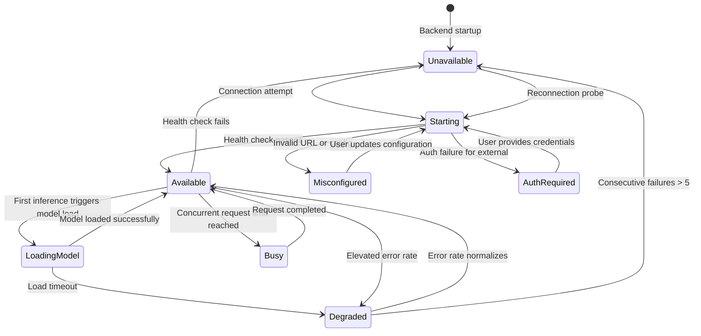

### 18.2 Health Check Configuration

| Parameter | Ollama (Local) | External Provider |
| :--- | :--- | :--- |
| **Check Interval** | 60 seconds | 120 seconds |
| **Check Timeout** | 5 seconds | 10 seconds |
| **Failure Threshold** | 3 consecutive failures to UNAVAILABLE | 5 consecutive failures to UNAVAILABLE |
| **Recovery Probe** | 10-second intervals after failure | 60-second intervals with exponential backoff |
| **Circuit Breaker** | Trips after 5 failures; half-open after 60s | Trips after 5 failures; half-open after 120s |

### 18.3 Circuit Breaker Integration

Aligned with the API Gateway reliability patterns (§18):

```
Backoff Formula: t_backoff = min(30.0s, 1.0s * 2^attempt) +/- jitter(0.2s)

Circuit Breaker States:
  CLOSED    -> Normal operation. Errors increment failure counter.
  OPEN      -> All requests fast-fail. Entered after 5 consecutive failures.
  HALF_OPEN -> After 60s probe delay, single test request sent.
               Success -> CLOSED. Failure -> OPEN (reset timer).
```

### 18.4 Stale Health Status

Health status is considered stale if more than 2x the check interval has elapsed since the last successful probe. Stale status triggers an immediate health re-probe before the next inference request. A stale provider is not used for routing until health is re-confirmed.

### 18.5 Failure Impact Isolation

A temporary provider failure must **never**:
- Corrupt task state in SQLite
- Produce a false task-completion result
- Silently switch providers in violation of privacy settings
- Leave orphaned Docker containers or PTY sessions
- Cause the desktop UI to freeze or become unresponsive
- Leave in-memory state inconsistent with persisted state

---

## 19. Model Versioning & Compatibility

### 19.1 Provenance Tracking

Every inference execution records the following provenance metadata in the `TaskStep` record:

| Field | Source | Purpose |
| :--- | :--- | :--- |
| `model_id` | Model registry | Exact model identifier used (e.g., `qwen2.5-coder:14b-instruct-q4_K_M`) |
| `model_digest` | Ollama `/api/show` | Content hash for reproducibility |
| `provider_id` | Provider adapter | Which provider served the request (e.g., `ollama`, `openai`) |
| `provider_type` | Provider config | `local` or `remote` |
| `context_window_used` | Context assembler | Tokens in assembled context |
| `temperature` | Inference request | Temperature parameter used |
| `tokens_used` | Provider response | Total tokens (prompt + completion) |
| `inference_latency_ms` | Router timer | End-to-end inference duration |

### 19.2 Model Update Impact

| Update Scenario | Impact | Mitigation |
| :--- | :--- | :--- |
| **Ollama model re-pulled (same tag)** | Underlying weights may change | Log model digest hash from `/api/show`; warn if digest changes between task steps |
| **Model removed from Ollama** | `GET /api/tags` no longer lists model | Registry refresh detects removal; emit `model.removed` event; select fallback |
| **External provider model deprecated** | API returns model-not-found error | Adapter catches error; route to configured replacement model |
| **Ollama version upgrade** | API behavior may change | Check `/api/version` at startup; log version; verify minimum compatibility |
| **Embedding model version change** | Vector similarity scores may drift | Out of scope for this document; handled by Agent Memory Architecture |

### 19.3 Compatibility Checks

Before a model is used for a task:
1. Model must appear in the current model registry (verified within last refresh cycle).
2. Model capabilities must meet the agent's minimum requirements (per §10.3).
3. Model context window must accommodate the estimated context budget.
4. Provider health state must be `AVAILABLE`, `BUSY` (will queue), or `LOADING_MODEL` (will wait).
5. If model digest has changed since the last task step, a warning event is emitted.

### 19.4 Prompt/Template Version Tracking

When agents use versioned prompt templates:
1. The template version is recorded alongside the model ID in the task step record.
2. Template changes trigger evaluation benchmarks (per AI Evaluation Architecture) to verify no regression.
3. Template versioning is the responsibility of the agent implementation, not the model runtime layer.

---

## 20. Observability & Usage Tracking

### 20.1 Structured Inference Events

All events use the existing `EventEnvelope` schema in `core/events.py`. The following event types are proposed additions to the `EventType` enum:

| Event Type | Trigger | Key Metadata |
| :--- | :--- | :--- |
| `inference.request_started` | Inference request submitted | `task_id`, `agent_type`, `model_id`, `provider_id`, `provider_type` |
| `inference.model_selected` | Model routing decision made | `requested_model`, `selected_model`, `selection_reason`, `fallback_used` |
| `inference.provider_selected` | Provider adapter chosen | `provider_id`, `provider_type`, `provider_health_state` |
| `inference.model_unavailable` | Requested model not found | `model_id`, `provider_id`, `fallback_attempted` |
| `inference.completed` | Inference response received | `model_id`, `prompt_tokens`, `completion_tokens`, `latency_ms`, `finish_reason` |
| `inference.failed` | Inference error occurred | `model_id`, `error_code`, `error_category`, `retryable`, `retry_count` |
| `inference.response_validation_failed` | Structured output or tool call invalid | `model_id`, `validation_error`, `retry_count` |
| `inference.tool_call_requested` | LLM emitted tool call | `tool_name`, `agent_type`, `risk_level` |
| `inference.fallback_attempted` | Primary model failed; fallback used | `original_model`, `fallback_model`, `fallback_reason` |
| `inference.cancelled` | User or system cancelled request | `task_id`, `cancel_reason`, `tokens_generated_before_cancel` |
| `inference.context_overflow` | Context exceeds model limit | `model_id`, `context_tokens`, `model_context_limit`, `truncation_applied` |
| `provider.health_changed` | Provider state transition | `provider_id`, `old_state`, `new_state`, `consecutive_failures` |

### 20.2 Usage Metrics

| Metric | Tracked Per | Storage | Retention |
| :--- | :--- | :--- | :--- |
| Total tokens (prompt + completion) | Task step | `task_steps.tokens_used` column | Task lifetime |
| Inference latency (ms) | Request | Event log | 30-day rolling |
| Provider error rate | Provider | In-memory gauge | Real-time |
| Model usage distribution | Day | Event log aggregation | 90-day rolling |
| Fallback frequency | Day | Event log aggregation | 90-day rolling |
| Context utilization ratio | Request | Event log | 30-day rolling |

### 20.3 Logging Constraints

- **Never log**: Full prompt content containing proprietary source code, API keys, or credentials.
- **Always redact**: Secrets detected by the pre-persistence redaction engine (Observability Architecture §4) before any log write.
- **Safe to log**: Model identifiers, token counts, latency, error codes, provider identifiers, and non-sensitive metadata.
- **External provider requests**: Log the provider ID, model ID, token counts, and latency. Do not log the request body or response content.

---

## 21. Testing & Evaluation

### 21.1 Test Categories

| Category | Test Scope | Technology | Phase |
| :--- | :--- | :--- | :--- |
| **Provider Interface Contract** | Verify `ModelProvider` ABC compliance for all adapters | `pytest` + mock providers | MVP |
| **Ollama Discovery** | Test runtime detection, model listing, health probing | `pytest` + `httpx` mock | MVP |
| **Model Availability** | Test behavior when models are missing, loading, or unavailable | `pytest` + mock Ollama responses | MVP |
| **Capability Matching** | Test routing algorithm with various capability requirements | `pytest` unit tests | MVP |
| **Routing Precedence** | Test all 6 precedence levels with overlapping configurations | `pytest` unit tests | MVP |
| **Privacy Enforcement** | Test `local_only_mode` blocks external routing under all conditions | `pytest` + security audit | MVP |
| **External Provider Opt-In** | Test external provider is never used without explicit consent | `pytest` + integration | MVP |
| **Structured Output Validation** | Test JSON schema validation and retry with prompt repair | `pytest` + mock LLM responses | MVP |
| **Tool-Call Authorization** | Test tool calls are routed through 5-Tier Permission Gate | `pytest` + mock tool registry | MVP |
| **Streaming and Cancellation** | Test token streaming, mid-stream cancellation, partial results | `pytest-asyncio` + mock streams | MVP |
| **Context Overflow** | Test truncation cascade and overflow error reporting | `pytest` unit tests | MVP |
| **Provider Timeouts** | Test timeout enforcement and retry behavior | `pytest` + `httpx` mock timeouts | MVP |
| **Rate Limits** | Test backoff and retry on 429 responses | `pytest` + mock 429 responses | V1 |
| **Fallback Behavior** | Test fallback chains respect privacy and capability constraints | `pytest` integration | V1 |
| **Model Version Changes** | Test behavior when model digest changes between tasks | `pytest` + mock registry | V1 |
| **Resource Limits** | Test admission control under simulated resource pressure | `pytest` + mock psutil | V1 |
| **Recovery After Restart** | Test model registry re-population after backend restart | `pytest` integration | V1 |

### 21.2 Model Evaluation Methods

Model evaluation for NEXUS-specific tasks is governed by the AI Evaluation Architecture (`docs/NEXUS_AI_EVALUATION_ARCHITECTURE.md`). This document defines the inference infrastructure; evaluation criteria include:

| Evaluation Dimension | Measured By | Acceptance Threshold |
| :--- | :--- | :--- |
| **Planning Quality** | Plan completeness, step coherence, hallucination rate | Per AI Evaluation Architecture Layer 4 |
| **Code Generation Correctness** | Hidden test pass rate on golden repositories | >= 70% pass rate (per AI Evaluation Architecture §12) |
| **Tool-Call Precision** | Schema validity rate, unnecessary tool call frequency | >= 95% valid schema, < 5% unnecessary calls |
| **Structured Output Reliability** | JSON schema compliance rate | >= 90% first-attempt compliance |
| **Context Utilization** | Relevant context retrieval precision | Per Agent Memory Architecture metrics |

Model evaluation evidence is required before any model is marked as "recommended" for a specific agent type. No model is claimed to be reliable or superior without measured evaluation results.

---

## 22. Architecture Diagrams

### 22.1 Provider Abstraction & Model Registry

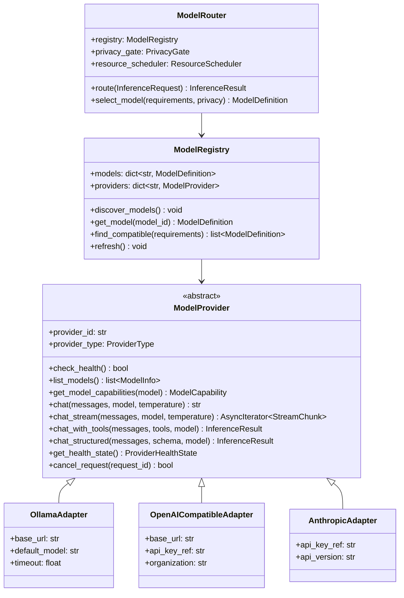

### 22.2 Inference Request Lifecycle

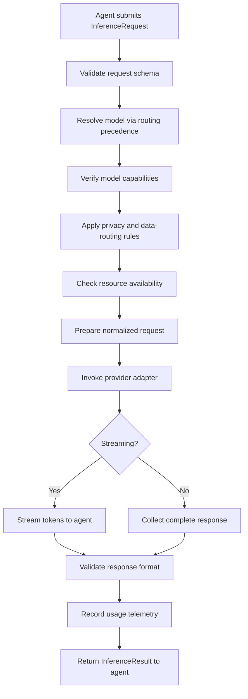

### 22.3 Agent-to-Model Routing

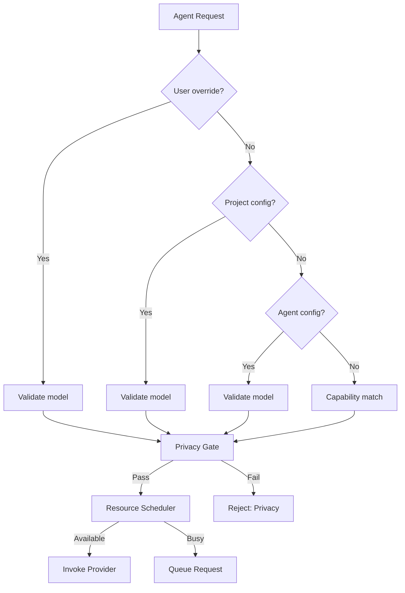

### 22.4 Local-to-External Provider Decision Flow

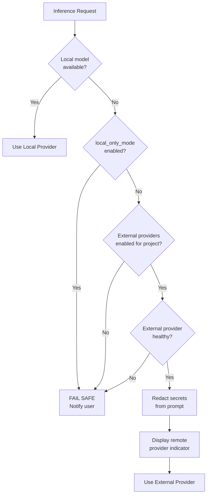

### 22.5 Structured Tool-Call Validation & Authorization

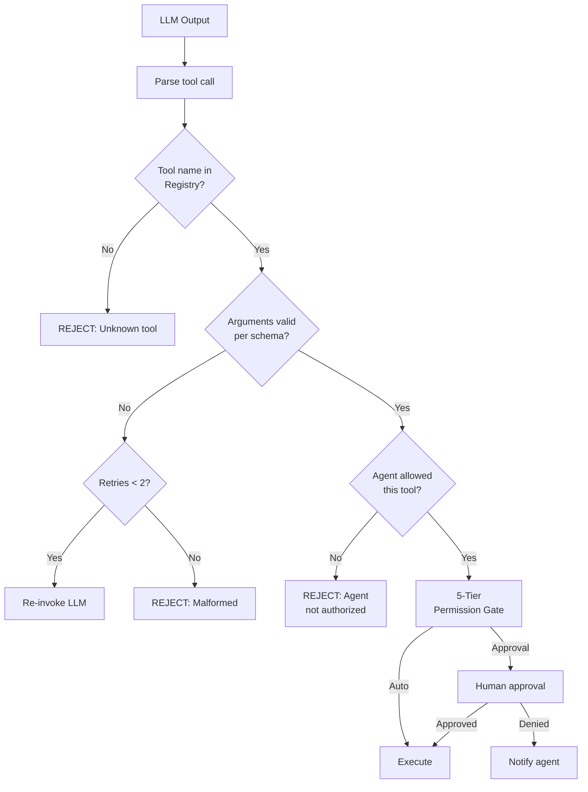

### 22.6 Provider Failure & Fallback Flow

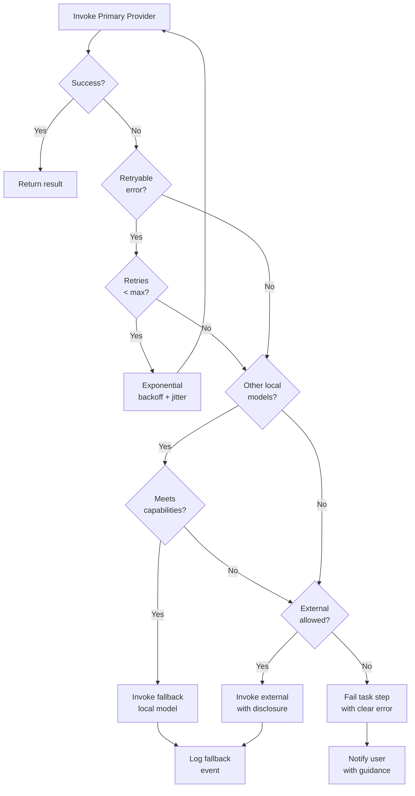

### 22.7 Resource-Aware Inference Scheduling

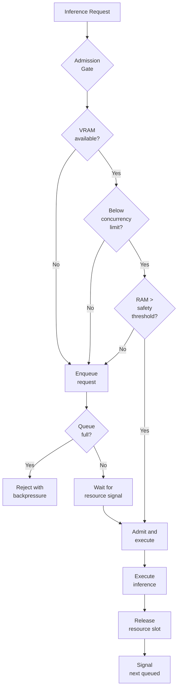

---

## 23. API & Data Model Alignment

### 23.1 Required API Capabilities

The following capabilities extend the existing API contract (API Gateway Architecture §8):

| Capability | Existing Endpoint | Gap / Extension Required |
| :--- | :--- | :--- |
| **Model Discovery** | `GET /api/v1/models` | Extend response to include capability metadata, provider info |
| **Model Availability** | Partially in health endpoint | Add per-model availability status to model list response |
| **Provider Health** | `GET /api/v1/health` (Ollama only) | Extend to report all provider health states |
| **Model Selection** | `PUT /api/v1/models` | Extend to support per-project and per-agent model preferences |
| **Inference Status** | Via WebSocket/SSE events | Already supported via event bus; add inference-specific event types |
| **Usage Summary** | Not yet implemented | **New**: `GET /api/v1/models/usage` for token/cost aggregation |
| **Provider Configuration** | Not yet implemented | **New**: `GET/PUT /api/v1/settings/providers` for provider management |
| **Provider Error Reporting** | Not yet implemented | **New**: Error details included in `provider.health_changed` events |

Final endpoint paths and payload schemas are not defined here if they belong to the API Specification. Only gaps requiring updates are documented.

### 23.2 Conceptual Data Entities

These entities extend the existing database schema. They are candidates for SQLAlchemy models or in-memory structures, depending on persistence requirements:

| Entity | Storage | Purpose |
| :--- | :--- | :--- |
| `ModelDefinition` | In-memory registry (MVP); SQLite `model_registry` table (V1) | Unified model catalog with capability metadata |
| `ModelCapability` | Embedded in `ModelDefinition` | Verified capability flags per model |
| `ProviderConfig` | `~/.nexus/config.toml` + OS Keyring | Provider endpoint, auth, and model configuration |
| `InferenceRequest` | Ephemeral (in-memory dataclass) | Normalized request flowing through the pipeline |
| `InferenceResult` | Ephemeral; usage stats persisted in `task_steps.tokens_used` | Normalized response returned to agent |
| `InferenceUsage` | `inference_usage` SQLite table (V1) | Historical token usage and cost tracking |
| `ProviderHealthRecord` | In-memory state machine; recent history in SQLite event log | Provider availability timeline |

These are candidates only. Existing database entities and configuration storage patterns are reused wherever possible.

### 23.3 Extended Model API Response Schema

Extensions to the existing `schemas/model.py` (which currently defines `ModelItemResponse`, `ModelListResponse`, `ModelStatusResponse`):

```python
class ModelCapabilityResponse(BaseModel):
    """Capability metadata for a model."""
    context_window: int = 0
    supports_streaming: bool = True
    supports_tool_calling: bool = False
    supports_structured_output: bool = False
    supports_vision: bool = False
    capabilities_verified: bool = False

class ModelItemExtendedResponse(BaseModel):
    """Extended model information including capabilities."""
    name: str
    provider_id: str
    provider_type: str  # "local" | "remote"
    display_name: str
    size_bytes: int = 0
    family: str = ""
    parameter_size: str = ""
    quantization_level: str = ""
    availability: str = "unknown"
    capabilities: ModelCapabilityResponse = ModelCapabilityResponse()

class ModelListExtendedResponse(BaseModel):
    """Extended model list with provider health."""
    models: list[ModelItemExtendedResponse]
    default_model: str
    providers: list[ProviderStatusResponse]
    total: int = 0

class ProviderStatusResponse(BaseModel):
    """Health status for a model provider."""
    provider_id: str
    provider_type: str
    health_state: str
    url: str
    model_count: int
    last_check: str
```

---

## 24. Implementation Roadmap

### Phase 1 — Local Runtime Foundation (MVP)

**Scope**: Establish reliable local Ollama integration with health monitoring, model discovery, and basic inference.

**Dependencies**: Existing `OllamaAdapter` (`ai/ollama_adapter.py`), `ModelProvider` ABC (`ai/provider.py`), `Settings` (`config.py`), exceptions (`core/exceptions.py`), events (`core/events.py`).

**Deliverables**:
1. Extended `OllamaAdapter` with `get_model_capabilities()` and `get_health_state()` methods.
2. `ModelRegistry` in-memory cache with Ollama model discovery and periodic refresh.
3. Provider health state machine with `AVAILABLE` / `UNAVAILABLE` / `LOADING_MODEL` states.
4. Extended `config.py` with model runtime settings (`OLLAMA_HEALTH_CHECK_INTERVAL_SECONDS`, `OLLAMA_DEFAULT_NUM_CTX`).
5. Extended exception hierarchy in `core/exceptions.py`: `ModelUnavailableError`, `ContextOverflowError`.
6. Extended `EventType` enum in `core/events.py` with `inference.*` and `provider.*` event types.
7. Extended health endpoint to report detailed Ollama model availability.

**Risks**:
- Ollama API may not reliably report context window for all model types.
- Model capability verification via test prompts adds startup latency.

**Testing Requirements**:
- Provider interface contract tests for `OllamaAdapter`.
- Health state machine transition tests.
- Model discovery mock tests (empty list, single model, multiple models, unreachable Ollama).

**Definition of Done**:
- [ ] `OllamaAdapter` passes all extended contract tests.
- [ ] Model registry populates correctly from running Ollama instance.
- [ ] Health checks detect Ollama availability/unavailability within 10 seconds.
- [ ] Backend startup completes gracefully when Ollama is not installed.
- [ ] All events emit through the existing event bus with correct schemas.

---

### Phase 2 — Provider Abstraction & Structured Inference

**Scope**: Normalize provider interface for multi-provider support. Add structured output, tool calling, and external provider opt-in.

**Dependencies**: Phase 1 completion, existing tool registry, 5-Tier Permission Gate (Security Architecture §5).

**Deliverables**:
1. `OpenAICompatibleAdapter` supporting external OpenAI-format APIs.
2. `chat_with_tools()` and `chat_structured()` methods on `ModelProvider`.
3. `InferenceRequest` / `InferenceResult` normalized data types.
4. Structured output JSON schema validation with retry-and-repair pipeline.
5. Tool-call parsing and authorization pipeline (routed through existing `ToolExecutionService`).
6. External provider configuration schema (`ExternalProviderConfig`).
7. OS Keyring integration for API key storage (reusing existing `keyring` infrastructure per Security Architecture §30).
8. Pre-transmission secret redaction for external provider calls.
9. New exceptions: `ProviderRateLimitError`, `StructuredOutputError`.

**Risks**:
- Tool-call format varies between providers (OpenAI vs. Anthropic vs. Ollama).
- Structured output reliability varies significantly across models.

**Testing Requirements**:
- Contract tests for `OpenAICompatibleAdapter` with mock HTTP responses.
- Structured output validation tests (valid, invalid, partial JSON).
- Tool-call authorization tests (known/unknown tools, schema validation, permission tiers).
- Privacy enforcement tests (external never used without opt-in).
- Secret redaction tests (API keys stripped before external transmission).

**Definition of Done**:
- [ ] External provider adapter passes contract tests against mock servers.
- [ ] Structured output achieves >= 90% first-attempt compliance with test schemas.
- [ ] Tool calls are never executed without passing through the Permission Gate.
- [ ] External providers are never contacted when `EXTERNAL_PROVIDERS_ENABLED = False`.
- [ ] API keys are never present in logs, events, or SQLite records.

---

### Phase 3 — Agent Routing & Context Management

**Scope**: Implement intelligent agent-to-model routing, context budget management, and privacy-aware model selection.

**Dependencies**: Phase 2 completion, Agent Memory Architecture, Context Assembler.

**Deliverables**:
1. `ModelRouter` with 6-level routing precedence logic.
2. Capability-based model matching algorithm.
3. Context budget allocator with priority-tiered truncation cascade.
4. Privacy gate enforcing project-level data-routing policies.
5. Configuration UI data contracts for model preferences (desktop and mobile read-only).
6. `ContextOverflowError` with user-facing guidance.
7. Agent capability requirements matrix enforcement.

**Risks**:
- Context budget estimation accuracy depends on tokenizer fidelity.
- Routing logic complexity may introduce latency.

**Testing Requirements**:
- Routing precedence tests covering all 6 priority levels.
- Capability matching with various requirement combinations.
- Context overflow cascade tests (truncation order verification).
- Privacy gate tests (local-only mode blocks all external routing).
- Agent-model compatibility tests (planner cannot use a model without structured output).

**Definition of Done**:
- [ ] Routing precedence resolves correctly for all 6 levels.
- [ ] Privacy gate blocks external routing under all `local_only_mode` configurations.
- [ ] Context overflow reports actionable errors to the user.
- [ ] System prompt and agent persona are never truncated.

---

### Phase 4 — Reliability & Resource Controls

**Scope**: Add timeout enforcement, retry policies, cancellation, concurrency limits, health monitoring, and safe fallback chains.

**Dependencies**: Phase 3 completion, Performance & Resource Architecture.

**Deliverables**:
1. Timeout enforcement per provider type (Ollama: 120s, External: 60s).
2. Exponential backoff with jitter for retryable errors.
3. Circuit breaker per provider (trips after 5 failures, half-open after 60s).
4. Cancellation propagation (HTTP stream abort on task cancel).
5. Resource admission gate (VRAM, RAM, concurrency checks via `psutil`).
6. Bounded inference queue (10 requests, FIFO).
7. Fallback chain engine with privacy-safe model selection.
8. Provider health state persistence in event log.

**Risks**:
- `psutil` VRAM detection may be inaccurate on some GPU configurations.
- Fallback chains add complexity to failure diagnosis.

**Testing Requirements**:
- Timeout enforcement tests (verify requests are killed at timeout).
- Retry and backoff tests (verify exponential delay, max retries).
- Circuit breaker state transition tests.
- Cancellation tests (verify HTTP stream is aborted, resources freed).
- Resource admission tests under simulated pressure.
- Fallback chain tests respecting privacy constraints.

**Definition of Done**:
- [ ] All timeout, retry, and circuit-breaker policies are enforced and tested.
- [ ] Cancellation immediately halts inference and frees resources.
- [ ] Resource admission gate prevents OOM under simulated high load.
- [ ] Fallback chains never violate privacy settings.
- [ ] Provider failures do not corrupt task state.

---

### Phase 5 — Advanced Management

**Scope**: Model version tracking, evaluation harnesses, usage reporting, Anthropic/Gemini adapters, and expanded provider support.

**Dependencies**: Phase 4 completion, AI Evaluation Architecture.

**Deliverables**:
1. Model digest/version tracking (log model hash changes between tasks).
2. `InferenceUsage` SQLite table for historical token usage tracking.
3. `GET /api/v1/models/usage` endpoint for usage aggregation.
4. `AnthropicAdapter` and `GeminiAdapter` (V1 providers).
5. `LiteLLM` integration evaluation and optional adapter.
6. Model evaluation harness integration with AI Evaluation Architecture.
7. NVML GPU telemetry for precise VRAM monitoring (if available).
8. Provider configuration UI data contracts.

**Risks**:
- LiteLLM may introduce dependency bloat and abstraction overhead.
- External provider APIs may change without notice.

**Testing Requirements**:
- Model version tracking detects digest changes.
- Usage aggregation produces correct token/cost summaries.
- Anthropic and Gemini adapters pass provider contract tests.
- Evaluation harness produces reproducible benchmark results.

**Definition of Done**:
- [ ] Model version changes are detected and logged.
- [ ] Usage reporting accurately tracks tokens per task, agent, and model.
- [ ] V1 provider adapters pass contract and integration tests.
- [ ] Evaluation harness validates model suitability for NEXUS-specific tasks.

---

## 25. Risks & Mitigations

| ID | Risk | Likelihood | Impact | Mitigation | Verification |
| :--- | :--- | :--- | :--- | :--- | :--- |
| `R-MR-01` | Ollama API breaking changes in future versions | Medium | High | Abstract all Ollama calls behind `ModelProvider` interface; version-pin minimum Ollama | Provider contract test suite |
| `R-MR-02` | Insufficient VRAM for selected model | High | Medium | Auto-detect VRAM at startup; fallback to smaller quantized model; never silently upgrade to external | Resource admission gate tests |
| `R-MR-03` | Model tool-calling unreliability | High | High | Schema validation + retry-and-repair pipeline; fallback to prompt-based JSON extraction | Structured output compliance benchmarks |
| `R-MR-04` | External provider credential leakage | Low | Critical | OS Keyring storage; pre-persistence redaction; never log API keys | Secret redaction test suite |
| `R-MR-05` | Context window miscalculation | Medium | Medium | Token count verification via model-specific tokenizer; conservative buffer reservation | Context overflow tests |
| `R-MR-06` | Silent privacy violation (local to external) | Low | Critical | Privacy gate enforced at routing layer; integration test coverage; audit events | Privacy enforcement test suite |
| `R-MR-07` | Model availability assumption | Medium | Medium | Runtime verification at task launch; never assume model is available from config alone | Model availability tests |
| `R-MR-08` | Fallback chain complexity | Medium | Medium | Limited fallback depth (max 2 fallback attempts); clear logging of every fallback decision | Fallback chain integration tests |
| `R-MR-09` | Token estimation inaccuracy | Medium | Low | Conservative estimation with 10% safety buffer; model-specific tokenizer when available | Context budget unit tests |
| `R-MR-10` | Provider adapter inconsistency | Medium | Medium | Shared contract test suite executed against all adapters; mock-based CI tests | Provider contract test matrix |

---

## 26. References to Related NEXUS Architecture Documents

| Document | Relationship to This Architecture |
| :--- | :--- |
| `NEXUS_TECH_STACK.md` | Defines Ollama as primary AI runtime, LiteLLM as provider bridge, hardware resource profiles |
| `NEXUS_BACKEND_ARCHITECTURE.md` | Defines `ModelProvider` ABC, `OllamaAdapter`, backend module layout, resource budgets |
| `NEXUS_API_GATEWAY_AND_INTEGRATION_ARCHITECTURE.md` | Defines `ModelProviderInterface`, INT-05/INT-06 integration specs, reliability patterns |
| `NEXUS_SECURITY_ARCHITECTURE.md` | Defines trust boundaries, 5-Tier permission model, credential isolation, prompt injection defense |
| `NEXUS_AGENT_MEMORY_AND_RETRIEVAL_ARCHITECTURE.md` | Defines context assembly, RAG pipeline, token budget management, memory tiers |
| `NEXUS_PERFORMANCE_AND_RESOURCE_ARCHITECTURE.md` | Defines resource governance, admission control, backpressure, VRAM/RAM budgets |
| `NEXUS_TASK_LIFECYCLE_AND_ORCHESTRATION_ARCHITECTURE.md` | Defines task state machine, agent execution pipeline, cancellation architecture |
| `NEXUS_OBSERVABILITY_ARCHITECTURE.md` | Defines event envelope schema, pre-persistence redaction, structured telemetry pipeline |
| `NEXUS_AI_EVALUATION_ARCHITECTURE.md` | Defines evaluation layers, golden benchmark suite, model quality assessment framework |

---

## 27. Consistency Verification

### 27.1 No Duplicate Systems Introduced

| Concern | Verification |
| :--- | :--- |
| Provider abstraction | Extends existing `ModelProvider` ABC in `ai/provider.py` — no new ABC created |
| Model registry | New `ModelRegistry` class; no existing registry exists in codebase |
| Configuration | Extends existing `Settings` in `config.py` — no separate config system |
| Exception hierarchy | Extends existing `ModelProviderError` tree in `core/exceptions.py` |
| Event system | Uses existing `EventEnvelope` in `core/events.py` — no parallel event system |
| API contracts | Extends existing `schemas/model.py` — no parallel schema module |
| Credential storage | Uses existing OS Keyring via `keyring` library — no new secret store |

### 27.2 Terminology Alignment

All terminology in this document is consistent with established NEXUS architecture:
- **Agent types**: Planner, Developer, Tester, Debugger, Security, Reviewer (per PRD §12)
- **Risk levels**: read_only, low, medium, high, critical (per Security Architecture §5)
- **Task states**: Per Task Lifecycle Architecture §4 state machine
- **Event envelope**: `EventEnvelope` (per `core/events.py` and Observability Architecture §4)
- **Permission tiers**: 5-Tier model (per Security Architecture §5 and API Gateway §9)
- **Configuration hierarchy**: Per Backend Architecture and Tech Stack §41

---

## 28. Next Logical Architecture Document

The recommended next document in the NEXUS master architecture series is:

**`docs/NEXUS_AGENT_ORCHESTRATION_AND_DAG_ARCHITECTURE.md`**

**Rationale**: With the model runtime and provider infrastructure now fully specified, the next critical gap is the detailed specification of how the Custom Async DAG Orchestrator sequences agent execution, manages inter-agent context handoffs, handles dynamic replanning based on test failures, enforces bounded self-healing loops, and coordinates with the model router for agent-specific inference requests. The Task Lifecycle Architecture provides the high-level state machine and the Backend Architecture outlines the DAG concept, but the detailed orchestration protocols — including step dependency resolution, parallel subtask execution (V1), checkpoint/rollback semantics, agent memory palace retrieval during plan generation, and the precise interface between the DAG scheduler and the `ModelRouter` defined in this document — require a dedicated architecture document to bridge the gap between the model infrastructure and the agent implementations.

---

*End of AI Model Runtime & Provider Management Architecture Document — v2.0.0*
