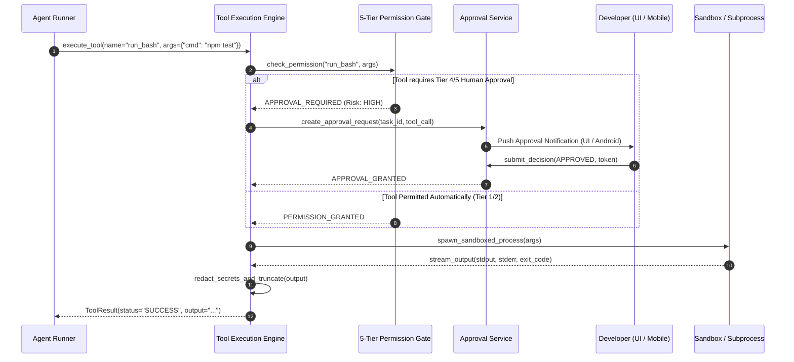
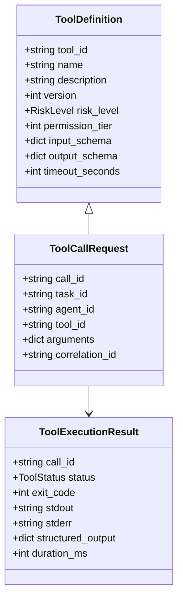
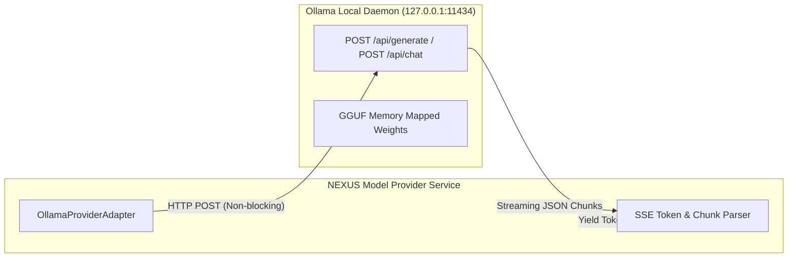
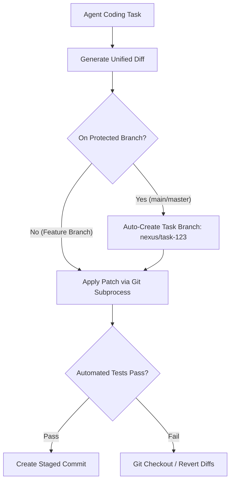
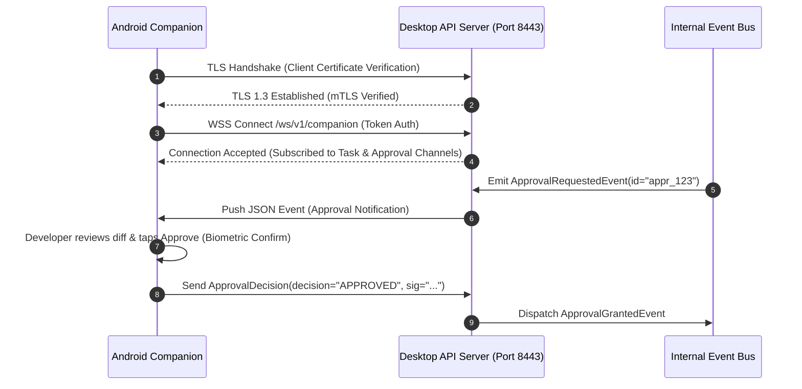
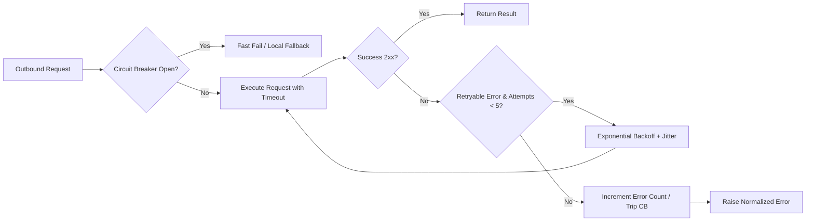
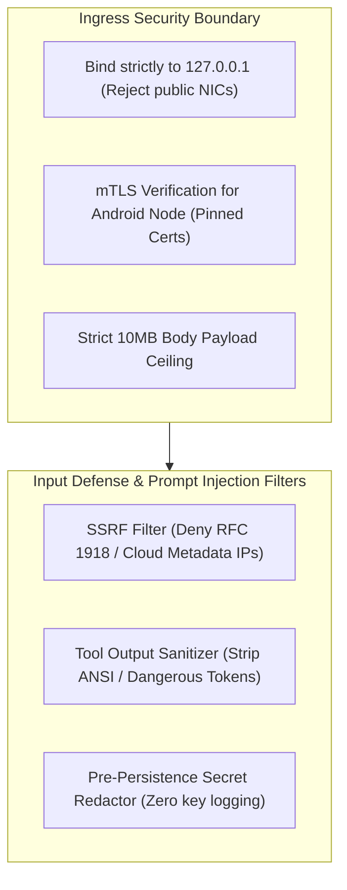
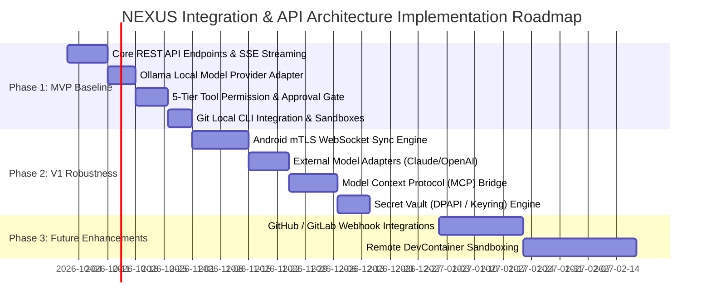

# NEXUS — API Gateway, Integration & External Provider Architecture

**Document Version:** 1.0.0  
**Status:** Approved Production Architecture Baseline  
**Classification:** Core System Integration, API Platform Engineering & Provider Security  
**Target Systems:** NEXUS Desktop (Windows x64 Native / Tauri + FastAPI Engine) & NEXUS Mobile Companion (Android Node)  
**Primary Sources of Truth:**
- `docs/PRD.md` (v1.0.0)
- `docs/NEXUS_TECH_STACK.md` (v1.0.0)
- `docs/NEXUS_BACKEND_ARCHITECTURE.md` (v1.0.0)
- `docs/NEXUS_SECURITY_ARCHITECTURE.md` (v1.0.0)
- `docs/NEXUS_OBSERVABILITY_ARCHITECTURE.md` (v1.0.0)
- `docs/NEXUS_BACKUP_AND_DISASTER_RECOVERY_ARCHITECTURE.md` (v1.0.0)
- `docs/NEXUS_PERFORMANCE_AND_RESOURCE_ARCHITECTURE.md` (v1.0.0)
- `docs/NEXUS_TESTING_AND_QA_ARCHITECTURE.md` (v1.0.0)

---

## 1. Executive Summary

NEXUS is an autonomous, **local-first AI Software Engineering Command Center**. It coordinates software-engineering workflows through specialized agents (Planner, Developer, Tester, Debugger, Security, Reviewer), tool executions, local Docker/process sandboxes, repository semantic indexing, and local/remote LLM inference on developer hardware.

NEXUS is not a generic conversational wrapper or cloud chatbot. It is a deterministic engineering workstation that interfaces with repositories, file trees, host terminals, Git systems, Docker containers, package managers, local inference daemons (e.g., Ollama), and optional external AI/cloud APIs.

```
+---------------------------------------------------------------------------------------------------+
|                                NEXUS LOCAL-FIRST INTEGRATION TOPOLOGY                             |
+---------------------------------------------------------------------------------------------------+
|  [ Desktop Webview UI ] <─── Non-Blocking IPC ───> [ Tauri Rust Native Core ]                    |
|                                                            │                                      |
|                                                    Local Loopback HTTP                            |
|                                                            ▼                                      |
|  [ Android Companion ] <── mTLS WebSocket ──> [ FastAPI API Engine (127.0.0.1:8000) ]             |
|                                                            │                                      |
|          ┌───────────────────────┬─────────────────────────┼────────────────────────┐             |
|          ▼                       ▼                         ▼                        ▼             |
|   [ Local Tool Engine ]    [ Local LLM Daemon ]   [ Host Git & Docker ]    [ Opt. External AI ]  |
|   (File/Patch/Terminal)    (Ollama / Llama.cpp)   (Subprocess / NamedPipe) (OpenAI/Anthropic/Gem) |
+---------------------------------------------------------------------------------------------------+
```

### 1.1 Objectives of the Integration Architecture
1. **Local-First Privacy & Zero Default Leakage**: All core capabilities (task orchestration, tool sandboxing, vector indexing, code editing) execute entirely on the local loopback interface (`127.0.0.1`). External cloud calls are strictly opt-in and require explicit user consent.
2. **Strict Trust Boundaries & Least Privilege**: Agents never invoke host tools directly. Every tool invocation passes through a mandatory 5-Tier Permission & Human-Approval Gate with pre-execution safety validation.
3. **Model & Provider Agnosticism**: Standardized provider adapters normalize local model daemons (Ollama, Llama.cpp, vLLM) and external model APIs (OpenAI, Anthropic, Google Gemini, DeepSeek) behind a unified, capability-negotiated interface.
4. **Resilient & Observable Communication**: Every internal and external request carries a correlation ID, enforces strict timeouts, applies exponential backoff with jitter, implements circuit breaker tripwires, and undergoes pre-persistence secret redaction.

---

## 2. Scope and Non-Goals

### 2.1 Scope Taxonomy

| Dimension | MVP (Phase 1) | V1 (Phase 2) | Future (Phase 3) |
| :--- | :--- | :--- | :--- |
| **Frontend/Backend IPC** | Localhost REST (`127.0.0.1:8000`) + SSE streams | Native Tauri Unix Domain Socket / Named Pipe | Embedded Rust FFI Core Bindings |
| **Mobile Integration** | Local LAN mTLS WebSocket + QR Pairing | Push Notifications (Firebase/Self-Hosted) | Relay Proxy over P2P WebRTC / Tailscale |
| **Model Providers** | Ollama (Local) + OpenAI Compatible API | Anthropic Claude + Google Gemini + DeepSeek | Pluggable Custom Model Adapters (vLLM/TGI)|
| **Tool Protocols** | Native Python CLI + Windows Job Objects | Docker Engine API + Model Context Protocol (MCP)| Remote Container Sandboxes (Dev Containers)|
| **VCS Integrations** | Local Git CLI (`git` subprocess) | GitHub / GitLab REST & GraphQL APIs | Forgejo / Gitea Self-Hosted Webhooks |

### 2.2 Desktop vs. Android Responsibilities
- **Windows Desktop Command Center**: Primary execution host and data-owning authority. Owns SQLite database, executes agents and tools, manages local models, evaluates permissions, and hosts the API server.
- **Android Companion Node**: Mobile monitoring and human approval client. Interacts with the desktop over an authenticated mTLS WebSocket connection. Receives read-only telemetry summaries and submits cryptographic approval/rejection tokens.

### 2.3 Explicit Non-Goals
1. **No Public Cloud API Gateway**: NEXUS is not a public multi-tenant SaaS service. It does not host external public-facing web ingress endpoints.
2. **No Unauthenticated Remote Execution**: The backend rejects all unauthenticated non-loopback connections. Mobile pairing requires mutual TLS with pinned device certificates.
3. **No Silent Data Transmission**: Codebases, diffs, and prompts are never transmitted to external cloud model providers without an active, explicit user configuration.

---

## 3. Integration Principles

The NEXUS integration architecture adheres to twelve fundamental engineering principles:

```
 1. Contract-First API Specifications (Strict OpenAPI 3.1 & Pydantic v2 schemas)
 2. Explicit Trust Boundaries & Service Ownership
 3. Least-Privilege Access Control (5-Tier Granular Permissions)
 4. Mandatory Input/Output Validation & Schema Sanitization
 5. Strict Interface Versioning (/api/v1/ prefix with semver deprecation)
 6. Idempotency Guarantees for Retryable Mutating Operations
 7. Bounded Retries, Exponential Backoff & Jitter
 8. Normalized, Redacted Error Envelopes (No raw stack traces or leaked secrets)
 9. Complete Correlation & Traceability (Correlation-ID / Task-ID propagation)
10. Model & Runtime Agnosticism (Dynamic capability negotiation)
11. Local-First Defaults (Zero external cloud calls without explicit user consent)
12. Graceful Degradation & Resilient Circuit Breaking
```

---

## 4. Integration Inventory

Every integration endpoint and protocol across the NEXUS ecosystem is classified below:

| ID | Integration Category | Direction | Protocol / Interface | Auth Mechanism | Authorization Gate | Data Exchanged | Failure Modes | Retry Policy | Timeout | Observability | Classification |
| :--- | :--- | :--- | :--- | :--- | :--- | :--- | :--- | :--- | :--- | :--- | :--- |
| `INT-01` | **Desktop UI $\leftrightarrow$ Backend** | Bidirectional | HTTP REST + SSE (`127.0.0.1`) | Local Session Token | Admin (Local Host) | JSON Payloads, Task State, Diffs | Connection refused, timeout | 3 retries (100ms) | 30s | Request logging + span | **MVP** |
| `INT-02` | **Desktop IPC Core (Tauri)** | Bidirectional | Rust IPC / stdio | Process Parentage | Native Host App | Window events, OS dialogs, Tray | IPC buffer overflow, pipe close | None (Crash-fail) | 5s | Rust debug logs | **MVP** |
| `INT-03` | **Android Companion $\leftrightarrow$ Desktop**| Bidirectional | WSS (WebSocket over TLS) | mTLS + Pinned Cert | Biometric Approval Token | Task telemetry, Approvals, Status | Wi-Fi drop, cert mismatch | Reconnect (Backoff) | 10s ping | WS connection events | **V1** |
| `INT-04` | **Agent $\rightarrow$ Tool Execution** | Internal | Async Python Service Dispatch | Internal Context | 5-Tier Permission Check | Tool arguments, File diffs, Stdio | Tool syntax error, timeout, OOM | None (Fail to agent) | 180s | Audit log + tool run record| **MVP** |
| `INT-05` | **Local Model Engine (Ollama)** | Bidirectional | HTTP REST (`127.0.0.1:11434`) | None (Loopback) | Engine Service Gate | Prompts, Token Streams, Embeddings| Socket closed, OOM, Model 404 | 2 retries (1s) | 120s | Token latency & TTFT | **MVP** |
| `INT-06` | **External AI (OpenAI/Claude/Gemini)**| Bidirectional | HTTPS REST / SSE | API Key (Encrypted)| User Consent Gate | Sanitized Prompts, Completions | Rate limit (429), Network drop | Exp backoff (5 max) | 60s | Token metrics (Redacted) | **MVP/V1** |
| `INT-07` | **Local Git Engine** | Subprocess | Git CLI (`git.exe`) | Local SSH / HTTPS | Repo Path Boundary Check | Branches, Diffs, Commits, Tags | Merge conflict, Lock file error | 1 retry (Lock clear)| 30s | Git command audit | **MVP** |
| `INT-08` | **Remote Git Hosting (GitHub/GitLab)**| Outbound | HTTPS REST / GraphQL | OAuth / Personal Token | Project Secret Scope | PRs, Issues, Workflow status | Auth 401, Rate limit (403) | Exp backoff (3 max) | 15s | Remote API event record | **V1** |
| `INT-09` | **Docker Sandbox Engine** | Outbound | Named Pipe / Unix Socket | Local Docker Daemon | Container Security Profile | Container configs, Stdio streams | Daemon down, Image pull fail | 1 retry | 300s | Docker lifecycle audit | **V1** |
| `INT-10` | **Host Package Managers (npm/cargo)**| Subprocess | Win32 Job Object CLI | Host Permissions | Tier 3 Tool Permission | Dependencies, Build outputs | Lockfile conflict, build error | None | 600s | Process log spool | **MVP** |
| `INT-11` | **Filesystem & Patch Engine** | Internal | Python `aiofiles` / Win32 | OS ACLs | Workspace Sandbox Mutex | File trees, UTF-8 text, Patches | EACCES, File in use, Bad diff | 2 retries (50ms) | 10s | File mutation audit | **MVP** |
| `INT-12` | **Database & Vector Store** | Internal | Async SQLAlchemy + ChromaDB | SQLite File Lock | Internal DB Session | Relational records, Embeddings | DB Locked, Migration mismatch | Exp backoff (5 max) | 5s | SQL query performance | **MVP** |
| `INT-13` | **Desktop Notification Subsystem**| Outbound | Windows WinRT / Toast API | Local OS Session | User Notification Pref | Notification title, body, action | Toast disabled, WinRT error | 1 retry | 2s | Toast dispatch log | **MVP** |
| `INT-14` | **Model Context Protocol (MCP)** | Bidirectional | stdio / SSE JSON-RPC 2.0 | Process Isolation | MCP Server Manifest Gate | Tool definitions, Resource URIs | Protocol mismatch, crash | 1 retry | 30s | MCP JSON-RPC logs | **V1** |
| `INT-15` | **Auto-Updater & Diagnostics** | Outbound | HTTPS Static Download | GPG Signature Check| User Approval Gate | Update manifests, Binary patches | Hash mismatch, 404 not found | 3 retries | 60s | Updater audit trail | **V1** |

---

## 5. Integration Architecture Overview

```mermaid
flowchart TD
    subgraph Clients["Presentation & Companion Nodes"]
        WebUI["Desktop UI (Next.js / Tauri)"]
        MobileNode["Android Companion (Jetpack Compose / React Native)"]
    end

    subgraph Gateway["Local API Gateway & Dispatcher (FastAPI / 127.0.0.1)"]
        AuthN["AuthN & Session Validator"]
        RateLimit["Loopback Rate & Payload Limiter"]
        Router["API v1 Route Dispatcher"]
        RedactMid["Pre-Persistence Redaction Middleware"]
        AuthN --> RateLimit --> Router --> RedactMid
    end

    subgraph CoreServices["Internal Core Application Services"]
        TaskSvc["Task & Orchestration Service"]
        ApprovalSvc["Human-in-the-Loop Approval Service"]
        ToolSvc["Tool Execution Engine (5-Tier Gate)"]
        ModelSvc["Model Provider Adapter Registry"]
        WorkspaceSvc["Workspace & Git Service"]
    end

    subgraph Integrations["Execution & Provider Integrations"]
        LocalLLM["Local LLM Daemon (Ollama / Llama.cpp)"]
        RemoteLLM["External Model APIs (OpenAI/Anthropic/Gemini)"]
        HostProcess["Host Subprocesses (Windows Job Objects)"]
        DockerDaemon["Docker Sandbox Daemon (Named Pipe)"]
        SQLiteDB[(Authoritative SQLite DB + WAL)]
        ChromaStore[(ChromaDB Vector Store)]
    end

    WebUI -- "HTTP / SSE (127.0.0.1:8000)" --> AuthN
    MobileNode -- "mTLS WebSocket (Port 8443)" --> AuthN

    Router --> TaskSvc & ApprovalSvc & WorkspaceSvc
    TaskSvc --> ModelSvc & ToolSvc
    ApprovalSvc --> ToolSvc

    ModelSvc --> LocalLLM
    ModelSvc --> RemoteLLM
    ToolSvc --> HostProcess & DockerDaemon
    TaskSvc & WorkspaceSvc --> SQLiteDB & ChromaStore
```



### 5.1 Internal Tool Execution Flow with Approval Gate



---

## 6. API Boundary and Service Ownership

To prevent overlapping business logic and architectural erosion, each backend service maintains strict data and interface ownership:

```
+---------------------------------------------------------------------------------------------------+
|                                SERVICE RESPONSIBILITY MATRIX                                      |
+---------------------------------------------------------------------------------------------------+
| Service Name           | Authoritative Data Owned          | Primary Public & Internal Interfaces |
|------------------------|-----------------------------------|--------------------------------------|
| TaskService            | tasks, task_steps, task_timelines | POST /tasks, GET /tasks/{id}, run()  |
| AgentOrchestrator      | DAG execution state, agent memory | execute_dag(), cancel_dag()          |
| ToolExecutionService   | tool_definitions, execution_logs  | execute_tool(), list_tools()         |
| ApprovalService        | approval_requests, human_decisions| POST /approvals/{id}/decision        |
| ModelProviderService   | provider_configs, model_catalogs  | generate_text(), generate_stream()   |
| WorkspaceService       | project_roots, git_status, diffs  | get_git_status(), apply_patch()      |
| SecretVaultService     | encrypted_api_keys (DPAPI/Keyring)| get_secret(), set_secret()          |
| NotificationService    | live_event_bus, sse_subscriptions | broadcast_event(), stream_sse()      |
| ObservabilityService   | audit_logs, system_metrics        | record_audit_event(), get_metrics()  |
+---------------------------------------------------------------------------------------------------+
```

---

## 7. API Design Standards

All NEXUS HTTP APIs follow strict RESTful conventions using OpenAPI 3.1 specifications.

### 7.1 Uniform Resource Naming & HTTP Methods
- All API routes use lowercase, hyphen-separated plural resource names prefixed with `/api/v1/`.
- `GET`: Idempotent retrieval of resources. Never causes state mutations.
- `POST`: Creation of subordinate resources or non-idempotent operations (e.g., `/tasks/{id}/run`).
- `PATCH`: Incremental resource modification using partial JSON schemas.
- `DELETE`: Idempotent removal or cancellation of resources.

### 7.2 Standard Request & Response Headers
- `X-Nexus-Request-ID`: Standard UUIDv4 generated for every incoming request.
- `X-Nexus-Correlation-ID`: Trace identifier propagated across task, agent, and tool boundaries.
- `X-Nexus-Client-Version`: Version string of the connecting Desktop or Mobile client.
- `Idempotency-Key`: Optional client-supplied UUID for safe retry of mutating `POST` requests.

### 7.3 Pagination, Sorting & Filtering
- Standard pagination query parameters: `?limit=50&cursor=eyJpZCI6...` (Cursor-based pagination).
- Sorting: `?sort=-created_at` (Prefix `-` indicates descending order).
- Filtering: `?status=RUNNING&priority=HIGH`.

---

## 8. API Contract Specifications

### 8.1 Create Task Contract
* **Route**: `POST /api/v1/projects/{project_id}/tasks`
* **Authorization**: `Bearer <local_session_token>`
* **Request Schema**:
  ```json
  {
    "title": "Implement JWT Refresh Token Flow",
    "prompt": "Create a refresh token rotation mechanism in auth_service.py with unit tests.",
    "priority": "HIGH",
    "model_override": "deepseek-coder-v2:16b",
    "permission_level": "RESTRICTED_AUTO"
  }
  ```
* **Response Schema (`201 Created`)**:
  ```json
  {
    "task_id": "tsk_01HZX89QWE789",
    "project_id": "prj_01HZX12ABC456",
    "title": "Implement JWT Refresh Token Flow",
    "status": "PENDING",
    "priority": "HIGH",
    "created_at": "2026-09-27T22:15:00.000Z",
    "timeline_url": "/api/v1/tasks/tsk_01HZX89QWE789/timeline"
  }
  ```

### 8.2 Human Approval Decision Contract
* **Route**: `POST /api/v1/approvals/{approval_id}/decision`
* **Authorization**: `Bearer <local_session_token>` or Mobile mTLS Biometric Proof
* **Request Schema**:
  ```json
  {
    "decision": "APPROVED",
    "reason": "Verified file diff only touches auth_service.py",
    "auth_confirmation_token": "sig_ed25519_897123abcdef..."
  }
  ```
* **Response Schema (`200 OK`)**:
  ```json
  {
    "approval_id": "appr_01HZX99XYZ123",
    "status": "RESOLVED",
    "decision": "APPROVED",
    "resolved_at": "2026-09-27T22:16:30.000Z",
    "resumed_task_id": "tsk_01HZX89QWE789"
  }
  ```

### 8.3 Mobile Companion Device Pairing Contract
* **Route**: `POST /api/v1/mobile/pair`
* **Authorization**: Local QR Nonce + Workstation Loopback Confirmation
* **Request Schema**:
  ```json
  {
    "pairing_nonce": "nonce_987123-abc-456",
    "device_name": "Google Pixel 8 Pro",
    "client_public_cert_pem": "-----BEGIN CERTIFICATE-----\nMIIB..."
  }
  ```
* **Response Schema (`200 OK`)**:
  ```json
  {
    "device_id": "dev_mobile_01HZX77ABC",
    "status": "PAIRED",
    "server_public_cert_pem": "-----BEGIN CERTIFICATE-----\nMIIB...",
    "websocket_endpoint": "wss://192.168.1.150:8443/ws/v1/companion"
  }
  ```

---

## 9. Agent-to-Tool Integration Contract

Agents are untrusted prompt-generated logic. They must never invoke host shell commands directly. Instead, they emit structured tool calls that the `ToolExecutionService` validates and sandboxes.



### 9.1 Tool Permission Tiers
- **Tier 1 (Read-Only / Safe)**: `read_file`, `list_dir`, `grep_search`, `git_status`. Always permitted automatically.
- **Tier 2 (Workspace Modification / Low Risk)**: `write_file`, `patch_file`, `create_dir`. Permitted if workspace boundaries match.
- **Tier 3 (Terminal / Subprocess / Medium Risk)**: `run_cargo_test`, `run_npm_build`. Requires explicit task policy authorization.
- **Tier 4 (System Destructive / High Risk)**: `git_push_force`, `rmdir_recursive`, `docker_prune`. Mandatory Human-in-the-Loop confirmation.
- **Tier 5 (Prohibited / Disallowed)**: Raw socket raw listeners, registry edits, system directory access (`C:\Windows\`). Denied unconditionally.

---

## 10. Tool Registry and Extensibility

NEXUS implements a pluggable **Tool Registry Engine** supporting both native internal tools and external Model Context Protocol (MCP) tool servers.

```json
{
  "tool_id": "tool_git_diff",
  "name": "Git Diff Viewer",
  "description": "Inspects git diff for a specific file or workspace revision.",
  "version": "1.0.0",
  "risk_level": "LOW",
  "permission_tier": 1,
  "supported_platforms": ["windows", "linux", "darwin"],
  "input_schema": {
    "type": "object",
    "properties": {
      "path": {"type": "string", "description": "Relative file path"},
      "staged": {"type": "boolean", "default": false}
    },
    "required": ["path"]
  },
  "timeout_seconds": 15
}
```

### 10.1 Model Context Protocol (MCP) Server Bridge
External developers can register custom MCP tool servers via `stdio` JSON-RPC 2.0 or local HTTP/SSE. NEXUS encapsulates each MCP server in a separate subprocess, enforcing isolated memory limits and permission masks.

---

## 11. Local Model Provider Integration

Local inference engines (e.g., Ollama, Llama.cpp server, vLLM) are abstracted via a standardized HTTP client with non-blocking streaming capabilities.



### 11.1 Local Model Lifecycle Management
- **Discovery**: Queries `GET http://127.0.0.1:11434/api/tags` on engine boot to catalog available local models, parameter sizes, and quantization formats.
- **Context Window Verification**: Validates whether the active prompt fits within the model's configured context window ($L_{\text{context}}$) before launching token generation.
- **Cancellation**: If the developer cancels a running agent task, NEXUS immediately aborts the HTTP client socket, causing the local LLM daemon to halt token generation and free compute cores.

---

## 12. External Model Provider Integration

For developers who opt to use cloud AI models, NEXUS integrates with major external providers through strict security and privacy proxies.

```
+---------------------------------------------------------------------------------------------------+
|                               EXTERNAL PROVIDER INTEGRATION ARCHITECTURE                          |
+---------------------------------------------------------------------------------------------------+
|  [ Agent Prompt ] ──> [ Secret Redactor ] ──> [ Consent Gate ] ──> [ Provider Adapter ]          |
|                             │                         │                     │                     |
|                             ▼                         ▼                     ▼                     |
|                      Strip API Keys /          Verify User Enabled    HTTPS / TLS 1.3             |
|                      Personal Secrets           External AI Mode      (OpenAI / Anthropic / Gem)  |
+---------------------------------------------------------------------------------------------------+
```

### 12.1 Provider Normalization Table

| Provider | Endpoint | Supported Models | Streaming Format | Tool Calling Support | Rate Limit Header |
| :--- | :--- | :--- | :--- | :--- | :--- |
| **OpenAI** | `https://api.openai.com/v1/chat/completions` | `gpt-4o`, `o1-preview`, `gpt-4o-mini` | SSE (`data: [DONE]`) | Native JSON Schema | `x-ratelimit-remaining-requests` |
| **Anthropic** | `https://api.anthropic.com/v1/messages` | `claude-3-5-sonnet`, `claude-3-opus` | SSE (`event: content_block_delta`) | Tool Use Blocks | `anthropic-ratelimit-requests-remaining`|
| **Google Gemini**| `https://generativelanguage.googleapis.com` | `gemini-1.5-pro`, `gemini-1.5-flash` | REST / gRPC stream | Function Declarations | Standard Quota API |
| **DeepSeek** | `https://api.deepseek.com/v1/chat/completions` | `deepseek-coder`, `deepseek-chat` | SSE (OpenAI format) | JSON Tool Calls | `x-ratelimit-remaining` |

---

## 13. Provider Abstraction and Model-Agnostic Design

NEXUS defines a universal `ModelProviderInterface` that decouples agent orchestration from specific model syntax.

```python
from abc import ABC, abstractmethod
from collections.abc import AsyncIterator
from nexus.schemas.model import CompletionRequest, CompletionResponse, TokenChunk

class ModelProviderInterface(ABC):
    @abstractmethod
    async def generate_completion(self, request: CompletionRequest) -> CompletionResponse:
        """Execute a non-streaming completion."""
        ...

    @abstractmethod
    async def generate_stream(self, request: CompletionRequest) -> AsyncIterator[TokenChunk]:
        """Stream token chunks asynchronously."""
        ...

    @abstractmethod
    async def get_capabilities(self) -> dict[str, bool]:
        """Return supported capabilities (e.g., tool_calling, structured_output, vision)."""
        ...
```

---

## 14. Git and Repository Integrations

NEXUS interfaces directly with local Git repositories to generate patch diffs, manage feature branches, and record version control audit trails.



### 14.1 Git Security Constraints
- **Protected Branch Guard**: Direct commits to `main` or `master` are blocked. NEXUS automatically switches to a dedicated task branch (`nexus/task-<id>`).
- **Destructive Operation Approval**: Commands such as `git reset --hard`, `git clean -fd`, and `git push --force` require explicit Tier 4 human approval.

---

## 15. Docker and Execution Sandboxes

Tools requiring strict process isolation execute within ephemeral Docker containers.

### 15.1 Container Lifecycle Governance
1. **Creation**: Spawns isolated container with `HostConfig.NetworkMode="none"` (zero internet access) and read-only host mounts where applicable.
2. **Execution**: Captures stdout/stderr streams with a strict 5.0 MB buffer cap.
3. **Destruction**: Automatically purges container upon tool completion (`AutoRemove=true`) to prevent dangling container sprawl.

---

## 16. Desktop-to-Mobile API and Event Communication

The Android Companion node connects to the Desktop Command Center over a secure local mTLS WebSocket interface.



---

## 17. Integration Configuration and Secrets Management

In accordance with [`docs/NEXUS_SECURITY_ARCHITECTURE.md`](file:///c:/Users/user/OneDrive/Documents/NEXUS/docs/NEXUS_SECURITY_ARCHITECTURE.md), API keys and integration secrets are never stored in plaintext.

```
+---------------------------------------------------------------------------------------------------+
|                                   SECRET STORAGE & ACCESS PIPELINE                                |
+---------------------------------------------------------------------------------------------------+
|  [ API Key Input ] ──> [ Windows DPAPI / CryptProtectData ] ──> [ SQLite encrypted_secrets ]      |
|                                                                                │                  |
|                                                                                ▼                  |
|  [ Memory Arena (Decrypted) ] <── In-Memory Decryption (Zeroed on GC) <────────┘                  |
+---------------------------------------------------------------------------------------------------+
```

- **Storage**: Encrypted using OS-native credential storage (Windows DPAPI `CryptProtectData` or system Keyring).
- **Pre-Persistence Redaction**: A regex-based redaction engine strips API keys (`sk-ant-...`, `ghp_...`, `AIzaSy...`) from all logs, database event records, and terminal output buffers before persistence.

---

## 18. Reliability Patterns

NEXUS implements standard distributed systems reliability patterns across all external integration points:



### 18.1 Reliability Configuration Matrix
- **Timeouts**: Internal tools (180s), Local LLMs (120s), External APIs (60s), Git operations (30s), Database queries (5s).
- **Exponential Backoff**: $t_{\text{backoff}} = \min(30.0\text{s}, 1.0\text{s} \times 2^{\text{attempt}}) \pm \text{jitter}(0.2\text{s})$.
- **Circuit Breaker**: Trips to `OPEN` after 5 consecutive failures; enters `HALF_OPEN` after 60 seconds probe delay.

---

## 19. Error and Failure Normalization

All API and integration errors are returned in a standard, predictable error envelope.

### 19.1 Normalized Error Schema
```json
{
  "error": {
    "code": "PROVIDER_RATE_LIMIT_EXCEEDED",
    "category": "INTEGRATION_ERROR",
    "message": "Anthropic API rate limit exceeded. Retry after 24 seconds.",
    "component": "AnthropicProviderAdapter",
    "retryable": true,
    "retry_after_seconds": 24,
    "correlation_id": "corr_01HZX987ABC123",
    "task_id": "tsk_01HZX89QWE789",
    "details": {
      "provider": "anthropic",
      "status_code": 429
    }
  }
}
```

---

## 20. Observability and Audit Integration

Aligned with [`docs/NEXUS_OBSERVABILITY_ARCHITECTURE.md`](file:///c:/Users/user/OneDrive/Documents/NEXUS/docs/NEXUS_OBSERVABILITY_ARCHITECTURE.md), every integration request generates structured telemetry records.

```
+---------------------------------------------------------------------------------------------------+
|                                INTEGRATION AUDIT TELEMETRY RECORD                                 |
+---------------------------------------------------------------------------------------------------+
| - Timestamp: 2026-09-27T22:20:15.123Z                                                            |
| - Event Type: INTEGRATION_PROVIDER_CALL                                                           |
| - Correlation ID: corr_01HZX987ABC123                                                             |
| - Provider: Ollama (127.0.0.1:11434)                                                              |
| - Model: deepseek-coder-v2:16b                                                                    |
| - Prompt Tokens: 1,420 | Completion Tokens: 385 | Duration: 4,120 ms                              |
| - Cost USD: $0.00 (Local Inference)                                                               |
| - Status: SUCCESS_COMPLETED                                                                       |
+---------------------------------------------------------------------------------------------------+
```

---

## 21. Security Requirements



1. **SSRF Protection**: External webhook or tool requests cannot target localhost ports or cloud metadata endpoints (`169.254.169.254`).
2. **Prompt Injection Containment**: Tool outputs and external API responses are treated as untrusted data strings, wrapped in isolated delimiter tags before feeding back into agent prompts.

---

## 22. Performance and Resource Requirements

- **Connection Reuse**: HTTP/2 connection pooling across all external provider adapters (`httpx.AsyncClient(limits=Limits(max_keepalive_connections=10))`).
- **Streaming Backpressure**: SSE token streams are pushed across WebSockets with micro-batching (max 60 updates/sec) to avoid frontend UI thrashing.
- **Payload Limits**: Ingress REST payloads capped at **10 MB**; tool output memory buffers capped at **5 MB**.

---

## 23. API Versioning and Compatibility

- **URL Prefixing**: All public endpoints adhere to `/api/v1/`.
- **Breaking Changes**: Introduction of breaking changes requires bumping the route to `/api/v2/` with a 6-month backward-compatibility grace period for the Android Companion node.
- **Mobile Handshake Verification**: During mTLS connection establishment, the server verifies `min_compatible_mobile_version`. Outdated companion versions are greeted with an explicit `UPGRADE_REQUIRED` modal.

---

## 24. Testing and Validation Strategy

The integration test suite executes in CI/CD and local environments across five test categories:

```
+---------------------------------------------------------------------------------------------------+
|                                INTEGRATION TEST SUITE MATRIX                                      |
+---------------------------------------------------------------------------------------------------+
| 1. Contract & Schema Tests: OpenAPI 3.1 & Pydantic v2 payload validation.                         |
| 2. Mock Provider Tests: Replay recorded HTTP fixtures (VCR.py / WireMock) for Ollama/OpenAI.      |
| 3. Tool Sandboxing Tests: Verify Windows Job Objects and Docker resource boundaries.              |
| 4. Security & Redaction Tests: Verify API keys and secrets are redacted from audit logs.        |
| 5. Mobile mTLS & Reconnect Drills: Simulate network drops and certificate verification.           |
+---------------------------------------------------------------------------------------------------+
```

---

## 25. Implementation Roadmap



---

## 26. Risk Register and Open Decisions

### 26.1 Risk Register

| ID | Risk Description | Likelihood | Impact | Mitigation Strategy | Owner | Verification Method |
| :--- | :--- | :--- | :--- | :--- | :--- | :--- |
| `R-INT-01` | **External Model API Deprecation**: Upstream provider changes API schemas without warning. | Medium | High | Isolate all providers behind `ModelProviderInterface` adapters with version pinning. | AI Lead | Provider contract test suite. |
| `R-INT-02` | **Local Loopback Port Collision**: Port `8000` or `8443` already bound by another developer tool. | High | Medium | Implement dynamic port fallback (`8000 -> 8001 -> ...`) with desktop IPC discovery. | Backend Lead | Port binding collision test. |
| `R-INT-03` | **Prompt Injection via Tool Output**: Malicious codebase embeds instructions inside file comments. | Medium | High | Wrap all tool outputs in strict XML isolation tags (`<tool_output>...</tool_output>`). | Security Lead | Prompt injection red-team drill. |

### 26.2 Register of Open Decisions

| ID | Topic | Current Architectural Recommendation | Next Required Action |
| :--- | :--- | :--- | :--- |
| `OD-INT-01` | **Native IPC vs Localhost HTTP** | Use Localhost HTTP (`127.0.0.1`) for MVP; migrate to Tauri Named Pipe IPC in Phase 2. | Performance team to benchmark IPC throughput on Windows. |
| `OD-INT-02` | **MCP Server Transport Protocol** | Support `stdio` JSON-RPC 2.0 as primary; support local HTTP/SSE as secondary. | Tooling team to validate MCP server compatibility matrix. |
| `OD-INT-03` | **External AI Telemetry Opt-In** | Require explicit checkbox per project before sending code snippets to external LLM providers. | Product & Compliance sign-off on privacy prompt. |

---

## 27. Definition of Done

The NEXUS API Gateway, Integration & External Provider Architecture is complete and approved when:
- [x] All 15 integration categories are cataloged with direction, protocol, auth, and failure policies.
- [x] API boundaries, service ownership, and data matrices are established.
- [x] OpenAPI 3.1 REST conventions, headers, and error envelopes are specified.
- [x] Complete request/response contract examples are documented.
- [x] Agent-to-tool 5-Tier permission gate and approval workflows are detailed.
- [x] Tool Registry and Model Context Protocol (MCP) server bridges are specified.
- [x] Local model (Ollama) and external model (OpenAI, Anthropic, Gemini, DeepSeek) adapters are designed.
- [x] Git version control safeguards and Docker container sandboxes are documented.
- [x] Android Companion mTLS WebSocket synchronization protocol is detailed.
- [x] Windows DPAPI secret storage and pre-persistence redaction pipelines are specified.
- [x] Circuit breakers, retries, exponential backoff, and timeouts are defined.
- [x] Testing strategy across 5 categories and phased implementation roadmap are complete.
- [x] Risk register and open decisions are formally documented.

---

## 28. Summary & Implementation Synthesis

### 28.1 Architecture Summary
The **NEXUS API Gateway, Integration & External Provider Architecture** provides a secure, deterministic, and model-agnostic communication backbone for local-first AI software engineering. It enforces strict separation between untrusted agent prompts and authoritative host execution, wraps external cloud APIs in privacy-preserving proxies, and guarantees seamless, encrypted synchronization with the Android Companion node.

### 28.2 Core Integration Contracts
1. **Local-First Boundary**: Backend binds strictly to `127.0.0.1:8000`. Public ingress is denied.
2. **5-Tier Tool Governance**: Destructive tools require mandatory cryptographic human approval.
3. **Model Abstraction**: Local and remote LLMs communicate via normalized `ModelProviderInterface`.
4. **Encrypted Mobile Sync**: Android Companion pairs via mTLS with pinned X.509 device certificates.

### 28.3 Recommended Implementation Sequence
1. Implement core FastAPI route handlers and OpenAPI schemas in `services/backend/src/nexus/api/`.
2. Implement `OllamaProviderAdapter` and model capability discovery engine.
3. Implement 5-Tier Tool Execution Engine with Windows Job Object sandboxing.
4. Implement mTLS WebSocket companion server for Android synchronization.
5. Deploy secret encryption vault using Windows DPAPI and regex redaction middleware.

---

## 29. Next Logical NEXUS Architecture Document

The recommended next document in the NEXUS master architecture series is:  
**`docs/NEXUS_AGENT_ORCHESTRATION_AND_DAG_ARCHITECTURE.md`**  
*(Focus: Multi-agent state machines, 6-stage DAG compilation, inter-agent message passing, task memory palace retrieval, dynamic replanning, and verification loops).*
