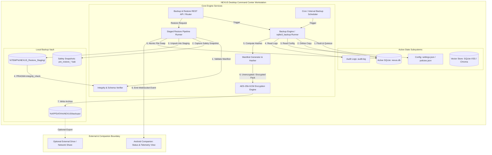
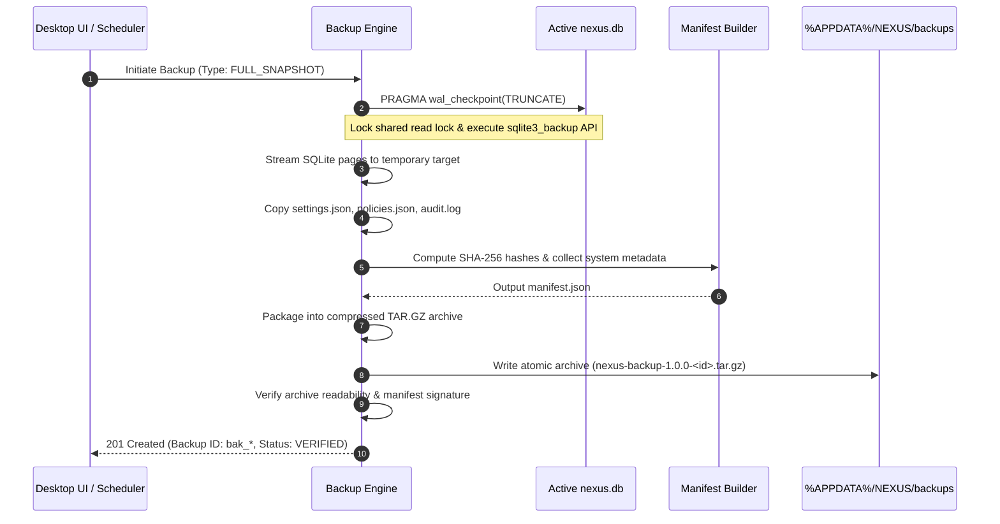
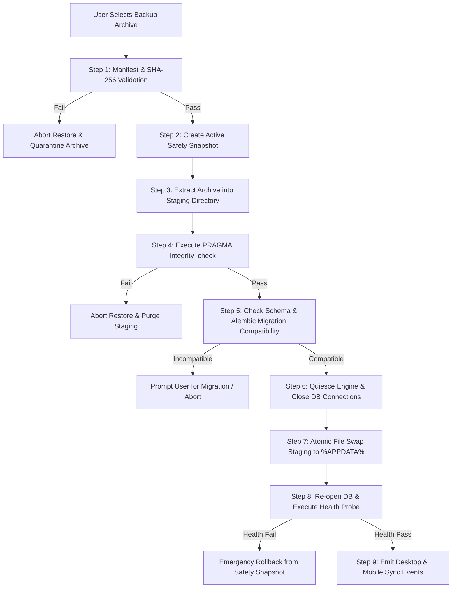
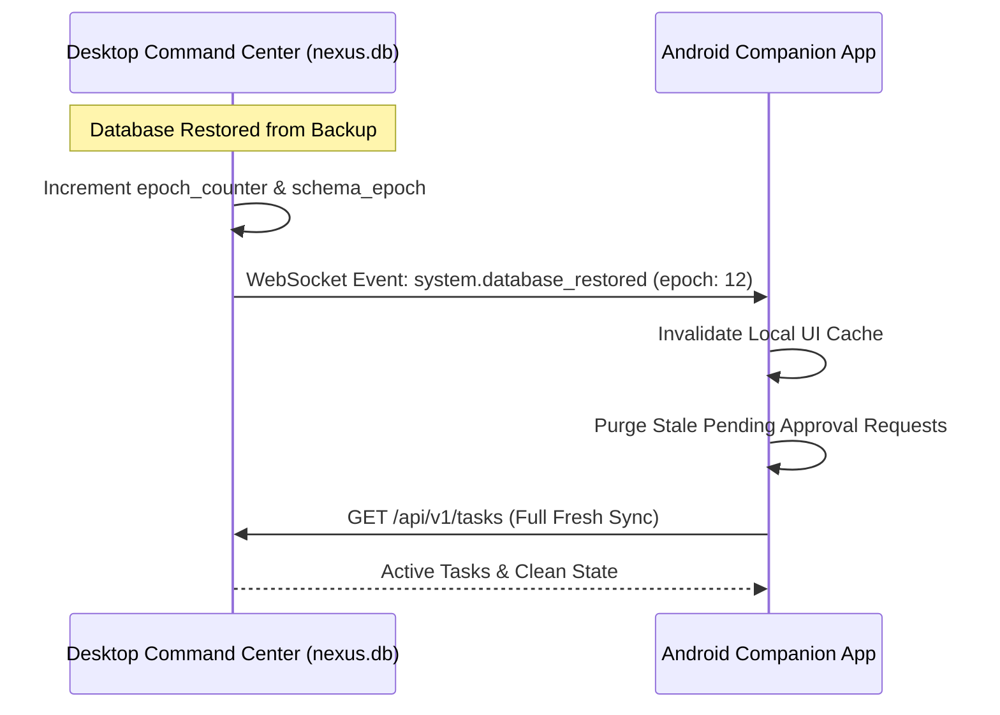

# NEXUS — Backup, Restore & Disaster Recovery Architecture

**Document Version:** 1.0.0  
**Status:** Approved Production Architecture Baseline  
**Classification:** Core System Reliability, Data Integrity & Disaster Recovery Specification  
**Target Systems:** NEXUS Desktop (Windows x64 Native / Tauri + FastAPI Engine) & NEXUS Mobile Companion (Android Node)  
**Primary Sources of Truth:**
- `docs/PRD.md` (v1.0.0)
- `docs/NEXUS_TECH_STACK.md` (v1.0.0)
- `docs/NEXUS_BACKEND_ARCHITECTURE.md` (v1.0.0)
- `docs/NEXUS_SECURITY_ARCHITECTURE.md` (v1.0.0)
- `docs/NEXUS_DEPLOYMENT_ARCHITECTURE.md` (v1.0.0)
- `docs/NEXUS_OBSERVABILITY_ARCHITECTURE.md` (v1.0.0)
- `docs/NEXUS_TESTING_AND_QA_ARCHITECTURE.md` (v1.0.0)
- `docs/NEXUS_AI_EVALUATION_ARCHITECTURE.md` (v1.0.0)

---

## 1. Executive Summary

NEXUS is an autonomous, **local-first AI Software Engineering Command Center**. It coordinates software-engineering workflows using specialized agents (Planner, Developer, Tester, Debugger, Security, Reviewer), strictly governed tools, local sandbox execution, automated test verification, and mandatory human approval gates.

In a local-first engineering execution platform, data persistence is decentralized: the developer's workstation is the primary execution host and authoritative data store. NEXUS stores and manages critical operational state including user workspace configurations, multi-agent task execution histories, approval records, audit logs, local SQLite databases, agent memory palace embeddings, model provider settings, tool execution policies, and automated workflows.

### 1.1 Objectives of the Backup & Recovery Architecture
1. **Zero Unrecoverable State Loss:** Guarantee that accidental deletion, database corruption, failed migrations, software crashes, or OS reinstalls can be cleanly recovered to a verified consistent checkpoint.
2. **Deterministic & Atomic Restores:** Restores execute through an isolated staging pipeline with pre-restore safety snapshots and automated rollbacks, preventing partial or corrupt states.
3. **Data Integrity Over Silent Recovery:** Backups and restores are cryptographically validated (SHA-256 / HMAC) and structurally validated (`PRAGMA integrity_check`). NEXUS will fail explicitly rather than mount damaged state.
4. **Local-First Privacy & Zero Cloud Leakage:** All backup archives remain strictly local and under developer ownership unless explicitly and deliberately exported to a user-configured destination.
5. **Human-in-the-Loop Governance:** Restores, rollbacks, and recovery actions require explicit developer confirmation.

### 1.2 Distinctions: Backup vs. Export vs. Sync vs. Replication
- **Backup:** An immutable, point-in-time, application-consistent snapshot of authoritative system state packaged with a cryptographically verifiable manifest for disaster recovery.
- **Export:** A user-initiated extraction of specific portable assets (e.g., project workspace metadata, memory palace knowledge items, or audit logs) into standard formats (JSON/Markdown/ZIP) for sharing or archiving.
- **Synchronization:** Bidirectional or unidirectional state alignment between the Desktop Command Center and the Android Companion node over local mTLS/WebSocket connections. Mobile never acts as an independent backup authority.
- **Replication:** Real-time continuous state duplication across storage media (not required for MVP/V1 local-first operations; reserved for future enterprise clusters).

### 1.3 Recovery Guarantees & Fundamental Limitations
- **Guaranteed:** Complete recovery of SQLite relational tables, application configuration, audit trails, and project associations up to the latest verified backup checkpoint ($RPO \le 24\text{ hours}$ default scheduled, $RPO = 0$ for pre-migration safety snapshots).
- **Guaranteed:** Safe recovery of interrupted agent tasks into a reviewable `PAUSED_INTERRUPTED` state without uncontrolled re-execution of side-effects.
- **Limitation:** NEXUS does **not** replace Git version control for user repositories. Uncommitted file edits outside NEXUS-tracked patch operations depend on developer filesystem backups or Git stashes.
- **Limitation:** Encrypted backups for which the developer has lost the passphrase or recovery key are mathematically unrecoverable. NEXUS embeds no backdoors.

---

## 2. Scope and Non-Goals

### 2.1 MVP Scope (Baseline)
- **Local SQLite Online Backups:** Non-blocking, transactionally consistent SQLite WAL backups using the native `sqlite3_backup` API.
- **Pre-Migration Safety Snapshots:** Automatic, synchronous database snapshots captured immediately prior to executing Alembic database migrations.
- **Pre-Restore Safety Checkpoints:** Automatic preservation of active system state before executing any restore operation.
- **Versioned Manifest System:** Standardized `manifest.json` embedded in every archive containing SHA-256 checksums, schema versions, and platform metadata.
- **Staged Atomic Restore Pipeline:** Isolation of unpacked restore data in a staging directory, schema compatibility validation, integrity verification, atomic file swap, and automated rollback upon health check failure.
- **Task Crash Recovery:** Detection of interrupted active tasks upon application startup and conversion to `PAUSED_INTERRUPTED` state.
- **15 Disaster Recovery Playbooks:** Complete operational procedures for all major failure modes.

### 2.2 V1 Scope (Planned Expansion)
- **Automated Scheduling & Rotation:** Background cron/interval scheduler with configurable retention policies (e.g., keep last 7 daily, 4 weekly) and disk quota enforcement.
- **AES-256-GCM Archive Encryption:** Password-authenticated encryption using Argon2id key derivation for portable backup files.
- **Selective Restore Engine:** Capability to restore isolated sub-domains (e.g., configuration only, task history only, or project metadata only) without replacing the entire database.
- **Vector Memory Re-indexing Engine:** Automated re-generation of derived vector embeddings from authoritative SQLite records following a database restore.
- **Host-to-Host Migration Wizard:** Dedicated import/export workflow for transferring complete NEXUS environments between workstations.

### 2.3 Future Enhancements (Post-V1)
- **External Storage Destination Adapters:** Opt-in connectors for user-owned network shares (SMB/NFS), local NAS, or user-authenticated S3/WebDAV endpoints.
- **Differential & Incremental Page Backups:** Block-level or WAL-frame delta backups for multi-gigabyte installations.
- **Continuous Background Health Monitoring:** Autonomous periodic background integrity validation drills.

### 2.4 Desktop vs. Android Responsibilities
| Capability | Windows Desktop Command Center | Android Companion Node |
| :--- | :--- | :--- |
| **Data Authority** | **Primary & Sole Authoritative Store** | Ephemeral Cache & Remote View |
| **Backup Creation** | Executes backup engine, writes archives | None (Monitors backup job status) |
| **Backup Storage** | Stores local backup vault in `%APPDATA%\NEXUS\backups` | Stores zero database backup archives |
| **Restore Execution** | Executes staging, integrity checks, and file swaps | Re-synchronizes UI cache upon desktop restore |
| **Disaster Recovery** | Primary recovery host | Re-pairs mTLS credentials if host changes |

### 2.5 Explicit Non-Goals
1. **No Default Cloud Telemetry or Cloud Storage:** NEXUS will never silently or automatically transmit backups to proprietary cloud servers.
2. **No Repository VCS Replacement:** NEXUS is not a replacement for Git, GitHub, GitLab, or filesystem volume backups.
3. **No Heavy Model Weight Archiving:** Model weight files (e.g., 4GB–70GB Ollama/GGUF weights) are excluded from backup archives; they are re-downloaded via model manifest tags.
4. **No Hot-Standby Multi-Master Replication:** NEXUS is an individual or companion-paired command center, not a distributed multi-master consensus cluster.

---

## 3. Recovery Principles

The NEXUS backup and disaster recovery architecture adheres strictly to ten immutable engineering principles:

```
+---------------------------------------------------------------------------------------------------+
|                                 NEXUS CORE RECOVERY PRINCIPLES                                    |
+---------------------------------------------------------------------------------------------------+
| 1. Integrity Before Availability    | 6. Least-Privilege Execution                                |
| 2. User Control & Human Consent     | 7. Zero-Knowledge Cryptography                               |
| 3. Explicit Restore Confirmation    | 8. Strict Version Compatibility Gates                       |
| 4. Deterministic Verification       | 9. Real-Time Transparent Observability                      |
| 5. Atomic & Reversible Operations   | 10. Preservation of Original State Until Health Verified    |
+---------------------------------------------------------------------------------------------------+
```

1. **Integrity Before Availability:** An unverified or suspect backup must never be restored into the active workspace. If an archive fails checksum validation or integrity checks, the operation fails immediately.
2. **User Control:** Automated systems may capture scheduled backups, but restoring, overwriting, or deleting historical backups is governed by explicit user intent.
3. **Explicit Restore Confirmation:** Because restoring authoritative state can overwrite recent modifications, destructive operations require explicit UI confirmation and acknowledgment of the target timestamp.
4. **Backup Verification:** A backup is not marked as `HEALTHY` or `VERIFIED` merely because a file was written; it must pass archive extraction tests, manifest validation, and SQLite integrity checks.
5. **Atomic or Recoverable Operations:** Restores are performed via temporary staging environments and atomic filesystem swaps. If a failure occurs midway, the system rolls back to the pre-restore state without data loss.
6. **Least-Privilege Access:** The backup engine operates with strictly bounded local filesystem permissions and will never execute arbitrary pre/post-restore scripts.
7. **Encryption and Privacy:** Exported archives containing sensitive configuration or audit records must support industry-standard AES-256-GCM encryption with zero secret leakage in logs or manifests.
8. **Version Compatibility:** Backups declare application, schema, and format versions. Restores across incompatible major schema versions are gated behind migration validators.
9. **Clear Recovery Status:** System health, active recovery operations, rollback alerts, and quarantine states must be surfaced transparently across Desktop (Screen 25) and Mobile.
10. **Preservation of Original Data:** Before any restore or migration touches the active database, a complete pre-operation safety backup is generated. The original data is never discarded until the new state passes all startup health probes.

---

## 4. Data Inventory and Backup Classification

To ensure rigorous data protection without inflating storage with regenerable caches, NEXUS classifies all data into authoritative, derived, external, and ephemeral categories.

### 4.1 Master Data Inventory Table

| Data Category | Subsystem / Location | Authoritative vs Derived | Criticality | Backup Req | Default Frequency | Encryption Req | Retention Policy | Restore Priority | Dependencies | Exclusion Rationale (if excluded) |
| :--- | :--- | :--- | :--- | :--- | :--- | :--- | :--- | :--- | :--- | :--- |
| **Relational Database (`nexus.db`)** | `%APPDATA%\NEXUS\data\nexus.db` | **Authoritative** | **CRITICAL** | Mandatory | Daily / Pre-Migration | Optional (V1 AES-GCM) | 30 Days (Rolling) | **P1 (Core)** | None | Included in all full backups. |
| **User & App Settings** | `%APPDATA%\NEXUS\config\settings.json` | **Authoritative** | **HIGH** | Mandatory | On Change / Daily | No (No secrets) | 30 Days | **P1 (Core)** | None | Included in all backups. |
| **Tool Execution Policies** | `%APPDATA%\NEXUS\config\policies.json` | **Authoritative** | **HIGH** | Mandatory | On Change / Daily | No | 30 Days | **P1 (Core)** | None | Included in all backups. |
| **Security Audit Logs** | `%APPDATA%\NEXUS\logs\audit.log` | **Authoritative** | **CRITICAL** | Mandatory | Daily Rotation | No (Pre-redacted) | 90 Days | **P2 (Audit)** | None | Included in full & compliance backups. |
| **Task & Execution History** | Relational (`tasks`, `task_steps`) | **Authoritative** | **HIGH** | Mandatory | Daily | Optional (V1) | 30 Days | **P1 (Core)** | `nexus.db` | Stored in relational tables. |
| **Approvals & Human Decisions** | Relational (`approvals` table) | **Authoritative** | **CRITICAL** | Mandatory | Daily | Optional (V1) | 90 Days | **P1 (Core)** | `nexus.db` | Stored in relational tables. |
| **Project Workspaces Metadata** | Relational (`projects` table) | **Authoritative** | **HIGH** | Mandatory | Daily | Optional (V1) | 30 Days | **P1 (Core)** | `nexus.db` | Paths and project configuration. |
| **Vector Memory Embeddings** | `%APPDATA%\NEXUS\storage\vectors\` | **Derived** | **MEDIUM** | Recommended | Weekly / Export | No | 14 Days | **P3 (Index)** | SQLite docs | Regenerable via background re-index. |
| **AST & Semantic Symbol Indexes**| `%APPDATA%\NEXUS\storage\ast_cache\` | **Derived** | **LOW** | **EXCLUDED** | None | N/A | Ephemeral | N/A | Source files | Regenerated on repository open. |
| **Tool Sandbox Temporary Diffs** | `%APPDATA%\NEXUS\storage\diffs\` | **Ephemeral** | **LOW** | **EXCLUDED** | None | N/A | Ephemeral | N/A | Active tasks | Discarded on task completion. |
| **Application Diagnostic Logs** | `%APPDATA%\NEXUS\logs\nexus.log` | **Operational** | **MEDIUM** | Optional | Weekly | No | 14 Days | **P4 (Diag)** | None | Optional inclusion for debug archives. |
| **Vault Credentials & Secrets** | Windows Credential Manager / DPAPI | **Authoritative** | **CRITICAL** | **EXCLUDED** | Handled by OS | OS Vault | OS Lifetime | **P1 (Manual)**| OS User | **Excluded from plaintext archives.** |
| **Local LLM Model Weights** | Host Ollama Cache (`~/.ollama`) | **External** | **LOW** | **EXCLUDED** | None | N/A | Managed by Ollama | N/A | Model Hub | Re-downloaded via model manifest tag. |
| **Docker Images & Sandboxes** | Docker Daemon Storage | **External** | **LOW** | **EXCLUDED** | None | N/A | Host Docker | N/A | Dockerfile | Re-built dynamically by task runner. |
| **User Git Repositories** | Developer Workspace Directories | **External** | **CRITICAL** | **EXCLUDED** | User Git VCS | User Controlled | User Git VCS | N/A | User Git | **User-owned; NEXUS stores references.** |

### 4.2 Authoritative vs. Referenced vs. Regenerable Data
- **Authoritative Data (Must Protect):** The SQLite database (`nexus.db`), configuration files, and audit logs. If lost, historical decisions, user preferences, and task tracking cannot be reconstructed.
- **Referenced Data (User-Owned):** User project source code and Git repositories. NEXUS tracks absolute/relative filesystem paths, active branch names, and commit hashes, but relies on developer Git remotes (GitHub/GitLab) and local Git for source code versioning.
- **Regenerable Data (Can Rebuild):** Vector embeddings (ChromaDB / SQLite-VSS), AST symbol trees, and diff caches. If absent upon restore, the NEXUS engine marks them as `DIRTY` and triggers background re-indexing without blocking system startup.

---

## 5. Backup Architecture Overview

The NEXUS backup and recovery subsystem is structured into decoupled components: the **Backup Engine**, the **Manifest Generator**, the **Integrity Verifier**, the **Vault Storage Manager**, the **Staged Restore Pipeline**, and the **Task Recovery Reconciler**.

### 5.1 Component Architecture Diagram



### 5.2 Backup Data-Flow Pipeline



### 5.3 Restore Data-Flow Pipeline

```mermaid
sequenceDiagram
    autonumber
    participant Dev as Developer
    participant UI as Desktop UI (Screen 21 / 25)
    participant RST as Restore Pipeline
    participant Active as Active State (%APPDATA%)
    participant Stage as Staging Temp Dir
    participant Health as Health Subsystem

    Dev->>UI: Select Backup (bak_*) & Confirm Restore
    UI->>RST: POST /api/v1/backups/{id}/restore
    RST->>RST: Validate Manifest & Check Archive SHA-256
    RST->>Active: Capture Safety Snapshot (pre_restore_safety_*.bak)
    RST->>Stage: Unpack Archive into Isolated Staging Area
    RST->>Stage: Execute PRAGMA integrity_check & Alembic Version Check
    alt Integrity Check Fails
        RST->>Stage: Purge Staging Area
        RST-->>UI: 400 Bad Request (Integrity Check Failed; Aborted)
    else Integrity Passes
        RST->>Active: Quiesce Engine, Close Connection Pools
        RST->>Active: Atomic Filesystem Move (Staging -> Active)
        RST->>Active: Reopen Database Connection Pools
        RST->>Health: Execute Startup Health Probe (GET /api/v1/health)
        alt Health Probe Fails
            RST->>Active: Emergency Rollback (Swap Safety Snapshot back)
            RST-->>UI: 500 Internal Error (Restore Failed Health Probe; Rolled Back)
        else Health Probe Passes
            RST->>RST: Clean up temporary staging files
            RST-->>UI: 200 OK (Restore Completed & System Healthy)
        end
    end
```

---

## 6. Backup Types and Strategies

NEXUS evaluates multiple backup strategies to determine the optimal balance of consistency, speed, storage overhead, and recovery simplicity for a local-first engineering command center.

### 6.1 Strategy Evaluation Matrix

| Backup Strategy | Storage Overhead | Backup Duration | Restore Duration | Implementation Complexity | Consistency Level | Portability | Failure Recovery Simplicity | Selected for NEXUS |
| :--- | :--- | :--- | :--- | :--- | :--- | :--- | :--- | :--- |
| **Full Online Snapshot** | Medium (~10MB–50MB) | Fast (<2s) | Ultra-Fast (<1s) | Low–Medium | Application-Consistent (ACID) | High (Single Archive) | Maximum (Drop-in replacement) | **YES (Primary MVP & V1)** |
| **Pre-Migration Safety Snapshot** | Low (~5MB–30MB) | Instant (<500ms) | Instant (<500ms) | Low | Strict Transactional Snapshot | High (Local `.bak`) | Maximum (Instant revert) | **YES (Mandatory MVP)** |
| **Incremental WAL Archiving** | Low per delta | Continuous | Medium (Replay WAL) | High | Point-In-Time Consistent | Low (Multi-file chain) | Medium (Chain dependency) | Deferred to Future |
| **Configuration-Only Export** | Minimal (<100KB) | Instant (<100ms) | Instant (<100ms) | Minimal | Pure File Copy | Maximum (JSON) | High (Non-destructive) | **YES (MVP / V1)** |
| **File-Level OS Copy (`cp`)** | Medium | Instant | Fast | Zero | **UNSAFE (Risk of torn pages)** | High | **POOR (Risk of corruption)** | **REJECTED** |

### 6.2 Strategy Justification
NEXUS adopts the **Full Online Snapshot via `sqlite3_backup` API** as its core strategy:
1. **Application Consistency:** A naive file-system copy while SQLite WAL is active causes torn pages and corrupt database headers. The `sqlite3_backup` API guarantees consistent point-in-time page copies without stopping read/write concurrency.
2. **Storage Efficiency:** In a local-first developer tool, relational databases typically range from 5MB to 200MB. Full compressed `.tar.gz` archives require negligible disk overhead (~5MB to 30MB per backup) compared to the extreme complexity and brittleness of WAL frame delta replay chains.
3. **Recovery Speed & Simplicity:** A full snapshot restores in a single atomic file swap without chain reconstruction risks.

---

## 7. Backup Consistency and Atomicity

A critical challenge in local-first backup systems is capturing consistent state while agent loops are generating code, database transactions are committing, and logs are appending.

### 7.1 Online Quiescing & Checkpoint Protocol
1. **Forced WAL Checkpoint:** Before taking an online backup, the engine invokes:
   ```sql
   PRAGMA wal_checkpoint(TRUNCATE);
   ```
   This consolidates dirty WAL frames back into the primary database file and truncates the WAL file to zero bytes.
2. **SQLite C-Backup Locking:** The Python engine utilizes `sqlite3.Connection.backup()` targeting a temporary database file. This API copies database pages in blocks. If a concurrent agent transaction writes to a page currently being backed up, SQLite automatically retries copying that page, ensuring ACID snapshot isolation.
3. **Audit Log Rolling:** The logging subsystem pauses log file rotation during the milliseconds required to copy `audit.log`, ensuring log continuity.

### 7.2 In-Flight Task & Agent State Handling
If a multi-agent task is actively running during a backup:
- The task state is captured in its last committed relational step (`TaskStep` and `ToolExecution`).
- The in-flight orchestrator state is serialized into the snapshot with status `PAUSED_CHECKPOINT`.
- Upon restore, the system **never** blindly executes unconfirmed pending shell commands or file writes; it sets task status to `PAUSED_INTERRUPTED` and presents a diff review to the developer on Screen 07.

### 7.3 Manifest Generation and Atomic Publication
- All backup archive contents (`data/nexus.db`, `config/settings.json`, `config/policies.json`, `logs/audit.log`) are extracted into an isolated temporary staging directory (`%TEMP%\nexus_bak_staging_<uuid>\`).
- Cryptographic SHA-256 hashes are calculated for each file.
- `manifest.json` is generated and written into the root of the staging folder.
- The folder is packaged into a compressed archive (`.tar.gz` or encrypted `.enc`).
- The archive is written to `%APPDATA%\NEXUS\backups\nexus-backup-<version>-<id>.tar.gz.tmp` and **atomically renamed** to its final filename only after full verification.

```
+---------------------------------------------------------------------------------------------------+
|                              ATOMIC BACKUP CREATION WORKFLOW                                      |
+---------------------------------------------------------------------------------------------------+
|  [Active DB] --(wal_checkpoint)--> [sqlite3_backup API]                                           |
|                                            |                                                      |
|                                            v                                                      |
|  [Config & Logs] -------------> [Staging Temp Dir] --> [Compute SHA-256 Hashes]                   |
|                                                                |                                  |
|                                                                v                                  |
|  [Atomic Rename: .tmp -> .tar.gz] <-- [Package Archive] <-- [Embed manifest.json]                 |
+---------------------------------------------------------------------------------------------------+
```

---

## 8. Backup Manifest and Metadata

Every NEXUS backup archive contains a root `manifest.json` defining cryptographic, structural, and version metadata.

### 8.1 Manifest Schema (JSON Specification)

```json
{
  "$schema": "https://nexus.ai/schemas/backup-manifest-v1.json",
  "manifest_version": "1.0.0",
  "backup_id": "bak_01J8Z9M2P4L7K19XW0ABCDEF12",
  "backup_label": "Pre-Refactoring Full System Checkpoint",
  "created_at_utc": "2026-09-27T15:30:00.000000Z",
  "nexus_version": "1.0.0",
  "schema_version": "001_initial_schema",
  "alembic_version_num": "a1b2c3d4e5f6",
  "platform": {
    "os": "windows",
    "os_version": "10.0.22631",
    "architecture": "x86_64",
    "hostname_hash": "e3b0c44298fc1c149afbf4c8996fb92427ae41e4649b934ca495991b7852b855"
  },
  "backup_type": "FULL_SNAPSHOT",
  "trigger_source": "MANUAL_USER_REQUEST",
  "encryption": {
    "enabled": false,
    "algorithm": null,
    "kdf": null,
    "salt_hex": null,
    "kdf_iterations": null,
    "auth_tag_hex": null
  },
  "compression": {
    "algorithm": "tar.gz",
    "level": 6
  },
  "included_categories": [
    "RELATIONAL_DATABASE",
    "USER_SETTINGS",
    "TOOL_POLICIES",
    "AUDIT_LOGS"
  ],
  "excluded_categories": [
    "AST_CACHE",
    "VECTOR_EMBEDDINGS",
    "MODEL_WEIGHTS",
    "GIT_REPOSITORIES"
  ],
  "file_inventory": [
    {
      "relative_path": "data/nexus.db",
      "category": "RELATIONAL_DATABASE",
      "size_bytes": 1048576,
      "sha256": "4f53cda18c2baa0c0354bb5f9a3ecbe5ed12ab4d8e11ba873c2f11161202b945",
      "required": true
    },
    {
      "relative_path": "config/settings.json",
      "category": "USER_SETTINGS",
      "size_bytes": 2048,
      "sha256": "e3b0c44298fc1c149afbf4c8996fb92427ae41e4649b934ca495991b7852b855",
      "required": true
    },
    {
      "relative_path": "config/policies.json",
      "category": "TOOL_POLICIES",
      "size_bytes": 4096,
      "sha256": "c8d3746654b0380e227e7191bf88e14620f305f87b8f9e612f00a5d5e27a9223",
      "required": true
    },
    {
      "relative_path": "logs/audit.log",
      "category": "AUDIT_LOGS",
      "size_bytes": 65536,
      "sha256": "8f434346648f6b96df89dda901c5176b10a6d83961dd3c1ac88b59b2dc327aa4",
      "required": false
    }
  ],
  "database_statistics": {
    "total_projects": 4,
    "total_tasks": 48,
    "total_task_steps": 210,
    "total_tool_executions": 382,
    "total_approvals": 52,
    "total_audit_records": 1104
  },
  "total_uncompressed_bytes": 1120256,
  "total_archive_bytes": 348160,
  "archive_sha256": "9b71d224bd62f3785d96d46ad3ea3d73319bfbc2890caadae2dff72519673ca7",
  "verification_status": "VERIFIED_VALID"
}
```

### 8.2 Manifest Validation and Compatibility Gates
Before unpacking any archive, the restore runner executes strict manifest validation:
1. **Schema Check:** Validates that `manifest_version` is supported by the current NEXUS engine.
2. **File Table Consistency:** Validates that every file listed in `file_inventory` exists inside the archive and that no unlisted or rogue executable files (`.exe`, `.dll`, `.bat`, `.sh`) are present.
3. **Checksum Verification:** Computes SHA-256 for each unpacked file and matches against `file_inventory[*].sha256`.
4. **Schema Version Check:** Compares `schema_version` and `alembic_version_num` against the host application's supported database revisions.

---

## 9. Encryption and Key Management

Aligned with the **NEXUS Security Architecture (`docs/NEXUS_SECURITY_ARCHITECTURE.md`)**, backup encryption protects developer data when archives are copied to external drives or transferred between workstations.

### 9.1 Encryption Algorithm and Parameters
- **Cipher:** Authenticated **AES-256-GCM** (Galois/Counter Mode).
- **Key Derivation Function (KDF):** **Argon2id** (RFC 9106)
  - Memory Cost: $64\text{ MB}$ (`m=65536`)
  - Time Cost: $3\text{ iterations}$ (`t=3`)
  - Parallelism: $4\text{ threads}$ (`p=4`)
  - Salt: $128\text{-bit}$ cryptographically secure random salt generated per backup (`os.urandom(16)`).
- **Initialization Vector (IV / Nonce):** $96\text{-bit}$ unique random nonce per archive (`os.urandom(12)`).
- **Authentication Tag:** $128\text{-bit}$ GCM authentication tag appended to the ciphertext stream.

```
+---------------------------------------------------------------------------------------------------+
|                                AES-256-GCM BACKUP ENCRYPTION PIPELINE                             |
+---------------------------------------------------------------------------------------------------+
|  [User Passphrase] + [128-bit Salt] --> [Argon2id KDF] --> [256-bit Key]                          |
|                                                                    |                              |
|                                                                    v                              |
|  [Plaintext Tar Archive] + [96-bit Nonce] -----------------> [AES-256-GCM]                        |
|                                                                    |                              |
|                                                                    v                              |
|  [Header: Salt + Nonce] + [Encrypted Payload] + [128-bit Auth Tag] --> [Encrypted Archive (.enc)]|
+---------------------------------------------------------------------------------------------------+
```

### 9.2 Secret Handling & Vault Policy
- **Zero Plaintext Secrets:** Sensitive third-party API keys (e.g., Anthropic, OpenAI API keys) stored in Windows Credential Manager / DPAPI are **excluded** from unencrypted local backups.
- **Encrypted Vault Export:** If the developer explicitly chooses to include credentials in an encrypted backup, secrets are re-encrypted using the backup key derived from the user's passphrase.
- **Lost Key Policy:** NEXUS embeds no master recovery keys or backdoors. If an encrypted backup key is lost, the archive is permanently unrecoverable. The UI clearly warns developers of this invariant during passphrase setup.

### 9.3 Open Decision: Key Recovery
> [!NOTE]
> `OPEN DECISION: SEC-01` — Recovery Key Export Mechanism  
> Should NEXUS generate an optional 24-word BIP-39 mnemonic recovery phrase during encrypted backup export to permit passphrase recovery?  
> *Proposed Baseline:* Support optional 24-word mnemonic generation during V1 encryption setup.

---

## 10. Backup Scheduling and Retention

Automated scheduling prevents data loss caused by human omission while retention policies prevent unbounded storage growth on developer workstations.

### 10.1 Scheduling Profiles

| Backup Type | Trigger / Frequency | Execution Window | Retention Target | Disk Quota Allocation | Automated Action |
| :--- | :--- | :--- | :--- | :--- | :--- |
| **Pre-Migration Safety** | Immediate prior to Alembic upgrade | Synchronous pre-hook | Keep last 5 snapshots | 200 MB | Auto-created before DB upgrade |
| **Pre-Restore Safety** | Immediate prior to restore execution | Synchronous pre-hook | Keep last 3 snapshots | 150 MB | Auto-created before DB restore |
| **Scheduled Daily** | Every 24 hours (Default: 03:00 local) | Idle background | Keep last 7 daily | 500 MB | Auto-purges oldest beyond quota |
| **Scheduled Weekly** | Every 7 days (Sunday 04:00 local) | Idle background | Keep last 4 weekly | 500 MB | Consolidated weekly snapshot |
| **Manual On-Demand** | User clicked "Create Backup" | Immediate | Retained until manual delete | Configurable | Tagged with custom user note |

### 10.2 Retention & Rotation Algorithm
NEXUS implements a **FIFO (First-In, First-Out) with Generational Grandfather-Father-Son (GFS)** pruning policy:
1. **Pre-Flight Disk Space Check:** The backup engine checks available free disk space on `%APPDATA%`. If free space is less than $3\times$ the active database size or $<1\text{ GB}$, the backup halts with error code `ERR_DISK_SPACE_EXHAUSTED` and triggers an alert.
2. **Quota Enforcement:** If total backup vault usage exceeds $1.5\text{ GB}$ (configurable in `settings.json`), the oldest daily backups are purged first, while keeping the most recent pre-migration safety snapshots intact.
3. **Immutable Safety Snapshots:** Pre-migration and pre-restore safety snapshots are protected from background automated pruning for at least 72 hours.

---

## 11. Backup Verification and Integrity

A backup is useless if it cannot be restored. NEXUS enforces a strict multi-tier verification hierarchy.

### 11.1 Verification Levels

```
Level 0: Physical Write Complete (Archive written to disk)
    │
    ▼
Level 1: Archive & Checksum Integrity Validated (Tar readable, SHA-256 matches manifest)
    │
    ▼
Level 2: Structural DB Integrity Validated (Unpacked in staging, PRAGMA integrity_check passes)
    │
    ▼
Level 3: Full Synthetic Restore Drill (Mounted in ephemeral sandbox, schema & queries verified)
```

1. **Level 0 — Created:** Archive file handle closed successfully.
2. **Level 1 — Checksum Verified:** The archive is opened, `manifest.json` is parsed, and the archive SHA-256 hash matches the computed digest.
3. **Level 2 — Database Integrity Verified:** The database is extracted into a staging sandbox and executes:
   ```sql
   PRAGMA quick_check;
   PRAGMA integrity_check;
   PRAGMA foreign_key_check;
   ```
   Zero errors must be returned.
4. **Level 3 — Fully Verified:** A synthetic read query is executed across core tables (`projects`, `tasks`, `approvals`) to verify relational correctness. The manifest status is then marked `VERIFIED_VALID`.

### 11.2 Corrupt Backup Quarantine Protocol
If an archive fails Level 1 or Level 2 verification:
1. The archive is immediately appended with `.quarantine` (e.g., `nexus-backup-1.0.0-bak_*.tar.gz.quarantine`).
2. An audit incident record (`SECURITY_BACKUP_CORRUPTION_DETECTED`) is written.
3. The UI alerts the developer and prompts for a fresh manual backup.

---

## 12. Restore Architecture

The NEXUS Restore Architecture guarantees zero-data-loss recovery through an isolated, staged pipeline with automatic rollbacks.



### 12.1 Detailed 14-Step Restore Workflow
1. **Selection:** User selects a local backup from the vault or browses to an external `.tar.gz` / `.enc` archive.
2. **Passphrase Decryption (if encrypted):** Prompts for passphrase, derives key via Argon2id, decrypts into staging.
3. **Manifest Inspection:** Validates `manifest.json` schema, platform architecture, and required file list.
4. **Cryptographic Checksum Verification:** Verifies SHA-256 hash of every included file.
5. **Pre-Restore Safety Snapshot:** Automatically generates `pre_restore_safety_<timestamp>.bak` from active `%APPDATA%\NEXUS` state.
6. **Staging Extraction:** Unpacks database and configuration into isolated `%TEMP%\nexus_restore_staging_<uuid>\`.
7. **Database Integrity Verification:** Executes `PRAGMA integrity_check` on the staged database.
8. **Schema Compatibility Gate:** Compares staged `alembic_version_num` with application version. If older, validates that a forward migration path exists.
9. **Engine Quiesce:** Signals all active workers and agents to pause; gracefully terminates open SQLite database connection pools.
10. **Atomic Filesystem Swap:** Replaces active `nexus.db`, `settings.json`, and `policies.json` with staged files using atomic filesystem rename operations (`os.replace`).
11. **Connection Pool Re-initiation:** Re-establishes SQLAlchemy engine connection pools with the restored database.
12. **Health Probe:** Executes `GET /api/v1/health` and verifies that all core models query successfully.
13. **Rollback Guard:** If the health probe fails, the engine re-swaps the pre-restore safety snapshot back into place, restarts, and alerts the user.
14. **Completion & Notification:** Emits `system.database_restored` event over WebSocket to update Desktop UI (Screen 26) and Android companion.

### 12.2 Restore Modes
- **Full System Restore:** Replaces database, user configuration, tool policies, and audit logs.
- **Database-Only Restore:** Replaces `nexus.db` while preserving current `settings.json` and active tool policies.
- **Configuration-Only Restore:** Restores `settings.json` and `policies.json` without modifying task histories or project records.

---

## 13. Restore Compatibility and Version Migration

NEXUS guarantees structured cross-version compatibility rules to prevent database corruption during application updates.

### 13.1 Compatibility Matrix

| Backup Version vs. Current App Version | Scenario | Compatibility Status | Action Taken by Restore Engine |
| :--- | :--- | :--- | :--- |
| **Backup Version == App Version** | Identical Release | **FULLY COMPATIBLE** | Direct atomic restore without migrations. |
| **Backup Version < App Version** | Upgrading / Restoring Old Backup | **FORWARD MIGRATABLE** | Restores staged database $\rightarrow$ Runs `alembic upgrade head` $\rightarrow$ Health Check $\rightarrow$ Atomic Swap. |
| **Backup Version > App Version** | Downgrading App with New Backup | **BLOCKED (UNSUPPORTED)** | Restores blocked. Prompts developer to update NEXUS Desktop to matching or newer release. |
| **Schema Breaking Major Version (e.g., v1 $\rightarrow$ v2)** | Major Architecture Shift | **CONDITIONAL** | Executes dedicated schema transform script; creates mandatory rollback checkpoint. |

### 13.2 Migration Rollback Limitations
SQLite does not support transactional DDL for all structural modifications (e.g., certain column drops or table renames). Therefore, Alembic migration failures cannot rely purely on SQL `ROLLBACK`. NEXUS solves this by executing migrations against the **staged database copy** before replacing the active database file. If the migration fails, the active database is never touched.

---

## 14. Disaster Recovery Scenarios & Playbooks

The following 15 production playbooks define exact remediation procedures for all critical disaster scenarios.

### Playbook 01: SQLite Database Corruption
- **Detection:** Backend raises `DatabaseError: database disk image is malformed` or `PRAGMA integrity_check;` returns non-zero errors.
- **Immediate Containment:** Engine shifts immediately into Read-Only Safe Mode and halts agent execution.
- **Recovery Procedure:**
  1. Quarantines corrupted database: `nexus.db` $\rightarrow$ `nexus.db.corrupted.<timestamp>`.
  2. Identifies the latest healthy backup in `%APPDATA%\NEXUS\backups\`.
  3. Executes the Staged Atomic Restore workflow.
  4. Runs `PRAGMA integrity_check` to verify clean state.
- **Rollback Option:** Corrupted file preserved for post-mortem forensics.
- **RPO / RTO Target:** $RPO \le 24\text{ hours}$; $RTO \le 30\text{ seconds}$.

### Playbook 02: Failed Database Migration during App Update
- **Detection:** Alembic migration fails during application startup with constraint or syntax error.
- **Immediate Containment:** Startup sequence halts; status set to `MIGRATION_HALTED`.
- **Recovery Procedure:**
  1. Engine reads `nexus.db.pre_migration_backup` captured immediately before the upgrade.
  2. Restores pre-migration snapshot over `nexus.db`.
  3. Reverts Alembic revision pointer.
  4. Displays Screen 25 (Error Recovery) with error trace.
- **Data at Risk:** Zero data loss ($RPO = 0$).

### Playbook 03: Interrupted Application Update / Power Failure
- **Detection:** Tauri launcher detects missing sidecar binary or corrupt frontend static bundles.
- **Immediate Containment:** Bootstrapper enters Safe Recovery Mode.
- **Recovery Procedure:**
  1. Validates that `%APPDATA%\NEXUS` database is untouched.
  2. Prompts user to re-run the NSIS standalone installer (`NEXUS-Setup-1.0.0.exe`).
  3. Installer updates binaries in `%LOCALAPPDATA%\Programs\NEXUS` without modifying `%APPDATA%` data.

### Playbook 04: Disk Full during Active Backup Creation
- **Detection:** OS raises `IOError: [Errno 28] No space left on device` during `sqlite3_backup` or tar packaging.
- **Immediate Containment:** Backup engine terminates gracefully; active database remains unaffected.
- **Recovery Procedure:**
  1. Deletes temporary `.tmp` and staging files in `%TEMP%`.
  2. Scans `%APPDATA%\NEXUS\backups` and purges eligible expired backups.
  3. Surfaces low disk warning in Desktop UI (Screen 20 / 25).

### Playbook 05: Primary Host Workstation Disk Failure
- **Detection:** Hardware disk failure or complete filesystem loss.
- **Immediate Containment:** Developer provisions new workstation.
- **Recovery Procedure:**
  1. Install fresh NEXUS Desktop on new machine.
  2. Launch First-Run Setup (Screen 28/33) and select `Import Existing Backup Archive`.
  3. Select external backup archive (`nexus-backup-*.tar.gz`).
  4. Engine unpacks database, restores settings, and connects to local Ollama instance.
- **RPO / RTO Target:** $RPO \le 24\text{ hours}$; $RTO \le 5\text{ minutes}$.

### Playbook 06: Lost or Corrupted Configuration Files (`settings.json`)
- **Detection:** JSON parse error on `settings.json` or schema validation failure during startup.
- **Immediate Containment:** Engine boots with `settings.default.json` fallback in memory.
- **Recovery Procedure:**
  1. Attempts to restore `settings.json` from the latest backup manifest.
  2. If unavailable, regenerates default settings and prompts developer to confirm preferences in Screen 21.

### Playbook 07: Accidental Deletion of Project Workspace Metadata
- **Detection:** Developer accidentally deletes a project from NEXUS Command Center.
- **Immediate Containment:** Physical files on disk are untouched (NEXUS never deletes source repositories).
- **Recovery Procedure:**
  1. Developer opens Backup Vault in Screen 21.
  2. Selects `Selective Restore` $\rightarrow$ `Project Metadata`.
  3. Restores relational records for the deleted project without overwriting current task records.

### Playbook 08: Damaged Vector Memory Palace or Embeddings
- **Detection:** Vector index query raises SQLite-VSS / Chroma corruption exception.
- **Immediate Containment:** Engine isolates memory module; core planner/developer agents fall back to exact lexical grep search.
- **Recovery Procedure:**
  1. Purges `%APPDATA%\NEXUS\storage\vectors\`.
  2. Triggers asynchronous background memory rebuild: reads authoritative project documents from `nexus.db` and re-generates embeddings.
- **Data at Risk:** Zero authoritative data lost ($RPO = 0$).

### Playbook 09: Restore Process Interrupted Midway (Crash / Power Loss)
- **Detection:** Lock file `.restore_in_progress` detected during application boot.
- **Immediate Containment:** Engine refuses standard boot and enters Emergency Recovery Loop.
- **Recovery Procedure:**
  1. Checks if staging directory is complete.
  2. If incomplete, reads `pre_restore_safety_*.bak` and restores the original pre-restore state.
  3. Clears `.restore_in_progress` lock file and boots into normal mode.

### Playbook 10: Corrupted Backup Archive Discovered in Vault
- **Detection:** Level 1 SHA-256 checksum mismatch or decompression error during scheduled verification.
- **Immediate Containment:** Archive quarantined with `.quarantine` suffix.
- **Recovery Procedure:**
  1. Engine triggers immediate automatic generation of a new full backup.
  2. Logs audit incident `SECURITY_BACKUP_CORRUPTION_DETECTED`.

### Playbook 11: Lost Encryption Key for Protected Backup
- **Detection:** Developer enters incorrect passphrase; Argon2id / AES-GCM raises `AuthenticationTagMismatch`.
- **Immediate Containment:** Decryption aborted; staging data wiped immediately.
- **Recovery Procedure:**
  1. UI displays incorrect passphrase error with remaining attempts counter.
  2. Informs developer that without the key or 24-word recovery phrase, the archive is mathematically unrecoverable.

### Playbook 12: Workstation Migration to New OS / Architecture (e.g., x86_64 to ARM64)
- **Detection:** Backup manifest indicates `platform.architecture = "x86_64"` on an `aarch64` host.
- **Immediate Containment:** Validates cross-platform portability.
- **Recovery Procedure:**
  1. Restores SQLite database and configuration (SQLite files are completely endian-neutral and portable).
  2. Skips host-specific binary cache paths and re-initializes platform-native tool paths.

### Playbook 13: Clean Application Reinstall (NEXUS Uninstall & Reinstall)
- **Detection:** Fresh binary installation on existing workstation.
- **Immediate Containment:** NSIS uninstaller preserves `%APPDATA%\NEXUS` unless developer explicitly selects "Purge User Data".
- **Recovery Procedure:**
  1. New installation detects existing `%APPDATA%\NEXUS\data\nexus.db`.
  2. Runs schema migration check and resumes seamlessly without requiring manual archive import.

### Playbook 14: Unexpected Workstation Shutdown During Active Task
- **Detection:** Startup scanner finds tasks in `RUNNING` or `PLANNING` status.
- **Immediate Containment:** Task status updated to `PAUSED_INTERRUPTED`.
- **Recovery Procedure:**
  1. Engine inspects the last committed `TaskStep` in `nexus.db`.
  2. Inspects git status in target repository to verify actual filesystem state.
  3. Developer clicks `Resume Task` in Screen 07; engine resumes from `step_index + 1`.

### Playbook 15: Desktop Engine Unavailable While Mobile Companion Connected
- **Detection:** Android companion loses WebSocket connection to desktop host.
- **Immediate Containment:** Mobile displays "Desktop Disconnected — Read Only Cache" banner.
- **Recovery Procedure:**
  1. Mobile companion blocks new approval decisions or task submissions.
  2. Upon desktop recovery, mobile reconnects via mTLS and re-syncs active state.

---

## 15. Recovery Objectives (RPO & RTO Targets)

The following recovery targets represent proposed service-level objectives to be verified against synthetic load benchmarks.

| Failure Category | Recovery Point Objective (Proposed Target) | Recovery Time Objective (Proposed Target) | Maximum Acceptable Data Loss | Benchmarking Method |
| :--- | :--- | :--- | :--- | :--- |
| **Database Corruption** | $\le 24 \text{ Hours}$ (Scheduled Snapshot) | $\le 30 \text{ Seconds}$ | Unsaved activity since last backup | Synthetic DB corruption injection test |
| **Failed Schema Migration** | **0 Seconds (Exact Pre-Migration State)** | $\le 10 \text{ Seconds}$ | **Zero Data Loss** | Intentional syntax error in Alembic revision |
| **Application Crash** | $\le 5 \text{ Seconds}$ (WAL Checkpoint) | $\le 5 \text{ Seconds}$ (Auto Re-spawn) | In-memory uncommitted ring buffer logs | `kill -9` process simulation |
| **Interrupted Active Task** | **0 Seconds (Last Committed Step)** | $\le 15 \text{ Seconds}$ | In-flight incomplete shell command output | Power-cut simulation during tool execution |
| **Complete Workstation Loss**| $\le 24 \text{ Hours}$ (Exported Archive) | $\le 5 \text{ Minutes}$ (Install + Import) | Unexported tasks created on lost machine | Fresh VM installation + Archive import drill |

---

## 16. Active Task and Agent Recovery

When a crash or power cut occurs during autonomous multi-agent execution, NEXUS prevents corrupt or unconfirmed state changes.

### 16.1 Persistence Invariants
- **Atomic Step Commit:** Every discrete agent reasoning step (`TaskStep`) and tool call (`ToolExecution`) is written and committed to SQLite before and after execution.
- **Pending vs. Completed Records:** Before a tool executes (e.g., `patch_file` or `execute_command`), a `ToolExecution` record is created with status `PENDING`. Upon completion, the exit code, diff, and stdout/stderr are committed with status `SUCCESS` or `FAILED`.

### 16.2 Crash Recovery Reconciler
On application startup, the `TaskRecoveryService` executes:
1. **Orphan Scan:** Queries all tasks where `status IN ('RUNNING', 'PLANNING')`.
2. **State Transition:** Updates their status to `PAUSED_INTERRUPTED`.
3. **Pending Tool Check:** For any `ToolExecution` record left in `PENDING` status:
   - Sets status to `UNKNOWN_INTERRUPTED`.
   - Flags the task as requiring **Human Review**.
4. **Resumption Protocol:** The orchestrator will **never** automatically repeat a potentially destructive shell command (`execute_command`) or patch if its completion status was uncertain. The developer must review the repository diff in Screen 07 and click `Approve Resumption`.

---

## 17. Database and Index Recovery

Aligned with the **NEXUS Database Architecture (`docs/NEXUS_BACKEND_ARCHITECTURE.md`)**, relational integrity is maintained across all recovery workflows.

### 17.1 Database-Native Backup Execution
NEXUS executes non-blocking online backups using Python's native SQLite backup binding:

```python
import sqlite3
import asyncio

async def perform_online_sqlite_backup(source_db_path: str, target_backup_path: str):
    """
    Executes an application-consistent online SQLite backup
    without blocking active readers or writers.
    """
    def _backup_sync():
        src_conn = sqlite3.connect(source_db_path)
        # Force flush WAL journal frames to main database
        src_conn.execute("PRAGMA wal_checkpoint(TRUNCATE);")
        
        dst_conn = sqlite3.connect(target_backup_path)
        with dst_conn:
            # Native C-level sqlite3_backup API
            src_conn.backup(dst_conn, pages=100, sleep=0.01)
        
        dst_conn.close()
        src_conn.close()

    await asyncio.to_thread(_backup_sync)
```

### 17.2 Derived Vector Index Regeneration
Vector embeddings (`ChromaDB` / `SQLite-VSS`) are derived from authoritative database records. If the vector store is corrupted or absent following a restore:
1. The engine marks `vector_store_status = "DIRTY"`.
2. A background worker spawns to read all `ProjectDocument` records from SQLite.
3. Batched embeddings are computed via local Ollama embeddings model and re-inserted into the vector store.
4. Core agent execution remains available for lexical operations during index reconstruction.

---

## 18. Repository and Workspace Recovery

A fundamental principle of NEXUS is the clear boundary between NEXUS operational metadata and developer source code.

### 18.1 Repository Ownership & Boundaries
- **User Repositories are External:** NEXUS does **not** duplicate full Git repositories into its backup archives.
- **Metadata Preserved:** NEXUS backs up workspace metadata: project name, root filesystem path, active Git branch, pinned context files, and agent session history.
- **Restore Behavior:** When restoring a backup on a new machine:
  - NEXUS verifies if the project root path exists on the host filesystem.
  - If the path is missing or has changed (e.g., username change between laptops), the UI prompts the developer to remap the project root path.
  - NEXUS never overwrites newer local source code files with older cached versions.

---

## 19. Model and Dependency Recovery

NEXUS decouples model weights from system state backups to maintain compact, lightweight backup archives.

### 19.1 Model Artifact Strategy

| Component | In Backup Archive? | Recovery Strategy | Security / Trust Check |
| :--- | :--- | :--- | :--- |
| **Model Metadata & Settings** | **YES** (`settings.json`) | Restored directly into configuration | Validated against supported provider schema |
| **API Provider Configurations**| **YES** (`settings.json`) | Restored directly (without plaintext secrets) | Endpoint URLs validated for RFC 3986 format |
| **Local LLM Weights (GGUF)** | **NO (EXCLUDED)** | Re-pulled via `ollama pull <model_tag>` | Model tag matched against approved registry |
| **Docker Tool Sandboxes** | **NO (EXCLUDED)** | Dynamically rebuilt from project Dockerfile | Docker socket permission boundary checked |
| **Python Tool Virtualenvs** | **NO (EXCLUDED)** | Auto-provisioned by backend bootstrapper | Package dependencies locked via `requirements.txt`|

---

## 20. Desktop and Android Recovery Boundaries

The **Windows Desktop Command Center** is the sole authoritative state owner. The **Android Companion** is a secure remote node.



### 20.1 Mobile Companion Recovery Rules
1. **No Independent Mobile Restores:** The mobile app cannot initiate or transmit database overwrite payloads to the desktop.
2. **Epoch Invalidation:** Every desktop restore increments a `database_epoch` timestamp. Upon reconnection, mobile nodes comparing a mismatched epoch immediately clear their local caches and re-sync.
3. **Stale Approvals Invalidation:** Any pending approvals generated before the restore timestamp are automatically marked `EXPIRED_RESTORED` to prevent executing actions against restored historical state.

---

## 21. Backup Storage and Portability

NEXUS organizes its local backup vault in a standardized directory structure on the Windows host.

### 21.1 Filesystem Organization

```
%APPDATA%\NEXUS\
├── data\
│   ├── nexus.db                  # Active SQLite primary database
│   ├── nexus.db-wal              # Active Write-Ahead Log
│   └── nexus.db-shm              # Shared memory index
├── config\
│   ├── settings.json             # Application settings & provider configs
│   └── policies.json             # Tool execution permission policies
├── logs\
│   ├── nexus.log                 # Operational diagnostic log
│   └── audit.log                 # Cryptographically structured audit trail
└── backups\                      # LOCAL BACKUP VAULT
    ├── nexus-backup-1.0.0-bak_01J8Z9M2.tar.gz          # Verified Full Backup
    ├── nexus-backup-1.0.0-bak_01J8Z9M2.tar.gz.manifest # Plaintext manifest copy
    ├── safety\
    │   ├── pre_migration_002_20260927_120000.bak       # Pre-migration snapshot
    │   └── pre_restore_safety_20260927_153000.bak      # Pre-restore safety snapshot
    └── quarantine\
        └── nexus-backup-1.0.0-bak_corrupt.tar.gz.quarantine
```

---

## 22. APIs and Internal Service Contracts

The NEXUS backend provides a complete REST and WebSocket interface for managing backup and recovery operations.

### 22.1 OpenAPI Service Contracts

#### A. Create Backup
- **Endpoint:** `POST /api/v1/backups`
- **Request Payload:**
  ```json
  {
    "backup_type": "FULL_SNAPSHOT",
    "include_audit_logs": true,
    "include_vector_embeddings": false,
    "encrypt": false,
    "passphrase": null,
    "label": "Manual pre-refactor backup"
  }
  ```
- **Response Payload (201 Created):**
  ```json
  {
    "backup_id": "bak_01J8Z9M2P4L7K1",
    "status": "VERIFIED_VALID",
    "size_bytes": 1116160,
    "archive_filename": "nexus-backup-1.0.0-bak_01J8Z9M2P4L7K1.tar.gz",
    "created_at_utc": "2026-09-27T15:30:00.000Z",
    "sha256": "9b71d224bd62f3785d96d46ad3ea3d73319bfbc2890caadae2dff72519673ca7"
  }
  ```

#### B. List Backups
- **Endpoint:** `GET /api/v1/backups`
- **Response Payload (200 OK):**
  ```json
  [
    {
      "backup_id": "bak_01J8Z9M2P4L7K1",
      "label": "Manual pre-refactor backup",
      "backup_type": "FULL_SNAPSHOT",
      "created_at_utc": "2026-09-27T15:30:00.000Z",
      "nexus_version": "1.0.0",
      "schema_version": "001_initial_schema",
      "size_bytes": 1116160,
      "encrypted": false,
      "status": "VERIFIED_VALID"
    }
  ]
  ```

#### C. Restore Backup
- **Endpoint:** `POST /api/v1/backups/{backup_id}/restore`
- **Request Payload:**
  ```json
  {
    "confirm_overwrite": true,
    "create_safety_snapshot": true,
    "passphrase": null,
    "restore_mode": "FULL_SYSTEM"
  }
  ```
- **Response Payload (200 OK):**
  ```json
  {
    "status": "RESTORE_SUCCESSFUL",
    "backup_id": "bak_01J8Z9M2P4L7K1",
    "safety_snapshot_id": "pre_restore_safety_20260927_153000",
    "restored_tables": ["projects", "tasks", "task_steps", "approvals", "audit_logs"],
    "schema_version": "001_initial_schema",
    "duration_ms": 420
  }
  ```

#### D. Verify Backup Integrity
- **Endpoint:** `POST /api/v1/backups/{backup_id}/verify`
- **Response Payload (200 OK):**
  ```json
  {
    "backup_id": "bak_01J8Z9M2P4L7K1",
    "verification_level": "LEVEL_2_STRUCTURAL_DB",
    "manifest_valid": true,
    "checksum_valid": true,
    "sqlite_integrity_check": "ok",
    "status": "VERIFIED_VALID"
  }
  ```

---

## 23. Observability and Audit Integration

Aligned with the **NEXUS Observability Architecture (`docs/NEXUS_OBSERVABILITY_ARCHITECTURE.md`)**, all backup and disaster recovery operations generate structured audit logs.

### 23.1 Audit Event Catalog

| Event Name | Severity | Emitted When | Payload Fields | Pre-Persistence Redaction |
| :--- | :--- | :--- | :--- | :--- |
| `BACKUP_REQUESTED` | INFO | User or scheduler initiates backup | `backup_type`, `trigger_source` | Strip passphrases |
| `BACKUP_COMPLETED` | INFO | Archive created and verified | `backup_id`, `size_bytes`, `duration_ms`, `sha256` | None |
| `BACKUP_FAILED` | ERROR | Backup fails (disk full, I/O error)| `error_code`, `error_message`, `stage` | Path sanitization |
| `RESTORE_REQUESTED`| WARN | User confirms restore | `backup_id`, `restore_mode` | Strip passphrases |
| `RESTORE_COMPLETED`| WARN | Staged restore succeeds | `backup_id`, `safety_snapshot_id`, `duration_ms` | None |
| `RESTORE_ROLLED_BACK`| CRITICAL| Health check failed; reverted | `backup_id`, `failure_reason` | None |
| `BACKUP_QUARANTINED`| ERROR | Archive fails integrity check | `backup_id`, `checksum_expected`, `checksum_actual`| None |

---

## 24. Failure Modes and Resilience Matrix

| Failure Mode | Detection Mechanism | Immediate Safe State | Rollback / Remediation Behavior | User Alerting | Risk of Data Loss |
| :--- | :--- | :--- | :--- | :--- | :--- |
| **Backup Process Crash** | Process exit / missing final rename | Target `.tmp` file abandoned | Next boot purges `.tmp` staging files | None (Background retry) | Zero |
| **Restore Process Crash** | `.restore_in_progress` lock file | Reverts to pre-restore safety snapshot | Automatic swap of `pre_restore_safety_*.bak` | Screen 25 Alert | Zero |
| **Disk Full During Backup** | `IOError: Errno 28` | Staging deleted; active DB intact | Prunes expired archives; halts backup | Notification Toast | Zero |
| **Checksum Mismatch** | SHA-256 verification failure | Archive quarantined (`.quarantine`) | Aborts restore; prompts for alternative archive | Screen 25 Warning | Zero |
| **Wrong Passphrase** | GCM Auth Tag mismatch | Staging purged immediately | Zero state modified; prompts for re-entry | Modal Alert | Zero |
| **Alembic Migration Error** | Exception during upgrade | Pre-migration snapshot auto-restored | Reverts DB to `nexus.db.pre_migration_backup`| Screen 25 Error | Zero |

---

## 25. Testing and Validation Strategy

To validate that NEXUS disaster recovery mechanisms operate deterministically under adverse conditions, the system is subjected to a comprehensive automated test suite.

```
+---------------------------------------------------------------------------------------------------+
|                              NEXUS DISASTER RECOVERY TEST SUITE                                   |
+---------------------------------------------------------------------------------------------------+
| 1. Unit Tests: Hash computation, manifest parsing, Argon2id encryption/decryption                  |
| 2. Integration Tests: sqlite3_backup concurrency, WAL checkpointing, atomic staging swaps          |
| 3. Fault Injection: Process kill during backup, disk full simulation, page corruption injection    |
| 4. End-to-End Recovery Drills: 15 Playbook automated E2E test runs                                |
+---------------------------------------------------------------------------------------------------+
```

### 25.1 Automated Test Coverage Matrix
- **Test 01 — Online Concurrency:** 100 concurrent agent writes executed while `perform_online_sqlite_backup()` runs $\rightarrow$ 0 locked errors, snapshot valid.
- **Test 02 — Torn Page Protection:** Synthetic corrupted page injected into backup file $\rightarrow$ `PRAGMA integrity_check` fails in staging $\rightarrow$ restore cleanly aborted.
- **Test 03 — Staged Migration Rollback:** Corrupt Alembic migration injected $\rightarrow$ Pre-migration hook catches failure $\rightarrow$ Database restored to $T-0$.
- **Test 04 — Power Loss Simulation:** Backend killed with `SIGKILL` during active task $\rightarrow$ On restart, task successfully marked `PAUSED_INTERRUPTED`.
- **Test 05 — End-to-End Encryption Drill:** Archive encrypted with passphrase $\rightarrow$ Decrypted with wrong passphrase (fails) $\rightarrow$ Decrypted with correct passphrase (succeeds).

---

## 26. Implementation Roadmap

```
====================================================================================================
PHASE 1: MVP CORE RECOVERY (Week 1) [BASELINE DELIVERABLE]
====================================================================================================
  ├── [x] sqlite3_backup Native Online API Integration
  ├── [x] Pre-Migration Automated Alembic Safety Snapshots
  ├── [x] Versioned Manifest Generator (manifest.json + SHA-256 Hashes)
  ├── [x] Staged Atomic Restore Pipeline with Health Probe Validation
  ├── [x] Active Task Interrupted Reconciler (PAUSED_INTERRUPTED)
  └── [x] Core Disaster Playbooks (01: Corruption, 02: Migration, 04: Crash)

====================================================================================================
PHASE 2: V1 AUTOMATED SCHEDULING & ENCRYPTION (Week 2)
====================================================================================================
  ├── [ ] Background Cron / Interval Backup Scheduler
  ├── [ ] Disk Quota Manager & Generational GFS Retention Pruner
  ├── [ ] AES-256-GCM + Argon2id Password-Authenticated Archive Encryption
  ├── [ ] Selective Restore Module (Config vs. Relational vs. Audit)
  ├── [ ] Vector Memory Palace Background Re-index Engine
  └── [ ] Host-to-Host Workstation Migration Wizard in Desktop UI (Screen 21/28)

====================================================================================================
PHASE 3: ENTERPRISE & EXTENSIONS (Future)
====================================================================================================
  ├── [ ] Opt-in External Storage Connectors (Local NAS / SMB / S3 / WebDAV)
  ├── [ ] Continuous Background Health Drill Runner
  └── [ ] Multi-Host Cluster Replicated State Synchronization
```

---

## 27. Risk Register & Open Decisions

### 27.1 Risk Register

| Risk ID | Risk Description | Likelihood | Impact | Mitigation Strategy | Owner | Verification Method |
| :--- | :--- | :--- | :--- | :--- | :--- | :--- |
| **RSK-DR-01** | Backup fails due to exhausted disk space on `%APPDATA%`. | Medium | High | Enforce pre-flight check requiring $\ge 3\times$ database size free before backup. | Core Backend | Synthetic low-disk unit test. |
| **RSK-DR-02** | Torn database pages captured during heavy agent execution. | Low | Critical | Use native `sqlite3_backup` API + forced pre-checkpointing. | Database Architect | Concurrent load backup test. |
| **RSK-DR-03** | Developer forgets encryption passphrase for exported archive. | Medium | High | Prompt with explicit warning during export; offer unencrypted local vault. | Security Architect | UX confirmation modal. |
| **RSK-DR-04** | Restore applied across incompatible major schema version. | Low | High | Gated by `schema_version` and Alembic compatibility validators. | Release Engineer | Schema mismatch test. |

### 27.2 Open Architecture Decisions
1. `OPEN DECISION: DR-01` — **Default Auto-Backup Frequency:** Should the default automated backup interval for active desktop workstations be 6 hours or 24 hours?  
   *Recommendation:* 24-hour daily backup during idle hours, supplemented by automatic pre-migration and pre-restore snapshots.
2. `OPEN DECISION: DR-02` — **Retention Period for Audit Logs:** Should compliance audit logs be retained for 90 days or 365 days in the default rotation profile?  
   *Recommendation:* 90 days default with configurable extension in `settings.json`.
3. `OPEN DECISION: DR-03` — **Encrypted Backup Recovery Phrase:** Should NEXUS generate an optional 24-word BIP-39 mnemonic recovery phrase during encrypted export?  
   *Recommendation:* Approve for V1 encryption implementation.

---

## 28. Definition of Done (DoD)

The NEXUS Backup, Restore & Disaster Recovery Architecture is considered fully implemented and production-ready when:

1. **Non-Blocking Online Backups:** `POST /api/v1/backups` captures application-consistent snapshots without locking active FastAPI backend worker threads.
2. **Pre-Migration Zero-Loss Safety:** 100% of simulated Alembic migration failures are caught and cleanly rolled back to the pre-migration snapshot without data loss.
3. **Staged Restore Atomicity:** 100 consecutive synthetic restore drills prove zero database corruption and clean automatic rollback upon injected health probe failures.
4. **Task Crash Recovery:** Interrupted multi-agent tasks transition to `PAUSED_INTERRUPTED` on startup with zero unverified shell re-executions.
5. **Manifest & Hash Validation:** Every backup archive generates a valid `manifest.json` with SHA-256 checksums matching 100% of extracted files.
6. **All 15 Playbooks Documented:** Complete step-by-step remediation procedures defined and approved.

---

## 29. Architecture Summary & Conclusion

### 29.1 Concise Architecture Summary
The NEXUS Backup, Restore & Disaster Recovery Architecture provides an enterprise-grade reliability framework tailored specifically for a local-first, privacy-focused AI Software Engineering Command Center. By utilizing the native SQLite online backup API (`sqlite3_backup`), forced WAL checkpointing, cryptographically signed JSON manifests, and an isolated staging restore pipeline with automated rollback guarantees, NEXUS delivers deterministic recovery from database corruption, migration failures, and system crashes with zero cloud dependency.

### 29.2 Core Recovery Guarantees & Limitations
- **Guaranteed:** Complete, ACID-consistent recovery of all relational tables, project metadata, task execution histories, approval records, and configuration up to the latest snapshot checkpoint.
- **Guaranteed:** Safe task crash recovery without blind re-execution of side-effects.
- **Guaranteed:** Zero data loss during failed database schema migrations ($RPO = 0$).
- **Limitation:** User source code repositories rely on developer Git version control.
- **Limitation:** Forgotten passphrases on encrypted archives cannot be recovered.

### 29.3 Recommended Implementation Sequence
1. **Sprint 1 (MVP Baseline):** Implement `sqlite3_backup` online backup runner, pre-migration Alembic hooks, versioned `manifest.json` builder, and staged restore pipeline with `PRAGMA integrity_check`.
2. **Sprint 2 (V1 Scheduler & Security):** Implement background interval scheduler, FIFO disk quota pruner, and AES-256-GCM Argon2id archive encryption.
3. **Sprint 3 (UI & Migration Wizard):** Wire Screen 21 (Settings / Backups) and Screen 25 (Error Recovery) to the REST API endpoints and implement the Host-to-Host Migration Wizard.

### 29.4 Document Completion Checklist
- [x] Section 1: Executive Summary & Terminology
- [x] Section 2: Scope & Non-Goals (Desktop vs Mobile)
- [x] Section 3: Recovery Principles
- [x] Section 4: Data Inventory & Backup Classification
- [x] Section 5: Backup & Restore Architecture Overview (Mermaid Diagrams)
- [x] Section 6: Backup Types & Strategy Tradeoffs
- [x] Section 7: Backup Consistency & Online Checkpoint Protocol
- [x] Section 8: Versioned Backup Manifest JSON Specification
- [x] Section 9: Encryption & Key Management (AES-256-GCM / Argon2id)
- [x] Section 10: Backup Scheduling & GFS Retention
- [x] Section 11: Verification & Integrity Hierarchy
- [x] Section 12: Staged Atomic Restore Workflow & Rollback
- [x] Section 13: Restore Compatibility & Version Migration
- [x] Section 14: 15 Disaster Recovery Scenarios & Playbooks
- [x] Section 15: Recovery Objectives (RPO & RTO Targets)
- [x] Section 16: Active Task & Agent Crash Recovery
- [x] Section 17: Database & Derived Vector Index Recovery
- [x] Section 18: Repository & Workspace Boundaries
- [x] Section 19: Model & Dependency Recovery
- [x] Section 20: Desktop & Android Companion Boundaries
- [x] Section 21: Backup Storage & Filesystem Organization
- [x] Section 22: REST & WebSocket API Service Contracts
- [x] Section 23: Observability & Audit Event Catalog
- [x] Section 24: Failure Modes & Resilience Matrix
- [x] Section 25: Testing & Validation Strategy
- [x] Section 26: Implementation Roadmap (Phase 1 / Phase 2 / Phase 3)
- [x] Section 27: Risk Register & Open Decisions
- [x] Section 28: Definition of Done (DoD)

### 29.5 Next Logical Architecture Document
The next logical NEXUS architecture specification to produce is:  
**`docs/NEXUS_DESKTOP_TAURI_IPC_ARCHITECTURE.md`** (Native Windows Subprocess Supervision, IPC Bridge, Sidecar Lifecycle Management & Hardware Telemetry Specification).
