# NEXUS — Configuration, Secrets & Environment Management Architecture

---

## 1. Executive Summary

NEXUS is an autonomous, local-first AI Software Engineering Command Center engineered to run on host developer machines (primarily Windows desktop `.exe`, with future macOS/Linux support) with companion mobile observability and control via Android (`.apk`/`.aab`).

Configuration, secrets, and environment parameters represent the foundational nervous system governing how NEXUS orchestrates local models, connects to cloud providers, executes isolated terminal commands, injects runtime variables into sandboxed containers, activates modular plugins, and enforces security boundaries.

Historically, developer tooling suffers from fragmented configuration anti-patterns: plaintext API keys committed to repositories, unvalidated `.env` file sprawls, conflicting environment variables leaking into child subprocesses, and plugins inventing isolated, un-audited credential storage. 

This document defines the unified, deterministic, and defense-in-depth **Configuration, Secrets & Environment Management Architecture** for the entire NEXUS ecosystem. It unifies:
1. **Hierarchical Configuration Resolution**: Strict, deterministic precedence from system defaults down to ephemeral task execution parameters.
2. **Dedicated OS-Native Secret Management**: Elimination of plaintext credentials in configuration files by delegating secret storage to OS-native secure stores (Windows DPAPI / Credential Manager, Linux Secret Service / Keyutils, macOS Keychain) backed by an AES-256-GCM local encrypted vault fallback.
3. **Indirection via Secret References**: Components and files reference credentials through opaque URI identifiers (`secret://vault/<category>/<name>`), injecting actual key material only into memory at the exact point of execution.
4. **Child Process Environment Sanitization**: Controlled environment inheritance and deny-by-default filtering for compilation, test runners, linters, Git, and Docker sandboxes.
5. **Snapshotting & Auditability**: Cryptographically immutable configuration snapshots recorded per task execution to guarantee complete reproducibility and zero mystery behavior.

---

## 2. Architecture Goals

| Goal Identifier | Objective | Architectural Mechanism |
| :--- | :--- | :--- |
| **G-01: Local-First Autonomy** | Total operational independence from remote configuration registries or cloud vaults. | SQLite metadata stores, local encrypted vaults, and OS-level keyrings. |
| **G-02: Zero Plaintext Exposure** | Secrets never appear in plain text on disk, in `.json`/`.toml` configs, logs, crash reports, or Git commits. | OS Secure Storage, AES-256-GCM vault, memory zeroization, and multi-tier regex redaction. |
| **G-03: Deterministic Precedence** | Absolute clarity on which configuration value takes effect across overlapping scopes. | Formal 7-tier precedence engine with immutable system policy locks. |
| **G-04: Least-Privilege Process Isolation**| Child processes, agents, and plugins receive strictly the environment variables and secrets required for their task. | Process-level environment scrubbing, whitelist filtering, and scoped token injection. |
| **G-05: Reproducible Execution** | Ability to inspect the exact configuration active when any historical task executed. | Immutable `ConfigurationSnapshot` persistence linked to task records. |
| **G-06: Portable & Recoverable** | Safe migration and recovery of settings between developer workstations without credential leakage. | Asymmetric public/private key-encrypted backup bundles and sanitized export schemas. |
| **G-07: Extensible Plugin Registry** | Third-party extensions register validated schemas into the central engine without custom config hacks. | Declarative JSON/Pydantic schema registration and sandboxed capability boundaries. |

---

## 3. Existing Dependencies & System Integration

This architecture directly integrates with and builds upon established NEXUS architectural specifications:

```
┌─────────────────────────────────────────────────────────────────────────────┐
│                       NEXUS Existing Architecture Ecosystem                 │
├─────────────────────────────────────────────────────────────────────────────┤
│ • Security & Threat Model (§9)         ──► Credential Redaction & DPAPI     │
│ • Backend Architecture (§5)            ──► SQLAlchemy Core & FastAPI Config │
│ • AI Model Runtime & Provider (§17)    ──► Model Keys, Ollama/Cloud Endpts  │
│ • Task Lifecycle Orchestration (§14)   ──► Task Snapshotting & Overrides    │
│ • Plugin Extension Registry (§20)      ──► Schema-Driven Plugin Config      │
│ • Observability & Logging (§8)         ──► Redacted Structured Audit Logs   │
│ • Backup & Disaster Recovery (§10)     ──► Encrypted Settings Bundles       │
│ • Agent Memory & Knowledge (§16)       ──► Excluded `.env` & Secret Files   │
└─────────────────────────────────────────────────────────────────────────────┘
```

---

## 4. Core Principles

1. **Local-First & Offline Resilience**: All configuration loading, secret retrieval, validation, and resolution must operate with zero outbound network latency. Network access is only used when connecting to user-specified remote providers.
2. **Secure-by-Default Indirection**: Secrets are never values in configuration dictionaries. Configuration stores contain only typed references (`secret://...`). Plaintext secrets exist only in volatile process memory for the minimum lifespan necessary.
3. **Explicit, Non-Ambiguous Precedence**: Configuration resolution is a pure, idempotent mathematical operation. Every setting has exactly one computable effective value for any given task context.
4. **Deny-by-Default Subprocess Sanitization**: Spawning a shell, terminal, compiler, or Docker container explicitly scrubs host environment variables (such as user AWS keys, shell history tokens, and private SSH auth sockets) unless explicitly whitelisted by project policy.
5. **Schema-Enforced Type Safety**: Unrecognized, unvalidated, or mistyped configuration entries are rejected at ingestion time with structured validation diagnostics, preventing silent failure modes.
6. **Immutable Execution Snapshots**: When a task moves to `RUNNING`, its resolved configuration is frozen into a point-in-time snapshot. Dynamic changes made to workspace or user settings during execution will not corrupt active task operations.
7. **Complete Mobile Separation**: The Android companion app is strictly a monitoring and approval satellite; master desktop secrets, local filesystem paths, and host OS credentials are cryptographically excluded from mobile synchronization.

---

## 5. Configuration Hierarchy

NEXUS organizes all runtime and application settings into a 7-tier strict hierarchy:

```
┌───────────────────────────────────────────────────────────────┐
│ Level 1: System / Installation Defaults (Read-Only)          │
└───────────────────────────────┬───────────────────────────────┘
                                │
┌───────────────────────────────▼───────────────────────────────┐
│ Level 2: Host / OS-Level Environment Config                   │
└───────────────────────────────┬───────────────────────────────┘
                                │
┌───────────────────────────────▼───────────────────────────────┐
│ Level 3: Global User Preferences & Security Policies          │
└───────────────────────────────┬───────────────────────────────┘
                                │
┌───────────────────────────────▼───────────────────────────────┐
│ Level 4: Workspace Configuration                             │
└───────────────────────────────┬───────────────────────────────┘
                                │
┌───────────────────────────────▼───────────────────────────────┐
│ Level 5: Project Workspace Configuration                      │
└───────────────────────────────┬───────────────────────────────┘
                                │
┌───────────────────────────────▼───────────────────────────────┐
│ Level 6: Task / Execution Directives                          │
└───────────────────────────────┬───────────────────────────────┘
                                │
┌───────────────────────────────▼───────────────────────────────┐
│ Level 7: Agent / Tool / Plugin Runtime Context                │
└───────────────────────────────────────────────────────────────┘
```

### Hierarchy Level Specifications

| Level | Scope | Owner | Storage Location | Override Capabilities | Security & Access |
| :--- | :--- | :--- | :--- | :--- | :--- |
| **1. System Defaults** | Global application core | NEXUS Core Engineering | Embedded application binaries / schema defaults | Non-overridable root baseline | Read-only, tamper-evident |
| **2. Host OS Config** | Machine-wide environment | System Administrator / Host OS | System Environment / Windows Registry / `/etc/nexus` | Overridden by User/Project unless locked by Admin | Host permission model |
| **3. Global User** | User-wide preferences | Workstation Developer | `%APPDATA%\Nexus\config.json` (or SQLite `settings`) | Overridden by Workspace/Project | Authenticated local user |
| **4. Workspace** | Multi-project domain | Lead Developer / Team | `.nexus/workspace.json` | Overridden by Project | User workspace permissions |
| **5. Project** | Specific code repository | Repository Author | `<repo_root>/.nexus/config.toml` | Overridden only by Task execution | Project collaborator access |
| **6. Task** | Single task execution | Initiating User / Trigger | SQLite `task_snapshots` table | Ephemeral, overrides Project for task lifespan | Task isolation context |
| **7. Agent / Tool** | Sub-agent / Tool instance | Orchestration Engine | In-memory execution context | Ephemeral execution parameters | Scoped sub-agent sandbox |

---

## 6. Configuration Sources

NEXUS ingests configuration from ten distinct source channels:

```
   ┌────────────────────────────────────────────────────────────────────────┐
   │                          Configuration Sources                         │
   ├────────────────────────────────────────────────────────────────────────┤
   │ [S-01] Built-in Schemas        ──► Default constants & fallbacks       │
   │ [S-02] Global User Config File ──► %APPDATA%\Nexus\config.toml         │
   │ [S-03] SQLite Global Store     ──► nexus.db `system_settings` table    │
   │ [S-04] Workspace Descriptor    ──► workspace.nexus.json                │
   │ [S-05] Project Config File     ──► <repo>/.nexus/config.toml           │
   │ [S-06] Project Local Overrides ──► <repo>/.nexus/config.local.toml     │
   │ [S-07] Environment Variables   ──► NEXUS_* prefixed environment vars   │
   │ [S-08] CLI Flag Arguments      ──► Command-line invocation parameters  │
   │ [S-09] Ephemeral Task Overrides──► API invocation payloads             │
   │ [S-10] Plugin Manifests        ──► Installed plugin schema defaults    │
   └────────────────────────────────────────────────────────────────────────┘
```

---

## 7. Configuration Precedence & Immutability Rules

### Deterministic Precedence Resolution Order

When resolving the value of a configuration key $K$, the engine evaluates sources in descending order of precedence (highest priority wins):

$$\text{Value}(K) = \text{FirstDefined}\Big(S_{\text{TaskRuntime}}, S_{\text{CLI}}, S_{\text{EnvVar}}, S_{\text{ProjectLocal}}, S_{\text{Project}}, S_{\text{Workspace}}, S_{\text{User}}, S_{\text{SystemDefault}}\Big)$$

```
┌───────────────────────────────────────────────────────────────────────────┐
│ HIGHEST PRECEDENCE                                                        │
├───────────────────────────────────────────────────────────────────────────┤
│ 1. Ephemeral Task Parameters (Runtime API Call)                           │
│ 2. Command-Line Arguments (`--port=8080`, `--model=qwen2.5-coder`)        │
│ 3. Environment Variables (`NEXUS_CORE__PORT=8080`)                        │
│ 4. Project Local Overrides (`<repo>/.nexus/config.local.toml` - gitignored)│
│ 5. Project Checked-in Config (`<repo>/.nexus/config.toml`)                │
│ 6. Workspace Config (`.nexus/workspace.json`)                             │
│ 7. Global User Settings (DB / `%APPDATA%\Nexus\config.toml`)               │
│ 8. Built-in Core Defaults (Codebase Constants)                            │
├───────────────────────────────────────────────────────────────────────────┤
│ LOWEST PRECEDENCE                                                         │
└───────────────────────────────────────────────────────────────────────────┘
```

### Immutable & Admin-Enforced Constraints

Certain settings carry security flags that forbid lower-level overrides:
- **`immutable: true`**: Cannot be overridden past the level where it is defined. Example: If `security.sandbox_mode = "docker"` is defined at Global User level with `immutable: true`, a repository's `.nexus/config.toml` cannot set `security.sandbox_mode = "none"`.
- **`scope_ceiling`**: Restricts where a setting may be declared. Example: `secrets.master_vault_path` can only be set at System/User level and is rejected if encountered in repository project files.

---

## 8. Configuration Resolution Engine

The Configuration Resolution Engine (`ConfigurationResolver`) executes a multi-stage deterministic pipeline:

```
┌─────────────────┐
│ Ingest Sources  │ ──► Discovery across Filesystem, DB, Env & CLI
└────────┬────────┘
         │
┌────────▼────────┐
│ Schema Validate │ ──► Type checking, enum matching, constraint validation
└────────┬────────┘
         │
┌────────▼────────┐
│ Precedence Merge│ ──► Hierarchical layering with immutability enforcement
└────────┬────────┘
         │
┌────────▼────────┐
│ Secret Resolve  │ ──► Transform `secret://` URIs into decrypted in-memory tokens
└────────┬────────┘
         │
┌────────▼────────┐
│ Freeze Snapshot │ ──► Generate immutable SHA-256 fingerprint & task context
└────────┬────────┘
         │
┌────────▼────────┐
│ Deliver Context │ ──► Typed injection into Agent, Process, or Provider
└─────────────────┘
```

### Resolution Engine Characteristics
- **Pure Functional Core**: The resolver produces a frozen, immutable `EffectiveConfiguration` data structure.
- **Fail-Fast Policy**: If a mandatory key is missing or an override violates an immutability lock, the resolution pipeline aborts with a structured diagnostic error before any agent or task begins execution.
- **In-Memory Caching**: Resolved global and workspace configurations are cached in-memory with path-based filesystem watchers (`ReadDirectoryChangesW` on Windows) to invalidate cache entries on file modification.

---

## 9. Configuration Schema Specification

Every setting in NEXUS is defined through a formal configuration schema:

```
Setting Definition Model
├── key: string (namespaced dot-notation, e.g. "ai.providers.ollama.base_url")
├── type: SchemaType (STRING, INT, FLOAT, BOOL, ENUM, PATH, URL, DURATION, SECRET_REF)
├── default_value: Any
├── description: string
├── scope: ConfigScope (SYSTEM, USER, WORKSPACE, PROJECT, TASK, PLUGIN)
├── is_sensitive: bool (flag indicating secret material requiring redaction)
├── is_overridable: bool (whether lower scopes can override this setting)
├── is_hot_reloadable: bool (whether changes apply without service restart)
├── validation_rules:
│   ├── min_value / max_value
│   ├── regex_pattern
│   ├── allowed_enum_values
│   └── allowed_path_types (FILE, DIRECTORY, MUST_EXIST)
└── deprecation:
    ├── is_deprecated: bool
    ├── sunset_version: string
    └── migration_target_key: string | null
```

---

## 10. Type System & Validation

NEXUS configuration supports rich, strongly typed data primitives:

```
┌──────────────────┬──────────────────────────┬──────────────────────────────────────────┐
│ Type Identifier  │ Python / Pydantic Type   │ Example Serialized Representation        │
├──────────────────┼──────────────────────────┼──────────────────────────────────────────┤
│ `STRING`         │ `str`                    │ `"qwen2.5-coder:32b"`                    │
│ `INTEGER`        │ `int`                    │ `42`                                     │
│ `FLOAT`          │ `float`                  │ `0.7`                                    │
│ `BOOLEAN`        │ `bool`                   │ `true` / `false`                         │
│ `ENUM`           │ `Enum`                   │ `"strict"` (from `["lax","strict"]`)     │
│ `PATH`           │ `pathlib.Path`           │ `"C:\\Users\\user\\Projects\\NEXUS"`     │
│ `URL`            │ `pydantic.AnyHttpUrl`    │ `"http://127.0.0.1:11434"`               │
│ `DURATION`       │ `datetime.timedelta`     │ `"30s"`, `"5m"`, `"2h"`                  │
│ `MEMORY_SIZE`    │ `int` (bytes)            │ `"512MB"`, `"4GB"`, `"16GiB"`            │
│ `SECRET_REF`     │ `SecretReference`        │ `"secret://providers/anthropic/api_key"` │
│ `STRING_LIST`    │ `list[str]`              │ `["src/**/*.py", "tests/**/*.py"]`       │
│ `KEY_VALUE_MAP`  │ `dict[str, str]`         │ `{"ENV": "development", "DEBUG": "1"}`   │
└──────────────────┴──────────────────────────┴──────────────────────────────────────────┘
```

---

## 11. Environment Management & Profiles

NEXUS defines four distinct runtime environment profiles:

```
┌─────────────────────────────────────────────────────────────────────────────┐
│                       NEXUS Runtime Environment Profiles                    │
├──────────────────┬──────────────────────────────────────────────────────────┤
│ Profile          │ Operational Behavior & Security Posture                  │
├──────────────────┼──────────────────────────────────────────────────────────┤
│ **Development**  │ Local developer machine; hot reload enabled; verbose     │
│                  │ debug logs; mocked external webhooks; sandbox alerts.    │
├──────────────────┼──────────────────────────────────────────────────────────┤
│ **Testing**      │ Isolated ephemeral SQLite in-memory DB; mocked LLMs;     │
│                  │ strict sandbox isolation; synthetic test credentials.   │
├──────────────────┼──────────────────────────────────────────────────────────┤
│ **Production**   │ Standard desktop user installation; hardened DPAPI;     │
│                  │ strict human approval gates; audited execution logs.     │
├──────────────────┼──────────────────────────────────────────────────────────┤
│ **CI / Headless**│ Headless automated test agent; zero interactive prompts; │
│                  │ strict exit codes; environment-injected secret bundles.  │
└──────────────────┴──────────────────────────────────────────────────────────┘
```

---

## 12. Development & Production Safety Enclosures

To prevent catastrophic developer errors (e.g., test agent executing live database migrations against production infrastructure), NEXUS implements strict **Cross-Environment Safety Guards**:

1. **Production URL Guard**: If `NEXUS_ENV=development` or `testing`, outbound HTTP adapters explicitly block calls to endpoints tagged with `production: true` unless an interactive human approval modal is confirmed.
2. **Database Isolation Guard**: Test runners are cryptographically forbidden from attaching to `nexus.db`; test fixtures use dedicated temporary SQLite files prefixed with `test_nexus_*.db`.
3. **Branch Protection Guard**: Agent Git tool commits are forbidden from pushing directly to `main` / `master` branches when operating under automated task loops without explicit human-in-the-loop review.

---

## 13. Dedicated Secrets Architecture

Secrets are completely bifurcated from configuration data structures. While configuration describes *how the system behaves*, secrets represent *authorizations and credentials*.

```
┌─────────────────────────────────────────────────────────────────────────────┐
│                            NEXUS Secret Taxonomy                            │
├───────────────────────┬─────────────────────────────────────────────────────┤
│ Secret Category       │ Description & Handling Requirements                 │
├───────────────────────┼─────────────────────────────────────────────────────┤
│ **AI Provider Keys**  │ Anthropic, OpenAI, OpenRouter, Together API keys.    │
│ **Git Credentials**   │ Personal Access Tokens (PATs), SSH Private Keys.    │
│ **Registry Tokens**   │ NPM tokens, PyPI tokens, Docker registry logins.    │
│ **Database Secrets**  │ Connection passwords, PostgreSQL/Redis URIs.        │
│ **OAuth Tokens**      │ GitHub/GitLab user access and refresh tokens.       │
│ **Vault Master Key**  │ Hardware/OS-derived key encrypting the local vault. │
└───────────────────────┴─────────────────────────────────────────────────────┘
```

---

## 14. Local Secret Storage Engines

NEXUS prioritizes **OS-native secure hardware and keyring facilities** to ensure credentials are encrypted using user login keys:

```
┌─────────────────────────────────────────────────────────────────────────────┐
│                        Local Secret Storage Architecture                    │
├───────────────────────┬─────────────────────────────────────────────────────┤
│ Platform              │ Storage Implementation                              │
├───────────────────────┼─────────────────────────────────────────────────────┤
│ **Windows (Primary)** │ **Windows Credential Manager / DPAPI**              │
│                       │ (`CryptProtectData` with user-bound entropy).       │
├───────────────────────┼─────────────────────────────────────────────────────┤
│ **macOS (Future)**    │ **macOS Keychain Services** (SecKeychain API).      │
├───────────────────────┼─────────────────────────────────────────────────────┤
│ **Linux (Future)**    │ **FreeDesktop Secret Service API** (libsecret/D-Bus)│
│                       │ with fallback to Keyutils Kernel Keyring.           │
├───────────────────────┼─────────────────────────────────────────────────────┤
│ **Fallback Engine**   │ **AES-256-GCM Encrypted Local SQLite Vault**        │
│                       │ PBKDF2 (600,000 rounds) + random 96-bit nonce.      │
└───────────────────────┴─────────────────────────────────────────────────────┘
```

---

## 15. Secret References (`secret://` URI Scheme)

Configuration files, project descriptors, and agent prompts never contain literal secret values. Instead, they reference secrets using canonical URIs:

```
Canonical URI Syntax:
secret://<vault_type>/<category>/<identifier>[#<field>]

Examples:
secret://os-keyring/providers/anthropic/api_key
secret://os-keyring/git/github.com/token
secret://local-vault/projects/prj_alpha/db_password
secret://env/OPENAI_API_KEY
```

### Resolution Semantics
- At config parse time, `secret://` URIs are stored as lightweight `SecretReference` objects.
- Resolution to plaintext occurs strictly at the execution boundary (e.g., constructing an HTTP Authorization header or spawning a subprocess with an injected token).
- Plaintext strings returned from the secret store are wrapped in an ephemeral memory container that zeroizes memory upon garbage collection.

---

## 16. Secret Lifecycle State Machine

```
┌──────────┐      Store Key      ┌───────────┐     Task Invoke     ┌──────────┐
│ Unset /  ├────────────────────►│ Encrypted ├────────────────────►│ In-Memory│
│ Missing  │                     │ At Rest   │                     │ Decrypted│
└──────────┘                     └─────┬─────┘                     └────┬─────┘
                                       │                                │
                           Rotate /    │                    Zeroize /   │
                           Revoke      │                    Task End    │
                                       ▼                                ▼
                                 ┌───────────┐                    ┌───────────┐
                                 │  Revoked  │                    │ Cleared / │
                                 │ / Expired │                    │ Zeroized  │
                                 └───────────┘                    └───────────┘
```

| Lifecycle Stage | Actions Performed | Security Guarantees |
| :--- | :--- | :--- |
| **1. Ingestion** | User enters key via UI / CLI. | Key never logged; written directly to OS vault via secure memory buffer. |
| **2. Storage** | DPAPI / AES-256-GCM encryption. | Stored at rest with user-specific cryptographic entropy. |
| **3. Binding** | Mapped to `secret://` identifier. | Metadata stored in SQLite; zero secret material in database. |
| **4. Resolution** | Temporary decryption for active request. | Scoped to calling agent; zeroization on completion. |
| **5. Rotation** | New value replaces old key in vault. | Historical tasks retain snapshot reference metadata only. |
| **6. Destruction** | User deletes secret / workspace purge. | OS credential deleted; vault entry overwritten with cryptographic zeros. |

---

## 17. Secret Rotation & Rollback

- **Manual Rotation**: Users update provider keys via UI Settings; active background worker processes pick up the new secret on their next execution cycle.
- **Automated Expiry Alerts**: For tokens with known expiry (e.g., OAuth refresh tokens), the backend checks token validity during system health checks and notifies the user before expiration.
- **Safe Rollback**: If a newly rotated secret fails connection health validation, the Secret Manager allows reverting to the previously verified credential stored in the backup vault slot.

---

## 18. Secret Access Control & Role Matrix

NEXUS enforces strict role-based least privilege across internal subsystems:

```
┌──────────────────────────┬──────────────┬──────────────┬──────────────┬──────────────┐
│ Subsystem / Actor        │ Read AI Keys │ Read Git PAT │ Read Env Var │ Mobile Sync  │
├──────────────────────────┼──────────────┼──────────────┼──────────────┼──────────────┤
│ **Core Orchestrator**    │ Full Access  │ Full Access  │ Full Access  │ Metadata Only│
│ **AI Provider Client**   │ Scoped Key   │ Denied       │ Denied       │ Denied       │
│ **Developer Agent**      │ Denied       │ Denied       │ Whitelisted  │ Denied       │
│ **Terminal Tool**        │ Denied       │ Denied       │ Whitelisted  │ Denied       │
│ **Git Tool**             │ Denied       │ Scoped PAT   │ Whitelisted  │ Denied       │
│ **Third-Party Plugin**   │ Denied       │ Denied       │ Declared Only│ Denied       │
│ **Android Companion**    │ Denied       │ Denied       │ Denied       │ Masked Status│
└──────────────────────────┴──────────────┴──────────────┴──────────────┴──────────────┘
```

---

## 19. Multi-Layer Secret Exposure Prevention

To guarantee secrets never leak into logs, telemetry, terminal feeds, or LLM context windows, NEXUS deploys **Multi-Layer Defensive Redaction**:

```
Data Ingestion / Generation Point
               │
               ▼
   [Layer 1: Pattern Matcher]   ──► High-entropy regex (AWS, Anthropic, GitHub, JWT)
               │
               ▼
   [Layer 2: Exact Vault Match] ──► Substring comparison against all active secrets
               │
               ▼
   [Layer 3: AST / JSON Filter] ──► Key-name matching ("password", "apiKey", "auth")
               │
               ▼
   [Sanitized Safe Output]      ──► Emitted as `[REDACTED_API_KEY]`
```

### Redacted Channels
- Application Logs (`structlog` JSON and console output)
- Task Step History & LLM Prompt Context
- RAG Vector Index & SQLite FTS5 Full-Text Store
- SSE (Server-Sent Events) Streaming to UI and Mobile
- Crash Dumps & Telemetry Reports

---

## 20. Secret Scanning Integration

NEXUS integrates proactive secret scanning directly into the Git workflow and Knowledge Ingestion pipelines:
1. **Pre-Index Scanner**: Before files are parsed by Tree-Sitter AST chunking or committed to FTS5/Vector stores, secret patterns are scrubbed and replaced with `[REDACTED]`.
2. **Pre-Commit Hook**: Before writing code edits or committing changes to project repositories, the agent diff is scanned. If unredacted secret patterns are detected, the commit is halted and escalated to human approval.

---

## 21. Host Environment Variable Management

NEXUS consumes environment variables following a strict naming convention:
- **Prefix**: `NEXUS_` is reserved exclusively for the platform.
- **Section Separators**: Double underscores `__` denote nested configuration keys.
  - Example: `NEXUS_AI__PROVIDERS__OLLAMA__BASE_URL=http://localhost:11434` maps to `ai.providers.ollama.base_url`.
- **Sensitive Environment Detection**: Any environment variable containing `KEY`, `SECRET`, `TOKEN`, `PASSWORD`, or `AUTH` is automatically flagged as sensitive and barred from logging.

---

## 22. Child Process Environment Sanitization

When NEXUS executes user code, terminal commands, linters, or test suites, it **never inherits the raw host environment**. It builds a pristine, sanitized execution environment:

```
┌─────────────────────────────────────────────────────────────────────────────┐
│                 Child Process Environment Construction Pipeline             │
├─────────────────────────────────────────────────────────────────────────────┤
│ 1. Start with Empty Environment Dict `{}`                                   │
│ 2. Inject Mandatory OS Variables (`PATH`, `SYSTEMROOT`, `TEMP`, `HOME`)     │
│ 3. Inject Project-Specific Virtualenv / Toolchain Paths (`.venv/bin`, etc.) │
│ 4. Inject Whitelisted Project Environment Variables                         │
│ 5. Scrub Blacklisted Host Variables (`AWS_*`, `GITHUB_TOKEN`, `SSH_AUTH_*`) │
│ 6. Inject Explicitly Authorized Task Credentials (if required for tool)     │
└─────────────────────────────────────────────────────────────────────────────┘
```

---

## 23. Project Toolchain & Runtime Environments

NEXUS detects and respects existing project toolchains without contaminating host settings:
- **Python**: Automatically discovers and activates `.venv`, `poetry`, `pipenv`, or `uv` environments.
- **Node.js**: Detects `pnpm`, `yarn`, `npm`, and respects `nvm` / `.nvmrc` version indicators.
- **Rust / Go**: Configures project-local `CARGO_HOME` and `GOPATH` caches to isolate build artifacts.

---

## 24. `.env` File Handling & Protection Policy

```
┌─────────────────────────────────────────────────────────────────────────────┐
│                       NEXUS `.env` Handling Directives                      │
├─────────────────────────────────────────────────────────────────────────────┤
│ 1. **Never Index into RAG**: `.env*` files are strictly excluded from AST   │
│    chunking, vector embeddings, and SQLite lexical search.                  │
│ 2. **Never Auto-Commit**: Added to `.gitignore` automatically if missing.   │
│ 3. **Non-Destructive Reading**: `.env` files in project roots are parsed    │
│    read-only for child process execution and never copied to NEXUS databases│
│ 4. **Precedence**: Local `.env` values populate process execution defaults  │
│    but cannot override explicit NEXUS Secret Store references.              │
└─────────────────────────────────────────────────────────────────────────────┘
```

---

## 25. Configuration File Formats & Layout

To prevent format sprawl, NEXUS standardizes on two structured formats:

```
┌─────────────────────────┬──────────────┬────────────────────────────────────┐
│ Configuration Target    │ Format       │ Rationale                          │
├─────────────────────────┼──────────────┼────────────────────────────────────┤
│ **Project Repository**  │ **TOML**     │ Human-readable, strict types,      │
│ (`.nexus/config.toml`)  │              │ standard in modern dev tools.      │
├─────────────────────────┼──────────────┼────────────────────────────────────┤
│ **Workspace / System**  │ **JSON**     │ Machine-optimized, fast parsing,   │
│ (`workspace.json`)      │              │ strict schema validation support.  │
└─────────────────────────┴──────────────┴────────────────────────────────────┘
```

---

## 26. User Settings Specification

Stored at `%APPDATA%\Nexus\config.json` or in the SQLite `user_settings` table:
- **UI Preferences**: Theme (Dark/Light/System), font scale, language, sidebar state.
- **Default AI Models**: Preferred planner, developer, reviewer model bindings.
- **Notification Preferences**: Desktop toasts, sound alerts, Android sync priority thresholds.
- **Security & Privacy**: Auto-approval risk thresholds, telemetry opt-in/opt-out status.

---

## 27. Workspace Settings Specification

Stored at `<workspace_root>/.nexus/workspace.json`:
- **Member Projects**: List of registered project directory paths.
- **Global Resource Ceilings**: Max concurrent agent processes, total RAM allocations.
- **Workspace Security Baseline**: Minimum approval requirement for filesystem writes.

---

## 28. Project Settings Specification

Stored at `<repo_root>/.nexus/config.toml`:
```toml
[project]
name = "NEXUS"
language = "python"
framework = "FastAPI"

[build]
test_command = "pytest"
lint_command = "ruff check ."
build_command = "pnpm build"

[ai]
planner_model = "qwen2.5-coder:32b"
developer_model = "deepseek-r1:32b"

[security]
require_approval_for_git_push = true
allowed_outbound_domains = ["api.anthropic.com", "api.github.com"]
```

---

## 29. Task Settings & Ephemeral Directives

Task settings represent per-execution parameters supplied when launching a task:
- `timeout_seconds`: Overrides project default timeout.
- `model_override`: Dispatches the task to an alternative model (e.g., using `claude-3-7-sonnet` for a high-complexity debugging task while standard tasks use local models).
- `debug_retry_budget`: Sets max autonomous retry attempts.

---

## 30. Agent Configuration Specification

Defines operational bounds per agent archetype:

```toml
[agents.developer]
system_prompt_template = "developer_v2"
temperature = 0.2
max_context_tokens = 32000
allowed_tools = ["read_file", "replace_file_content", "run_command"]
permission_tier = "STANDARD"

[agents.security_reviewer]
system_prompt_template = "security_v1"
temperature = 0.0
max_context_tokens = 64000
allowed_tools = ["read_file", "grep_search"]
permission_tier = "READ_ONLY"
```

---

## 31. AI Model Configuration Integration

Directly integrates with [`NEXUS_AI_MODEL_RUNTIME_AND_PROVIDER_ARCHITECTURE.md`](file:///c:/Users/user/OneDrive/Documents/NEXUS/docs/NEXUS_AI_MODEL_RUNTIME_AND_PROVIDER_ARCHITECTURE.md):
- Maps model logical aliases (`local-code-fast`, `cloud-reasoning-heavy`) to specific providers and physical model tags.
- Configures local runtime parameters (GPU layers, context sizes, temperature, top-p).

---

## 32. External Provider Configuration

- **Ollama**: Daemon endpoint URL, concurrency limit, keep-alive duration.
- **Anthropic / OpenAI**: Base URLs, rate limit ceilings, secret references for API keys.
- **GitHub / GitLab**: OAuth client IDs, token secrets, webhook validation secrets.

---

## 33. Plugin Configuration Architecture

Plugins integrate declaratively using standard JSON schemas:

```
┌─────────────────────────────────────────────────────────────────────────────┐
│                    Plugin Configuration Integration Flow                    │
├─────────────────────────────────────────────────────────────────────────────┤
│ 1. Plugin declares `config_schema.json` in its root manifest.               │
│ 2. Schema is validated & registered in `ConfigurationSchemaRegistry`.       │
│ 3. User configures plugin via NEXUS Settings UI (auto-generated form).      │
│ 4. Values are stored under `plugins.<plugin_id>.*` in project/user config.  │
│ 5. Plugin runtime receives strictly validated, scoped configuration dict.   │
└─────────────────────────────────────────────────────────────────────────────┘
```

---

## 34. Feature Flag Architecture

Feature flags allow safe deployment of experimental and beta capabilities:
- **Flag Evaluation**: Flags evaluate based on environment profile and user opt-in.
- **Safety Boundary**: Feature flags cannot bypass core security approval gates or disable secret scanning.
- **Emergency Kill Switch**: Central configuration setting `flags.kill_all_experimental = true` instantly disables all beta routines.

---

## 35. Configuration Schema Migrations

As NEXUS versions evolve, configuration schemas are upgraded automatically through a structured migration pipeline:

```
v1 Config File ──► [Migration 1to2] ──► [Migration 2to3] ──► v3 In-Memory Config
                                                                   │
                                                            Backup Original
                                                            & Write Updated
```
- Backs up existing configuration files to `.nexus/config.toml.bak.<timestamp>`.
- Converts deprecated keys, applies new defaults, and reports changes in system audit logs.

---

## 36. Multi-Phase Configuration Validation

Validation occurs across four explicit lifecycle checkpoints:
1. **Startup Validation**: Verifies system, user, and database integrity.
2. **File Save Validation**: Real-time linting when `.nexus/config.toml` is modified.
3. **Pre-Task Gate**: Validates all tools, models, and secret references needed for a task exist before launching agents.
4. **Pre-Deployment Gate**: Ensures production profiles contain no development or test keys.

---

## 37. Hot Reloading vs. Restart Classification

| Category | Settings Included | Behavior on Change |
| :--- | :--- | :--- |
| **Hot Reload** | UI theme, log levels, prompt templates, tool timeouts. | Instant dynamic update without interrupting execution. |
| **Task Restart** | Model selection, agent system prompts, context budgets. | Applies to subsequent tasks; active tasks use frozen snapshots. |
| **Process Restart**| Port bindings, database connection strings, DPAPI vaults. | Requires NEXUS service restart. |

---

## 38. Configuration Locking & Immutability

When a task transitions to `RUNNING`:
1. The Configuration Resolver computes the effective configuration.
2. The resolved configuration is serialized into an immutable `FrozenConfig` object.
3. The object is locked against in-memory modification for the lifetime of that task execution.

---

## 39. Configuration Snapshots

Every task execution record in the SQLite database stores a foreign key to a `configuration_snapshots` entry:
- Contains the full JSON dump of resolved settings.
- Contains the list of resolved `secret://` URIs (with values redacted).
- Generates a SHA-256 fingerprint enabling automated detection of configuration drift across repeated task runs.

---

## 40. Configuration Audit Logging

All configuration and secret lifecycle events are recorded in the tamper-resistant SQLite `audit_logs` table:
- **Events Tracked**: `SETTING_UPDATED`, `SECRET_CREATED`, `SECRET_ROTATED`, `SECRET_DELETED`, `OVERRIDE_APPLIED`, `PERMISSION_CHANGED`.
- **Recorded Fields**: `timestamp`, `actor`, `source_ip_or_process`, `key_name`, `old_value_redacted`, `new_value_redacted`, `scope`.
- **Zero Plaintext Guarantee**: Secret material is strictly scrubbed before audit insertion.

---

## 41. Backup & Disaster Recovery Integration

Directly integrates with [`NEXUS_BACKUP_AND_DISASTER_RECOVERY_ARCHITECTURE.md`](file:///c:/Users/user/OneDrive/Documents/NEXUS/docs/NEXUS_BACKUP_AND_DISASTER_RECOVERY_ARCHITECTURE.md):
- **Unencrypted Safe Bundle**: Non-sensitive user preferences, project configs, workspace layouts, and plugin settings.
- **Encrypted Sensitive Bundle**: OS vault credentials exported into a passphrase-derived AES-256-GCM encrypted envelope (`nexus_secrets_backup.enc`).

---

## 42. Configuration Export & Machine Migration

Users can migrate NEXUS configurations to a new machine safely:
1. **Export**: CLI command `nexus config export --output my_nexus_config.tar.gz`.
2. **Sanitization**: Plaintext secrets are excluded by default unless `--include-secrets --passphrase` is explicitly passed.
3. **Import**: `nexus config import my_nexus_config.tar.gz` verifies schema validity, checks platform compatibility, and re-encrypts imported keys into the local Windows DPAPI / Keychain.

---

## 43. Configuration Reset & Recovery

- **`nexus config reset --scope user`**: Restores user settings to default without touching project repositories.
- **`nexus config reset --scope project`**: Re-initializes `.nexus/config.toml` from standard archetype templates.
- **`nexus config reset --all`**: Complete factory reset; preserves project git repositories while clearing NEXUS metadata databases.

---

## 44. Mobile Companion Configuration Boundary

The Android companion application is strictly bounded:
- **Excluded**: Master API keys, local filesystem paths, OS keyring tokens, SSH keys, raw environment variables.
- **Synchronized**: Task status, approval requests, high-level resource metrics, notification subscription preferences.
- **Communication Security**: All mobile sync payloads pass through the backend API gateway with strict schema filtering.

---

## 45. Core Interface Contracts & APIs

```python
class IConfigurationResolver(ABC):
    """Core interface for hierarchical configuration resolution."""

    @abstractmethod
    async def resolve_effective_config(
        self,
        project_id: str,
        task_overrides: dict[str, Any] | None = None,
    ) -> EffectiveConfiguration: ...


class ISecretManager(ABC):
    """Core interface for local-first secret storage and retrieval."""

    @abstractmethod
    async def get_secret(self, ref: SecretReference) -> EphemeralSecret: ...

    @abstractmethod
    async def set_secret(self, category: str, key: str, value: str) -> SecretReference: ...

    @abstractmethod
    async def delete_secret(self, ref: SecretReference) -> bool: ...

    @abstractmethod
    async def list_secret_metadata(self) -> list[SecretMetadata]: ...


class IEnvironmentSanitizer(ABC):
    """Core interface for child process environment construction."""

    @abstractmethod
    def build_child_environment(
        self,
        project_path: Path,
        tool_requirements: ToolEnvironmentRequirements,
    ) -> dict[str, str]: ...
```

---

## 46. Data Model & Database Schema

```sql
-- Configuration snapshots for reproducible task execution
CREATE TABLE IF NOT EXISTS configuration_snapshots (
    id TEXT PRIMARY KEY,               -- e.g. "cfg_snap_98a7b6c5"
    task_id TEXT NOT NULL,
    project_id TEXT NOT NULL,
    config_json TEXT NOT NULL,         -- JSON dump of resolved settings
    config_sha256 TEXT NOT NULL,       -- Fingerprint of configuration state
    created_at TIMESTAMP NOT NULL,
    FOREIGN KEY(task_id) REFERENCES tasks(id) ON DELETE CASCADE,
    FOREIGN KEY(project_id) REFERENCES projects(id) ON DELETE CASCADE
);

-- Secret metadata registry (contains ZERO secret material)
CREATE TABLE IF NOT EXISTS secret_references (
    id TEXT PRIMARY KEY,               -- e.g. "sec_ref_12345"
    uri TEXT UNIQUE NOT NULL,          -- "secret://os-keyring/providers/anthropic/api_key"
    category TEXT NOT NULL,            -- "AI_PROVIDER", "GIT", "DATABASE"
    provider_name TEXT NOT NULL,       -- "anthropic", "github"
    key_name TEXT NOT NULL,            -- "api_key", "pat"
    storage_engine TEXT NOT NULL,      -- "WIN_DPAPI", "MACOS_KEYCHAIN", "LOCAL_VAULT"
    last_rotated_at TIMESTAMP NOT NULL,
    created_at TIMESTAMP NOT NULL
);

-- User and workspace dynamic settings
CREATE TABLE IF NOT EXISTS dynamic_settings (
    id TEXT PRIMARY KEY,
    scope TEXT NOT NULL,               -- "USER", "WORKSPACE", "PROJECT"
    scope_id TEXT NOT NULL,            -- "global" or project_id
    key TEXT NOT NULL,
    value_json TEXT NOT NULL,
    updated_at TIMESTAMP NOT NULL,
    UNIQUE(scope, scope_id, key)
);
```

---

## 47. Security Threat Model

| Threat Description | Attack Surface | Impact | Likelihood | Mitigation Strategy | Detection Mechanism |
| :--- | :--- | :--- | :--- | :--- | :--- |
| **T-01: Plaintext Secret Theft from Disk** | User config files, `.env` dumps | Critical | High | OS DPAPI / AES-256-GCM storage; `.env` exclusion from Git/RAG | File integrity monitors, secret scanner |
| **T-02: Child Process Environment Leakage** | Subprocesses inheriting host `ENV` | High | High | Strict whitelist-only subprocess environment sanitization | Process audit logs |
| **T-03: Prompt Injection Secret Extraction** | Malicious repo code prompting agent | Critical | Medium | Secrets never injected into LLM prompts; redacted before context assembler | Multi-layer regex redaction |
| **T-04: Malicious Plugin Config Tampering** | Third-party plugin altering core settings | High | Medium | Plugin settings sandboxed under `plugins.<id>`; strict schema validation | Schema violation audit events |
| **T-05: Accidental Production DB Wipe** | Agent executing in dev mode against prod | Critical | Low | Environment Guard cross-profile network/DB blocking | Connection string validator |

---

## 48. Performance & Latency Budgets

| Operation | Performance Target (P95) | Architectural Optimization |
| :--- | :--- | :--- |
| **Config Resolution** | `< 2 ms` | In-memory cached hierarchy with filesystem change notifications. |
| **Secret Retrieval** | `< 5 ms` | Direct OS DPAPI/Keyring call; zero remote network roundtrips. |
| **Environment Sanitization** | `< 1 ms` | Pre-compiled regex allowlists and frozen core environment dictionaries. |
| **Task Snapshot Freeze** | `< 3 ms` | Asynchronous SQLite snapshot commit during task startup. |

---

## 49. Offline-First Architecture

All configuration operations are completely resilient to offline environments:
- **Local Cache**: Local SQLite databases and config files are always accessible without internet.
- **Local Model Routing**: Local providers (Ollama / llama.cpp) resolve to `127.0.0.1` and require zero external DNS or telemetry calls.
- **Zero Cloud Heartbeat**: The configuration engine never polls remote servers for license keys or remote feature flag evaluation.

---

## 50. Observability & Telemetry

Configuration telemetry monitors system health while guaranteeing zero credential leakage:
- **Metrics**: `config_resolution_latency_ms`, `secret_retrieval_count`, `redaction_events_total`, `schema_validation_errors_total`.
- **Alerting**: Immediate warning raised if an agent attempts to access an unregistered or unwhitelisted environment variable.

---

## 51. Architecture Diagrams

### 1. Configuration Hierarchy

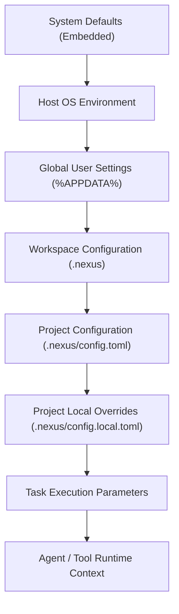

### 2. Configuration Resolution Flow


### 3. Secret Storage & Indirection Architecture

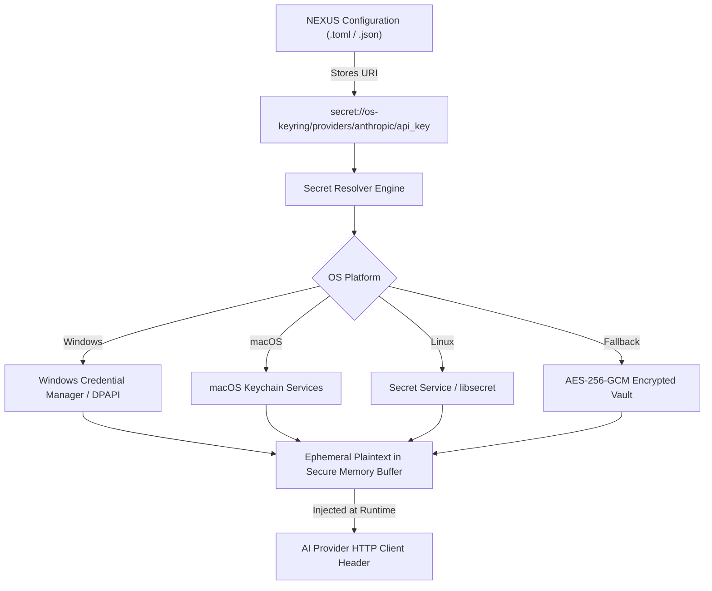

### 4. Secret Access & Memory Zeroization Flow

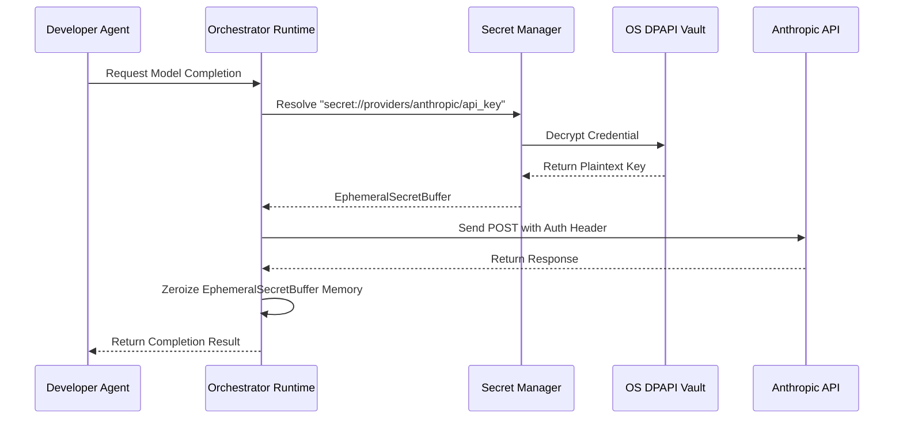

### 5. Environment Isolation & Profiles

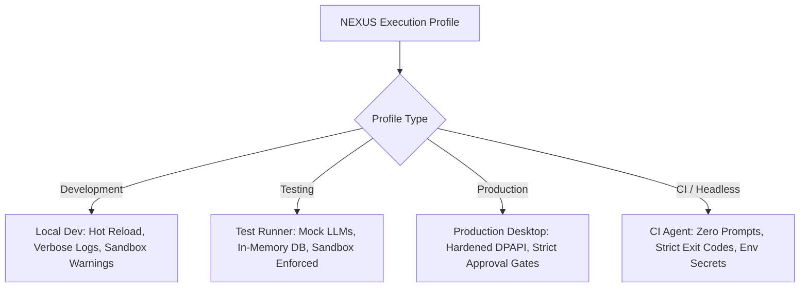

### 6. Child Process Environment Sanitization

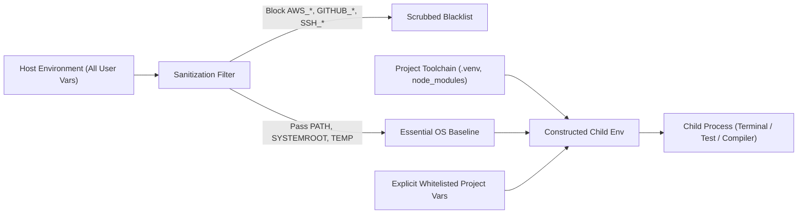

### 7. Project Configuration Lifecycle

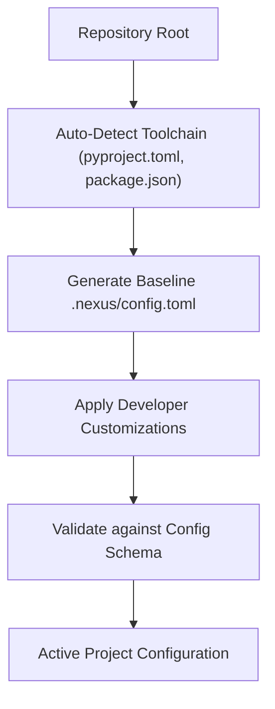

### 8. Plugin Configuration Sandboxing

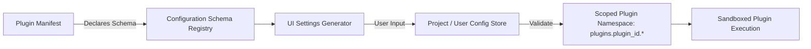

### 9. Configuration Snapshot & Auditing

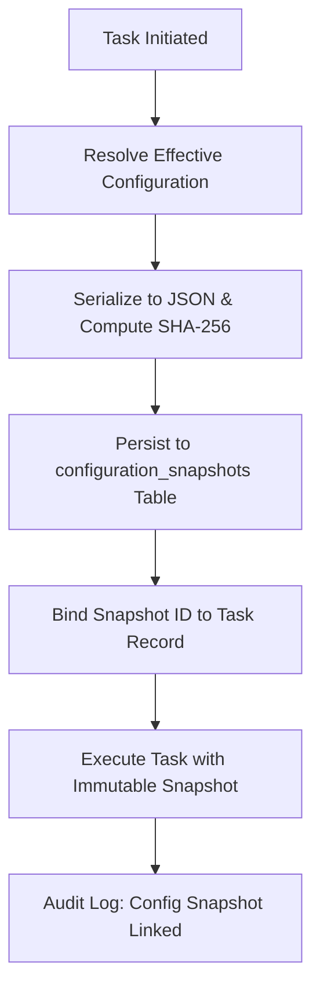

### 10. Backup & Restore Architecture

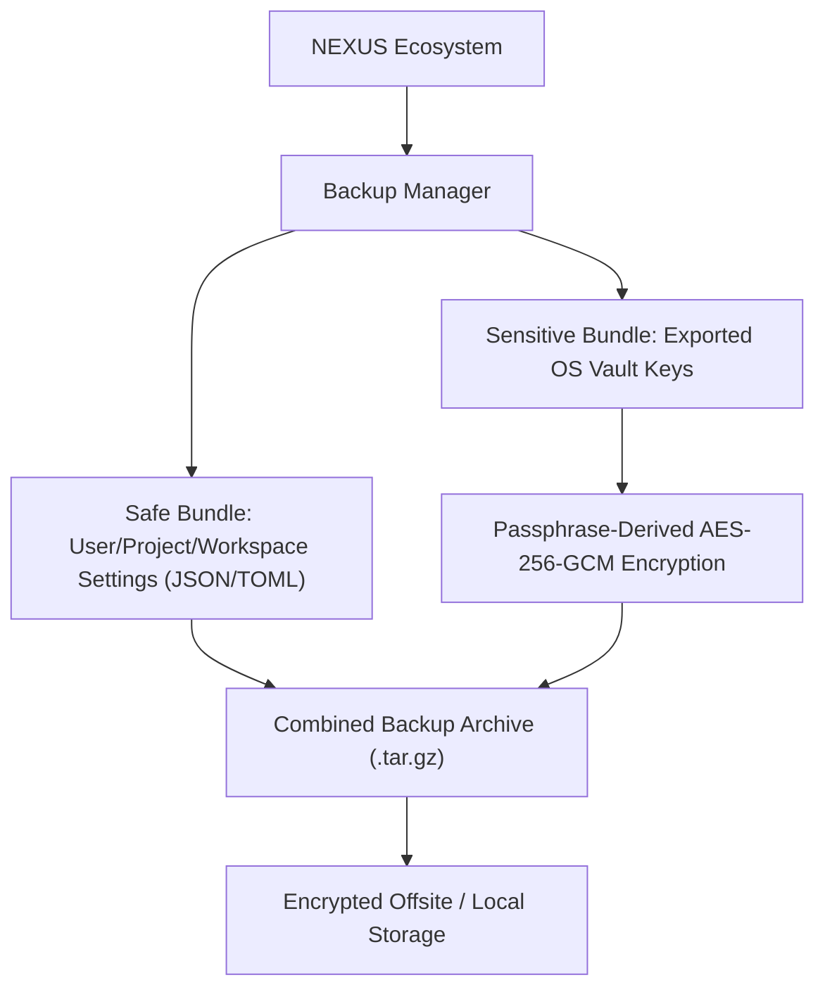

### 11. Mobile Companion Boundary

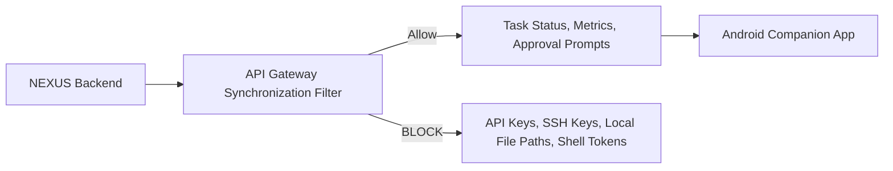

### 12. Complete Unified Configuration Architecture

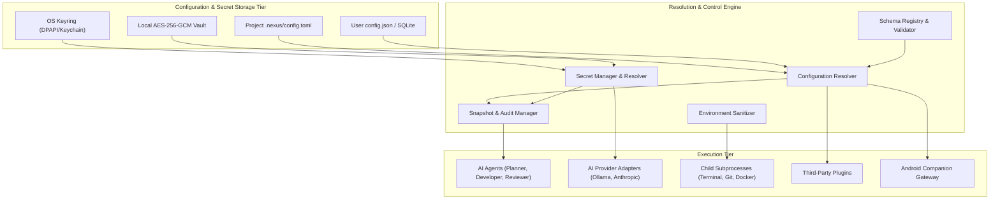

---

## 52. Trade-Off Analysis

| Architectural Decision | Options Evaluated | Selected Architecture | Justification & Trade-Off |
| :--- | :--- | :--- | :--- |
| **Config Storage Format** | `.env` vs JSON vs YAML vs TOML | **TOML for repos, JSON for user/workspace DB** | TOML provides superior human ergonomics and typed syntax for checked-in project files; JSON is ideal for database storage and machine schema parsing. |
| **Secret Storage Engine** | Plaintext files vs Custom Vault vs OS Keyring | **OS Native Keyring (DPAPI/Keychain) + Encrypted Vault fallback** | Maximizes hardware and OS security bounds without requiring users to run complex external vault daemons (e.g., HashiCorp Vault). |
| **Secret Resolution Timing**| Eager (Startup) vs Lazy (Execution Point) | **Lazy Ephemeral In-Memory Resolution** | Minimizes window of plaintext exposure in RAM; ensures revoked/rotated keys take effect immediately. |
| **Child Env Inheritance** | Full Pass-Through vs Filtered Whitelist | **Strict Filtered Whitelist** | Prevents catastrophic secret leakage where child build scripts or npm packages steal developer host credentials. |
| **Dynamic Config Changes**| In-flight Task Mutation vs Frozen Snapshots | **Immutable Task Snapshots** | Guarantees task determinism and reproducibility; prevents race conditions during long-running agent workflows. |

---

## 53. Implementation Roadmap

```
Phase 1: Core Contracts & Schema Registry
  ├── Define Pydantic / TypeScript configuration models
  └── Implement ConfigurationSchemaRegistry with validation rules

Phase 2: OS Keyring & Secret Storage Engine
  ├── Implement Windows DPAPI / Keyring secret storage adapter
  ├── Implement AES-256-GCM encrypted fallback vault
  └── Create `secret://` URI parser and lazy resolver

Phase 3: Hierarchical Configuration Resolver
  ├── Build multi-tier precedence merge engine
  ├── Implement filesystem watchers for hot-reloadable keys
  └── Implement Immutability and Scope Lock enforcement

Phase 4: Child Process Environment Sanitizer
  ├── Construct denylist and whitelist environment filters
  └── Integrate sanitized process spawning across Tool Execution Engine

Phase 5: Task Snapshotting & Audit System
  ├── Create SQLite `configuration_snapshots` table
  └── Implement automated task snapshot freezing and audit logging

Phase 6: Mobile Boundary & Backup Integration
  ├── Implement mobile API gateway secret filtering
  └── Build encrypted export/import backup CLI commands
```

---

## 54. Acceptance Criteria

- [x] Full 7-tier configuration hierarchy defined with explicit ownership and storage mappings.
- [x] Deterministic 8-level source precedence model with immutability rules established.
- [x] Complete separation of configuration metadata from secret cryptographic material.
- [x] OS-native secret storage (Windows DPAPI / Credential Manager) specified as primary vault.
- [x] `secret://` URI indirection scheme specified with lazy memory resolution and zeroization.
- [x] Deny-by-default child process environment sanitization protecting developer credentials.
- [x] `.env` files strictly excluded from Git commits, RAG vector indexing, and FTS stores.
- [x] Comprehensive data model with `configuration_snapshots` and `secret_references` defined.
- [x] Multi-layer secret redaction specified across logging, streaming, and LLM context layers.
- [x] 12 comprehensive Mermaid architecture diagrams illustrating all structural workflows.
- [x] Dedicated security threat model covering all 5 primary configuration vulnerability vectors.

---

## 55. Testing Strategy

1. **Unit Testing**:
   - Validation of all schema types, constraints, ranges, and deprecation warnings.
   - Precedence resolution tests verifying that higher-tier sources strictly override lower tiers.
   - Regex secret redaction unit tests across high-entropy token patterns.
2. **Integration Testing**:
   - Windows DPAPI credential store round-trip encryption, retrieval, and deletion tests.
   - Child process execution tests verifying blacklisted environment variables (`AWS_SECRET_ACCESS_KEY`) are scrubbed.
   - TOML config parser tests verifying `.nexus/config.toml` loads and updates cleanly.
3. **Security & Penetration Testing**:
   - Prompt injection simulation attempting to trick developer agents into printing `secret://` contents.
   - Subprocess sandbox escape verification ensuring child tasks cannot access parent memory buffers.
   - Tamper tests verifying locked immutable settings cannot be overridden by project-level configs.
4. **Recovery & Migration Testing**:
   - End-to-end backup export, machine wipe simulation, and encrypted configuration import verification.

---

## 56. Open Decisions & TBDs

1. **TBD-01: Linux Secret Service Fallback**: Confirm whether headless Linux server deployments without D-Bus should mandate the AES-256-GCM passphrase vault or utilize Kernel Keyutils.
2. **TBD-02: Hardware Security Key (FIDO2/YubiKey) Integration**: Evaluate optional integration for developer master secret vault decryption via hardware touch prompts.
3. **TBD-03: Team Shared Secret Sync**: Determine whether future enterprise multi-developer workspaces will support zero-knowledge E2EE secret sharing via asymmetric team public keys.

---

## 57. Final Architecture Summary

The NEXUS Configuration, Secrets & Environment Management Architecture establishes an enterprise-grade, local-first operational foundation. By combining:
- **Hierarchical schema-driven configuration resolution**
- **Hardware/OS-backed cryptographic secret management**
- **Opaque URI indirection (`secret://`) with execution-time memory zeroization**
- **Strict child-process environment sanitization**
- **Immutable point-in-time task snapshotting**

NEXUS guarantees that developer workstations remain completely secure, autonomous, and predictable during intensive multi-agent software engineering workflows.

---

## 58. Next Recommended Architecture Document

To continue the systematic architectural definition of the NEXUS platform, the single next logical architecture document is:

**`NEXUS_DESKTOP_CLIENT_AND_LOCAL_GATEWAY_ARCHITECTURE.md`**  
*(Focusing on the Windows desktop shell lifecycle, Tauri/Electron process bridge, local HTTP/WebSocket gateway hosting, background daemon management, and native system integration).*
