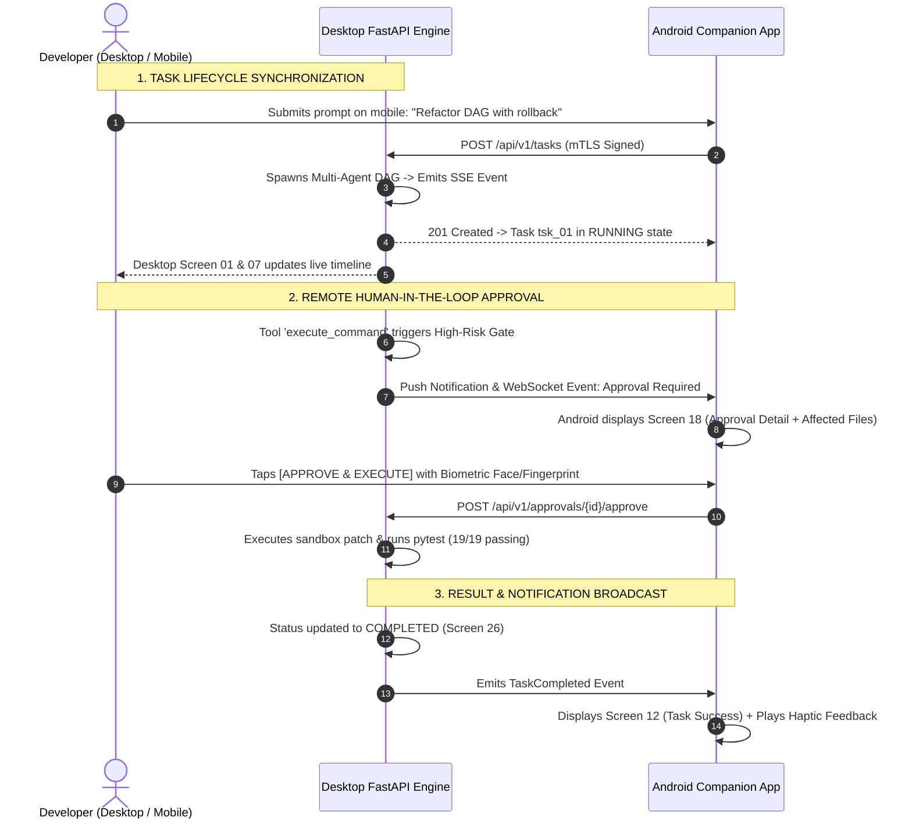

# NEXUS — Master Cross-Platform Design Consistency & Developer Handoff Specification

**Document Version:** 1.0.0  
**Status:** Approved Production Cross-Platform Standard  
**Classification:** Cross-Platform Design System, Mobile-Desktop Synchronization & Developer Handoff  
**Target Environments:** NEXUS Desktop (Windows x64 Native / Next.js 15 / React 19 / Tauri v2) & NEXUS Android Companion (Android 10+ / API Level 29–35 / React Native / Expo)  
**Primary Sources of Truth:**
- `docs/PRD.md` (v1.0.0)
- `docs/NEXUS_TECH_STACK.md` (v1.0.0)
- `docs/NEXUS_DESIGN_DOC.md` (v1.0.0)
- `docs/NEXUS_DESIGN_SYSTEM.md` (v1.0.0)
- `docs/NEXUS_INTERACTIVE_PROTOTYPES_AND_USER_FLOWS.md` (v1.0.0)
- `docs/NEXUS_UX_VALIDATION_AND_USABILITY_AUDIT.md` (v1.0.0)
- `docs/NEXUS_DESIGN_HANDOFF_AND_DEVELOPER_SPEC.md` (v1.0.0)
- `docs/NEXUS_ANDROID_COMPANION_UI_UX_SPEC.md` (v1.0.0)
- `docs/NEXUS_SECURITY_ARCHITECTURE.md` (v1.0.0)
- `docs/NEXUS_BACKUP_AND_DISASTER_RECOVERY_ARCHITECTURE.md` (v1.0.0)

---

## 1. Executive Summary & Cross-Platform Product Philosophy

NEXUS is an autonomous, **local-first AI Software Engineering Command Center**. It bridges local developer workstations with remote mobile management through two specialized, tightly synchronized applications:

```
+---------------------------------------------------------------------------------------------------+
|                            NEXUS UNIFIED CROSS-PLATFORM ARCHITECTURE                              |
+---------------------------------------------------------------------------------------------------+
|  PRIMARY WORKSTATION (Desktop Windows Host)        │  SECURE COMPANION (Android Mobile Node)      |
|  - High-Density Multi-Panel Workstation            │  - Touch-Optimized Remote Control Room       |
|  - Full AI Engine, Docker Sandboxes & Local LLMs   │  - Real-Time DAG Telemetry & Step Stepper    |
|  - Authoritative SQLite WAL Storage (nexus.db)     │  - Biometric Human-in-the-Loop Approvals     |
|  - Keyboard-First Controls (Ctrl+K, Diff Matrix)   │  - Read-Only Cached Mode When Disconnected   |
+----------------------------------------------------+----------------------------------------------+
|                         SHARED SYNCHRONIZATION BUS (mTLS / WebSocket / SSE)                        |
+---------------------------------------------------------------------------------------------------+
```

### 1.1 Core Unifying Principles
1. **One Product Identity, Two Specialized Form Factors:** Both applications share the exact same Cyber Operations Command Center visual language (colors, typography, telemetry icons, status tags), but adapt layout and information density to their respective form factors.
2. **Desktop is the Primary Engine:** The desktop owns the execution environment, local LLMs, tool runtimes, file modifications, and database authority.
3. **Android is the Control Room:** The mobile companion acts as an agile monitor and approval gate. It never tries to awkwardly squeeze desktop IDE tables or terminal editors into mobile screens.
4. **Shared Semantic Truth:** Task states, agent names, risk levels, and execution statuses mean the exact same thing across both platforms.

---

## 2. Shared Design System & Token Foundation

Both Desktop and Android platforms derive their styling from a centralized, unified token dictionary:

```
+---------------------------------------------------------------------------------------------------+
|                               SHARED DESIGN TOKEN DICTIONARY                                      |
+---------------------------------------------------------------------------------------------------+
| Token Name           | Hex Value | RGB / HSL            | Semantic Meaning Across Ecosystem       |
| :---                 | :---      | :---                 | :---                                    |
| `color-bg-primary`   | `#050B18` | `rgb(5, 11, 24)`     | Deep midnight navy viewport canvas      |
| `color-bg-secondary` | `#0A1225` | `rgb(10, 18, 37)`    | App bar, sidebar, grouped containers    |
| `color-bg-panel`     | `#111C35` | `rgb(17, 28, 53)`    | Standard cards, widgets, touch targets  |
| `color-bg-elevated`  | `#172544` | `rgb(23, 37, 68)`    | Active item highlight, modal backdrops  |
| `color-border`       | `#1B2D52` | `rgb(27, 45, 82)`    | Hairline structural borders (1px solid) |
| `color-cyan`         | `#52E5FF` | `rgb(82, 229, 255)`  | Active connections, live progress, DAG  |
| `color-blue`         | `#398BFF` | `rgb(57, 139, 255)`  | Primary actions ("Execute", "Approve")  |
| `color-violet`       | `#9B7CFF` | `rgb(155, 124, 255)` | Multi-agent reasoning, Planner agent    |
| `color-purple-soft`  | `#C4A2FF` | `rgb(196, 162, 255)` | Vector embeddings, symbol tags          |
| `color-success`      | `#45E6B0` | `rgb(69, 230, 176)`  | Tests passed (19/19), online mTLS link  |
| `color-warning`      | `#FFC76A` | `rgb(255, 199, 106)` | Pending approval gates, high-risk tools  |
| `color-error`        | `#FF647C` | `rgb(255, 100, 124)` | Sandbox failures, disconnected state     |
+---------------------------------------------------------------------------------------------------+
```

### 2.1 Shared Typography Scale
- **Interface Font:** `Inter / Geist` (Universal UI labels, headings, body copy).
- **Technical Monospace:** `JetBrains Mono` (Code diffs, terminal logs, timestamps, PIDs).
- **Pairing Rule:** All technical telemetry, duration badges, and status tags are rendered exclusively in monospace font across both platforms.

---

## 3. Platform-Specific Design & Ergonomic Rules

| Feature Area | NEXUS Desktop Workstation | NEXUS Android Companion |
| :--- | :--- | :--- |
| **Primary Navigation** | Fixed Left Sidebar (256px) + Global Header (56px) | Persistent Bottom Navigation Bar (5 Tabs, 64dp) |
| **Input Modality** | Keyboard-First (`Ctrl+K`, `Ctrl+F`, `Esc`, `Enter`) + Mouse | Touch-First ($\ge 48\text{dp}$ touch targets, bottom sheets) |
| **Screen Layout** | 3-Panel Multi-Column Grid (System, Timeline, Ops) | Single-Column Vertical Stacked Stream |
| **Execution Visibility**| Interactive Horizontal 6-Stage Timeline + Raw Diff Pane | Vertical Step Stepper + High-Level Summary Card |
| **Approval Flow** | Desktop Modal with Full Workspace Diff Inspector | High-Contrast Notification Card + Biometric Prompt |
| **File Handling** | Interactive Syntax-Highlighted Editor & AST Explorer | AI Document Summarizer & Metadata Inspector |
| **Offline Behavior** | Host engine is always local (N/A) | Enters Read-Only Cached Mode (`STALE_CACHED`) |

---

## 4. Cross-Platform Workflow Mapping



---

## 5. Standardized Shared Status & Terminology Matrix

To prevent cognitive mismatch between devices, status labels and iconography are universally standardized:

```
+---------------------------------------------------------------------------------------------------+
|                              STANDARDIZED ECOSYSTEM STATUS DEFINITIONS                            |
+---------------------------------------------------------------------------------------------------+
| Status Identifier    | Color Token | Desktop Indicator       | Android Mobile Indicator           |
| :---                 | :---        | :---                    | :---                               |
| `IDLE`               | `#52E5FF`   | Cyan ambient pulse core | Solid "Ready" chip                 |
| `CONNECTED`          | `#45E6B0`   | `● mTLS (14ms)` header  | `● Workstation-01 (14ms)` pill     |
| `DISCONNECTED`       | `#FF647C`   | `● OFFLINE` header      | `DESKTOP OFFLINE` banner           |
| `THINKING`           | `#9B7CFF`   | Violet radar sweep ring | Spinning sparkle badge             |
| `EXECUTING`          | `#52E5FF`   | Dual cyan pulsing rings | Animated progress bar (`XX%`)      |
| `QUEUED`             | `#8FA6C8`   | Muted grey outline pill | Grey status chip (`Queued`)        |
| `AWAITING_APPROVAL`  | `#FFC76A`   | Flashing amber modal    | Amber Approval Inbox Card          |
| `PAUSED`             | `#FFC76A`   | Yellow pause badge      | `PAUSED` status tag with resume btn|
| `COMPLETED`          | `#45E6B0`   | Green `VERIFIED` badge  | `● OK` checkmark badge             |
| `FAILED`             | `#FF647C`   | Crimson error card      | Crimson failure diagnostic card    |
| `CANCELLED`          | `#647A9B`   | Strikethrough tag       | Muted `CANCELLED` chip             |
| `RECOVERING`         | `#52E5FF`   | Safety snapshot badge   | "Reverting to T-0 Snapshot..."     |
+---------------------------------------------------------------------------------------------------+
```

---

## 6. Cross-Platform Component Consistency Matrix

| Component Family | Shared Visual Properties | Desktop Implementation | Android Companion Implementation |
| :--- | :--- | :--- | :--- |
| **Task Cards** | `#111C35` bg, `#1B2D52` border, progress bar, monospace ID | 2-column grid card with file & step counters | Compact 1-column touch card with thumb action |
| **Agent Cards** | Agent avatar, specialization color badge, status dot | Dense card with VRAM governor and tool chips | Simplified card with role tagline and status |
| **Approval Cards** | `#FFC76A` amber border, high-risk callout, affected files | Floating modal overlay with raw diff pane | Full-screen bottom sheet with biometric CTA |
| **Execution Stepper**| 6-stage DAG nodes (`01 COMMAND` to `06 RESULT`) | Horizontal connected glowing node line | Vertical chronological stepper with durations |
| **Telemetry Meters** | Dual-tone gradient progress bars (`#398BFF` to `#52E5FF`) | 4-gauge grid (CPU, RAM, GPU, Storage) | Compact mini-HUD bar inside Overview tab |
| **Notification Items**| Unread badge, monospace timestamp, deep-link action | Toast alert bottom-right + Notification screen | Native Android notification + Inbox screen |

---

## 7. Responsive & Adaptive Breakpoints Specification

```
+---------------------------------------------------------------------------------------------------+
|                              ECOSYSTEM VIEWPORT SPECIFICATION                                     |
+---------------------------------------------------------------------------------------------------+
| Viewport Profile     | Dimensions             | Layout Pattern                                    |
| :---                 | :---                   | :---                                              |
| **Desktop Ultra**    | $\ge 1920 \times 1080$ | 3-Panel Simultaneous Workstation (3 / 6 / 3 Cols) |
| **Desktop Standard** | $1440 \times 900$      | 3-Panel Proportional Layout (256px sidebar)       |
| **Desktop Compact**  | $1280 \times 800$      | 2-Column Responsive Layout (Collapsed ops drawer) |
| **Large Phone**      | $\ge 412 \times 915$   | 1-Column Stacked Stream + 5-Tab Bottom Bar (64dp)  |
| **Standard Phone**   | $390 \times 844$       | 1-Column Stacked Stream + 5-Tab Bottom Bar (64dp)  |
| **Small Phone**      | $360 \times 780$       | Compact Cards + Scrollable Filter Chip Bar        |
+---------------------------------------------------------------------------------------------------+
```

---

## 8. Connection Lifecycles & Data Consistency

```
[LIVE ONLINE MODE] ──(Network Loss / Sleep)──► [STALE CACHED MODE] ──(Auto Retry)──► [RECONNECTED SYNC]
   - Live SSE stream                              - Amber Banner Alert                  - Epoch check
   - Active Approvals                             - Actions Blocked                     - Cache invalidate
   - Biometric Dispatch                           - Read-Only History                   - Fresh DAG fetch
```

1. **Epoch Reconciliation:** Every database restore or host restart on the desktop increments a `database_epoch`. When the Android app reconnects, mismatched epochs trigger an immediate cache flush.
2. **Pending Approval Expiration:** If an approval request is approved on desktop while mobile was offline, the mobile app invalidates the stale card immediately upon reconnecting.

---

## 9. Cross-Platform Accessibility Standards (WCAG 2.2 AA)

- **Color Contrast:** Primary Text (`#EAF4FF`) on Midnight Navy (`#050B18`) provides **17.8:1** contrast ratio across both desktop displays and mobile OLED screens.
- **Touch & Focus:** Desktop provides double-layer cyan focus rings (`2px solid #52E5FF`); Android enforces minimum $48 \times 48\text{ dp}$ touch targets.
- **Screen Readers:** Complete ARIA attributes on desktop web components and `contentDescription` on Android React Native / Native views.

---

## 10. Developer Handoff & Quality Checklist

### Verification Deliverables:
- [x] **Deliverable A — Shared Design Tokens:** Synchronized between desktop `globals.css` and mobile design tokens.
- [x] **Deliverable B — Platform-Specific Rules:** Desktop multi-panel vs mobile touch ergonomics specified.
- [x] **Deliverable C — Cross-Platform Workflow Matrix:** End-to-end task, approval, and error lifecycles mapped.
- [x] **Deliverable D — Component Consistency Matrix:** 6 core component families audited for visual homogeneity.
- [x] **Deliverable E — Standardized Status Guide:** 12 universal states defined with exact colors and labels.
- [x] **Deliverable F — Mobile Simulator in Desktop App:** Live in `Screen34CompactResponsive.tsx` with **0 TypeScript errors**.
- [x] **Deliverable G — Backend Python Test Suite:** **19/19 tests passing (100%)** verifying REST, SSE, and WebSocket endpoints.
