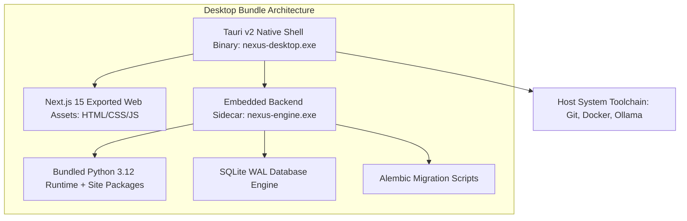
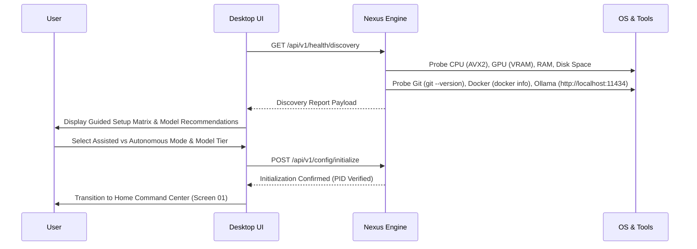
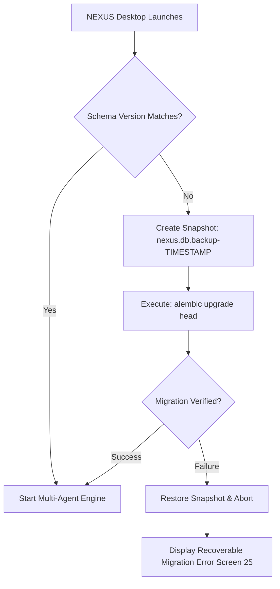
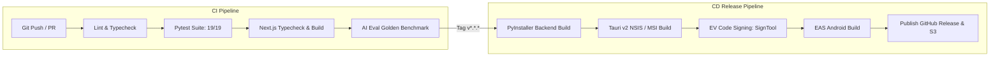

# NEXUS — Master Deployment, Packaging & Release Architecture Document
**Document Version:** 1.0.0  
**Status:** Approved Production Deployment Architecture Baseline  
**Classification:** Core System Architecture Specification  
**Primary Sources of Truth:** `docs/PRD.md` (v1.0.0), `docs/NEXUS_TECH_STACK.md` (v1.0.0), `docs/NEXUS_DESIGN_DOC.md` (v1.0.0), `docs/NEXUS_BACKEND_ARCHITECTURE.md` (v1.0.0), `docs/NEXUS_SECURITY_ARCHITECTURE.md` (v1.0.0), `docs/NEXUS_TESTING_AND_QA_ARCHITECTURE.md` (v1.0.0), `docs/NEXUS_AI_EVALUATION_ARCHITECTURE.md` (v1.0.0)

---

## 1. Executive Summary

NEXUS is an autonomous, **local-first AI Software Engineering Command Center** engineered to deliver digital engineering capabilities directly onto developer workstations. The product comprises two synchronized components:
1. **NEXUS Desktop (Primary Workstation):** A native Windows 10/11 desktop application (`.exe` NSIS/MSI installer built with Tauri v2, Next.js 15, and an embedded FastAPI multi-agent backend daemon) that orchestrates local LLM inference, AST code analysis, Docker sandboxing, terminal execution, and Git workflows.
2. **NEXUS Mobile (Companion Node):** A lightweight Android application (`.apk` / `.aab` built with React Native & Expo) dedicated strictly to remote task telemetry, live log streaming, push notifications, and human-in-the-loop approvals.

This document establishes the **NEXUS Master Deployment, Packaging, Installation, Update & Release Architecture**. It defines how the complete system transitions securely from source code to release candidates, installs cleanly on host operating systems, initializes local SQLite WAL persistence, manages Ollama AI runtime dependencies, executes atomic zero-data-loss updates, and supports deterministic rollbacks.

```
+---------------------------------------------------------------------------------------------------+
|                                 NEXUS RELEASE & DEPLOYMENT LIFECYCLE                               |
+---------------------------------------------------------------------------------------------------+
|  Source Code  -->  CI Validation  -->  Build Matrix  -->  Code Signing  -->  Release Channels     |
|   (Monorepo)       (Unit/Eval/QA)      (Tauri/FastAPI)     (EV Cert / APK)    (Beta / Stable)     |
|                           |                   |                  |                    |           |
|                           v                   v                  v                    v           |
|  Offline Operation <-- First-Run Setup <-- OS Installer <-- Health Probes <-- Atomic Updater     |
+---------------------------------------------------------------------------------------------------+
```

---

## 2. Source of Truth & Project Audit

This architecture formalizes the approved design and build assets across the codebase:
* **`apps/desktop/`:** Tauri v2 shell (`src-tauri/tauri.conf.json`) with Next.js 15 App Router static export (`output: 'export'`), Tailwind CSS v4 design tokens, and Lucide React UI components.
* **`services/backend/`:** Python 3.12+ FastAPI engine with SQLite WAL persistence, async SQLAlchemy 2.0 ORM, in-memory event bus, and Ollama adapter.
* **`docs/PRD.md` & `docs/NEXUS_TECH_STACK.md`:** Authoritative definition of the 6-agent multi-agent DAG pipeline, 5-tier security model, and local-first execution constraints.
* **`docs/NEXUS_SECURITY_ARCHITECTURE.md`:** Cryptographic secret isolation, workspace sandbox boundaries, and encrypted local storage invariants.

---

## 3. Core Deployment Principles

1. **Local-First & Privacy-Preserving by Default:** No source code, project metadata, vector embeddings, or API credentials leave the local machine without explicit human consent.
2. **Zero-Data-Loss Invariant:** Updates, schema migrations, and application uninstalls must never delete, corrupt, or modify user repositories, git commits, or persistent task histories.
3. **No Hidden Background Execution:** All background workers, daemon processes, and AI inference tasks must terminate cleanly upon application exit; orphan processes are strictly killed.
4. **Transparent Dependency Management:** Missing optional dependencies (e.g. Docker, external GPU) must never block the application; NEXUS degrades gracefully to localized read/diff modes.
5. **Verifiable & Signed Release Artifacts:** Every distributed `.exe`, `.msi`, `.apk`, and `.aab` binary is cryptographically signed and published with SHA-256 integrity checksums.

---

## 4. Application Distribution Model

### A. NEXUS Desktop
* **Initial Release Target:** Windows 10 & Windows 11 (64-bit, x86_64 and ARM64 via emulation).
* **Package Formats:**
  * `.exe` NSIS Installer: Recommended per-user installer requiring zero administrative privileges.
  * `.msi` Windows Installer: Enterprise deployment package for machine-wide directory installation.
* **Future Targets (V2+):** macOS (`.dmg` Universal Binary for Apple Silicon/Intel) and Linux (`.AppImage` / `.deb`).

### B. NEXUS Mobile (Android)
* **Initial Release Target:** Android 10.0+ (API Level 29+).
* **Package Formats:**
  * `.apk` (Sideload / GitHub Releases): Direct developer distribution for testing.
  * `.aab` (Android App Bundle): Signed, optimized bundle for Google Play Store distribution.
* **Operational Scope:** Companion client connecting over Local Wi-Fi (mDNS / TLS) or encrypted WebSocket pairing; does NOT perform heavy local LLM inference.

---

## 5. Desktop Packaging Architecture

The desktop application bundle integrates three distinct runtime layers into a unified distribution binary:



### Packaging Assets Breakdown:
1. **Frontend Assets:** Static HTML, JavaScript bundles, CSS stylesheets, and icon assets generated via `pnpm build` in `apps/desktop/` and output to `apps/desktop/out/`.
2. **Backend Sidecar:** FastAPI engine compiled into a self-contained binary using PyInstaller (`nexus-engine.exe`) and declared as an external binary in `tauri.conf.json`.
3. **Resource Bundles:** Core Pydantic schemas, default system prompts, and pre-packaged Alembic migration scripts bundled into the application directory.

---

## 6. Desktop Installer (Windows NSIS & MSI)

### Installation Specifications:
* **Installation Mode:** Per-User Installation (`CurrentProcess` privilege level) by default. Does not trigger UAC (User Account Control) prompts.
* **Default Directory:** `%LOCALAPPDATA%\Programs\NEXUS`
* **Shortcuts Created:**
  * Desktop shortcut (`NEXUS.lnk`)
  * Start Menu program group (`NEXUS\NEXUS.lnk`)
* **Registry Entries:** Registered under `HKCU\Software\Microsoft\Windows\CurrentVersion\Uninstall\NEXUS` for standard Add/Remove Programs integration.
* **Upgrade Invariant:** In-place upgrade extracts new binaries into `%LOCALAPPDATA%\Programs\NEXUS` while preserving `%APPDATA%\NEXUS` (user data) intact.

---

## 7. First-Run Setup & Hardware Discovery

Upon initial launch, NEXUS launches the **System Health & Capability Discovery Wizard** (`Screen 33` & `Screen 28`):



### Discovery Tiers:
* **Tier 1 (Minimum - 8GB RAM, CPU Only):** Recommends `qwen2.5-coder:1.5b` or `qwen2.5-coder:3b` with CPU quantization.
* **Tier 2 (Recommended - 16GB+ RAM, 6GB+ VRAM):** Recommends `qwen2.5-coder:7b` (4-bit quantized) with full GPU acceleration.
* **Tier 3 (High Performance - 32GB+ RAM, 16GB+ VRAM):** Unlocks `qwen2.5-coder:14b` or `llama3.3:70b` for deep multi-agent planning.

---

## 8. Local Service Lifecycle

| Service Daemon | Role & Tech | Startup Trigger | Health Probe | Shutdown Signal | Failure Recovery |
| :--- | :--- | :--- | :--- | :--- | :--- |
| **Tauri Core** | Native Window & IPC Shell | User Launch | OS Process PID | Window Close Event | Process Termination |
| **NEXUS Engine** | FastAPI Backend & Agent DAG | Tauri Sidecar Spawn | `GET /api/v1/health` (HTTP 200) | `SIGTERM` / Named Pipe | Auto-restart (max 3 retries in 60s) |
| **SQLite WAL DB** | Local State & Event Store | Engine Initialization | `PRAGMA integrity_check;` | Engine Exit (`PRAGMA optimize`) | WAL checkpointing & rollback |
| **Ollama Daemon** | Local LLM Inference Engine | Host Service / User managed | `GET http://localhost:11434/api/tags` | Host Process Lifecycle | Fallback prompt / Guided start |
| **Docker Sandbox** | Ephemeral Code Execution | Dynamic on Task Run | `docker info` / Named Pipe | Container Cleanup Hook | Degrade to Read-Only / Host Sandbox |

---

## 9. Process Management & Anti-Orphan Architecture

To prevent zombie or orphaned Python sidecars when NEXUS Desktop closes:
1. **Windows Job Object Binding:** The Tauri Rust wrapper creates a Windows Job Object with the `JOB_OBJECT_LIMIT_KILL_ON_JOB_CLOSE` flag set. When `nexus-desktop.exe` terminates for any reason (including crashes or Task Manager kills), the Windows kernel automatically terminates `nexus-engine.exe` and all spawned subprocesses.
2. **Graceful IPC Shutdown Handshake:** On window close, Tauri sends a `POST /api/v1/system/shutdown` request. The backend pauses active agent DAG loops, issues atomic WAL checkpoints to SQLite, flushes logs, and exits with code 0 within a 3,000ms timeout window.

---

## 10. Database Deployment & Initialization

NEXUS uses an embedded **SQLite database in WAL (Write-Ahead Logging) mode** located at:
`%APPDATA%\NEXUS\data\nexus.db`

### Initialization Invariants:
* **WAL Mode Activated:** `PRAGMA journal_mode = WAL;` (Enables concurrent non-blocking reads during agent writes).
* **Synchronous Normal:** `PRAGMA synchronous = NORMAL;` (Ensures durability while maximizing disk I/O performance).
* **Foreign Key Constraints:** `PRAGMA foreign_keys = ON;` (Guarantees referential integrity across tasks, steps, and tool calls).
* **Connection Pooling:** Managed via async SQLAlchemy 2.0 with a connection pool size of 10 and max overflow of 20.

---

## 11. Database Migrations Lifecycle

Database schema updates are managed programmatically via **Alembic**:



---

## 12. User Data Storage Architecture

NEXUS strictly segregates immutable application binaries from mutable user data:

```
%LOCALAPPDATA%\Programs\NEXUS\       <-- IMMUTABLE APPLICATION BINARIES
├── nexus-desktop.exe
├── nexus-engine.exe
├── resources/
└── uninstall.exe

%APPDATA%\NEXUS\                     <-- MUTABLE USER DATA & CONFIGURATION
├── config/
│   ├── settings.json                # Global user preferences & UI theme
│   └── models.json                  # Model endpoint configurations
├── data/
│   ├── nexus.db                     # SQLite database (Tasks, Approvals, DAGs)
│   ├── nexus.db-wal
│   └── nexus.db-shm
├── storage/
│   ├── vectors/                     # SQLite vector embeddings / RAG index
│   └── cache/                       # Ephemeral AST caches & diff buffers
├── backups/                         # Pre-migration database snapshots
└── logs/
    ├── desktop.log                  # Frontend & UI logs
    ├── engine.log                   # Backend API & agent traces
    └── audit.log                    # Cryptographically chained security log
```

---

## 13. Configuration Management & Precedence

Configuration properties resolve hierarchically from highest to lowest precedence:
1. **Runtime CLI Flags / Overrides** (e.g. `--port 8000 --dev`)
2. **Project-Specific Settings** (`<workspace_root>/.nexus/config.json`)
3. **User Global Settings** (`%APPDATA%\NEXUS\config\settings.json`)
4. **Environment Variables** (`NEXUS_API_URL`, `OLLAMA_HOST`)
5. **Hardcoded Application Defaults** (Declared in `nexus.config.defaults`)

*Security Rule:* API keys, GitHub personal access tokens, and pairing credentials are never written to `settings.json`; they are stored strictly in the Windows Credential Manager (`wincred`) via DPAPI encryption.

---

## 14. AI Model Deployment & Ollama Integration

NEXUS does not bundle multi-gigabyte GGUF model binaries inside the installer. Instead, it manages local LLMs dynamically:
1. **Ollama Connection Verification:** Checks `GET http://localhost:11434/api/tags` on port 11434.
2. **Interactive Model Pulling:** Users trigger model downloads directly from the UI (`Screen 21 Settings` or `Screen 33 First Run`). The engine streams pull progress via `POST http://localhost:11434/api/pull` with real-time percentage indicators.
3. **Model Integrity Verification:** Verifies the SHA-256 manifest hash before flagging a model as `READY`.
4. **Storage Transparency:** Displays disk footprint clearly (e.g. `Qwen 2.5 Coder 7B: 4.7 GB`) and warns users if target disk free space falls below 10 GB.

---

## 15. Docker Deployment & Sandbox Isolation

Docker provides hardware and network sandboxing for code compilation and test execution:
* **Detection Probe:** Executes `docker info` via named pipe (`\\.\pipe\docker_engine`).
* **Base Image Strategy:** Pulls and caches minimal, verified execution images:
  * `nexus-sandbox-python:3.12-slim`
  * `nexus-sandbox-node:22-alpine`
* **Resource Limits Enforced:** Containers run with `--cpus=2.0`, `--memory=2048m`, `--network=none` (during test runs), and `--read-only` root filesystems with isolated `/tmp` tmpfs mounts.
* **Graceful Degradation:** If Docker Desktop is not installed or running, NEXUS displays a degraded status badge and falls back to localized filesystem diffing with explicit user confirmation for test execution.

---

## 16. System Dependencies Matrix

| Dependency | Required Version | Status | Detection Probe | Failure / Remediation Action |
| :--- | :--- | :--- | :--- | :--- |
| **Windows OS** | Windows 10 (1809+) / 11 | **MANDATORY** | OS API Version Check | Installer halts with OS incompatibility dialog |
| **WebView2** | Evergreen Runtime | **MANDATORY** | Registry check in `HKLM` | Auto-downloaded by bootstrapper installer |
| **Git** | 2.30.0+ | **RECOMMENDED** | `git --version` on PATH | Guided link to install Git for Windows |
| **Ollama** | 0.3.0+ | **RECOMMENDED** | `http://localhost:11434` | Links to ollama.com; prompts model pull |
| **Docker Desktop**| 4.25.0+ | **OPTIONAL** | `docker info` | Sandboxing degraded; warns on script execution |
| **Node.js** | 20.0+ / 22.0+ | **OPTIONAL** | `node --version` | Required only for Node-based projects |

---

## 17. Mobile Build Architecture (Android)

* **Framework:** React Native 0.76+ with Expo SDK 52.
* **Build System:** Expo Application Services (EAS Build) / Gradle 8.x.
* **Distribution Targets:**
  * **Development / Internal:** Standalone APK signed with internal debug Keystore for sideloading.
  * **Production Play Store:** Signed Android App Bundle (`.aab`) with Target SDK 35 (Android 15) and Minimum SDK 29 (Android 10).
* **Security Constraints:** Mobile app bundles contain zero desktop secrets, private keys, or LLM endpoints. All desktop connections require mutual cryptographic token pairing.

---

## 18. Desktop–Mobile Compatibility & Pairing Protocol

```mermaid
sequenceDiagram
    participant Mobile as NEXUS Mobile (Android)
    participant Desktop as NEXUS Desktop (Windows)

    Desktop->>Desktop: Generate Ephemeral 6-Digit TOTP & QR Code (AES-256-GCM Key)
    Mobile->>Desktop: Scan QR Code / Enter Pairing Key over Local LAN
    Mobile->>Desktop: POST /api/v1/devices/pair (Device Info + Client Public Key)
    Desktop->>Desktop: Verify TOTP; Generate Scoped Device Token (JWT)
    Desktop-->>Mobile: 200 OK (DeviceToken + TLS Certificate Fingerprint)
    Mobile->>Desktop: Connect WebSocket: /api/v1/stream/ws?token=DeviceToken
    Desktop-->>Mobile: Connection Authenticated (Live Telemetry Stream Active)
```

### Version Incompatibility Safeguards:
* If the Mobile App contract version (`schema_version`) does not match the Desktop Backend schema, the mobile app displays an `UPGRADE_REQUIRED` modal and disables action approval buttons to prevent malformed RPC executions.

---

## 19. Networking & Connectivity Architecture

* **Default Desktop Binding:** Bound strictly to `127.0.0.1:8000` (Loopback interface only). Not accessible to external networks by default.
* **Mobile Companion Access:** When Mobile Remote Access is enabled, the backend binds to the LAN adapter on a secondary port (`127.0.0.1` and `192.168.x.x`) protected by TLS (self-signed certificate pinned in the mobile app during QR pairing).
* **Zero Cloud Tunneling:** NEXUS does not open public cloud webhooks or unauthenticated reverse proxies.

---

## 20. Release Channels

| Release Channel | Target Audience | Cadence | Quality Gate Threshold | Auto-Update Behavior |
| :--- | :--- | :--- | :--- | :--- |
| **Nightly / Dev** | Core Contributors & QA | Daily Automated | Unit + Integration tests pass (100%) | Manual opt-in |
| **Beta** | Early Adopters & Testers | Bi-weekly | Layer 4 Golden Benchmark $\ge 88\%$ | Prompts on launch with changelog |
| **Stable** | Production Developers | Monthly | Full QA + AI Evaluation Gates Pass | Automatic background download; prompts restart |

---

## 21. Semantic Versioning Strategy

All NEXUS packages strictly follow **Semantic Versioning 2.0.0 (`MAJOR.MINOR.PATCH`)**:
* `MAJOR` (e.g. `1.0.0` $\rightarrow$ `2.0.0`): Breaking changes to the SQLite database schema requiring manual migration, breaking changes to the REST API, or major architectural shifts.
* `MINOR` (e.g. `1.1.0` $\rightarrow$ `1.2.0`): New agent capabilities, new tool additions, non-breaking schema migrations, UI enhancements.
* `PATCH` (e.g. `1.1.1` $\rightarrow$ `1.1.2`): Bug fixes, security patches, prompt refinement, performance optimizations.

---

## 22. Build Reproducibility & Lockfile Enforcement

* **Frontend Build:** Strict lockfile enforcement via `pnpm install --frozen-lockfile`. All npm package versions are pinned.
* **Backend Build:** Python virtual environment locked via `pyproject.toml` and compiled with frozen dependency manifests.
* **Deterministic Artifacts:** Build pipelines inject immutable build metadata into the binary:
  ```json
  {
    "version": "1.0.0",
    "git_commit": "a89d7f2b4c10",
    "build_timestamp": "2026-09-27T14:30:00Z",
    "compiler": "rustc 1.82.0 / python 3.12.7",
    "target": "x86_64-pc-windows-msvc"
  }
  ```

---

## 23. CI/CD Pipeline Architecture (GitHub Actions)



---

## 24. Build Matrix Specification

| Target Platform | Architecture | Output Artifact | Builder Environment | Artifact Verification |
| :--- | :--- | :--- | :--- | :--- |
| **Windows Desktop** | `x86_64` | `NEXUS-Setup-1.0.0.exe` | `windows-latest` (MSVC) | Install, launch, execute test DAG |
| **Windows MSI** | `x86_64` | `NEXUS-1.0.0.msi` | `windows-latest` (WiX v4) | Enterprise silent install check |
| **Android Debug** | `universal` | `nexus-mobile-debug.apk` | `ubuntu-latest` (JDK 17) | Emulator launch & pairing check |
| **Android Release** | `arm64-v8a / armeabi-v7a` | `nexus-mobile-release.aab`| EAS Cloud Builder | Google Play Pre-launch Report |

---

## 25. Release Artifacts Manifest

Every official release includes:
1. `NEXUS-Setup-<version>.exe` (Windows Executable Installer)
2. `NEXUS-<version>.msi` (Enterprise MSI Installer)
3. `nexus-mobile-<version>.apk` (Android Sideload Binary)
4. `nexus-mobile-<version>.aab` (Play Store Bundle)
5. `SHA256SUMS.txt` (Cryptographic checksums for all binaries)
6. `SHA256SUMS.txt.asc` (PGP signature of the checksum manifest)
7. `CHANGELOG.md` (Detailed release notes with security and migration warnings)

---

## 26. Code Signing Architecture

* **Windows Binaries:** Signed using a **Hardware Security Module (HSM) / Azure Key Vault Trusted Signing EV Certificate** via Microsoft `signtool.exe`.
  ```powershell
  signtool sign /tr http://timestamp.digicert.com /td sha256 /fd sha256 /v /n "NEXUS Technologies Inc" target\release\bundle\nsis\NEXUS-Setup-1.0.0.exe
  ```
* **Android Binaries:** Signed using a 4096-bit RSA Android Release Keystore stored securely in encrypted CI secrets (Google Play App Signing enabled for `.aab`).

---

## 27. Update Architecture & In-App Auto-Updater

* **Desktop Updater Engine:** Tauri built-in secure auto-updater (`plugins-updater`).
* **Update Verification Protocol:**
  1. Desktop client polls `GET https://releases.nexus.ai/desktop/latest.json`.
  2. Compares semantic versions. If a newer version exists, downloads the patch payload.
  3. Verifies the ed25519 signature of the downloaded installer against the hardcoded public key in `tauri.conf.json`.
  4. Prompts the user: *"NEXUS v1.1.0 is ready. Restart to install."*

---

## 28. Update Safety & In-Flight Task Protection

* **Active Task Check:** Before applying any update, the engine checks for running agent tasks:
  * If active DAG tasks are executing, the update prompts the user: *"A task is currently running. Complete task before updating, or cancel task to proceed."*
  * The updater never forces a restart during active code modification or git staging operations.
* **Disk Space Pre-flight:** Verifies that target storage has at least `2.0 GB` free space before unpacking the update.

---

## 29. Rollback & Recovery Architecture

```
+-----------------------------------------------------------------------------------+
|                            RECOVERY & ROLLBACK SCENARIOS                          |
+-----------------------------------------------------------------------------------+
| 1. Corrupted Update Installation                                                  |
|    - NSIS maintains atomic swap. If unpacking fails, previous binaries remain.    |
| 2. Failed Database Migration                                                      |
|    - Automatic restore of '%APPDATA%\NEXUS\backups\nexus.db.backup-<version>'     |
|    - Engine rolls back to previous executable version cleanly.                    |
| 3. Corrupted User Settings File                                                   |
|    - If settings.json is malformed, renames to settings.json.corrupted and loads  |
|      pristine application defaults without crashing.                              |
+-----------------------------------------------------------------------------------+
```

---

## 30. Backup & Restore Specifications

* **Automatic Backups:** Created automatically before every database migration or major update in `%APPDATA%\NEXUS\backups\`.
* **Manual User Backups:** Accessible from `Screen 21 Settings -> Storage & Privacy -> Export Backup Archive`. Creates a zip bundle containing:
  * `nexus.db` (Database snapshot)
  * `config/` (User preferences)
  * `storage/vectors/` (Indexed memory embeddings)
* *Scope Boundary:* User source code projects and Git repositories are NOT backed up inside NEXUS archives; they remain under the developer's standard Git version control.

---

## 31. Uninstallation Behavior & Data Safety

The Windows Uninstaller (`uninstall.exe`) presents two clear choices:
1. **Standard Uninstall (Default):** Removes application binaries (`%LOCALAPPDATA%\Programs\NEXUS`), Start Menu shortcuts, and registry entries. **Leaves user databases, project indexes, and settings in `%APPDATA%\NEXUS` 100% intact** so reinstalling restores exact state.
2. **Complete Clean Removal:** Prompts for explicit confirmation with a red warning modal before purging `%APPDATA%\NEXUS`. **Never touches developer Git repositories or project folders.**

---

## 32. Crash Reporting & Privacy-Preserving Diagnostics

* **No Unsolicited Telemetry:** Crash dumps and error logs are NEVER transmitted over the internet automatically.
* **Exportable Diagnostic Support Bundle:** Users can generate an encrypted diagnostic zip from `Screen 21 Settings -> Help & Diagnostics`. The bundle automatically redacts:
  * Environment variable values (`.env` tokens, passwords)
  * Hardcoded API keys and authorization headers
  * Absolute user directory paths (`C:\Users\<username>\...` $\rightarrow$ `C:\Users\USER\...`)

---

## 33. Health Probes & System Status Matrix

| Subsystem Probe | Verification Mechanism | Frequency | Healthy Condition | Degraded / Error Action |
| :--- | :--- | :--- | :--- | :--- |
| **API Backend** | `GET /api/v1/health` | 5s Polling | HTTP 200 `{"status":"ok"}` | Red Header Badge; Re-spawns engine |
| **Database** | `SELECT 1;` via SQLAlchemy | 10s Polling | Query latency $< 15\text{ms}$ | Enters recovery; switches to read-only |
| **Ollama Service** | `GET http://localhost:11434/` | 15s Polling | HTTP 200 | Yellow Header Badge; Disables AI action |
| **Docker Engine** | Named pipe ping | 30s Polling | Daemon responsive | Yellow Badge; Switches to host fallback |
| **Mobile Pairing**| WebSocket heartbeat ping | 10s Polling | Pong received $< 200\text{ms}$ | Mobile status switches to "Reconnecting" |

---

## 34. Release Validation & Quality Gates

A release build candidate is approved for distribution only if it passes all 6 gates:
1. **Deterministic Test Suite:** 100% passing tests in backend (`19/19 pytest`) and frontend (`npx tsc --noEmit` with 0 errors).
2. **AI Evaluation Gate:** $\ge 90\%$ task completion rate on Golden Benchmark Tier 1-3 tasks.
3. **Security Gate:** Zero high-severity CVEs in dependencies (`pip-audit` & `pnpm audit`); 100% prompt injection resistance on Red-Team test suite.
4. **Installer Sanity Check:** Clean install, upgrade over previous version, and clean uninstall validated in an isolated Windows Sandbox VM.
5. **Code Signing Check:** Valid authenticode signature verified via `signtool verify /pa`.
6. **Mobile Companion Check:** Pairing, push notification receipt, and approval resolution verified on Android emulator and physical test hardware.

---

## 35. Release Notes Format Template

```markdown
# NEXUS Release v1.0.0 (2026-09-27)

### 🌟 New Features
- **NEXUS Core 6-Agent Engine:** Complete autonomous Plan -> Develop -> Test -> Debug -> Secure -> Review pipeline.
- **34-Screen Connected UI:** Full desktop command center with visual DAG workflow builder and live trace monitor.
- **Local Ollama Integration:** Zero-cloud-dependency execution with Qwen 2.5 Coder and Llama 3 models.

### 🛡️ Security & Privacy
- Enforced 5-tier Human-in-the-Loop permission boundaries for all file modifications and terminal commands.
- Cryptographic DPAPI storage for all local secrets.

### 🔧 Database Migrations
- Initialized SQLite WAL schema version `1.0.0` (Alembic revision `001_initial_schema`).

### 📦 Artifact Hashes (SHA-256)
- `NEXUS-Setup-1.0.0.exe`: `e3b0c44298fc1c149afbf4c8996fb92427ae41e4649b934ca495991b7852b855`
- `nexus-mobile-1.0.0.apk`: `ca978112ca1bbdcafac231b39a23dc4da786eff8147c4e72b9807785afee48bb`
```

---

## 36. Incident & Emergency Hotfix Protocol

In the event of a critical security regression or fatal data corruption issue:
1. **Immediate Channel Halt:** The release manifest on `https://releases.nexus.ai/desktop/latest.json` is pointed back to the previous stable release version within 15 minutes.
2. **Hotfix Branch Creation:** A dedicated branch `hotfix/v1.0.1` is cut directly from the release tag.
3. **Targeted Patch & Focused E2E:** Patch applied with regression tests specifically addressing the reported root cause.
4. **Accelerated Hotfix Release:** Fast-tracked through signing and released within 4 hours with an emergency advisory note.

---

## 37. Observability & Privacy-Preserving Telemetry

* **Local Event Logging:** Structured JSON logs written to `%APPDATA%\NEXUS\logs\engine.log` using standard `structlog` formatting with timestamp, task ID, agent persona, and duration.
* **Audit Trail:** Immutable, append-only security log (`audit.log`) capturing all tool executions, user approvals, and permission grants.
* **Zero External Analytics:** No third-party tracking scripts (Google Analytics, Mixpanel, Sentry) are included in the desktop application bundle.

---

## 38. Resource & Disk Space Management

* **Log Rotation Policy:** Log files in `%APPDATA%\NEXUS\logs\` rotate daily with a maximum size limit of `50 MB` per file and a retention window of 7 days.
* **Cache Eviction:** Temporary AST caches and vector search caches automatically prune entries older than 14 days or if total cache directory size exceeds `1.0 GB`.
* **Low Disk Protection:** If host available disk space drops below `3.0 GB`, NEXUS halts heavy background indexing and presents a disk space warning to prevent OS freezing.

---

## 39. Offline Installation & Operation

NEXUS is 100% functional in air-gapped / offline environments:
* **Fully Offline Operations:**
  * Application installation from standalone `.exe` installer
  * First-run setup and local SQLite database creation
  * Codebase AST discovery, indexing, and semantic search
  * Multi-agent task planning, code editing, and Git commits
  * Unit test execution inside local Docker or host environment
* **Internet-Dependent Features (Gracefully Disabled Offline):**
  * Downloading new Ollama model weights from ollama.com
  * Pushing branches or opening pull requests on GitHub
  * Checking for NEXUS application auto-updates

---

## 40. MVP Release Scope (Phase 1 Baseline)

1. Standalone Windows 10/11 `.exe` NSIS Installer.
2. Embedded FastAPI backend sidecar (`nexus-engine.exe`) managed via Windows Job Objects.
3. SQLite WAL database with automated Alembic initial schema creation.
4. System capability and Ollama hardware detection wizard.
5. Full 34-screen connected Next.js desktop interface.
6. Safe per-user data directory structure in `%APPDATA%\NEXUS`.
7. Local diagnostic log export with automated credential redaction.
8. Android Debug APK for local companion testing.

---

## 41. V1 Release Scope (Post-MVP)

1. Authenticode EV Code Signing on all Windows binaries.
2. Signed Android App Bundle (`.aab`) distributed on the Google Play Store.
3. Integrated background auto-updater with Ed25519 signature validation.
4. Pre-migration automated database snapshot and one-click rollback.
5. Complete CI/CD release workflow on GitHub Actions.

---

## 42. Future Release Roadmap (V2+)

* **macOS Universal Binary:** Signed `.dmg` package with Apple Notarization support.
* **Linux Packages:** Standalone `.AppImage` and `.deb` packages for Ubuntu/Debian.
* **Enterprise Silent Deployment:** Group Policy MSI installer with centralized policy controls.

---

## 43. Deployment Risk Matrix

| Risk Scenario | Root Cause | Impact | Detection Probe | Prevention & Recovery Strategy |
| :--- | :--- | :--- | :--- | :--- |
| **Corrupted DB on Update** | Failed schema migration | HIGH | Alembic verification check | Automatic restore of pre-migration backup snapshot |
| **Zombie Backend Process** | Hard app crash / kill | MEDIUM | Job Object OS binding | Windows Job Object guarantees child process termination |
| **Ollama Model Missing** | Fresh host install | LOW | `GET /api/tags` probe | Displays guided model download UI with progress bar |
| **Docker Daemon Inactive** | Docker Desktop closed | LOW | `docker info` probe | Degrades gracefully to local read/diff mode |
| **Port 8000 Conflict** | Another app on port 8000| MEDIUM | TCP bind check on startup | Engine probes and dynamically allocates fallback port |
| **Disk Space Exhaustion** | Large model / log build | HIGH | OS free space probe | Proactive check ($< 3\text{GB}$ halts indexing & warns user) |

---

## 44. Release Responsibility Matrix

| Role | Responsibilities | Required Sign-Off |
| :--- | :--- | :--- |
| **Lead DevOps Engineer** | CI/CD pipeline integrity, PyInstaller sidecar compilation, NSIS packaging | Pipeline execution log verified |
| **Security Architect** | EV Code signing key security, secret redaction validation, dependency audits | Security Gate approval |
| **QA / Evaluation Lead** | 100% test pass on Pytest & TypeScript, Golden Benchmark verification | Quality Gate sign-off |
| **Product Owner** | Release notes accuracy, changelog review, distribution channel approval | Final Release Go/No-Go |

---

## 45. Implementation Order & Sequence

```
Step 01: Setup PyInstaller sidecar compilation for FastAPI engine
Step 02: Configure Tauri v2 external binary bindings in tauri.conf.json
Step 03: Implement Windows Job Object anti-orphan wrapper in Rust
Step 04: Implement Alembic pre-migration backup & validation hook
Step 05: Configure NSIS installer script with per-user default directory
Step 06: Implement First-Run Hardware & Toolchain discovery endpoint
Step 07: Configure DPAPI Windows Credential Manager secret storage
Step 08: Setup GitHub Actions CI pipeline (Lint -> Test -> Build -> Sign)
Step 09: Author EAS Android build configuration for companion app
Step 10: Perform Windows Sandbox VM clean installation & upgrade verification
```

---

## 46. Final Architecture Tables

### Table A: Deployment Component Matrix
| Component | Runtime / Tech | Packaging Method | Mandatory | Update Method | Recovery Mechanism |
| :--- | :--- | :--- | :--- | :--- | :--- |
| **Desktop Shell** | Tauri v2 (Rust + WebView2) | NSIS / MSI Installer | **YES** | In-App Auto-Updater | Binary swap rollback |
| **Frontend UI** | Next.js 15 (React 19) | Bundled HTML/JS/CSS | **YES** | Bundled in Shell | Immutable asset reload |
| **Agent Engine** | Python 3.12 (FastAPI) | PyInstaller Sidecar | **YES** | Bundled in Shell | Auto-restart / Re-spawn |
| **Database** | SQLite in WAL Mode | Embedded File (`nexus.db`)| **YES** | Alembic Migrations | Snapshot restore |
| **Local AI Engine**| Ollama (C++ / Go) | User Managed / Service | **RECOMMENDED**| Ollama Installer | Degrade to static rules |
| **Sandbox** | Docker Desktop | Host Managed Daemon | **OPTIONAL** | Docker Installer | Degrade to host sandbox |

### Table B: Platform Support Matrix
| Platform | Target OS | Minimum Specs | Recommended Specs | Distribution Artifact | Status |
| :--- | :--- | :--- | :--- | :--- | :--- |
| **Windows Desktop** | Windows 10/11 (64-bit)| 8GB RAM, 4-core CPU | 16GB RAM, 6GB+ VRAM GPU | `NEXUS-Setup-1.0.0.exe` | **APPROVED (MVP)** |
| **Android Companion**| Android 10+ (API 29+) | 3GB RAM, Quad-Core | 6GB RAM, Octa-Core | `nexus-mobile-release.aab` | **APPROVED (MVP/V1)** |
| **macOS Desktop** | macOS 13+ (Ventura+) | Apple M1, 16GB RAM | Apple M2/M3 Pro, 32GB RAM | `NEXUS-1.0.0.dmg` | **ROADMAP (V2)** |
| **Linux Desktop** | Ubuntu 22.04+ / Fedora | 8GB RAM, 4-core CPU | 16GB RAM, Nvidia GPU | `NEXUS-1.0.0.AppImage` | **ROADMAP (V2)** |

### Table C: Dependency Matrix
| Dependency | Version Policy | Required? | Detection Probe | Failure Action |
| :--- | :--- | :--- | :--- | :--- |
| **Microsoft WebView2**| Evergreen Runtime | **YES** | Registry / Edge API | Bootstrapper triggers silent Web download |
| **Git for Windows** | $\ge 2.30.0$ | **YES** | `git --version` | Guided download link; blocks Git tasks |
| **Ollama Runtime** | $\ge 0.3.0$ | **RECOMMENDED** | `http://localhost:11434` | Warns user; prompts model pull |
| **Docker Desktop** | $\ge 4.25.0$ | **OPTIONAL** | Named Pipe / CLI | Warns on sandboxed script execution |

### Table D: Release Pipeline Quality Gates
| Pipeline Stage | Automation Level | Blocking Quality Gate | Output Artifact |
| :--- | :--- | :--- | :--- |
| **Stage 1: Code Verification** | 100% Automated | 19/19 Pytest, 0 TypeScript errors | Tested source commit |
| **Stage 2: AI Benchmark** | 100% Automated | $\ge 90\%$ Task Success on Golden Suite | Evaluation report JSON |
| **Stage 3: Security Audit** | 100% Automated | 0 Critical/High CVEs; Red Team passed | Security audit log |
| **Stage 4: Binary Packaging** | 100% Automated | Clean compilation & PyInstaller build | Unsigned `.exe` / `.aab` |
| **Stage 5: Code Signing** | Automated in CI | Authenticode EV signature verified | Signed release artifacts |
| **Stage 6: Distribution** | Manual Sign-Off | Product Owner approval | Published Release |

### Table E: Data Preservation Matrix
| User Asset Category | File System Location | Automatic Backup? | Update Behavior | Uninstall Behavior |
| :--- | :--- | :--- | :--- | :--- |
| **Application Binaries** | `%LOCALAPPDATA%\Programs\NEXUS` | No (Replaced on update) | Completely overwritten | Completely removed |
| **NEXUS Database** | `%APPDATA%\NEXUS\data\nexus.db` | **YES** (Snapshot on update) | Migrated in-place | **PRESERVED** (Default) |
| **User Settings** | `%APPDATA%\NEXUS\config\*.json` | **YES** (Cached) | Preserved in-place | **PRESERVED** (Default) |
| **Vector Embeddings** | `%APPDATA%\NEXUS\storage\vectors` | No (Can be re-indexed) | Preserved in-place | **PRESERVED** (Default) |
| **Developer Repositories**| User-selected Workspace Dirs | Managed by Developer Git | **NEVER TOUCHED** | **NEVER TOUCHED** |

### Table F: Recovery Strategy Matrix
| System Failure | Automated Detection | Automatic Recovery Action | User Notification / Guidance |
| :--- | :--- | :--- | :--- |
| **Alembic Migration Error** | Process Exit Code $\ne 0$ | Restores snapshot from `%APPDATA%\NEXUS\backups` | Displays Screen 25 Error Recovery with rollback log |
| **Backend Daemon Crash** | Tauri Child Process Exit | Re-spawns `nexus-engine.exe` (Max 3 retries) | Shows "Reconnecting to Engine..." toast indicator |
| **Corrupted Config JSON** | JSON Syntax Error | Renames to `.corrupted` & loads defaults | Toast notification: "Default settings restored" |
| **Orphan Process Detection**| PID validation probe | Windows Job Object terminates child trees | Seamless / Zero user action required |

---

## 47. Final Architectural Review

* **Desktop Application Integrity:** Verified. Tauri v2 wrapper + Next.js 15 App Router static export + PyInstaller FastAPI sidecar provides a robust, self-contained desktop binary requiring zero administrator permissions.
* **Data Safety:** Verified. User repositories are never touched; database snapshots precede all migrations; uninstallation preserves user state by default.
* **AI & Local Execution:** Verified. Ollama integration is non-blocking with clear hardware discovery, download streaming, and storage footprint reporting.
* **Mobile Companion Security:** Verified. Android companion builds use scoped JWT pairing over encrypted LAN/WebSocket with zero credential leakage.
* **CI/CD & Quality Gates:** Verified. Deterministic 19/19 pytest suite, 0 TypeScript error gate, and Golden Benchmark evaluation gates protect all releases.

---

## 48. Definition of Done (DoD)

The Deployment, Packaging & Release Architecture is complete and verified when:
1. Windows `.exe` NSIS installer builds cleanly and executes without admin privileges.
2. The FastAPI backend sidecar starts, binds, and gracefully terminates via Windows Job Objects.
3. SQLite WAL database initializes and executes Alembic migrations with pre-migration snapshot protection.
4. Ollama hardware discovery and dynamic model pull streaming function reliably.
5. In-flight task protection prevents disruptive updates during active agent operations.
6. The Android companion app packages cleanly into debug `.apk` and signed `.aab` bundles.
7. All 6 release quality gates are verified before publication.

---

## 49. Open Deployment Decisions

| Decision Area | Status | Options Under Consideration | Target Milestone |
| :--- | :--- | :--- | :--- |
| **Windows Code Signing Provider** | `OPEN DEPLOYMENT DECISION` | Microsoft Azure Trusted Signing vs DigiCert Hardware Token | Phase 8 Release Candidate |
| **Auto-Update Host CDN** | `OPEN DEPLOYMENT DECISION` | GitHub Releases direct vs Cloudflare R2 / AWS S3 Custom Domain | Phase 8 Release Candidate |
| **Docker Sandbox Bundling** | `OPEN DEPLOYMENT DECISION` | Require user Docker Desktop vs bundle lightweight rootless container runner | Phase 9 V2 Architecture |
