# NEXUS — Website Design Document

**Version:** 1.0.0-DRAFT
**Date:** 2026-09-15
**Status:** Draft — Pending Design Review
**Classification:** Internal — Design & Engineering
**Source of Truth:** NEXUS PRD v1.0.0

---

## Table of Contents

1. [Design Executive Summary](#1-design-executive-summary)
2. [Product Context](#2-product-context)
3. [Design Goals](#3-design-goals)
4. [Design Principles](#4-design-principles)
5. [Target Users](#5-target-users)
6. [UX Philosophy](#6-ux-philosophy)
7. [Brand Direction](#7-brand-direction)
8. [Visual Language](#8-visual-language)
9. [Color System](#9-color-system)
10. [Typography](#10-typography)
11. [Spacing System](#11-spacing-system)
12. [Grid & Layout](#12-grid--layout)
13. [Information Architecture](#13-information-architecture)
14. [Application Shell](#14-application-shell)
15. [Navigation](#15-navigation)
16. [Dashboard](#16-dashboard)
17. [Project Management](#17-project-management)
18. [Project Workspace](#18-project-workspace)
19. [AI Task Experience](#19-ai-task-experience)
20. [Task Details](#20-task-details)
21. [Plan Review](#21-plan-review)
22. [Multi-Agent Experience](#22-multi-agent-experience)
23. [Agent Activity](#23-agent-activity)
24. [Approval UX](#24-approval-ux)
25. [Code Diff](#25-code-diff)
26. [Terminal](#26-terminal)
27. [Testing](#27-testing)
28. [Self-Healing UX](#28-self-healing-ux)
29. [Security Center](#29-security-center)
30. [Project Health](#30-project-health)
31. [Git](#31-git)
32. [GitHub](#32-github)
33. [Model Management](#33-model-management)
34. [Memory & Knowledge](#34-memory--knowledge)
35. [Search](#35-search)
36. [Notifications](#36-notifications)
37. [Settings](#37-settings)
38. [Onboarding](#38-onboarding)
39. [Empty States](#39-empty-states)
40. [Loading States](#40-loading-states)
41. [Error States](#41-error-states)
42. [Real-Time UX](#42-real-time-ux)
43. [Responsive Design](#43-responsive-design)
44. [Mobile Design](#44-mobile-design)
45. [Accessibility](#45-accessibility)
46. [Keyboard Shortcuts](#46-keyboard-shortcuts)
47. [Command Palette](#47-command-palette)
48. [AI Interaction Design](#48-ai-interaction-design)
49. [Microcopy](#49-microcopy)
50. [Motion Design](#50-motion-design)
51. [Component Library](#51-component-library)
52. [Component States](#52-component-states)
53. [Design Tokens](#53-design-tokens)
54. [Screen Inventory](#54-screen-inventory)
55. [User Flows](#55-user-flows)
56. [Failure UX](#56-failure-ux)
57. [Trust Design](#57-trust-design)
58. [Security UX](#58-security-ux)
59. [Data Visualization](#59-data-visualization)
60. [Design Handoff](#60-design-handoff)
61. [Frontend Design Mapping](#61-frontend-design-mapping)
62. [Design Performance](#62-design-performance)
63. [Design QA](#63-design-qa)
64. [Design Acceptance Criteria](#64-design-acceptance-criteria)
65. [MVP Design](#65-mvp-design)
66. [V1 Design](#66-v1-design)
67. [Future Design](#67-future-design)
68. [Design Risks](#68-design-risks)
69. [Design Decisions](#69-design-decisions)
70. [Open Design Questions](#70-open-design-questions)
71. [Final Design System Summary](#71-final-design-system-summary)
72. [Design Review Findings](#72-design-review-findings)

---

# 1. Design Executive Summary

This document is the **complete design specification** for the NEXUS desktop and mobile interfaces. It defines every screen, component, interaction, state, token, and pattern needed to build the NEXUS user interface.

NEXUS is not a chatbot. It is an **AI engineering command center** — a desktop application where developers import projects, create engineering tasks in natural language, observe a multi-agent AI pipeline executing work (planning, coding, testing, debugging, security scanning, and reviewing), and ultimately approve or reject changes before they are committed.

### Design Strategy

| Dimension | Approach |
|---|---|
| **Visual identity** | Dark-first, technical, premium, minimal |
| **Layout model** | IDE-inspired multi-panel workspace with collapsible panels |
| **AI presentation** | Structured task → plan → action → result (not conversational chat) |
| **Agent visibility** | Pipeline visualization with progressive detail disclosure |
| **Approval UX** | Risk-graded confirmation dialogs with full context |
| **Mobile** | Monitoring + approval companion, not a miniature IDE |
| **Design system** | Semantic token-based; extends shadcn/ui; dark and light themes |

### MVP Design Scope

The MVP design covers: Application shell, dashboard, project import/management, project workspace (file explorer + code viewer + terminal), AI task composer, plan review, agent activity timeline, basic diff viewer, test results, basic security findings, approval dialogs, Git status/diff/commit, settings, onboarding, and all critical states (empty, loading, error).

---

# 2. Product Context

NEXUS is a **local-first AI Software Engineer** that runs as a Tauri desktop application on Windows. Per the PRD:

**Desktop stack:** Tauri + Next.js + TypeScript + Tailwind CSS + shadcn/ui (frontend), FastAPI + Python (backend)

**Mobile stack:** React Native + Expo (Android)

**Core user flow:** User Request → Plan → Approve → Agent Execution (code, test, debug, secure, review) → Human Approval → Git Commit

**Six agents:** Planner, Developer, Tester, Debugger, Security, Reviewer — orchestrated sequentially through a central orchestrator.

**Key UX constraints from PRD:**
- All AI output is untrusted — must be reviewable.
- Risky operations require explicit human approval.
- Every agent action and tool call must be visible.
- Docker sandbox execution must be visually distinguished from host.
- Security findings must be prominent and actionable.
- Local-first: the UI must work offline; external-dependent features must degrade gracefully.

---

# 3. Design Goals

| # | Goal | Success Metric |
|---|---|---|
| DG-01 | User always understands what NEXUS is currently doing | Users can answer "what is NEXUS doing right now?" within 2 seconds of looking at the UI |
| DG-02 | User can stop any running operation | Cancel/stop controls visible during all active operations |
| DG-03 | User can review every AI-generated change before it is committed | Diff view available for 100% of modifications |
| DG-04 | Risky operations are visually distinct and require explicit confirmation | Risk level visually encoded; HIGH+ operations require deliberate approval action |
| DG-05 | The interface feels professional and developer-grade | Subjective: comparable to VS Code, JetBrains, or Linear in polish |
| DG-06 | First-time user can complete a task within 10 minutes | Onboarding + first task completion within 10 minutes |
| DG-07 | Mobile companion provides effective monitoring without replicating the desktop IDE | Mobile users can view status, approve actions, and read logs |
| DG-08 | The interface performs well with large projects | 10,000+ file projects render without jank; large diffs virtualized |

---

# 4. Design Principles

### 4.1 Clarity
> Users should always understand what NEXUS is doing.

Every screen has a single primary purpose. Agent status, task progress, and system state are always visible in predictable locations. Technical information is precise, not vague.

### 4.2 Control
> Users should always be able to control or stop important actions.

Cancel buttons are present during all running operations. Approval gates exist for risky actions. Users can override, retry, or discard any AI output.

### 4.3 Transparency
> AI actions should be visible and explainable.

Every agent decision, tool call, and file modification is logged and viewable. No "black box" operations. The agent activity timeline is the backbone of the NEXUS experience.

### 4.4 Focus
> The primary task should remain visually dominant.

The active task and its current stage drive the main workspace. Secondary information (system status, other tasks) is accessible but does not compete for attention.

### 4.5 Progressive Disclosure
> Do not expose every technical detail at once.

Summaries first; details on demand. Agent timeline shows key events by default; tool call parameters are expandable. Diffs show file-level summary first; line-level changes on click.

### 4.6 Safety
> Risky operations should be visually distinct and require clear confirmation.

A consistent risk-level visual language (color + icon + label) is used across the entire application. CRITICAL and HIGH operations use interruptive modal dialogs. MODERATE operations use inline confirmation.

### 4.7 Consistency
> All screens must use the same design language.

A single set of design tokens, components, and patterns is used everywhere. Agent cards look the same whether in the dashboard, task details, or activity view. Status indicators use the same colors and icons everywhere.

---

# 5. Target Users

Per the PRD, the primary users are:

| Persona | Design Implication |
|---|---|
| **Solo developers** (5+ years experience) | Expects IDE-quality interface; keyboard-driven workflow; information-dense views |
| **Full-stack developers** | Works across frontend/backend; needs project-type-aware UI |
| **CS students** (1–2 years) | Needs clearer explanations; guided onboarding; less assumed knowledge |
| **AI/ML engineers** | Wants model configuration control; cares about GPU/resource usage |
| **Technical founders** | Values speed; wants overview dashboards; minimal friction |

### Design Persona Priority

The interface is designed **primarily for experienced developers** (Alex, Marcus, Sarah from PRD) who expect professional-grade tooling. The student persona (Priya) is supported through progressive disclosure and contextual help — not by simplifying the core interface.

---

# 6. UX Philosophy

### Task-Driven, Not Chat-Driven

NEXUS interactions are structured around **tasks**, not conversations. The primary interaction pattern is:

```
COMPOSE TASK → REVIEW PLAN → OBSERVE EXECUTION → REVIEW CHANGES → APPROVE/REJECT
```

Not:

```
USER: "Can you add auth?"
AI: "Sure! Here's what I'll do..."
USER: "Okay, go ahead."
AI: "Done! Here's the code..."
```

### Structured Output Over Prose

AI output is presented as **structured data** (plans with steps, diffs with file trees, test results with pass/fail counts, security findings with severity) — not as walls of conversational text.

### Engineer's Workbench, Not Chat Window

The primary workspace is a multi-panel IDE-inspired layout, not a chat interface. The AI task composer is a focused input area, not a chat box. Agent reasoning may appear in a timeline panel, but it is not the dominant interface element.

### Observable Pipeline

The multi-agent pipeline is presented as a **progress pipeline** (like a CI/CD dashboard) — showing which agent is active, what it's doing, and what's next. Users see the assembly line, not just the final product.

---

# 7. Brand Direction

### Brand Personality

| Trait | Expression |
|---|---|
| **Intelligent** | Precise language; structured output; no hand-waving |
| **Reliable** | Consistent behavior; predictable UI; honest about limitations |
| **Professional** | Developer-grade polish; no toy aesthetic; respects the user's expertise |
| **Private** | "Local-first" messaging; no cloud badges; privacy indicators |
| **Controlled** | Human-in-the-loop messaging; approval gates; explicit stop controls |

### Visual Tone

**Technical Premium** — the intersection of developer tooling (VS Code, JetBrains, Warp Terminal) and modern product design (Linear, Vercel, Raycast).

### Design Keywords

`precise` · `structured` · `dark` · `technical` · `minimal` · `dense-but-readable` · `controlled` · `observable` · `trustworthy`

### Logo Direction

- Mark: Abstract "N" or node-graph symbol suggesting connection and intelligence.
- Style: Geometric; monochrome primary with accent color variant.
- Usage: Top-left of application shell; splash screen; mobile app icon.
- Size: 24×24 px in sidebar; 32×32 px in splash.

> [!NOTE]
> **Open Question OQ-D01:** Final logo design requires dedicated visual identity work. This document provides direction, not final artwork.

### Iconography Direction

- Style: Outlined, 1.5px stroke, rounded caps — consistent with Lucide Icons (the icon set used by shadcn/ui).
- Size: 16px (inline), 20px (navigation), 24px (feature icons).
- Color: Inherits from text/muted color; interactive icons use primary on hover.
- Custom icons needed for: Agent types (Planner, Developer, Tester, Debugger, Security, Reviewer), risk levels, NEXUS-specific concepts.

### Typography Personality

Monospaced for code; geometric sans-serif for UI. The typography should feel **engineered** — not playful, not corporate, not decorative.

### Color Philosophy

Dark-first. The dark theme is the **primary** design — most developers prefer dark environments. Light theme is a supported alternative, not an afterthought. Colors are **semantic** — every color has a purpose. Decorative color is minimal.

### Motion Philosophy

Motion is **functional** — it communicates state changes, not decoration. Transitions are fast (150–250ms). No bouncing, no swooping, no attention-seeking animation. Agent "thinking" states use subtle indicators (pulsing dot, not spinning globe).

### Surface / Elevation Philosophy

Flat hierarchy with subtle border separation. No heavy drop shadows. Elevation is communicated through background color shifts (surface → elevated-surface) and 1px borders. Panels are delineated by borders, not shadows.

---

# 8. Visual Language

### Layout Density

**Medium-dense.** More information-dense than consumer apps; less dense than raw IDE panels. Comparable to Linear or GitHub's code view.

### Border Radius

| Element | Radius |
|---|---|
| Buttons, inputs, badges | 6px |
| Cards, panels | 8px |
| Modals, dialogs | 12px |
| Tooltips | 6px |
| Full-round (avatars, status dots) | 9999px |

### Spacing

See [Section 11 — Spacing System](#11-spacing-system) for the complete scale.

### Shadows

Minimal. Used only for:
- Floating elements (dropdowns, tooltips, command palette): `0 4px 12px rgba(0,0,0,0.3)` (dark), `0 4px 12px rgba(0,0,0,0.1)` (light).
- Modals: `0 8px 24px rgba(0,0,0,0.4)` (dark), `0 8px 24px rgba(0,0,0,0.15)` (light).

No shadows on cards, panels, or buttons.

### Borders

1px solid borders for:
- Panel separation
- Card outlines
- Input fields
- Table rows (horizontal only)

Border color: `border-default` token (subtle, ~10% opacity against background).

### Panels

Panels (file explorer, inspector, terminal) are separated by 1px borders. Panels have a `surface` background. Panels can be resized by dragging the border (cursor changes to `col-resize` or `row-resize`). Minimum panel widths prevent collapse to unusable sizes.

### Cards

Cards use `elevated-surface` background + 1px `border-default` border. No shadow. Hover state: border color shifts to `border-hover`.

### Backgrounds

| Token | Dark Value | Light Value | Usage |
|---|---|---|---|
| `bg-app` | `#09090b` (zinc-950) | `#ffffff` | Application background |
| `bg-surface` | `#18181b` (zinc-900) | `#f4f4f5` (zinc-100) | Panels, sidebars |
| `bg-elevated` | `#27272a` (zinc-800) | `#ffffff` | Cards, dropdowns, modals |
| `bg-hover` | `#3f3f46` (zinc-700) | `#e4e4e7` (zinc-200) | Hover states |
| `bg-active` | `#52525b` (zinc-600) | `#d4d4d8` (zinc-300) | Active/selected states |

### Code Blocks

Monospaced font. Background: `bg-surface`. Syntax highlighting uses a curated theme (see [Color System](#9-color-system)). Line numbers: `text-muted` color. Horizontal scrolling for long lines (no wrapping by default).

### Terminal Presentation

Full monospaced. Background: `#0a0a0a` (near-black). Text: `#e4e4e7`. Green prompt. Command input distinguished from output. Sandbox indicator (Docker icon + "Sandbox" label) in the terminal header when running inside Docker.

### Status Indicators

Always use **icon + color + text label**. Never color alone.

| Status | Icon | Color Token | Label Example |
|---|---|---|---|
| Running | Spinning circle | `status-info` (blue) | "Running" |
| Passed / Success | Checkmark circle | `status-success` (green) | "Passed" |
| Failed / Error | X circle | `status-error` (red) | "Failed" |
| Warning | Triangle alert | `status-warning` (amber) | "Warning" |
| Pending | Clock | `text-muted` (gray) | "Pending" |
| Cancelled | Slash circle | `text-muted` (gray) | "Cancelled" |
| Approval needed | Shield alert | `status-approval` (orange) | "Approval Required" |

### Notifications

Toast notifications appear in the **bottom-right** corner. Maximum 3 visible at once. Auto-dismiss after 5 seconds (informational) or persist until dismissed (errors, approvals).

### Modals

Center-screen overlay. Dimmed backdrop (`rgba(0,0,0,0.6)`). Maximum width: 560px (standard), 800px (large — diffs, plans). Always include a close button and keyboard dismiss (Esc).

### Drawers

Right-side slide-in panels for inspectors and detail views. Width: 400px (standard), 560px (large). Push or overlay behavior configurable.

---

# 9. Color System

## Primary Palette

### Dark Theme (Primary)

| Token | Hex | Usage |
|---|---|---|
| `primary` | `#3b82f6` (blue-500) | Primary actions, links, active states |
| `primary-hover` | `#60a5fa` (blue-400) | Hover on primary elements |
| `primary-muted` | `#1e3a5f` | Subtle primary backgrounds |
| `secondary` | `#a78bfa` (violet-400) | Secondary accent, agent highlight |
| `bg-app` | `#09090b` | Root application background |
| `bg-surface` | `#18181b` | Panels, sidebars, cards background |
| `bg-elevated` | `#27272a` | Elevated cards, dropdowns, modals |
| `bg-hover` | `#3f3f46` | Hover backgrounds |
| `bg-active` | `#52525b` | Active/selected backgrounds |
| `border-default` | `#27272a` | Standard borders |
| `border-hover` | `#3f3f46` | Hover borders |
| `border-focus` | `#3b82f6` | Focus ring |
| `text-primary` | `#fafafa` | Primary text (headings, body) |
| `text-secondary` | `#a1a1aa` (zinc-400) | Secondary text |
| `text-muted` | `#71717a` (zinc-500) | Muted text, placeholders |
| `text-inverse` | `#09090b` | Text on light backgrounds |

### Light Theme

| Token | Hex | Usage |
|---|---|---|
| `primary` | `#2563eb` (blue-600) | Primary actions (slightly darker for contrast) |
| `primary-hover` | `#1d4ed8` (blue-700) | Hover on primary |
| `primary-muted` | `#dbeafe` (blue-100) | Subtle primary backgrounds |
| `secondary` | `#7c3aed` (violet-600) | Secondary accent |
| `bg-app` | `#ffffff` | Root background |
| `bg-surface` | `#f4f4f5` (zinc-100) | Panels, sidebars |
| `bg-elevated` | `#ffffff` | Cards, dropdowns |
| `bg-hover` | `#e4e4e7` (zinc-200) | Hover backgrounds |
| `bg-active` | `#d4d4d8` (zinc-300) | Active/selected |
| `border-default` | `#e4e4e7` (zinc-200) | Standard borders |
| `border-hover` | `#d4d4d8` (zinc-300) | Hover borders |
| `border-focus` | `#2563eb` (blue-600) | Focus ring |
| `text-primary` | `#09090b` (zinc-950) | Primary text |
| `text-secondary` | `#52525b` (zinc-600) | Secondary text |
| `text-muted` | `#a1a1aa` (zinc-400) | Muted text |
| `text-inverse` | `#fafafa` | Text on dark backgrounds |

## Semantic Colors (Both Themes)

| Token | Dark Hex | Light Hex | Usage |
|---|---|---|---|
| `status-success` | `#22c55e` (green-500) | `#16a34a` (green-600) | Tests passed, task complete, healthy |
| `status-success-muted` | `#14532d` | `#dcfce7` | Success backgrounds |
| `status-error` | `#ef4444` (red-500) | `#dc2626` (red-600) | Tests failed, errors, critical |
| `status-error-muted` | `#450a0a` | `#fef2f2` | Error backgrounds |
| `status-warning` | `#f59e0b` (amber-500) | `#d97706` (amber-600) | Warnings, medium risk |
| `status-warning-muted` | `#451a03` | `#fffbeb` | Warning backgrounds |
| `status-info` | `#3b82f6` (blue-500) | `#2563eb` (blue-600) | Running, informational |
| `status-info-muted` | `#1e3a5f` | `#dbeafe` | Info backgrounds |

## Agent Colors

Each agent has a distinct muted color for identification in timelines and pipeline views:

| Agent | Color Token | Dark Hex | Light Hex |
|---|---|---|---|
| Planner | `agent-planner` | `#818cf8` (indigo-400) | `#4f46e5` (indigo-600) |
| Developer | `agent-developer` | `#34d399` (emerald-400) | `#059669` (emerald-600) |
| Tester | `agent-tester` | `#38bdf8` (sky-400) | `#0284c7` (sky-600) |
| Debugger | `agent-debugger` | `#fb923c` (orange-400) | `#ea580c` (orange-600) |
| Security | `agent-security` | `#f87171` (red-400) | `#dc2626` (red-600) |
| Reviewer | `agent-reviewer` | `#a78bfa` (violet-400) | `#7c3aed` (violet-600) |

## Security Severity Colors

| Severity | Color Token | Icon |
|---|---|---|
| CRITICAL | `status-error` | Shield with exclamation |
| HIGH | `status-error` (slightly muted) | Shield alert |
| MEDIUM | `status-warning` | Triangle alert |
| LOW | `status-info` | Info circle |
| INFO | `text-muted` | Info circle (outline) |

## Risk Level Colors

| Risk | Color | Icon |
|---|---|---|
| LOW | `text-secondary` | Checkmark shield |
| MODERATE | `status-warning` | Alert triangle |
| HIGH | `status-error` | Shield exclamation |
| CRITICAL | `status-error` + pulsing border | Octagonal stop |

## Approval Status Colors

| Status | Color |
|---|---|
| Pending | `status-warning` |
| Approved | `status-success` |
| Rejected | `status-error` |
| Expired | `text-muted` |

## Contrast Requirements

- Text on backgrounds: Minimum **4.5:1** contrast ratio (WCAG AA).
- Large text (≥18px): Minimum **3:1**.
- Interactive elements: Minimum **3:1** against adjacent colors.
- Focus indicators: **3:1** against adjacent background.
- All status colors verified against both dark and light backgrounds.

## Syntax Highlighting Theme

Based on a modified **One Dark Pro** palette (dark) / **GitHub Light** palette (light):

| Token Type | Dark Color | Light Color |
|---|---|---|
| Keyword | `#c678dd` | `#a626a4` |
| String | `#98c379` | `#50a14f` |
| Number | `#d19a66` | `#986801` |
| Function | `#61afef` | `#4078f2` |
| Variable | `#e06c75` | `#e45649` |
| Comment | `#5c6370` | `#a0a1a7` |
| Type | `#e5c07b` | `#c18401` |
| Operator | `#56b6c2` | `#0184bc` |

---

# 10. Typography

## Font Families

| Purpose | Font | Fallback | Rationale |
|---|---|---|---|
| **UI text** | Inter | system-ui, -apple-system, sans-serif | Engineered for screens; excellent at small sizes; variable font; widely used in developer tools |
| **Code / monospace** | JetBrains Mono | Fira Code, Cascadia Code, monospace | Designed for code reading; ligature support; clear at 12–14px |
| **Display** (splash, marketing) | Inter (semibold/bold) | Same as UI | Consistency; no separate display font needed |

## Type Scale

| Token | Size | Weight | Line Height | Letter Spacing | Usage |
|---|---|---|---|---|---|
| `display` | 32px | 700 (bold) | 1.2 | -0.02em | Splash screen, onboarding headlines |
| `h1` | 24px | 600 (semibold) | 1.3 | -0.01em | Page titles (Dashboard, Projects) |
| `h2` | 20px | 600 | 1.3 | -0.01em | Section headings |
| `h3` | 16px | 600 | 1.4 | 0 | Subsection headings, card titles |
| `h4` | 14px | 600 | 1.4 | 0 | Panel headings, label emphasis |
| `body-lg` | 16px | 400 | 1.5 | 0 | Onboarding text, plan descriptions |
| `body` | 14px | 400 | 1.5 | 0 | Default body text, descriptions |
| `body-sm` | 13px | 400 | 1.5 | 0 | Dense UI text, table cells, secondary info |
| `caption` | 12px | 400 | 1.4 | 0.01em | Timestamps, metadata, badges |
| `code` | 13px | 400 | 1.6 | 0 | Code blocks, terminal, file paths |
| `code-sm` | 12px | 400 | 1.5 | 0 | Inline code, log entries |

## Font Weights Used

| Weight | Value | Usage |
|---|---|---|
| Regular | 400 | Body text, descriptions |
| Medium | 500 | Navigation items, button text, labels |
| Semibold | 600 | Headings, card titles, emphasis |
| Bold | 700 | Display text only |

## Usage Guidelines

- **Never use bold for body text** — use `text-primary` vs `text-secondary` color for hierarchy.
- **Code paths and filenames** always use `code` font, even inline.
- **Numbers in status indicators** (test counts, file counts) use `body` font with `semibold` weight.
- **Timestamps** use `caption` size with `text-muted` color.
- **Agent names** use `body-sm` with `medium` weight and the agent's color.

---

# 11. Spacing System

## Scale

| Token | Value | Usage |
|---|---|---|
| `space-0` | 0px | — |
| `space-1` | 4px | Tight spacing: badge padding, icon-to-text gap |
| `space-2` | 8px | Compact spacing: inline element gaps, small padding |
| `space-3` | 12px | Default inner padding: cards, list items |
| `space-4` | 16px | Standard padding: panels, sections |
| `space-5` | 20px | Medium separation: between cards |
| `space-6` | 24px | Section padding |
| `space-8` | 32px | Large section separation |
| `space-10` | 40px | Page-level padding |
| `space-12` | 48px | Major section breaks |
| `space-16` | 64px | Page margins (large screens) |
| `space-20` | 80px | Empty state vertical centering |

## Application Rules

| Context | Spacing |
|---|---|
| Icon-to-label gap | `space-2` (8px) |
| Between list items | `space-1` (4px) |
| Card inner padding | `space-3` (12px) |
| Panel inner padding | `space-4` (16px) |
| Between cards in a grid | `space-4` (16px) |
| Between page sections | `space-8` (32px) |
| Sidebar item vertical padding | `space-2` (8px) |
| Form field gap | `space-4` (16px) |
| Modal inner padding | `space-6` (24px) |
| Button padding (horizontal) | `space-4` (16px) |
| Button padding (vertical) | `space-2` (8px) |

## Dense Developer Views

In dense contexts (file trees, log viewers, agent timelines), spacing is compressed:
- List item vertical padding: `space-1` (4px).
- Line height: 1.4 instead of 1.5.
- Font size: `body-sm` (13px) instead of `body` (14px).

---

# 12. Grid & Layout

## Desktop Grid

| Property | Value |
|---|---|
| **Maximum content width** | No maximum (fills window) |
| **Sidebar (left) width** | 240px (collapsed: 48px) |
| **Secondary sidebar width** | 280px (file explorer when separate from main sidebar) |
| **Inspector panel (right) width** | 360px (collapsible) |
| **Header height** | 48px |
| **Bottom panel height** | 240px (resizable: min 120px, max 50% of window) |
| **Bottom status bar** | 28px |
| **Main content area** | Remaining space (flex: 1) |

## Layout Diagram

```
┌──────────────────────────────────────────────────────────────┐
│ TOP BAR (48px)                                               │
├────────┬───────────┬──────────────────────────┬──────────────┤
│ LEFT   │ FILE      │                          │ INSPECTOR    │
│ SIDE   │ EXPLORER  │     MAIN CONTENT         │ PANEL        │
│ BAR    │ (280px)   │     (flex: 1)            │ (360px)      │
│ (240px)│           │                          │              │
│        │           │                          │              │
│        │           │                          │              │
│        │           ├──────────────────────────┤              │
│        │           │ BOTTOM PANEL (240px)     │              │
│        │           │ Terminal / Tests / Logs   │              │
├────────┴───────────┴──────────────────────────┴──────────────┤
│ STATUS BAR (28px)                                            │
└──────────────────────────────────────────────────────────────┘
```

> [!NOTE]
> The file explorer and left sidebar may be combined into a single panel depending on context. In the project workspace, the left sidebar shows navigation AND the file explorer. On other screens (dashboard, settings), only the navigation sidebar is shown.

## Panel Resizing

- All panel boundaries (left/right/bottom) are draggable.
- Drag handles appear on hover (cursor changes to resize cursor).
- Double-click a panel border to toggle collapse/expand.
- Minimum widths prevent panels from becoming unusably small:
  - Left sidebar: 48px (collapsed icons only) — 320px maximum.
  - File explorer: 200px minimum.
  - Inspector: 280px minimum.
  - Bottom panel: 120px minimum.
  - Main content: 400px minimum.

## Responsive Breakpoints

| Name | Width | Layout Changes |
|---|---|---|
| `xl` (Large Desktop) | ≥ 1440px | All panels visible; full layout |
| `lg` (Desktop) | ≥ 1280px | All panels visible; inspector may auto-collapse |
| `md` (Laptop) | ≥ 1024px | Left sidebar collapsed by default; inspector hidden by default |
| `sm` (Small Laptop) | ≥ 768px | Single-panel view; sidebar as overlay; no inspector |
| `xs` (Tablet) | < 768px | Mobile-like layout; not primary target |

## Mobile Layout

Mobile uses a standard mobile pattern:
- Full-width content.
- Bottom tab navigation (5 tabs).
- No multi-panel layout.
- Detail views use full-screen push navigation.

---

# 13. Information Architecture

## Site Map

```mermaid
graph TD
    ROOT["NEXUS"] --> DASH["Dashboard"]
    ROOT --> PROJ["Projects"]
    ROOT --> WORK["Workspace"]
    ROOT --> TASKS["Tasks"]
    ROOT --> SEC["Security"]
    ROOT --> GIT["Git"]
    ROOT --> MOD["Models"]
    ROOT --> SET["Settings"]
    
    PROJ --> PROJ_LIST["Project List"]
    PROJ --> PROJ_DETAIL["Project Detail"]
    PROJ --> PROJ_IMPORT["Import Project"]
    
    WORK --> WS_FILES["File Explorer"]
    WORK --> WS_CODE["Code Viewer"]
    WORK --> WS_TERM["Terminal"]
    WORK --> WS_DIFF["Diff Viewer"]
    
    TASKS --> TASK_LIST["Task List"]
    TASKS --> TASK_NEW["New Task"]
    TASKS --> TASK_DETAIL["Task Detail"]
    TASK_DETAIL --> TD_PLAN["Plan Review"]
    TASK_DETAIL --> TD_AGENTS["Agent Activity"]
    TASK_DETAIL --> TD_CHANGES["Changes / Diff"]
    TASK_DETAIL --> TD_TESTS["Test Results"]
    TASK_DETAIL --> TD_SEC["Security Findings"]
    TASK_DETAIL --> TD_REVIEW["Review"]
    TASK_DETAIL --> TD_APPROVE["Approval"]
    
    SEC --> SEC_DASH["Security Dashboard"]
    SEC --> SEC_DETAIL["Finding Detail"]
    
    GIT --> GIT_STATUS["Status"]
    GIT --> GIT_DIFF["Diff"]
    GIT --> GIT_BRANCHES["Branches"]
    GIT --> GIT_HISTORY["History"]
    GIT --> GIT_GH["GitHub"]
    
    MOD --> MOD_LIST["Model List"]
    MOD --> MOD_DETAIL["Model Detail"]
    
    SET --> SET_GEN["General"]
    SET --> SET_APP["Appearance"]
    SET --> SET_AI["AI Models"]
    SET --> SET_PERM["Permissions"]
    SET --> SET_SEC["Security"]
    SET --> SET_DOCKER["Docker"]
    SET --> SET_GIT["Git / GitHub"]
    SET --> SET_NOTIF["Notifications"]
    SET --> SET_MEM["Memory"]
    SET --> SET_PRIV["Privacy"]
    SET --> SET_ADV["Advanced"]
    SET --> SET_ABOUT["About"]
```

## Navigation Structure

### Primary Navigation (Left Sidebar)

| Item | Icon | Path | Purpose | Phase |
|---|---|---|---|---|
| Dashboard | `LayoutDashboard` | `/` | System overview, quick actions | MVP |
| Projects | `FolderKanban` | `/projects` | Project list and management | MVP |
| Tasks | `ListTodo` | `/tasks` | Task list across all projects | MVP |
| Security | `Shield` | `/security` | Security findings dashboard | MVP |
| Models | `Cpu` | `/models` | AI model management | MVP |
| Settings | `Settings` | `/settings` | Application settings | MVP |

### Contextual Navigation (appears when project is open)

When a project is active, the sidebar shows project-specific items below the global navigation:

| Item | Icon | Path | Purpose | Phase |
|---|---|---|---|---|
| Workspace | `Code2` | `/projects/{id}/workspace` | IDE-style project workspace | MVP |
| Git | `GitBranch` | `/projects/{id}/git` | Git status, diff, branches | MVP |
| Memory | `Brain` | `/projects/{id}/memory` | Project knowledge/indexing | V1 |
| Health | `Activity` | `/projects/{id}/health` | Project health metrics | V1 |

### Why This Structure

- **Dashboard** is the entry point — shows what's happening across all projects.
- **Projects** is separate from **Workspace** — project management (list, import, settings) is different from project engineering (code, terminal, agents).
- **Tasks** has a top-level entry because tasks span the user's primary workflow and users may want to see all tasks across projects.
- **Security** is elevated to top-level navigation per PRD requirement that security is a "first-class subsystem."
- **Models** is top-level because hardware/model configuration is a critical prerequisite.
- **Git** is contextual (project-level) because Git operations are project-specific.
- **Memory** and **Health** are V1 contextual items.

### Global Elements (always accessible)

| Element | Location | Description |
|---|---|---|
| **Project Switcher** | Top bar, left | Dropdown to switch between imported projects |
| **Current Branch** | Top bar, after project switcher | Shows active Git branch; click to switch |
| **Global Search** | Top bar, center | `Ctrl+K` — search everything |
| **Notifications** | Top bar, right | Bell icon with badge count |
| **System Status** | Status bar, left | Ollama/Docker/Git status indicators |
| **Connection** | Status bar, right | Mobile connection status (if paired) |

---

# 14. Application Shell

## Shell Layout Specification

### Top Bar (48px height)

```
┌──────────────────────────────────────────────────────────────┐
│ [≡] NEXUS  │ 📁 my-project ▾ │ 🌿 main ▾ │  🔍 Search (⌘K)  │ 🔔(3) │ ⚙ │
└──────────────────────────────────────────────────────────────┘
```

| Section | Content | Behavior |
|---|---|---|
| Left cluster | Sidebar toggle + NEXUS logo/wordmark | Toggle collapses sidebar |
| Project switcher | Current project name + dropdown arrow | Click opens project selector dropdown |
| Branch indicator | Branch icon + branch name | Click opens branch switcher; shows dirty state |
| Search | Search input placeholder | Click or `Ctrl+K` opens command palette/search modal |
| Notifications | Bell icon + unread count badge | Click opens notification panel (right slide-in) |
| Settings quick access | Gear icon | Navigates to settings |

### Left Sidebar (240px, collapsible to 48px)

Two sections separated by a subtle divider:

**Global navigation** (top):
- Dashboard
- Projects
- Tasks
- Security
- Models
- Settings

**Project navigation** (bottom, only when project is active):
- Workspace
- Git
- Memory (V1)
- Health (V1)

Each item: icon (20px) + label. In collapsed state: icon only with tooltip on hover.

Active item: `bg-active` background + `primary` color icon + left accent bar (3px, `primary` color).

### Main Content Area

Dynamic — renders the currently selected screen. Full height between top bar and status bar. May contain sub-panels (file explorer, editor, inspector, bottom panel) depending on the screen.

### Status Bar (28px height)

```
┌──────────────────────────────────────────────────────────────┐
│ ● Ollama: Ready │ 🐳 Docker: Running │ 📡 Git: Clean │ ... │ Ln 42, Col 18 │ UTF-8 │ TypeScript │
└──────────────────────────────────────────────────────────────┘
```

| Section | Content |
|---|---|
| Left | System status indicators (Ollama, Docker, Git) with colored dots |
| Center | Current task status (if running): "Task: Adding auth — Developer agent running..." |
| Right | Editor context (line, column, encoding, language) when in workspace |

---

# 15. Navigation

## Primary Navigation Behavior

| Interaction | Behavior |
|---|---|
| Click nav item | Navigate to that screen; URL updates |
| Hover nav item | Show tooltip (collapsed state); highlight background |
| `Ctrl+1` through `Ctrl+6` | Navigate to corresponding nav item |
| Sidebar toggle (`Ctrl+B`) | Collapse/expand sidebar |

## Breadcrumbs

Shown in the main content area header for nested views:

```
Projects > my-project > Tasks > Task #12: Add Authentication
```

Each segment is clickable. Current page is not linked (shown as `text-primary`, not `primary` color).

## Project Switcher

Dropdown activated by clicking the project name in the top bar.

Content:
- Search input (filter projects)
- Recent projects (up to 5)
- All projects (scrollable)
- "Import Project" action at bottom

Each project item shows: name, language icon, branch, last activity time.

## Back Navigation

Where applicable, a back arrow + label appears in the content header:

```
← Back to Tasks
```

---

# 16. Dashboard

## Purpose

The dashboard answers: **"What is happening across all my projects right now?"**

## Layout

```
┌──────────────────────────────────────────────────────────────┐
│  Dashboard                                     [New Task ▶]  │
├────────────────────────┬─────────────────────────────────────┤
│ ACTIVE TASKS           │  QUICK ACTIONS                      │
│ ┌──────────────────┐   │  [➕ New Project]                   │
│ │ Task: Add Auth   │   │  [📁 Open Repository]              │
│ │ my-project       │   │  [🤖 New AI Task]                  │
│ │ ● Developer      │   │  [👁 Review Changes]               │
│ │ ██████░░ 60%     │   │  [▶ Run Tests]                    │
│ └──────────────────┘   ├─────────────────────────────────────┤
│ ┌──────────────────┐   │  SYSTEM STATUS                      │
│ │ Task: Fix bug    │   │  Ollama    ● Ready   llama3:8b     │
│ │ api-service      │   │  Docker    ● Running               │
│ │ ✓ Completed      │   │  Git       ● Clean                 │
│ └──────────────────┘   │  Memory    ● 4.2 GB used           │
├────────────────────────┼─────────────────────────────────────┤
│ RECENT PROJECTS        │  RECENT ACTIVITY                    │
│ ┌──────────────────┐   │  09:41 — Planner completed (auth)  │
│ │ 📁 my-project    │   │  09:40 — Task created (auth)       │
│ │ TypeScript/React  │   │  09:35 — Committed: fix login      │
│ │ 🌿 main          │   │  09:30 — 142 tests passed          │
│ └──────────────────┘   │  09:28 — Security scan clean        │
├────────────────────────┴─────────────────────────────────────┤
│ ⚠ PENDING APPROVALS (2)                                     │
│ ┌───────────────────────────────────────────────────────┐    │
│ │ 🟠 Plan Review Required — my-project — Add Auth       │    │
│ │ 🔴 HIGH RISK — api-service — Delete migration         │    │
│ └───────────────────────────────────────────────────────┘    │
└──────────────────────────────────────────────────────────────┘
```

## Content Hierarchy

| Priority | Section | Content |
|---|---|---|
| **P0** | Pending Approvals | Approval items requiring user action — shown prominently at top if any exist |
| **P1** | Active Tasks | Currently running tasks with progress, current agent, and status |
| **P2** | Quick Actions | Primary action buttons for common workflows |
| **P3** | System Status | Ollama, Docker, Git, resource status |
| **P4** | Recent Projects | Last accessed projects |
| **P5** | Recent Activity | Timeline of recent events across all projects |
| **P6** | Security Alerts | Summary of unresolved security findings (if any) |

## Dashboard States

| State | Behavior |
|---|---|
| **First launch (no projects)** | Show onboarding CTA: "Import your first project" |
| **No active tasks** | Active Tasks section shows empty state: "Start a new AI task" |
| **Tasks running** | Active Tasks shows live progress with WebSocket updates |
| **Approval pending** | Approval banner appears at top with count and priority |
| **System issue** | System Status shows red indicator with actionable message |

---

# 17. Project Management

## Project List Screen

### Purpose
Manage all imported projects.

### Layout

| Element | Specification |
|---|---|
| **View toggle** | Grid (cards) / List (table) — user preference |
| **Search** | Filter projects by name |
| **Sort** | Last accessed (default), name, date created |
| **Import button** | "Import Project" primary CTA |

### Project Card (Grid View)

```
┌─────────────────────────────┐
│  📁 my-project              │
│                             │
│  TypeScript · React · npm   │
│  🌿 main                    │
│                             │
│  Last active: 2 hours ago   │
│  ● 1 active task            │
│  ⚠ 2 security findings      │
└─────────────────────────────┘
```

Content: Project name, detected languages/frameworks (as small badges), current branch, last activity timestamp, active task count (if any), security finding count (if any).

Hover: Border color shifts to `border-hover`. Click: opens project workspace.

### Project Row (List View)

```
│ 📁 my-project │ TypeScript, React │ 🌿 main │ 2h ago │ 1 task │ ⚠ 2 │ ⋯ │
```

### Import Project Dialog

Modal or full-screen flow:

1. **Select directory** — native OS directory picker (via Tauri).
2. **Analysis** — NEXUS scans the directory; shows detected: languages, frameworks, package manager, test framework, Git status. Loading state with progress.
3. **Confirm** — User confirms project name and settings.
4. **Complete** — Project appears in list; user can navigate to workspace.

### Empty State

```
┌─────────────────────────────────────┐
│                                     │
│     📁                              │
│     No projects yet                │
│                                     │
│     Import an existing project      │
│     to get started with NEXUS.      │
│                                     │
│     [Import Project]                │
│     [Clone Repository]              │
│                                     │
└─────────────────────────────────────┘
```

---

# 18. Project Workspace

## Purpose

The project workspace is the **primary engineering environment** — where users view code, create tasks, observe agents, and review changes. This is the most complex and important screen in NEXUS.

## Layout

```
┌──────────────────────────────────────────────────────────────┐
│ TOP BAR                                                      │
├──────┬───────────┬──────────────────────────┬────────────────┤
│ NAV  │ FILE      │ CODE VIEWER              │ TASK /         │
│      │ EXPLORER  │                          │ INSPECTOR      │
│      │           │ ┌──────────────────────┐ │ PANEL          │
│      │ 📁 src    │ │ [auth.ts] [index.ts] │ │                │
│      │  📁 auth  │ │                      │ │ ● Current Task │
│      │   📄 go.. │ │  1 import { ...      │ │   Add auth     │
│      │   📄 ca.. │ │  2                   │ │   Planning...  │
│      │  📁 comp  │ │  3 export function.. │ │                │
│      │  📄 App.. │ │  4   const client =  │ │ Agent Activity │
│      │           │ │  5   ...             │ │   09:41 Plan.. │
│      │           │ │                      │ │   09:42 Dev... │
│      │           │ └──────────────────────┘ │                │
├──────┴───────────┴──────────────────────────┤                │
│ BOTTOM PANEL                                │                │
│ [Terminal] [Tests] [Logs] [Git]             │                │
│ $ npm run build                             │                │
│ > Building...                               │                │
│ > Build complete in 3.2s                    │                │
└─────────────────────────────────────────────┴────────────────┘
```

## File Explorer

| Feature | Specification |
|---|---|
| **Tree structure** | Collapsible directory tree; files and folders sorted (folders first, then alphabetical) |
| **File icons** | Language-specific icons (TypeScript: TS icon, Python: Py icon, etc.) |
| **Modified indicator** | Dot (`●`) next to filename in `status-warning` color for uncommitted changes |
| **New file indicator** | `+` badge in `status-success` color for files created by NEXUS |
| **Deleted indicator** | Strikethrough + `status-error` color for files deleted by NEXUS |
| **Git ignore** | Ignored files (node_modules, .git) are hidden by default; toggle to show |
| **Search** | Filter input at top of file explorer |
| **Context menu** | Right-click: Open, Copy path, Reveal in Explorer, Delete |
| **Drag to resize** | Right border of file explorer is draggable |

## Code Viewer

| Feature | Specification |
|---|---|
| **Tabs** | Open files shown as tabs; active tab highlighted; close button on hover; middle-click to close |
| **Syntax highlighting** | Language-aware highlighting per [Color System syntax theme](#9-color-system) |
| **Line numbers** | Left gutter with line numbers in `text-muted` |
| **Read-only (MVP)** | Code viewer is read-only in MVP. Editing is done via IDE; NEXUS modifies files via agents. |
| **Diff overlay** | When viewing NEXUS changes: added lines highlighted in `status-success-muted`; removed lines in `status-error-muted` |
| **Breadcrumb** | File path shown above editor: `src > auth > google.ts` |
| **Minimap** | Optional minimap on right edge (collapsible) |
| **Word wrap** | Off by default; toggleable |

> [!NOTE]
> **Open Question OQ-D02:** Should the code viewer support editing in MVP, or remain read-only? The PRD says NEXUS complements IDEs. Read-only simplifies implementation significantly.

## Task / Inspector Panel

This right panel is **context-sensitive**:

| Context | Content |
|---|---|
| No active task | "Create a new AI task" prompt with task composer |
| Task running | Current task status, agent pipeline progress, agent activity timeline |
| Task completed | Change summary, test results, security findings, approval controls |
| File selected | File metadata (size, language, last modified, Git status) |
| Security finding selected | Finding details with remediation |

When a task is active, the task panel **always shows the task** — it becomes the primary way users observe AI work.

### AI Task Composer (within inspector panel)

A focused text area for creating tasks:

```
┌──────────────────────────────────┐
│ What should NEXUS do?            │
│ ┌──────────────────────────────┐ │
│ │ Add Google authentication    │ │
│ │ to this project using OAuth  │ │
│ │ 2.0...                       │ │
│ └──────────────────────────────┘ │
│ Priority: [Medium ▾]            │
│                                  │
│ [Create Task]                    │
└──────────────────────────────────┘
```

## Bottom Panel

Tabbed panel at the bottom of the workspace:

| Tab | Content | Phase |
|---|---|---|
| **Terminal** | Integrated terminal (Docker sandbox output) | MVP |
| **Tests** | Test execution results | MVP |
| **Logs** | Agent and system logs (filterable) | MVP |
| **Git** | Git status, staged changes, diff preview | MVP |
| **Output** | Raw agent output / streaming LLM text | MVP |

Bottom panel tabs use `body-sm` (13px) text. Active tab has `primary` color underline.

## Panel Interactions

| Interaction | Behavior |
|---|---|
| Drag panel borders | Resize panels |
| Double-click panel border | Toggle collapse/expand |
| `Ctrl+B` | Toggle left sidebar |
| `Ctrl+J` | Toggle bottom panel |
| `Ctrl+Shift+I` | Toggle inspector (right panel) |
| Click file in explorer | Open file in code viewer |
| Click agent event in timeline | Scroll to relevant file/line in code viewer |

---

# 19. AI Task Experience

## Task Creation Flow

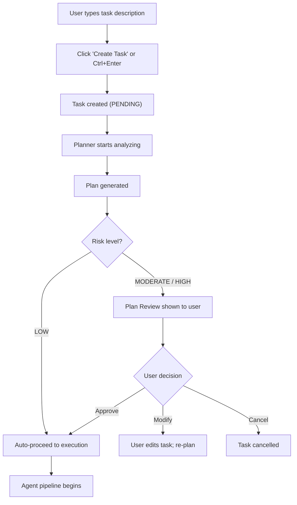

## Task Composer Design

**Location:** Inspector panel in workspace; also accessible from Dashboard "New Task" button and `Ctrl+Shift+N`.

**Components:**
- Multi-line text input (auto-expanding, max 500px height).
- Priority selector (dropdown: LOW, MEDIUM, HIGH, CRITICAL — default: MEDIUM).
- Optional: file references (drag files from explorer into composer to attach context).
- Submit: "Create Task" button + `Ctrl+Enter` keyboard shortcut.

**Feedback after creation:**
- Task immediately appears in the inspector panel with status "Understanding your request..."
- The Planner Agent's reasoning streams in the activity timeline.

**What NOT to do:**
- No chat interface.
- No back-and-forth conversation.
- No "How can I help you?" greeting.
- No streaming text response that looks like a chatbot reply.

Instead: structured plan output → approval gate → agent pipeline visualization.

---

# 20. Task Details

## Purpose

The task detail screen shows the complete state and history of a task — from creation through completion.

## Layout

```
┌──────────────────────────────────────────────────────────────┐
│ ← Back to Tasks                                              │
│                                                              │
│ Task: Add Google authentication                              │
│ Status: ● Executing   Priority: Medium   Branch: nexus/auth  │
│ Created: 09:40 AM   Duration: 4m 12s                         │
│                                                              │
│ [Cancel Task]                                                │
├────────────────────────┬─────────────────────────────────────┤
│                        │                                     │
│ PIPELINE               │ AGENT ACTIVITY                      │
│                        │                                     │
│ ✅ Understanding       │ 09:41:12 Planner started            │
│ ✅ Planning            │ 09:41:19 Analyzed repository         │
│ ●  Implementation      │ 09:41:45 Plan generated (8 steps)   │
│ ○  Testing             │ 09:42:03 Developer started           │
│ ○  Security            │ 09:42:15 Modified: src/auth/google.ts│
│ ○  Review              │ 09:42:41 Created: src/auth/callback.ts│
│                        │ 09:43:05 Developer completed         │
│ Debugger: standby      │                                     │
│                        │                                     │
├────────────────────────┼─────────────────────────────────────┤
│ CHANGES                │ TEST RESULTS                         │
│                        │                                     │
│ 📄 src/auth/google.ts  │ ✅ 142 passed                       │
│ 📄 src/auth/callback.ts│ ❌ 2 failed                         │
│ 📄 src/models/user.ts  │ ⏭ 4 skipped                        │
│ 📄 package.json (+1dep)│                                     │
│                        │ [View Details]                       │
│ +215 lines / -12 lines │                                     │
│                        │                                     │
│ [View Full Diff]       │                                     │
├────────────────────────┴─────────────────────────────────────┤
│ SECURITY   No issues found ✅                                │
├──────────────────────────────────────────────────────────────┤
│ REVIEW   NEXUS Review: Approved ✅                           │
│ "Changes align with requirements. Test coverage adequate."    │
├──────────────────────────────────────────────────────────────┤
│                    [Reject Changes]   [Approve & Commit]     │
└──────────────────────────────────────────────────────────────┘
```

## Task Header

| Element | Description |
|---|---|
| Task title | Generated from user description; editable |
| Status badge | Current status with icon + color + label |
| Priority badge | Risk-colored badge |
| Branch name | Git branch created for this task |
| Timestamps | Created, started, completed |
| Duration | Live counter while running; final duration when complete |
| Cancel button | Red outline button; visible while task is running |

## Pipeline Progress

Vertical step indicator showing the six-stage pipeline. Each step:
- `✅` Completed (green check)
- `●` Active (blue, pulsing)
- `○` Pending (gray, empty)
- `❌` Failed (red X)
- `⏭` Skipped

The Debugger is shown as a conditional branch: "Debugger: standby" or "Debugger: active (attempt 2/3)."

## Tabs

The lower portion uses horizontal tabs:

| Tab | Content |
|---|---|
| **Activity** | Agent activity timeline (default) |
| **Changes** | File change list + diff |
| **Tests** | Test results |
| **Security** | Security findings |
| **Review** | AI review comments |
| **Logs** | Raw logs |

---

# 21. Plan Review

## Purpose

Before executing MODERATE or HIGH risk plans, NEXUS presents the plan for user review.

## Plan Review Modal (560px wide)

```
┌──────────────────────────────────────────────────────────────┐
│  Review Plan                                            [✕]  │
├──────────────────────────────────────────────────────────────┤
│                                                              │
│  📋 Goal                                                     │
│  Add Google OAuth authentication using OAuth 2.0             │
│                                                              │
│  ⚠ Risk Level: MODERATE                                     │
│  Estimated Complexity: M (Medium)                            │
│                                                              │
│  ─────────────────────────────────────────────────           │
│                                                              │
│  📝 Implementation Steps                                     │
│                                                              │
│  1. Install google-auth-library dependency                   │
│  2. Create OAuth provider configuration (src/auth/google.ts) │
│  3. Create callback endpoint (src/auth/callback.ts)          │
│  4. Update User model with googleId field                    │
│  5. Add login button to frontend                             │
│  6. Create authentication tests                              │
│  7. Update environment configuration                         │
│                                                              │
│  📁 Files Affected (8)                                       │
│  ┌─────────────────────────────────────────────────┐         │
│  │ NEW   src/auth/google.ts                        │         │
│  │ NEW   src/auth/callback.ts                      │         │
│  │ MOD   src/models/user.ts                        │         │
│  │ MOD   src/routes/auth.ts                        │         │
│  │ MOD   src/components/LoginButton.tsx            │         │
│  │ MOD   package.json                              │         │
│  │ NEW   tests/auth/google.test.ts                 │         │
│  │ MOD   .env.example                              │         │
│  └─────────────────────────────────────────────────┘         │
│                                                              │
│  🔧 Tools Required                                           │
│  File System, Terminal (Docker), Package Manager, Git        │
│                                                              │
│  ⚠ Requires Approval                                        │
│  • New dependency installation                               │
│  • Environment configuration change                          │
│                                                              │
├──────────────────────────────────────────────────────────────┤
│  [Cancel]          [Modify Task]          [Approve Plan ▶]   │
└──────────────────────────────────────────────────────────────┘
```

## Plan Review Elements

| Element | Purpose |
|---|---|
| **Goal** | What the task will accomplish (from Planner) |
| **Risk Level** | Color-coded risk badge (LOW/MODERATE/HIGH) |
| **Complexity** | S/M/L/XL estimate |
| **Steps** | Ordered list of implementation steps |
| **Files Affected** | List with NEW/MOD/DEL tags; each file clickable to view current content |
| **Tools Required** | Which tools the agents will need |
| **Approval Notes** | Specific items that will need in-progress approval |
| **Actions** | Cancel (dismiss), Modify Task (re-compose), Approve Plan (begin execution) |

## Keyboard Shortcuts in Plan Review

| Key | Action |
|---|---|
| `Enter` | Approve plan |
| `Esc` | Close (cancel) |
| `Tab` | Move focus between buttons |

---

# 22. Multi-Agent Experience

## Agent Pipeline Visualization

The six agents are visualized as a **vertical pipeline** in the task detail view:

```
  ┌─────────────────┐
  │ 🧠 Planner      │  ✅ 12s
  └────────┬────────┘
           │
  ┌────────▼────────┐
  │ 💻 Developer    │  ● Running  42s
  └────────┬────────┘
           │
  ┌────────▼────────┐
  │ 🧪 Tester       │  ○ Pending
  └────────┬────────┘
           │
      ┌────▼────┐
      │ 🔧 Debug│  ○ Standby
      └────┬────┘
           │
  ┌────────▼────────┐
  │ 🛡 Security     │  ○ Pending
  └────────┬────────┘
           │
  ┌────────▼────────┐
  │ 👁 Reviewer     │  ○ Pending
  └────────┬────────┘
```

Each agent card in the pipeline shows:
- Agent icon (unique per agent, in agent color)
- Agent name
- Status (icon + label)
- Duration (when completed)
- Expand arrow (to see tool calls and details)

### Compact Agent View

Used in the task detail pipeline sidebar. Shows: icon, name, status badge, duration. Clicking expands.

### Detailed Agent View

Expanded agent card (inline or in inspector panel):

```
┌──────────────────────────────────────────┐
│ 💻 Developer Agent                       │
│ Status: ● Running   Model: llama3:8b     │
│ Duration: 42s       Tokens: 1,247 in/382 out │
├──────────────────────────────────────────┤
│ Actions:                                 │
│  📄 Read src/routes/auth.ts              │
│  🔍 Search: "auth middleware"            │
│  📝 Write src/auth/google.ts (new)       │
│  📝 Write src/auth/callback.ts (new)     │
│  📝 Modify src/models/user.ts            │
│  📦 Install google-auth-library          │
│  📝 Modify package.json                  │
├──────────────────────────────────────────┤
│ 7 tool calls · 5 files modified          │
└──────────────────────────────────────────┘
```

### Self-Healing Loop Visualization

When the Debugger agent activates, the pipeline shows a loop:

```
  │ 🧪 Tester   │  ❌ 2 failed
       │
  │ 🔧 Debugger │  ● Attempt 1/3
       │
  │ 🧪 Tester   │  ● Re-running...
```

The loop count ("Attempt 1/3") is prominently displayed so users know the system won't loop forever.

---

# 23. Agent Activity

## Activity Timeline

The agent activity timeline is the **narrative backbone** of any task. It shows, chronologically, every significant event.

### Timeline Entry Types

| Type | Visual | Content |
|---|---|---|
| **Agent started** | Agent icon + color dot | "Planner started" |
| **Agent thinking** | Faded text, italic | "Analyzing repository structure..." |
| **Tool call** | Tool icon + monospace params | "🔍 Search: `auth middleware` → 3 results" |
| **File modified** | File icon + path | "📝 Created `src/auth/google.ts`" |
| **Test result** | Pass/fail icon | "✅ 142 passed, ❌ 2 failed" |
| **Error** | Red icon | "❌ Docker container timeout" |
| **Approval request** | Orange shield icon | "⚠ Approval required: install dependency" |
| **Agent completed** | Checkmark | "Developer completed (42s, 7 tool calls)" |
| **Security finding** | Shield icon + severity | "🛡 HIGH: Hardcoded API key in config.ts" |

### Timeline Entry Layout

```
09:42:03  💻  Developer: Modified src/auth/google.ts
                Created OAuth provider configuration
                +85 lines                              [View Diff]
```

Each entry shows:
- **Timestamp** — `caption` size, `text-muted` color
- **Agent indicator** — Agent icon in agent color
- **Description** — `body-sm` size
- **Detail** (expandable) — additional info, collapsible
- **Action link** (optional) — "View Diff", "View File", "View Details"

### Filtering

Timeline can be filtered by:
- Agent type (show only Developer events)
- Event type (show only tool calls)
- Severity (show only warnings/errors)

### Live Streaming

When an agent is active, new timeline entries animate in from the bottom with a subtle slide-up (150ms, ease-out). The timeline auto-scrolls to the latest entry unless the user has scrolled up manually (scroll-lock behavior).

---

# 24. Approval UX

## Approval Types

| Type | Risk | UI Treatment | Trigger |
|---|---|---|---|
| **Informational** | LOW | Inline notice in timeline; no user action needed | Low-risk plan auto-approved |
| **Plan Review** | MODERATE | Modal dialog (see [Section 21](#21-plan-review)) | Plan generated for MODERATE+ task |
| **Action Confirmation** | HIGH | Interruptive modal with context | File deletion, dangerous command |
| **Final Approval** | MODERATE+ | Full-screen review with diff/test/security summary | Before committing changes |
| **Critical** | CRITICAL | Interruptive modal with red border, double-confirm | Production config change, secret modification |

## Standard Approval Dialog

```
┌──────────────────────────────────────────────────────────────┐
│  ⚠ Approval Required                                        │
├──────────────────────────────────────────────────────────────┤
│                                                              │
│  NEXUS wants to:                                             │
│                                                              │
│  Delete file: migrations/002_add_users.sql                   │
│                                                              │
│  Reason:                                                     │
│  Replacing with updated migration that includes OAuth fields │
│                                                              │
│  Risk: ██ HIGH                                               │
│                                                              │
│  Context:                                                    │
│  This file contains the current user table schema.           │
│  Deleting it may require re-running migrations.              │
│                                                              │
├──────────────────────────────────────────────────────────────┤
│      [Reject]                              [Approve]         │
└──────────────────────────────────────────────────────────────┘
```

## Critical Approval Dialog (Double-Confirm)

For CRITICAL actions, the Approve button requires typing "CONFIRM" or the action name:

```
┌──────────────────────────────────────────────────────────────┐
│  🛑 Critical Action Requires Confirmation                    │
├──────────────────────────────────────────────────────────────┤
│                                                              │
│  NEXUS wants to:                                             │
│                                                              │
│  Modify production configuration: docker-compose.prod.yml    │
│                                                              │
│  Risk: ███ CRITICAL                                          │
│                                                              │
│  Type "CONFIRM" to approve:                                  │
│  ┌─────────────────────────────┐                             │
│  │                             │                             │
│  └─────────────────────────────┘                             │
│                                                              │
├──────────────────────────────────────────────────────────────┤
│      [Cancel]                              [Approve]         │
└──────────────────────────────────────────────────────────────┘
```

## Final Task Approval

After all agents complete, the user sees a comprehensive approval screen:

```
┌──────────────────────────────────────────────────────────────┐
│  Review Changes — Add Google Authentication                  │
├──────────────────────────────────────────────────────────────┤
│                                                              │
│  Summary:                                                    │
│  8 files changed · +215 lines · -12 lines · 1 new dependency│
│                                                              │
│  Tests:    ✅ 142 passed  ❌ 0 failed                        │
│  Security: ✅ No issues found                                │
│  Review:   ✅ Approved by Reviewer Agent                     │
│                                                              │
│  ─────────────────────────────────────────────────           │
│                                                              │
│  [View Full Diff]  [View Test Results]  [View Security]      │
│                                                              │
│  Commit Message:                                             │
│  ┌─────────────────────────────────────────────────┐         │
│  │ feat(auth): add Google OAuth authentication     │         │
│  │                                                 │         │
│  │ - Added OAuth provider configuration            │         │
│  │ - Created callback endpoint                     │         │
│  │ - Updated user model with googleId              │         │
│  │ - Added authentication tests                    │         │
│  │                                                 │         │
│  │ Generated by NEXUS                              │         │
│  │ Task: task-12                                   │         │
│  └─────────────────────────────────────────────────┘         │
│  [Edit Message]                                              │
│                                                              │
├──────────────────────────────────────────────────────────────┤
│  [Discard All]    [Request Changes]    [Approve & Commit ▶]  │
└──────────────────────────────────────────────────────────────┘
```

---

# 25. Code Diff

## Diff Viewer Design

### File-Level View

```
┌──────────────────────────────────────────────────────────────┐
│  Changes (8 files)                                  [↕ ↔]   │
├──────────┬───────────────────────────────────────────────────┤
│ FILES    │  src/auth/google.ts (new)                         │
│          │                                                   │
│ + google │  1  + import { OAuth2Client } from '...';         │
│ + callba │  2  +                                             │
│ ~ user.t │  3  + export class GoogleAuthProvider {           │
│ ~ auth.t │  4  +   private client: OAuth2Client;             │
│ ~ Login  │  5  +                                             │
│ ~ packag │  6  +   constructor(config: AuthConfig) {         │
│ + google │  7  +     this.client = new OAuth2Client(          │
│ ~ .env   │  8  +       config.clientId,                      │
│          │  9  +       config.clientSecret,                   │
│          │ 10  +       config.redirectUri                     │
│          │ 11  +     );                                       │
│          │ 12  +   }                                          │
│          │ ...                                                │
└──────────┴───────────────────────────────────────────────────┘
```

### Features

| Feature | Specification |
|---|---|
| **Side-by-side vs unified** | Toggle between side-by-side and unified diff views (toggle button: `[↕ ↔]`) |
| **File tree** | Left panel listing all changed files with change type icons (+, ~, −) |
| **Added lines** | Green left-border accent + `status-success-muted` background |
| **Removed lines** | Red left-border accent + `status-error-muted` background |
| **Modified lines** | Word-level diff highlighting within changed lines |
| **Context lines** | Collapsible unchanged lines between changes (show 3 lines of context by default) |
| **Line numbers** | Dual line numbers (old/new) in side-by-side; single in unified |
| **File navigation** | Click file in tree to jump; up/down arrows to navigate between files |
| **Inline comments** | Agent review comments shown inline (V1) |
| **Accept/reject per file** | Checkbox per file to include/exclude from commit (V1) |
| **Revert** | Per-file "Revert" button to undo NEXUS changes |
| **Copy** | Select and copy diff content |

### Diff States

| State | Visual |
|---|---|
| No changes | Empty state: "No changes to review" |
| Loading diff | Skeleton loader |
| Large diff (>1000 lines) | Warning: "Large diff (1,247 lines). Showing first 500. [Load All]" |
| Binary file changed | "Binary file changed. Cannot display diff." |
| File renamed | "Renamed: old/path → new/path" |

---

# 26. Terminal

## Terminal Design

```
┌──────────────────────────────────────────────────────────────┐
│ Terminal  🐳 Sandbox                         [⬜] [✕]       │
├──────────────────────────────────────────────────────────────┤
│ nexus@sandbox:~/project$ npm install google-auth-library     │
│ added 1 package, and audited 847 packages in 3s             │
│                                                              │
│ nexus@sandbox:~/project$ npm run build                       │
│ > my-project@1.0.0 build                                    │
│ > tsc && vite build                                          │
│                                                              │
│ ✓ 247 modules transformed.                                   │
│ dist/index.html                0.46 kB │ gzip:  0.30 kB     │
│ dist/assets/index-DiwrgTda.js  142.65 kB │ gzip: 45.57 kB  │
│ ✓ built in 3.21s                                             │
│                                                              │
│ nexus@sandbox:~/project$ █                                   │
└──────────────────────────────────────────────────────────────┘
```

### Terminal Features

| Feature | Specification |
|---|---|
| **Sandbox indicator** | Docker whale icon + "Sandbox" label in terminal header when inside Docker — `status-info-muted` background |
| **Host indicator** | ⚠ "Host" label in terminal header with `status-warning-muted` background when running on host (requires HIGH approval) |
| **Font** | JetBrains Mono, 13px |
| **Background** | `#0a0a0a` (darker than surface — terminal stands out) |
| **Prompt** | `status-success` color for prompt (`nexus@sandbox:~/project$`) |
| **Error output** | `status-error` color for stderr lines |
| **Scrollback** | 10,000 lines |
| **Search** | `Ctrl+Shift+F` to search terminal output |
| **Copy** | Select text to copy; `Ctrl+Shift+C` |
| **Clear** | "Clear" button or `clear` command |
| **Stop** | Red "Stop" button visible when command is running |
| **Multiple terminals** | Tab bar for multiple terminal instances (V1) |

### Host vs Sandbox Visual Distinction

This is **critical** per the PRD. The distinction must be immediately obvious:

| Mode | Header Style | Prompt Color | Background Accent |
|---|---|---|---|
| **Sandbox (Docker)** | 🐳 "Sandbox" — `status-info-muted` bg | Green | Default dark |
| **Host** | ⚠ "HOST — Unsandboxed" — `status-warning-muted` bg, amber border | Amber | Slightly warmer dark tint |

---

# 27. Testing

## Test Results UI

### Summary Bar

```
Tests: ✅ 142 passed  ❌ 2 failed  ⏭ 4 skipped     Duration: 8.3s
```

Color-coded numbers: green for passed, red for failed, gray for skipped.

### Test List

```
┌──────────────────────────────────────────────────────────────┐
│ ❌ auth/google.test.ts                                       │
│    ❌ GoogleAuthProvider > should validate token        0.3s  │
│    ❌ GoogleAuthProvider > should handle expired token  0.1s  │
│    ✅ GoogleAuthProvider > should create OAuth URL      0.2s  │
│                                                              │
│ ✅ auth/callback.test.ts                                     │
│    ✅ Callback > should exchange code for token         0.4s  │
│    ✅ Callback > should handle invalid code             0.1s  │
│                                                              │
│ ✅ models/user.test.ts  (4 tests, 0.8s)                      │
│ ✅ routes/auth.test.ts  (8 tests, 1.2s)                      │
│ ...                                                          │
└──────────────────────────────────────────────────────────────┘
```

### Failed Test Expanded

```
❌ GoogleAuthProvider > should validate token

  Expected: valid token response
  Received: TokenValidationError: invalid signature

  at src/auth/google.ts:42
  at tests/auth/google.test.ts:18

  [View Source]  [Ask NEXUS to Debug]
```

### Test States

| State | Icon | Color | Description |
|---|---|---|---|
| Not started | `○` | `text-muted` | Tests haven't been run |
| Running | `◌` (spinning) | `status-info` | Test execution in progress |
| Passed | `✅` | `status-success` | Test passed |
| Failed | `❌` | `status-error` | Test failed |
| Skipped | `⏭` | `text-muted` | Test skipped |
| Timed out | `⏱` | `status-warning` | Test exceeded timeout |

---

# 28. Self-Healing UX

## Self-Healing Visual Flow

When tests fail and the Debugger Agent activates, the UI communicates this clearly:

### In the Pipeline

```
  ✅ Developer completed
       │
  ❌ Tester — 2 tests failed
       │
  ● Debugger — Analyzing failures (Attempt 1/3)
       │
  ○ Tester — Re-run pending
```

### In the Activity Timeline

```
09:43:05  🧪  Tester: 2 tests failed
               • GoogleAuthProvider > should validate token
               • GoogleAuthProvider > should handle expired token

09:43:17  🔧  Debugger started
               Analyzing test failure output...

09:43:35  🔧  Debugger: Root cause identified
               Missing token verification step in validateToken()

09:43:42  🔧  Debugger: Fix applied
               Modified src/auth/google.ts — added signature verification

09:44:02  🧪  Tester: Re-running tests (attempt 2/3)...

09:44:18  🧪  Tester: All 144 tests passed ✅
```

### Key UX Principles for Self-Healing

1. **Never hide the failure.** The original failure is always visible in the timeline.
2. **Show the diagnosis.** The Debugger's root cause analysis is shown in plain text.
3. **Show the fix.** What was changed is visible (link to diff).
4. **Show the attempt count.** "Attempt 1/3" makes it clear the loop is bounded.
5. **Celebrate when it works.** A clear "All tests passed" success state.
6. **Escalate gracefully.** If max attempts reached: "NEXUS could not fix this automatically. Here's what was tried: [View Debug History]. You may want to [View Failures] and fix manually."

---

# 29. Security Center

## Security Dashboard

```
┌──────────────────────────────────────────────────────────────┐
│  Security                                                    │
├──────────────────────────────────────────────────────────────┤
│                                                              │
│  Overview                                                    │
│  ┌────┐ ┌────┐ ┌────┐ ┌────┐ ┌────┐                        │
│  │ 0  │ │ 1  │ │ 3  │ │ 5  │ │ 12 │                        │
│  │CRIT│ │HIGH│ │MED │ │LOW │ │INFO│                        │
│  │ 🔴 │ │ 🟠 │ │ 🟡 │ │ 🔵 │ │ ⚪ │                        │
│  └────┘ └────┘ └────┘ └────┘ └────┘                        │
│                                                              │
│  Recent Findings                                             │
│  ┌──────────────────────────────────────────────────────┐    │
│  │ 🟠 HIGH  Hardcoded API key detected                 │    │
│  │         config/api.ts:42                            │    │
│  │         Found by: Security Agent · Task #12         │    │
│  │         [View] [Fix with NEXUS]                     │    │
│  ├──────────────────────────────────────────────────────┤    │
│  │ 🟡 MED   Dependency vulnerability: lodash@4.17.20   │    │
│  │         CVE-2021-23337 · Prototype Pollution        │    │
│  │         [View] [Update Dependency]                  │    │
│  ├──────────────────────────────────────────────────────┤    │
│  │ 🟡 MED   SQL query constructed with string concat   │    │
│  │         src/db/queries.ts:18                        │    │
│  │         [View] [Fix with NEXUS]                     │    │
│  └──────────────────────────────────────────────────────┘    │
│                                                              │
└──────────────────────────────────────────────────────────────┘
```

### Finding Card

| Element | Content |
|---|---|
| Severity badge | Color-coded icon + label (CRITICAL/HIGH/MEDIUM/LOW/INFO) |
| Title | Finding description |
| Location | File path + line number (clickable — navigates to code viewer) |
| Source | Which agent found it; which task |
| Actions | "View" (navigate to file), "Fix with NEXUS" (create remediation task), "Dismiss" (mark as false positive with reason) |

### Empty State

```
🛡 No security issues found

Your project is looking good. Security scans run automatically with every task.
```

---

# 30. Project Health

> [!NOTE]
> **Phase: V1.** Project health is not part of MVP. This section defines the target design.

## Health Dashboard

| Category | Data Source | Visualization |
|---|---|---|
| **Test coverage** | Test runner output | Percentage bar (green >80%, yellow 50-80%, red <50%) |
| **Security** | Security Agent findings | Count by severity |
| **Dependencies** | Package audit | Outdated/vulnerable counts |
| **Last task** | Task history | Last successful task date |
| **Index freshness** | RAG system | Last indexed timestamp |

The health "score" is a simple categorical assessment: **Healthy** / **Needs Attention** / **Issues Found** — not a numeric score (which would imply false precision).

---

# 31. Git

## Git Panel

### Git Status View

```
┌──────────────────────────────────────────────────────────────┐
│  Git  🌿 main                              [Pull] [Push]     │
├──────────────────────────────────────────────────────────────┤
│                                                              │
│  Changes (3)                                                 │
│  ┌──────────────────────────────────────────────────────┐    │
│  │ ☐  M  src/auth/google.ts                            │    │
│  │ ☐  A  src/auth/callback.ts                          │    │
│  │ ☐  M  package.json                                  │    │
│  └──────────────────────────────────────────────────────┘    │
│  [Stage All]  [Stage Selected]                               │
│                                                              │
│  Staged (0)                                                  │
│  No files staged                                             │
│                                                              │
│  ─────────────────────────────────────────────────           │
│                                                              │
│  Commit Message                                              │
│  ┌──────────────────────────────────────────────────────┐    │
│  │ feat(auth): add Google OAuth                         │    │
│  └──────────────────────────────────────────────────────┘    │
│  [Commit]                                                    │
│                                                              │
│  ─────────────────────────────────────────────────           │
│                                                              │
│  Recent Commits                                              │
│  • a1b2c3d  fix: resolve login redirect (2h ago)            │
│  • d4e5f6a  feat: add user profile page (5h ago)            │
│  • 7g8h9i0  chore: update dependencies (1d ago)             │
│                                                              │
└──────────────────────────────────────────────────────────────┘
```

### Git Feature Mapping

| Feature | UI Element | Approval |
|---|---|---|
| **Status** | File list with change type badges (M, A, D, R) | N/A |
| **Diff** | Inline diff per file (click file to expand) | N/A |
| **Stage** | Checkbox per file; "Stage All" button | N/A |
| **Commit** | Message input + "Commit" button | MODERATE (configurable auto-approve) |
| **Branch create** | "New Branch" button → name input | MODERATE |
| **Checkout** | Branch dropdown selector | MODERATE |
| **Pull** | "Pull" button | MODERATE |
| **Push** | "Push" button | HIGH (always requires approval) |
| **Revert** | Per-commit "Revert" button in history | MODERATE |

---

# 32. GitHub

> [!NOTE]
> **Phase: V1.** GitHub integration is not part of MVP.

### GitHub Panel (V1)

| Feature | UI Element |
|---|---|
| **Connection status** | "Connected as @username" or "Not connected — [Connect]" |
| **Repository** | Remote URL display |
| **Pull requests** | List of open PRs for this repository |
| **Create PR** | Form: title, body (auto-filled from task), base branch, labels, reviewers |
| **PR detail** | Status, checks, review status |

---

# 33. Model Management

## Models Screen

```
┌──────────────────────────────────────────────────────────────┐
│  Models                                                      │
├──────────────────────────────────────────────────────────────┤
│                                                              │
│  System: NVIDIA RTX 3060 (12GB VRAM) · 32GB RAM             │
│  Ollama: ● Running (v0.3.12)                                │
│                                                              │
│  ─────────────────────────────────────────────────           │
│                                                              │
│  Installed Models                                            │
│  ┌──────────────────────────────────────────────────────┐    │
│  │ llama3:8b              ● Active (default)           │    │
│  │ 4.7 GB · 8k context · Recommended for your hardware │    │
│  ├──────────────────────────────────────────────────────┤    │
│  │ codellama:13b           ○ Available                  │    │
│  │ 7.4 GB · 16k context · Good for code generation     │    │
│  ├──────────────────────────────────────────────────────┤    │
│  │ mistral:7b              ○ Available                  │    │
│  │ 4.1 GB · 32k context · General purpose              │    │
│  └──────────────────────────────────────────────────────┘    │
│                                                              │
│  Agent Model Assignment                                      │
│  ┌──────────────────────────────────────────────────────┐    │
│  │ Planner      [llama3:8b    ▾]                       │    │
│  │ Developer    [llama3:8b    ▾]                       │    │
│  │ Tester       [llama3:8b    ▾]                       │    │
│  │ Debugger     [llama3:8b    ▾]                       │    │
│  │ Security     [llama3:8b    ▾]                       │    │
│  │ Reviewer     [llama3:8b    ▾]                       │    │
│  └──────────────────────────────────────────────────────┘    │
│                                                              │
│  [Pull New Model]                                            │
│                                                              │
└──────────────────────────────────────────────────────────────┘
```

### Key Design Decisions

- **Hardware info shown prominently** — users need to understand what models their hardware supports.
- **"Recommended for your hardware"** label — NEXUS auto-recommends based on detected GPU/RAM.
- **Simple per-agent assignment** — advanced users can assign different models per agent; most users will use the same model for all.
- **No model internals** — parameters, quantization details hidden behind "Advanced" toggle for power users.

---

# 34. Memory & Knowledge

> [!NOTE]
> **Phase: V1.** Memory/knowledge UI is not part of MVP. Indexing happens automatically; the V1 UI provides visibility.

### Memory Screen (V1)

| Section | Content |
|---|---|
| **Index Status** | "Indexed 1,247 files · Last indexed: 2 minutes ago" + [Re-index] button |
| **Project Knowledge** | List of indexed documents with type (source, docs, config) |
| **Task Memory** | Past task summaries (searchable) |
| **User Preferences** | Coding style preferences; approved/rejected patterns |
| **Search** | Search project knowledge; preview results |

### Clear Separation

Three distinct tabs:
- **Project** — code index, documentation, architecture
- **Tasks** — past task summaries, decisions
- **Preferences** — user coding style, approved patterns

---

# 35. Search

## Global Search (Command Palette)

Activated by `Ctrl+K`. Full-screen overlay modal.

```
┌──────────────────────────────────────────────────────────────┐
│  🔍  Search NEXUS...                                    [✕]  │
├──────────────────────────────────────────────────────────────┤
│                                                              │
│  Recent                                                      │
│  ○ Task: Add Google auth                                     │
│  ○ File: src/auth/google.ts                                  │
│  ○ Settings: Models                                          │
│                                                              │
│  ─────────────────────────────────────────────────           │
│                                                              │
│  Type to search files, tasks, settings, commands...          │
│                                                              │
└──────────────────────────────────────────────────────────────┘
```

### Search Result Categories

Results grouped by type:

| Category | Icon | Example |
|---|---|---|
| **Files** | 📄 | `src/auth/google.ts` |
| **Tasks** | ☑ | `Task #12: Add Google auth` |
| **Commands** | `>` | `> New Task`, `> Open Settings` |
| **Settings** | ⚙ | `Models`, `Permissions` |
| **Git** | 🌿 | `Branch: feature/auth` |
| **Security** | 🛡 | `Finding: Hardcoded API key` |

### Search Interactions

| Key | Action |
|---|---|
| `Ctrl+K` | Open search |
| Type | Filter results in real-time |
| `↑` / `↓` | Navigate results |
| `Enter` | Open selected result |
| `Esc` | Close search |
| `>` prefix | Switch to command mode |
| `#` prefix | Search tasks |
| `@` prefix | Search files |

---

# 36. Notifications

## Notification Design

### Toast Notifications

Appear bottom-right. Slide up animation (200ms). Stack up to 3.

| Type | Style | Auto-dismiss | Example |
|---|---|---|---|
| Success | Green left-border | 5s | "Task completed successfully" |
| Error | Red left-border | Persist | "Docker connection lost" |
| Warning | Amber left-border | 10s | "Ollama response slow" |
| Info | Blue left-border | 5s | "Project indexed (1,247 files)" |
| Approval | Orange left-border + action button | Persist | "Approval required: [View]" |

### Notification Center

Accessed via bell icon in top bar. Right slide-in panel (360px).

Content:
- Unread notifications (highlighted)
- All notifications (scrollable, paginated)
- Mark all as read
- Filter by type

### Notification Priority

| Priority | Delivery | Example |
|---|---|---|
| **Urgent** | Toast + notification center + mobile push | Approval required, critical security finding |
| **Normal** | Toast + notification center | Task completed, test results |
| **Low** | Notification center only | Index complete, model update available |

### Over-Notification Prevention

- Batch related notifications: "3 tests failed" not three separate "test failed" notifications.
- Don't notify for expected events: successful tool calls, normal agent transitions.
- Configurable per-type notification settings.

---

# 37. Settings

## Settings Architecture

Left sidebar + right content panel within the settings page.

### Settings Navigation

```
General
Appearance
─────────
AI Models
Agents
─────────
Permissions
Security
Docker
─────────
Git
GitHub
─────────
Notifications
Memory
Privacy
─────────
Advanced
About
```

### Key Settings Screens

#### General
- Default project directory
- Language (English, future: i18n)
- Startup behavior (open last project, show dashboard)

#### Appearance
- Theme: Dark / Light / System
- Font size: Small / Default / Large
- Sidebar position (left, future: right)
- Editor minimap on/off

#### AI Models
- Ollama connection URL (default: localhost:11434)
- Default model selection
- Per-agent model assignment
- Context window size
- Temperature (advanced toggle)

#### Permissions
- Default risk tolerance per project
- MODERATE-risk auto-approve toggle
- Per-tool permission overrides
- Audit log viewer

#### Docker
- Docker connection status
- Default resource limits (CPU, memory, disk)
- Network policy (default: disabled)
- Default container image

#### Git / GitHub
- Git user name and email
- Default branch naming pattern
- Commit message template
- GitHub authentication management
- Protected branch list

#### Notifications
- Per-type enable/disable toggles
- Desktop notification on/off
- Mobile push on/off
- Notification sound on/off

#### Privacy
- Telemetry opt-in/out (default: off)
- Crash reporting opt-in/out (default: off)
- Cloud AI provider warning acknowledgment
- Data deletion: "Delete all NEXUS data"

#### About
- NEXUS version
- Ollama version
- Docker version
- System info (CPU, GPU, RAM)
- Open-source licenses
- Check for updates

---

# 38. Onboarding

## First-Launch Flow

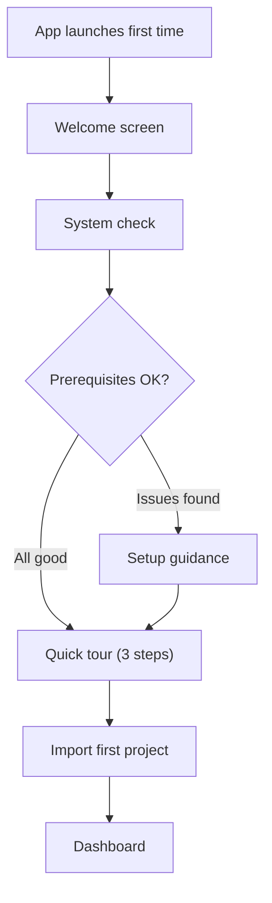

### Step 1: Welcome

```
┌──────────────────────────────────────────────────────────────┐
│                                                              │
│                        NEXUS                                 │
│                                                              │
│            Your AI Engineering Teammate                      │
│                                                              │
│   NEXUS runs locally on your machine. Your code never        │
│   leaves your computer unless you choose to share it.        │
│                                                              │
│                    [Get Started →]                            │
│                                                              │
└──────────────────────────────────────────────────────────────┘
```

### Step 2: System Check

```
Prerequisites:
✅ Ollama installed and running (llama3:8b detected)
✅ Docker Desktop running
✅ Git installed (v2.44)
⚠ No GPU detected — NEXUS will use CPU inference (slower)
   [Learn about GPU acceleration]
```

Shows automated detection of prerequisites. Green checkmarks for OK, yellow warnings for degraded, red X for missing with install links.

### Step 3: Quick Tour (3 slides, not a long tutorial)

1. **"Create tasks in natural language"** — Screenshot of task composer.
2. **"Watch AI agents work"** — Screenshot of agent pipeline.
3. **"Review and approve changes"** — Screenshot of diff + approval.

### Step 4: Import Project

Immediately prompts to import or create a project. Users can skip with "I'll do this later."

### Progressive Onboarding (post-setup)

On first use of each major feature, show a **one-time tooltip**:

| Feature | Tooltip |
|---|---|
| First task created | "NEXUS will plan the implementation first. You can review the plan before execution begins." |
| First approval | "You can approve or reject any change. Rejected changes are discarded." |
| First security finding | "NEXUS scans every change for security issues. Click a finding to see details." |
| First Git commit | "NEXUS creates a branch for each task. Changes are committed to the task branch." |

---

# 39. Empty States

Every screen with dynamic content must have a designed empty state.

| Screen | Empty State Message | Primary Action | Secondary Action |
|---|---|---|---|
| **Dashboard — Active Tasks** | "No active tasks. Start one!" | [New Task] | — |
| **Dashboard — Projects** | "No projects imported yet" | [Import Project] | [Clone Repository] |
| **Projects** | "Import your first project" | [Import Project] | [Clone Repository] |
| **Tasks** | "No tasks yet. Create your first AI task." | [New Task] | — |
| **Task Detail — Changes** | "No changes yet. Agents will modify files during execution." | — | — |
| **Task Detail — Tests** | "No test results. Tests run after implementation." | — | — |
| **Security** | "No security issues found. ✅" | — | — |
| **Git — Changes** | "Working tree clean. No uncommitted changes." | — | — |
| **Git — History** | "No commits in this repository." | — | — |
| **Models — Installed** | "No models installed. Pull a model from Ollama." | [Pull Model] | [Learn More] |
| **Notifications** | "All caught up! No notifications." | — | — |
| **Memory** | "Project not indexed yet." | [Index Project] | — |
| **Agent Activity** | "No agent activity yet. Create a task to get started." | [New Task] | — |

### Empty State Visual Pattern

```
┌─────────────────────────────────────┐
│                                     │
│          [Relevant Icon]            │
│                                     │
│     [Clear, concise message]        │
│     [Optional secondary text]       │
│                                     │
│     [Primary Action Button]         │
│     [Secondary Action Link]         │
│                                     │
└─────────────────────────────────────┘
```

Centered in the content area. Icon is 48px, `text-muted` color. Message is `body-lg`. Action button is primary style.

---

# 40. Loading States

### Loading Patterns

| Context | Pattern | Duration Expectation |
|---|---|---|
| **Page navigation** | Skeleton loader (content-shaped gray blocks) | < 500ms |
| **Project import analysis** | Progress bar with status text ("Detecting languages...") | 5–30s |
| **Agent thinking** | Pulsing dot (agent color) + italic status text | 2–60s |
| **Model loading** | Progress bar + "Loading model into memory..." | 5–30s |
| **Docker container start** | Spinner + "Starting sandbox..." | 5–10s |
| **Test execution** | Progress bar (if count known) or spinner + count | 5–300s |
| **Project indexing** | Progress bar + "Indexing files... (847/1,247)" | 15–300s |
| **Search** | Spinner inline with search input | < 500ms |
| **API call** | Skeleton for the content area | < 1s |

### Skeleton Loader Specification

Skeleton blocks match the shape of the content they're replacing:
- Text: Rounded rectangles (height: font size; width: 60–100% of expected text).
- Cards: Full card shape with internal skeleton blocks.
- Lists: Repeated row-shaped skeletons.
- Animation: Subtle shimmer left-to-right (1.5s duration, infinite repeat).

### Loading with Context

Always prefer context-aware loading over generic spinners:

**Instead of:** Generic spinner
**Use:** "Planner is analyzing your repository... (reading 42 files)"

**Instead of:** Indefinite progress bar
**Use:** Determinate progress bar when count is known (e.g., "Indexing... 847/1,247 files")

---

# 41. Error States

### Error Message Template

Every error communicates three things:

```
1. WHAT happened   — Clear description of the problem
2. WHY it happened  — Root cause if known
3. WHAT TO DO      — Actionable next step
```

### Error Patterns

#### Inline Error

For non-blocking errors (one component fails, rest of page works):

```
┌──────────────────────────────────────────┐
│ ❌ Could not load test results           │
│ Test runner timed out after 5 minutes.   │
│ [Retry]  [View Logs]                     │
└──────────────────────────────────────────┘
```

#### Banner Error

For system-level issues that affect the whole app:

```
┌──────────────────────────────────────────────────────────────┐
│ ⚠ Ollama is not running. AI features are unavailable.       │
│   Start Ollama to continue. [How to start Ollama]    [Retry] │
└──────────────────────────────────────────────────────────────┘
```

Banner appears at the top of the main content area, below the top bar. Yellow/amber for warnings, red for critical errors.

#### Full-Page Error

When the entire page cannot render:

```
┌──────────────────────────────────────────────────────────────┐
│                                                              │
│              ❌ Something went wrong                         │
│                                                              │
│    Could not connect to the NEXUS backend.                   │
│    The server may have crashed or failed to start.           │
│                                                              │
│    [Restart NEXUS]  [View Logs]  [Report Issue]              │
│                                                              │
└──────────────────────────────────────────────────────────────┘
```

### Error Catalog (Key Errors)

| Error | Type | Message | Action |
|---|---|---|---|
| Ollama unavailable | Banner | "AI engine is not running" | [How to Start] [Retry] |
| Docker unavailable | Banner | "Docker is not running. Sandbox unavailable." | [Install Docker] [Retry] |
| Git not found | Banner | "Git is not installed" | [Install Git] |
| Model not found | Inline | "Model '{name}' not found" | [Pull Model] [Choose Another] |
| Container timeout | Inline | "Command timed out after 5 minutes" | [Retry] [Cancel Task] |
| Permission denied | Inline | "Cannot access: permission denied" | [Fix Permissions] |
| GitHub auth failed | Inline | "GitHub authentication failed" | [Re-authenticate] |
| Network offline | Banner | "No internet connection. Online features unavailable." | [Retry] |
| Database error | Full-page | "Internal error. Database unavailable." | [Restart] [View Logs] |
| Agent failed | Inline | "Agent encountered an error: {details}" | [Retry Task] [View Logs] |

---

# 42. Real-Time UX

## Real-Time Update Patterns

| Data | Update Method | Visual Treatment |
|---|---|---|
| **Agent status** | WebSocket event | Status badge transitions with 150ms fade |
| **Task progress** | WebSocket event | Pipeline step fills in; progress percentage updates |
| **Agent activity** | WebSocket stream | New timeline entries slide-up animate into view |
| **LLM streaming** | WebSocket token stream | Characters appear one-by-one in "thinking" area |
| **File changes** | WebSocket event | File in tree gets modification indicator |
| **Test results** | WebSocket event | Test count updates; individual tests appear |
| **Terminal output** | WebSocket stream | Text appends to terminal buffer |
| **Approval requests** | WebSocket event | Toast notification + notification badge increment |

## Connection Loss Behavior

| Duration | Visual | Behavior |
|---|---|---|
| < 5 seconds | No visual change (debounced) | Auto-reconnect silently |
| 5–30 seconds | Status bar shows "⚡ Reconnecting..." in amber | Auto-reconnect with backoff |
| > 30 seconds | Banner: "Connection lost. Some information may be stale." | Show "Reconnect" button |
| Reconnected | Toast: "Connected" (green, 3s auto-dismiss) | Refresh all visible data |

## Optimistic Updates

For user actions (task creation, approval), the UI updates optimistically:
1. User clicks "Approve" → button immediately shows "Approved ✅"
2. Backend confirms → no visual change (already showing correct state)
3. Backend rejects → revert to previous state + error toast

---

# 43. Responsive Design

## Breakpoint Behavior

### xl (≥ 1440px) — Large Desktop

All panels visible. Full workspace layout. Recommended experience.

### lg (≥ 1280px) — Standard Desktop

All panels visible. Inspector panel may be narrower (300px). File explorer slightly narrower (240px).

### md (≥ 1024px) — Laptop

- Left sidebar: collapsed by default (48px, icons only).
- Inspector panel: hidden by default; opens as overlay on demand.
- Bottom panel: reduced height (180px).
- File explorer: hidden by default; accessible via toggle.

### sm (≥ 768px) — Small Laptop / Tablet

- Single-panel view. Only main content visible.
- Navigation via hamburger menu (slide-in overlay).
- File explorer, inspector, and bottom panel available as full-screen overlays.
- Dashboard rearranges to single column.

### xs (< 768px) — Mobile

Mobile-specific layout. See [Section 44 — Mobile Design](#44-mobile-design).

## Responsive Priority

When space is constrained, panels collapse in this order (last to collapse first):
1. Inspector panel (right)
2. File explorer
3. Bottom panel
4. Sidebar (collapses to icons, then overlay)
5. Main content (never collapses)

---

# 44. Mobile Design

## Mobile Design Philosophy

The mobile app is a **companion**, not a clone. It answers: "What's happening on my desktop NEXUS?" and "Do I need to approve anything?"

### Bottom Navigation (5 tabs)

```
┌──────────────────────────────────────────┐
│                                          │
│           [Screen Content]               │
│                                          │
├──────────────────────────────────────────┤
│  🏠     📋     🔔     🛡     ⚙          │
│ Home  Tasks  Alerts  Secure  Settings    │
└──────────────────────────────────────────┘
```

| Tab | Content |
|---|---|
| **Home** | Connection status, active tasks, system health, quick approve |
| **Tasks** | Task list (filterable), task detail |
| **Alerts** | Pending approvals + notifications |
| **Security** | Security findings summary |
| **Settings** | Connection, pairing, notification preferences |

### Mobile Cards

Task cards on mobile are compact:

```
┌──────────────────────────────────────────┐
│  Add Google Authentication               │
│  my-project · 🌿 main                   │
│  ● Executing — Developer agent (42s)     │
│  ██████░░░░ 60%                          │
│                                    [→]   │
└──────────────────────────────────────────┘
```

### Mobile Approval

Approval screens on mobile must be **simple and high-confidence**:

```
┌──────────────────────────────────────────┐
│  ⚠ Approval Required                    │
│                                          │
│  Task: Add Google auth                   │
│  Risk: MODERATE                          │
│                                          │
│  NEXUS wants to:                         │
│  • Modify 5 files                        │
│  • Add 1 dependency                      │
│  • Create 2 new files                    │
│                                          │
│  Tests: ✅ 142 passed                    │
│  Security: ✅ No issues                  │
│                                          │
│  [View Diff]  [View Plan]                │
│                                          │
│  ┌────────────┐  ┌────────────────────┐  │
│  │   Reject   │  │  Approve & Commit  │  │
│  └────────────┘  └────────────────────┘  │
│                                          │
└──────────────────────────────────────────┘
```

### Mobile Agent Activity

Simplified timeline:

```
09:42  💻 Developer modified 5 files
09:43  🧪 Tester: 142 passed, 0 failed
09:43  🛡 Security: No issues
09:44  👁 Reviewer: Approved
```

No expanded tool-call details on mobile. Link to "View on Desktop" for full details.

### Mobile Typography

| Token | Mobile Size |
|---|---|
| `h1` | 22px |
| `h2` | 18px |
| `h3` | 16px |
| `body` | 15px (slightly larger for touch readability) |
| `body-sm` | 13px |
| `caption` | 12px |

### Mobile Touch Targets

Minimum touch target: **44×44px** (Apple HIG / Material Design guideline). Spacing between touch targets: minimum 8px.

---

# 45. Accessibility

## WCAG Target

**WCAG 2.1 Level AA** compliance for MVP. Level AAA for contrast (4.5:1 body text, 3:1 large text).

## Requirements

| Requirement | Implementation |
|---|---|
| **Keyboard navigation** | All interactive elements reachable via Tab/Shift+Tab; Enter/Space to activate |
| **Focus states** | Visible focus ring (2px `border-focus` outline, 2px offset) on all interactive elements |
| **Screen readers** | ARIA labels on all icons-only buttons; ARIA live regions for real-time updates; proper heading hierarchy |
| **Color contrast** | All text meets 4.5:1 against background; all interactive elements meet 3:1 |
| **Color independence** | Status is never communicated by color alone — always icon + label + color |
| **Reduced motion** | `prefers-reduced-motion: reduce` — disable all animations; replace with instant transitions |
| **Focus trap** | Modals and dialogs trap focus; Esc dismisses |
| **Skip links** | "Skip to main content" link visible on Tab |
| **Form labels** | All inputs have visible labels (not placeholder-only) |
| **Error identification** | Form errors identified with icon + text + red border (not color alone) |
| **Touch targets** | Minimum 44×44px on mobile |

## Screen Reader Announcements

| Event | Announcement |
|---|---|
| Task status change | "Task status changed to executing" |
| Agent started | "Planner agent started" |
| Approval required | "Approval required: review plan for add authentication" |
| Test results | "Tests completed: 142 passed, 2 failed" |
| Error | "Error: Ollama is not running" |

---

# 46. Keyboard Shortcuts

## Global Shortcuts

| Shortcut | Action |
|---|---|
| `Ctrl+K` | Open global search / command palette |
| `Ctrl+Shift+N` | New AI task |
| `Ctrl+Shift+P` | Command palette (command mode) |
| `Ctrl+B` | Toggle left sidebar |
| `Ctrl+J` | Toggle bottom panel |
| `Ctrl+Shift+I` | Toggle inspector panel |
| `Ctrl+1` through `Ctrl+6` | Navigate to sidebar items |
| `Ctrl+,` | Open settings |
| `Escape` | Close modal / panel / search |

## Workspace Shortcuts

| Shortcut | Action |
|---|---|
| `Ctrl+P` | Quick file open (search project files) |
| `Ctrl+Shift+F` | Search in files |
| `Ctrl+G` | Go to line (in code viewer) |
| `Ctrl+Tab` | Switch between open tabs |
| `Ctrl+W` | Close current tab |

## Task Shortcuts

| Shortcut | Action |
|---|---|
| `Ctrl+Enter` | Submit task (in task composer) |
| `Enter` | Approve (in approval dialog) |
| `Escape` | Reject / Cancel (in approval dialog) |

## Navigation Shortcuts

| Shortcut | Action |
|---|---|
| `Alt+←` | Back |
| `Alt+→` | Forward |

### Conflict Resolution

- Shortcuts are inspired by VS Code conventions to minimize learning curve.
- Tauri-level shortcuts (`Ctrl+Q` quit, `Ctrl+N` new window) are preserved.
- No conflicts with standard browser shortcuts (this is a desktop app via Tauri, so browser shortcuts are not relevant).

---

# 47. Command Palette

## Design

Activated by `Ctrl+Shift+P`. Overlays the search modal with `>` prefix pre-filled.

```
┌──────────────────────────────────────────────────────────────┐
│  > Run Tests                                            [✕]  │
├──────────────────────────────────────────────────────────────┤
│                                                              │
│  > Run Tests                            ▶ Run project tests  │
│  > Run Tests (current file)             ▶ Run tests for file │
│  > Restart Ollama                       ⚙ System             │
│  > Re-index Project                     🧠 Memory            │
│                                                              │
└──────────────────────────────────────────────────────────────┘
```

## Available Commands

| Command | Category | Shortcut |
|---|---|---|
| New Task | Task | `Ctrl+Shift+N` |
| Cancel Current Task | Task | — |
| Run Tests | Testing | — |
| Open Terminal | Workspace | `Ctrl+`` ` |
| View Git Diff | Git | — |
| Create Branch | Git | — |
| Commit Changes | Git | — |
| Review Changes | Task | — |
| Open Security | Navigation | — |
| Re-index Project | Memory | — |
| Change Model | Models | — |
| Open Settings | Navigation | `Ctrl+,` |
| Toggle Theme | Appearance | — |
| Restart Backend | System | — |
| View Agent Logs | Debug | — |

Commands are fuzzy-matched. Results ranked by relevance and recency.

---

# 48. AI Interaction Design

## Core Principle

NEXUS is **task-driven, not conversation-driven**.

### What NEXUS Shows

| Element | Format | NOT |
|---|---|---|
| Understanding | Structured requirements list | Paragraph of conversational text |
| Plan | Ordered step list with affected files | Prose description |
| Progress | Pipeline visualization + activity timeline | "I'm now working on..." chat messages |
| Changes | File diff viewer | Code blocks in chat |
| Test results | Structured pass/fail table | "All tests passed!" message |
| Security | Finding cards with severity | "I checked for security issues..." |
| Review | Inline comments on diff | Conversational review |

### Conversational Text Usage

Conversational text is **minimized**, used only for:
- Agent "thinking" in the activity timeline (brief, italic, `text-muted`).
- Plan descriptions (brief, structured).
- Error explanations when no structured format fits.

### No Chat History

NEXUS does not maintain a visible "chat history." Each task is a self-contained unit with its own timeline, plan, changes, and results. There is no scrolling conversation thread.

---

# 49. Microcopy

## Tone Guidelines

| Attribute | Do | Don't |
|---|---|---|
| **Clear** | "NEXUS applied a fix and all 24 tests passed." | "NEXUS magically fixed your code!" |
| **Technical** | "2 tests failed: GoogleAuthProvider.validateToken" | "Oops, something went wrong with testing" |
| **Calm** | "Docker is not running. Start Docker Desktop to enable sandbox." | "CRITICAL ERROR: SANDBOX FAILURE!!!" |
| **Concise** | "3 files modified" | "NEXUS has successfully modified three files in your project" |
| **Honest** | "NEXUS could not fix this automatically. Manual review recommended." | "NEXUS tried its best!" |
| **Non-hype** | "Local AI inference — your code stays private" | "Revolutionary AI-powered coding magic" |

## Standard Phrases

| Context | Phrase |
|---|---|
| Task created | "Task created. Analyzing your request..." |
| Plan generated | "Implementation plan ready for review." |
| Execution started | "Executing plan. You can watch agent activity below." |
| Tests passed | "All {n} tests passed." |
| Tests failed | "{n} tests failed. Debugger is analyzing failures." |
| Debug success | "Fix applied. Re-running tests..." |
| Debug failure | "Could not fix automatically after {n} attempts. [View details]" |
| Security clean | "No security issues found." |
| Security finding | "{n} security {issues} found. Review recommended." |
| Approval needed | "Approval required: {description}" |
| Task complete | "Task completed. {n} files changed, {n} tests passed." |
| Task failed | "Task failed: {reason}. [View details] [Retry]" |

## Forbidden Words

| Word/Phrase | Reason | Alternative |
|---|---|---|
| "Magic" / "Magical" | Over-hype | "Automatic" / "Automated" |
| "Guaranteed" | Cannot guarantee AI output | "Expected" / "Intended" |
| "Perfect" | AI output is never perfect | "Completed" / "Successful" |
| "100% autonomous" | Misleading | "With human approval" |
| "Intelligent" (about output) | Anthropomorphizing | "Generated" / "Proposed" |
| "Oops" / "Uh oh" | Unprofessional | Clear error description |
| "Smart" | Vague | Specific capability description |

---

# 50. Motion Design

## Motion Principles

1. **Functional, not decorative.** Every animation communicates a state change.
2. **Fast.** Most transitions complete in 150–200ms.
3. **Subtle.** Animation should not draw attention to itself.
4. **Reducible.** All animations respect `prefers-reduced-motion`.

## Duration Scale

| Token | Duration | Usage |
|---|---|---|
| `motion-instant` | 0ms | Hover color changes, focus rings |
| `motion-fast` | 100ms | Tooltip appear, small state changes |
| `motion-normal` | 150ms | Panel transitions, card hover, tab switches |
| `motion-slow` | 250ms | Modal open/close, sidebar toggle, page transitions |
| `motion-deliberate` | 400ms | Onboarding transitions, large layout shifts |

## Easing

| Token | Value | Usage |
|---|---|---|
| `ease-out` | `cubic-bezier(0.16, 1, 0.3, 1)` | Elements entering view (modals open, panels expand) |
| `ease-in` | `cubic-bezier(0.7, 0, 0.84, 0)` | Elements leaving view (modals close) |
| `ease-in-out` | `cubic-bezier(0.45, 0, 0.55, 1)` | Elements moving (resize, reorder) |

## Specific Animations

| Element | Animation |
|---|---|
| **Toast notification** | Slide up 20px + fade in (200ms, ease-out) |
| **Modal** | Fade in backdrop + scale modal from 95% → 100% (250ms, ease-out) |
| **Sidebar toggle** | Width transition (200ms, ease-in-out) |
| **Bottom panel toggle** | Height transition (200ms, ease-in-out) |
| **Timeline entry** | Slide up 12px + fade in (150ms, ease-out) |
| **Agent "thinking"** | Pulsing opacity (1.0 → 0.5 → 1.0, 2s, infinite) |
| **Skeleton shimmer** | Gradient sweep left-to-right (1.5s, infinite, linear) |
| **Status dot (running)** | Gentle pulse scale (1.0 → 1.2 → 1.0, 2s, infinite) |
| **Tab switch** | Underline slides (150ms, ease-in-out) |
| **Progress bar** | Width transition (300ms, ease-out) |

## Reduced Motion

When `prefers-reduced-motion: reduce`:
- All animations become instant (0ms duration).
- Skeleton shimmer replaced with static gray.
- Pulsing indicators replaced with static icons.
- No slide animations — content appears/disappears instantly.

---

# 51. Component Library

## Component Inventory

### Navigation Components

| Component | Description | States |
|---|---|---|
| `Sidebar` | Left navigation with icons + labels | Expanded, Collapsed, Active item |
| `TopBar` | Application header with project switcher, search, notifications | Default, Project selected, Notifications active |
| `Breadcrumbs` | Hierarchical path navigation | Default, Clickable segments |
| `Tabs` | Horizontal tab bar | Default, Active, Disabled, With badge |
| `BottomNavigation` | Mobile bottom tab bar | Default, Active, With badge |

### Input Components

| Component | Description | States |
|---|---|---|
| `Button` | Primary, Secondary, Ghost, Destructive variants | Default, Hover, Focus, Active, Disabled, Loading |
| `Input` | Single-line text input | Default, Focus, Error, Disabled, With icon |
| `Textarea` | Multi-line text input (task composer) | Default, Focus, Error, Auto-expand |
| `Select` | Dropdown selector | Default, Open, Selected, Disabled |
| `Checkbox` | Binary toggle (file staging) | Unchecked, Checked, Indeterminate, Disabled |
| `Toggle` | On/off switch (settings) | Off, On, Disabled |
| `SearchInput` | Input with search icon + clear button | Empty, Typing, Results, No results |

### Feedback Components

| Component | Description | States |
|---|---|---|
| `Toast` | Notification popup | Success, Error, Warning, Info, Approval |
| `Alert` | Inline alert banner | Info, Warning, Error, Success |
| `Badge` | Status indicator label | Various colors per status |
| `ProgressBar` | Determinate/indeterminate progress | Active, Complete, Indeterminate |
| `Spinner` | Loading indicator | Default (16px, 24px sizes) |
| `Skeleton` | Content placeholder | Shimmer animation |

### Developer Components

| Component | Description | States |
|---|---|---|
| `CodeViewer` | Syntax-highlighted code display | Default, With diff overlay, Line selection |
| `DiffViewer` | Side-by-side / unified diff | Unified, Side-by-side, Loading, Empty |
| `Terminal` | Terminal emulator display | Active, Idle, Running command, Sandbox, Host |
| `FileTree` | Collapsible file explorer | Default, Modified indicators, Search filter |
| `LogViewer` | Scrollable log display | Auto-scroll, Paused, Filtered |
| `TestResult` | Individual test result row | Passed, Failed, Skipped, Running, Timeout |
| `TestSummary` | Aggregated test statistics | All passed, Some failed, Running |
| `GitStatus` | Changed file with status badge | Modified, Added, Deleted, Renamed |

### AI Components

| Component | Description | States |
|---|---|---|
| `AgentCard` | Agent in pipeline view | Idle, Running, Completed, Failed, Timeout |
| `AgentPipeline` | Vertical pipeline of 6 agents | Various combinations of agent states |
| `AgentTimeline` | Chronological event list | Streaming, Complete, Filtered |
| `TimelineEntry` | Single event in timeline | Various types (tool call, file change, etc.) |
| `TaskComposer` | Multi-line task input with submit | Empty, Typing, Submitting |
| `PlanCard` | Implementation plan display | Review, Approved, Modified |
| `ApprovalDialog` | Approval modal with context | Standard, Critical (double-confirm) |
| `RiskBadge` | Risk level indicator | LOW, MODERATE, HIGH, CRITICAL |
| `TaskCard` | Task summary card | Pending, Running, Completed, Failed |
| `TaskProgress` | Step-by-step progress indicator | Various stage combinations |

### Security Components

| Component | Description | States |
|---|---|---|
| `SecurityFinding` | Finding card with severity | CRITICAL, HIGH, MEDIUM, LOW, INFO |
| `SeverityBadge` | Severity indicator | 5 severity levels |
| `SecuritySummary` | Aggregated findings by severity | Clean, Issues found |

### Data Components

| Component | Description | States |
|---|---|---|
| `DataTable` | Sortable, filterable table | Default, Loading, Empty, Sorted |
| `List` | Scrollable item list | Default, Loading, Empty, Filtered |
| `Card` | Content container | Default, Hover, Selected, Loading |
| `EmptyState` | No-data placeholder | With/without action |
| `Modal` | Dialog overlay | Standard, Large, Critical |
| `Drawer` | Side panel overlay | Right slide-in |
| `Tooltip` | Hover information | Default |
| `DropdownMenu` | Action menu | Open, Closed |

---

# 52. Component States

## Universal Interactive States

Every interactive component must implement:

| State | Visual Treatment |
|---|---|
| **Default** | Base appearance |
| **Hover** | Background shifts to `bg-hover`; cursor: pointer |
| **Focus** | 2px `border-focus` outline with 2px offset |
| **Active / Pressed** | Background shifts to `bg-active` |
| **Disabled** | 50% opacity; cursor: not-allowed; no hover/focus effects |
| **Loading** | Content replaced with spinner or skeleton; interactions disabled |

## Button-Specific States

| Variant | Default | Hover | Active | Disabled | Loading |
|---|---|---|---|---|---|
| **Primary** | `primary` bg, white text | Lighter bg | Darker bg | 50% opacity | Spinner replaces text |
| **Secondary** | `bg-surface` bg, `text-primary` text, border | `bg-hover` bg | `bg-active` bg | 50% opacity | Spinner replaces text |
| **Ghost** | Transparent bg | `bg-hover` bg | `bg-active` bg | 50% opacity | Spinner replaces text |
| **Destructive** | `status-error` bg, white text | Lighter red | Darker red | 50% opacity | Spinner replaces text |

## Developer Component States

| Component | Additional States |
|---|---|
| **FileTree item** | Modified (dot indicator), New (+ badge), Deleted (strikethrough), Git-ignored (dimmed) |
| **Terminal** | Running command (green prompt blinks), Error output (red text), Sandbox mode, Host mode |
| **TestResult** | Passed ✅, Failed ❌, Skipped ⏭, Running ◌, Timed out ⏱ |
| **GitStatus file** | Modified (M), Added (A), Deleted (D), Renamed (R), Untracked (U) |

## Agent-Specific States

| State | Visual |
|---|---|
| **Idle** | Gray outline, `text-muted` text |
| **Running** | Agent-colored left border, pulsing status dot, `text-primary` text |
| **Completed** | Green check icon, agent-colored faded background |
| **Failed** | Red X icon, `status-error-muted` background |
| **Timeout** | Amber clock icon, `status-warning-muted` background |
| **Retrying** | Agent-colored border, "Attempt 2/3" label |

## Approval-Specific States

| State | Visual |
|---|---|
| **Pending** | Orange border, shield icon, "Approval Required" label, pulsing badge |
| **Approved** | Green border, check icon, "Approved" label |
| **Rejected** | Red border, X icon, "Rejected" label |

---

# 53. Design Tokens

## Token Categories

### Color Tokens

All colors defined in [Section 9](#9-color-system). Tokens are semantic (e.g., `status-success` not `green-500`).

### Typography Tokens

| Token | Value |
|---|---|
| `font-sans` | `'Inter', system-ui, -apple-system, sans-serif` |
| `font-mono` | `'JetBrains Mono', 'Fira Code', 'Cascadia Code', monospace` |
| `font-size-display` | `32px` |
| `font-size-h1` | `24px` |
| `font-size-h2` | `20px` |
| `font-size-h3` | `16px` |
| `font-size-h4` | `14px` |
| `font-size-body-lg` | `16px` |
| `font-size-body` | `14px` |
| `font-size-body-sm` | `13px` |
| `font-size-caption` | `12px` |
| `font-size-code` | `13px` |
| `font-weight-regular` | `400` |
| `font-weight-medium` | `500` |
| `font-weight-semibold` | `600` |
| `font-weight-bold` | `700` |
| `line-height-tight` | `1.2` |
| `line-height-snug` | `1.3` |
| `line-height-normal` | `1.4` |
| `line-height-relaxed` | `1.5` |
| `line-height-loose` | `1.6` |

### Spacing Tokens

See [Section 11](#11-spacing-system).

### Radius Tokens

| Token | Value |
|---|---|
| `radius-sm` | `4px` |
| `radius-md` | `6px` |
| `radius-lg` | `8px` |
| `radius-xl` | `12px` |
| `radius-full` | `9999px` |

### Border Tokens

| Token | Value |
|---|---|
| `border-width` | `1px` |
| `border-style` | `solid` |

### Shadow Tokens

| Token | Dark Value | Light Value |
|---|---|---|
| `shadow-sm` | `0 2px 4px rgba(0,0,0,0.2)` | `0 2px 4px rgba(0,0,0,0.05)` |
| `shadow-md` | `0 4px 12px rgba(0,0,0,0.3)` | `0 4px 12px rgba(0,0,0,0.1)` |
| `shadow-lg` | `0 8px 24px rgba(0,0,0,0.4)` | `0 8px 24px rgba(0,0,0,0.15)` |

### Motion Tokens

See [Section 50](#50-motion-design).

### Z-Index Tokens

| Token | Value | Usage |
|---|---|---|
| `z-base` | `0` | Default content |
| `z-raised` | `10` | Cards, panels |
| `z-dropdown` | `100` | Dropdowns, selects |
| `z-sticky` | `200` | Sticky headers, status bar |
| `z-overlay` | `300` | Drawers, side panels |
| `z-modal` | `400` | Modal dialogs |
| `z-popover` | `500` | Tooltips, popovers |
| `z-toast` | `600` | Toast notifications |
| `z-max` | `9999` | Command palette, critical overlays |

### Breakpoint Tokens

| Token | Value |
|---|---|
| `breakpoint-xs` | `0px` |
| `breakpoint-sm` | `768px` |
| `breakpoint-md` | `1024px` |
| `breakpoint-lg` | `1280px` |
| `breakpoint-xl` | `1440px` |

---

# 54. Screen Inventory

## Complete Screen List

| # | Screen | Purpose | User Goal | Phase | Priority |
|---|---|---|---|---|---|
| 1 | **Splash / Loading** | App startup | Wait for NEXUS to load | MVP | P0 |
| 2 | **Onboarding** | First-time setup | Understand NEXUS and configure prerequisites | MVP | P0 |
| 3 | **Dashboard** | System overview | See what's happening; take quick actions | MVP | P0 |
| 4 | **Projects List** | Project management | Find and manage projects | MVP | P0 |
| 5 | **Import Project** | Add a project | Import an existing codebase | MVP | P0 |
| 6 | **Project Workspace** | Engineering environment | View code, create tasks, observe agents | MVP | P0 |
| 7 | **Task Creation** | Create AI task | Describe what NEXUS should do | MVP | P0 |
| 8 | **Plan Review** | Review AI plan | Understand and approve the implementation plan | MVP | P0 |
| 9 | **Task Detail** | Monitor task | See task progress, agent activity, results | MVP | P0 |
| 10 | **Agent Activity** | Observe agents | See what each agent is doing in detail | MVP | P0 |
| 11 | **Code Diff** | Review changes | Inspect every line changed by NEXUS | MVP | P0 |
| 12 | **Terminal** | View execution | See sandbox command output | MVP | P0 |
| 13 | **Test Results** | View tests | See which tests passed/failed | MVP | P0 |
| 14 | **Security Findings** | View security | See security issues found | MVP | P0 |
| 15 | **Final Approval** | Approve/reject | Decide whether to commit changes | MVP | P0 |
| 16 | **Git Status** | Manage Git | View changes, stage, commit | MVP | P0 |
| 17 | **Git Diff** | Review diff | See file-level changes | MVP | P0 |
| 18 | **Models** | Manage AI | Configure models and agent assignments | MVP | P0 |
| 19 | **Settings** | Configure NEXUS | Adjust preferences and configuration | MVP | P0 |
| 20 | **Search / Command Palette** | Find anything | Quick access to files, tasks, commands | MVP | P0 |
| 21 | **Notifications** | View alerts | See all past notifications | MVP | P1 |
| 22 | **Approval Dialog** | Approve action | Approve a specific risky action | MVP | P0 |
| 23 | **Error States** | Handle errors | Understand and recover from errors | MVP | P0 |
| 24 | **Empty States** | Guide user | Understand what to do when no data | MVP | P0 |
| 25 | **Project Health** | Assess quality | See project health metrics | V1 | P1 |
| 26 | **GitHub** | GitHub integration | Create PRs, view PR status | V1 | P1 |
| 27 | **Memory / Knowledge** | Manage knowledge | View indexed content, re-index | V1 | P1 |
| 28 | **Mobile — Dashboard** | Remote overview | See what's happening from phone | V1 | P1 |
| 29 | **Mobile — Task Detail** | Remote monitoring | See task progress from phone | V1 | P1 |
| 30 | **Mobile — Approval** | Remote approval | Approve/reject from phone | V1 | P1 |
| 31 | **Mobile — Agent Activity** | Remote observation | See agent activity from phone | V1 | P1 |
| 32 | **Mobile — Notifications** | Remote alerts | See notifications on phone | V1 | P1 |
| 33 | **Mobile — Settings** | Connection config | Manage pairing and notification settings | V1 | P1 |

---

# 55. User Flows

## Flow 1: Import Project

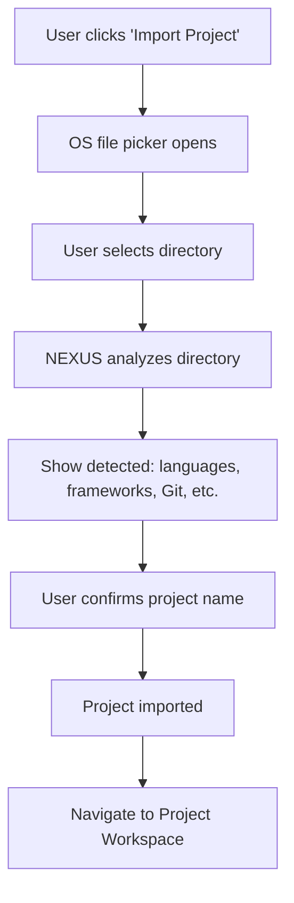

## Flow 2: Create AI Task

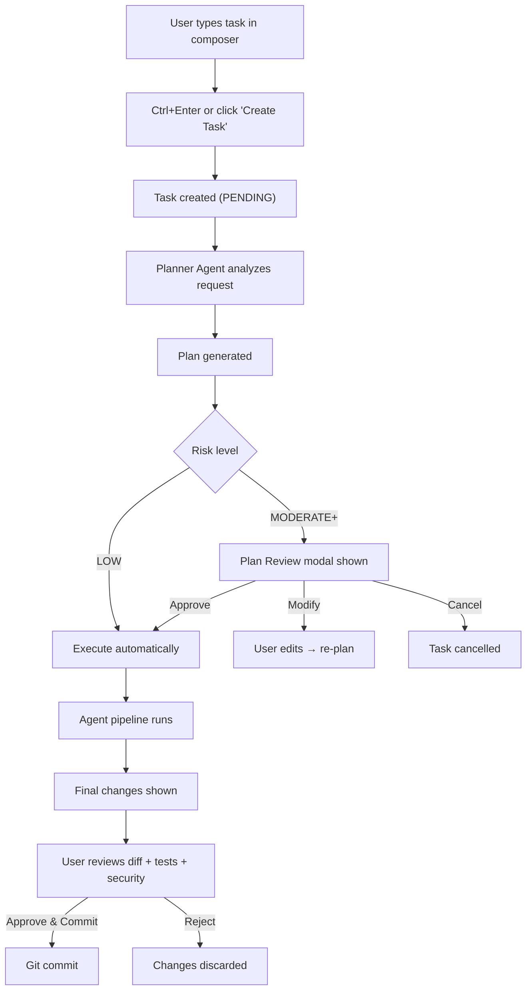

## Flow 3: Review Plan

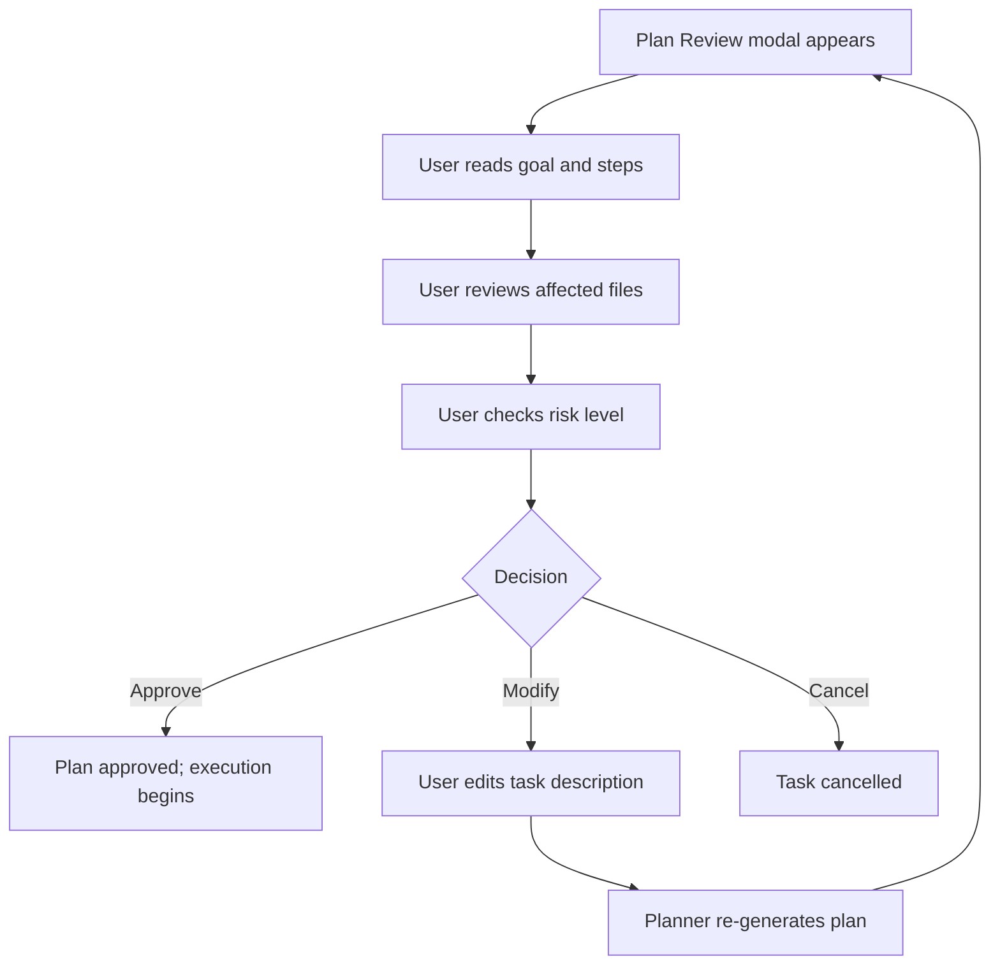

## Flow 4: Agent Execution Observation

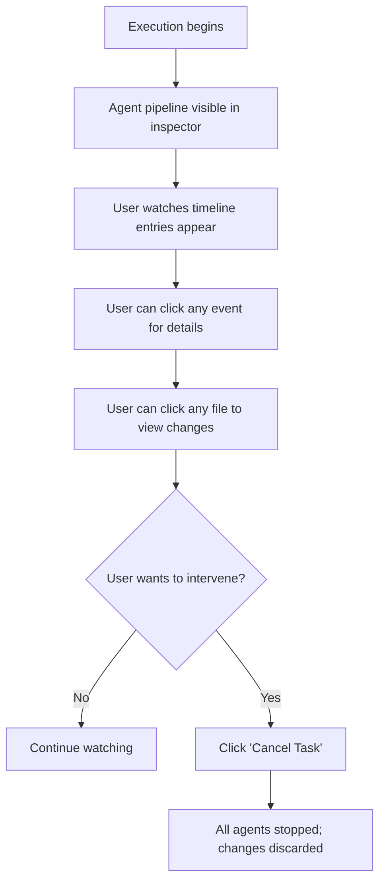

## Flow 5: Test Failure → Debug → Success

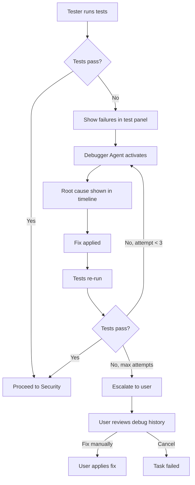

## Flow 6: Security Issue Found

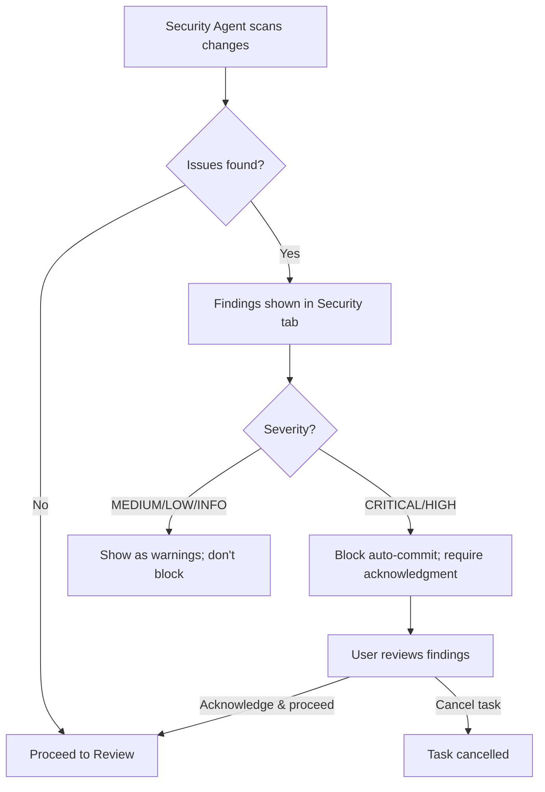

## Flow 7: Human Approval (In-Progress)

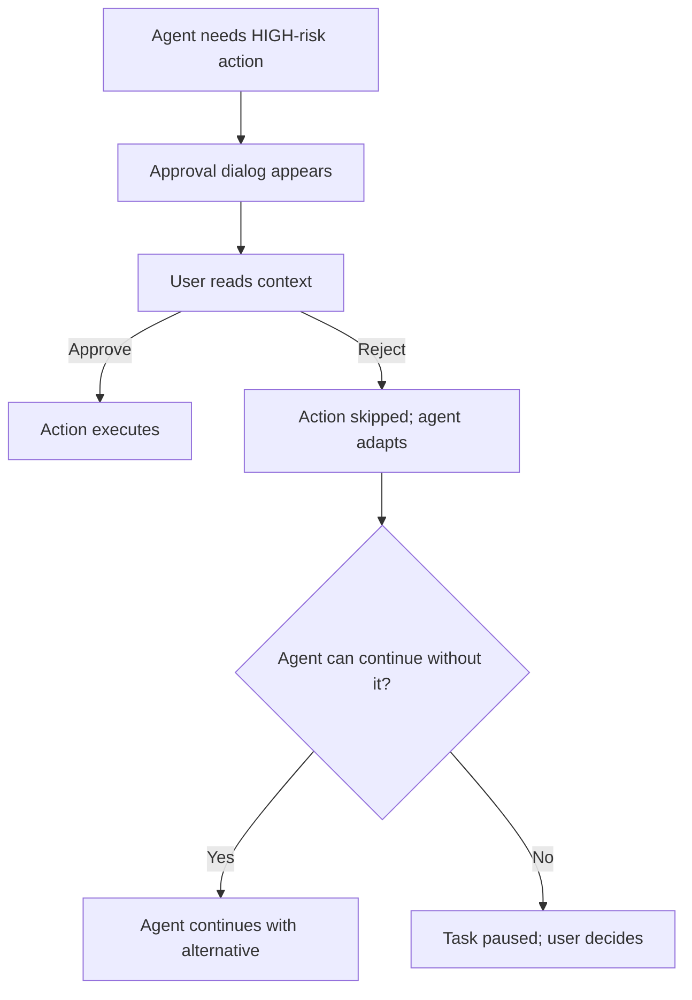

## Flow 8: Review Git Diff

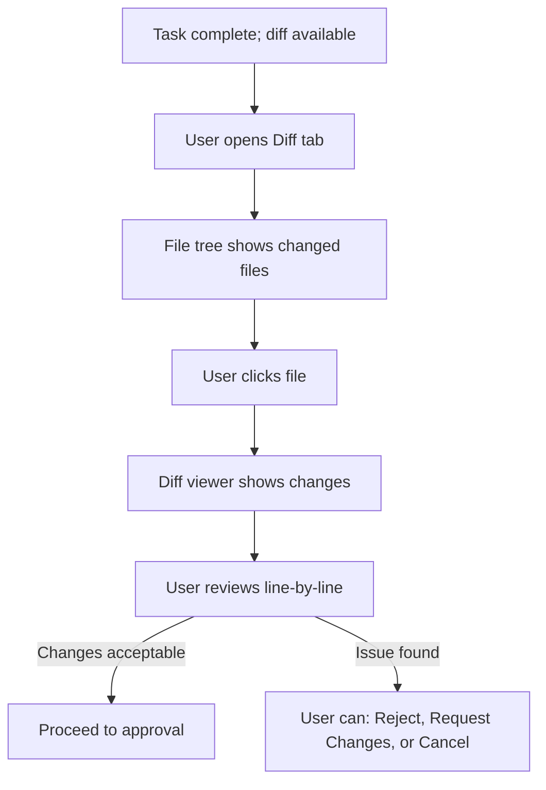

## Flow 9: Commit Changes

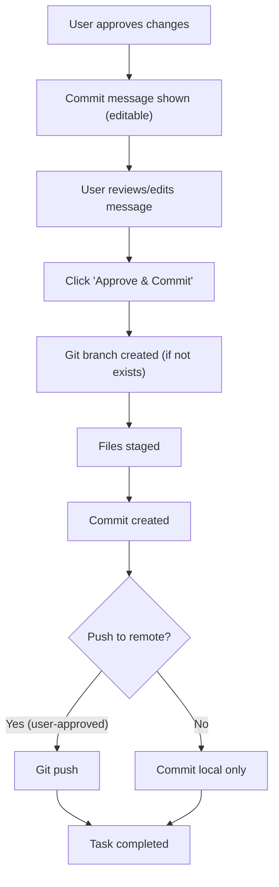

## Flow 10: Create GitHub PR (V1)

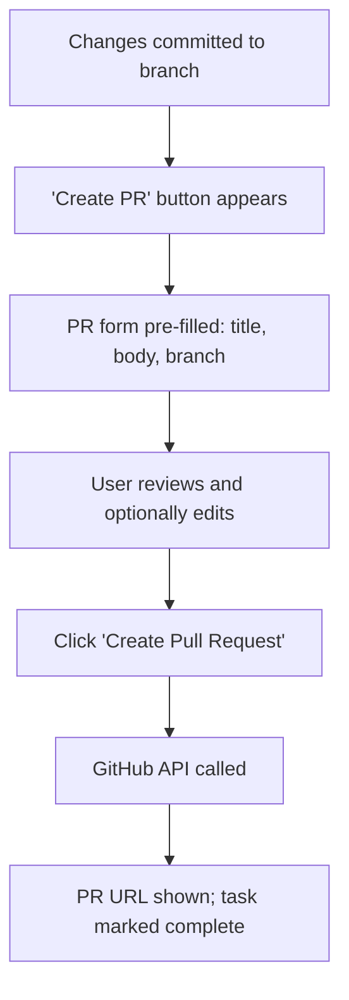

## Flow 11: Monitor from Mobile

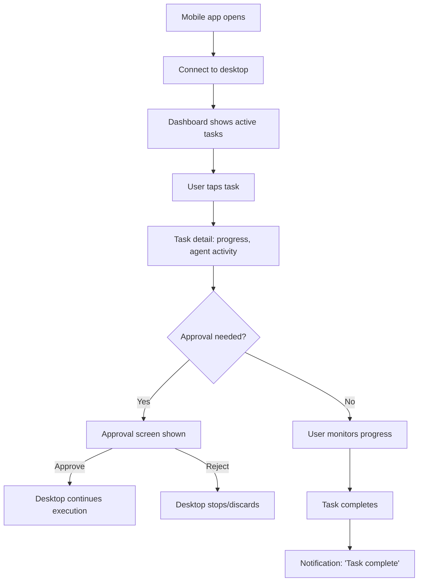

---

# 56. Failure UX

## Failure Design Principles

1. **Never make a failure look like a success.** Failed states must be visually distinct.
2. **Always explain what happened.** No generic "Something went wrong."
3. **Always provide a next action.** Retry, view logs, fix manually, or contact support.
4. **Distinguish AI failures from system failures.** "Agent couldn't find a fix" is different from "Docker crashed."

## Failure Visual Language

| Failure Type | Icon | Color | Background |
|---|---|---|---|
| **System failure** (Docker, Ollama, DB) | ❌ (circle-x) | `status-error` | `status-error-muted` |
| **AI failure** (agent can't complete) | 🔧 (wrench) | `status-warning` | `status-warning-muted` |
| **Test failure** (expected workflow) | ❌ (x-circle) | `status-error` | None (inline) |
| **Permission failure** | 🚫 (slash-circle) | `status-warning` | None |
| **Network failure** | 📡 (signal-off) | `text-muted` | None |

## Key Failure Scenarios

| Scenario | UI Treatment |
|---|---|
| **Agent enters infinite loop** | Progress stops; "Agent appears stuck. Stopping after 3 identical actions." + [Cancel Task] |
| **All debug attempts fail** | "NEXUS could not fix automatically. 3 attempts made." + [View Debug History] + [Fix Manually] |
| **Sandbox crashes** | "Execution environment crashed." + [Retry] + [View Logs] |
| **Git conflict** | Conflict markers shown in diff; "Merge conflict in {file}. Manual resolution needed." |
| **Network loss mid-task** | Tasks continue locally; GitHub/remote operations paused; "Network unavailable" banner |

---

# 57. Trust Design

## Trust-Building Mechanisms

| Mechanism | Implementation |
|---|---|
| **Show the plan before acting** | Plan Review modal with affected files and risk level |
| **Show every action taken** | Agent Activity Timeline with every tool call |
| **Show what changed** | Full diff viewer with line-by-line changes |
| **Show test results** | Quantitative: X passed, Y failed |
| **Show security results** | Findings by severity |
| **Allow stopping at any time** | Cancel button visible during all running operations |
| **Allow undoing** | Reject changes → discard all modifications; Git revert for committed changes |
| **Require approval for risky actions** | Multi-level approval system |
| **Be honest about limitations** | "NEXUS could not fix this automatically" — never hide failures |
| **Explain AI reasoning** | Agent "thinking" visible in timeline (when model supports it) |
| **Show resource usage** | Token count, model used, duration per agent |

## Progressive Trust Model

Users build trust gradually:

1. **First use:** All plans require review; all commits require approval.
2. **Comfortable:** User enables auto-approve for MODERATE-risk operations on personal projects.
3. **Trusted:** User configures auto-commit for LOW-risk tasks on non-critical projects.

The default configuration is **maximum oversight**. Trust is earned, not assumed.

---

# 58. Security UX

## Security Communication Guidelines

| Principle | Implementation |
|---|---|
| **Specific** | "Hardcoded API key detected in config/api.ts:42" NOT "Security issue found" |
| **Actionable** | Every finding includes a recommended action |
| **Severity-appropriate** | CRITICAL gets a red modal; INFO gets a footnote |
| **Non-alarming** | Use professional language, not panic-inducing alerts |
| **Non-dismissable (for CRITICAL)** | CRITICAL findings cannot be silently dismissed |

## Sandbox Indicator

The sandbox/host distinction is **always visible** when execution context is relevant:

```
🐳 Sandbox    — Blue info background; Docker whale icon
⚠ HOST        — Amber warning background; triangle alert icon; larger text
```

---

# 59. Data Visualization

## Visualization Philosophy

Every visualization must answer a **specific user question**. No decorative charts.

| Data | Visualization | Question Answered |
|---|---|---|
| **Task pipeline progress** | Vertical step indicator | "How far along is this task?" |
| **Test results** | Summary bar (green/red/gray segments) | "Did tests pass?" |
| **Security findings** | Count-by-severity chips | "How many issues and how serious?" |
| **Agent timeline** | Chronological event list | "What happened and when?" |
| **Resource usage** | Simple bar | "How much GPU/RAM is NEXUS using?" |
| **Project health** | Categorical label (Healthy / Needs Attention / Issues) | "Is my project in good shape?" |

## What NOT to Visualize

- No pie charts (hard to read, low information density).
- No line charts over time (insufficient data for trends in MVP).
- No complex dashboards with multiple charts (information overload).
- No "AI confidence scores" (misleading precision).
- No numerical health scores (implies false precision).

---

# 60. Design Handoff

## Handoff Specifications per Screen

For every P0 screen, the following must be documented:

| Specification | Detail |
|---|---|
| **Dimensions** | Panel widths, heights, min/max constraints |
| **Layout** | Flexbox/grid structure; responsive breakpoints |
| **Spacing** | Token-based spacing between all elements |
| **Components** | Which components from the library are used |
| **States** | All states the screen can be in (loading, empty, error, populated) |
| **Interactions** | Click, hover, keyboard, drag behaviors |
| **Responsive** | How the screen adapts at each breakpoint |
| **Accessibility** | ARIA labels, keyboard flow, screen reader announcements |
| **Data requirements** | What API data the screen needs |

This document provides specifications for all major screens. Final pixel-perfect designs should be created in Figma or equivalent design tool, referencing these specifications.

---

# 61. Frontend Design Mapping

## Component Hierarchy

```
AppShell
├── TopBar
│   ├── SidebarToggle
│   ├── Logo
│   ├── ProjectSwitcher
│   ├── BranchIndicator
│   ├── SearchTrigger
│   ├── NotificationBell
│   └── SettingsLink
├── Sidebar
│   ├── GlobalNavigation
│   │   ├── NavItem (Dashboard)
│   │   ├── NavItem (Projects)
│   │   ├── NavItem (Tasks)
│   │   ├── NavItem (Security)
│   │   ├── NavItem (Models)
│   │   └── NavItem (Settings)
│   └── ProjectNavigation (conditional)
│       ├── NavItem (Workspace)
│       ├── NavItem (Git)
│       ├── NavItem (Memory)
│       └── NavItem (Health)
├── MainContent
│   └── [Routed Page Component]
├── InspectorPanel (conditional)
│   └── [Context-specific content]
├── BottomPanel (conditional)
│   ├── TabBar (Terminal, Tests, Logs, Git, Output)
│   └── [Active tab content]
└── StatusBar
    ├── SystemStatus
    ├── TaskStatus
    └── EditorContext
```

## Mapping to Technologies

| Design Element | Implementation Approach |
|---|---|
| **AppShell layout** | CSS Grid with named areas; Tailwind utility classes |
| **Sidebar navigation** | shadcn/ui `NavigationMenu` customized; Tailwind for styling |
| **Panel resizing** | Custom React hook with mouse event handlers; CSS `resize` or library like `react-resizable-panels` |
| **Code viewer** | Monaco Editor (read-only mode) or CodeMirror 6; theme customized to match design tokens |
| **Diff viewer** | Monaco Diff Editor or `react-diff-viewer-continued`; custom theme |
| **Terminal** | `xterm.js` with custom theme matching design tokens |
| **File tree** | Custom component or `react-arborist`; virtual scrolling for large trees |
| **Real-time updates** | React state via Zustand + WebSocket provider |
| **Routing** | Next.js App Router (static export mode for Tauri) |
| **Forms** | shadcn/ui form components + React Hook Form |
| **Toasts** | shadcn/ui `Sonner` toast |
| **Icons** | Lucide React icons |
| **Theme switching** | CSS variables toggled via `data-theme` attribute; Tailwind dark mode |

## Token Implementation

Design tokens should be implemented as CSS custom properties on `:root`:

```
Conceptual mapping:

:root[data-theme="dark"]
  --color-primary: #3b82f6
  --color-bg-app: #09090b
  --font-sans: 'Inter', system-ui
  --space-4: 16px
  --radius-md: 6px
  --motion-normal: 150ms
  ...

:root[data-theme="light"]
  --color-primary: #2563eb
  --color-bg-app: #ffffff
  ...
```

Tailwind config extends the default theme with these semantic tokens. Components reference tokens via Tailwind classes, never hardcoded values.

---

# 62. Design Performance

## Performance Considerations

| Scenario | Solution |
|---|---|
| **Large file tree (10,000+ files)** | Virtual scrolling (`react-window` or `react-virtualized`); only render visible nodes |
| **Large diff (1,000+ lines)** | Virtualized line rendering; lazy-load collapsed sections |
| **Long agent timeline (1,000+ events)** | Virtual scrolling; load older events on scroll-up (reverse infinite scroll) |
| **Large test results (500+ tests)** | Virtual list; collapse passing test suites by default |
| **Multiple open tabs** | Lazy-mount tab content; only active tab renders heavy components |
| **Real-time WebSocket events** | Batch DOM updates; use `requestAnimationFrame` for timeline appends |
| **Search results** | Debounce input (200ms); paginate results (50 per page) |
| **Skeleton loaders** | CSS-only animation (no JS); minimal repaints |
| **Code syntax highlighting** | Lazy-highlight on scroll; use web worker for large files |

## Performance Targets (UI-Specific)

| Metric | Target |
|---|---|
| First Contentful Paint (app ready) | < 2 seconds |
| Time to Interactive | < 3 seconds |
| Frame rate during scrolling | ≥ 60 fps |
| Search results appear | < 300ms |
| Panel resize | No frame drops |
| Theme switch | < 100ms |
| Tab switch | < 100ms |

---

# 63. Design QA

## Visual QA Checklist

| # | Check | Pass Criteria |
|---|---|---|
| 1 | **Alignment** | All elements aligned to grid; no sub-pixel misalignment |
| 2 | **Typography** | Correct font, size, weight, color per type scale |
| 3 | **Spacing** | All spacing uses design tokens; no magic numbers |
| 4 | **Color contrast** | All text meets WCAG AA (4.5:1 body, 3:1 large) |
| 5 | **Dark theme** | All screens reviewed in dark theme |
| 6 | **Light theme** | All screens reviewed in light theme |
| 7 | **Responsive (xl)** | Full layout at 1440px+ |
| 8 | **Responsive (lg)** | Layout at 1280px |
| 9 | **Responsive (md)** | Collapsed sidebar at 1024px |
| 10 | **Responsive (sm)** | Single-panel at 768px |
| 11 | **Component states** | All states (hover, focus, active, disabled, loading, error) verified |
| 12 | **Empty states** | Every dynamic screen has designed empty state |
| 13 | **Loading states** | Every async operation has loading indicator |
| 14 | **Error states** | Every failure scenario has error UI |
| 15 | **Keyboard navigation** | All interactive elements reachable via keyboard |
| 16 | **Focus indicators** | Focus ring visible on all focusable elements |
| 17 | **Screen reader** | ARIA labels on icons-only buttons; live regions for updates |
| 18 | **Reduced motion** | All animations disabled with prefers-reduced-motion |
| 19 | **Touch targets (mobile)** | All targets ≥ 44×44px |
| 20 | **Consistency** | Same patterns used for same concepts across all screens |
| 21 | **Approval UX** | All risk levels have appropriate confirmation UI |
| 22 | **Sandbox indicator** | Docker vs Host visually distinct in terminal |

---

# 64. Design Acceptance Criteria

## DA-01: Application Shell

| Criteria | Metric |
|---|---|
| Top bar renders with all elements | Project switcher, branch, search, notifications visible |
| Sidebar navigation works | All items clickable; active state correct; collapse/expand works |
| Status bar shows system status | Ollama, Docker, Git indicators visible and accurate |
| Panels resize correctly | Drag handles work; minimum widths enforced; double-click collapses |
| Keyboard shortcuts work | `Ctrl+B`, `Ctrl+J`, `Ctrl+Shift+I` toggle panels |

## DA-02: Project Workspace

| Criteria | Metric |
|---|---|
| File tree displays project structure | Files and folders rendered; icons correct; collapse works |
| Code viewer shows file content | Syntax highlighting correct; line numbers visible |
| Task composer accepts input | Multi-line input works; submit via button and `Ctrl+Enter` |
| Bottom panel has tabs | Terminal, Tests, Logs, Git tabs switchable |

## DA-03: AI Task Flow

| Criteria | Metric |
|---|---|
| Task creation shows immediate feedback | "Analyzing your request..." appears within 1 second |
| Plan review displays all required info | Goal, steps, files, risk, tools visible |
| Agent pipeline updates in real-time | Agent status changes within 200ms of WebSocket event |
| Activity timeline shows all events | Tool calls, file changes, errors appear chronologically |
| Final approval shows complete summary | Diff, test results, security findings, commit message all present |

## DA-04: Approval System

| Criteria | Metric |
|---|---|
| MODERATE risk shows plan review | Modal appears before execution |
| HIGH risk shows interruptive dialog | Dialog with context and explicit Approve/Reject |
| CRITICAL risk requires double-confirm | Type "CONFIRM" before Approve activates |
| Approval decisions are logged | Decision visible in task detail |

## DA-05: Error Handling

| Criteria | Metric |
|---|---|
| Ollama unavailable shows banner | Banner with explanation and [Retry] |
| Docker unavailable shows banner | Banner with explanation and [Install Docker] |
| Every error has actionable next step | At least one button/link for recovery |
| Errors do not crash the UI | Application remains usable with degraded features |

---

# 65. MVP Design

## MVP Design Scope (P0 Screens)

All screens marked P0 in [Section 54](#54-screen-inventory) must be fully designed:

1. Splash/loading
2. Onboarding (simplified 4-step)
3. Dashboard
4. Projects list + Import
5. Project workspace (file explorer + code viewer + task panel + bottom panel)
6. Task creation (composer in inspector)
7. Plan review (modal)
8. Task detail (pipeline + activity + changes + tests + security + approval)
9. Agent activity timeline
10. Code diff viewer
11. Terminal (with sandbox indicator)
12. Test results
13. Security findings (basic)
14. Final approval
15. Git status + diff + commit
16. Models management
17. Settings (General, Appearance, Models, Permissions, Docker, Git, Privacy, About)
18. Search / Command palette
19. Approval dialogs (standard + critical)
20. All empty states
21. All loading states
22. All error states

## MVP Design Explicitly Excludes

| Screen/Feature | Phase |
|---|---|
| GitHub integration UI | V1 |
| Project Health dashboard | V1 |
| Memory/Knowledge UI | V1 |
| Advanced security center | V1 |
| Mobile app (all screens) | V1 |
| Knowledge graph visualization | Future |
| Team collaboration UI | Future |
| Plugin management UI | Future |

---

# 66. V1 Design

## V1 Additional Screens

| Screen | Description |
|---|---|
| **GitHub panel** | Connection, PR creation, PR status |
| **Project Health** | Test coverage, security summary, dependency status |
| **Memory/Knowledge** | Index status, project knowledge, search |
| **Mobile Dashboard** | Connection status, active tasks, system health |
| **Mobile Task Detail** | Task progress, agent activity, simplified diff |
| **Mobile Approval** | Change summary, approve/reject |
| **Mobile Agent Activity** | Simplified timeline |
| **Mobile Notifications** | Notification list |
| **Mobile Settings** | Pairing, connection, notification preferences |
| **Advanced Security Center** | Trend tracking, vulnerability database, compliance |

## V1 Design Enhancements

| Enhancement | Description |
|---|---|
| **Inline code review comments** | AI review comments displayed inline on diff |
| **Per-file accept/reject** | Checkbox per file in diff viewer |
| **Task queue management** | Multiple tasks visible and reorderable |
| **Advanced model settings** | Temperature, context window, per-project model overrides |
| **Notification preferences** | Per-type enable/disable toggles |

---

# 67. Future Design

## Future Design Opportunities (Not Designed in Detail)

| Feature | Design Notes |
|---|---|
| **Team collaboration** | Multi-user dashboard; shared project spaces; role-based access; requires significant new IA |
| **IDE integrations** | VS Code sidebar extension showing NEXUS task status and approval controls |
| **Cloud execution** | Remote NEXUS instance; web-based workspace |
| **Advanced agent visualization** | Real-time agent reasoning graph; decision tree visualization |
| **Knowledge graph UI** | Interactive node graph showing code relationships |
| **Plugin marketplace** | Browse, install, configure community agents and tools |
| **Multi-project tasks** | Tasks spanning multiple repositories |
| **CI/CD integration** | Pipeline status in NEXUS dashboard |

These features should NOT influence MVP or V1 design decisions. They are listed to ensure the design system is extensible enough to accommodate them.

---

# 68. Design Risks

| # | Risk | Probability | Impact | Mitigation |
|---|---|---|---|---|
| DR-01 | **Information overload** — too many panels, timelines, and indicators overwhelm users | HIGH | HIGH | Progressive disclosure; collapsible panels; compact default views |
| DR-02 | **Excessive complexity** — workspace layout too complex for new users | MEDIUM | HIGH | Onboarding tour; sensible defaults; collapsible panels |
| DR-03 | **AI transparency vs clutter** — showing every agent action creates noise | HIGH | MEDIUM | Filter controls on timeline; compact view by default; detail on click |
| DR-04 | **Too many panels** — resizable multi-panel layout is hard to manage | MEDIUM | MEDIUM | Preset layouts; smart defaults; panel memory between sessions |
| DR-05 | **Security warning fatigue** — too many low-severity findings cause users to ignore them | MEDIUM | HIGH | Severity-based grouping; collapse INFO/LOW by default; count badges |
| DR-06 | **Excessive animation** — real-time updates cause distracting motion | LOW | MEDIUM | Minimal animation; respect reduced-motion; batch updates |
| DR-07 | **Mobile limitations** — companion app feels too limited | MEDIUM | LOW | Clear positioning as monitoring tool; don't promise IDE-level features |
| DR-08 | **Dark/light inconsistency** — light theme becomes an afterthought | MEDIUM | MEDIUM | Design all screens in both themes during design phase |
| DR-09 | **Performance with large repos** — file trees, diffs, and timelines lag | MEDIUM | HIGH | Virtual scrolling; lazy loading; pagination |
| DR-10 | **Approval friction** — too many approval prompts slow workflow | MEDIUM | MEDIUM | Configurable auto-approve for MODERATE risk; batch approvals |

---

# 69. Design Decisions

| # | Decision | Reason | Alternatives Considered | Status |
|---|---|---|---|---|
| DD-01 | **Dark theme as default** | Developer preference; reduces eye strain; AI/tech brand alignment | Light as default | ✅ Decided |
| DD-02 | **Left sidebar navigation** | Standard IDE pattern; familiar to developers | Top navigation; no sidebar | ✅ Decided |
| DD-03 | **Multi-panel workspace** | IDE-style layout maximizes information density | Single-panel with tabs | ✅ Decided |
| DD-04 | **Task-driven UI (not chat)** | Per design philosophy; avoids chatbot perception | Chat-based interface | ✅ Decided |
| DD-05 | **Vertical agent pipeline** | Shows clear sequence; matches mental model of pipeline | Horizontal pipeline; circular | ✅ Decided |
| DD-06 | **Modal for plan review** | Interrupts workflow appropriately for risky decisions | Inline panel; slide-in drawer | ✅ Decided |
| DD-07 | **Bottom tab bar for mobile** | Standard Android/iOS navigation pattern | Hamburger menu; sidebar | ✅ Decided |
| DD-08 | **Inter + JetBrains Mono fonts** | Proven for UI and code respectively; free; variable weight | SF Pro; Roboto; Fira Code | ✅ Decided |
| DD-09 | **shadcn/ui as component base** | Copy-paste model (no dependency); Tailwind-native; customizable | Radix Themes; Material UI; Chakra | ✅ Decided |
| DD-10 | **Lucide Icons** | Ships with shadcn/ui; consistent style; comprehensive set | Heroicons; Phosphor; Tabler | ✅ Decided |
| DD-11 | **Code viewer read-only (MVP)** | Simplifies implementation; NEXUS complements IDEs | Editable code editor | ⚠ Recommended (see OQ-D02) |
| DD-12 | **No chat history** | Tasks are discrete units; avoids chatbot perception | Scrollable chat thread | ✅ Decided |

---

# 70. Open Design Questions

| # | Question | Why It Matters | Suggested Default | Decision Required From |
|---|---|---|---|---|
| OQ-D01 | **Final logo and brand mark** | Visual identity across all screens and platforms | Geometric "N" mark; monochrome | Brand designer |
| OQ-D02 | **Code viewer: read-only vs editable (MVP)** | Editable adds significant complexity (Monaco integration, conflict handling) | Read-only for MVP; editable in V1 | Product + Engineering |
| OQ-D03 | **Panel layout presets** | Should users be able to save/load panel layouts (like IDE perspectives)? | No presets in MVP; smart defaults only | Product |
| OQ-D04 | **Agent "thinking" visibility** | Should LLM reasoning tokens stream visually, or only show final output? | Show brief thinking summary in timeline; full reasoning in expandable detail | Product + AI Engineering |
| OQ-D05 | **Mobile notification delivery** | Local notifications (same network) vs push (requires cloud relay service) | Local for MVP; push for V1 | Product + Engineering |
| OQ-D06 | **Color-blind accessibility** | Should NEXUS offer specific color-blind modes, or is icon+label+color sufficient? | Icon+label+color is sufficient for AA compliance; dedicated modes are V1+ | Accessibility specialist |
| OQ-D07 | **File explorer: single-click vs double-click to open** | UX consistency with IDE conventions | Single-click opens preview; double-click opens in tab (VS Code pattern) | Product |
| OQ-D08 | **Desktop window: single window vs multi-window** | Should users be able to detach panels into separate windows? | Single window for MVP; detachable panels are Future | Product + Engineering |
| OQ-D09 | **Approval delegation on mobile** | Can mobile approvals have lower authority than desktop? | Same authority; device-level security is equivalent per PRD | Security architect |
| OQ-D10 | **Maximum visible timeline entries** | At what count do we paginate or virtualize the agent timeline? | Virtualize at 200+ entries; show "Load more" for older entries | Engineering |

---

# 71. Final Design System Summary

## Design System At-a-Glance

| Dimension | Specification |
|---|---|
| **Primary font** | Inter (UI), JetBrains Mono (code) |
| **Base font size** | 14px |
| **Default theme** | Dark |
| **Primary color** | Blue (#3b82f6 dark / #2563eb light) |
| **Border radius** | 6–8px (components), 12px (modals) |
| **Spacing base** | 4px increments |
| **Layout** | CSS Grid multi-panel workspace |
| **Icons** | Lucide (20px navigation, 16px inline) |
| **Component base** | shadcn/ui (customized) |
| **Motion** | 150ms default; functional only |
| **Accessibility** | WCAG 2.1 AA |
| **Responsive** | 5 breakpoints (xs → xl) |
| **Mobile** | React Native; bottom tab navigation |

## Design System Files (To Be Created)

| File | Content | Tool |
|---|---|---|
| `tokens.json` | All design tokens in structured format | Style Dictionary |
| `figma-library` | Component library with all variants/states | Figma |
| `storybook` | Interactive component documentation | Storybook |
| `tailwind.config.ts` | Tailwind theme extending tokens | Code |

---

# 72. Design Review Findings

## Critical Issues

| # | Issue | Section | Resolution |
|---|---|---|---|
| CI-01 | **Code viewer technology not confirmed** — Monaco Editor is heavy (~5MB); CodeMirror is lighter but less feature-rich. Decision affects diff viewer as well. | §18, §25 | Evaluate Monaco vs CodeMirror bundle size impact in Tauri context. Recommend CodeMirror 6 for MVP (lighter). |
| CI-02 | **Font loading strategy** — Inter and JetBrains Mono must be bundled with the Tauri app (no CDN in offline-first app). Total: ~400KB (variable fonts). | §10 | Bundle fonts in app assets. Acceptable size. |
| CI-03 | **Panel resize state persistence** — if panel sizes aren't persisted, users must re-arrange panels every launch. | §18 | Store panel dimensions in local storage; restore on launch. |

## Important Issues

| # | Issue | Section | Resolution |
|---|---|---|---|
| II-01 | **Notification sound** — design doc defines visual notifications but doesn't specify audio. Task completion and approval notifications may benefit from subtle audio cues. | §36 | Add optional notification sounds (default: off). User-configurable in settings. |
| II-02 | **Multi-monitor support** — design assumes single window. Developers often use multiple monitors. | §12 | MVP: single window. V1: consider detachable panels or secondary windows for timeline/terminal. |
| II-03 | **File tree performance with monorepos** — monorepos can have 50,000+ files even after ignoring node_modules. | §62 | Virtual scrolling mandatory; lazy-load subdirectories (load on expand, not upfront). |
| II-04 | **Approval dialog positioning** — if multiple approvals queue up during a task, how are they presented? | §24 | Queue approvals; show one at a time; count badge for pending ("2 more pending"). |
| II-05 | **Agent color accessibility** — 6 agent colors must be distinguishable for color-blind users. | §9 | All agent indicators include icon + text label. Colors are supplementary. Verify with color blindness simulator. |

## Minor Issues

| # | Issue | Section |
|---|---|---|
| MI-01 | Exact toast notification width not specified — should adapt to content up to a maximum. | §36 |
| MI-02 | Scrollbar styling not defined — should use thin, custom-styled scrollbars matching the dark theme. | §8 |
| MI-03 | Right-click context menus not fully specified for all contexts (file tree, code viewer, terminal). | §18 |
| MI-04 | Print/export capability for security reports and task summaries not addressed. | §29 |

## Open Questions Summary

See [Section 70](#70-open-design-questions) for the complete list. Most critical:

1. **OQ-D02** (Code viewer: read-only vs editable) — affects MVP scope.
2. **OQ-D04** (Agent thinking visibility) — affects core AI interaction pattern.
3. **OQ-D05** (Mobile notification delivery) — affects mobile architecture.

## Recommended Decisions

| # | Recommendation | Reasoning |
|---|---|---|
| RD-01 | **Use CodeMirror 6 for MVP code viewer** | Lighter than Monaco; good enough for read-only viewing; smaller bundle in Tauri |
| RD-02 | **Start with read-only code viewer** | Per PRD: NEXUS complements IDEs. Editing adds significant complexity. |
| RD-03 | **Show brief agent thinking, expandable for detail** | Balances transparency with information overload |
| RD-04 | **Bundle fonts in Tauri app** | Required for offline-first; ~400KB is acceptable |
| RD-05 | **Persist panel layout in localStorage** | Essential for developer workflow; trivial to implement |
| RD-06 | **Virtual scroll all lists at 100+ items** | Prevents performance degradation with large projects |

---

*END OF DOCUMENT*

**Document version:** 1.0.0-DRAFT
**Last updated:** 2026-09-15
**Next step:** Create pixel-perfect designs in Figma based on this specification.
