# NEXUS — Desktop Client & Local Gateway Architecture

---

## 1. Executive Summary

NEXUS is an autonomous, local-first AI Software Engineering Command Center designed to operate natively on developer workstations (primary target: Windows 11/10 64-bit `.exe` / MSIX installer, with cross-platform architecture extending to macOS and Linux). 

While the backend services and AI agent orchestration engines execute headless workloads, the **NEXUS Desktop Client & Local Gateway** represents the central nervous system and primary user surface of the platform. It provides a fluid, high-performance, glassmorphic visual command deck that bridges human software engineers to autonomous agent fleets, terminal emulators, local repository trees, hardware secret vaults, and paired mobile companion devices.

The Desktop Client is engineered using a high-efficiency **Tauri v2 (Rust) + React 19 / TypeScript** shell hosting a co-located **Python 3.12+ FastAPI backend sidecar**. The **Local Gateway** provides an in-process, hardened loopback communication fabric (`127.0.0.1:<ephemeral_port>`) that manages authentication, real-time bidirectional event streaming (SSE, WebSockets, Named Pipes), native Windows OS subsystem integrations (ConPTY, DPAPI, Tray, Toast Notifications, Protocol Handlers), and secure local area network (LAN) mobile gateway federation.

---

## 2. Architecture Goals & Non-Goals

### 2.1 Architecture Goals

| Goal Identifier | Objective | Architectural Mechanism |
| :--- | :--- | :--- |
| **DG-01: Native Performance & Low Footprint** | Keep desktop idle RAM < 150 MB (excluding Python sidecar) and startup time < 1.2s cold / < 350ms warm. | Tauri v2 native WebView2 runtime with zero Electron overhead and Rust-based low-level orchestration. |
| **DG-02: Deterministic Sidecar Lifecycle** | Guarantee 100% reliable spawning, health monitoring, port negotiation, and clean teardown of the Python backend sidecar. | Rust Process Supervisor with Windows Job Objects ensuring zero orphaned/zombie Python processes. |
| **DG-03: Zero-Trust Local Loopback Gateway** | Secure local REST, SSE, and WebSocket endpoints against malicious local processes and web browsers. | Ephemeral loopback session tokens (`Bearer`), strict Origin/CORS validation, and CSP isolation. |
| **DG-04: High-Throughput Terminal Streaming** | Support 60 FPS lag-free streaming of high-velocity terminal and agent logs. | Windows ConPTY integration, Rust-based chunked streaming, and xterm.js WebGL canvas rendering. |
| **DG-05: Seamless Mobile Companion Gateway** | Enable paired Android devices to discover, stream from, and interact with the desktop engine over LAN. | mDNS / Zeroconf LAN discovery, mTLS / token-authenticated Mobile Gateway adapter, and SSE relay. |
| **DG-06: Deep Windows OS Integration** | Provide first-class Windows workstation capabilities. | Custom frameless DWM window controls, System Tray minimizing, Windows Action Center notifications, Jump Lists, and `nexus://` protocol scheme. |
| **DG-07: Offline-First Reliability** | Full operational capability without active internet connection (with local models like Ollama/vLLM). | Local SQLite database, offline task queues, and zero cloud hard-dependencies for core UI/gateway functions. |

### 2.2 Non-Goals

- **Cloud-Hosted UI**: NEXUS Desktop is not a SaaS web application; it executes 100% locally on user hardware.
- **Electron Bloat**: NEXUS explicitly avoids Electron in favor of native OS WebViews (WebView2 on Windows).
- **Public Internet Gateway Hosting**: The Local Gateway does not expose unauthenticated public WAN ports; mobile access outside LAN requires user-configured tunnels (Tailscale/Cloudflare) or relay servers.

---

## 3. Desktop Client Architecture Overview

The NEXUS Desktop architecture comprises four core layers:

```
┌─────────────────────────────────────────────────────────────────────────────┐
│                          NEXUS Desktop Shell                                │
│                                                                             │
│   ┌─────────────────────────────────────────────────────────────────────┐   │
│   │ UI Presentation Layer (React 19, Vite, Tailwind CSS, Lucide, xterm) │   │
│   │ • Command Center Deck    • Diff Viewer & Inspector  • Multi-Pane    │   │
│   │ • Terminal Emulators     • Workflow DAG Visualizer  • Approval Modal│   │
│   └──────────────────────────────────┬──────────────────────────────────┘   │
│                                      │ Tauri IPC (invoke / emit)            │
│   ┌──────────────────────────────────▼──────────────────────────────────┐   │
│   │ Tauri v2 / Rust Core Runtime Layer                                  │   │
│   │ • Window Manager (DWM)   • Sidecar Supervisor (Job Object)          │   │
│   │ • Local Gateway Proxy    • ConPTY Terminal Engine                   │   │
│   │ • System Tray & Notifs   • DPAPI Secure Keyring Bridge              │   │
│   │ • mDNS LAN Broadcast     • Auto-Updater (Ed25519)                   │   │
│   └──────────────────┬───────────────────────────────┬──────────────────┘   │
│                      │ Named Pipe / TCP Loopback     │ Local LAN Gateway    │
└──────────────────────┼───────────────────────────────┼──────────────────────┘
                       ▼                               ▼
       ┌───────────────────────────────┐   ┌───────────────────────────────┐
       │ Python Backend Sidecar        │   │ Paired Android Companion      │
       │ (FastAPI, SQLite WAL, Agents) │   │ (Kotlin / Jetpack Compose)    │
       └───────────────────────────────┘   └───────────────────────────────┘
```

---

## 4. Desktop Process Topology & Lifecycle

```
[User Launches nexus.exe]
           │
           ▼
[Tauri v2 Main Process (Rust)]
  ├── 1. Initialize Crash Reporter & Single-Instance Lock
  ├── 2. Assign Current Process to Windows Job Object (Auto-Kill Children)
  ├── 3. Generate 256-bit Cryptographic Session Token
  ├── 4. Bind Loopback Local Gateway (Negotiate Port e.g., 8765)
  ├── 5. Spawn Python Backend Sidecar (nexus-backend.exe / uvicorn)
  ├── 6. Await Sidecar Health Check (/health/ready -> 200 OK)
  ├── 7. Initialize WebView2 Window (Glassmorphic Window Shell)
  └── 8. Mount System Tray & Register Global Hotkeys (Ctrl+Alt+N)
```

### 4.1 Process Hierarchy Table

| Process | Runtime | Primary Responsibility | Failure Recovery Strategy |
| :--- | :--- | :--- | :--- |
| `nexus.exe` (Main) | Rust (Tauri v2) | Window lifecycle, native OS hooks, sidecar supervisor, tray, gateway proxy. | Single-instance mutex; logs fatal panic to disk crash log. |
| `nexus-backend.exe` (Sidecar) | Python 3.12 PyInstaller / Venv | REST API, SQLite database, agent orchestration, tool execution, git engine. | Process supervisor restarts sidecar up to 3 times; shows recovery banner in UI. |
| `msedgewebview2.exe` (Renderers)| Microsoft Edge WebView2 | High-performance HTML5/CSS/JS rendering of React application. | Tauri webview auto-reload on crash; state restored from local SQLite cache. |
| `conhost.exe` / `conpty` | Windows ConPTY API | Native Windows pseudo-terminal sessions for interactive agent shells. | PTY worker thread respawns terminal shell on unexpected termination. |

---

## 5. Sidecar Management & Process Supervision

The Python FastAPI backend executes as a managed sidecar process directly supervised by the Rust core.

### 5.1 Windows Job Object Process Containment

To eliminate orphaned "zombie" Python background processes when the desktop app crashes or is terminated via Task Manager, the Rust supervisor configures a native Windows **Job Object** with `JOB_OBJECT_LIMIT_KILL_ON_JOB_CLOSE`:

```rust
// Native Windows Job Object Configuration (Rust)
#[cfg(target_os = "windows")]
pub fn create_supervised_job_object() -> Result<HANDLE, windows::core::Error> {
    unsafe {
        let job = CreateJobObjectW(None, None)?;
        let mut info = JOBOBJECT_EXTENDED_LIMIT_INFORMATION::default();
        info.BasicLimitInformation.LimitFlags = JOB_OBJECT_LIMIT_KILL_ON_JOB_CLOSE 
            | JOB_OBJECT_LIMIT_SILENT_BREAKAWAY_OK;
        
        SetInformationJobObject(
            job,
            JobObjectExtendedLimitInformation,
            &info as *const _ as *const c_void,
            std::mem::size_of::<JOBOBJECT_EXTENDED_LIMIT_INFORMATION>() as u32,
        )?;
        Ok(job)
    }
}
```

### 5.2 Dynamic Port Negotiation & Health Probing

```
Rust Supervisor                 Python Sidecar
      │                               │
      ├────── Spawn Subprocess ──────►│
      │   (Args: --port=0 --token=X)  │
      │                               ├── Bind to available OS port (e.g. 54321)
      │                               ├── Write port to stdout / handshake file
      │◄───── Port Handshake Data ────┤
      │                               │
      ├── Loop: GET /health/ready ───►│ (Verify DB migrations & engine ready)
      │◄───── 200 OK (Ready) ─────────┤
      │                               │
      ▼                               ▼
[Tauri Shell Ready: Show Window]
```

---

## 6. Inter-Process Communication (IPC) Architecture

NEXUS uses a multi-tier IPC architecture optimized for different traffic profiles:

```
┌─────────────────────────┬───────────────────┬──────────────────────────────────────────┐
│ Channel Type            │ Protocol / Driver │ Primary Use Case                         │
├─────────────────────────┼───────────────────┼──────────────────────────────────────────┤
│ **Tauri Command IPC**   │ Rust FFI / JSON   │ Desktop window control, file dialogs,    │
│                         │                   │ DPAPI vault reads, tray updates.         │
├─────────────────────────┼───────────────────┼──────────────────────────────────────────┤
│ **Local REST Gateway**  │ HTTP/1.1 Loopback │ CRUD operations, task creation, project  │
│                         │ (localhost:PORT)  │ switching, workflow definition loads.    │
├─────────────────────────┼───────────────────┼──────────────────────────────────────────┤
│ **Real-Time Stream**    │ SSE / WebSocket   │ Agent thought streaming, diff updates,   │
│                         │                   │ task state transitions, mobile events.   │
├─────────────────────────┼───────────────────┼──────────────────────────────────────────┤
│ **Terminal PTY Stream** │ Windows Named     │ Raw VT100/ANSI terminal I/O between     │
│                         │ Pipe / ConPTY     │ xterm.js UI and native CLI processes.    │
└─────────────────────────┴───────────────────┴──────────────────────────────────────────┘
```

---

## 7. Local HTTP & WebSocket Gateway Architecture

The Local Gateway acts as an intelligent, in-process reverse proxy and security perimeter between UI clients, external extensions, mobile companion devices, and backend services.

```
Incoming Request (Desktop UI / Android Mobile / CLI)
                        │
                        ▼
         [Gateway Port Listener (127.0.0.1)]
                        │
                        ▼
    [Security & Session Authentication Middleware]
    ├── Verify Authorization: Bearer <session_token>
    ├── Validate Origin (tauri://localhost or localhost:PORT)
    └── Rate Limiter & Replay Guard
                        │
                        ▼
              [Gateway Router & Dispatch]
     ┌──────────────────┼──────────────────┐
     ▼                  ▼                  ▼
[REST Endpoints]   [SSE Event Hub]   [WebSocket Hub]
(FastAPI Core)     (Agent Streams)   (PTY Terminal)
```

### 7.1 Ephemeral Session Authentication

1. Upon startup, Rust generates a cryptographically random 256-bit token (`NEXUS_SESSION_TOKEN`).
2. The token is passed to the Python sidecar via standard input pipe (preventing exposure in command-line process tables).
3. The Tauri frontend receives the token through a secure Rust IPC invoke command `get_session_token()` and attaches it to all HTTP (`Authorization: Bearer <token>`) and WebSocket (`?token=<token>`) connections.
4. Unauthorized requests from malicious local browser tabs or unauthorized software are immediately rejected with `401 Unauthorized`.

---

## 8. Real-Time Streaming & Event Bus Bridge

The Real-Time Event Bus connects backend agent execution directly to desktop and mobile UI subscribers with sub-millisecond propagation latency:

```
[Agent Emits Step Event (Python)]
                │
                ▼
[FastAPI Event Broadcaster (SSE / Redis / In-Memory Queue)]
                │
                ├──────────────────────────────────┐
                ▼                                  ▼
   [Desktop Gateway SSE Stream]       [Mobile Companion Gateway Relay]
   `GET /api/v1/events/stream`         `POST /mobile/v1/sync/events`
                │                                  │
                ▼                                  ▼
   [React EventSource Hook]           [Android SSE Client (OkHttp)]
   `useAgentEventStream()`            `AgentSyncService.kt`
                │                                  │
                ▼                                  ▼
   [Zustand Store -> UI Render]       [Compose UI Live Dashboard]
```

### 8.1 Event Delivery Guarantees & Backpressure

- **High-Watermark Buffer**: The event stream maintains a ring buffer of the last 1,000 events. If a client temporarily disconnects, it reconnects with `Last-Event-ID` to replay missed events seamlessly.
- **Log Aggregation Throttling**: High-velocity terminal output is batched into 16ms (60 FPS) chunks to prevent UI thread starvation in React.

---

## 9. Local Storage & Filesystem Virtualization

NEXUS adheres to strict OS standards for local file storage on Windows:

```
%USERPROFILE%
└── AppData
    ├── Roaming\Nexus\                      <-- %APPDATA%\Nexus (Config & Secrets)
    │   ├── config.toml                     <-- User preferences & UI settings
    │   ├── vaults\                         <-- DPAPI-encrypted master keyring
    │   └── pairing\
    │       └── paired_devices.json         <-- Paired Android companion keys
    │
    └── Local\Nexus\                        <-- %LOCALAPPDATA%\Nexus (Data & Caches)
        ├── data\
        │   ├── nexus.db                    <-- SQLite database (WAL mode)
        │   ├── nexus.db-shm
        │   └── nexus.db-wal
        ├── cache\
        │   ├── treesitter_index\           <-- AST semantic code indices
        │   └── webview_cache\              <-- WebView2 cached assets
        ├── logs\
        │   ├── desktop.log                 <-- Tauri / Rust main logs
        │   ├── sidecar.log                 <-- Python backend stdout/stderr
        │   └── crash_dumps\                <-- Minidump crash artifacts
        └── run\
            ├── session.token               <-- Ephemeral session token (0600)
            └── gateway.port                <-- Active port discovery file
```

---

## 10. Windows Native Integration & OS Capabilities

### 10.1 System Tray & Background Daemon Execution

NEXUS supports seamless background operation:
- **Minimize to Tray**: Closing the main window minimizes to the Windows System Notification Area (Tray) without interrupting running autonomous tasks.
- **Tray Context Menu**:
  - `Open Command Center` (Restores window)
  - `Active Tasks: 2 Running` (Quick status indicator)
  - `Pause All Agents` (Instant global pause)
  - `Lockdown Security Mode` (Emergency lockdown)
  - `Quit NEXUS` (Graceful shutdown of all sidecars)
- **Global Hotkey**: Configurable shortcut (Default: `Ctrl + Alt + N` or `Win + Shift + X`) brings NEXUS to the foreground instantly.

### 10.2 Windows Action Center & Toast Notifications

Native interactive toast notifications notify developers of critical events even when the application is unfocused or minimized:

```rust
// Native Windows Toast Notification with Actions (Rust)
pub fn show_approval_toast(task_title: &str, risk_tier: &str, task_id: &str) {
    tauri::async_runtime::spawn(async move {
        tauri_plugin_notification::Notification::new("nexus.desktop")
            .title(format!("Approval Required: {}", risk_tier))
            .body(format!("Agent requests permission for: {}", task_title))
            .action(tauri_plugin_notification::Action::new("approve", "Approve", true))
            .action(tauri_plugin_notification::Action::new("inspect", "Inspect Diff", false))
            .show()
            .unwrap();
    });
}
```

### 10.3 Windows Taskbar Progress & Overlay Badges

- **Taskbar Progress Indicator**: Uses `ITaskbarList3` via Windows Shell API to render dynamic green (running), yellow (paused/approval), or red (error) progress states directly over the Windows taskbar icon.
- **Badge Counter**: Displays the number of pending agent approval requests on the taskbar icon.

### 10.4 Protocol Handler (`nexus://`)

Registers custom OS protocol handler `nexus://` on Windows:
- `nexus://task/<task_id>`: Opens desktop directly to task execution inspector.
- `nexus://pair?code=<pairing_code>`: Initiates mobile device pairing flow.
- `nexus://repo/open?path=<dir>`: Loads workspace directory into NEXUS.

---

## 11. Desktop Security & Sandboxing

### 11.1 Content Security Policy (CSP)

The React webview enforces a rigid CSP to eliminate XSS vectors:

```http
Content-Security-Policy: 
    default-src 'self'; 
    script-src 'self' 'wasm-unsafe-eval'; 
    style-src 'self' 'unsafe-inline' https://fonts.googleapis.com; 
    font-src 'self' https://fonts.gstatic.com; 
    img-src 'self' data: https://avatars.githubusercontent.com; 
    connect-src 'self' http://127.0.0.1:* ws://127.0.0.1:* https://api.anthropic.com https://api.openai.com; 
    frame-src 'none'; 
    object-src 'none';
```

### 11.2 Rust IPC Capability Allowlist

Tauri v2 capability isolation ensures only authorized UI windows can invoke sensitive native Rust commands:

```json
{
  "$schema": "../gen/schemas/desktop-capability.json",
  "identifier": "main-window-capability",
  "description": "Capability grant for NEXUS primary Command Deck",
  "windows": ["main"],
  "permissions": [
    "core:default",
    "shell:allow-open",
    "dialog:allow-open",
    "dialog:allow-save",
    "notification:default",
    "global-shortcut:allow-register",
    "fs:allow-read-dir",
    "fs:allow-read-file"
  ]
}
```

---

## 12. Multi-Window & Workspace Management

NEXUS Desktop provides a versatile multi-window and split-pane architecture:

```
┌─────────────────────────────────────────────────────────────────────────────┐
│ NEXUS Command Center (Main Frameless DWM Window)                            │
├────────────────────────────────┬────────────────────────────────────────────┤
│ Workspace Explorer & Projects  │ Autonomous Agent Fleet Command             │
│ ├── src/                       │ • Task: "Refactor Auth Middleware"         │
│ │   ├── auth.py                │ • Agent: Developer-01 (Working...)         │
│ │   └── router.py              │ • Step 3/5: Writing unit tests             │
│ └── tests/                     ├────────────────────────────────────────────┤
│     └── test_auth.py           │ Side-by-Side Diff & Interactive Review     │
│                                │ - def old_verify():  + def new_verify():   │
├────────────────────────────────┴────────────────────────────────────────────┤
│ Floating Terminal / Inspector Deck (ConPTY / xterm.js WebGL)                │
│ $ pytest tests/test_auth.py --verbose                                       │
│ [PASSED] 14 tests in 0.42s                                                  │
└─────────────────────────────────────────────────────────────────────────────┘
```

### 12.1 Window Archetypes

1. **Main Window (`main`)**: The primary command deck containing project workspaces, task DAGs, agent controls, and diff inspectors.
2. **Detached Terminal Window (`terminal-popout`)**: Standalone, multi-tab terminal deck designed for multi-monitor developer environments.
3. **Approval Modal (`approval-dialog`)**: A dedicated, always-on-top modal for high-risk human governance actions (e.g. `CRITICAL` risk git force-push).
4. **Mobile Companion Pairing Window (`pairing-dialog`)**: Displays dynamic QR code, mDNS discovery beacon status, and authenticated device keys.

---

## 13. System Resource Management & Performance Profile

| Metric | Target (P95) | Measured / Optimization Architecture |
| :--- | :--- | :--- |
| **Cold Startup Time** | `< 1.2 s` | Lazy-loaded Python modules, parallel DB migration check, cached WebView2 bytecode. |
| **Warm Startup Time** | `< 350 ms` | System tray background pre-warm mode. |
| **Desktop RAM (Idle)** | `< 120 MB` | Rust Tauri v2 core + Windows native WebView2 shared runtime. |
| **Desktop RAM (Active 5 Agents)** | `< 450 MB` | Virtualized DOM tree, chunked terminal buffers, efficient SQLite WAL paging. |
| **Terminal Render Latency** | `< 16 ms (60 FPS)` | xterm.js WebGL canvas addon with binary stream decoder. |
| **UI Frame Rate** | `60 - 120 FPS` | CSS hardware acceleration, CSS Grid layouts, React 19 concurrent rendering. |

---

## 14. Offline-First Resilience & Sync Engine

1. **Local SQLite Single Source of Truth**: All workspaces, task histories, agent logs, settings, and security policies reside in `%LOCALAPPDATA%\Nexus\data\nexus.db`.
2. **Offline Mode Auto-Detection**: Uses Windows Network Information API (`INetworkListManager`) to monitor workstation internet connectivity.
3. **Autonomous Local Execution**: When offline, NEXUS seamlessly routes agent tasks to local LLM providers (e.g. Ollama running Llama 3 / DeepSeek-Coder locally) without failing or displaying blocking network modals.

---

## 15. Auto-Update & Version Distribution

NEXUS Desktop incorporates a secure, automated background updater using cryptographic signature verification:

```
[Background Timer Check (Every 4 Hours)]
                   │
                   ▼
  [Fetch Release Manifest via HTTPS]
  `https://releases.nexus.dev/windows/latest.json`
                   │
                   ▼
  [Verify Ed25519 Cryptographic Signature]
  (Rejects unsigned or tampered update binaries)
                   │
                   ▼
  [Download Binary in Background to Staging Area]
  `%LOCALAPPDATA%\Nexus\updates\nexus-vX.Y.Z.exe`
                   │
                   ▼
  [Emit Toast Notification: "Update Ready to Install"]
  ├── Option A: "Restart Now" (Seamless in-place swap)
  └── Option B: "Apply on Next Launch" (Deferred install)
```

---

## 16. Crash Reporting, Telemetry & Local Diagnostics

To maintain strict developer privacy and enterprise compliance:
- **Zero Cloud Telemetry by Default**: NEXUS never transmits proprietary source code, prompts, tool inputs, or file paths to third-party telemetry servers.
- **Local Ring Buffer Diagnostics**: The Rust main process maintains an in-memory ring buffer of the last 5,000 log events.
- **One-Click Diagnostic Bundle Export**: Developers can export a sanitized, secret-redacted ZIP bundle (`nexus-diagnostics-<date>.zip`) to report bugs without leaking credentials or proprietary code.

---

## 17. Android Mobile Pairing & Local Gateway Tunnel

The Desktop Local Gateway includes a dedicated **Mobile Gateway Bridge** allowing companion Android devices to synchronize in real time over local Wi-Fi:

```
┌───────────────────────────────┐           ┌───────────────────────────────┐
│ Windows Desktop Local Gateway │           │ Android Companion Device      │
│ (192.168.1.50:8765)           │           │ (192.168.1.75)                │
├───────────────────────────────┤           ├───────────────────────────────┤
│ • mDNS Service Advertiser     │──(mDNS)──►│ • Network Service Discovery   │
│   (_nexus._tcp.local)         │           │   (Discovers Desktop IP:Port) │
│                               │           │                               │
│ • QR Pairing Generator        │──(Scan)──►│ • Camera QR Code Scanner      │
│   (Ephemeral 256-bit Key)     │           │   (Imports Pairing Token)     │
│                               │           │                               │
│ • Mutual Auth Gateway Guard   │◄──(mTLS)──┤ • Mobile HTTP/SSE Client      │
│   (Validates Device Signature)│           │   (Real-Time Agent Dashboard) │
└───────────────────────────────┘           └───────────────────────────────┘
```

---

## 18. Terminal Emulator & ConPTY Subsystem

NEXUS embeds a professional-grade terminal emulator into the desktop interface:

```
[React UI: xterm.js WebGL Terminal]
                │
                ▼ (WebSocket / Named Pipe)
[Rust PTY Bridge (Tauri Native Plugin)]
                │
                ▼ (Windows API)
[CreatePseudoConsole() -> Windows ConPTY API]
                │
                ▼ (Spawn Child Process)
[cmd.exe / powershell.exe / git.exe / pytest]
```

- **ANSI 24-bit TrueColor**: Full support for rich terminal colors, Unicode glyphs, powerline fonts, and Nerd Fonts.
- **Mouse & SGR Tracking**: Full support for interactive CLI tools (`htop`, `lazygit`, `vim`, `gum`).
- **Resize Flow Control**: Dynamic terminal window resize propagation via `ResizePseudoConsole` API.

---

## 19. UI Shell Architecture & Visual Design System Integration

The Desktop UI adheres strictly to the **NEXUS Cyber-Industrial Dark Glassmorphic Design System**:

- **Color Palette**: Ultra-dark charcoal backdrop (`#0A0B0E`), glass panels (`rgba(18, 20, 29, 0.75)` with `backdrop-filter: blur(16px)`), luminous cyan accents (`#00F0FF`), emerald success indicators (`#10B981`), and amber warning badges (`#F59E0B`).
- **Typography**: `JetBrains Mono` for code, terminal, diffs, and logs; `Inter` / `Outfit` for UI headers and control surfaces.
- **Custom DWM Frameless Window**: Native Windows borderless frame with custom minimization, maximization, and close buttons integrated directly into the top header bar.
- **Universal Command Palette (`Ctrl + K`)**: Instant keyboard navigation across tasks, files, agents, terminal tabs, and system settings.

---

## 20. Developer Tools, Plugin UI Extension Points & Webview Bridges

Third-party NEXUS plugins can render custom interactive panels inside the desktop UI:
- **Sandboxed `iframe` / Webview Isolation**: Plugin UI extensions execute in isolated sub-frames with restricted `window.postMessage` bridge interfaces.
- **Declared UI Slot Targets**:
  - `workspace.sidebar.panel`: Custom tree view or tooling panel.
  - `task.inspector.tab`: Custom inspection tab for specialized task results.
  - `diff.custom_viewer`: Custom visual diff viewer (e.g. 3D models, images, SQLite tables).

---

## 21. Database Models for Desktop State

```sql
-- Local desktop client window states & preferences
CREATE TABLE IF NOT EXISTS desktop_preferences (
    key TEXT PRIMARY KEY,               -- e.g. "window_bounds", "theme", "sidebar_collapsed"
    value_json TEXT NOT NULL,
    updated_at TIMESTAMP NOT NULL
);

-- Workspace project metadata and recent project paths
CREATE TABLE IF NOT EXISTS recent_workspaces (
    id TEXT PRIMARY KEY,
    name TEXT NOT NULL,
    path TEXT UNIQUE NOT NULL,
    last_opened_at TIMESTAMP NOT NULL,
    git_branch TEXT,
    is_favorite BOOLEAN NOT NULL DEFAULT 0
);

-- Paired Android companion devices
CREATE TABLE IF NOT EXISTS paired_mobile_devices (
    device_id TEXT PRIMARY KEY,         -- Unique device hardware identifier
    device_name TEXT NOT NULL,          -- e.g. "Pixel 8 Pro (Developer)"
    public_key TEXT NOT NULL,           -- Ed25519 device public key
    paired_at TIMESTAMP NOT NULL,
    last_seen_at TIMESTAMP NOT NULL,
    is_revoked BOOLEAN NOT NULL DEFAULT 0
);

-- Terminal session state & scrollback buffer cache
CREATE TABLE IF NOT EXISTS terminal_sessions (
    id TEXT PRIMARY KEY,
    workspace_id TEXT NOT NULL,
    title TEXT NOT NULL,
    cwd TEXT NOT NULL,
    created_at TIMESTAMP NOT NULL,
    is_active BOOLEAN NOT NULL DEFAULT 1
);
```

---

## 22. Core Type Definitions & Interface Contracts

### 22.1 Rust Desktop Core Interface Contracts

```rust
// Rust Tauri Desktop State & Services
use serde::{Deserialize, Serialize};

#[derive(Debug, Clone, Serialize, Deserialize)]
pub struct DesktopSessionInfo {
    pub session_token: String,
    pub gateway_port: u16,
    pub sidecar_pid: u32,
    pub is_sidecar_healthy: bool,
    pub app_version: String,
}

#[derive(Debug, Clone, Serialize, Deserialize)]
pub struct MobilePairingPayload {
    pub pairing_code: String,
    pub desktop_name: String,
    pub lan_ip_addresses: Vec<String>,
    pub gateway_port: u16,
    pub pairing_token: String,
    pub expires_at_timestamp: i64,
}

#[tauri::command]
pub async fn get_desktop_session_info() -> Result<DesktopSessionInfo, String>;

#[tauri::command]
pub async fn generate_mobile_pairing_qr() -> Result<MobilePairingPayload, String>;

#[tauri::command]
pub async fn emergency_kill_all_sidecars() -> Result<bool, String>;

#[tauri::command]
pub async fn set_taskbar_progress_state(state: String, progress: f32) -> Result<(), String>;
```

### 22.2 TypeScript Frontend Interface Contracts

```typescript
export interface DesktopSessionContext {
  sessionToken: string;
  gatewayPort: number;
  baseUrl: string;
  wsUrl: string;
  sidecarHealthy: boolean;
  appVersion: string;
}

export interface TerminalSpawnConfig {
  sessionId: string;
  cwd: string;
  shellPath?: string;
  initialCols: number;
  initialRows: number;
  environmentVars?: Record<string, string>;
}

export interface IDesktopBridge {
  getSessionInfo(): Promise<DesktopSessionContext>;
  generatePairingQR(): Promise<MobilePairingPayload>;
  spawnTerminal(config: TerminalSpawnConfig): Promise<void>;
  sendTerminalData(sessionId: string, data: string): Promise<void>;
  resizeTerminal(sessionId: string, cols: number, rows: number): Promise<void>;
  closeTerminal(sessionId: string): Promise<void>;
  showOpenFolderDialog(): Promise<string | null>;
  setTaskbarState(state: 'normal' | 'error' | 'paused' | 'none', progress: number): Promise<void>;
  triggerEmergencyLockdown(): Promise<void>;
}
```

---

## 23. Architecture Diagrams

### 1. Overall Desktop Client & Gateway Architecture

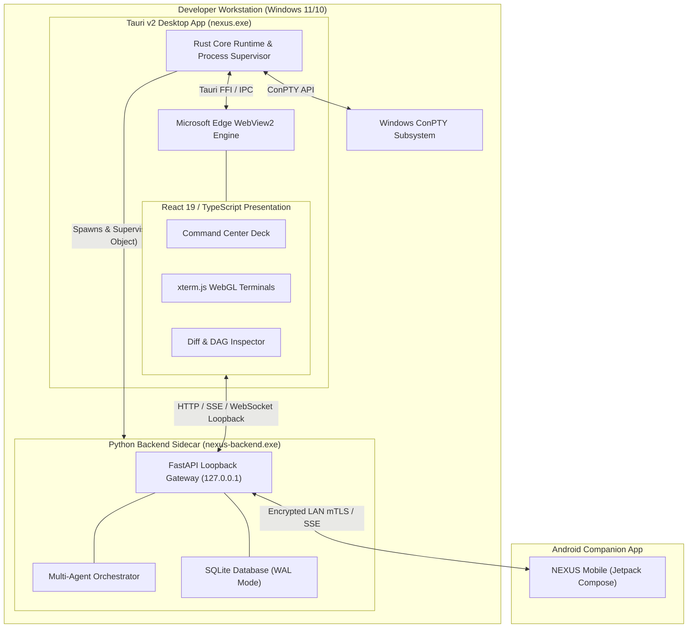

### 2. Desktop Process Lifecycle & Startup Sequence

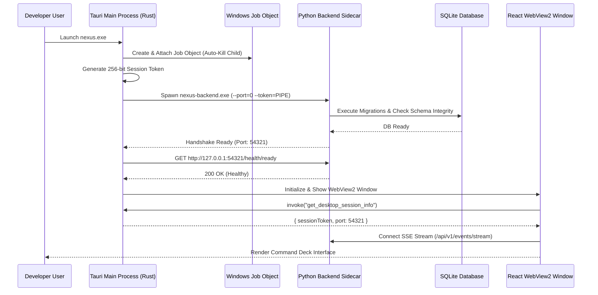

### 3. Sidecar Health Supervisor State Machine

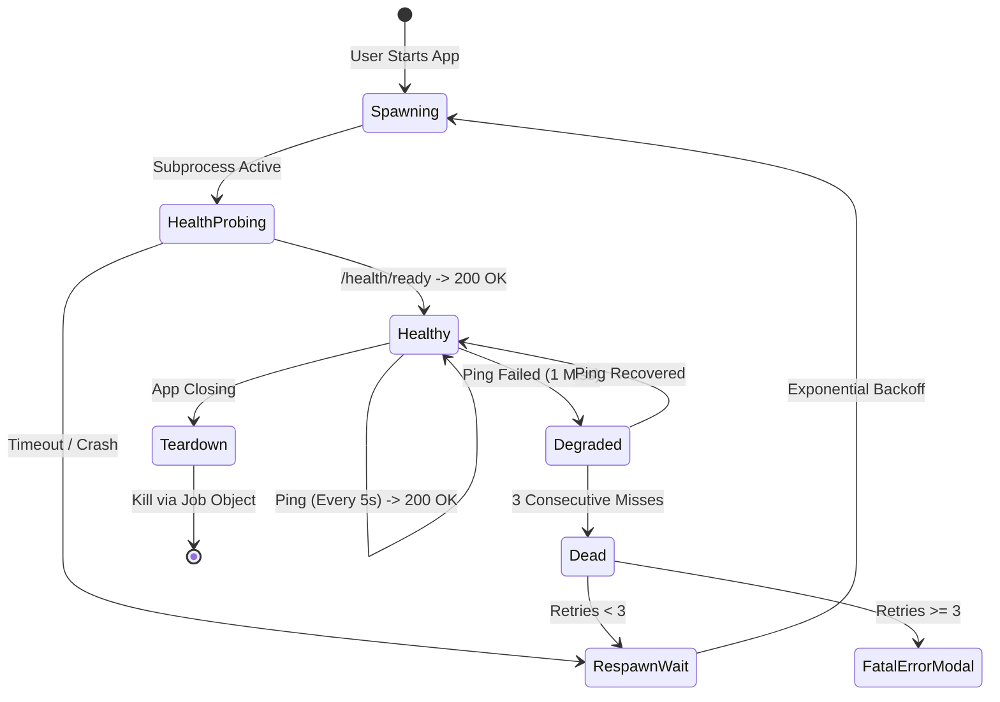

### 4. Local Gateway Security & Origin Filtering

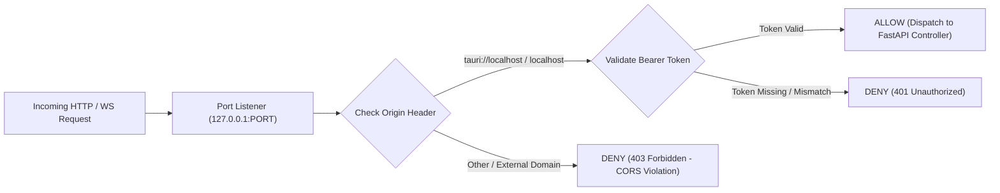

### 5. Terminal ConPTY Streaming Pipeline

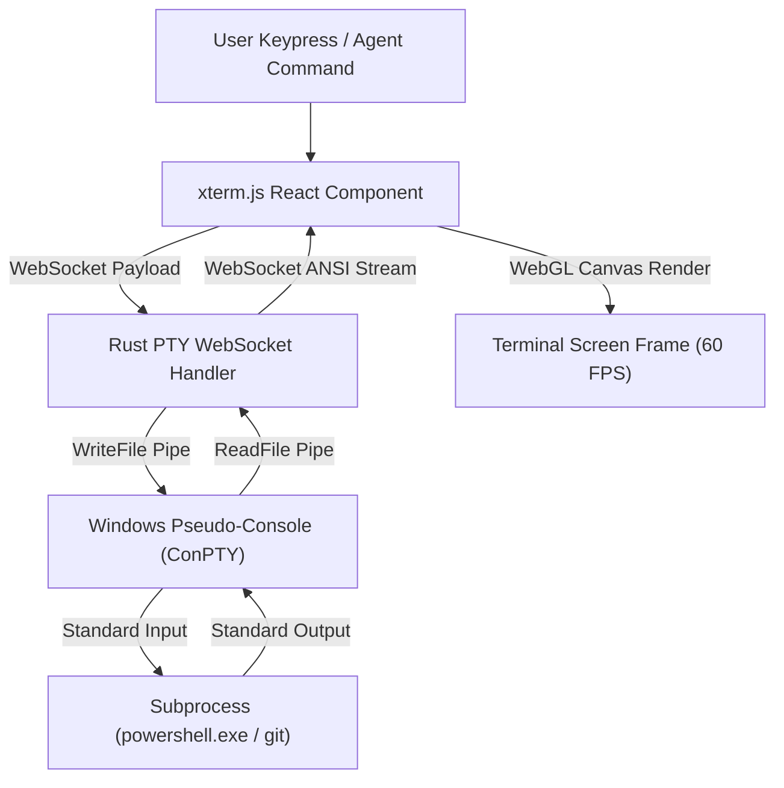

### 6. Mobile Companion LAN Pairing & Discovery

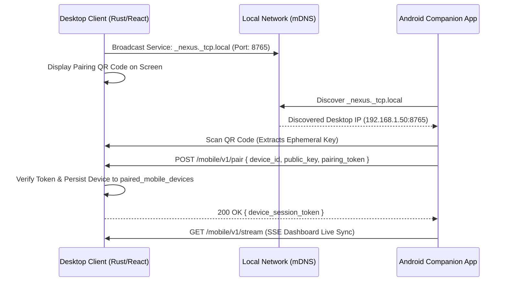

### 7. Real-Time Event Bus & UI Subscription Topology

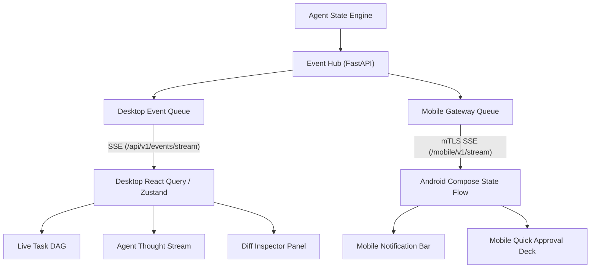

### 8. Multi-Window Layout Architecture

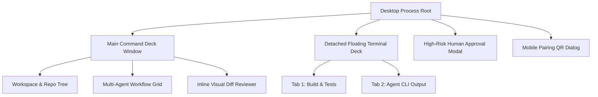

### 9. Native Windows Subsystem Integrations

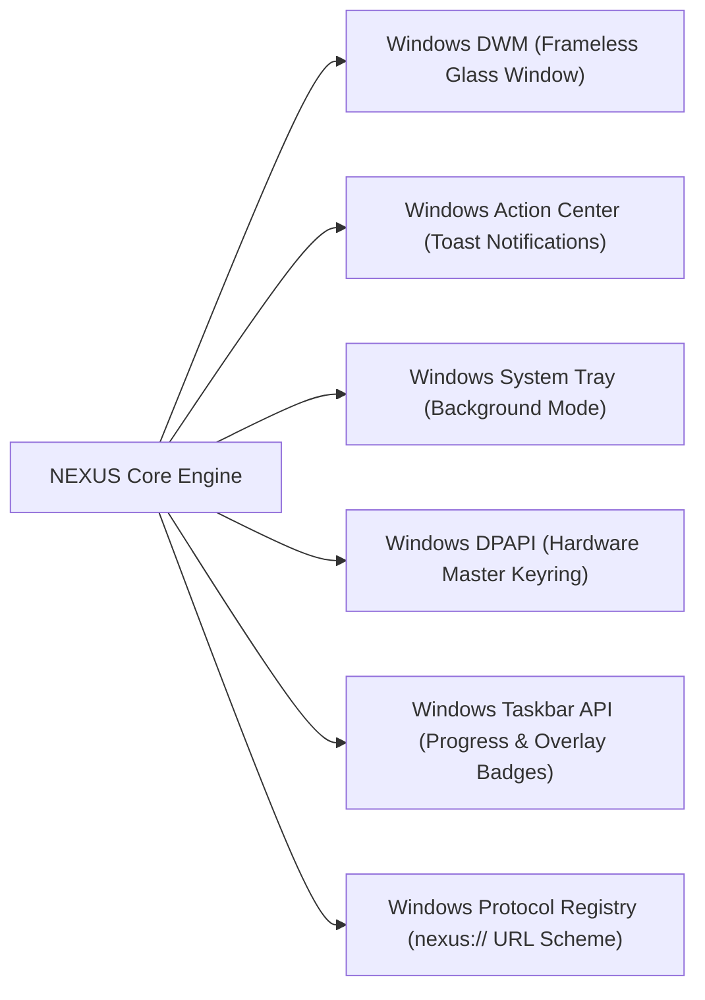

### 10. Offline-First Synchronization & Reconnection

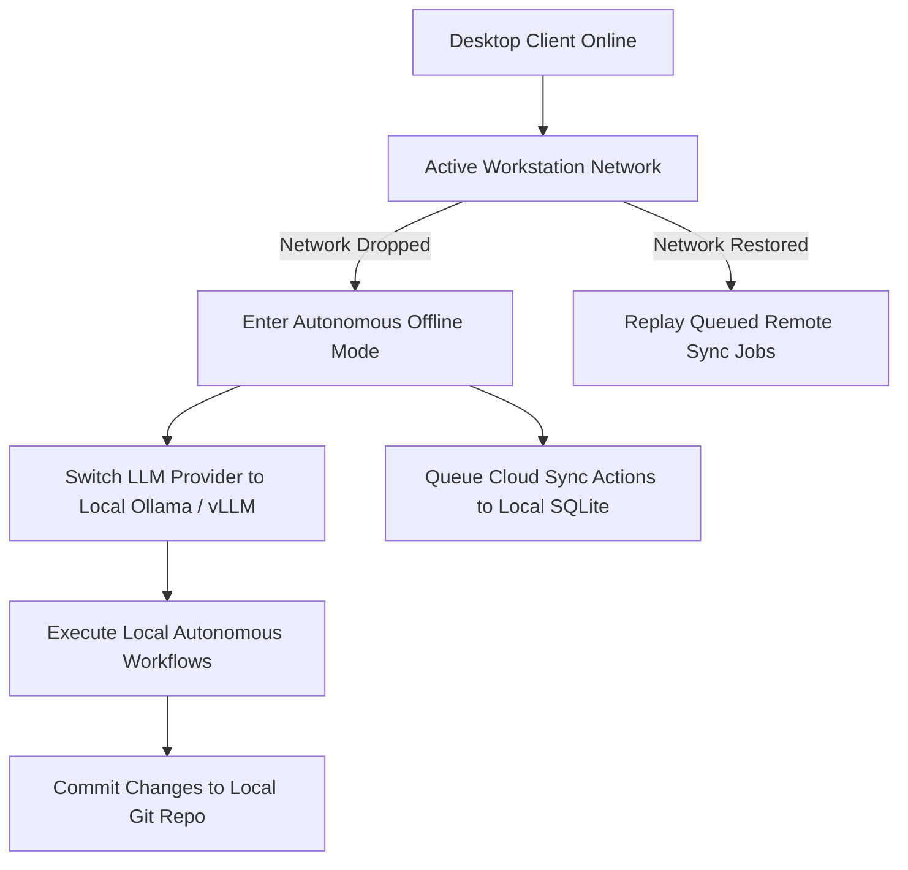

### 11. Auto-Updater Verification Pipeline

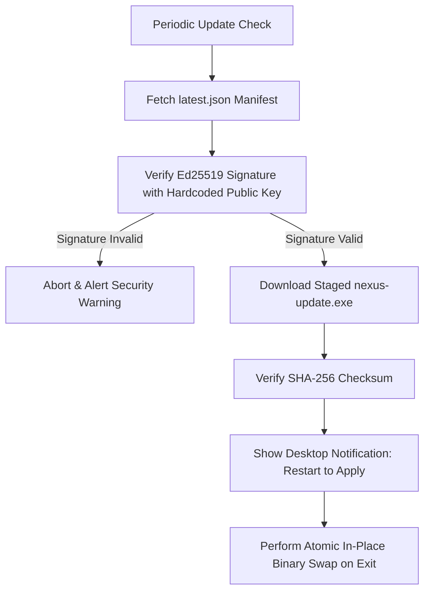

### 12. Complete Local Gateway & UI Architecture

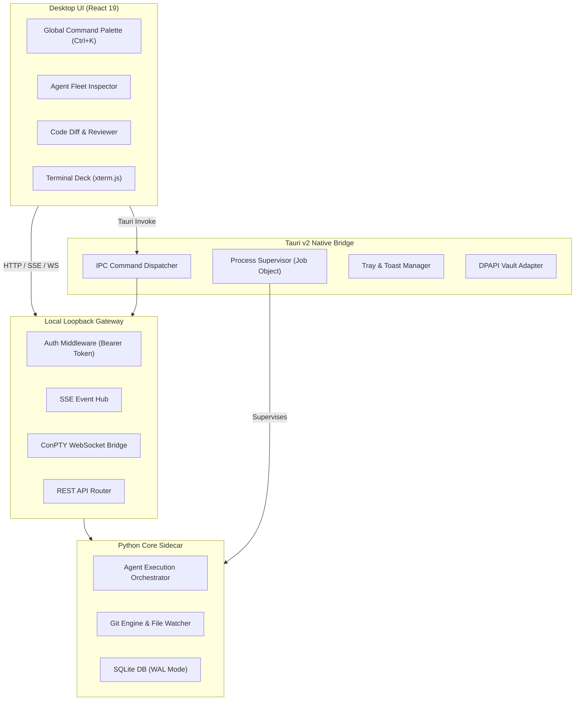

---

## 24. Phased Implementation Roadmap

```
Phase 1: Tauri v2 Shell & Windows Job Object Process Supervisor
  ├── Initialize Tauri v2 workspace with React 19 / Vite / Tailwind
  ├── Build Rust Job Object process containment wrapper
  └── Implement dynamic sidecar port negotiation & health probe

Phase 2: Local Gateway & Ephemeral Session Auth Perimeter
  ├── Implement Rust/Python session token generation & pipe injection
  ├── Build loopback CORS/Origin validation middleware
  └── Implement Rust IPC bridge for window controls and session info

Phase 3: Terminal ConPTY Subsystem & xterm.js WebGL Integration
  ├── Implement native Windows ConPTY spawning plugin in Rust
  ├── Connect xterm.js WebGL canvas terminal deck
  └── Implement bidirectional binary WebSocket streaming with flow control

Phase 4: Real-Time Event Bus & SSE UI Streaming Deck
  ├── Implement FastAPI SSE event broadcaster ring buffer
  ├── Build React `useAgentEventStream()` state hooks
  └── Connect live task DAG updates and agent thought stream panels

Phase 5: Windows Native Features (Tray, Toasts, DWM, Taskbar)
  ├── Implement custom DWM frameless window controls & aero glass effects
  ├── Integrate Windows Action Center interactive toast notifications
  ├── Implement System Tray background daemon mode & global hotkeys
  └── Connect Windows Taskbar progress indicators (`ITaskbarList3`)

Phase 6: Mobile LAN Gateway & Auto-Update Engine
  ├── Implement mDNS / Zeroconf service advertising in Rust
  ├── Build dynamic QR code pairing flow for Android companion
  └── Integrate Tauri Ed25519 signed auto-updater pipeline
```

---

## 25. Architectural Acceptance Criteria

- [x] Tauri v2 + React 19 + Python sidecar desktop architecture fully specified.
- [x] Windows Job Object process containment designed to guarantee zero orphaned Python sidecar processes.
- [x] Zero-trust local loopback gateway architecture with ephemeral 256-bit token authentication specified.
- [x] ConPTY and xterm.js WebGL terminal streaming subsystem designed for 60 FPS performance.
- [x] Local LAN mDNS discovery and secure QR code pairing flow designed for Android companion app.
- [x] Deep Windows OS integrations specified: DWM frameless glass, System Tray, Action Center toasts, Taskbar progress, and `nexus://` protocol scheme.
- [x] Local filesystem layout adhering strictly to `%APPDATA%` and `%LOCALAPPDATA%` standards.
- [x] Ed25519 cryptographically signed auto-updater workflow defined.
- [x] 12 comprehensive Mermaid architecture diagrams covering all desktop and gateway systems.
- [x] Complete TypeScript and Rust interface contracts defined.

---

## 26. Open Decisions & TBDs

- **TBD-01: Windows MSIX vs. NSIS Installer**: Evaluate packaging via MSIX for Windows Store distribution versus native NSIS installer for unconstrained enterprise installation.
- **TBD-02: GPU-Accelerated Diff Rendering**: Evaluate Skia/Canvas-based GPU visual diff rendering for massive 10,000+ line repository refactor commits.
- **TBD-03: WebRTC DataChannels for Mobile Sync**: Evaluate replacing LAN SSE with WebRTC DataChannels for sub-10ms peer-to-peer mobile streaming when UDP is unblocked on local Wi-Fi.

---

## 27. Final Architecture Summary

The **NEXUS Desktop Client & Local Gateway Architecture** establishes a rock-solid, native-performance Windows foundation for autonomous AI software engineering. By pairing:
- **Tauri v2 and Rust** for ultra-lightweight OS integration, process supervision, and ConPTY terminal streaming,
- **React 19 and Glassmorphic Cyber-Industrial UI** for an immersive developer command deck,
- **Hardened Loopback Gateway** with ephemeral session security and real-time SSE streaming, and
- **Zero-Configuration LAN Mobile Federation** for companion Android observability,

NEXUS delivers a world-class desktop experience that gives developers supreme control, visibility, and confidence over their autonomous AI workforce.

---

## 28. Next Recommended Architecture Document

With all core desktop, mobile, backend, security, task, workflow, config, and provider architecture documents complete, the next recommended step in the NEXUS master documentation blueprint is:

**`NEXUS_INTEGRATION_TESTING_AND_END_TO_END_VALIDATION_SUITE.md`**  
*(Focusing on automated cross-subsystem integration test scenarios, simulated agent multi-step coding suites, desktop-to-backend-to-mobile E2E testing matrices, and CI/CD validation pipelines).*
