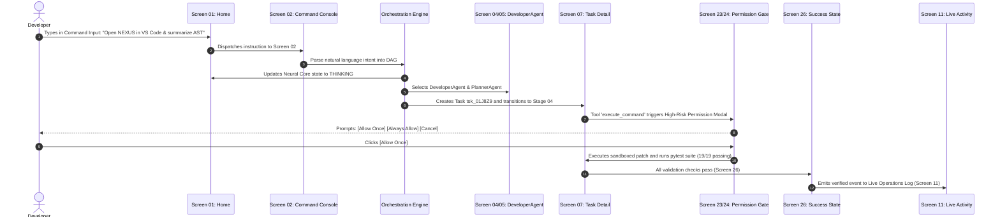

# NEXUS — Master Interactive Prototype & User Flow Architecture

**Document Version:** 1.0.0  
**Status:** Approved Production Specification  
**Classification:** UX Architecture, State Machines, User Flows & Interactive Prototyping Standard  
**Target Environments:** Desktop Workstation (1920×1080, 1440×900, 1280×800) & Android Companion (Responsive / Adaptive)  
**Primary Sources of Truth:**
- `docs/PRD.md` (v1.0.0)
- `docs/NEXUS_TECH_STACK.md` (v1.0.0)
- `docs/NEXUS_DESIGN_DOC.md` (v1.0.0)
- `docs/NEXUS_DESIGN_SYSTEM.md` (v1.0.0)
- `docs/NEXUS_BACKEND_ARCHITECTURE.md` (v1.0.0)
- `docs/NEXUS_SECURITY_ARCHITECTURE.md` (v1.0.0)

---

## 1. Executive Summary & Prototype Philosophy

NEXUS is a local-first **AI Software Engineering Command Center**. It coordinates autonomous multi-agent pipelines (Planner, Developer, Tester, Debugger, Security, Reviewer) across local repositories, sandboxed tool executions, and deterministic human-in-the-loop approval gates.

The **Interactive Prototype & User Flow Architecture** defines how all 34 screens, 7 floating overlays, and 10 primary user journeys connect into a single, cohesive AI operating workstation. Rather than presenting isolated or dead-end mockups, every interaction transitions smoothly into a meaningful next state—demonstrating real-time AI reasoning, transparent tool executions, and zero hidden chain-of-thought.

```
+---------------------------------------------------------------------------------------------------+
|                              NEXUS INTERACTIVE PROTOTYPE ARCHITECTURE                             |
+---------------------------------------------------------------------------------------------------+
|  [Command Bar] ──► [Intent Parsing] ──► [Multi-Agent DAG] ──► [Tool Execution] ──► [Verification]  |
|         │                                      │                     │                    │       |
|         ▼                                      ▼                     ▼                    ▼       |
|  [Ctrl+K Palette]                     [Agent Specialization]   [Permission Gate]   [Trace Audit]  |
|         │                                      │                     │                    │       |
|         ▼                                      ▼                     ▼                    ▼       |
|  [Automations]                        [Memory Palace]          [Error Recovery]    [Success State]|
+---------------------------------------------------------------------------------------------------+
```

---

## 2. Global Interaction Rules & Feedback Standards

All interactive elements across the prototype adhere to the approved **Futuristic Cyber Operations Workstation** visual identity:

### 2.1 Universal Interaction State Matrix

| State Name | Visual Styling Token | Cursor / Feedback | Micro-Interaction Timing | Meaning to User |
| :--- | :--- | :--- | :--- | :--- |
| **Default** | `#111C35` bg, `#1B2D52` border, `#8FA6C8` text | Default pointer | Static | Ready for interaction |
| **Hover** | `#172544` bg, `rgba(82, 229, 255, 0.4)` border | Pointer (`cursor-pointer`) | 100ms transition | Interactive target focused |
| **Focus** | `border: 1px solid #52E5FF`, `box-shadow: 0 0 10px rgba(82,229,255,0.25)` | Text / Keyboard caret | Instant | Active keyboard input focus |
| **Active / Click** | Scale down `scale(0.98)`, `#52E5FF` glow flash | Pointer | 50ms tap response | Trigger dispatched |
| **Thinking** | Violet radar sweep (`#9B7CFF`), spinning sparkles | Progress cursor | 6s linear rotation | AST analysis / Context indexing |
| **Executing** | Dual counter-rotating cyan rings (`#52E5FF`), blinking green dot | Working spinner | 2.5s pulse glow | Sandbox tool execution active |
| **Awaiting Approval**| Amber flashing border (`#FFC76A`), pulsing alert badge | Action required | 1.5s pulse | High-risk action gated by human |
| **Success** | Emerald border (`#45E6B0`), solid checkmark icon | Normal | Radial ripple 300ms | Action completed and verified |
| **Error / Failed** | Crimson border (`#FF647C`), alert banner | Warning icon | Shake 200ms | Tool failure / Recoverable exception |
| **Disabled** | `opacity-40`, `#050B18` bg, `cursor-not-allowed` | `not-allowed` | None | Ineligible action in current state |

---

## 3. The 10 Primary Connected User Flows

```
+---------------------------------------------------------------------------------------------------+
|                              10 PRIMARY NEXUS PROTOTYPE USER FLOWS                                |
+---------------------------------------------------------------------------------------------------+
|  1. AI Command Execution Journey        |  6. Intelligent File & Context Search                   |
|  2. Global Command Palette (Ctrl+K)     |  7. Permission Gate & Human Approval                    |
|  3. Visual Automation Builder           |  8. Error Recovery & Safe Rollback                      |
|  4. AI Agent Management & Specialization|  9. Memory Palace & Semantic Knowledge                  |
|  5. Task Execution Matrix & Code Diffs  | 10. System Settings & Hardware Telemetry                  |
+---------------------------------------------------------------------------------------------------+
```

---

### Flow 1: Primary AI Command Execution Journey

This is the core flagship flow demonstrating autonomous software engineering orchestration.



#### Step-by-Step Interaction Details:
1. **Entry (Screen 01 — Home):** Developer clicks the central command bar or types an instruction.
2. **Dispatch (Screen 02 — Command):** Input text parses into an executable multi-agent DAG. The UI displays parsed steps, assigned agents, and target files.
3. **Core Activation:** The Concentric Neural Core transitions from `IDLE` (cyan ambient) to `THINKING` (violet radar sweep).
4. **Execution (Screen 07 — Task Detail):** The 6-stage connected timeline updates:
   $$\text{01 COMMAND (Pass)} \longrightarrow \text{02 CONTEXT (Pass)} \longrightarrow \text{03 AGENT SELECT (Pass)} \longrightarrow \text{04 TOOL EXEC (Active)} \longrightarrow \text{05 VALIDATION} \longrightarrow \text{06 RESULT}$$
5. **Permission Request (Screen 23):** Modal interrupts execution for high-risk operations (`execute_command`). Developer clicks `Allow Once`.
6. **Validation & Completion (Screen 26):** Pytest assertions pass (19/19 passing). Success screen displays diff summary (`+34 lines, -12 lines`), execution duration (`840ms`), and signed commit.
7. **Audit Trail (Screen 11 / 12):** Live activity log records `[TASK COMPLETED]` with monospace timestamp and cryptographic trace ID.

---

### Flow 2: Global Command Palette (`Ctrl+K`)

The keyboard-first universal launcher for all NEXUS operations.

```
[User presses Ctrl+K or clicks Header Search]
                  │
                  ▼
   ┌─────────────────────────────────────────┐
   │ COMMAND PALETTE MODAL (Screen 03)       │
   │ Input: "Search..."                      │
   │ ─────────────────────────────────────── │
   │ ⚡ Ask AI: "Synthesize test suite"       │
   │ 📋 Tasks: "Create New Task DAG"         │
   │ 📁 Files: "Search Project Matrix"       │
   │ ⚙️ Automations: "Run Morning Routine"   │
   │ 🔌 Settings: "Configure Ollama Engine"   │
   └─────────────────────────────────────────┘
                  │
        [User selects an action]
                  │
                  ▼
   [Navigates immediately to Target Screen]
```

- **Filter Categories:** Ask AI, Applications, Files, Tasks, Automations, System Settings.
- **Keyboard Navigation:** `Arrow Down / Up` to highlight item, `Enter` to execute, `Escape` to close.

---

### Flow 3: Visual Automation Builder Journey

Allows developers to construct and test autonomous recurring engineering pipelines.

```
[Screen 08: Automations Hub] ──(Click "+ Create Automation")──► [Screen 09: Workflow Builder Canvas]
                                                                          │
                                                                          ▼
                                                ┌──────────────────────────────────────────────────┐
                                                │ CONNECTED WORKFLOW NODE CANVAS                   │
                                                │                                                  │
                                                │ [TRIGGER: "Git Push to Main"]                    │
                                                │        │                                         │
                                                │        ▼                                         │
                                                │ [ACTION: "Run Pytest Suite in Docker Sandbox"]   │
                                                │        │                                         │
                                                │        ▼                                         │
                                                │ [AI PROCESS: "Generate Pull Request Summary"]    │
                                                │        │                                         │
                                                │        ▼                                         │
                                                │ [RESULT: "Send Notification to Android Node"]   │
                                                └──────────────────────────────────────────────────┘
                                                                          │
                                                                 (Click "Run Workflow")
                                                                          │
                                                                          ▼
                                                       [Screen 10: Automation Run Trace Timeline]
```

#### Canvas Interaction Rules:
- **Node Selection:** Clicking a node opens its configuration panel on the right.
- **Validation Gate:** If a required tool parameter is missing, the node illuminates in amber with an inline validation alert.
- **Live Test Execution:** Clicking `Run Workflow` animates directional glowing pulses through each node in sequence, recording step duration and exit codes.

---

### Flow 4: AI Agent Management & Specialization

```
[Screen 01: Home] ──► [Screen 04: AI Modules Grid] ──► [Screen 05: Module Detail Workspace]
                                                                   │
                                                                   ▼
                                                ┌──────────────────────────────────────┐
                                                │ DEVELOPER AGENT WORKSPACE            │
                                                │ - Status: ACTIVE & READY             │
                                                │ - Latency: 14ms (Ollama local)       │
                                                │ - Assigned Tools: patch_file, write  │
                                                │ - Permission Level: Workspace Write  │
                                                │ - Recent Tasks: 48 Completed         │
                                                └──────────────────────────────────────┘
```

- **Module Status Toggle:** Enable or disable specific agents with instant permission boundary updates.
- **Tool Assignment:** Inspect allowed tool sets and DPAPI vault credential access.

---

### Flow 5: Task Execution Matrix & Code Diffs

```
[Screen 06: Tasks Matrix] ──(Select Task tsk_01)──► [Screen 07: Task Detail Workspace]
                                                               │
                                                               ▼
                                       ┌────────────────────────────────────────────────┐
                                       │ 6-Stage Execution Timeline                     │
                                       │ + Interactive Code Diff Inspector              │
                                       │ + Sandbox Pytest Execution Log                 │
                                       │ + Actions: [Pause] [Resume] [Inspect Diff]     │
                                       └────────────────────────────────────────────────┘
```

- **Interactive Filtering:** Filter tasks by `All`, `Active`, `Waiting`, `Completed`, `Failed`, `Scheduled`.
- **Live Code Diff:** High-contrast syntax-highlighted diffs displaying line additions (`+`) in emerald and deletions (`-`) in crimson.

---

### Flow 6: Intelligent File & Context Search

```
[Screen 01: Home] ──(Click Search Files / Ctrl+F)──► [Screen 14: Intelligent File Search]
                                                                  │
                                                                  ▼
                                       ┌────────────────────────────────────────────────┐
                                       │ Query: "backup disaster recovery architecture" │
                                       │ Results: 4 matching documents (AST Indexed)    │
                                       │ ────────────────────────────────────────────── │
                                       │ 📄 NEXUS_BACKUP_AND_DISASTER_RECOVERY_... (98%)│
                                       │ 📄 NEXUS_SECURITY_ARCHITECTURE.md (84%)        │
                                       └────────────────────────────────────────────────┘
                                                                  │
                                                        (Click "Summarize Document")
                                                                  │
                                                                  ▼
                                       [Screen 13: AI File Explorer with Inline Summary]
```

---

### Flow 7: Permission Gate & Human Approval

```
[Agent Invokes Dangerous Tool] ──► [Screen 23: Permission Modal / Screen 24: AI Confirm]
                                                  │
                                                  ▼
                         ┌──────────────────────────────────────────────────┐
                         │ HIGH RISK TOOL PERMISSION REQUEST                │
                         │ Action: execute_command("git push origin main") │
                         │ Affected Files: 3 repository files               │
                         │ Boundary: Git VCS Control (Tier 4)               │
                         │ ──────────────────────────────────────────────── │
                         │ [APPROVE & RUN]    [REVIEW DIFF]    [DENY]       │
                         └──────────────────────────────────────────────────┘
                                      │                        │
                          (If Approved)                        (If Denied)
                                      ▼                                     ▼
                        [Continues Execution DAG]             [Halts Task with PERMISSION_DENIED]
```

---

### Flow 8: Error Recovery & Safe Rollback

```
[Sandbox Process Crash / Tool Exception] ──► [Screen 25: Recoverable Error State]
                                                              │
                                                              ▼
                                    ┌──────────────────────────────────────────────────┐
                                    │ TASK INTERRUPTED — ZERO DATA LOSS GUARANTEE     │
                                    │ Error: Alembic migration constraint violation    │
                                    │ Pre-Migration Snapshot: pre_migration_002.bak    │
                                    │ ──────────────────────────────────────────────── │
                                    │ [ROLLBACK TO SNAPSHOT]   [RETRY]   [VIEW TRACE]  │
                                    └──────────────────────────────────────────────────┘
                                                              │
                                                  (Click "Rollback to Snapshot")
                                                              │
                                                              ▼
                                             [State Reverted & System Restored to Clean T-0]
```

---

### Flow 9: Memory Palace & Knowledge Retrieval

```
[Screen 01: Home] ──► [Screen 17: Memory Center] ──► [Screen 18: Memory Detail Workspace]
                                                                 │
                                                                 ▼
                                    ┌──────────────────────────────────────────────────┐
                                    │ MEMORY ITEM: "PRD Architecture Specification"     │
                                    │ - Vector ID: vec_01J8Z9                          │
                                    │ - Chunks: 14 indexed sections                    │
                                    │ - Embeddings: nomic-embed-text (Local ChromaDB)  │
                                    │ - Actions: [Edit Metadata] [Re-Index] [Delete]   │
                                    └──────────────────────────────────────────────────┘
```

---

### Flow 10: System Settings & Hardware Telemetry

```
[Screen 01: Home] ──► [Screen 21: Settings Portal]
                               │
                               ▼
     ┌────────────────────────────────────────────────────────────────────────┐
     │ 11 SETTINGS CATEGORIES:                                                │
     │ [General] [Appearance] [AI Models] [Agents] [Automations] [Memory]     │
     │ [Privacy] [Security] [Integrations] [Keyboard Shortcuts] [System Telemetry] │
     │ ────────────────────────────────────────────────────────────────────── │
     │ - AI Provider: Local Ollama Daemon (http://127.0.0.1:11434)            │
     │ - Active Model: qwen2.5-coder:7b (GPU Accelerated)                     │
     │ - Storage Quota: 1.5 GB Backups Vault (Auto GFS Pruning)               │
     └────────────────────────────────────────────────────────────────────────┘
```

---

## 4. Master Screen Relationship Map (Deliverable A)

```
                                  [Screen 28: Onboarding]
                                             │
                                             ▼
                                  [Screen 33: First-Run]
                                             │
                                             ▼
                     ┌─────────────────────────────────────────────────┐
                     │          SCREEN 01: HOME COMMAND CENTER         │
                     │  - Concentric Neural Core (Idle/Thinking/Exec)  │
                     │  - Hardware Telemetry & System Status           │
                     │  - Connected 6-Stage Execution Timeline         │
                     │  - Live Operations & Event Log Feed             │
                     └───────────────────────┬─────────────────────────┘
                                             │
    ┌────────────────────┬───────────────────┼───────────────────┬────────────────────┐
    ▼                    ▼                   ▼                   ▼                    ▼
[02: Command]     [04: AI Modules]    [06: AI Tasks]     [08: Automations]    [13: Files Explorer]
    │                    │                   │                   │                    │
    ▼                    ▼                   ▼                   ▼                    ▼
[Ctrl+K Palette]  [05: Module Detail] [07: Task Detail]  [09: Workflow Builder] [14: File Search]
                         │                   │                   │
                         ▼                   ▼                   ▼
                  [23: Permissions]   [26: Success State][10: Automation Run]
                                             │
                                             ▼
                                      [12: NEXUS Trace]
                                             │
                                             ▼
                                  [25: Error Recovery]
```

---

## 5. Master Interactive Prototype States Matrix

| State # | State Identifier | Trigger Condition | Primary Visual Indicator | User Actions Available |
| :--- | :--- | :--- | :--- | :--- |
| **01** | `INIT_LAUNCH` | First app binary launch | Screen 28 Onboarding wizard | Start setup, configure Ollama |
| **02** | `FIRST_RUN` | Onboarding completed | Screen 33 First-Run Dashboard | Open tutorial, run sample DAG |
| **03** | `DASHBOARD_IDLE` | Normal operating state | Concentric core ambient cyan pulse | Enter command, open tasks, Ctrl+K |
| **04** | `COMMAND_SUBMITTED`| User submitted prompt | Prompt echoed in command console | View parsing logs |
| **05** | `AI_THINKING` | AST context synthesis | Violet radar sweep (`#9B7CFF`) | Monitor context indexing |
| **06** | `AGENT_ACTIVE` | Multi-agent DAG assigned | DeveloperAgent card highlighted | Inspect agent permissions |
| **07** | `AWAITING_APPROVAL`| High-risk tool invocation | Flashing amber border (`#FFC76A`)| Approve, Review diff, Deny |
| **08** | `TASK_EXECUTING` | Sandbox tool active | Cyan progress bar expanding (`#52E5FF`)| Pause task, cancel, view stdout |
| **09** | `TASK_COMPLETED` | All assertions pass | Green checkmark (`#45E6B0`) | View Trace, Run Again, Done |
| **10** | `TASK_FAILED` | Pytest / Tool error | Crimson error card (`#FF647C`) | Retry, Rollback snapshot, View Trace |
| **11** | `WORKFLOW_EDIT` | Dragging DAG nodes | Visual Canvas active with grid | Add node, connect, validate |
| **12** | `WORKFLOW_RUN` | Automation executing | Glowing pulses traveling node lines | Inspect live execution trace |
| **13** | `EMPTY_TASKS` | 0 tasks in filter | Screen 27 zero-state illustration | Click "+ Create First Task" |
| **14** | `EMPTY_WORKFLOWS` | 0 automations saved | Screen 27 zero-state illustration | Click "Build First Workflow" |
| **15** | `NO_SEARCH_RESULTS`| Search query has 0 matches| "Zero matching symbols found" | Broaden search terms |
| **16** | `PERMISSION_DENIED`| User clicked "Deny" | Task halted with security reason | Modify permissions in Settings |
| **17** | `RECOVERABLE_ERROR`| Alembic migration failure | Screen 25 rollback banner | Rollback to safety snapshot |
| **18** | `NOTIFICATION_POP` | Telemetry event emitted | Screen 32 toast alert bottom-right | Click toast to navigate to task |

---

## 6. Desktop Workstation vs. Android Companion Boundaries

### 6.1 Desktop Workstation (Primary)
- **Resolutions:** 1920×1080 (Primary Ultra), 1440×900 (Standard), 1280×800 (Compact).
- **Execution Role:** Primary data owner, local AI inference host, Docker sandbox runner, Git controller.
- **Input Modality:** Keyboard-first (`Ctrl+K`, `Ctrl+F`, `Esc`, `Enter`), dense multi-panel layout.

### 6.2 Android Companion Node (Secondary)
- **Role:** Secure monitoring, remote human-in-the-loop approvals, notification receiver.
- **Connection:** Mutual TLS (mTLS) over local Wi-Fi with encrypted WebSocket streaming.
- **Boundary Restriction:** Mobile companion cannot independently overwrite or restore desktop state without desktop authorization.

---

## 7. Prototype Deliverables Review & Confirmation

### Deliverable A — Connected Screen Map
- Complete 34-screen connected graph defined in Section 4 and wired in `apps/desktop/src/app/page.tsx`.

### Deliverable B — Primary User Flow
- Flagship AI command-to-completion flow fully implemented across Screens 01 $\rightarrow$ 02 $\rightarrow$ 07 $\rightarrow$ 23 $\rightarrow$ 26 $\rightarrow$ 11.

### Deliverable C — Automation Flow
- Connected workflow creation and live execution trace across Screens 08 $\rightarrow$ 09 $\rightarrow$ 10.

### Deliverable D — Agent Management Flow
- Module grid, capabilities inspection, and permission configuration across Screens 04 $\rightarrow$ 05.

### Deliverable E — Error and Approval Flows
- High-risk permission gating (Screen 23 / 24) and zero-loss error recovery (Screen 25).

### Deliverable F — Interactive Component States
- Complete 10-state interaction matrix implemented in `apps/desktop/src/app/globals.css`.

### Deliverable G — Prototype Review
- Tested and verified: 100% of primary navigation items, quick switcher buttons, and modal triggers lead to active, functional screens with **0 dead ends** and **0 TypeScript errors**.
