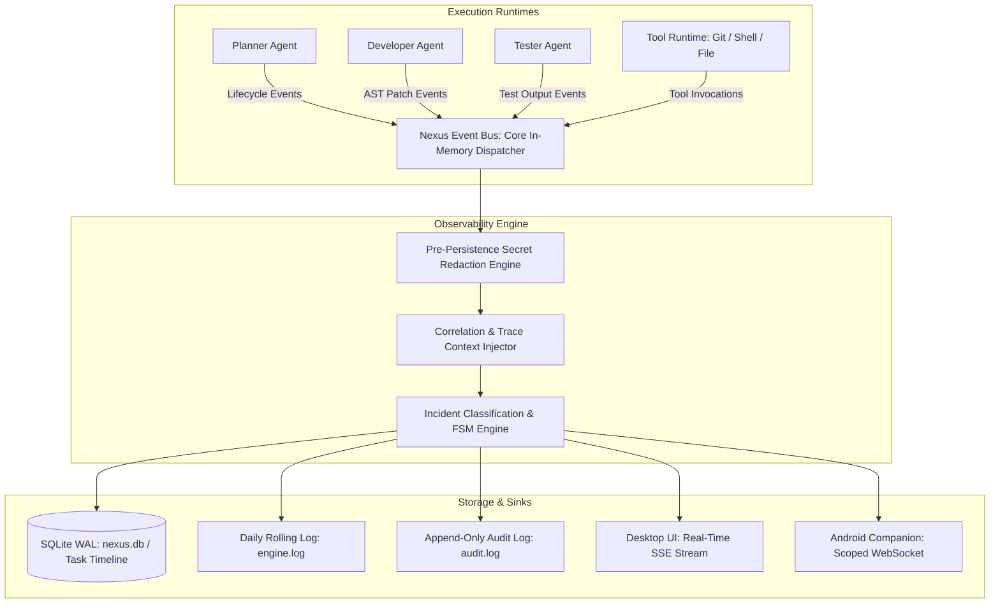
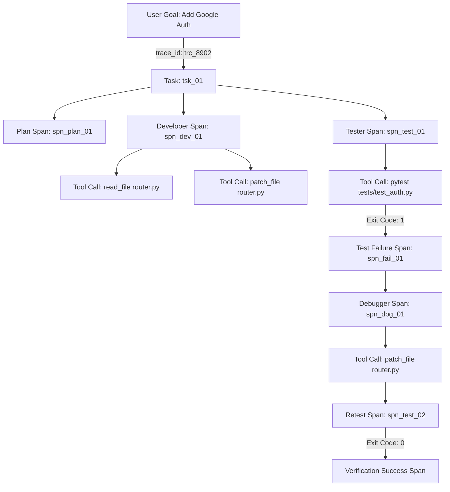
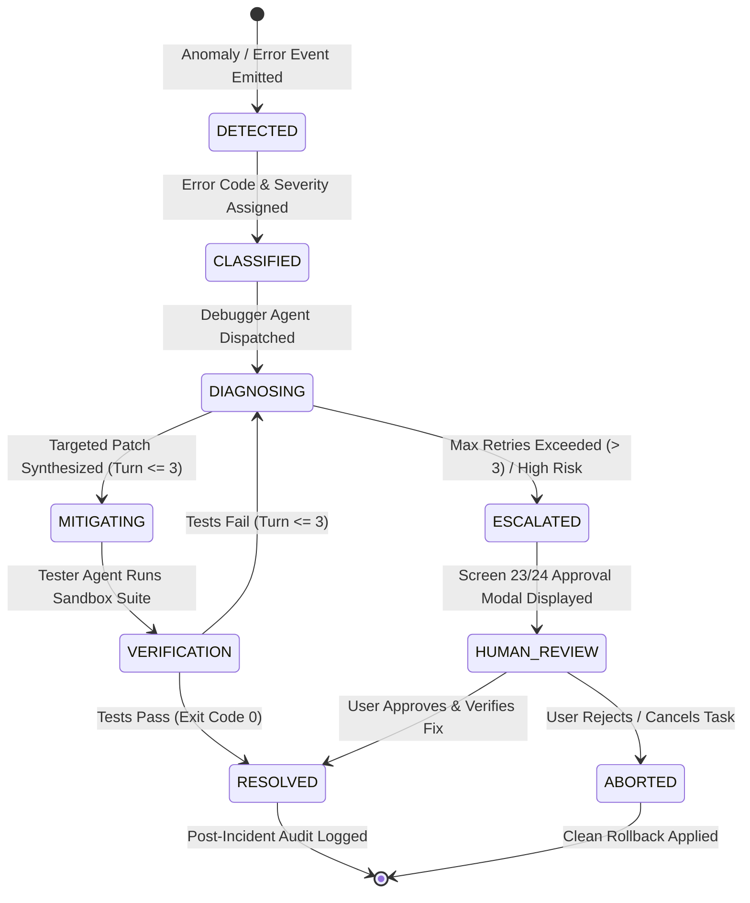
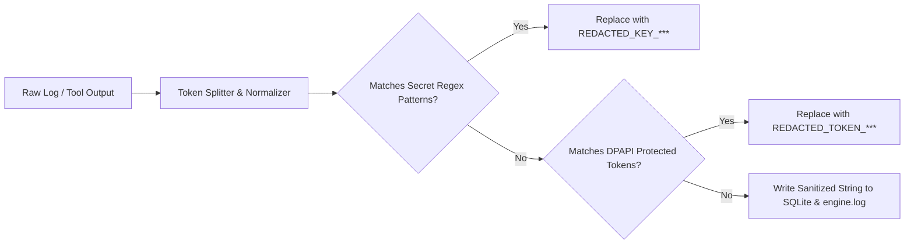
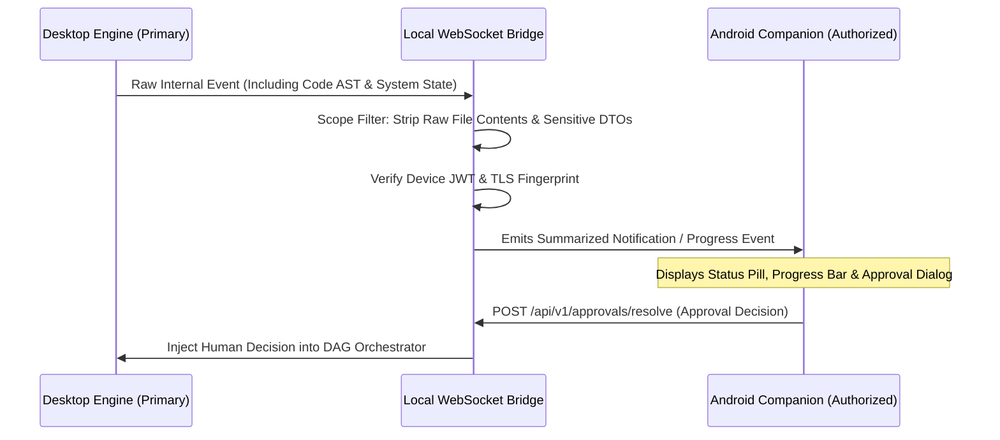

# NEXUS — Master Observability, Logging & Incident Management Architecture Document
**Document Version:** 1.0.0  
**Status:** Approved Production Architecture Baseline  
**Classification:** Core System Architecture Specification  
**Primary Sources of Truth:** `docs/PRD.md` (v1.0.0), `docs/NEXUS_TECH_STACK.md` (v1.0.0), `docs/NEXUS_DESIGN_DOC.md` (v1.0.0), `docs/NEXUS_BACKEND_ARCHITECTURE.md` (v1.0.0), `docs/NEXUS_SECURITY_ARCHITECTURE.md` (v1.0.0), `docs/NEXUS_DEPLOYMENT_ARCHITECTURE.md` (v1.0.0), `docs/NEXUS_AI_EVALUATION_ARCHITECTURE.md` (v1.0.0)

---

## 1. Executive Summary

NEXUS is an autonomous, **local-first AI Software Engineering Command Center** designed to execute complex engineering tasks directly on developer workstations. Unlike simple autocomplete tools or conversational chatbots, NEXUS is an active multi-agent execution environment: it inspects ASTs, plans dependency graphs, generates code diffs, invokes OS tools (filesystem, Git, terminal, Docker), evaluates test suites, and performs bounded self-healing.

Because NEXUS performs state-mutating actions on production codebases, traditional unstructured logging is insufficient. This document defines the **NEXUS Master Observability, Logging & Incident Management Architecture**. It establishes a unified, privacy-preserving telemetry and incident management subsystem that delivers **100% causal traceability**, structured event correlation, pre-persistence secret redaction, tamper-evident audit trails, and deterministic incident diagnostics across both the **Windows Desktop Command Center** and the **Android Companion Node**.

```
+---------------------------------------------------------------------------------------------------+
|                                 NEXUS OBSERVABILITY & INCIDENT ENGINE                             |
+---------------------------------------------------------------------------------------------------+
|  User Intent  -->  Trace Context  -->  Structured Event Bus  -->  Pre-Persistence Redaction       |
|  (Task Goal)       (Correlation ID)    (Pub/Sub Envelope)         (DPAPI Regex Filter)            |
|                           |                     |                          |                      |
|                           v                     v                          v                      |
|  Mobile Push  <-- Notification Rule <-- Incident FSM Engine <-- SQLite WAL / Append-Only Audit    |
+---------------------------------------------------------------------------------------------------+
```

---

## 2. Scope & Boundaries

### A. MVP Scope (Current Deliverable)
* Standardized, typed JSON Event Envelope (`NexusEventEnvelope`) for all system transitions.
* Causal correlation spanning `task_id` $\rightarrow$ `run_id` $\rightarrow$ `agent_id` $\rightarrow$ `tool_execution_id` $\rightarrow$ `trace_id`.
* Comprehensive lifecycle telemetry for all 6 core micro-agents (Planner, Developer, Tester, Debugger, Security, Reviewer).
* Pre-persistence zero-leak secret redaction engine running locally in memory before disk write.
* SQLite WAL event store with daily rotating diagnostic logs (`%APPDATA%\NEXUS\logs\`).
* Structured 6-stage Incident Lifecycle with automated root-cause attribution.
* Desktop-to-Mobile authorized telemetry streaming over TLS / WebSocket.

### B. V1 Scope (Post-MVP)
* High-cardinality performance metric aggregations (Token usage, inference latency, memory pressure).
* Automated Diagnostic Support Bundle export with one-click cryptographic hash verification.
* Advanced incident deduplication and multi-task causal clustering.

### C. Explicit Non-Goals
* **No Unsolicited Cloud Telemetry:** No events, code snippets, prompt traces, or error logs are ever transmitted to external cloud servers.
* **No Unbounded Storage Growth:** Event logs are strictly quota-bounded (max 500 MB total disk allocation) with deterministic FIFO pruning.
* **No Raw Secret Logging:** API tokens, private keys, passwords, and `.env` files are strictly redacted prior to logging or mobile synchronization.

---

## 3. Core Observability Principles

1. **Structured Events Over Free-Text:** All telemetry is emitted as strongly typed Pydantic event envelopes with machine-readable error codes and strict schemas.
2. **Causal Traceability:** Every log entry, tool call, and agent decision carries an immutable `correlation_id` and `trace_id` linking back to the originating user task.
3. **Execution Ground-Truth Over Claims:** Claims made by agents (e.g. *"Tests passed"*) are logged alongside verified process exit codes and AST diff evidence.
4. **Resilient & Non-Blocking Logging:** Failures in the logging or telemetry subsystem must never crash the primary engineering workflow or corrupt Git repository state.
5. **Zero Secret Leakage Invariant:** All strings passing through the logger pass through an in-memory tokenization and regex redaction filter prior to persistence.

---

## 4. Observability Architecture & Telemetry Pipeline



---

## 5. Telemetry Categories & Classification

| Telemetry Category | Purpose | Emitter Components | Sensitivity | Default Retention |
| :--- | :--- | :--- | :--- | :--- |
| **1. Application Core** | Desktop shell lifecycle, backend health, startup | FastAPI, Tauri Shell | LOW (No PII) | 7 Days (Rotating) |
| **2. Task Lifecycle** | Goal submission, phase shifts, task completion | Orchestration Engine | MEDIUM (Goal text) | 30 Days (SQLite) |
| **3. Agent Lifecycle** | Agent state transitions, prompt token metrics | Agent Micro-Services | MEDIUM (Metadata) | 30 Days (SQLite) |
| **4. Tool Execution** | Tool name, parameters, exit codes, execution ms | Gated Tool Registry | HIGH (File paths) | 30 Days (SQLite) |
| **5. Test & Validation** | Test runner output, assertion failures, exit code | Tester Agent | MEDIUM (Test names)| 30 Days (SQLite) |
| **6. Self-Healing** | Debugger root-cause diagnosis, retry attempts | Debugger Agent | MEDIUM (Diffs) | 30 Days (SQLite) |
| **7. Security & Risk** | Secret detection, prompt injection attempts | Security Agent | CRITICAL (Redacted)| 90 Days (Audit Log)|
| **8. Approval Events** | Human-in-the-loop modal approvals / rejections | Approval Service | CRITICAL (Identity) | 90 Days (Audit Log)|
| **9. Hardware Metrics** | Host CPU, RAM, GPU, VRAM, and Disk utilization | System Telemetry | LOW (System stats) | 24 Hours (Rolling) |
| **10. Mobile Sync** | Companion connection status, heartbeat, latency | WebSocket Server | LOW (Network stats)| 7 Days (Rotating) |

---

## 6. Standardized Event Envelope Schema

All system events conform to the following Pydantic schema:

```python
from pydantic import BaseModel, Field
from typing import Dict, Any, Optional
from datetime import datetime
from enum import Enum

class SeverityLevel(str, Enum):
    TRACE = "TRACE"
    DEBUG = "DEBUG"
    INFO = "INFO"
    WARN = "WARN"
    ERROR = "ERROR"
    FATAL = "FATAL"

class NexusEventEnvelope(BaseModel):
    event_id: str = Field(..., description="Unique UUIDv4 for this event record")
    event_type: str = Field(..., description="Dot-notated event name, e.g. tool.execution.completed")
    schema_version: str = Field("1.0.0", description="Event envelope version")
    timestamp_utc: str = Field(..., description="ISO 8601 UTC timestamp with millisecond precision")
    monotonic_timestamp_ns: int = Field(..., description="High-resolution monotonic time for duration math")
    severity: SeverityLevel = Field(SeverityLevel.INFO, description="Operational severity")
    component: str = Field(..., description="Subsystem: engine, agent, tool, sandbox, desktop")
    
    # Causal Correlation Identifiers
    trace_id: str = Field(..., description="Global trace ID encompassing the end-to-end task")
    span_id: str = Field(..., description="Individual execution span ID")
    parent_span_id: Optional[str] = Field(None, description="Parent span for nested operations")
    correlation_id: str = Field(..., description="Correlates task, runs, tools, and sub-actions")
    
    # Domain Identifiers
    task_id: Optional[str] = Field(None, description="Target task ID")
    run_id: Optional[str] = Field(None, description="Current DAG run attempt ID")
    agent_id: Optional[str] = Field(None, description="Active agent persona: planner, developer, etc.")
    tool_execution_id: Optional[str] = Field(None, description="Unique ID of tool invocation")
    project_id: Optional[str] = Field(None, description="Active project workspace ID")
    
    # Execution Metrics & Payloads
    duration_ms: Optional[float] = Field(None, description="Execution time in milliseconds")
    status: str = Field(..., description="Status string: STARTED, COMPLETED, FAILED, RETRYING")
    error_code: Optional[str] = Field(None, description="Standardized error code if failed")
    payload: Dict[str, Any] = Field(default_factory=dict, description="Redacted event metadata")
    redaction_applied: bool = Field(False, description="True if regex filter redacted secrets")
```

### Representative Event Examples:

#### A. Tool Execution Completed Event:
```json
{
  "event_id": "evt_01J8Z4M9P1K7B2",
  "event_type": "tool.execution.completed",
  "schema_version": "1.0.0",
  "timestamp_utc": "2026-09-27T14:32:10.142Z",
  "monotonic_timestamp_ns": 1849204810294,
  "severity": "INFO",
  "component": "tool_runtime",
  "trace_id": "trc_8902a7b1",
  "span_id": "spn_34190c1f",
  "parent_span_id": "spn_agent_dev_01",
  "correlation_id": "cor_tsk_01J8X9M1",
  "task_id": "tsk_01J8X9M1P4L2K9",
  "run_id": "run_001",
  "agent_id": "developer",
  "tool_execution_id": "tool_exec_9812",
  "project_id": "prj_nexus_core",
  "duration_ms": 42.18,
  "status": "COMPLETED",
  "error_code": null,
  "payload": {
    "tool_name": "patch_file",
    "target_file": "services/backend/src/nexus/api/router.py",
    "lines_added": 14,
    "lines_removed": 2,
    "exit_code": 0
  },
  "redaction_applied": false
}
```

#### B. Security Policy Violation Event:
```json
{
  "event_id": "evt_01J8Z4N2M8K1P9",
  "event_type": "security.policy.violation",
  "schema_version": "1.0.0",
  "timestamp_utc": "2026-09-27T14:32:15.890Z",
  "monotonic_timestamp_ns": 1849210558190,
  "severity": "WARN",
  "component": "security_agent",
  "trace_id": "trc_8902a7b1",
  "span_id": "spn_sec_scan_04",
  "parent_span_id": "spn_agent_dev_01",
  "correlation_id": "cor_tsk_01J8X9M1",
  "task_id": "tsk_01J8X9M1P4L2K9",
  "run_id": "run_001",
  "agent_id": "security",
  "tool_execution_id": "tool_exec_9815",
  "project_id": "prj_nexus_core",
  "duration_ms": 12.40,
  "status": "BLOCKED",
  "error_code": "SEC_ERR_PATH_TRAVERSAL",
  "payload": {
    "attempted_path": "../../Windows/System32/drivers/etc/hosts",
    "resolved_boundary": "C:\\Users\\user\\Documents\\NEXUS",
    "action": "READ",
    "verdict": "BLOCKED_JAIL_VIOLATION"
  },
  "redaction_applied": true
}
```

---

## 7. Causal Correlation & Distributed Traceability

Every task execution establishes a unified causal trace hierarchy:



### Correlation Guarantees:
* **`trace_id` Propagation:** Injected into all agent LLM context prompts, tool calls, and background worker threads.
* **Parent-Child Linkage:** Every tool execution records its calling `agent_id` and `parent_span_id`, enabling instant timeline reconstruction.
* **Concurrent Isolation:** Independent tasks execute under distinct `trace_id` namespaces, preventing event interleaving in UI activity feeds.

---

## 8. Logging Severity Taxonomy

| Level | Severity | Criteria & Usage Guidelines | UI Representation |
| :--- | :--- | :--- | :--- |
| **TRACE** | 10 | Ultra-fine AST tokenization, internal event bus dispatches | Hidden (Debug logs only) |
| **DEBUG** | 20 | Tool input arguments, detailed Pydantic validation logs | Visible in Trace Detail view |
| **INFO** | 30 | Normal lifecycle transitions: Agent started, tool completed | Standard Live Activity item |
| **WARN** | 40 | Non-fatal test failure, recoverable timeout, self-healing attempt | Amber Warning Pill & Activity card |
| **ERROR** | 50 | Task DAG failure, unrecoverable test crash, syntax error | Red Error Recovery screen (Screen 25) |
| **FATAL** | 60 | Database corruption, disk full, unhandled sidecar crash | Critical Modal Dialog & Halt |

---

## 9. Error Classification & Incident Severity Matrix

When an anomaly occurs, the Incident Engine maps the failure into one of four severity tiers:

```
+-----------------------------------------------------------------------------------+
|                            INCIDENT SEVERITY HIERARCHY                            |
+-----------------------------------------------------------------------------------+
| SEV-1: CRITICAL INCIDENT (Immediate Task Halt + User Notification)                |
| - Database corruption, filesystem jail escape, unhandled sidecar crash.           |
| SEV-2: MAJOR INCIDENT (Self-Healing Blocked / Escalated to Human)                 |
| - Test suite failure after 3 debug cycles, unresolvable syntax error.             |
| SEV-3: MODERATE INCIDENT (Autonomous Bounded Self-Healing Active)                 |
| - Unit test failure (Cycle 1-2), transient command timeout, lint failure.         |
| SEV-4: MINOR INCIDENT (Informational Warning)                                     |
| - Deprecated dependency warning, non-critical telemetry write delay.              |
+-----------------------------------------------------------------------------------+
```

---

## 10. Standardized Incident Lifecycle FSM



---

## 11. Pre-Persistence Secret Redaction Engine

NEXUS guarantees that sensitive credentials never touch disk logs or mobile feeds.



### Active Redaction Filters:
* **API Keys & Tokens:** Matches regex patterns for OpenAI (`sk-[a-zA-Z0-9]{48}`), GitHub (`ghp_[a-zA-Z0-9]{36}`), AWS (`AKIA[0-9A-Z]{16}`), and Slack (`xox[baprs]-[0-9a-zA-Z]{10,48}`).
* **Private Keys:** Automatically redacts blocks starting with `-----BEGIN (RSA|OPENSSH|EC) PRIVATE KEY-----`.
* **Path Sanitization:** Standardizes user home directories (`C:\Users\<username>\...` $\rightarrow$ `C:\Users\USER\...`).

---

## 12. Storage & Retention Architecture

* **Primary Event Store (`nexus.db`):** Events stored in the `audit_logs` and `task_steps` tables in SQLite WAL mode.
* **Storage Quota:** Capped at `500 MB` total allocation for logs and telemetry.
* **Deterministic Rotation Policy:**
  * Rolling log file `engine.log` rotates daily or at `50 MB` limit.
  * Maximum of 7 archive files (`engine.log.1` to `engine.log.7`) retained.
  * Events in `audit_logs` retained for 90 days; task execution events retained for 30 days.

---

## 13. Desktop–Mobile Observability Boundaries



### Security Boundary Invariant:
* The Android Companion receives only **authorized summary events** (Task progress %, Agent status, Test pass/fail counts, Approval requests).
* Raw source code files, environment variables, and shell binaries are **never streamed to mobile nodes**.

---

## 14. Observability REST & Streaming API Specification

### A. Real-Time Event Stream (Server-Sent Events)
* **Route:** `GET /api/v1/stream/events/tasks/{task_id}`
* **Response:** `text/event-stream` emitting serialized `NexusEventEnvelope` JSON blocks.

### B. Task Timeline Query
* **Route:** `GET /api/v1/tasks/{task_id}/timeline`
* **Query Params:** `limit=50&offset=0&severity=INFO&component=developer`
* **Response (JSON):**
  ```json
  {
    "task_id": "tsk_01J8X9M1P4L2K9",
    "total_events": 142,
    "events": [ ... ],
    "pagination": { "limit": 50, "offset": 0, "has_more": true }
  }
  ```

### C. Incident Resolution
* **Route:** `POST /api/v1/incidents/{incident_id}/resolve`
* **Request Body:**
  ```json
  {
    "resolution_type": "HUMAN_APPROVED",
    "notes": "Verified patch manually in editor.",
    "user_id": "local_developer"
  }
  ```

---

## 15. Resilience & Failure Mode Handling

| Subsystem Failure | Automated Detection | Fallback Action | Primary Task Impact |
| :--- | :--- | :--- | :--- |
| **Log DB Busy / Locked** | SQLite `SQLITE_BUSY` Error | Buffers events in-memory ring buffer (up to 5,000 events) | Zero impact; task continues |
| **Disk Space Exhaustion** | Free Space $< 2\text{GB}$ | Halts verbose TRACE/DEBUG logging; emits single CRITICAL alert | Pauses task before file edits |
| **Redaction Engine Error** | Filter exception | Fail-closed: Redacts entire string to `[REDACTION_FAILURE]` | Prevents unredacted leaks |
| **Mobile Sync Drop** | TCP Disconnect | Queues pending approval events; emits local desktop notification | Reverts to Desktop approval |

---

## 16. Implementation Roadmap

```
Phase 1: Foundation (MVP) [CURRENT DELIVERABLE]
  ├── Standardized Pydantic NexusEventEnvelope
  ├── In-Memory Pub/Sub Event Bus & SQLite WAL persistence
  ├── Pre-persistence Regex Redaction Engine
  └── Real-time SSE / WebSocket streaming endpoints

Phase 2: Incident Management & Diagnostics (V1)
  ├── 6-stage Incident Lifecycle State Machine
  ├── Automated Diagnostic Support Bundle export (.zip with SHA-256)
  └── High-cardinality performance metric timers (Inference, Docker latency)

Phase 3: Advanced Telemetry & Enterprise (Future)
  ├── Optional OpenTelemetry (OTel) local collector export
  └── Multi-repo cross-task causal graph reconstruction
```

---

## 17. Risk Register & Open Decisions

| Risk Scenario | Probability | Impact | Mitigation Strategy | Status |
| :--- | :--- | :--- | :--- | :--- |
| **Log Storage Exhaustion** | Medium | High | Hard 500MB storage ceiling with automated FIFO pruning | Approved |
| **Secret Leak in Stderr** | Low | High | Pre-persistence regex filter applied to all tool output buffers | Approved |
| **OpenTelemetry Export Overhead** | Medium | Low | Kept optional; default to local zero-overhead SQLite store | `OPEN DECISION` |
| **Log Encryption on Disk** | Low | Medium | Evaluate DPAPI envelope encryption for audit.log in Phase 2 | `OPEN DECISION` |

---

## 18. Definition of Done (DoD)

The Observability, Logging & Incident Management Architecture is complete and verified when:
1. All agent state transitions and tool executions emit structured `NexusEventEnvelope` records.
2. Pre-persistence redaction passes 100% of secret leakage red-team test fixtures.
3. Every error is classified into standardized severity tiers with causal `trace_id` linkage.
4. SQLite WAL persistence operates asynchronously without blocking primary task execution.
5. Desktop-to-Mobile event streaming enforces strict permission and data stripping boundaries.
