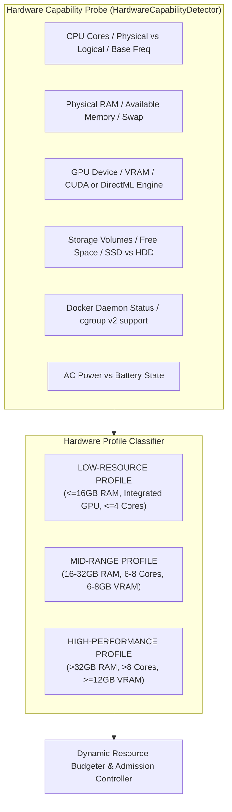
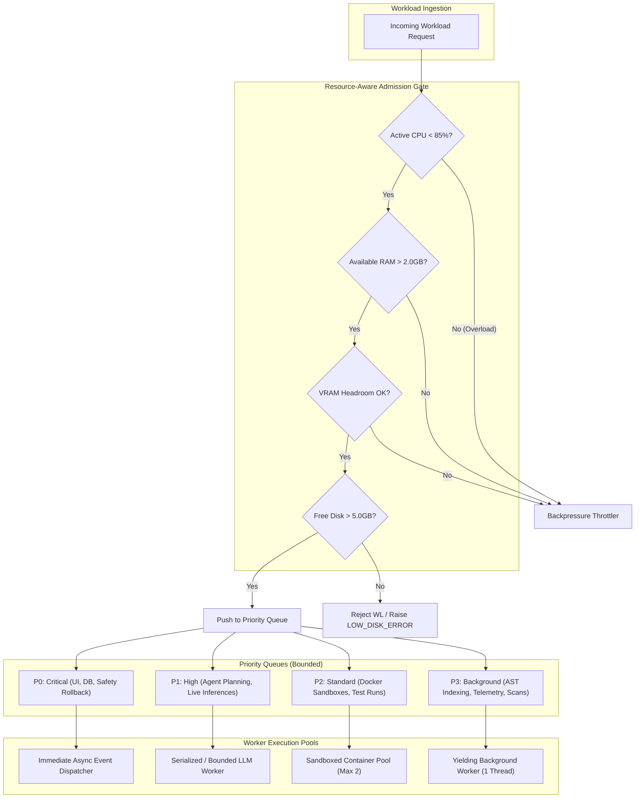
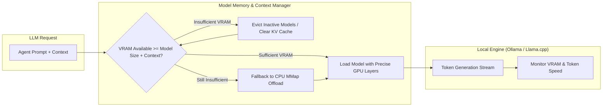
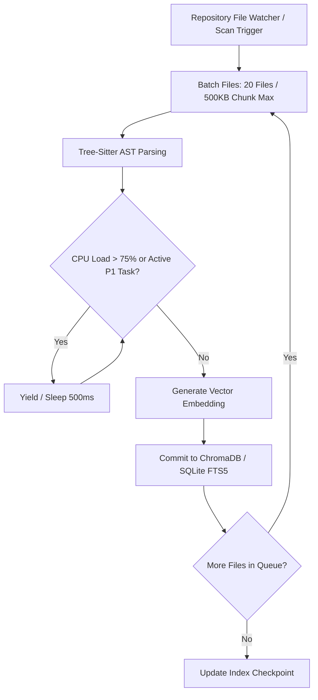
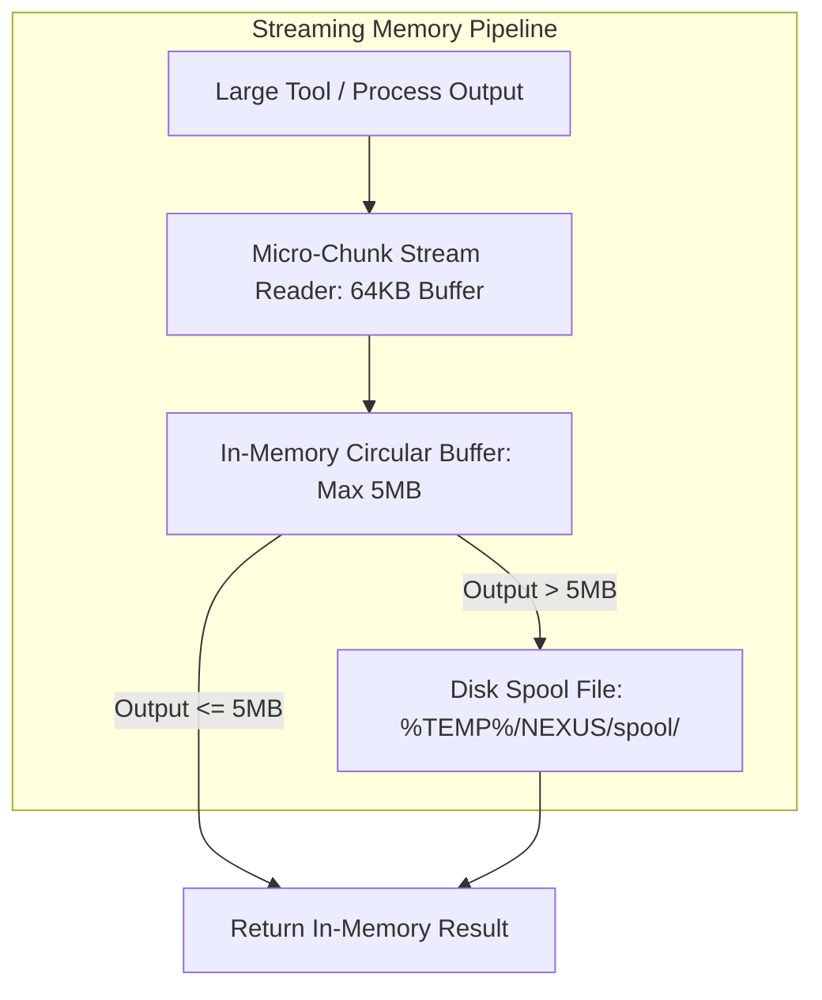
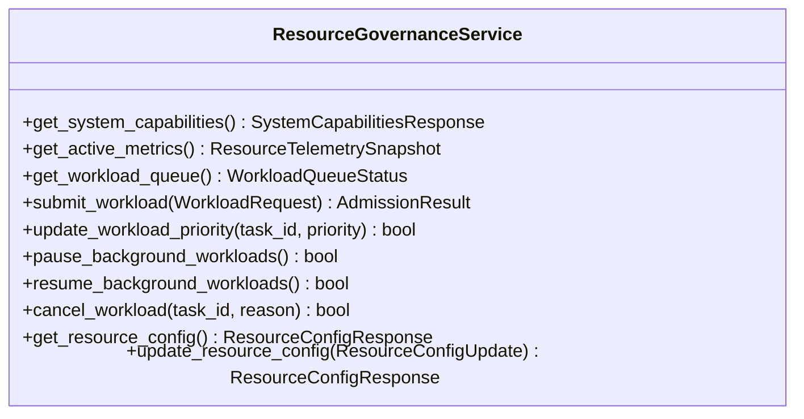
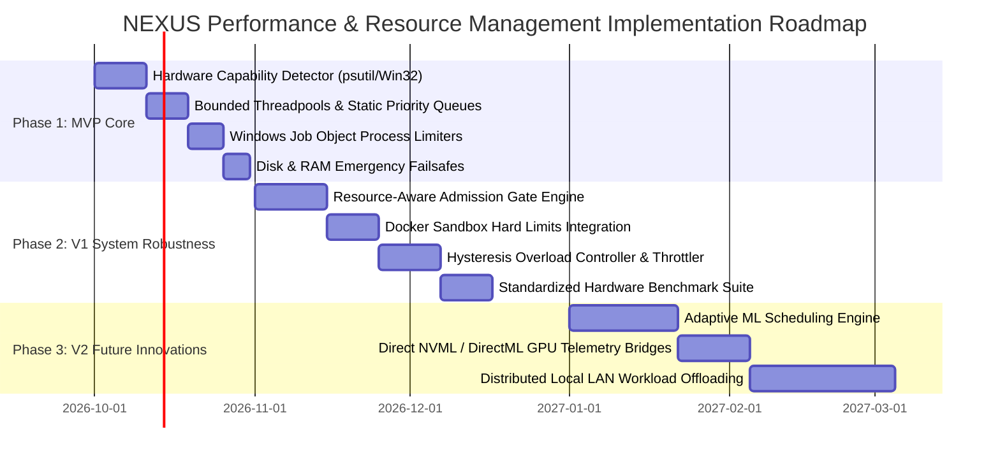

# NEXUS — Performance, Resource Management & Scalability Architecture

**Document Version:** 1.0.0  
**Status:** Approved Production Architecture Baseline  
**Classification:** Core System Reliability, Resource Governance & Performance Engineering  
**Target Systems:** NEXUS Desktop (Windows x64 Native / Tauri + FastAPI Engine) & NEXUS Mobile Companion (Android Node)  
**Primary Sources of Truth:**
- `docs/PRD.md` (v1.0.0)
- `docs/NEXUS_TECH_STACK.md` (v1.0.0)
- `docs/NEXUS_BACKEND_ARCHITECTURE.md` (v1.0.0)
- `docs/NEXUS_SECURITY_ARCHITECTURE.md` (v1.0.0)
- `docs/NEXUS_OBSERVABILITY_ARCHITECTURE.md` (v1.0.0)
- `docs/NEXUS_BACKUP_AND_DISASTER_RECOVERY_ARCHITECTURE.md` (v1.0.0)
- `docs/NEXUS_TESTING_AND_QA_ARCHITECTURE.md` (v1.0.0)

---

## 1. Executive Summary

NEXUS is an autonomous, **local-first AI Software Engineering Command Center**. It coordinates complex engineering workflows using specialized agents (Planner, Developer, Tester, Debugger, Security, Reviewer), tool executions, local Docker/process sandboxing, repository semantic indexing, and local/remote LLM inference on developer hardware.

Unlike cloud SaaS platforms that offload computational spikes to elastic serverless clusters, NEXUS operates directly on developer workstations ranging from power-constrained developer laptops (16 GB RAM, integrated GPU) to multi-core workstations (64+ GB RAM, discrete RTX 4090 GPU). 

### 1.1 The Criticality of Local Resource Governance
On a local workstation, resource contention is acute:
- A local 14B parameter GGUF LLM during token generation can saturate 8 CPU cores or 10 GB of VRAM.
- A concurrent tree-sitter AST parse or Chroma vector embedding job across a 100k-line codebase can spike disk I/O and RAM.
- A Docker container running a large test suite (e.g., PyTest / Cargo test) can drive system CPU to 100%.

If unmanaged, these concurrent workloads will freeze the desktop UI, trigger Operating System Out-Of-Memory (OOM) killer terminations, drop WebSocket connections to the Android companion, or corrupt SQLite databases during disk saturation.

### 1.2 Resource Management Philosophy
NEXUS implements **Deterministic Resource Governance**:
1. **Interactive Responsiveness Priority**: The Desktop UI and user-facing commands always take strict scheduling priority over background background jobs (indexing, log rotation, vector embeddings).
2. **Resource-Aware Admission Control**: Tasks are not admitted into active execution solely because an agent requested them; they are admitted only when the measured and budgeted hardware capacity (CPU, VRAM, RAM, I/O) can safely support them.
3. **Graceful Degradation with Backpressure**: When system pressure rises, low-priority background queues throttle, batch sizes contract, and model inferences serialize, rather than allowing unbounded queue growth.
4. **Safety Limits vs. Performance Optimization**: Resource boundaries (cgroups, Windows Job Objects, memory quotas) are safety constraints enforced to guarantee system stability, distinct from algorithmic throughput optimizations.

---

## 2. Scope and Non-Goals

### 2.1 Scope Taxonomy

```
+---------------------------------------------------------------------------------------------------+
|                                 NEXUS RESOURCE GOVERNANCE SCOPE                                   |
+---------------------------------------------------------------------------------------------------+
| MVP (Phase 1)                       | V1 (Phase 2)                    | Future (Phase 3)          |
|-------------------------------------|---------------------------------|---------------------------|
| - psutil Hardware Detection         | - Resource-Aware Admission Gate | - Adaptive ML Scheduler   |
| - Bounded Worker Threadpools        | - Docker & Windows Job Limits   | - Dynamic Model Switching |
| - Static Priority Queues (4-Tier)   | - Background Index Throttling   | - NVML Direct GPU Telemetry|
| - Process-Level Timeouts & Kills    | - Hysteresis Overload Controller| - Distributed LAN Offload |
| - Low-Disk & High-RAM Failsafes     | - Structured Benchmark Harness  | - NUMA-Aware Core Pinning |
+---------------------------------------------------------------------------------------------------+
```

### 2.2 Desktop vs. Android Responsibilities
- **Windows Desktop Command Center**: Primary execution host and resource manager. Responsible for detecting hardware topology, enforcing process limits, managing LLM inference memory, budgeting disk/RAM, and publishing throttled telemetry.
- **Android Companion Node**: Ephemeral monitoring and approval client. Consumes lightweight telemetry over mTLS WebSocket. Responsible for conserving mobile battery, maintaining a bounded local event cache, and never executing desktop-tier computational workloads.

### 2.3 Explicit Non-Goals
1. **No Cloud Offloading by Default**: NEXUS will never silently route local workloads to cloud infrastructure due to local resource limits. Local constraints trigger queueing or throttling, preserving zero-leakage privacy.
2. **No Hardware Overclocking or Driver Modification**: NEXUS monitors and respects OS-level hardware throttles; it does not alter GPU power curves or CPU fan profiles.
3. **No Unbounded Distributed Clustering**: In MVP/V1, NEXUS manages single-host workstation resources, not multi-node Kubernetes clusters.

---

## 3. Performance and Resource Principles

The NEXUS performance architecture adheres to ten immutable systems engineering principles:

```
1. Responsiveness Before Background Throughput
   Interactive user inputs and real-time terminal interactions are never blocked by indexing or embeddings.

2. Bounded Concurrency
   Every queue, thread pool, and worker pool has a hard upper bound. Unbounded concurrency is prohibited.

3. Resource-Aware Admission Control
   Workloads are evaluated against active system telemetry (available RAM, VRAM, CPU load) before spawning.

4. Strict Process & Sandbox Isolation
   Tool executions and user code execute inside sandboxed containers or Windows Job Objects with hard resource caps.

5. Upstream Backpressure
   When downstream consumers (e.g., SQLite writer, LLM engine) slow down, ingestion pipelines immediately back off.

6. Graceful Degradation
   Under extreme load, non-essential services (animation frame rates, embedding generation, telemetry resolution) 
   degrade gracefully to keep the core command loop responsive.

7. Deterministic Cancellation & Timeouts
   Every asynchronous operation carries an absolute timeout and must propagate standard cancellation tokens.

8. Measurement Before Optimization
   Resource limits and scheduling heuristics are governed by telemetry metrics, never unvalidated guesswork.

9. No Silent Resource Exhaustion
   Approaching resource exhaustion triggers visible warnings, throttles, and structured audit logs.

10. State Preservation Under OOM
    If a process must be terminated under memory pressure, transactional database state is cleanly preserved.
```

---

## 4. Workload Inventory

Every workload running within NEXUS is cataloged, classified by its computational footprint, and assigned explicit governance policies.

| ID | Workload Category | CPU Profile | RAM Profile | GPU / VRAM | Disk I/O | Network | Typical Duration | Default Priority | Max Concurrency | Cancellation Behavior | Resource Failure Handling |
| :--- | :--- | :--- | :--- | :--- | :--- | :--- | :--- | :--- | :--- | :--- | :--- |
| `WL-01` | **Interactive User Requests** | Low (Spike) | Low (<50MB) | None | Low | None | <100ms | **P0 (Critical)** | Unbounded (Async) | Client Abort | Return immediate HTTP 429/503 |
| `WL-02` | **Local LLM Inference** | High (Multi-Core) | High (GGUF MMap) | High (VRAM offload) | Low (Post-load) | None | 1s – 60s | **P1 (High)** | 1 Active (Serialized) | Stop Token / Process Interrupt | Evict model context, fallback to quantized |
| `WL-03` | **Agent Planning & Routing** | Med (1 Core) | Low (<100MB) | None (or WL-02) | Low | Low | 500ms – 5s | **P1 (High)** | 2 Concurrent | Cooperative Token | Mark task `FAILED_RESOURCE`, alert user |
| `WL-04` | **Agent Code Generation** | Med (1 Core) | Low (<100MB) | None (or WL-02) | Med | None | 2s – 30s | **P1 (High)** | 2 Concurrent | Cooperative Token | Checkpoint generated diffs, pause task |
| `WL-05` | **Repository Scanning** | High (I/O Bound) | Med (Tree state) | None | High (Read) | None | 1s – 15s | **P3 (Background)** | 1 Active | SIGINT / File Walk Abort | Throttle I/O sleep (10ms/batch), resume |
| `WL-06` | **AST Indexing & Embeddings**| High (Multi-Core) | Med (Chunk buffer)| Med (Embedding LLM)| High (Chroma DB)| None | 5s – 5min | **P3 (Background)** | 1 Worker Pool | Cooperative Chunk Token | Pause worker, persist cursor offset |
| `WL-07` | **Semantic Retrieval Queries** | Med (1 Core) | Low (<150MB) | Low (Embedding) | Med (Vector Read)| None | 50ms – 500ms | **P1 (High)** | 4 Concurrent | Timeout (2s) | Degrade to keyword/ripgrep search |
| `WL-08` | **Host Terminal Commands** | Configurable | Configurable | None | High | Configurable | 100ms – 10min| **P2 (Standard)** | 3 Concurrent | Process Tree Kill (`taskkill /T`)| Terminate child process tree, log exit code |
| `WL-09` | **Docker Sandbox Workload** | High (Isolated) | High (Capped) | Opt (Passthrough) | High | Configurable | 1s – 30min | **P2 (Standard)** | 2 Containers | `docker stop -t 2` | Container OOMKilled -> record sandbox fault |
| `WL-10` | **Build Toolchains (Cargo/npm)**| High (All Cores) | High (Spike) | None | High (R/W) | Med (Cache pull)| 5s – 10min | **P2 (Standard)** | 1 Active Build | Process Tree Terminate | Capture build log tail, clean temp artifacts |
| `WL-11` | **Automated Test Suites** | High (Multi-Core) | Med | None | Med | None | 2s – 5min | **P2 (Standard)** | 2 Test Runners | Subprocess Kill | Record partial JUnit XML, mark `TEST_FAIL` |
| `WL-12` | **SQLite Queries & Writes** | Low | Low (<100MB) | None | Med (WAL write) | None | <10ms | **P0 (Critical)** | WAL (1 Write / Multi Read)| Timeout (5s) | Rollback active transaction, retry with backoff |
| `WL-13` | **Telemetry & Log Redaction** | Low (Background) | Low (<50MB) | None | Low (Append) | None | Continuous | **P3 (Background)** | 1 Async Worker | Non-blocking ring buffer | Drop low-severity debug logs under pressure |
| `WL-14` | **Backup Creation / Restore** | Med (Zip/Crypto) | Med (Chunk stream)| None | High (Sequential)| None | 2s – 60s | **P2 (Standard)** | 1 Operation | Cooperative Abort | Delete partial staging files, release locks |
| `WL-15` | **Model Download & Unpack** | Low | Med (Buffer) | None | High (Sequential)| High (Bandwidth)| 1min – 20min | **P3 (Background)** | 1 Download | HTTP Range Cancel | Resume partial chunk download on restart |
| `WL-16` | **Desktop-Mobile WebSocket Sync**| Low | Low (<20MB) | None | Low | Low (Local LAN) | Continuous | **P1 (High)** | 5 Connections | Disconnect / Socket Close| Throttle sync cadence (from 10Hz to 1Hz) |
| `WL-17` | **Database VACUUM / Maintenance**| High (I/O Bound) | Med | None | High (WAL Trunc) | None | 500ms – 10s | **P3 (Background)** | 1 Maintenance Task| Checkpoint Abort | Defer maintenance to idle workstation state |

---

## 5. Resource Model and Capability Detection

NEXUS continuously probes system hardware topology on startup and periodically refreshes active capacity via an asynchronous, non-blocking telemetry probe.



### 5.1 Telemetry Extraction Mechanisms
1. **CPU & Memory**: Polled via Python `psutil` native C bindings (`psutil.cpu_percent()`, `psutil.virtual_memory()`, `psutil.swap_memory()`).
2. **GPU & VRAM**:
   - Primary (NVIDIA): Polled via `pynvml` (NVIDIA Management Library) for exact VRAM allocated, total VRAM, and thermal throttling status.
   - Fallback (AMD / Intel / Windows DirectML): Query Windows DXGI / WMI interface (`Win32_VideoController`) for dedicated video memory allocations.
   - Fallback (Unsupported): Assume zero GPU offload capability; route models strictly to CPU AVX2/AVX-512 quantized execution.
3. **Disk I/O & Space**: `psutil.disk_usage()` across workspace drive and `%APPDATA%` volume. Storage classification (SSD vs HDD) queried via Windows PowerShell `Get-PhysicalDisk` or DeviceIoControl `IOCTL_STORAGE_QUERY_PROPERTY`.
4. **Docker Runtime**: Monitored via Docker Engine API (`/info`, `/version`) over named pipe `npipe:////./pipe/docker_engine`.

### 5.2 Polling Cadence and Cache Invalidation
- **Hardware Topology (Static)**: Detected once at engine boot (CPU architecture, total RAM, physical disk layout, GPU models).
- **Dynamic Telemetry (Active Metrics)**:
  - Polled every **1,000 ms** during active task execution.
  - Polled every **5,000 ms** during idle state.
- **Fail-Safe Fallbacks**: If hardware probe APIs fail or throw permission errors, NEXUS defaults to the **Low-Resource Profile** (`LOW-RESOURCE-TIER`) to ensure system stability.

---

## 6. Resource Budgeting

To ensure the Windows Desktop UI never stutters, NEXUS reserves a dedicated **Interactive Safety Margin** that background and agent workloads can never consume.

```
+---------------------------------------------------------------------------------------------------+
|                                 SYSTEM RESOURCE ALLOCATION BUDGET                                 |
+---------------------------------------------------------------------------------------------------+
|  [ Interactive UI & OS Reserve ]  |  [ LLM Inference Engine ]  |  [ Agent & Sandbox Workers ]     |
|  25% CPU / 4.0 GB RAM / 10% I/O   |  40% CPU / 40-60% VRAM      |  35% CPU / 30% RAM / 60% I/O    |
+---------------------------------------------------------------------------------------------------+
```

### 6.1 Subsystem Allocation Matrix

| Subsystem | Max CPU Budget (% Cores) | Max RAM Budget (% Total) | Max VRAM Budget (% GPU) | Max Disk I/O Weight | Enforcement Mechanism |
| :--- | :--- | :--- | :--- | :--- | :--- |
| **Desktop UI (Tauri / Next.js)** | 10% (1 Core max) | 1.0 GB Max | 512 MB (Compositor) | Low (Priority) | OS Process Priority (`NORMAL_PRIORITY_CLASS`) |
| **Backend Core & SQLite DB** | 15% (1-2 Cores) | 1.5 GB Max | None | High (WAL Priority)| Async Event Loop + SQLite Page Cache Cap |
| **Local LLM Engine (Ollama/Llama.cpp)**| 60% (Capped) | 50% Available | 80% Dedicated VRAM | Low (Post-load) | Process Affinity + `--threads` flag + VRAM allocator |
| **Agent Execution Workers** | 30% | 20% Available | None | Med | ThreadPoolExecutor Max Workers Cap |
| **Docker Tool Containers** | 50% (Hard Limit) | 4.0 GB (Hard Cap) | None (or Passthrough)| High (Throttled) | Docker HostConfig (`NanoCPUs`, `Memory`, `BlkioWeight`) |
| **Host Subprocess Workloads** | 40% | 2.0 GB (Job Object) | None | Med | Windows Job Object (`JOB_OBJECT_LIMIT_PROCESS_MEMORY`) |
| **AST Parsing & Chroma Embeddings** | 25% (Low Affinity) | 1.5 GB Max | None (or Embed LLM)| High (Yielding) | Low Thread Priority (`BELOW_NORMAL_PRIORITY_CLASS`) + Batch Sleep |
| **OS & Interactive Safety Reserve** | **25% (Reserved)** | **4.0 GB (Guaranteed)**| **20% VRAM (Display)**| **Reserved Headroom**| **Admission Gate Rejection Threshold** |

---

## 7. Workload Scheduling and Priority Architecture

NEXUS employs a **4-Tier Priority Preemptive Admission Scheduler** integrated directly into the async orchestration engine.



### 7.1 Priority Tier Definitions
- **P0 — Critical (Interactive / Safety / Storage)**: UI commands, database commits, task cancellations, rollback triggers, mTLS heartbeats. Never queued; executed immediately.
- **P1 — High (Active Agent Workflows)**: Agent step orchestration, interactive LLM prompt evaluations, targeted semantic searches. Preempts P3 workloads.
- **P2 — Standard (Tool Execution & Builds)**: Docker sandbox runs, compiler builds, test suites, file patching operations. Queued when tool worker slots are saturated.
- **P3 — Background (Maintenance & Indexing)**: Full repository tree walks, vector embedding calculations, Chroma index compaction, log file rotation. Yields immediately when P1/P2 workloads activate.

### 7.2 Starvation Prevention & Aging
To prevent background indexing from starving indefinitely during sustained multi-agent coding sessions, NEXUS applies **Priority Aging**:
- Every **30 seconds** a queued P3 item remains unserved, its virtual priority score increments.
- Upon reaching a 120-second aging threshold, the scheduler assigns a single time-slice (max 2 seconds) to process a batch of background chunks before yielding back to P1/P2.

---

## 8. Agent Concurrency and Coordination

Multi-agent swarms (Planner $\rightarrow$ Developer $\rightarrow$ Tester $\rightarrow$ Reviewer) cannot run unbounded parallel processes on developer hardware.

### 8.1 Concurrency Caps by Hardware Profile

| Hardware Profile | Max Active Tasks | Max Concurrent Agents | Max Concurrent Tools | Max Parallel Model Streams |
| :--- | :--- | :--- | :--- | :--- |
| **Low-Resource (<16GB RAM, Quad-Core)** | 1 Task | 1 Active Agent | 1 Tool Execution | 1 (Strictly Serialized) |
| **Mid-Range (16-32GB RAM, 6-8 Cores)** | 2 Tasks | 2 Active Agents | 2 Tool Executions | 1 Active LLM + 1 Embedding |
| **High-End (>32GB RAM, 12+ Cores, GPU)**| 4 Tasks | 4 Active Agents | 4 Tool Executions | 2 Concurrent Streams (Batching) |

### 8.2 Agent Coordination and Tool Locking
1. **Workspace Path Mutex**: Two agents cannot concurrently execute mutating file tools (`write_file`, `patch_file`, `git_commit`) on the same workspace directory. A per-project read-write lock (`AsyncRWLock`) ensures atomic repository writes.
2. **Inference Serialization Semaphore**: All local LLM queries across all active agents route through a single global `asyncio.Semaphore(1)` (or `Semaphore(N)` on multi-GPU setups) to prevent GPU out-of-memory thrashing.

---

## 9. Local LLM Resource Management

Local model inference is the single most memory- and compute-intensive component in NEXUS.



### 9.1 Model Memory Estimation Formula
Before loading a model, NEXUS computes the required memory envelope:
$$\text{Memory}_{\text{total}} = \text{Size}_{\text{weights}} + \left( 2 \times N_{\text{layers}} \times N_{\text{heads}} \times D_{\text{head}} \times L_{\text{context}} \times B_{\text{precision}} \right) + \text{Overhead}_{\text{runtime}}$$
*Where $\text{Overhead}_{\text{runtime}} \approx 512\text{ MB}$ for CUDA/DirectML runtime buffers.*

### 9.2 Model Residency & Automatic Eviction
- **Keep-Alive Timer**: Loaded models remain resident in VRAM for **5 minutes** after the last generated token to avoid expensive disk-to-VRAM reload latency.
- **Preemptive Eviction**: If a high-priority tool workload (e.g., Docker container requiring 4 GB RAM) requests admission and system RAM is $<1.5\text{ GB}$, the scheduler calls the model engine eviction endpoint (`POST /api/generate {"keep_alive": 0}`) to immediately release VRAM and memory mapped pages.

---

## 10. Docker and Process Resource Isolation

To prevent untrusted user-code builds or runaway script tools from crashing the host operating system, NEXUS enforces strict OS-level containerization and sandbox constraints.

### 10.1 Windows Process Sandboxing (Native Tools)
When executing host CLI tools on Windows, NEXUS assigns subprocesses to a **Windows Job Object** configured via Win32 APIs:
- `JobObjectExtendedLimitInformation`:
  - `ProcessMemoryLimit`: 2,048 MB max per child process.
  - `JobMemoryLimit`: 4,096 MB aggregate limit for the tool process tree.
  - `ActiveProcessLimit`: Max 32 simultaneous child processes (prevents fork-bombs).
  - `PriorityClass`: `BELOW_NORMAL_PRIORITY_CLASS`.
- Upon timeout or cancellation, `TerminateJobObject()` is invoked, instantly and cleanly killing the entire process tree without leaving orphaned compiler or Python daemons.

### 10.2 Docker Container Sandboxing (Isolated Tools)
When Docker is available, tools execute within ephemeral containers with hard kernel limits:
```json
{
  "HostConfig": {
    "NanoCPUs": 2000000000,
    "Memory": 4294967296,
    "MemorySwap": 4294967296,
    "DiskQuota": 10737418240,
    "PidsLimit": 128,
    "BlkioWeight": 300,
    "NetworkMode": "none",
    "AutoRemove": true,
    "StorageOpt": {
      "size": "10G"
    }
  }
}
```
- **OOM Notification**: Docker container exits with status code `137` (OOM killed) are trapped by the Tool Execution Engine, translated into a structured `RESOURCE_LIMIT_EXCEEDED` audit error, and reported to the agent without crashing the desktop.

---

## 11. Repository Indexing and Background Processing

Semantic indexing (AST chunking + vector embeddings) is throttled to prevent workstation degradation.



### 11.1 Indexing Throttles & Yield Rules
1. **Yielding Batch Slices**: Indexing proceeds in slices of **20 files** or **500 KB** of code. After every slice, the thread sleeps for **50 ms** to yield CPU time slices to the OS scheduler.
2. **Active Workload Suppression**: If an agent starts a P1 code-generation or execution task, background indexing immediately pauses (`INDEXING_SUSPENDED`), saving its cursor in SQLite. It resumes automatically 10 seconds after the agent task finishes.
3. **Large File & Binary Exclusions**:
   - Files $> 2.0\text{ MB}$ are automatically skipped from AST parsing.
   - Binary files, `.git/`, `node_modules/`, `target/`, `venv/`, `.venv/`, `dist/`, and files matching `.gitignore` are excluded at the filesystem walker level.

---

## 12. Backpressure and Overload Management

NEXUS implements a multi-stage **Hysteresis Overload Controller** to manage system stress smoothly without rapid pause/resume oscillations.

```
+---------------------------------------------------------------------------------------------------+
|                                  OVERLOAD HYSTERESIS STATE MACHINE                                |
+---------------------------------------------------------------------------------------------------+
|  [ GREEN: NORMAL ]         RAM Free > 20%, CPU < 75%, VRAM Free > 15%                             |
|         │                  Full concurrency; background indexing active.                          |
|         ▼ (Exceeds Threshold)                                                                     |
|  [ YELLOW: THROTTLED ]     RAM Free < 15%, CPU > 80%, or VRAM Free < 10%                          |
|         │                  Pause P3 indexing; reduce tool concurrency to 1; throttle mobile sync. |
|         ▼ (Exceeds Threshold)                                                                     |
|  [ RED: OVERLOADED ]       RAM Free < 8%, CPU > 90%, or Free Disk < 2GB                            |
|         │                  Reject new P2/P1 tasks; evict idle models; cancel runaway subprocesses.|
|         ▼ (Recovery Delay: 15s Stable)                                                            |
|  [ GREEN: NORMAL ]         Returns only after metrics stay below recovery thresholds for 15s.     |
+---------------------------------------------------------------------------------------------------+
```

### 12.1 Overload Action Matrix

| System Indicator | Warning Threshold (Yellow) | Critical Threshold (Red) | Automated Containment Action |
| :--- | :--- | :--- | :--- |
| **Available RAM** | $< 15\%$ (or $< 2.5\text{ GB}$) | $< 8\%$ (or $< 1.2\text{ GB}$) | Red: Force model context eviction, terminate lowest-priority P3 worker, reject new tasks. |
| **CPU Utilization**| $> 80\%$ for $> 10\text{s}$ | $> 92\%$ for $> 15\text{s}$ | Yellow: Throttle AST parser. Red: Reduce tool threadpool to 1 worker, pause background cron. |
| **Available VRAM** | $< 10\%$ (or $< 800\text{ MB}$) | $< 4\%$ (or $< 300\text{ MB}$) | Red: Purge model KV cache, force unload secondary embedding model, switch to CPU quantization. |
| **Free Disk Space**| $< 5.0\text{ GB}$ | $< 2.0\text{ GB}$ | Red: **HARD FAILSAFE** — Halt all file writes, pause database VACUUM, raise visible UI alert modal. |
| **Queue Depth** | $> 25$ tasks queued | $> 50$ tasks queued | Red: Reject new incoming API tasks with HTTP 429 (`TOO_MANY_REQUESTS_BACKPRESSURE`). |

---

## 13. Performance Metrics and Service-Level Objectives (SLOs)

NEXUS defines explicit, testable Service-Level Objectives across all operational dimensions.

```mermaid
gantt
    title NEXUS Target Latency Budget (Interactive Command to First Token)
    dateFormat X
    axisFormat %s ms

    section P0 Command Loop
    IPC Dispatch & Routing        :0, 15
    Safety & Permission Evaluation :15, 35
    Context Assembly & RAG Search :35, 120
    Model Prompt Evaluation (TTFT):120, 450
```



### 13.1 Proposed Performance SLOs

| Performance Dimension | Metric Name | Target Objective (P95) | Degradation Threshold (Alert) | Benchmark Hardware Baseline |
| :--- | :--- | :--- | :--- | :--- |
| **Desktop UI Responsiveness** | `ui_frame_render_latency` | $\le 16.6\text{ ms}$ (60 fps) | $> 33.3\text{ ms}$ (< 30 fps) | Low-Resource Laptop |
| **Command IPC Dispatch** | `ipc_roundtrip_latency` | $\le 20\text{ ms}$ | $> 50\text{ ms}$ | All Profiles |
| **Task Admission Evaluation** | `admission_gate_latency` | $\le 10\text{ ms}$ | $> 30\text{ ms}$ | All Profiles |
| **Local LLM Time-to-First-Token**| `llm_time_to_first_token` | $\le 600\text{ ms}$ (GPU offload)| $> 2,500\text{ ms}$ (CPU fallback)| Mid-Range Dev Workstation |
| **Local LLM Token Speed** | `llm_generation_tok_per_sec`| $\ge 25\text{ tokens/sec}$ (GPU) | $< 8\text{ tokens/sec}$ (CPU) | Mid-Range (Q4_K_M 8B Model)|
| **Semantic Search Latency** | `rag_retrieval_duration_ms` | $\le 150\text{ ms}$ | $> 500\text{ ms}$ | 50,000 Embeddings Index |
| **Tool Execution Startup** | `docker_container_spawn_ms` | $\le 1,200\text{ ms}$ | $> 3,500\text{ ms}$ | Docker Desktop on Windows |
| **Process Tree Termination**| `job_object_kill_latency` | $\le 100\text{ ms}$ | $> 300\text{ ms}$ | Windows Job Object API |
| **Mobile Sync Latency** | `mobile_ws_telemetry_lag` | $\le 200\text{ ms}$ | $> 1,000\text{ ms}$ | Local 5GHz Wi-Fi LAN |
| **Database Transaction Time** | `sqlite_commit_latency_ms` | $\le 8\text{ ms}$ (WAL mode) | $> 25\text{ ms}$ | NVMe SSD Storage |

---

## 14. Resource Monitoring and Observability Integration

Aligned with [`docs/NEXUS_OBSERVABILITY_ARCHITECTURE.md`](file:///c:/Users/user/OneDrive/Documents/NEXUS/docs/NEXUS_OBSERVABILITY_ARCHITECTURE.md), resource consumption is continuously sampled and structured for zero-overhead local inspection.

### 14.1 Metric Telemetry Schema
```json
{
  "timestamp": "2026-09-27T22:15:00.123Z",
  "system_telemetry": {
    "cpu_utilization_pct": 42.5,
    "cpu_core_count_logical": 16,
    "memory_total_bytes": 34359738368,
    "memory_available_bytes": 18253611008,
    "memory_used_pct": 46.88,
    "gpu_devices": [
      {
        "gpu_id": 0,
        "model_name": "NVIDIA GeForce RTX 4080",
        "vram_total_bytes": 17179869184,
        "vram_allocated_bytes": 6442450944,
        "vram_free_bytes": 10737418240,
        "temperature_celsius": 58
      }
    ],
    "storage_volumes": [
      {
        "mount_point": "C:\\",
        "free_bytes": 128849018880,
        "total_bytes": 1024000000000,
        "is_low_disk": false
      }
    ],
    "scheduler_state": {
      "state": "GREEN",
      "p0_queue_len": 0,
      "p1_queue_len": 1,
      "p2_queue_len": 2,
      "p3_queue_len": 0,
      "active_workers": 2,
      "active_containers": 1
    }
  }
}
```

### 14.2 Cardinality and Sampling Constraints
- **In-Memory Ring Buffer**: Active metrics are held in a bounded circular buffer (1,800 samples = 30 minutes at 1 Hz).
- **Persistent Rollups**: Metrics are downsampled to 1-minute averages before writing to SQLite; raw 1-second metrics older than 1 hour are pruned automatically.
- **Incident Snapshot Attachment**: When any task fails or times out, the exact 5-second window of resource telemetry surrounding the incident is sealed and attached to the incident audit record.

---

## 15. Desktop Responsiveness Guarantees

To ensure the user interface never freezes during intensive operations:

```
+---------------------------------------------------------------------------------------------------+
|                                DESKTOP IPC NON-BLOCKING ARCHITECTURE                              |
+---------------------------------------------------------------------------------------------------+
|  [ Tauri Webview UI Thread ] <---> [ Rust IPC Core ] <---> [ Async FastAPI Backend Daemon ]       |
|  (Never performs blocking I/O)    (Zero-copy buffers)      (Bounded Asyncio Event Loop)           |
|                                                                    │                              |
|                                                                    ▼                              |
|                                                      [ Heavy Subprocess Workers ]                 |
|                                                      (Ollama / Docker / Tree-Sitter)              |
+---------------------------------------------------------------------------------------------------+
```

1. **Strict UI Thread Isolation**: The frontend React/Next.js renderer and Tauri Rust backend communicate exclusively over non-blocking asynchronous IPC channels. No synchronous disk reads, cryptographic hashes, or database queries are executed on the UI main thread.
2. **Chunked Streaming Responses**: Long-running tool outputs, terminal logs, and model tokens stream across WebSockets / Server-Sent Events (SSE) in micro-batches (max 60 events/second) to prevent React Virtual DOM re-render starvation.
3. **Dedicated Background Process Affinity**: Multi-core AST parsers and file hashing routines run on background threads with CPU core affinity set to secondary cores, leaving Core 0 and Core 1 unburdened for OS window management and UI rendering.

---

## 16. Disk and Storage Resource Management

Storage exhaustion can cause irrecoverable database corruption. NEXUS implements proactive disk budget controls.

### 16.1 Storage Quotas & Safe Cleanup Rules
- **Minimum Free Headroom Failsafe**: **5.0 GB minimum free space** required to start any new agent task or Docker build. If free space drops below 5.0 GB, tasks are paused; if it drops below **2.0 GB**, all active file modifications are immediately aborted.
- **Temporary Artifact Lifecycle**:
  - Sandbox temporary files in `%TEMP%\NEXUS\sandboxes\` are deleted immediately upon container teardown.
  - Build scratchpad diffs older than 7 days are pruned during idle maintenance.
  - SQLite WAL files are checkpointed and truncated via `PRAGMA wal_checkpoint(TRUNCATE)` daily.
- **Strict Data Preservation Guard**: NEXUS will **never** automatically delete user repository files, Git commits, task execution evidence logs, or backup archives to free disk space. Only ephemeral temporary files, model download partial buffers, and cache directories (`.cache/nexus/`) are subject to automatic pruning.

---

## 17. Memory Management Architecture

NEXUS prevents Memory Leaks and Out-of-Memory (OOM) fatal crashes using structured streaming and chunked buffer bounds.



### 17.1 Zero-Leakage Streaming Pipelines
1. **Tool Output Spooling**: Subprocess outputs (e.g., a massive `npm install` or `pytest` log) are read in **64 KB chunks**. Up to **5.0 MB** is retained in an in-memory ring buffer for immediate UI streaming; outputs exceeding 5.0 MB are automatically spooled to an ephemeral disk file (`%TEMP%\NEXUS\spool\`) rather than exhausting backend RAM.
2. **Vector Database Memory Cap**: ChromaDB / SQLite FTS memory structures are configured with a hard maximum cache size of **512 MB**. Embeddings are queried using disk-backed memory mapped files (`mmap`).
3. **Garbage Collection Hooks**: Following the completion of heavy multi-agent cycles, the FastAPI engine invokes explicit Python garbage collection (`gc.collect()`) and releases unmanaged C memory arenas via `ctypes.CDLL('msvcrt').free` / `malloc_trim`.

---

## 18. Network and External Resource Management

For optional remote model providers (OpenAI, Anthropic, DeepSeek, Google Gemini) and external package registries:

### 18.1 Concurrency, Rate Limiting & Backoff
- **Adaptive Rate Limit Tracking**: Remote API clients track HTTP `429 Too Many Requests` responses and parse `Retry-After` headers.
- **Exponential Backoff with Jitter**:
  $$t_{\text{backoff}} = \min\left(t_{\text{max}},\, t_{\text{base}} \times 2^{\text{attempt}}\right) \pm \text{uniform}(0, \text{jitter})$$
  *Where $t_{\text{base}} = 1.0\text{s}$, $t_{\text{max}} = 30.0\text{s}$, and $\text{jitter} = 0.2\text{s}$.*
- **Circuit Breaker Pattern**: If 5 consecutive requests to an external provider fail with network timeouts, the provider circuit breaker trips to `OPEN` for 60 seconds, preventing stalled task queues and failing over to configured local models where possible.

---

## 19. Android Companion Resource Behavior

The Android Companion node is engineered for minimal battery consumption and zero desktop interference.

```mermaid
flowchart LR
    subgraph Desktop["Desktop Command Center"]
        State[Authoritative State Engine]
        Throttler[Telemetry Throttler (1Hz Normal / 0.1Hz Idle)]
        WSOut[mTLS WebSocket Server]
    end

    subgraph Mobile["Android Companion Node"]
        WSIn[WebSocket Client]
        Cache[Bounded SQLite Cache (Max 50MB)]
        UI[Jetpack Compose / React Native UI]
    end

    State --> Throttler
    Throttler --> WSOut
    WSOut -. "Encrypted Wi-Fi / Local LAN" .-> WSIn
    WSIn --> Cache
    Cache --> UI
```

### 19.1 Mobile Optimization Rules
1. **Delta-Only Push Synchronization**: The desktop never transmits full task history snapshots to mobile. It broadcasts lightweight JSON diffs (RFC 6902) representing single step mutations.
2. **Battery & Screen State Awareness**: When the mobile application is backgrounded or the screen is locked, the WebSocket connection drops to a lightweight heartbeat mode (1 ping every 30 seconds). Full status reconciles upon foregrounding.
3. **Strict Client Memory Ceiling**: Mobile companion local SQLite cache is strictly capped at **50 MB**. Old log events are purged automatically from mobile storage (desktop remains the immutable source of truth).

---

## 20. Failure Modes and Recovery Matrix

Comprehensive operational playbooks for all resource-related failure scenarios.

| ID | Failure Scenario | Detection Mechanism | Immediate User & System Impact | Containment Action | Rollback & Recovery Procedure |
| :--- | :--- | :--- | :--- | :--- | :--- |
| `FM-RES-01` | **Host Out-Of-Memory (OOM)** | `psutil` reports available RAM $< 500\text{ MB}$ or OS raises `MemoryError`. | Active agent task stalls; UI alert fires. | 1. Immediately abort running P3/P2 workers.<br>2. Force unload resident GGUF LLM.<br>3. Evict Chroma in-memory cache. | Mark running task `PAUSED_OOM`. Reclaim memory; prompt user to restart task with smaller model context. |
| `FM-RES-02` | **GPU VRAM Allocation Fault** | NVIDIA NVML returns `CUDA_ERROR_OUT_OF_MEMORY` or DirectML alloc fails. | Model token generation crashes mid-stream. | 1. Catch CUDA OOM exception.<br>2. Release PyTorch/Llama.cpp context buffers. | Automatically fall back to CPU quantized inference mode or smaller quant (`Q4_K_M`); retry prompt. |
| `FM-RES-03` | **CPU Thread Saturation (100%)** | `psutil.cpu_percent()` $\ge 98\%$ for $> 20\text{ seconds}$. | Desktop UI stutters; mobile sync lags. | 1. Lower process priority of background workers.<br>2. Throttle tool execution threadpool to 1 thread. | Suspend AST indexing; yield CPU time slices; restore normal scheduler limits once CPU drops $< 80\%$. |
| `FM-RES-04` | **Storage Volume Full (<2GB)** | Disk free probe detects $< 2.0\text{ GB}$ on workspace volume. | File writes rejected; database commits blocked. | 1. **EMERGENCY FREEZE**: Pause all agent file write tools.<br>2. Block incoming task submissions. | Purge `%TEMP%\NEXUS\` spool files; prompt user to free disk space; resume paused tasks without data loss. |
| `FM-RES-05` | **Scheduler Queue Overflow** | Queue depth exceeds 50 tasks across all priority tiers. | Incoming user requests face high latency. | 1. Trip admission gate to reject new P2/P3 workloads.<br>2. Return HTTP 429 with estimated wait time. | Drain queues by priority; auto-cancel stale background requests older than 10 minutes. |
| `FM-RES-06` | **Runaway Tool Subprocess / Fork Bomb**| Windows Job Object trips `ActiveProcessLimit` (32) or process memory cap. | Subprocess attempts to spawn excessive child workers. | 1. Job Object automatically denies further child process creation.<br>2. Kill process tree via `TerminateJobObject`. | Capture tool standard error; flag task as `TOOL_RESOURCE_VIOLATION`; return failure to Agent Planner. |
| `FM-RES-07` | **Docker Daemon Freeze / Deadlock** | Docker API ping fails to respond within 5,000 ms. | Containerized tool executions cannot launch. | 1. Mark Docker sandbox provider `UNAVAILABLE`.<br>2. Cancel waiting container tasks. | Fall back to local Windows Job Object sandbox if tool permissions permit, or alert user to restart Docker. |
| `FM-RES-08` | **SQLite Write Lock Starvation** | SQLite raises `sqlite3.OperationalError: database is locked` for $> 5\text{s}$. | Task state mutations cannot persist. | 1. Abort non-essential background telemetry writes.<br>2. Force `PRAGMA wal_checkpoint(PASSIVE)`. | Retry transaction with randomized exponential backoff ($10\text{ms} - 500\text{ms}$); commit critical task state. |
| `FM-RES-09` | **Stuck / Zombie Agent Worker** | Agent step execution exceeds configurable timeout (default 300s). | Task appears perpetually in `RUNNING` state. | 1. Fire task cancellation token.<br>2. Force terminate underlying worker thread/process. | Mark task `FAILED_TIMEOUT`; record stack trace snapshot in incident log; release workspace locks. |
| `FM-RES-10` | **Model Runtime Crash (Ollama SIGSEGV)**| LLM HTTP socket terminates abruptly mid-generation. | Agent prompt stream terminates with partial output. | 1. Detect closed socket connection.<br>2. Log model crash event with exit code. | Re-initialize local model daemon; replay prompt from last checkpoint; mark failure if crash recurs. |
| `FM-RES-11` | **ChromaDB Index Memory Spike** | Embedding process RAM exceeds 1.5 GB during large repo scan. | Background worker consumes excessive workstation RAM. | 1. Terminate active embedding batch.<br>2. Clear Chroma collection memory references. | Reduce embedding batch size (from 100 to 10 chunks); resume indexing from last SQLite cursor. |
| `FM-RES-12` | **Desktop Power Loss / Hard Crash** | Abrupt OS shutdown during active multi-agent task execution. | In-flight memory state lost. | 1. Startup recovery engine scans database for unfinalized `RUNNING` tasks. | Transition orphaned tasks to `PAUSED_INTERRUPTED`; verify database integrity via `PRAGMA integrity_check`. |
| `FM-RES-13` | **Mobile Synchronization Flood** | Mobile client requests full replay during high desktop load. | Desktop backend CPU taxed by serialization. | 1. Reject full state dump request.<br>2. Return paginated delta cursor. | Mobile client updates UI incrementally from local cache; desktop maintains steady 1 Hz broadcast. |

---

## 21. Configuration and User Controls

All resource limits and scheduling thresholds are user-configurable via `nexus.config.json` and persisted in the local SQLite `system_settings` table.

```json
{
  "$schema": "https://nexus.local/schemas/resource-config-v1.json",
  "resource_management": {
    "profile_override": "AUTO",
    "interactive_safety_margin": {
      "reserved_cpu_cores": 2,
      "reserved_ram_mb": 4096,
      "min_free_disk_gb": 5.0
    },
    "concurrency_limits": {
      "max_active_tasks": 2,
      "max_concurrent_agents": 2,
      "max_concurrent_tools": 2,
      "max_parallel_inferences": 1
    },
    "local_llm": {
      "max_vram_allocation_mb": 12288,
      "model_keep_alive_seconds": 300,
      "cpu_thread_limit": 6,
      "enable_gpu_offload": true,
      "fallback_to_cpu": true
    },
    "sandboxing": {
      "tool_timeout_seconds": 180,
      "tool_memory_limit_mb": 2048,
      "docker_memory_limit_mb": 4096,
      "docker_cpu_limit_cores": 2.0
    },
    "indexing": {
      "background_indexing_enabled": true,
      "max_file_size_kb": 2048,
      "batch_size_files": 20,
      "pause_during_active_tasks": true
    },
    "overload_controller": {
      "ram_warning_threshold_pct": 85,
      "ram_critical_threshold_pct": 92,
      "cpu_warning_threshold_pct": 80,
      "cpu_critical_threshold_pct": 92
    }
  }
}
```

---

## 22. APIs and Internal Service Contracts

The Performance & Resource Subsystem exposes typed, authenticated REST and WebSocket interfaces adhering to standard NEXUS API conventions.

### 22.1 Service Contract Specifications



#### 1. `GET /api/v1/system/capabilities`
* **Purpose**: Inspect hardware topology, detected GPU models, total RAM, and assigned performance tier.
* **Response Schema**:
  ```json
  {
    "detected_profile": "MID_RANGE",
    "cpu": {
      "physical_cores": 8,
      "logical_cores": 16,
      "model_name": "AMD Ryzen 7 7800X3D",
      "base_frequency_mhz": 4200
    },
    "memory": {
      "total_physical_bytes": 34359738368,
      "pagefile_total_bytes": 38654705664
    },
    "gpu": {
      "available": true,
      "driver_version": "551.86",
      "devices": [
        {
          "device_id": 0,
          "name": "NVIDIA GeForce RTX 4070 SUPER",
          "vram_total_bytes": 12884901888
        }
      ]
    },
    "docker": {
      "available": true,
      "version": "26.1.1",
      "cgroup_version": "v2"
    }
  }
  ```

#### 2. `GET /api/v1/system/metrics/live`
* **Purpose**: Stream real-time CPU, RAM, VRAM, disk, and queue metrics via WebSocket or SSE.
* **Output Stream**: Emits `system_telemetry` payload at 1 Hz (see Section 14.1).

#### 3. `POST /api/v1/workloads/admit`
* **Purpose**: Internal orchestrator gate to request execution admittance for a task or tool.
* **Request Schema**:
  ```json
  {
    "workload_id": "wl-task-9872",
    "workload_type": "DOCKER_TOOL_EXECUTION",
    "priority_tier": "P2_STANDARD",
    "estimated_ram_mb": 2048,
    "estimated_cpu_cores": 2.0,
    "requires_gpu": false,
    "timeout_seconds": 120
  }
  ```
* **Response Schema (Admitted)**:
  ```json
  {
    "status": "ADMITTED",
    "workload_id": "wl-task-9872",
    "allocated_slot": "tool-worker-1",
    "queue_position": 0,
    "effective_limits": {
      "memory_max_mb": 2048,
      "cpu_max_cores": 2.0
    }
  }
  ```
* **Response Schema (Queued / Backpressure)**:
  ```json
  {
    "status": "QUEUED",
    "workload_id": "wl-task-9872",
    "queue_position": 3,
    "estimated_wait_ms": 4500,
    "reason": "ACTIVE_TOOL_SLOTS_FULL"
  }
  ```

---

## 23. Testing and Benchmarking Strategy

To validate resource boundaries and ensure zero regressions, NEXUS mandates automated benchmarking across three standardized hardware profiles.

### 23.1 Benchmark Hardware Profile Matrix

```
+---------------------------------------------------------------------------------------------------+
|                                  STANDARDIZED TEST HARDWARE PROFILES                              |
+---------------------------------------------------------------------------------------------------+
| Profile Tier            | CPU Configuration | System RAM | GPU Specification | Storage Type       |
|-------------------------|-------------------|------------|-------------------|--------------------|
| 1. Low-Resource Laptop  | 4 Cores / 8 Thrs  | 16 GB DDR4 | Intel Iris Xe / None | SATA/NVMe SSD  |
| 2. Mid-Range Dev PC     | 8 Cores / 16 Thrs | 32 GB DDR5 | NVIDIA RTX 4070 12GB | PCIe 4.0 NVMe SSD |
| 3. Pro Workstation      | 16 Cores / 32 Thrs| 64 GB DDR5 | NVIDIA RTX 4090 24GB | PCIe 4.0 NVMe SSD |
+---------------------------------------------------------------------------------------------------+
```

### 23.2 Automated Test Suite Categories
1. **Admission Controller Unit Tests**: Validate that P0 requests bypass queues, P3 requests throttle when RAM $<15\%$, and admission correctly calculates VRAM envelopes.
2. **Stress & Overload Tests**: Simulate 100% CPU loads using synthetic stress workers (`stress-ng` / multiprocessing loops); verify Desktop UI renders at $\ge 30\text{ fps}$ throughout.
3. **Windows Job Object Limit Verification**: Spawn a memory-leaking C subprocess; verify Windows Job Object terminates the process at exactly 2,048 MB without host OS degradation.
4. **Sudden Power Loss Simulation**: Trigger hard process kills (`taskkill /F /IM python.exe`) during active database writes; verify `PRAGMA integrity_check` passes and tasks recover to `PAUSED_INTERRUPTED` upon restart.
5. **Large Repository Indexing Drill**: Index a mock 100,000-line repository (1,000 files); verify background memory remains $<1.5\text{ GB}$ and yields immediately upon concurrent user prompt submission.

---

## 24. Implementation Roadmap

Implementation is structured across three deliverable phases.



### 24.1 Phase Breakdown
* **Phase 1 — MVP (Baseline Deliverables)**:
  - Integration of `HardwareCapabilityDetector` using `psutil`.
  - 4-Tier priority queues (`P0`, `P1`, `P2`, `P3`) in task orchestrator.
  - Windows Job Object wrappers for all host CLI tool invocations.
  - Hard disk ($<2.0\text{ GB}$) and memory ($<1.0\text{ GB}$) emergency stop triggers.
* **Phase 2 — V1 (Production Robustness)**:
  - Dynamic admission control checking active CPU, RAM, and VRAM before task start.
  - Automated background indexing throttling and yield controllers.
  - Docker `HostConfig` CPU and Memory enforcement.
  - Hysteresis overload state machine (Green $\rightarrow$ Yellow $\rightarrow$ Red).
  - Automated performance regression test harness.
* **Phase 3 — Future (Advanced Capabilities)**:
  - ML-based execution duration and memory requirement predictors.
  - Direct NVML C-level bindings for multi-GPU load balancing.
  - Peer-to-peer local network execution offloading across developer machines.

---

## 25. Risk Register and Open Decisions

### 25.1 Risk Register

| ID | Risk Description | Likelihood | Impact | Mitigation Strategy | Owner | Verification Method |
| :--- | :--- | :--- | :--- | :--- | :--- | :--- |
| `R-PERF-01` | **GPU Telemetry Driver Incompatibility**: Third-party GPU drivers (AMD/Intel) fail to report VRAM accurately via WMI/DirectX. | Medium | High | Fall back to conservative static VRAM tables based on reported GPU device ID string. | AI Platform Team | DirectX DXGI hardware query test harness. |
| `R-PERF-02` | **Windows Job Object Nesting Restrictions**: Nested Job Objects fail on older Windows 10 builds if container engines attach. | Low | High | Use `JOB_OBJECT_LIMIT_KILL_ON_JOB_CLOSE` with `SetInformationJobObject` compatibility flags. | Systems Engineer | Windows 10/11 sandbox isolation test. |
| `R-PERF-03` | **Tree-Sitter Parsing Memory Spikes**: Complex macro-heavy C++ or Rust files cause AST parser memory recursion. | Medium | Medium | Enforce strict 2MB file size cap and per-file AST timeout of 1,500 ms. | Backend Lead | Fuzz testing with macro-dense source files. |
| `R-PERF-04` | **Docker Desktop WSL2 Memory Leaks**: WSL2 virtual machine ballooning consumes host RAM outside Windows visibility. | High | High | Document and enforce `.wslconfig` memory limits (`memory=8GB`) in NEXUS setup wizard. | Desktop Lead | Automated installer environment validator. |

### 25.2 Register of Open Decisions

| ID | Topic | Current Architectural Recommendation | Next Required Action |
| :--- | :--- | :--- | :--- |
| `OD-PERF-01` | **Default Low-Resource Concurrency** | Limit 16 GB machines to 1 active task and serialized LLM inference. | Product & QA sign-off following low-resource laptop benchmark run. |
| `OD-PERF-02` | **Model VRAM Cache Retention Time** | Retain model in VRAM for 300 seconds (5 min) of inactivity before auto-eviction. | Verify model reload penalty vs VRAM reclamation on 8GB GPU cards. |
| `OD-PERF-03` | **Docker vs Process Sandbox Default** | Default to Windows Job Object process sandboxing; use Docker when container image specified. | Security & Architecture team review of isolation requirements. |
| `OD-PERF-04` | **ChromaDB vs SQLite FTS5 Default** | Use SQLite FTS5 for keyword search on low-resource profile; enable Chroma vector embeddings on mid/high tiers. | Benchmark embedding memory footprint on 16 GB RAM baseline. |

---

## 26. Definition of Done

The NEXUS Performance, Resource Management & Scalability Architecture is formally complete and approved when:
- [x] All 17 workload categories are inventoried with CPU, RAM, GPU, Disk, and Network profiles.
- [x] System capability detection engine is specified for CPU, RAM, GPU, Disk, and Docker runtimes.
- [x] Resource budgets and reservation margins are established for Desktop UI, Backend, LLM, and Sandboxes.
- [x] 4-Tier priority scheduling and resource-aware admission control algorithms are fully defined.
- [x] Local LLM memory estimation, VRAM allocation, and residency eviction policies are documented.
- [x] Docker container and Windows Job Object process sandboxing limits are specified.
- [x] Repository indexing throttling, batching, and yield-on-active-workload behaviors are detailed.
- [x] Backpressure hysteresis controller (Green $\rightarrow$ Yellow $\rightarrow$ Red) and overload matrix are defined.
- [x] Performance metrics, collection sampling, and measurable P95 SLOs are established.
- [x] Desktop non-blocking IPC and UI responsiveness guarantees are detailed.
- [x] Disk quota, temporary spooling, and zero-leakage streaming pipelines are specified.
- [x] Android Companion battery-aware synchronization and cache boundaries are documented.
- [x] 13 detailed failure mode playbooks with automated containment and rollbacks are defined.
- [x] Typed REST and WebSocket service contracts for system capabilities and admission are specified.
- [x] Multi-tier benchmarking strategy across three standardized hardware profiles is established.
- [x] Phased implementation roadmap (MVP, V1, Future) with risk register and open decisions is complete.

---

## 27. Summary & Implementation Synthesis

### 27.1 Architecture Summary
The **NEXUS Performance, Resource Management & Scalability Architecture** guarantees that developer workstations remain responsive, stable, and uncorrupted while running concurrent autonomous AI workloads. By combining **Hardware Topology Probing**, **Resource-Aware Admission Control**, **4-Tier Priority Scheduling**, **Windows Job Object / Docker Process Sandboxing**, and **Hysteresis Overload Protection**, NEXUS transitions AI software engineering from erratic script execution to deterministic workstation operations.

### 27.2 Core Resource Governance Policies
1. **Interactive Priority**: User inputs and UI renders preempt background tasks unconditionally.
2. **Admission Gating**: Tasks queue rather than executing if available RAM $<2.0\text{ GB}$ or VRAM is exhausted.
3. **Hard Sandbox Isolation**: Subprocesses are strictly capped via Windows Job Objects (2 GB RAM) and Docker (4 GB RAM).
4. **Emergency Failsafe**: All filesystem mutations freeze if free disk space drops below $2.0\text{ GB}$.

### 27.3 Recommended Implementation Sequence
1. Implement `HardwareCapabilityDetector` and 4-tier bounded priority queue (`P0`–`P3`).
2. Implement Windows Job Object subprocess wrappers with memory and process count limits.
3. Implement `AdmissionGate` evaluating CPU/RAM/VRAM headroom before task launch.
4. Integrate yielding batch controller for repository AST parsing and Chroma embeddings.
5. Deploy hysteresis overload state machine and automated benchmark regression suite.

---

## 28. Next Logical NEXUS Architecture Document

The recommended next document in the NEXUS master architecture series is:  
**`docs/NEXUS_INTEGRATION_AND_PLUGIN_ARCHITECTURE.md`**  
*(Focus: External developer tools, Language Server Protocol (LSP) bridges, Model Context Protocol (MCP) server lifecycle management, local container sandbox extensions, and third-party agent capability plugins).*
