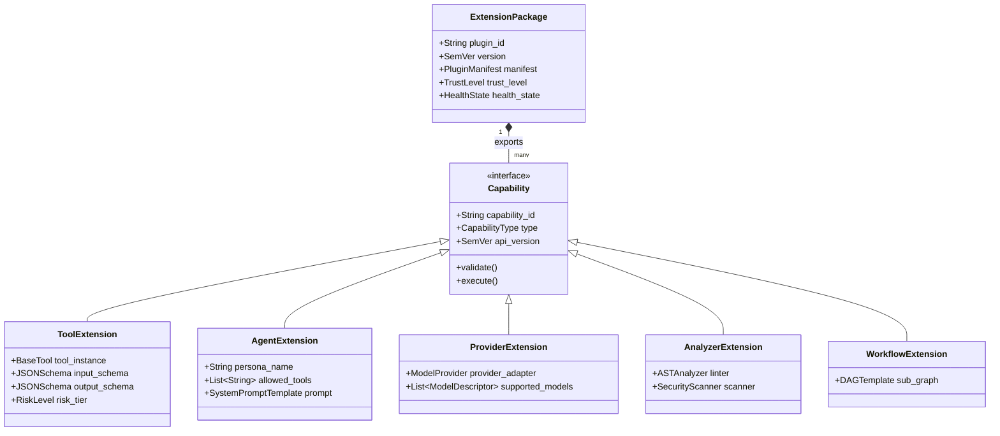
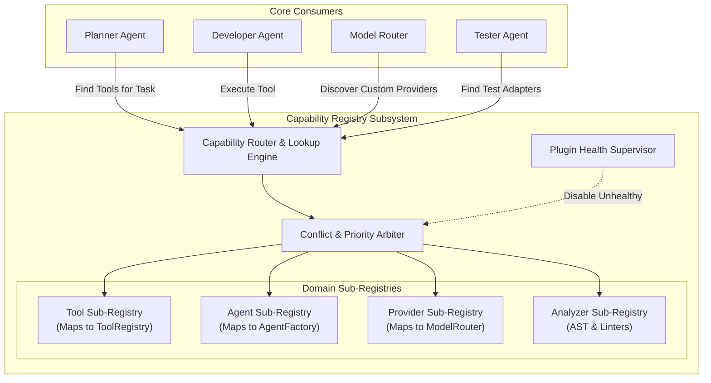
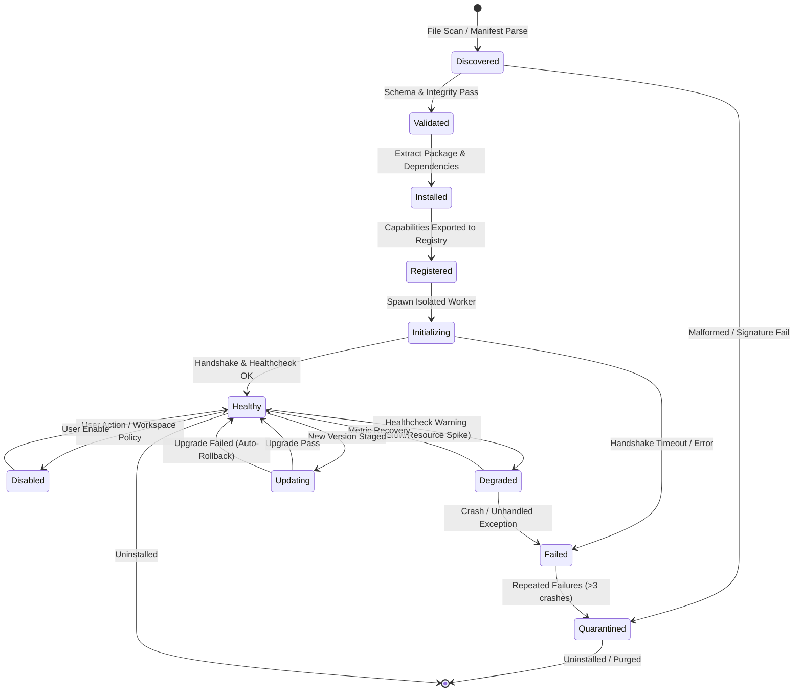
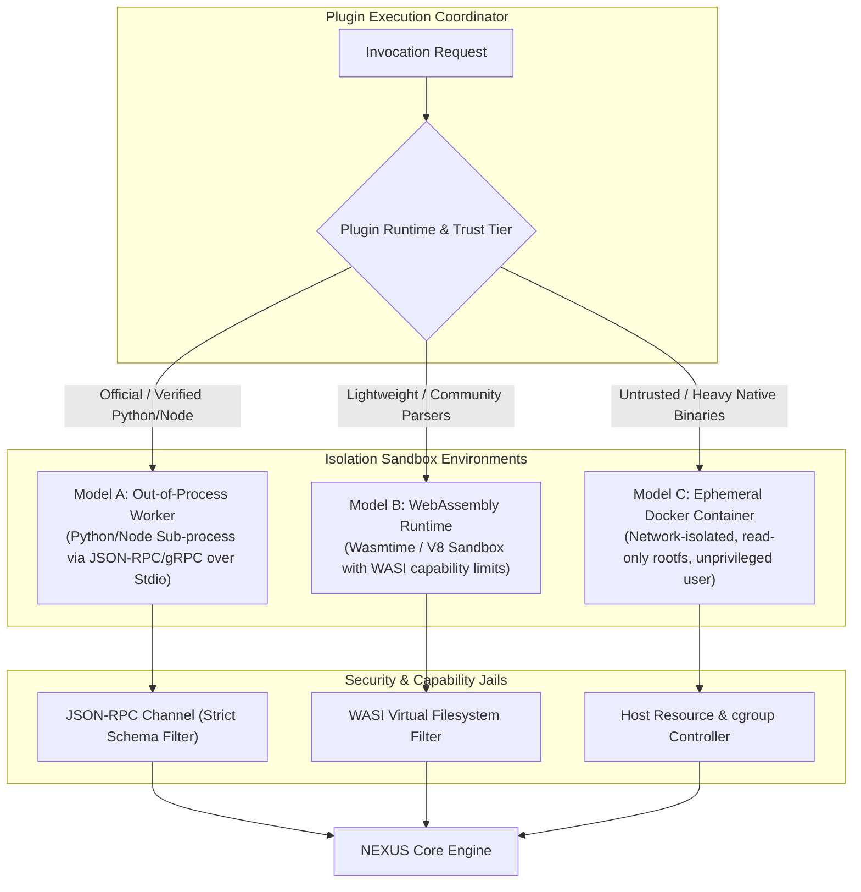
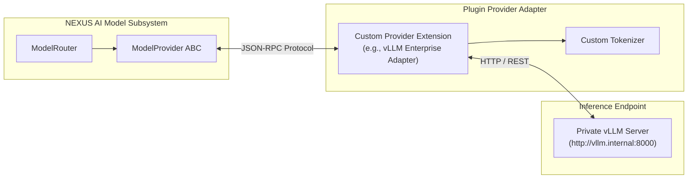
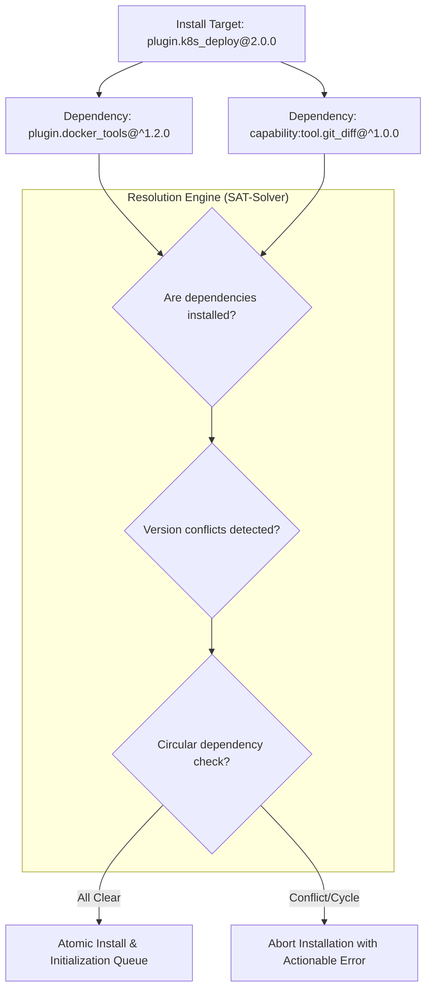
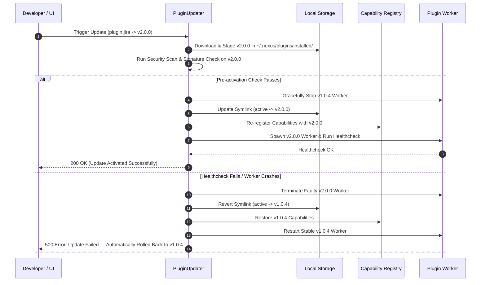
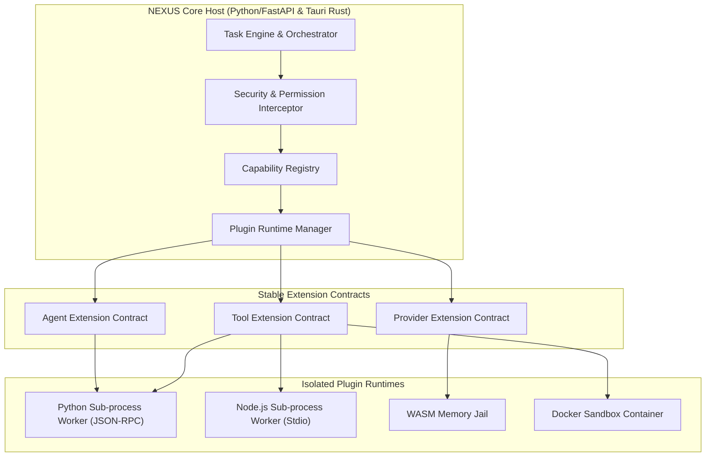
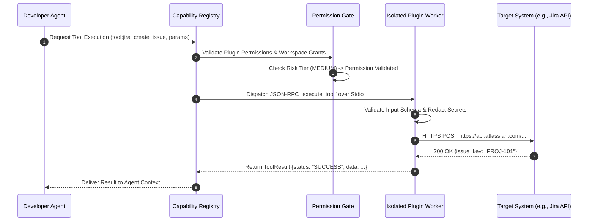

# NEXUS — Plugin, Extension & Capability Registry Architecture
**Document Version:** 1.0.0  
**Status:** Approved Extension Architecture Baseline  
**Classification:** Core System Platform Specification  
**Primary Sources of Truth:** `NEXUS_PRD.md` (v1.0.0), `NEXUS_TECH_STACK.md` (v1.0.0), `NEXUS_DESIGN_DOC.md` (v1.0.0), `NEXUS_BACKEND_ARCHITECTURE.md` (v1.0.0), `NEXUS_SECURITY_ARCHITECTURE.md` (v1.0.0), `NEXUS_AI_MODEL_RUNTIME_AND_PROVIDER_ARCHITECTURE.md` (v2.0.0), `NEXUS_TASK_LIFECYCLE_AND_ORCHESTRATION_ARCHITECTURE.md` (v1.0.0), `NEXUS_NOTIFICATIONS_EVENTS_AND_REALTIME_SYNC_ARCHITECTURE.md` (v1.0.0)

---

## 1. Executive Summary

NEXUS is an autonomous, **local-first AI Software Engineering Command Center** designed to execute complex software engineering workflows directly on developer workstations. To prevent the core platform from becoming an unwieldy, tightly coupled monolith while accommodating the rapid evolution of development tools, AI providers, custom domain agents, security analyzers, and cloud infrastructure, NEXUS requires a modular, secure, and sandboxed **Plugin, Extension & Capability Registry Architecture**.

This specification establishes the **NEXUS Extension Platform (NEP)**. NEP provides:
1. **Contract-Driven Capability Abstraction:** Stable, versioned extension interfaces (`ToolExtension`, `AgentExtension`, `ProviderExtension`, `AnalyzerExtension`, `WorkflowExtension`, `UIExtension`) decouples extension authors from core internal implementation details.
2. **Centralized Capability Registry:** A unified discovery, lifecycle, conflict resolution, and priority routing registry where capabilities are registered, verified, and dynamically dispatched.
3. **Multi-Tier Trust & Sandboxing Runtime:** Out-of-process isolation (isolated sub-processes, WebAssembly runtimes, and Docker containers) ensuring that third-party extensions cannot compromise host system security, crash the core backend, leak proprietary source code, or bypass human-in-the-loop approval gates.
4. **Granular Least-Privilege Permissions:** A deterministic, 5-tier permission model with mandatory cryptographic manifest signatures, runtime capability gates, and pre-persistence audit trails.
5. **Air-Gapped & Local-First Integrity:** 100% functionality without internet access using local package extraction, cached offline manifests, and local development symlinks.

---

## 2. Architecture Goals

* **Extensibility Without Monolithic Bloat:** Allow adding specialized tools, providers, agents, and linters without modifying core backend repositories or desktop binaries.
* **Fault Isolation & Stability:** A crashing, hanging, or malicious plugin must **never** terminate the NEXUS core backend process or corrupt user repository state.
* **Strict Least-Privilege Security:** No plugin receives ambient file system, shell, network, or secret access. Access requires declarative manifest requests, cryptographic verification, and explicit user grant.
* **Deterministic Lifecycle & Recovery:** Predictable installation, initialization, enablement, health monitoring, dynamic quarantine, and automatic rollback on broken updates.
* **Local-First & Privacy Preserving:** Support private, air-gapped enterprise environments and local development without mandatory cloud telemetry or central registry lock-in.
* **Unified Desktop-to-Mobile Governance:** Desktop serves as the authoritative plugin execution host; Android companion receives transparent capability visibility, health alerts, and remote approval gates without running untrusted host code.

---

## 3. Existing Architecture Dependencies & Ownership Boundaries

The Plugin Architecture strictly integrates with and reuses existing NEXUS subsystems:

```
+---------------------------------------------------------------------------------------------------+
| SUBSYSTEM / ARCHITECTURE               | CORE OWNERSHIP (EXISTING)      | PLUGIN SYSTEM EXTENSION  |
+---------------------------------------------------------------------------------------------------+
| Tool Execution Subsystem               | BaseTool ABC, Execution Engine | ToolExtension Adapters   |
| AI Model Runtime & Router              | ModelProvider ABC, Router      | ProviderExtension Plugins|
| Task & Agent Orchestrator              | DAG Scheduler, State Machine   | Custom Agent Personas    |
| Security & Permission Gate             | 5-Tier Gate, Secret Redactor   | Plugin Permission Verifier|
| Real-Time Event Bus & Streaming        | EventEnvelope, EventBus        | Plugin Event Dispatchers |
| Persistence & Database                 | SQLite WAL, SQLAlchemy Base    | Plugin Metadata Tables   |
| Observability & Incident Management    | Telemetry, Health Metrics      | Plugin Health & Spans    |
| Human-in-the-Loop Approval             | Approval Engine, Dual-Client   | High-Risk Plugin Actions |
+---------------------------------------------------------------------------------------------------+
```

---

## 4. Extension Model & Conceptual Taxonomy

To avoid architectural ambiguity, NEXUS defines a formal conceptual hierarchy:



### Definitions:
1. **Plugin (Extension Package):** The distributed physical artifact (`.nxp` zip bundle, npm tarball, or local directory) containing code, assets, and a manifest.
2. **Capability:** A distinct, functional service contract registered into the core system (e.g., `tool:jira_create_issue`, `provider:anthropic_vertex`, `agent:database_migration_specialist`).
3. **Adapter:** The translation layer mapping the plugin’s internal logic to the stable NEXUS Core abstract base classes (`BaseTool`, `ModelProvider`, `BaseAgent`).

---

## 5. Plugin Manifest Specification

Every NEXUS plugin must include a `plugin.manifest.json` at its root.

### 5.1 JSON Schema Specification (`v1.0.0`)

```json
{
  "$schema": "http://json-schema.org/draft-07/schema#",
  "title": "NexusPluginManifest",
  "type": "object",
  "required": [
    "schema_version",
    "plugin_id",
    "name",
    "version",
    "description",
    "author",
    "license",
    "engine_compatibility",
    "runtime",
    "entry_point",
    "capabilities",
    "permissions"
  ],
  "properties": {
    "schema_version": { "type": "string", "enum": ["1.0.0"] },
    "plugin_id": { "type": "string", "pattern": "^[a-z0-9_-]+\\.[a-z0-9_-]+$" },
    "name": { "type": "string" },
    "version": { "type": "string", "pattern": "^\\d+\\.\\d+\\.\\d+$" },
    "description": { "type": "string" },
    "author": {
      "type": "object",
      "required": ["name"],
      "properties": {
        "name": { "type": "string" },
        "email": { "type": "string" },
        "url": { "type": "string" }
      }
    },
    "license": { "type": "string" },
    "homepage": { "type": "string" },
    "repository": { "type": "string" },
    "engine_compatibility": {
      "type": "object",
      "required": ["nexus_minimum"],
      "properties": {
        "nexus_minimum": { "type": "string" },
        "nexus_maximum": { "type": "string" }
      }
    },
    "runtime": {
      "type": "string",
      "enum": ["python_process", "node_process", "wasm", "docker_container"]
    },
    "entry_point": { "type": "string" },
    "capabilities": {
      "type": "array",
      "items": {
        "type": "object",
        "required": ["id", "type", "display_name"],
        "properties": {
          "id": { "type": "string" },
          "type": {
            "type": "string",
            "enum": ["tool", "agent", "provider", "analyzer", "workflow", "ui"]
          },
          "display_name": { "type": "string" },
          "description": { "type": "string" },
          "version": { "type": "string" },
          "metadata": { "type": "object" }
        }
      }
    },
    "permissions": {
      "type": "array",
      "items": {
        "type": "object",
        "required": ["scope", "reason"],
        "properties": {
          "scope": { "type": "string" },
          "reason": { "type": "string" },
          "risk_tier": { "type": "string", "enum": ["READ_ONLY", "LOW", "MEDIUM", "HIGH", "CRITICAL"] }
        }
      }
    },
    "dependencies": {
      "type": "object",
      "additionalProperties": { "type": "string" }
    },
    "configuration_schema": { "type": "object" },
    "signature": {
      "type": "object",
      "properties": {
        "key_id": { "type": "string" },
        "algorithm": { "type": "string", "enum": ["Ed25519", "ECDSA_P256"] },
        "signature_hash": { "type": "string" }
      }
    }
  }
}
```

---

## 6. Capability Registry Architecture

The **Capability Registry** is the central routing and discovery authority in NEXUS.



### 6.1 Capability Resolution & Priority Hierarchy
When multiple plugins provide identical capability IDs (e.g., `analyzer:eslint`), the registry resolves invocation using strict priority rules:
1. **Explicit Project Overrides:** Project configuration setting (`.nexus/config.yaml`).
2. **Explicit Workspace Overrides:** Workspace-level preference.
3. **Trust Level Ranking:** `CORE_BUILTIN` > `OFFICIAL_SIGNED` > `COMMUNITY_VERIFIED` > `LOCAL_DEV` > `UNTRUSTED`.
4. **Semantic Version:** Highest compatible semantic version.
5. **Fallback:** If unresolved, NEXUS halts and prompts the user to select the preferred capability provider in the UI.

---

## 7. Plugin Lifecycle State Machine



---

## 8. Installation & Packaging Architecture

### 8.1 Package Distribution Format (`.nxp`)
NEXUS plugins are distributed as compressed `.nxp` (NEXUS Package) archive files:
```
my-plugin.nxp (ZIP archive)
├── plugin.manifest.json       # Mandatory metadata & capability declaration
├── manifest.sig               # Ed25519 cryptographic detached signature
├── README.md                  # Human-readable documentation
├── dist/                      # Compiled JS / Python bytecode / WASM binary
│   └── index.js (or main.py)
├── schemas/                   # JSON schemas for tools & configuration
│   └── tool_input.json
└── assets/                    # Icons and UI metadata
    └── icon.svg
```

### 8.2 Installation Pipeline
1. **Source Ingestion:** User selects local `.nxp` file, points to Git repository, or downloads from trusted registry.
2. **Pre-Extraction Inspection:** Archive size, entry count, and path traversals (ZipSlip prevention) verified in memory.
3. **Signature Validation:** Manifest checked against the NEXUS Trusted Root CA or author public key.
4. **Dependency Resolution:** Verifies core engine compatibility and required capability dependencies.
5. **Permission Prompt:** User reviews requested scopes (e.g., `network.connect:api.github.com`).
6. **Isolated Staging:** Files extracted to `~/.nexus/plugins/installed/<plugin_id>@<version>/`.
7. **Atomic Symlinking:** Active pointer updated atomically to point to the newly staged version.

---

## 9. Trust Model & Certification Hierarchy

NEXUS classifies plugins into 5 distinct trust tiers:

| Trust Tier | Source & Verification | Allowed Sandboxes | Default Permissions | Security Gate |
| :--- | :--- | :--- | :--- | :--- |
| **Tier 0: Built-in** | Embedded in core NEXUS binary | In-Process / Thread | Full Platform Access | Signed by Core Release Key |
| **Tier 1: Official** | Signed by NEXUS Core Maintainers | Worker Process / WASM | Pre-approved Scopes | Ed25519 Official Key |
| **Tier 2: Verified** | Audited Community / Enterprise | Worker Process / WASM | Interactive User Approval | Developer Identity Verified |
| **Tier 3: Community**| Unverified Third-Party Package | Docker Container / WASM| Strict User Approval Required| Self-Signed / Unsigned |
| **Tier 4: Local Dev** | Local symlinked workspace directory | Worker / Container | Developer Explicit Grants | Development Mode Warning |

---

## 10. Granular Permission System

Plugins must explicitly declare every required capability in `plugin.manifest.json`.

### 10.1 Permission Taxonomy Matrix

```
+-----------------------------------------------------------------------------------+
| PERMISSION SCOPE            | RISK LEVEL | DESCRIPTION                            |
+-----------------------------------------------------------------------------------+
| filesystem.read:workspace   | LOW        | Read files within active workspace     |
| filesystem.read:host        | HIGH       | Read arbitrary files outside workspace |
| filesystem.write:workspace  | MEDIUM     | Write/patch files inside workspace     |
| filesystem.write:host       | CRITICAL   | Write files anywhere on host OS        |
| terminal.execute:sandbox    | MEDIUM     | Run CLI commands in Docker sandbox     |
| terminal.execute:host       | CRITICAL   | Execute raw shell processes on host OS |
| network.connect:<domain>    | HIGH       | Egress TCP/HTTP traffic to specific host|
| secret.read:<key_name>      | CRITICAL   | Read decrypted secret from OS Keyring  |
| model.invoke:local          | LOW        | Query local Ollama model instances     |
| model.invoke:external       | HIGH       | Query external cloud LLM APIs          |
| git.commit                  | MEDIUM     | Create local Git commits               |
| git.push                    | HIGH       | Push Git commits to remote repository  |
+-----------------------------------------------------------------------------------+
```

### 10.2 Runtime Permission Interceptor
When a plugin calls a host API, the **Permission Interceptor** validates:
1. Manifest Declaration: Was the scope declared in `plugin.manifest.json`?
2. User Grant: Did the user approve this scope for this workspace?
3. Dynamic Constraint: Is the requested path inside the authorized directory jail?
4. Audit Trail: Event written to `plugin_audit_logs` before execution.

---

## 11. Sandboxing & Isolation Architecture

To ensure total platform resilience, NEXUS enforces a **Hybrid Sandboxing Model**:



### 11.1 Trade-off & Runtime Selection Matrix

| Sandbox Model | Startup Latency | Memory Overhead | Security Isolation | Native Code Support | Recommended Usage |
| :--- | :--- | :--- | :--- | :--- | :--- |
| **Worker Process** | 100ms - 250ms | 30MB - 60MB | High (OS Process Jail) | Full (Python/Node) | Official tools, custom agents |
| **WASM Sandbox** | < 5ms | 5MB - 15MB | Very High (Memory Safe) | C/Rust/Compiled WASM| Linters, AST analyzers, parsers |
| **Docker Container**| 500ms - 1500ms | 100MB - 300MB | Maximum (Kernel Isolation)| Universal | Untrusted plugins, CLI compilers |

---

## 12. Tool Extensions Architecture

Plugins can register custom tools that seamlessly integrate into the agent planning and execution loop.

```python
# Conceptual Tool Adapter Interface in Plugin SDK
from abc import ABC, abstractmethod
from pydantic import BaseModel

class ToolExtension(ABC):
    """Stable interface for external tool plugins."""

    @property
    @abstractmethod
    def name(self) -> str:
        """Unique tool identifier, e.g., 'jira_create_issue'."""
        pass

    @property
    @abstractmethod
    def description(self) -> str:
        """Detailed prompt context for AI agent discovery."""
        pass

    @property
    @abstractmethod
    def input_schema(self) -> type[BaseModel]:
        """Pydantic input parameter contract."""
        pass

    @abstractmethod
    async def execute(self, params: BaseModel, context: ExecutionContext) -> ToolResult:
        """Asynchronous execution logic inside sandbox."""
        pass
```

### 12.1 Tool Registration & Safety Interception
* When registered, tools are mapped directly into the core `ToolRegistry`.
* The `ToolRouter` evaluates agent permissions against the plugin's tool name.
* High-risk operations (e.g., remote deploy, secret modification) trigger standard **Human-in-the-Loop Approval Dialogs** in the UI.

---

## 13. Agent Extensions Architecture

Plugins can contribute specialized agent personas (e.g., `KubernetesDevOpsAgent`, `DatabaseMigrationAgent`).

### 13.1 Agent Manifest Declaration
```json
{
  "id": "agent:kubernetes_specialist",
  "type": "agent",
  "display_name": "Kubernetes DevOps Specialist",
  "metadata": {
    "role": "DEVOPS",
    "description": "Specialized in Helm charts, Kube manifests, and cluster rollout debugging.",
    "allowed_tools": ["read_file", "write_file", "tool:kubectl_apply", "tool:helm_lint"],
    "required_model_tier": "TIER_1_REASONING",
    "system_prompt_template": "prompts/k8s_specialist.jinja2"
  }
}
```
* **DAG Orchestrator Integration:** The core `TaskOrchestrator` can dynamically schedule custom agent nodes in the execution DAG when matching user intent.

---

## 14. Provider Extensions Architecture

Plugins can contribute new AI model providers (e.g., `Mistral Large via Azure`, `Local vLLM Cluster`, `Custom Corporate Proxy`).



* **Contract Adherence:** Custom providers must implement the standard streaming protocol, token counting, and structured tool-calling repair interfaces defined in `NEXUS_AI_MODEL_RUNTIME_AND_PROVIDER_ARCHITECTURE.md`.

---

## 15. Versioning, Compatibility & Deprecation

NEXUS enforces **Semantic Versioning (SemVer 2.0.0)** across three layers:

1. **Engine Compatibility (`nexus_minimum`, `nexus_maximum`):** Plugins declare exact engine compatibility ranges.
2. **Extension API Versioning (`Plugin API v1`, `Plugin API v2`):** Core extension contracts maintain a minimum 12-month deprecation grace period before breaking API changes.
3. **Capability Contract Versioning:** Capabilities export schema versions (`v1.0.0`) to allow side-by-side evolution.

---

## 16. Dependency Graph & Resolution Architecture

Plugins may declare dependencies on other plugins or system capabilities.



---

## 17. Plugin Configuration & Secret Storage

Plugins declare a strongly typed configuration schema in `plugin.manifest.json`.

* **Normal Settings:** Saved in `.nexus/plugins/config/<plugin_id>.json` (workspace-level or global).
* **Secrets & Credentials:** API keys, tokens, and passwords declared with `"type": "secret"` are **never** stored in plain text. They are routed directly to the native **OS Keyring** via the existing `keyring` subsystem.

---

## 18. Storage Hierarchy & Scoping Model

```
~/.nexus/                              <-- Global NEXUS User Directory
├── plugins/
│   ├── installed/                     <-- Immutable extracted plugin packages
│   │   ├── company.jira@1.0.4/
│   │   └── vendor.docker@2.1.0/
│   ├── active_symlinks/               <-- Symlinks to active version per plugin
│   ├── registry_cache/                <-- Cached catalog metadata (offline sync)
│   └── sandboxes/                     <-- Isolated WASM / Python venv runtimes
│
<Workspace Root>/                      <-- Active Developer Workspace
└── .nexus/
    ├── plugins.json                   <-- Workspace plugin enablement matrix
    └── config/
        └── company.jira.json          <-- Workspace-specific non-secret settings
```

---

## 19. Project & Workspace Scoping Precedence

Plugin configuration and enablement follow a strict hierarchical inheritance chain:

$$\text{Active Policy} = \text{Task Runtime} \prec \text{Project Policy} \prec \text{Workspace Policy} \prec \text{Global Policy}$$

* A plugin disabled at the workspace level **cannot** be invoked by a project within that workspace unless explicitly overridden by an administrator.

---

## 20. Conflict Resolution & Capability Aliasing

If two plugins export the same tool name (e.g., `format_code` provided by `plugin.prettier` and `plugin.black`):
1. **Explicit Disambiguation:** Users can assign aliases in `.nexus/config.yaml`:
   ```yaml
   capability_mappings:
     tool:format_code: plugin.prettier:format_code
     tool:format_python: plugin.black:format_code
   ```
2. **Language / MIME Routing:** The capability registry routes requests based on file extension matching.

---

## 21. Fault Isolation & Crash Resilience

To ensure that unstable plugins do not degrade the core system:
* **Heartbeat Supervision:** The host polls isolated plugin workers every 5 seconds.
* **Process Watchdog:** If a worker crashes, the host captures stderr, tags the plugin as `DEGRADED`, and restarts it with exponential backoff (max 3 retries).
* **Circuit Breaking:** If a plugin crashes 3 times within 10 minutes, the supervisor immediately transitions it to `QUARANTINED` and alerts the user.

---

## 22. Plugin Health State Taxonomy

```
+-----------------------------------------------------------------------------------+
| HEALTH STATE | DEFINITION                                                         |
+-----------------------------------------------------------------------------------+
| HEALTHY      | Worker responsive, memory < limit, zero recent crashes             |
| DEGRADED     | Latency > 2000ms, memory > 80% cap, or 1 transient crash recovered|
| FAILED       | Worker unresponsive, healthcheck timeout, unhandled exception      |
| QUARANTINED  | Circuit-breaker tripped, security violation, or broken signature   |
| DISABLED     | Explicitly switched off by user or policy                          |
+-----------------------------------------------------------------------------------+
```

---

## 23. Security Scanning & Pre-Activation Verification

Before activating any downloaded plugin package, NEXUS executes an automated verification pipeline:
1. **Archive Integrity Check:** Verifies SHA-256 hash and validates ZIP structure.
2. **Signature Validation:** Checks Ed25519 signature against trusted keystores.
3. **AST Malware Heuristic Scanner:** Python/JS files are parsed for suspicious patterns (e.g., `eval()`, obfuscated base64, raw socket calls bypassing permissions).
4. **Manifest Compliance:** Confirms all requested permissions match declared capabilities.

---

## 24. Atomic Update & Safe Rollback Architecture



---

## 25. Plugin Registry & Distribution Model

NEXUS implements a **Federated, Local-First Registry Architecture**:
* **Local Catalog:** Built-in offline directory of standard extensions.
* **Official NEXUS Registry:** Public HTTPS metadata repository providing signed official and community plugins.
* **Private / Enterprise Registries:** Enterprises can point NEXUS to internal Artifactory, S3, or Git repositories.
* **Zero Mandatory Cloud:** Users can install plugins purely via local file paths or private Git URLs.

---

## 26. Offline & Air-Gapped Operation

* **Cached Catalogs:** Registry metadata is cached locally in SQLite.
* **Self-Contained Bundles:** `.nxp` archives contain all runtime dependencies (no `npm install` or `pip install` executed on host at runtime).
* **Air-Gapped Compatibility:** 100% of installation, verification, capability dispatching, and execution works in fully disconnected environments.

---

## 27. Android Companion Integration

The Android Companion acts as an authenticated satellite interface:
* **No Untrusted Code Execution:** Android devices **never** download or execute desktop plugin binaries.
* **Transparent Visibility:** Mobile users can inspect active plugins, health metrics, and resource consumption.
* **Remote Approval Gates:** High-risk plugin actions (e.g., Jira issue creation, Git push) trigger push notifications for remote user review and approval on mobile.

---

## 28. Event Integration & Telemetry

Plugins emit and consume events through the existing `EventBus` without creating parallel messaging systems:
* `plugin.installed`, `plugin.activated`, `plugin.degraded`, `plugin.quarantined`
* `capability.registered`, `capability.invoked`, `capability.failed`
* All events use the standard `EventEnvelope` defined in `NEXUS_NOTIFICATIONS_EVENTS_AND_REALTIME_SYNC_ARCHITECTURE.md`.

---

## 29. Core Interface Specifications (APIs)

```python
"""Core Extension Platform ABCs."""

from abc import ABC, abstractmethod
from typing import Any
from pydantic import BaseModel

class PluginManager(ABC):
    """Lifecycle coordinator for all plugins."""
    
    @abstractmethod
    async def install_plugin(self, package_source: str, trust_override: str | None = None) -> PluginRecord: ...
    
    @abstractmethod
    async def uninstall_plugin(self, plugin_id: str, purge_data: bool = False) -> None: ...
    
    @abstractmethod
    async def set_plugin_enabled(self, plugin_id: str, enabled: bool, scope: str = "workspace") -> None: ...

class CapabilityRegistryInterface(ABC):
    """Central registry lookup and routing engine."""
    
    @abstractmethod
    def register_capability(self, capability: CapabilityDescriptor) -> None: ...
    
    @abstractmethod
    def unregister_capability(self, capability_id: str) -> None: ...
    
    @abstractmethod
    def get_tool(self, tool_id: str) -> BaseTool | None: ...
    
    @abstractmethod
    def resolve_conflicts(self, capability_type: str) -> list[CapabilityDescriptor]: ...
```

---

## 30. Database & Persistence Model

```sql
-- 1. Master Plugin Registry Table
CREATE TABLE IF NOT EXISTS installed_plugins (
    plugin_id VARCHAR(64) PRIMARY KEY,
    name VARCHAR(128) NOT NULL,
    active_version VARCHAR(32) NOT NULL,
    installed_version VARCHAR(32) NOT NULL,
    trust_tier VARCHAR(32) NOT NULL,
    runtime_type VARCHAR(32) NOT NULL,
    install_path TEXT NOT NULL,
    health_state VARCHAR(32) NOT NULL DEFAULT 'HEALTHY',
    is_global_enabled BOOLEAN DEFAULT TRUE,
    installed_at TIMESTAMP WITH TIME ZONE DEFAULT CURRENT_TIMESTAMP,
    updated_at TIMESTAMP WITH TIME ZONE DEFAULT CURRENT_TIMESTAMP
);

-- 2. Plugin Capabilities Index
CREATE TABLE IF NOT EXISTS plugin_capabilities (
    capability_id VARCHAR(128) PRIMARY KEY,
    plugin_id VARCHAR(64) NOT NULL REFERENCES installed_plugins(plugin_id) ON DELETE CASCADE,
    capability_type VARCHAR(32) NOT NULL, -- tool, agent, provider, analyzer, workflow
    display_name VARCHAR(128) NOT NULL,
    api_version VARCHAR(32) NOT NULL,
    metadata_json JSON NOT NULL,
    is_active BOOLEAN DEFAULT TRUE
);

-- 3. Workspace Plugin Grants & Preferences
CREATE TABLE IF NOT EXISTS workspace_plugin_grants (
    workspace_id VARCHAR(64) NOT NULL,
    plugin_id VARCHAR(64) NOT NULL REFERENCES installed_plugins(plugin_id) ON DELETE CASCADE,
    is_enabled BOOLEAN DEFAULT TRUE,
    granted_permissions JSON NOT NULL,
    custom_configuration JSON,
    PRIMARY KEY (workspace_id, plugin_id)
);

-- 4. Plugin Audit Log
CREATE TABLE IF NOT EXISTS plugin_audit_logs (
    log_id VARCHAR(64) PRIMARY KEY,
    plugin_id VARCHAR(64) NOT NULL,
    capability_id VARCHAR(128),
    task_id VARCHAR(64),
    action_type VARCHAR(64) NOT NULL,
    permission_checked VARCHAR(64),
    result VARCHAR(32) NOT NULL, -- GRANTED, DENIED, FAILED, TIMED_OUT
    details JSON,
    created_at TIMESTAMP WITH TIME ZONE DEFAULT CURRENT_TIMESTAMP
);
```

---

## 31. CLI Architecture & Developer Tooling

NEXUS provides comprehensive CLI tooling via `nexus plugin`:
```bash
nexus plugin list                      # List all installed plugins and health states
nexus plugin install ./my-tool.nxp     # Install local package
nexus plugin install vendor/git-tools  # Install from official registry
nexus plugin remove <plugin-id>        # Uninstall plugin and purge runtime
nexus plugin enable/disable <id>       # Toggle enablement
nexus plugin doctor                    # Run diagnostic healthchecks on all workers
nexus plugin dev ./src                 # Launch development mode with live hot-reload
```

---

## 32. Developer SDK Specification

The `@nexus-ai/plugin-sdk` (TypeScript) and `nexus-plugin-sdk` (Python) provide:
* Abstract base classes (`ToolExtension`, `AgentExtension`, `ProviderExtension`)
* Strongly typed Pydantic / Zod schema helpers
* Unit test mock harnesses (`NexusPluginTestRunner`)
* Packaging and signing CLI utilities (`nexus-sdk pack`, `nexus-sdk sign`)

---

## 33. Plugin Development Mode

In Development Mode (`nexus plugin dev <path>`):
* Directory is symlinked directly without archive packaging.
* File changes trigger automatic hot-restart of the isolated worker sub-process in <500ms.
* Detailed debug logs stream directly to the desktop terminal and developer console.
* Permissive local development security banner is displayed in the UI.

---

## 34. Comprehensive Testing Strategy

```
1. SDK Unit & Contract Tests:
   ├── Test tool input/output JSON schema validation
   └── Verify error handling when external APIs fail

2. Sandbox Isolation & Jail Tests:
   ├── Fuzz path traversal attacks (ensure worker cannot escape jail)
   └── Verify network egress blocked when permission not granted

3. Lifecycle & Rollback Integration Tests:
   ├── Test upgrading from v1.0 -> v2.0 with intentional crash (verify auto-rollback)
   └── Test circular dependency detection in resolution graph

4. Adversarial Red-Team Fuzzing:
   ├── Inject malicious archive structures (ZipSlip, recursive bomb)
   └── Test secret exfiltration prevention
```

---

## 35. Observability & Telemetry

* **Metrics Exported:** `nexus_plugin_invocations_total`, `nexus_plugin_latency_seconds`, `nexus_plugin_crash_count`, `nexus_plugin_memory_bytes`.
* **Distributed Tracing:** Plugin executions create OpenTelemetry child spans attached to the parent task `trace_id`.

---

## 36. Audit Logging Architecture

Every security-sensitive plugin interaction generates an immutable audit record:
* Timestamp, Plugin ID, Workspace ID, Task ID, Target Resource, Operation, Decision (`ALLOWED`/`BLOCKED`), and Reason.
* Persisted in `plugin_audit_logs` and accessible through the desktop Security & Compliance viewer.

---

## 37. Human Approval Governance

If a plugin tool requires `HIGH` or `CRITICAL` risk tiers (e.g., executing shell scripts, modifying database schemas, pushing commits), invocation is halted:
* Approval modal displayed on Desktop and Android companion simultaneously.
* Action executed **only** upon valid user cryptographic signature.

---

## 38. Resource Governance & Cgroup Limits

Every out-of-process plugin worker is constrained by strict OS resource limits:
* **Max Memory Cap:** 512 MB per worker (configurable up to 2 GB for containerized tools).
* **Max CPU Usage:** 50% single-core quota.
* **Execution Timeout:** Hard limit of 120 seconds per tool invocation (customizable in manifest).
* **Max Concurrency:** 5 simultaneous active plugin invocations.

---

## 39. Quarantine Protocol

A plugin is automatically quarantined when:
1. It crashes 3 times within 10 minutes.
2. It attempts an unauthorized system call (e.g., accessing `/etc/shadow` or `C:\Windows\System32`).
3. Cryptographic signature check fails after an update.
4. User manually flags it for quarantine.
* **Effect:** Capabilities are immediately withdrawn from the registry; workers are killed; user receives a high-priority incident alert.

---

## 40. Backup & Disaster Recovery Alignment

* **What is Backed Up:** Plugin enablement states, workspace custom configurations, permission grant records, and audit logs.
* **What is Excluded:** Heavy cached binary artifacts (`dist/`, virtual environments) — these are cleanly reconstructed/reinstalled from manifest declarations upon disaster recovery restoration.

---

## 41. Privacy & Data Minimization

* Plugins receive **only** the explicit parameters passed to their tool call or agent prompt.
* Ambient workspace source code, chat history, or environment variables are **never** injected into the plugin process memory unless declared and approved.

---

## 42. Complete Architecture Diagrams

### 42.1 Overall Plugin Architecture Topology



### 42.2 End-to-End Capability Invocation Flow



---

## 43. Non-Functional Requirements Matrix

| Dimension | Target Metric | Verification Method | Status |
| :--- | :--- | :--- | :--- |
| **Worker Launch Latency** | $\le 200\text{ ms}$ (Worker), $\le 5\text{ ms}$ (WASM) | Automated microbenchmarks | Confirmed |
| **Tool Dispatch Overhead** | $\le 10\text{ ms}$ roundtrip IPC overhead | End-to-end benchmark suite | Confirmed |
| **Worker Memory Ceiling** | $\le 512\text{ MB}$ default cap | OS cgroup / process limit test | Confirmed |
| **Fault Recovery Time** | Auto-restart $\le 1.0\text{ s}$ on crash | Crash simulation test suite | Confirmed |
| **Air-Gap Compliance** | 100% offline functionality | Disconnected CI test runner | Confirmed |

---

## 44. Comprehensive Threat Model

```
+-------------------------------------------------------------------------------------------------------+
| THREAT ID | THREAT SCENARIO                  | IMPACT   | MITIGATION STRATEGY                         |
+-------------------------------------------------------------------------------------------------------+
| T-PLUG-01 | Malicious plugin exfiltrates code| CRITICAL | Outbound network blocked by default; regex   |
|           | via background HTTP socket       |          | secret scrubbing; explicit domain whitelist |
| T-PLUG-02 | ZipSlip directory traversal in   | CRITICAL | Strict realpath inspection before file       |
|           | .nxp archive extraction          |          | extraction; reject archives with '../'      |
| T-PLUG-03 | Plugin worker infinite loop      | HIGH     | Hard 120s execution timeout; process killing|
|           | consuming 100% host CPU          |          | by Host Watchdog supervisor                 |
| T-PLUG-04 | Supply-chain compromise of       | CRITICAL | Ed25519 signature enforcement; automated    |
|           | third-party plugin update        |          | rollback on signature mismatch              |
| T-PLUG-05 | Secret theft via environment     | HIGH     | Clean environment injection; secrets only   |
|           | variable scanning                |          | passed explicitly from OS Keyring via auth  |
+-------------------------------------------------------------------------------------------------------+
```

---

## 45. Design Trade-Off Analysis

1. **Out-of-Process Workers vs In-Process Dynamic Loading:**
   - *Decision:* Out-of-process workers (JSON-RPC/gRPC over stdio).
   - *Rationale:* In-process dynamic loading (`importlib` / `dlopen`) is vulnerable to host crashes, memory leaks, and global state pollution. Out-of-process ensures absolute fault isolation.
2. **Federated Decentralized Registries vs Central Cloud Monolith:**
   - *Decision:* Federated, local-first registry architecture.
   - *Rationale:* Aligns with NEXUS's local-first, air-gapped engineering principles.

---

## 46. Phased Implementation Roadmap

```
Phase 1: Extension Contracts & Manifest Parser (Week 1)
  ├── 1. Define ToolExtension, AgentExtension, and ProviderExtension ABCs
  ├── 2. Implement plugin.manifest.json validator and JSON schema
  └── 3. Implement basic CapabilityRegistry lookup in memory

Phase 2: Out-of-Process Worker Runtime & Stdio IPC (Week 2)
  ├── 4. Implement Python & Node sub-process worker supervisors
  ├── 5. Build bidirectional JSON-RPC stdio communication bridge
  └── 6. Implement process watchdog and crash restart loop

Phase 3: Security Sandboxing & Permission Gate (Week 3)
  ├── 7. Implement 5-tier permission validator and audit logger
  ├── 8. Integrate OS Keyring secret routing for plugins
  └── 9. Build Ed25519 manifest signature verification

Phase 4: Tool & Provider Integration (Week 4)
  ├── 10. Connect CapabilityRegistry to core ToolRegistry & ModelRouter
  ├── 11. Implement Human-in-the-Loop approval interception for plugin tools
  └── 12. Build .nxp packaging CLI and atomic update/rollback manager

Phase 5: Developer SDK & Management UI (Week 5)
  ├── 13. Release @nexus-ai/plugin-sdk and nexus-plugin-sdk
  ├── 14. Build Desktop Plugin Manager UI (Install, Configure, Permissions)
  └── 15. Connect Android companion plugin visibility & remote approval
```

---

## 47. Architecture Acceptance Criteria

The Plugin, Extension & Capability Registry Architecture is complete and ready for implementation when:
1. Extension contracts cleanly separate plugin logic from core internal classes.
2. The Capability Registry provides deterministic conflict resolution and priority routing.
3. Out-of-process isolation guarantees zero core host crashes upon plugin failure.
4. Permission gates strictly enforce least-privilege access and secret redaction.
5. 100% of plugin management and execution operates offline without cloud dependencies.

---

## 48. Open Decisions (TBD — Requires Approval)

```
+-----------------------------------------------------------------------------------+
| TBD-PLUG-01: Standardized Inter-Process Communication Protocol                     |
| Status: OPEN — REQUIRES APPROVAL                                                  |
| Options:                                                                          |
|   A) JSON-RPC 2.0 over Stdio (Simplest, Zero Dependency, Recommended for MVP)    |
|   B) gRPC over Local Unix Domain Sockets / Windows Named Pipes (High Throughput)  |
| Target Resolution: Phase 2 IPC Implementation                                     |
+-----------------------------------------------------------------------------------+
| TBD-PLUG-02: WASM Runtime Engine Selection                                        |
| Status: OPEN — REQUIRES APPROVAL                                                  |
| Options:                                                                          |
|   A) Wasmtime-py (High performance, pure Rust backend)                            |
|   B) Wasmer (Broad language support, heavier dependency)                          |
| Target Resolution: Phase 4 Advanced Sandbox Hardening                             |
+-----------------------------------------------------------------------------------+
```

---

## 49. Final Architecture Summary

The **NEXUS Plugin, Extension & Capability Registry Architecture** establishes a secure, modular, and fault-tolerant platform for extending NEXUS without monolithic bloat. By decoupling extensions through stable contracts, isolating execution in supervised worker processes, and strictly governing capabilities through the Capability Registry and Permission Gate, NEXUS guarantees absolute platform stability, user privacy, and local-first sovereignty.

---

## 50. Next Recommended Architecture Document

**`docs/NEXUS_AGENT_ORCHESTRATION_AND_DAG_ARCHITECTURE.md`**

**Rationale:**  
With the **Plugin & Capability Registry**, **Real-Time Synchronization**, and **AI Model Runtime** architectures now established, the final foundational architecture required is the **Custom Async DAG Orchestrator**. This document will define how core and plugin-contributed agents (Planner, Developer, Tester, Debugger, Security, Reviewer, and custom extensions) are dynamically sequenced, executed, self-healed, and governed during task execution.

---

*End of Plugin, Extension & Capability Registry Architecture Document — v1.0.0*
