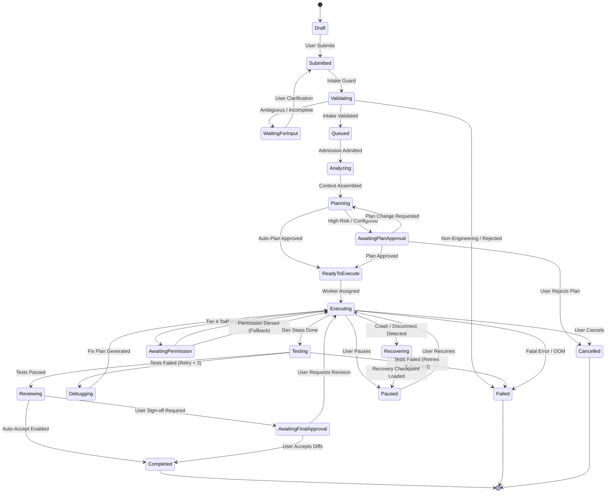
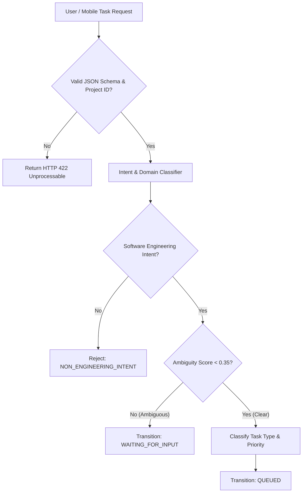
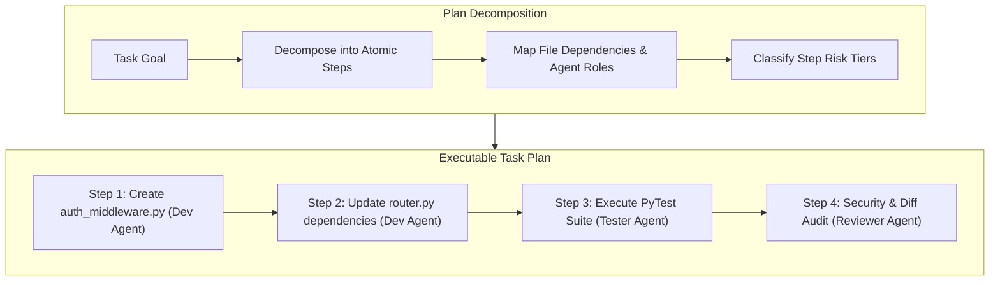
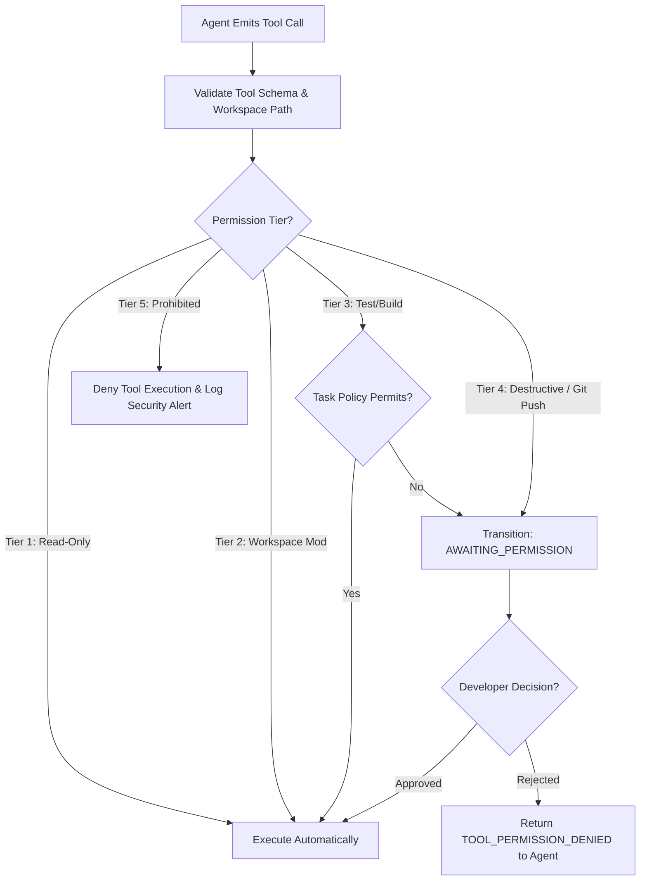
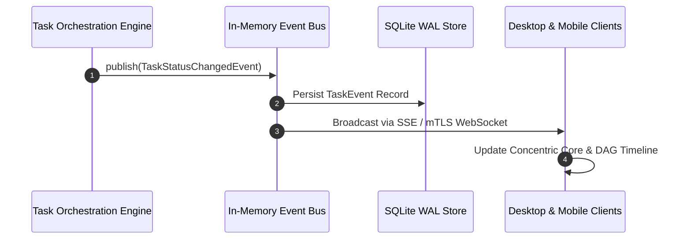
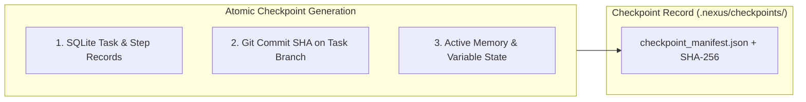
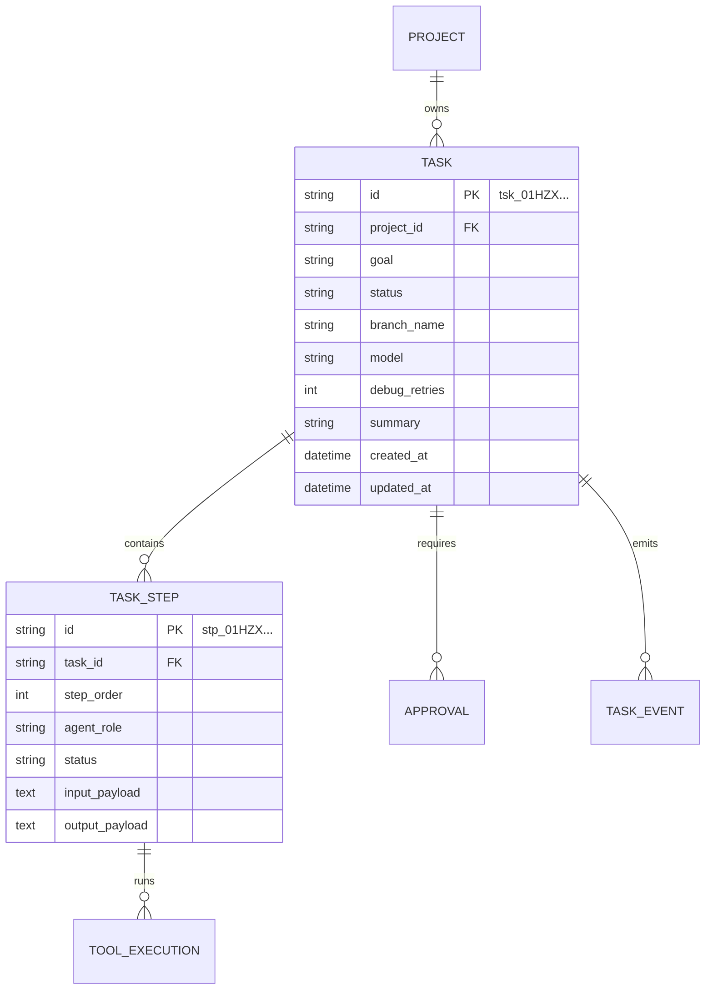
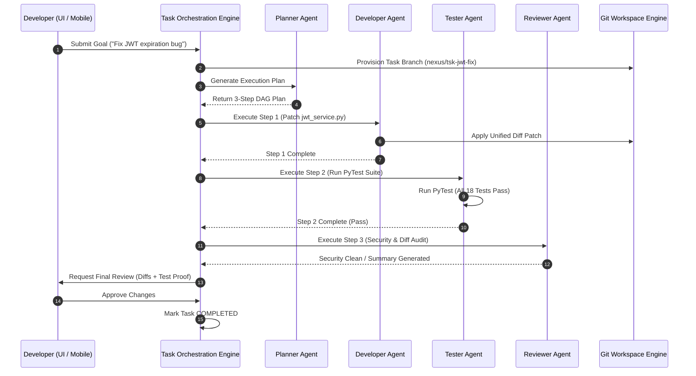
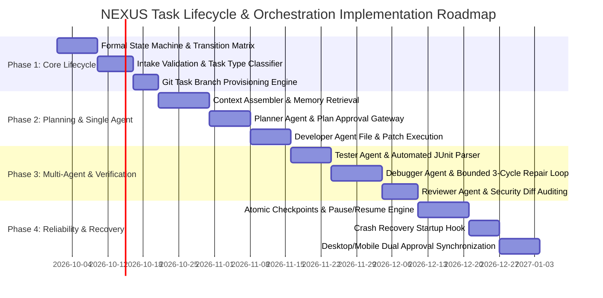

# NEXUS — Task Lifecycle & Execution Orchestration Architecture

**Document Version:** 1.0.0  
**Status:** Approved Production Architecture Baseline  
**Classification:** Core Agent Orchestration, Task Lifecycle & Execution Governance  
**Target Systems:** NEXUS Desktop (Windows x64 Native / Tauri + FastAPI Engine) & NEXUS Mobile Companion (Android Node)  
**Primary Sources of Truth:**
- `docs/PRD.md` (v1.0.0)
- `docs/NEXUS_TECH_STACK.md` (v1.0.0)
- `docs/NEXUS_BACKEND_ARCHITECTURE.md` (v1.0.0)
- `docs/NEXUS_SECURITY_ARCHITECTURE.md` (v1.0.0)
- `docs/NEXUS_OBSERVABILITY_ARCHITECTURE.md` (v1.0.0)
- `docs/NEXUS_BACKUP_AND_DISASTER_RECOVERY_ARCHITECTURE.md` (v1.0.0)
- `docs/NEXUS_PERFORMANCE_AND_RESOURCE_ARCHITECTURE.md` (v1.0.0)
- `docs/NEXUS_API_GATEWAY_AND_INTEGRATION_ARCHITECTURE.md` (v1.0.0)

---

## 1. Executive Summary

NEXUS is an autonomous, **local-first AI Software Engineering Command Center**. It coordinates software-engineering workflows through specialized agents (Planner, Developer, Tester, Debugger, Security, Reviewer), controlled tools, local sandboxing, automated validation loops, and mandatory human approval gates.

NEXUS is not an open-ended chatbot or conversational wrapper. It is a deterministic engineering execution platform where every task follows a formal state machine, produces immutable checkpoints, isolates workspace mutations within dedicated Git branches, and verifies code correctness through automated test execution before presenting results for human sign-off.

```
+---------------------------------------------------------------------------------------------------+
|                                 NEXUS TASK ORCHESTRATION FLOW                                     |
+---------------------------------------------------------------------------------------------------+
|  [ User / Mobile Goal ] ──> [ Intake & Validation ] ──> [ Context Assembly & RAG ]               |
|                                                                    │                              |
|                                                                    ▼                              |
|  [ Review & Human Sign-off ] <── [ Verification Loop ] <── [ Multi-Agent DAG Plan ]               |
|  (Summary, Diffs, Test Proof)    (Tester -> Debugger)      (Planner -> Developer)                 |
+---------------------------------------------------------------------------------------------------+
```

### 1.1 Objectives of the Orchestration Architecture
1. **Deterministic Execution over Conversational Drift**: Tasks advance through explicit state transitions backed by SQLite transactional commits, eliminating hallucinations of task progress.
2. **Evidence-Based Completion**: A task is never marked complete solely because an LLM claims it is done. Completion requires passing automated test suites, security policy verification, and human acceptance.
3. **Bounded Self-Healing**: Automated debugging loops are strictly capped (max 3 retry cycles) with regression safeguards to prevent runaway compute or infinite repair cycles.
4. **Zero Uncontrolled Side-Effects**: All file modifications occur on isolated task branches (`nexus/tsk_<id>-<slug>`). Destructive actions (e.g., file deletions, package installations, Git pushes) enforce mandatory Human-in-the-Loop approval.

---

## 2. Scope and Non-Goals

### 2.1 Scope Taxonomy

| Dimension | MVP (Phase 1) | V1 (Phase 2) | Future (Phase 3) |
| :--- | :--- | :--- | :--- |
| **Orchestration Topology** | Sequential 6-Stage Pipeline | Dynamic Multi-Branch DAG | Hierarchical Multi-Agent Swarms |
| **Agent Execution** | Single-Agent Turn-Taking | Parallel Subtask Execution | Dynamic Sub-Agent Spawning |
| **Self-Healing Loop** | Bounded 3-Cycle Test/Debug Loop | AST-Guided Root Cause Analysis | Historical Learning & Patch Replay |
| **Checkpoints & Recovery** | SQLite State & Git Head Snapshots | Step-Level Diff Rollback Staging | Distributed Checkpoint Synchronization |
| **Client Control** | Desktop Direct + Mobile Approval | Mobile Full Task Intake & Control | Voice/Natural Command Streaming |

### 2.2 Desktop vs. Android Responsibilities
- **Windows Desktop Command Center**: Primary execution and data-owning host. Owns the task state machine, executes agent models, runs sandboxed tools, performs Git operations, and manages SQLite persistence.
- **Android Companion Node**: Remote monitoring and human approval interface. Submits task goals, views real-time DAG execution progress, inspects unified diffs, and submits cryptographic approval/rejection decisions.

### 2.3 Explicit Non-Goals
1. **No Open-Ended General Chat**: NEXUS rejects non-software-engineering requests (e.g., generic trivia, creative writing) at the intake validation layer.
2. **No Unbounded Autonomous Loops**: Agents cannot spawn infinite subtasks, bypass approval gates, or re-run failed test suites indefinitely.
3. **No Direct Unchecked Branch Merging**: NEXUS will never merge task branches into `main` or `master` without explicit developer confirmation.

---

## 3. Confirmed Architectural Decisions & Standards

1. **State Machine Persistence**: Task state is stored in SQLite table `tasks` with monotonic transition enforcement (`VALID_TASK_TRANSITIONS` table).
2. **Task Branch Isolation**: Every coding task automatically provisions an isolated Git branch: `nexus/{task_id}-{sanitized_goal_slug}`.
3. **Structured Event Bus**: Orchestration events stream across internal async queues and emit to clients via Server-Sent Events (`/api/v1/stream/events`) and mTLS WebSockets (`/ws/v1/companion`).
4. **5-Tier Permission Integration**: Tool calls route through the `ToolExecutionService` as defined in [`docs/NEXUS_SECURITY_ARCHITECTURE.md`](file:///c:/Users/user/OneDrive/Documents/NEXUS/docs/NEXUS_SECURITY_ARCHITECTURE.md).

---

## 4. Task Lifecycle State Machine

The task lifecycle state machine governs all task transitions. Tasks flow through 20 formally defined states across four operational phases: **Intake**, **Planning**, **Execution & Verification**, and **Finalization**.



### 4.1 Comprehensive State Transition Matrix

| State | Definition & Operational Scope | Allowed Transitions | Responsible Actor | Persisted State Fields | Timeout / Recovery Policy |
| :--- | :--- | :--- | :--- | :--- | :--- |
| **`Draft`** | Task initialized in UI; user drafting prompt and attaching files. | `Submitted`, `Cancelled` | Desktop/Mobile UI | `goal`, `project_id`, `attachments` | None (Client ephemeral) |
| **`Submitted`** | Task received by API; queued for intake validation. | `Validating`, `Cancelled` | TaskService | `status="submitted"`, `created_at` | 30s timeout $\rightarrow$ `Failed` |
| **`Validating`** | Intake validation engine inspecting goal, repo scope, and safety. | `Queued`, `WaitingForInput`, `Failed` | IntakeValidator | `validation_errors`, `task_type` | 15s timeout $\rightarrow$ `Failed` |
| **`WaitingForInput`**| Goal is ambiguous or missing required project context; awaiting user. | `Submitted`, `Cancelled` | User (Human) | `clarification_prompt` | 24h expiration $\rightarrow$ `Cancelled` |
| **`Queued`** | Task validated; waiting in priority admission queue for hardware slot. | `Analyzing`, `Cancelled` | AdmissionScheduler | `queue_priority`, `queued_at` | Starvation aging (30s boost) |
| **`Analyzing`** | Workspace context assembly, AST retrieval, and memory palace queries. | `Planning`, `Failed`, `Cancelled` | ContextAssembler | `context_manifest`, `file_manifest` | 60s timeout $\rightarrow$ `Failed` |
| **`Planning`** | Planner Agent decomposing goal into executable DAG steps. | `AwaitingPlanApproval`, `ReadyToExecute`, `Failed`| Planner Agent | `task_plan_json`, `estimated_steps`| 120s timeout $\rightarrow$ `Failed` |
| **`AwaitingPlanApproval`**| Plan generated; waiting for developer review and confirmation. | `ReadyToExecute`, `Planning`, `Cancelled` | Developer (Human) | `plan_approval_request_id` | Configurable (Default: None) |
| **`ReadyToExecute`** | Plan finalized and branch created; ready for execution worker. | `Executing`, `Cancelled` | Orchestrator | `branch_name`, `target_commit` | Immediate dispatch |
| **`Executing`** | Developer Agent actively executing plan steps and modifying code. | `AwaitingPermission`, `Testing`, `Paused`, `Failed`| Developer Agent | `active_step_id`, `modified_files` | Step timeout (180s/step) |
| **`AwaitingPermission`**| Agent requested Tier 4/5 tool (e.g. `rm -rf`, `git push`); paused. | `Executing`, `Failed`, `Cancelled` | Developer (Human) | `approval_request_id`, `diff_cache`| 1h timeout $\rightarrow$ Auto-Deny |
| **`Testing`** | Tester Agent running unit, integration, and lint test suites. | `Debugging`, `Reviewing`, `Failed` | Tester Agent | `test_run_id`, `junit_results` | Test timeout (300s) |
| **`Debugging`** | Tests failed; Debugger Agent analyzing stack trace and drafting fix. | `Executing`, `Failed`, `Cancelled` | Debugger Agent | `debug_retries`, `root_cause_json`| Max 3 retries $\rightarrow$ `Failed` |
| **`Reviewing`** | Reviewer Agent running security audit, AST diff checks, and summary. | `AwaitingFinalApproval`, `Completed`, `Failed` | Reviewer Agent | `review_summary`, `security_score` | 60s timeout $\rightarrow$ `Failed` |
| **`AwaitingFinalApproval`**| Task executed and verified; awaiting developer review of diffs. | `Completed`, `Executing`, `Cancelled` | Developer (Human) | `final_approval_id`, `diff_stat` | None (Awaits developer action) |
| **`Completed`** | Task successfully completed, verified, and signed off. (Terminal) | None | Orchestrator | `status="completed"`, `completed_at`| Immutable state record |
| **`Failed`** | Task failed due to unrecoverable error or test exhaustion. (Terminal)| None | Orchestrator | `status="failed"`, `error_message` | Preserves checkpoint for debug |
| **`Cancelled`** | Task cancelled by user; active tools aborted and branch saved. (Terminal)| None | User (Human) | `status="cancelled"`, `cancelled_at`| Cleans temp sandboxes |
| **`Paused`** | Task paused by user; workspace state checkpointed. | `Executing`, `Cancelled` | User (Human) | `checkpoint_id`, `paused_at` | Persisted until resumed |
| **`Recovering`** | System restarted mid-task; restoring last valid SQLite checkpoint. | `Paused`, `Executing`, `Failed` | RecoveryEngine | `recovery_attempt_count` | Transition to `Paused` if manual |

---

## 5. Task Intake and Classification

The Intake subsystem ensures that only actionable, well-formed software engineering tasks enter the execution pipeline.



### 5.1 Task Type Classification Matrix

| Task Type | Description | Targeted Agent DAG | Default Validation Gate |
| :--- | :--- | :--- | :--- |
| **`FEATURE_DEV`** | New feature implementation, module creation, or API expansion. | Planner $\rightarrow$ Dev $\rightarrow$ Test $\rightarrow$ Security $\rightarrow$ Review | Mandatory Plan & Final Approval |
| **`BUG_FIX`** | Bug investigation, regression fix, and test reproduction. | Debugger $\rightarrow$ Dev $\rightarrow$ Test $\rightarrow$ Review | Automated Plan / Human Final |
| **`REFACTOR`** | Code cleanup, AST optimization, or architectural migration. | Planner $\rightarrow$ Dev $\rightarrow$ Test $\rightarrow$ Review | Strict Regression Test Gate |
| **`TEST_CREATION`**| Writing unit, integration, or property-based tests. | Tester $\rightarrow$ Dev $\rightarrow$ Test $\rightarrow$ Review | Test Suite Execution Gate |
| **`SECURITY_AUDIT`**| Vulnerability scan, secret leak inspection, dependency audit. | Security $\rightarrow$ Reviewer | Read-Only Automated Gate |
| **`REPO_EXPLORE`** | Architectural exploration, code search, or question answering. | Planner $\rightarrow$ Reviewer (Read-Only) | Read-Only (No Git Branch) |

### 5.2 Non-Engineering Rejection Policy
NEXUS rejects requests unrelated to software engineering (e.g., general conversational queries, creative writing, non-technical advice) with an explicit error:
```json
{
  "error": {
    "code": "TASK_REJECTED_NON_ENGINEERING",
    "message": "NEXUS is a software engineering execution platform. The submitted prompt does not target a codebase or development workflow.",
    "category": "INTAKE_VALIDATION_ERROR"
  }
}
```

---

## 6. Context Assembly and Memory Retrieval

Before planning or code generation commences, the **Context Assembler** constructs a targeted, project-isolated context window.

```
+---------------------------------------------------------------------------------------------------+
|                                 CONTEXT ASSEMBLY BUDGET (32K TOKENS)                              |
+---------------------------------------------------------------------------------------------------+
| [ Project & Git Metadata ] | [ Target Source Files ] | [ Semantic RAG Chunks ] | [ Task Memory ]  |
| 2,000 Tokens (6%)          | 18,000 Tokens (56%)     | 8,000 Tokens (25%)      | 4,000 Tokens (13%)|
+---------------------------------------------------------------------------------------------------+
```

### 6.1 Assembly Pipeline Stages
1. **Workspace Boundary Enforcement**: Resolves project root directory; strictly isolates AST search to the active project path.
2. **Git & Environment State**: Ingests active branch name, clean/dirty working tree status, recent commits ($N=5$), and detected toolchains (`package.json`, `Cargo.toml`, `pyproject.toml`).
3. **Target File Identification**: Scans explicit user attachments, planner-selected file paths, and imports referenced by AST dependencies.
4. **Vector Retrieval (ChromaDB / SQLite FTS5)**: Queries top-k semantic code chunks ($k=10$) matching the task goal.
5. **Memory Palace Retrieval**: Ingests project-level architectural decisions and past task learnings from `.nexus/memory/`.

---

## 7. Planning and Execution Strategy

The **Planner Agent** converts the validated task into a directed acyclic graph (DAG) of executable steps.



### 7.1 Plan Schema Specification
```json
{
  "plan_id": "plan_01HZX88ABC123",
  "task_id": "tsk_01HZX89QWE789",
  "goal": "Implement JWT Refresh Token Flow",
  "estimated_duration_seconds": 180,
  "steps": [
    {
      "step_order": 1,
      "agent_role": "DEVELOPER",
      "action_type": "FILE_WRITE",
      "target_file": "src/auth/jwt_service.py",
      "description": "Implement refresh token generation and rotation logic.",
      "risk_tier": 2,
      "tools_required": ["write_file", "read_file"]
    },
    {
      "step_order": 2,
      "agent_role": "TESTER",
      "action_type": "TEST_EXECUTION",
      "target_file": "tests/test_jwt.py",
      "description": "Execute pytest suite covering token expiration.",
      "risk_tier": 3,
      "tools_required": ["run_pytest"]
    }
  ]
}
```

---

## 8. Specialized Agent Coordination

NEXUS utilizes a team of six specialized agents. Each agent operates under a strict role contract, context boundary, and tool permission mask.

```
+---------------------------------------------------------------------------------------------------+
|                                 SPECIALIZED AGENT RESPONSIBILITY MATRIX                           |
+---------------------------------------------------------------------------------------------------+
| Agent Role  | Primary Purpose                  | Permitted Tools             | Input / Output Contract |
|-------------|----------------------------------|-----------------------------|-------------------------|
| Planner     | Decomposes goal into DAG plan.   | read_file, grep, list_dir   | In: Goal -> Out: Plan   |
| Developer   | Writes code and applies patches. | write_file, patch_file      | In: Step -> Out: Diffs  |
| Tester      | Runs tests and validates logic.  | run_test, cargo, npm, pytest| In: Code -> Out: JUnit  |
| Debugger    | Analyzes stack traces and fixes. | read_file, patch_file, grep | In: Err  -> Out: Patch  |
| Security    | Scans AST for vulnerabilities.   | semgrep, bandit, secret_scan| In: Diff -> Out: Audit  |
| Reviewer    | Summarizes changes & verifies.   | git_diff, ast_inspect       | In: Task -> Out: Report |
+---------------------------------------------------------------------------------------------------+
```

### 8.1 Agent Inter-Communication Protocol
Agents communicate exclusively through structured SQLite records (`task_steps` and `task_events`). Agents do not engage in unconstrained conversational chatter, preventing context drift and hallucinated delegations.

---

## 9. Tool Execution and Permission Gates

All agent tool requests route through the **5-Tier Permission & Safety Gate** before host execution.



### 9.1 Tool Execution Safeguards
1. **Workspace Sandboxing**: File operations targeting paths outside the active project root (`..` directory traversal) are rejected immediately.
2. **Windows Job Object Quotas**: Subprocess commands are restricted to **2,048 MB RAM**, **32 Child PIDs**, and **180s timeouts**.
3. **Secret Redaction**: Tool outputs undergo regex redaction before recording in database logs.

---

## 10. Execution, Progress, and Event Model

NEXUS emits structured domain events to keep Desktop and Mobile clients synchronized in real time.



### 10.1 Complete Event Taxonomy
- `TaskCreated`: Task initialized with user goal.
- `TaskValidated`: Task schema and domain validated.
- `PlanGenerated`: Planner decomposed goal into DAG.
- `PlanApproved`: Human developer accepted execution plan.
- `AgentStarted`: Specialized agent assigned to active step.
- `AgentProgressUpdated`: Intermediate progress indicator emitted.
- `ToolExecutionStarted`: Sandboxed tool invocation launched.
- `ToolExecutionCompleted`: Tool returned stdout/stderr and exit code.
- `ApprovalRequested`: Tier 4 action paused for human decision.
- `ApprovalResolved`: Human decision (`APPROVED`/`REJECTED`) processed.
- `TestStarted`: Test suite execution triggered.
- `TestCompleted`: JUnit XML parsed and pass/fail recorded.
- `DebuggingStarted`: Test failure routed to Debugger agent.
- `CheckpointCreated`: Task state and Git snapshot committed.
- `TaskPaused`: Execution safely suspended by user.
- `TaskResumed`: Execution restored from checkpoint.
- `TaskFailed`: Execution halted due to fatal error.
- `TaskCompleted`: Task verified and final approval granted.

---

## 11. Checkpoints, Pause, Resume, and Cancellation

NEXUS provides atomic checkpointing to survive software crashes, OS reboots, and developer pauses.



### 11.1 Cancellation Semantics
1. **Immediate Subprocess Termination**: Fires cancellation token to active Windows Job Object or Docker container, invoking `TerminateJobObject()` within 100 ms.
2. **Local Model Socket Abort**: Closes HTTP socket connection to Ollama/remote LLM daemon, instantly halting GPU token generation.
3. **Workspace Preservation**: Retains task branch `nexus/tsk_<id>` with all uncommitted diffs staged as a checkpoint commit (`[NEXUS_CHECKPOINT] Task cancelled by user`).

---

## 12. Testing, Debugging, and Self-Healing Loop

The self-healing verification loop guarantees code correctness before task completion.

```mermaid
flowchart TD
    DevComplete[Developer Completes Code Changes] --> RunTests[Tester Runs Automated Tests]
    RunTests --> TestResult{All Tests Pass?}
    
    TestResult -- "Pass" --> SecurityScan[Security & Diff Review]
    TestResult -- "Fail" --> RetryCount{Debug Retries < 3?}
    
    RetryCount -- "Yes (Retries 1-3)" --> DebugAgent[Debugger Analyzes Stack Trace]
    DebugAgent --> GenFix[Generate Targeted Code Fix]
    GenFix --> ApplyFix[Apply Patch to Task Branch]
    ApplyFix --> RunTests
    
    RetryCount -- "No (3 Retries Exhausted)" --> EscalateHuman[Transition: FAILED (Escalate to User)]
    SecurityScan --> FinalApproval[Transition: AWAITING_FINAL_APPROVAL]
```

### 12.1 Regression Prevention Rules
- The Debugger agent is provided the test execution history of **all prior iterations**.
- If a proposed fix causes previously passing tests to fail (regression), the fix is automatically discarded, and the Debugger must re-analyze the root cause.

---

## 13. Human-in-the-Loop Approval Architecture

Human governance is an immutable requirement of the NEXUS architecture.

```
+---------------------------------------------------------------------------------------------------+
|                                 HUMAN APPROVAL GATEWAYS                                           |
+---------------------------------------------------------------------------------------------------+
| 1. Plan Approval Gate: Review proposed subtasks, affected files, and estimated risk.              |
| 2. Tool Permission Gate: Authorize Tier 4 destructive actions (e.g. git push, delete).            |
| 3. Final Acceptance Gate: Review unified diffs, test evidence, and reviewer summary.              |
+---------------------------------------------------------------------------------------------------+
```

- **Zero Silent Approval**: Missing approval responses never default to acceptance. Approval requests time out to a safe `REJECTED` state.
- **Dual-Device Synchronization**: Approvals appear simultaneously on Desktop UI and Android Companion. Resolving on one node instantly updates the other via WebSocket broadcast.

---

## 14. Failure Handling and Recovery Playbooks

| Failure Category | Detection Method | Automated Containment | Rollback & Recovery Action | User Notification |
| :--- | :--- | :--- | :--- | :--- |
| **`INVALID_TASK_INPUT`** | Schema validator fails. | Reject request; no DB write. | Return HTTP 422 with field errors. | "Task description missing or invalid." |
| **`MODEL_UNAVAILABLE`** | Ollama socket connection refused. | Queue task in `QUEUED` state. | Retry connection (3 attempts, 2s backoff); fallback to configured secondary model. | "Local model daemon offline. Retrying..." |
| **`AGENT_STEP_TIMEOUT`** | Step execution exceeds 180s. | Fire cancellation token to worker.| Abort step; spawn Debugger agent to diagnose hang. | "Agent step timed out. Diagnosing..." |
| **`TOOL_OOM_KILLED`** | Windows Job Object / Docker exit 137.| Terminate subprocess tree. | Mark step `FAILED_OOM`; record memory limit violation. | "Build tool exceeded 2GB memory quota." |
| **`GIT_MERGE_CONFLICT`** | Git patch application returns error. | Abort patch application. | Rebase task branch against current project HEAD; retry diff. | "Merge conflict detected during patch." |
| **`TEST_REPAIR_EXHAUSTED`**| Debug retry counter reaches 3. | Halt self-healing loop. | Transition task to `FAILED`; preserve diffs for manual developer fix. | "Automated test repair exhausted (3 attempts)." |
| **`UNEXPECTED_SHUTDOWN`** | Orphaned `EXECUTING` task on startup.| Read last SQLite checkpoint. | Transition task to `PAUSED`; load last committed Git SHA. | "Task recovered from unexpected shutdown." |

---

## 15. Data and Persistence Alignment

The task orchestration system maps directly to the authoritative SQLite schema established in [`docs/NEXUS_BACKEND_ARCHITECTURE.md`](file:///c:/Users/user/OneDrive/Documents/NEXUS/docs/NEXUS_BACKEND_ARCHITECTURE.md).



---

## 16. Security, Privacy, and Isolation

1. **Strict Project Isolation**: Orchestration processes are pinned to the active project workspace root. No cross-project context leakage is permitted.
2. **Untrusted LLM Output Containment**: Generated code and shell commands are treated as untrusted strings, requiring structural schema validation before execution.
3. **Secret Redaction**: Credentials, tokens, and private keys are redacted from task events, logs, and database records before persistence.

---

## 17. Resource Management and Concurrency

Aligned with [`docs/NEXUS_PERFORMANCE_AND_RESOURCE_ARCHITECTURE.md`](file:///c:/Users/user/OneDrive/Documents/NEXUS/docs/NEXUS_PERFORMANCE_AND_RESOURCE_ARCHITECTURE.md):
- **Task Concurrency**: Capped at **1 Active Task** (Low-Resource), **2 Active Tasks** (Mid-Range), or **4 Active Tasks** (Pro Workstation).
- **LLM Inference**: Serialized via global `asyncio.Semaphore(1)`.
- **Disk Safety**: Tasks pause if available workspace disk space drops below **5.0 GB**; tasks freeze if space drops below **2.0 GB**.

---

## 18. User Experience & Telemetry Presentation

NEXUS translates internal state transitions into clear, human-readable status indicators for the Desktop Command Center and Mobile Companion:

```
+---------------------------------------------------------------------------------------------------+
|                                HUMAN-READABLE TELEMETRY DISPLAY                                   |
+---------------------------------------------------------------------------------------------------+
| State                  | User-Facing Status Display                                                |
|------------------------|--------------------------------------------------------------------------|
| `ANALYZING`            | "Inspecting repository AST and assembling context..."                    |
| `PLANNING`             | "Planner Agent decomposing task into 4 executable steps..."              |
| `EXECUTING`            | "Developer Agent updating src/auth/jwt_service.py (Step 2 of 4)..."       |
| `AWAITING_PERMISSION`  | "Action Required: Approve file deletion in src/legacy/..."               |
| `TESTING`              | "Tester Agent executing PyTest suite (14 tests)..."                       |
| `DEBUGGING`            | "Test failure detected. Debugger Agent analyzing stack trace (Attempt 1)..."|
| `AWAITING_FINAL_APPR`  | "Task ready for review. 3 files modified (+45 / -12 lines). Tests passed."|
| `COMPLETED`            | "Task completed successfully. Changes staged on branch nexus/tsk_123."    |
+---------------------------------------------------------------------------------------------------+
```

---

## 19. Architectural Diagrams

### 19.1 End-to-End Task Execution Sequence



---

## 20. API and Integration Alignment

The task orchestration engine integrates with existing endpoints in `services/backend/src/nexus/api/endpoints/`:
- `POST /api/v1/projects/{project_id}/tasks`: Intake and goal submission.
- `GET /api/v1/projects/{project_id}/tasks/{task_id}`: Read task state.
- `POST /api/v1/projects/{project_id}/tasks/{task_id}/run`: Launch execution.
- `POST /api/v1/approvals/{approval_id}/decision`: Submit human approval decision.
- `GET /api/v1/stream/events`: Subscribe to real-time execution event stream.

---

## 21. Testing and Acceptance Strategy

### 21.1 Test Suite Matrix
1. **State Machine Unit Tests**: Exhaustive validation of `VALID_TASK_TRANSITIONS`. Verify invalid transitions (e.g., `CREATED -> COMPLETED`) raise `InvalidStateTransitionError`.
2. **Self-Healing Loop Integration Tests**: Mock failing test runs; verify Debugger agent executes exactly 3 retry cycles before transitioning to `FAILED`.
3. **Approval Gate Security Tests**: Verify Tier 4 tool invocations block until signed approval token is submitted; verify unauthorized invocations raise HTTP 403.
4. **Crash Recovery Drills**: Force kill backend process during `EXECUTING` state; verify startup recovery loads last checkpoint and transitions task to `PAUSED`.

---

## 22. Implementation Roadmap



---

## 23. Risk Register and Open Decisions

### 23.1 Risk Register

| ID | Risk Description | Likelihood | Impact | Mitigation Strategy | Owner | Verification Method |
| :--- | :--- | :--- | :--- | :--- | :--- | :--- |
| `R-ORCH-01` | **Infinite Debugging Loops**: Debugger oscillates between two conflicting test failures. | Medium | High | Enforce strict 3-retry maximum; track regression failure history across cycles. | Agent Lead | Self-healing oscillation test harness. |
| `R-ORCH-02` | **Orphaned Subprocesses on Cancellation**: Background build commands continue running after user cancels task. | Medium | High | Windows Job Objects automatically terminate entire child process trees on cancel. | Systems Lead | Process tree cancellation test drill. |
| `R-ORCH-03` | **Task Branch Drift**: Developer commits to `main` while long-running task executes on task branch. | High | Medium | Task branch rebases automatically before test execution; warns user on conflict. | Workspace Lead | Git rebase conflict simulation. |

### 23.2 Register of Open Decisions

| ID | Topic | Current Recommendation / Status | Impact / Next Action |
| :--- | :--- | :--- | :--- |
| `OD-ORCH-01` | **Default Plan Approval Policy** | Require plan approval for `FEATURE_DEV` and `REFACTOR`; auto-approve `BUG_FIX` and `TEST_CREATION`. | Product team sign-off on approval preset defaults. |
| `OD-ORCH-02` | **Task Branch Cleanup Policy** | Retain task branches for 30 days after completion; delete branches for cancelled tasks on user prompt. | Verify disk utilization impact on large Git repos. |
| `OD-ORCH-03` | **Maximum Concurrent Subtasks** | Limit subtask parallelism to 2 concurrent agents on multi-core systems; serialize on laptops. | Benchmark concurrency performance on 8-core workstations. |

---

## 24. Definition of Done

The NEXUS Task Lifecycle & Execution Orchestration Architecture is complete and approved when:
- [x] All 20 task lifecycle states and transitions are formally defined.
- [x] Task intake validation and non-engineering rejection rules are established.
- [x] Context assembly budget (32K tokens) and memory palace retrieval are specified.
- [x] Planner DAG decomposition and step schemas are documented.
- [x] Responsibility matrices and contracts for all 6 specialized agents are defined.
- [x] 5-Tier tool permission gates and sandbox safeguards are detailed.
- [x] Complete 18-event domain taxonomy and WebSocket/SSE broadcast pipeline are documented.
- [x] Checkpoint persistence, atomic pause/resume, and cancellation semantics are specified.
- [x] Bounded self-healing loop (max 3 retries) and regression safeguards are detailed.
- [x] Human approval gates and dual-device synchronization are defined.
- [x] 7 comprehensive failure playbooks and recovery procedures are documented.
- [x] Alignment with SQLite database schema and REST API endpoints is verified.
- [x] 7 Mermaid diagrams illustrating all lifecycle flows are included.
- [x] Phased implementation roadmap (Phases 1–4) with risk register and open decisions is complete.

---

## 25. Summary & Implementation Synthesis

### 25.1 Architecture Summary
The **NEXUS Task Lifecycle & Execution Orchestration Architecture** establishes a resilient, deterministic execution engine for autonomous software engineering. By combining **Formal State Machine Transitions**, **Git Branch Task Isolation**, **Multi-Agent DAG Planning**, **Bounded Self-Healing Loops (Max 3 Retries)**, and **Mandatory Human Approval Gates**, NEXUS delivers reliable, verifiable software engineering workflows with zero uncontrolled side-effects.

### 25.2 Core Orchestration Rules
1. **Branch Isolation**: All coding tasks execute on isolated `nexus/tsk_<id>` Git branches.
2. **Evidence-Based Completion**: Tasks require passing test suites and human sign-off before completion.
3. **Bounded Self-Healing**: Automated debug loops terminate after 3 failed repair cycles.
4. **Immediate Cancellation**: Subprocesses and LLM sockets terminate within 100 ms of user cancellation.

### 25.3 Recommended Implementation Sequence
1. Implement `VALID_TASK_TRANSITIONS` state machine engine in `services/backend/src/nexus/models/task.py`.
2. Implement Git task branch provisioning and rollback hooks in `WorkspaceService`.
3. Implement `PlannerAgent` DAG decomposition and structured JSON schema validation.
4. Implement `TesterAgent` automated test execution and JUnit XML parser.
5. Deploy `DebuggerAgent` bounded 3-cycle repair loop and regression protection engine.

---

## 26. Next Logical NEXUS Architecture Document

The recommended next document in the NEXUS master architecture series is:  
**`docs/NEXUS_AGENT_ROLES_PROMPTS_AND_COORDINATION_SPEC.md`**  
*(Focus: Formal prompt engineering contracts, system prompts, few-shot exemplars, structured JSON response schemas, and inter-agent message payloads for Planner, Developer, Tester, Debugger, Security, and Reviewer agents).*
