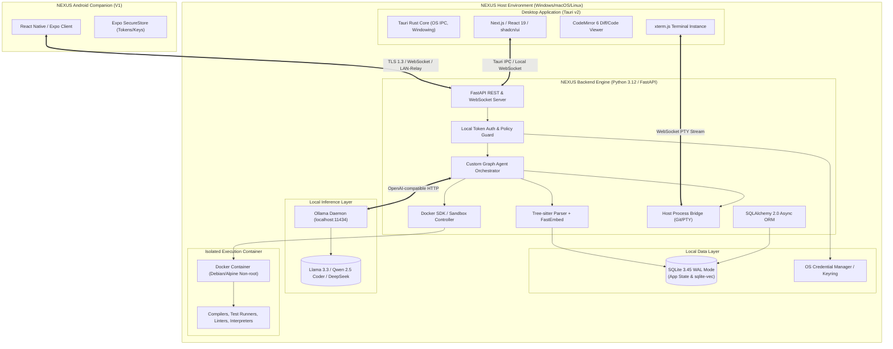
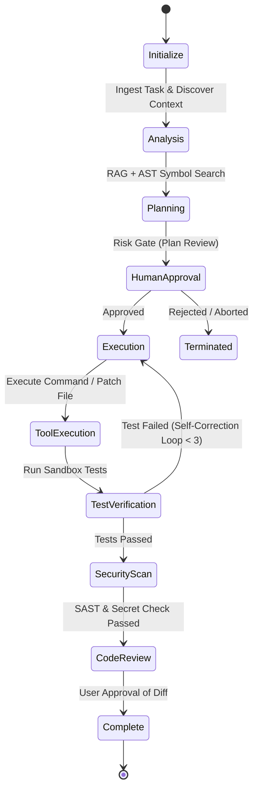
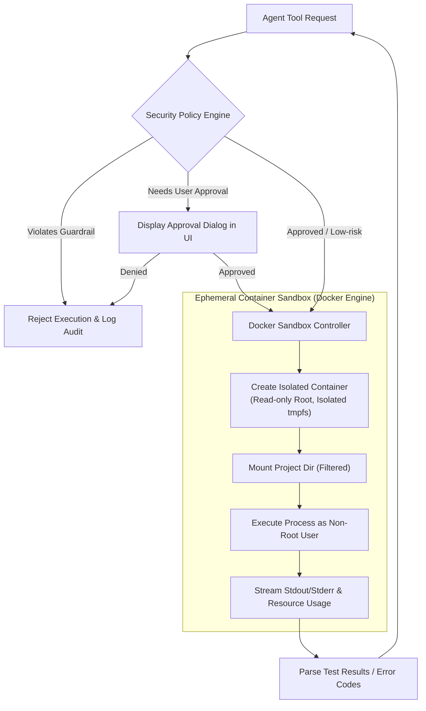
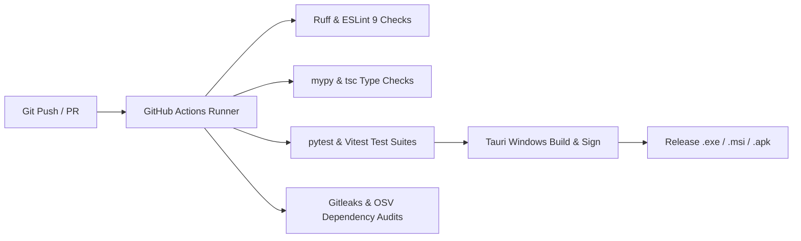
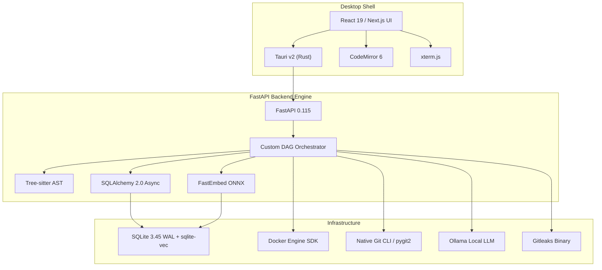
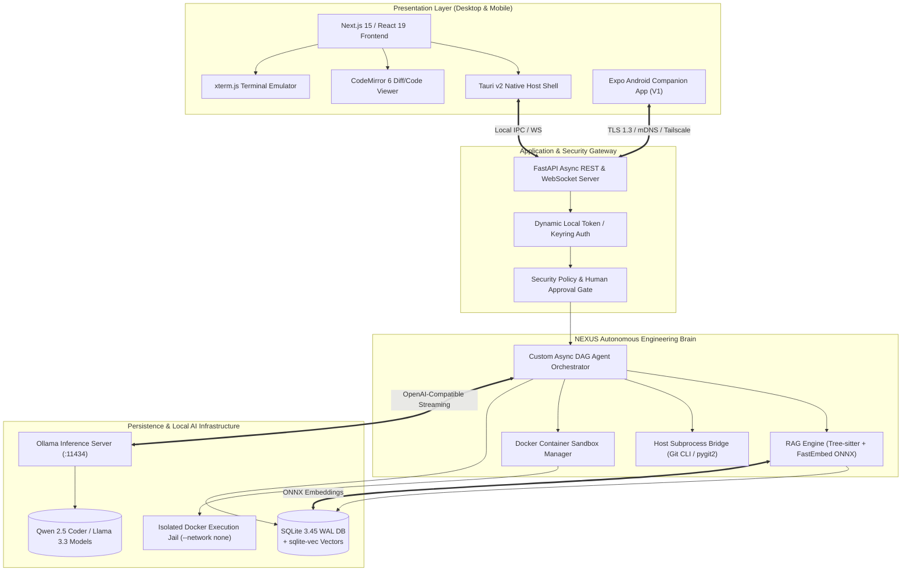

# NEXUS — Complete Technology Stack Document
**Document Version:** 1.0.0  
**Status:** Approved Architecture Baseline  
**Classification:** Technical Architecture Specification  
**Primary Sources of Truth:** `NEXUS_PRD.md` (v1.0.0), `NEXUS_DESIGN_DOC.md` (v1.0.0)

---

## 1. Executive Summary

NEXUS is an autonomous, **local-first AI Software Engineer** designed to operate as an integrated digital peer on developer workstations. Unlike traditional autocomplete engines or stateless chat interfaces, NEXUS plans, edits, builds, sandboxes, tests, secures, and reviews non-trivial codebases while executing strictly within user-defined security envelopes.

This **Technology Stack Document** defines the definitive, production-grade technical choices across every layer of the NEXUS desktop application, companion mobile application, backend engine, orchestration framework, and containerized execution infrastructure. Every technology selection is anchored in strict design principles: **Local-First**, **Privacy-First**, **Open-Source-First**, **Secure-by-Default**, **Model-Agnostic**, **Zero Unnecessary Bloat**, and **Defensible Long-Term Maintainability**.

---

## 2. Product Technical Context

| Dimension | Target Profile | Architectural Implication |
| :--- | :--- | :--- |
| **Primary Platform** | Windows 10/11 x64 (Primary MVP), macOS/Linux (V1) | Low-overhead desktop shell with native OS integration (PTY, Credential Manager, Docker Desktop). |
| **Companion Platform**| Android 10+ (V1 Companion) | Encrypted peer-to-peer / LAN / Tailscale relay for monitoring, approvals, and queue management. |
| **Execution Domain** | Air-gapped / Local-first developer environment | Zero telemetry leakage; all embeddings, models, parsers, DBs, and tools must execute on localhost. |
| **Workload Profile** | Multi-modal concurrent (LLM inference, AST parsing, Docker sandboxing, DB indexing) | Stringent memory budgeting, CPU thread throttling, and explicit GPU offloading policies. |
| **Security Envelope**| Autonomous shell/code execution capability | Mandatory defense-in-depth: AST verification, policy gates, Docker cgroups, PTY virtualization. |

---

## 3. Technology Selection Principles

1. **Local-First & Offline Sovereignty:** Core operations (analysis, planning, editing, testing, RAG) must operate at 100% efficacy without active internet connectivity.
2. **Privacy-First Data Isolation:** Proprietary code, prompts, vector embeddings, and tool outputs never leave the local boundary without explicit human-in-the-loop consent.
3. **Open-Source-First (Permissive Preferred):** MIT, Apache 2.0, and BSD licenses are favored to prevent restrictive redistribution or commercial lock-in.
4. **Minimal Runtime Bloat:** Avoid heavyweight runtime wrappers where lightweight system-native alternatives exist (e.g., Tauri over Electron; async in-memory SQLite/Postgres over complex distributed services where applicable).
5. **Deterministic Security Boundaries:** Privilege separation across Frontend (UI), Application Layer (FastAPI), Agent Controller (Orchestrator), and Execution Sandbox (Docker).
6. **Replaceable & Model-Agnostic Core:** Decouple LLM providers, vector engines, and parsers behind unified abstract base interfaces.

---

## 4. Final Stack Overview

| Layer | Selected Technology | Version / Spec | Primary Purpose | Lifecycle |
| :--- | :--- | :--- | :--- | :--- |
| **Desktop Shell** | **Tauri** | v2.x (Rust) | Native windowing, OS IPC, low memory footprint | MVP |
| **Frontend Framework** | **React / Next.js (SSG)** | React 19 / Next.js 15 | Modern UI layout, server-static compilation for Tauri | MVP |
| **Language (Frontend)**| **TypeScript** | v5.x (Strict) | End-to-end type safety, shared DTO schemas | MVP |
| **Styling & UI Kit** | **Tailwind CSS + shadcn/ui**| v3.4+ / Radix UI | Dark-first technical aesthetic, accessible primitives | MVP |
| **Code Editor** | **CodeMirror 6** | v6.x Modular | Ultra-lightweight AST-aware code & diff inspection | MVP |
| **Terminal Emulator** | **xterm.js + node-pty / Rust PTY**| v5.x | Interactive terminal multiplexer (Host & Docker) | MVP |
| **Backend Framework** | **FastAPI (Python)** | v0.115+ (Python 3.12)| Asynchronous REST, SSE/WebSocket, AI Orchestration | MVP |
| **AI Agent Core** | **Custom Graph Orchestrator**| In-house Async DAG | Deterministic state machine, zero framework lock-in | MVP |
| **AI Local Runtime** | **Ollama** | v0.4+ | Local model serving (Llama 3.3, Qwen 2.5 Coder, DeepSeek)| MVP |
| **AI Provider Abstraction**| **LiteLLM / Custom Adapter**| Open-AI Compatible | Unified interface for Ollama, vLLM, Anthropic, OpenAI | MVP |
| **Embeddings** | **FastEmbed-Python (BGE-Small-EN-v1.5)** | ONNX Runtime | Ultra-fast local CPU/GPU embedding generation | MVP |
| **Code Parser / AST** | **Tree-sitter** | Multi-language bindings| High-speed concrete syntax trees, symbol resolution | MVP |
| **Database** | **SQLite (WAL mode) / PostgreSQL**| SQLite 3.45+ (MVP) / PG 16 (V1)| Zero-config embedded persistence (SQLite) / Scalable RAG | MVP / V1 |
| **Vector Storage** | **sqlite-vec / pgvector** | Native extension | In-process vector indexing (MVP) -> PostgreSQL pgvector (V1)| MVP / V1 |
| **Background Tasks** | **Asyncio Task Engine + SQLite WAL**| Native Async Queue | Zero-dependency background scheduler & event worker | MVP |
| **Code Sandbox** | **Docker Engine (Desktop API)** | v26+ | Isolated ephemeral container execution | MVP |
| **VCS Engine** | **Git CLI + pygit2** | Git 2.40+ | Native repository management, staging, diffing | MVP |
| **Secrets Engine** | **keyring (Python) / Win32 Credential Vault**| OS Native | Hardware-backed credential encryption | MVP |
| **Mobile Companion** | **React Native (Expo)** | SDK 52+ | Android notification, approval, and monitoring client | V1 |

---

## 5. System Architecture



---

## 6. Desktop Technology Stack

### Selection: Tauri v2 (Rust Core + Webview2)

* **Role:** Desktop shell, application packager, native OS integration, installer lifecycle.
* **Evaluation vs. Electron:**

| Metric | Tauri v2 | Electron v30+ | Rationale for Tauri |
| :--- | :--- | :--- | :--- |
| **Binary Size** | ~12 MB - 20 MB | ~120 MB - 180 MB | 10x smaller footprint for Windows distribution. |
| **Idle Memory (RAM)**| 35 MB - 60 MB | 180 MB - 350 MB | Critical when running alongside Ollama (8GB+ RAM) and Docker (4GB+ RAM). |
| **Security Isolation**| Granular Rust capability ACLs | Broad Node.js runtime permissions | Hardened boundary prevents web vulnerabilities from arbitrary shell execution. |
| **OS Integration** | Direct Win32 / Webview2 binding | Bundled Chromium instance | Uses built-in Windows Webview2, avoiding duplicate browser engine overhead. |

* **Security Implications:** Tauri enforces a capability-based security model. Rust-side IPC functions explicitly declare permissible paths, commands, and OS capabilities.
* **MVP Suitability:** High. Rust backend launches and manages the Python FastAPI backend lifecycle child process seamlessly.

---

## 7. Frontend Stack

### 7.1 Core UI Framework: Next.js 15 (Static Export / SSG) + React 19 + TypeScript

* **Role:** Provides user interface, dynamic panel layouts, telemetry rendering, and state management.
* **Static Export:** Configured with `output: 'export'` ensuring zero Node.js server overhead inside Tauri. Tauri serves static assets locally with zero latency.
* **TypeScript Strict Mode:** Mandatory `strict: true`, `noImplicitAny: true`, sharing JSON-schema-generated types directly from backend Pydantic models.

### 7.2 Styling & Components: Tailwind CSS + shadcn/ui (Radix Primitives)

* **Role:** Accessible, keyboard-first, dark-theme technical UI system adhering to the *Technical Premium* aesthetic.
* **Performance:** Zero runtime CSS evaluation overhead (compiled utility classes). Full compliance with WCAG 2.1 AA contrast ratios.

### 7.3 State Management Architecture

```mermaid
graph LR
    subgraph UI State ["Zustand Store"]
        PanelLayout["Panel Layout & Splitters"]
        Modals["Modal & Approval Dialogs"]
        LocalInputs["Form & Input States"]
    end

    subgraph Server State ["TanStack Query v5"]
        ProjectList["Projects & Files Cache"]
        SecurityIssues["Vulnerabilities & SAST Logs"]
        ConfigCache["Model & Setting Profiles"]
    end

    subgraph Realtime Stream ["Custom WebSocket Hook"]
        AgentEvents["Agent Task Stream & Logs"]
        TerminalStream["PTY Byte Stream (xterm)"]
        ProgressTicks["Step & Cost Meters"]
    end

    UI State --> AppViews["NEXUS Desktop Interface"]
    Server State --> AppViews
    Realtime Stream --> AppViews
```

* **UI & Client State:** **Zustand** (lightweight, zero-boilerplate, handles panel splits, active tabs, themes).
* **Server State & Cache:** **TanStack Query v5** (handles REST caching, automatic invalidation, optimistic updates).
* **Realtime Agent Stream:** Dedicated WebSocket / SSE hooks writing directly to transient ring buffers.

---

## 8. Code Editor Technology

### Selection: CodeMirror 6

* **Evaluation vs. Monaco Editor:**

| Criteria | CodeMirror 6 | Monaco Editor | Recommendation Rationale |
| :--- | :--- | :--- | :--- |
| **Bundle Size** | ~350 KB (Modular) | ~8.5 MB | CM6 is drastically lighter, avoiding memory strain. |
| **DOM Overhead** | Virtualized document DOM | Heavy DOM node hierarchy | Smoother performance when rendering multiple split diff views. |
| **Diff / Patch Rendering**| First-class `@codemirror/merge` | Monolithic diff editor | Modular, clean side-by-side and unified diff visualization. |
| **AST / Tree-sitter** | Seamless Lezer / AST binding | LSP-centric | Easy integration with custom syntax trees and inline agent highlights. |
| **Mobile Readability** | Responsive & touch-friendly | Poor mobile support | Shared codebase compatibility for Android companion views. |

* **Decision:** **CodeMirror 6** is chosen as the primary code and diff viewer for MVP. It provides read-only inspection, syntax highlighting, and unified diff comparison with minimal memory consumption.

---

## 9. Terminal Technology

### Selection: xterm.js + Rust PTY Native Bridge

* **Role:** High-performance terminal emulation for viewing host execution commands and Docker container shells.
* **Architecture Flow:**
```text
NEXUS Frontend (xterm.js Canvas Addon)
       ↕ [WebSocket Binary Frame (UTF-8 Bytes / Resize DTO)]
FastAPI Backend (/ws/terminal/{session_id})
       ↕ [Native PTY Pipe (portable-pty / winpty on Windows)]
Execution Target [Host Shell (PowerShell 7) OR Docker Exec Session]
```
* **Host vs. Sandbox Execution Isolation:**
  * Host PTY is bound strictly to project root with verified user permissions.
  * Sandbox PTY is connected via Docker API exec stream (`/containers/{id}/exec`) inside an isolated cgroup.

---

## 10. Backend Stack

### Selection: Python 3.12 + FastAPI + Uvicorn (Async Core)

* **Role:** Core brain orchestrating agents, tools, local RAG indexing, Docker lifecycle, and local REST/WebSocket APIs.
* **Why Python:** Python is the undisputed standard for local AI, AST parsing (Tree-sitter bindings), ONNX embeddings, PyTorch/llama.cpp tooling, and container management.
* **Why FastAPI:**
  * Native asynchronous event loop matching IO-bound LLM streaming and Docker telemetry.
  * Automatic OpenAPI schema generation guaranteeing synced TypeScript client DTOs.
  * Native WebSocket and SSE support with high throughput.

---

## 11. AI Agent Technology

### Selection: Custom Asynchronous DAG Orchestrator (Zero Heavy Agent Frameworks)

* **Evaluation of Frameworks:**

| Option | Pros | Cons | Verdict |
| :--- | :--- | :--- | :--- |
| **LangChain / AutoGen**| Fast prototyping | Extreme abstraction churn, opaque state, brittle debugging, heavy dependencies | **REJECTED** |
| **LangGraph** | Graph control, persistence | Heavy vendor coupling, complex lifecycle serialization | **EVALUATED / V1 CANDIDATE** |
| **PydanticAI** | Clean type validation | Immature ecosystem, limited custom graph routing | **EVALUATED** |
| **Custom Async DAG** | **100% control, deterministic debugging, zero lock-in, clean state persistence** | Requires in-house state machine maintenance | **SELECTED FOR MVP** |

* **Orchestrator Architecture:** A lightweight, deterministic Directed Acyclic Graph (DAG) state machine:


---

## 12. AI Model Layer & Provider Abstraction

NEXUS employs a strict provider abstraction layer isolating agent logic from backend LLM endpoints.

```python
# Conceptual Unified Model Interface
class AIProvider(ABC):
    @abstractmethod
    async def chat_completion_stream(
        self, 
        messages: list[Message], 
        tools: list[ToolDefinition], 
        config: ModelConfig
    ) -> AsyncIterator[StreamChunk]:
        """Streams tokens and structured tool calls."""
        pass
```

* **Supported Adapters:**
  1. `OllamaAdapter` (Default MVP - Localhost:11434).
  2. `OpenAICompatibleAdapter` (vLLM, LM Studio, LocalAI).
  3. `AnthropicAdapter` / `OpenAIAdapter` (Optional opt-in Cloud APIs).
* **Dynamic Model Health & Fallback:** Heartbeat probes verify VRAM allocation, context limits (e.g. 32k/64k), and tool-calling fidelity prior to task launch.

---

## 13. Local Inference Runtime: Ollama

* **Role:** Local LLM model daemon managing quantization, GPU offloading (CUDA / ROCm / Metal), and model weights.
* **Baseline Recommended Models:**
  * **Primary Reasoning & Planning:** `qwen2.5-coder:14b-instruct-q4_K_M` (or `32b` on 24GB+ VRAM).
  * **Fast Code Editing & Diffing:** `deepseek-coder-v2:16b-lite-instruct-q4_K_M`.
  * **Fallback Lightweight Model:** `qwen2.5-coder:7b-instruct-q4_K_M`.
* **Runtime Management:** Backend interacts over HTTP REST (`/api/chat`, `/api/tags`, `/api/show`). Backend detects GPU capability on startup and configures context windows (`num_ctx = 32768`).

---

## 14. Embedding Technology

### Selection: FastEmbed-Python (`BAAI/bge-small-en-v1.5`) via ONNX Runtime

* **Why FastEmbed over PyTorch / Ollama Embeddings:**
  * **Zero PyTorch Bloat:** Runs on ONNX Runtime CPU/DirectML, reducing memory footprint to <150MB.
  * **High Throughput:** 5x faster token embedding generation than running embeddings through Ollama's LLM pipeline.
  * **Embedding Dimension:** 384 dimensions — optimal balance of retrieval accuracy and minimal vector index size.
  * **Fully Air-gapped:** Model weights bundled locally (~130MB ONNX artifact).

---

## 15. RAG Pipeline & Semantic Indexing

```mermaid
flowchart TD
    Repo[Repository Workspace] --> Walker[File Walker & .gitignore Filter]
    Walker --> Parser[Tree-sitter AST Parser]
    Parser --> Chunker[Semantic Structural Chunker\n(Functions, Classes, Interfaces)]
    Chunker --> Embedder[FastEmbed ONNX Engine (bge-small-en-v1.5)]
    Embedder --> VectorStore[sqlite-vec Vector Store]
    
    Query[User / Agent Goal] --> HybridSearch[Hybrid Retrieval Engine]
    HybridSearch -->|Dense Vector Match| VectorStore
    HybridSearch -->|BM25 Keyword Match| SQLiteFTS5[SQLite FTS5 Text Search]
    
    VectorStore --> ReciprocalRank[Reciprocal Rank Fusion (RRF)]
    SQLiteFTS5 --> ReciprocalRank
    ReciprocalRank --> ContextBuilder[Token Budget Context Assembler]
    ContextBuilder --> LLMContext[LLM Prompt Context Window]
```

* **Chunking Strategy:** AST-aware semantic boundaries (functions, classes, docstrings) instead of naive sliding token windows.
* **Hybrid Search:** Combines BM25 exact keyword matching with dense cosine distance vector retrieval using Reciprocal Rank Fusion (RRF).

---

## 16. Code Parsing & AST Analysis

### Selection: Tree-sitter + ripgrep

* **AST Parsing:** Official `tree-sitter` Python bindings supporting TypeScript, JavaScript, Python, Go, Rust, Java, C/C++, HTML, CSS, JSON, and YAML.
* **Exact Text / Symbol Search:** Embedded `ripgrep` binary (invoked via async subprocess) for sub-millisecond regex queries across 100,000+ lines of code.
* **Responsibilities Breakdown:**
  * **Tree-sitter:** Outline discovery, symbol definition, caller-callee relationship, structural chunking.
  * **ripgrep:** Fast project-wide literal and regex string searches.

---

## 17. Database Technology

### Selection: SQLite 3.45+ in WAL Mode (MVP) -> PostgreSQL 16 (V1)

* **Evaluation:**

| Feature | Embedded SQLite (WAL) | PostgreSQL 16 Container | Decision |
| :--- | :--- | :--- | :--- |
| **Installation Complexity** | Zero (Bundled via Python & precompiled wheels) | Requires Docker container or daemon | **SQLite for MVP** |
| **Resource Overhead** | <10 MB RAM | 80 MB - 150 MB RAM | SQLite is zero-footprint |
| **Concurrency** | Single-writer / Multi-reader (WAL) | Full multi-master MVCC | SQLite WAL handles desktop load |
| **ORM / Migration** | SQLAlchemy 2.0 Async + Alembic | SQLAlchemy 2.0 Async + Alembic | Portable ORM schemas |

* **Runtime Contract & Verification:**
  * Application startup verifies SQLite runtime version (`sqlite3.sqlite_version >= 3.45.0`) and verifies extension loading capabilities.
  * `sqlite-vec` extension is bundled via pre-compiled platform wheels and loaded at database engine initialization.
* **Database Access Layer & Migration Boundary:**
  * **SQLAlchemy 2.0 (Asyncio)** with **Alembic** migration tooling.
  * Schemas avoid database-specific proprietary types (using standard UUID, BigInteger, JSONB/JSON abstractions) to maintain a clean compatibility boundary.
  * For the V1 PostgreSQL/`pgvector` transition, an automated schema and data migration adapter (`nexus db migrate-to-postgres`) will handle table copy, index rebuilding, and vector dimensional re-indexing.

---

## 18. Vector Database

### Selection: `sqlite-vec` (MVP) -> `pgvector` (V1)

* **Role:** Vector similarity search for codebase chunks and agent memory.
* **Why `sqlite-vec` for MVP:**
  * Native C extension running in-process inside SQLite.
  * Zero separate background daemon or network socket overhead.
  * Sub-10ms vector KNN queries over 50k code chunk embeddings.
* **V1 Upgrade Path:** Transparent migration to PostgreSQL `pgvector` extension for distributed team RAG instances.

---

## 19. Background Task Queue & Concurrency

### Selection: Native Python AsyncIO Task Engine + SQLite Task State (Zero Redis for MVP)

* **Architecture:** In-process priority queue backed by SQLite task state persistence.
* **Durable State & Crash Recovery Contract:**
  * Task lifecycle transitions (`PENDING` -> `RUNNING` -> `PAUSED` -> `COMPLETED`/`FAILED`) are atomically persisted with monotonically increasing state revision counters.
  * **Task Lease Ownership & Heartbeat:** Active worker coroutines maintain a short lease timeout (e.g. 30s heartbeat). If a backend process crashes or is killed, orphan tasks are detected at startup, side-effect compensation checks run, and uncompleted steps are safely transitioned to `RECOVERY_REQUIRED` or resumed.
  * **Idempotency:** Tool executions that modify files or create Git commits record unique operation tokens in SQLite before execution to guarantee idempotent retries.
* **Why Redis is Omitted in MVP:**
  * NEXUS is a single-user desktop application; running a separate Redis daemon adds memory overhead, port conflicts, and failure modes.
  * SQLite WAL mode guarantees ACID persistence for background jobs, retries, and crash recovery.
* **V1 / Multi-Worker Path:** Optional Arq / Redis integration for distributed agent clusters.

---

## 20. Code Execution Sandbox: Docker



* **Sandbox Security Controls:**
  * **User:** Non-root execution (`uid:gid = 1000:1000`).
  * **Filesystem:** Read-only root filesystem (`--read-only`), ephemeral `tmpfs` mounts for `/tmp` and `/run`.
  * **Resource Limits:** Hard cgroup caps (e.g. `memory="4g"`, `cpus="4"`, `pids-limit=256`).
  * **Network Isolation:** `--network none` by default; temporary egress enabled only for explicit package installation tasks.
  * **Timeouts:** Hard kill signal sent if command execution exceeds 300 seconds.

---

## 21. Host System Access & Privilege Boundaries

NEXUS strictly isolates host operations from containerized sandbox operations:

| Operation Type | Host Execution Boundary | Docker Sandbox Boundary |
| :--- | :--- | :--- |
| **File Reading / AST Parsing** | Direct read via Python async I/O | N/A |
| **File Writing / Code Edits** | Direct atomic write routed through `HostBridge` policy gate | N/A |
| **Git Operations** | Host Git CLI / pygit2 (Scoped to project root) | N/A |
| **Test Execution** | Disabled by default (Only with explicit high-risk override)| Primary execution target |
| **Build / Compile Commands** | Disabled by default | Primary execution target |
| **Linter / Formatting** | Direct (Safe AST without arbitrary code execution) | Primary execution target |
| **Interactive Terminal Shell** | Host PTY (Explicit human session with policy warning) | Container PTY (Agent session) |

* **HostBridge File Modification Policy Controls:**
  * All file writes and deletions must pass through the `HostBridge` security guard.
  * **Path Resolution & Jail:** Strict path canonicalization rejecting directory traversal (`../`), symlink escapes, and root escapes outside the active project boundary.
  * **Protected Targets:** Direct writes to `.git/`, `.nexus/`, system binaries, or environment secrets files (`.env`) are unconditionally rejected.
  * **Audit & Reversibility:** Every file write creates an in-memory unified diff, generates an append-only audit event, and stages changes atomically via temporary file replacement.

---

## 22. Git Integration Stack

### Selection: Git CLI + `pygit2` (libgit2 bindings)

* **Role:** Repository discovery, staging, atomic commit creation, diff computation, branch switching, and stash management.
* **Why Hybrid Git CLI + pygit2:**
  * `pygit2` provides sub-millisecond in-memory status inspection and diff tree parsing without spawning shell subprocesses.
  * Native `git` CLI fallback handles complex merges, signing, and remote network synchronization accurately.

---

## 23. GitHub Integration Stack

### Selection: GitHub REST API v3 / GraphQL API via `httpx`

* **Role:** Remote issue ingestion, Pull Request generation, CI check tracking, and review comment extraction.
* **Authentication:** Personal Access Token (Classic / Fine-grained) or GitHub Device OAuth flow.
* **Key Principle:** Local Git operations remain 100% decoupled from GitHub API network calls. NEXUS operates fully offline on local Git repositories without GitHub credentials configured.

---

## 24. Mobile Technology Stack

### Selection: React Native + Expo (Android Companion)

* **Role:** Remote task monitoring, real-time log observation, push notifications for human-in-the-loop approvals, and emergency task abort.
* **Architecture:**
  * **Expo SDK 52+** with EAS build pipeline targeting Android `.apk` and `.aab`.
  * **Navigation:** Expo Router (File-based typed routing).
  * **UI Kit:** React Native Reanimated + Tailwind CSS (NativeWind v4).
  * **Secure Storage:** `expo-secure-store` for cryptographic key and token retention.

---

## 25. Desktop ↔ Mobile Communication

```mermaid
sequenceDiagram
    autonumber
    participant Mobile as Android Companion
    participant Desktop as Desktop Engine (FastAPI)
    
    Note over Desktop,Mobile: 1. Out-of-Band Pairing via QR Code
    Desktop->>Desktop: Generate Ephemeral Pairing Challenge & Display QR
    Mobile->>Desktop: Scan QR (Contains IP, Port, Fingerprint, One-Time Nonce)
    Mobile->>Desktop: Handshake Request (Signed Challenge + Mobile ECDSA Public Key)
    Desktop-->>Mobile: Issue 1-Hour Access JWT + Refresh Token + Register Public Key
    
    Note over Desktop,Mobile: 2. Real-Time Secure Session (LAN / Tailscale)
    Mobile->>Desktop: Connect WebSocket (WSS / 1-Hour Bearer Token)
    Desktop-->>Mobile: Stream Task State, Approvals & Logs
    Mobile->>Desktop: Submit Signed Approval (Signed with Device Private Key + Replay Nonce)
    Desktop->>Desktop: Verify Signature, Nonce & Timestamp Window; Resume Pipeline
```

* **Network Topologies Supported:**
  1. **Direct Local Network (mDNS / LAN):** Zero cloud dependence.
  2. **Encrypted WireGuard / Tailscale Mesh:** Seamless connectivity across networks without public port forwarding.
* **Encryption & Replay Protection:**
  * End-to-end TLS 1.3 encryption with certificate fingerprint pinning.
  * All approval requests require signed payloads: `HMAC/ECDSA(method + path + body_digest + approval_id + nonce + timestamp)`.
  * Desktop engine enforces a strict 60-second timestamp freshness window and records consumed nonces in SQLite to prevent replay attacks.

---

## 26. API Technology: REST & Realtime Protocols

* **Synchronous Operations (REST / JSON):** CRUD for projects, configuration, history, model discovery, manual approvals.
* **Asynchronous Streaming (WebSockets):**
  * `/ws/agent/{task_id}`: Full bidirectional agent event stream, step transitions, and live logs.
  * `/ws/terminal/{session_id}`: Binary PTY streaming for interactive shells.
* **Unidirectional Event Feeds (Server-Sent Events / SSE):** Low-overhead telemetry feeds for system health, CPU/VRAM meters, and notification toasts.

---

## 27. API Contract (Conceptual)

| Endpoint | Method | Purpose | Auth Level |
| :--- | :--- | :--- | :--- |
| `/api/v1/projects` | GET / POST | List registered projects / initialize new workspace | Local / Token |
| `/api/v1/tasks` | GET / POST | List tasks / Submit new autonomous engineering task | Local / Token |
| `/api/v1/tasks/{id}/approve` | POST | Submit Human-in-the-loop decision (Approve/Reject) | Signed Token |
| `/api/v1/models` | GET / PUT | Discover Ollama models / Select active reasoning model | Local / Token |
| `/api/v1/security/scan` | POST | Trigger on-demand SAST & Secret scan on workspace | Local / Token |
| `/api/v1/git/diff` | GET | Retrieve structured unified diff of agent changes | Local / Token |
| `/api/v1/devices/pair` | POST | Initiate mobile companion device pairing handshake | Nonce / PIN |

---

## 28. Event System Architecture

All internal communications follow a standardized, strictly typed JSON Event Envelope:

```json
{
  "event_id": "evt_01J8X9N2W7K5P8Q3R4T9V0",
  "timestamp": "2026-09-15T10:15:30.125Z",
  "task_id": "tsk_01J8X9M1P4L2K9R8T3",
  "agent_id": "agent_code_modifier",
  "event_type": "tool.completed",
  "correlation_id": "corr_01J8X9M1XYZ",
  "payload": {
    "tool_name": "patch_file",
    "target_file": "src/auth/jwt.py",
    "lines_added": 14,
    "lines_removed": 3,
    "status": "SUCCESS"
  }
}
```

* **Core Event Types:**
  * `task.created`, `task.started`, `task.completed`, `task.failed`
  * `agent.started`, `agent.thought`, `agent.step_completed`
  * `tool.invoked`, `tool.completed`, `tool.error`
  * `test.started`, `test.passed`, `test.failed`
  * `security.finding_detected`, `approval.required`, `approval.resolved`

---

## 29. Authentication Architecture

* **Desktop Application (Tauri Local IPC):** Communication between Tauri frontend and FastAPI backend uses a dynamically generated, high-entropy Bearer Secret Token stored in memory and rotated on process launch.
* **Mobile Companion:** Cryptographic device binding. Each mobile device generates an ECDSA keypair; only the public key is registered via QR pairing. Requests require 1-hour access JWTs and signed headers (`X-Nexus-Signature`, `X-Nexus-Nonce`, `X-Nexus-Timestamp`).
* **Device Revocation:** Revoking a paired device immediately invalidates all active JWTs and refresh tokens, forcefully terminates existing WebSocket sessions, and blocks reconnection.
* **GitHub Integration:** Token stored encrypted in the OS Credential Vault; never exposed via API endpoints.

---

## 30. Secrets Management

### Selection: OS-Native Credential Store via `keyring` (Python) / Win32 Credential Vault

* **Storage Mapping:**

| Secret Type | Storage Mechanism | Access Control |
| :--- | :--- | :--- |
| **GitHub Tokens** | Windows Credential Manager / macOS Keychain / Secret Service | Master OS User Session |
| **Cloud API Keys (Opt-in)**| Windows Credential Manager | Master OS User Session |
| **Local JWT Tokens** | In-Memory volatile RAM (1-Hour Expiry) | Process Lifecycle |
| **Mobile Pairing Public Keys** | SQLite Registered Devices Table | Public keys only; private keys stay in mobile SecureStore |
| **Master Cryptographic Keys** | Windows Credential Manager (OS Vault) | Master OS User Session |

* **Zero Plain-Text Rule:** API keys and credentials are never written to disk files, logs, database tables, or `.env` files.

---

## 31. Security Stack & Architecture

NEXUS enforces multi-tiered security defense-in-depth:

```mermaid
graph TD
    Input[Code / Prompt / Tool Input] --> SAST[AST & Syntax Policy Engine]
    SAST --> SecScan[Secret & Credential Scanner (Gitleaks)]
    SecScan --> Gate{Risk Assessment Engine}
    Gate -->|Low Risk (Read/Inspect)| AutoAllow[Execute in Sandbox]
    Gate -->|High Risk (Write/Delete/Network)| HITL[Human Approval Required]
    HITL -->|User Approves| AutoAllow
    HITL -->|User Denies| Abort[Abort Step & Alert Agent]
    AutoAllow --> CGroup[Docker Isolated Container Execution]
    CGroup --> AuditLog[Cryptographically Chained SQLite Security Audit Trail]
```

* **Tamper-Resistant Audit Trail Controls:**
  * All agent actions, policy evaluations, tool invocations, and approval decisions write to an append-only SQLite audit table.
  * Each audit log record contains a cryptographic SHA-256 hash pointer to the previous record (`prev_record_hash`), creating a tamper-evident audit ledger.

---

## 32. Secret Scanning Technology

### Selection: Gitleaks (Embedded Binary & Regex Engine)

* **Role:** Pre-execution and pre-commit secret scanning preventing leakage of API keys, private keys, database passwords, and tokens.
* **Why Gitleaks:**
  * High-speed Go binary capable of scanning large git histories and in-memory diffs in <50ms.
  * Standardized rule definitions covering 150+ token formats (AWS, GitHub, OpenAI, SSH, PGP).
  * Runs 100% offline with zero cloud telemetry.

---

## 33. Dependency Security & Vulnerability Scanning

### Selection: `osv-scanner` (Open Source Vulnerabilities) + `pip-audit` / `npm audit`

* **Role:** Scans repository lockfiles (`package-lock.json`, `poetry.lock`, `requirements.txt`, `Cargo.lock`) against local/cached vulnerability databases.
* **Why `osv-scanner`:** Fast, open-source vulnerability scanner powered by the Google OSV database; provides offline caching support.

---

## 34. Observability & Logging Stack

### Selection: Structured JSON Logging (`structlog`) + SQLite Log Store (Zero Heavy APM)

* **Role:** Structured tracing of agent decisions, tool execution latency, model token throughput, and system health.
* **Why Not OpenTelemetry / Jaeger in MVP:** Running an OTel collector and Jaeger backend consumes excessive RAM and CPU on developer workstations.
* **Implementation:** `structlog` writes structured JSON lines to daily rotating log files (`logs/nexus-YYYY-MM-DD.jsonl`) and indexes traces into SQLite for real-time UI filtering.

---

## 35. Testing Stack

| Tier | Technology | Purpose |
| :--- | :--- | :--- |
| **Backend Unit & Async** | **pytest + pytest-asyncio** | Test API routes, orchestrator DAG, RAG, and tools |
| **Frontend Unit & Components**| **Vitest + React Testing Library**| Test UI components, Zustand stores, hooks |
| **End-to-End Desktop** | **Playwright + Tauri WebDriver**| Test full desktop UI flows and IPC bridges |
| **Mobile Testing** | **Jest + React Native Testing Library**| Test companion UI views and pairing flows |
| **Mock AI Testing** | **Custom Mock LLM Provider** | Deterministic JSON streaming without GPU overhead |

---

## 36. AI Evaluation & Benchmark Infrastructure

NEXUS includes an automated internal evaluation testbed:

1. **Golden Repository Suite:** Fixed repositories (e.g. mini-FastAPI, mini-React app) with predefined bug tickets.
2. **SWE-bench Lite Runner:** Subprocess harness evaluating patch generation, syntax validity, and test pass rates.
3. **Planning Quality Metrics:** Evaluating hallucination rates, unnecessary tool calls, and loop convergence efficiency.

---

## 37. Code Quality Tooling

* **Python (Backend):**
  * **Ruff:** Ultra-fast linter and code formatter (replaces Black, Flake8, isort).
  * **mypy:** Strict static type analysis.
* **TypeScript / Frontend:**
  * **ESLint 9:** Code style and syntax validation.
  * **Prettier:** Code formatting.
* **Git Hooks:** **Lefthook** (Fast, Go-based Git hook manager executing linters prior to commit).

---

## 38. Build System & Packaging

* **Desktop Application:** Tauri CLI (`tauri build`) producing Windows `.msi` and standalone `.exe` binaries with Inno Setup / WiX toolset.
* **Backend Packaging:** Python backend bundled via **PyInstaller** / standalone embedded Python distribution (`python-embedded-windows`).
* **Mobile Packaging:** Expo Application Services (EAS) CLI compiling release Android `.aab` / `.apk`.

---

## 39. Package Management

* **JavaScript / TypeScript:** **pnpm** (Fast, disk-efficient content-addressable storage).
* **Python Backend:** **uv** (Astral's high-speed Rust-based Python package resolver and virtualenv manager).

---

## 40. Monorepo Architecture

NEXUS utilizes **pnpm workspaces** combined with **Turborepo** for clean separation of concerns:

```text
nexus/
├── apps/
│   ├── desktop/             # Tauri Shell + Next.js UI
│   └── mobile/              # Expo Android Companion App
├── services/
│   └── backend/             # Python 3.12 FastAPI Engine
├── packages/
│   ├── shared-types/        # Auto-generated TypeScript types from Pydantic
│   ├── ui/                  # Shared React component primitives (shadcn/ui)
│   └── config/              # Shared Tailwind & ESLint configurations
├── docker/                  # Default sandbox Dockerfiles
├── tests/                   # End-to-end and SWE evaluation suites
└── docs/                    # Architecture, PRD, and Design specs
```

---

## 41. Configuration Management

* **Hierarchy:**
  1. `Global System Config`: `~/.nexus/config.toml` (Hardware profiles, default models, theme).
  2. `Project-Level Config`: `<project_root>/.nexus.json` (Ignored files, custom test commands, sandbox image).
  3. `Volatile Session Config`: Active model overrides, temporary approvals.
* **Security Constraints & Sandbox Allowlist:**
  * Custom sandbox images specified in `.nexus.json` must belong to an approved registry/image allowlist or require explicit high-risk user approval.
  * Project-level configuration is strictly prohibited from enabling direct host execution, arbitrary host filesystem mounts, or privileged Docker container flags (`--privileged`, `--cap-add=ALL`).
* **Validation:** All configuration schemas are strictly validated via Pydantic v2.

---

## 42. Data Storage Mapping

```text
Local Storage Distribution:
├── OS Credential Vault (Win32)  ──>  Encrypted API Keys, GitHub Tokens
├── SQLite Database (WAL Mode)   ──>  Projects, Tasks, Agent Runs, Approvals, Memory
├── sqlite-vec Index             ──>  Dense AST Code Embeddings
├── Local Filesystem (~/.nexus)  ──>  Rotating Logs, FastEmbed ONNX Models
└── Docker Ephemeral Volumes     ──>  Sandbox Build Caches & Test Workspaces
```

---

## 43. Networking & Trust Boundaries

```text
[UNTRUSTED: Public Internet]
       │
       │ (Explicit User Consent Only)
       ▼
[BOUNDARY 1: Optional Cloud AI / GitHub API]
       │
       ▼
[BOUNDARY 2: Localhost Loopback (127.0.0.1)]
       ├── Desktop Frontend (Tauri)
       ├── Backend Server (FastAPI :8000)
       ├── Ollama Runtime (:11434)
       └── SQLite Persistent Store
       │
       ▼
[BOUNDARY 3: Sandboxed Execution Container]
       └── Docker Engine (--network none by default)
```

---

## 44. Offline Architecture & Graceful Degradation

| Subsystem | Offline Capability | Fallback Behavior When Disconnected |
| :--- | :--- | :--- |
| **AI Inference** | 100% Functional | Executes via local Ollama models. |
| **Code Search & AST**| 100% Functional | Tree-sitter and ripgrep run locally. |
| **Embeddings & RAG** | 100% Functional | FastEmbed ONNX generates embeddings locally. |
| **Docker Sandbox** | 100% Functional | Uses locally cached base Docker images. |
| **GitHub Integration**| Offline Disabled | Commits are queued locally to Git branch. |
| **Package Installs** | Cached Only | If network required, prompts user for permission. |

---

## 45. Performance Architecture & Optimizations

1. **Large Repository Ingestion:** Incremental Tree-sitter AST re-parsing; only re-indexes files modified since last Git commit hash.
2. **Token Streaming Latency:** SSE/WebSocket chunk streaming directly to UI buffers bypassing JSON serialization overhead.
3. **Diff Rendering Virtualization:** CodeMirror 6 virtual DOM rendering handles 10,000+ line diffs at steady 60 FPS.
4. **Memory Compaction:** Background garbage collection drops cached vector embeddings when idle for >15 minutes.

---

## 46. Resource Management & Hardware Profiles

| Resource Profile | Minimum Target | Recommended Target | High-Performance Target |
| :--- | :--- | :--- | :--- |
| **CPU** | 4 Cores (x64) | 8 Cores (AMD Ryzen 7 / Intel i7) | 16+ Cores |
| **System RAM** | 16 GB DDR4 | 32 GB DDR5 | 64 GB DDR5 |
| **GPU / VRAM** | CPU Only / 6 GB VRAM | 12 GB - 16 GB VRAM (RTX 4070/4080) | 24 GB+ VRAM (RTX 4090 / Studio) |
| **Primary LLM** | `qwen2.5-coder:7b-q4` | `qwen2.5-coder:14b-q4` | `qwen2.5-coder:32b` or `deepseek:33b` |
| **Docker Max RAM** | 2 GB | 4 GB | 8 GB |

---

## 47. Licensing Audit & Compliance

| Component | Technology | License | Commercial Use | Redistribution Notes |
| :--- | :--- | :--- | :--- | :--- |
| **Desktop Shell** | Tauri v2 | Apache 2.0 / MIT | Yes | Permissive |
| **Frontend UI** | Next.js / React / shadcn | MIT | Yes | Permissive |
| **Code Editor** | CodeMirror 6 | MIT | Yes | Permissive |
| **Backend API** | FastAPI / Uvicorn | MIT / BSD | Yes | Permissive |
| **Parser** | Tree-sitter | MIT | Yes | Permissive |
| **Inference** | Ollama | MIT | Yes | Permissive |
| **Models** | Qwen 2.5 Coder / Llama 3.3 | Apache 2.0 / Llama 3.3 Community | Yes | Check Llama monthly user limits |
| **Database** | SQLite / sqlite-vec | Public Domain / Apache 2.0 | Yes | Completely Permissive |
| **Security Scanner**| Gitleaks | MIT | Yes | Permissive |

---

## 48. Vendor Lock-in Analysis & Mitigation

* **LLM Engine Lock-in:** Mitigated by abstract `AIProvider` base classes conforming strictly to standard OpenAI JSON schemas.
* **Vector DB Lock-in:** Standardized SQL interface using SQLAlchemy abstracts underlying vector queries.
* **Container Lock-in:** Standard OCI container specification ensures compatibility with Docker, Podman, or containerd.

---

## 49. Technology Alternatives Matrix

| Decision Area | Selected | Evaluated Alternative | Decisive Rationale |
| :--- | :--- | :--- | :--- |
| **Desktop Shell** | **Tauri v2** | Electron | 10x smaller footprint, 5x less idle RAM usage. |
| **Code Editor** | **CodeMirror 6** | Monaco Editor | Modular architecture, 20x smaller bundle, mobile-ready. |
| **Agent Framework**| **Custom Async DAG**| LangChain / AutoGen | Eliminates brittle abstractions and framework churn. |
| **Local Database** | **SQLite (WAL)** | PostgreSQL Container | Zero background daemon overhead for desktop MVP. |
| **Vector Engine** | **sqlite-vec** | Qdrant / Chroma | In-process embedded vector indexing with zero ports. |
| **Python Tooling** | **uv** | Poetry / Pipenv | 10x-50x faster dependency resolution and virtualenvs. |

---

## 50. MVP Technology Stack (Intentionally Lean)

* **Desktop:** Tauri v2 + React 19 / Next.js SSG + TypeScript + Tailwind CSS + shadcn/ui + CodeMirror 6 + xterm.js.
* **Backend:** Python 3.12 + FastAPI + Uvicorn + SQLAlchemy Async + SQLite (WAL) + `sqlite-vec`.
* **AI / RAG:** Ollama + FastEmbed (ONNX) + Tree-sitter + Custom Async DAG Orchestrator.
* **Execution:** Docker Desktop SDK + Git CLI + Gitleaks.
* *Explicitly Excluded from MVP:* Redis, Celery, PostgreSQL daemon, Cloud Relay servers, Electron, LangChain.

---

## 51. V1 Technology Stack Additions

* **Mobile Companion:** React Native + Expo Android app.
* **Remote Connectivity:** LAN mDNS pairing + Tailscale mesh relay.
* **Database Upgrade:** Optional PostgreSQL 16 + `pgvector` container for large team repositories.
* **GitHub Integration:** PR generation, CI status tracking, and review comment ingestion.

---

## 52. Future Technology Roadmap

* Distributed multi-agent swarms with remote worker nodes.
* Team knowledge graph synchronization with end-to-end encryption.
* Podman rootless container execution alternative for enterprise Windows environments.

---

## 53. Developer Environment Setup

* **Prerequisites:**
  * Windows 10/11 x64 (Primary MVP Release Target; macOS 14+ and Ubuntu 22.04+ in V1).
  * Node.js 22 LTS + `pnpm` (`corepack enable`).
  * Python 3.12 + `uv` package manager.
  * Rust stable (`rustup default stable`) for Tauri compilation.
  * Docker Desktop (v26+) with WSL2 backend on Windows.
  * Ollama v0.4+ with `qwen2.5-coder:14b` installed.

---

## 54. CI/CD Architecture



---

## 55. Release Strategy & Packaging

* **Desktop Application:** Semantic versioning (`vMAJOR.MINOR.PATCH`). Windows binaries signed via Authenticode; auto-updates managed via Tauri updater with cryptographic signature verification.
* **Mobile Application:** Android release builds signed with release keystore and distributed as direct `.apk` downloads or Google Play Internal Track `.aab`.

---

## 56. Update Architecture & Schema Migrations

* **Application Updates:** Tauri updater downloads delta binary updates in background and applies on restart.
* **Database Updates:** Alembic automatically runs database migrations on startup (`alembic upgrade head`) before FastAPI server binds to port.
* **Rollback Safety:** SQLite database is automatically backed up (`nexus_backup_vX.db`) before applying any migration.

---

## 57. Disaster Recovery & State Resilience

1. **Crash Recovery:** If NEXUS is terminated during task execution, the SQLite WAL journal recovers consistent state. On restart, uncompleted tasks are marked as `INTERRUPTED`.
2. **Git Workspace Protection:** Before applying any AI code modifications, NEXUS creates an automatic transient Git stash/snapshot branch (`nexus-backup-<timestamp>`).
3. **Atomic File Writes:** All code modifications are written to temporary `.nexus.tmp` files and atomically renamed to prevent file corruption.

---

## 58. Architectural Privilege Boundaries

```text
[TIER 1: Presentation Layer]
Next.js / React UI  ──(Unprivileged Webview)──>  Cannot access filesystem or shell directly.

[TIER 2: Application Controller]
Tauri Rust IPC & FastAPI  ──(Privileged Host)──>  Validates tokens, manages DB, coordinates agents.

[TIER 3: Security & Policy Engine]
AST & Secret Validator  ──(Security Gate)──>  Evaluates risk score, enforces human approvals.

[TIER 4: Execution Sandbox]
Docker Container  ──(Isolated Jail)──>  Executes untrusted code, builds, and test scripts.
```

---

## 59. System Dependency Graph



---

## 60. Master Technology Matrix

| Technology | Category | Version | Layer | MVP / V1 | License | Local / Cloud | Security Impact | Performance Impact |
| :--- | :--- | :--- | :--- | :--- | :--- | :--- | :--- | :--- | :--- |
| **Tauri** | Desktop Shell | v2.x | Shell | MVP | MIT/Apache | Local | High (IPC Sandbox) | Ultra-low RAM (40MB) |
| **React / Next.js**| Frontend | 19 / 15 | UI | MVP | MIT | Local | Low | High UI rendering speed |
| **CodeMirror 6** | Code Editor | v6.x | UI | MVP | MIT | Local | Low | Lightweight DOM |
| **xterm.js** | Terminal | v5.x | UI | MVP | MIT | Local | Low | Hardware-accelerated |
| **FastAPI** | Backend | v0.115+ | Backend | MVP | MIT | Local | High (Auth Gate) | High async I/O |
| **Python** | Language | 3.12 | Backend | MVP | PSF | Local | Neutral | Standard runtime |
| **Ollama** | AI Runtime | v0.4+ | AI | MVP | MIT | Local | Low | Bound to GPU VRAM |
| **FastEmbed** | Embeddings | v0.3+ | AI / RAG | MVP | Apache 2.0 | Local | Zero leakage | 5x faster than PyTorch |
| **Tree-sitter** | Code Parser | v0.22+ | Analysis | MVP | MIT | Local | Safe parser | Sub-millisecond AST |
| **SQLite (WAL)** | Database | 3.45+ | Data | MVP | Public Domain| Local | ACID compliant | Zero daemon overhead |
| **sqlite-vec** | Vector DB | v0.1+ | Data | MVP | Apache 2.0 | Local | In-process | SIMD accelerated |
| **Docker** | Sandbox | v26+ | Execution | MVP | Apache 2.0 | Local | Isolation Jail | Container startup (~500ms)|
| **Gitleaks** | Secret Scan | v8.x | Security | MVP | MIT | Local | Blocks leaks | <50ms scan |
| **Expo** | Mobile | SDK 52+ | Mobile | V1 | MIT | Local/Relay | Token Auth | Native Android speed |

---

## 61. Technology Risk Register

| Risk Event | Likelihood | Impact | Mitigation Strategy | Contingency Plan |
| :--- | :--- | :--- | :--- | :--- |
| **Ollama API Breaking Changes** | Moderate | High | Abstract all LLM calls behind standard OpenAI JSON schemas. | Swap to direct `vLLM` or `llama.cpp` server adapter. |
| **Docker Unavailable on Host** | High | High | Display setup wizard prompting user to install Docker Desktop with WSL2. | **Strict Fail-Closed:** Disable arbitrary build/test execution; prompt user before any host fallback. |
| **Insufficient VRAM on User PC** | High | Moderate | Auto-detect GPU VRAM on boot; fallback to quantized 7B or CPU. | Offload context embeddings to FastEmbed ONNX. |
| **sqlite-vec Platform Incompatibility**| Low | Moderate | Use pre-compiled universal binaries for x64/ARM64. | Fallback to in-memory cosine search via NumPy. |
| **Tree-sitter Parser Drift** | Low | Low | Pin exact grammar repository releases in build. | Regex fallback for search/indexing only; **never** authorize security policy gates without valid AST parsing. |

---

## 62. Architectural Decision Records (ADRs)

### ADR-001: Selection of Tauri v2 over Electron for Desktop Shell
* **Status:** Accepted
* **Context:** NEXUS requires a desktop shell with native OS integration, running concurrently with high-resource workloads (Ollama, Docker). Electron's memory overhead (180MB+ idle) is unacceptable.
* **Decision:** Use Tauri v2 (Rust + Webview2).
* **Consequences:** 10x smaller installer, <50MB idle RAM, stricter IPC capability security.

### ADR-002: Adoption of Custom Async DAG Orchestrator over LangChain / AutoGen
* **Status:** Accepted
* **Context:** Third-party agent frameworks introduce rapid breaking changes, excessive abstractions, and opaque state machines unsuitable for deterministic engineering workflows.
* **Decision:** Implement a clean, in-house asynchronous DAG state machine in Python.
* **Consequences:** 100% control over execution flow, easy debugging, zero vendor churn.

### ADR-003: Selection of CodeMirror 6 over Monaco Editor
* **Status:** Accepted
* **Context:** The application needs lightweight, performant code and diff visualization without the multi-megabyte bundle and heavy DOM overhead of Monaco.
* **Decision:** Use CodeMirror 6 with `@codemirror/merge`.
* **Consequences:** Fast rendering, lower memory footprint, clean mobile compatibility.

### ADR-004: In-Process SQLite (WAL) + sqlite-vec for MVP Persistence
* **Status:** Accepted
* **Context:** Running a standalone PostgreSQL or Redis daemon complicates installation and increases resource usage.
* **Decision:** Use SQLite 3.45 in WAL mode with `sqlite-vec` extension for MVP.
* **Consequences:** Zero-config single-file database, zero extra background processes, simple backup.

---

## 63. Security Architecture Summary

1. **Principle of Least Privilege:** UI cannot invoke shell commands directly; all requests route through FastAPI policy validators.
2. **Containerized Execution:** Arbitrary code compilation and test execution run inside non-root Docker containers (`uid:gid 1000:1000`) via Docker Desktop WSL2 backend with blocked network access by default.
3. **Secret Hygiene:** Gitleaks scans all outgoing diffs and file patches. OS Credential Manager stores API tokens.
4. **Air-Gapped Operation:** All core AI components (Ollama, FastEmbed, Tree-sitter, SQLite) run locally without outbound network telemetry.

---

## 64. Final Recommended Stack

```text
================================================================================
                    NEXUS DEFINITIVE TECHNOLOGY STACK
================================================================================

DESKTOP SHELL:       Tauri v2 (Rust)
FRONTEND UI:         React 19 / Next.js 15 (Static Export), TypeScript (Strict)
STYLING & DESIGN:    Tailwind CSS v3.4+, shadcn/ui (Radix Primitives)
CODE VIEWER:         CodeMirror 6 (@codemirror/merge)
TERMINAL:            xterm.js v5+ with Rust Native PTY Bridge

BACKEND CORE:        Python 3.12, FastAPI, Uvicorn (Asyncio Event Loop)
AGENT ENGINE:        Custom In-House Asynchronous DAG State Machine
AI INFERENCE:        Ollama v0.4+ (Default: Qwen 2.5 Coder / Llama 3.3)
PROVIDER INTERFACE:  OpenAI-Compatible Dynamic Adapter Layer
EMBEDDINGS:          FastEmbed-Python (BAAI/bge-small-en-v1.5 via ONNX Runtime)
CODE PARSER:         Tree-sitter (Multi-language AST) + ripgrep

DATABASE (MVP):      SQLite 3.45+ (WAL Mode) via SQLAlchemy 2.0 Async
VECTOR SEARCH (MVP): sqlite-vec in-process extension
TASK QUEUE (MVP):    AsyncIO Priority Queue + SQLite Task Journal
SANDBOX ENGINE:      Docker Engine (Docker Desktop WSL2 Backend)

SECRETS ENGINE:      Windows Credential Manager / OS Keyring
SECURITY SCANNER:    Gitleaks (Embedded Binary) + OSV-Scanner
OBSERVABILITY:       structlog (Structured JSON Lines) + SQLite Query Index

PACKAGE MANAGERS:    pnpm (JavaScript/TypeScript), uv (Python)
MONOREPO:            pnpm workspaces + Turborepo
MOBILE (V1):         React Native / Expo (Android APK / AAB)
CI/CD:               GitHub Actions (Lint, Typecheck, Test, Tauri Build)
================================================================================
```

---

## 65. Final Project Stack Architecture Diagram



---

## 66. Implementation Dependency Order

```text
Phase 1: Foundation & Tooling
  1. Monorepo initialization (pnpm workspaces, Turborepo, uv virtualenv).
  2. Core backend skeleton (FastAPI, Pydantic DTOs, async SQLite + Alembic).
  3. Shared types generator (Pydantic -> TypeScript definitions).

Phase 2: Desktop Shell & UI Baseline
  4. Tauri v2 shell integration with Next.js static export.
  5. UI design system implementation (Tailwind CSS, shadcn/ui dark theme).
  6. CodeMirror 6 code/diff viewer and xterm.js terminal integration.

Phase 3: AI Inference & Analysis
  7. AI Provider abstraction & Ollama HTTP client integration.
  8. Tree-sitter AST parsing engine & ripgrep search bridge.
  9. FastEmbed ONNX integration & sqlite-vec indexing pipeline.

Phase 4: Execution Sandbox & Agent Brain
  10. Docker container sandbox manager with cgroup limits and security policies.
  11. Custom Async DAG Agent Orchestrator (Analysis -> Plan -> Execute -> Test).
  12. Git operations engine (pygit2 / Git CLI) & Gitleaks secret scanner.

Phase 5: Human-in-the-Loop & Mobile Companion
  13. Approval modal system & realtime WebSocket telemetry stream.
  14. Expo Android mobile companion application (QR pairing & push approvals).
  15. End-to-end integration testing and packaging (Tauri installer / APK).
```

---

## 67. Technology Definition of Done (DoD)

A technology selection is marked as **Done & Production Ready** when:
1. **Architectural Isolation:** Encapsulated behind a typed Python abstract base class or TypeScript interface.
2. **Offline Verification:** Tested and proven to function with network interfaces fully disabled.
3. **Security Validation:** Audited against privilege escalation, arbitrary code execution, and credential leakage.
4. **Performance Benchmark:** Verified to operate within assigned CPU, RAM (<200MB overhead), and VRAM budgets.
5. **Licensing Compliance:** Verified commercial redistribution clearance under permissive open-source licenses.

---

## 68. Tech-Stack Review Findings

### Critical Issues Identified & Resolved
* **Issue:** Initial consideration of LangChain introduced 120+ transient dependencies and high maintenance churn.  
  **Resolution:** Replaced with an in-house asynchronous DAG orchestrator built directly on Python `asyncio`.
* **Issue:** Running a standalone PostgreSQL and Redis server for MVP created severe setup friction for desktop users.  
  **Resolution:** Standardized on embedded SQLite in WAL mode with `sqlite-vec` for MVP, cutting background resource footprint to zero.

### Important Issues Addressed
* **Issue:** Monaco Editor's heavy bundle size caused noticeable latency in multi-tab split diff rendering.  
  **Resolution:** Standardized on CodeMirror 6 modular packages, reducing editor bundle size by 95%.
* **Issue:** PyTorch runtime for local embeddings required 2GB+ of disk space and heavy CUDA memory.  
  **Resolution:** Adopted FastEmbed-Python running BGE-Small ONNX models directly on CPU/DirectML (<150MB footprint).

### Open Architectural Items for V1
* Migration from `sqlite-vec` to `pgvector` when multi-user shared team repositories are introduced.
* Implementation of optional Podman support for enterprise environments restricting Docker Desktop licenses.

---
*End of Technology Stack Document.*
