# NEXUS — Workflow, Automation & Policy Engine Architecture

---

## 1. Executive Summary

NEXUS is an autonomous, local-first AI Software Engineering Command Center designed to operate directly on the developer's workstation (Windows desktop `.exe`, with future macOS/Linux targets) alongside an Android companion app (`.apk`/`.aab`) for monitoring and human approvals.

While individual AI agents, execution sandboxes, language models, tools, and repositories form the operational primitives of NEXUS, realistic software engineering demands complex, reliable, and auditable choreography. Software development tasks—such as feature implementation, autonomous debugging, regression test suites, pull request reviews, dependency upgrades, scheduled security audits, and deployment verifications—require structured multi-step pipelines.

This document defines the **Workflow, Automation & Policy Engine Architecture** for NEXUS. This architecture provides:
1. **Declarative & Graph-Based Workflow Modeling**: Directed Acyclic Graph (DAG) orchestration supporting sequential, parallel, conditional, loop, approval, and subworkflow topologies.
2. **Centralized Hierarchical Policy Engine**: A strict, non-bypassable governance framework evaluating action legality, environmental boundaries, credential access, and risk posture before any tool or agent executes.
3. **Deterministic State Machine & Checkpointing**: Crash-resilient execution tracking with point-in-time persistence, enabling seamless pause, resume, rollback, compensation, and self-healing across system restarts.
4. **Multi-Modal Triggers**: Unified execution activation via user intent, Git/filesystem events, periodic cron schedules, agent completions, or webhook signals.
5. **Human-in-the-Loop Approval Enclosures**: Seamless desktop and mobile companion authorization gates for high-risk and irreversible operations (e.g., Git force pushes, production deployments, sensitive credential accesses).

Crucially, the Workflow & Policy Engine **orchestrates existing NEXUS subsystems** (Agent Runtime, Tool Execution Engine, Event Bus, Secret Manager, Database, and Observability) rather than duplicating them.

---

## 2. Architecture Goals

| Goal Identifier | Objective | Architectural Mechanism |
| :--- | :--- | :--- |
| **G-01: Deterministic Orchestration** | Predictable, repeatable execution of complex multi-step engineering pipelines. | Graph-based DAG compiler, topological sort, static cycle detection, and strict validation. |
| **G-02: Non-Bypassable Governance** | Enforce security, safety, and operational boundaries across all automated actions. | Centralized Policy Engine with hierarchical rules (System ──► Workspace ──► Project ──► Task). |
| **G-03: Crash Resilience & Recovery** | Zero state loss or duplicate side effects after power loss, crash, or tool failure. | Transactional SQLite step checkpoints, write-ahead event journal, and idempotent actions. |
| **G-04: Bounded Autonomous Self-Healing** | Automatic diagnostic and repair loops without runaway infinite execution. | Guarded retry budgets, exponential backoff, progress verification heuristics, and human escalation. |
| **G-05: Human-Centric Control** | Instant visibility and authorization control from desktop and mobile companion. | Risk-driven approval gates, interactive pause/resume, and real-time SSE streaming. |
| **G-06: Zero Plaintext Secret Propagation** | Protect credentials from workflow context, artifacts, logs, and database storage. | Opaque `secret://` URI references resolved only at the leaf action boundary with memory zeroization. |
| **G-07: Subsystem Non-Duplication** | Pure orchestration layer leveraging existing services. | Direct interface bindings to Agent Runtime (§17), Tool Registry (§20), and Event Bus (§19). |

---

## 3. Existing Architecture Dependencies

The Workflow & Policy Engine sits as the central coordinating brain across the NEXUS architecture stack:

```
┌─────────────────────────────────────────────────────────────────────────────┐
│                       NEXUS Existing Architecture Ecosystem                 │
├─────────────────────────────────────────────────────────────────────────────┤
│ • Task Lifecycle & Orchestration (§14) ──► Task Records, Steps & Statuses   │
│ • Security & Threat Model (§9)         ──► Risk Scoring & Sandbox Rules     │
│ • Tool & Capability Registry (§20)     ──► Registered Tool Invocations      │
│ • AI Model Runtime & Provider (§17)    ──► Agent Execution & LLM Calls      │
│ • Notifications & Real-Time Sync (§19) ──► Event Bus, SSE & Mobile Alerts   │
│ • Config, Secrets & Env Management (§21)──► Secret URIs & Process Scrubbing │
│ • Observability & Audit (§8)           ──► Tamper-Resistant Audit Trail     │
│ • Agent Memory & Knowledge (§16)       ──► Context Assembly & RAG Retrieval │
└─────────────────────────────────────────────────────────────────────────────┘
```

---

## 4. Core Concepts & Taxonomy

To prevent architectural ambiguity, the relationship between workflow primitives is formally defined:

```
┌───────────────────────────────────────────────────────────────────────────┐
│                                 WORKFLOW                                  │
│ (Declarative definition of an automation graph, triggers, and policies)   │
└─────────────────────────────────────┬─────────────────────────────────────┘
                                      │ Instantiates
                                      ▼
┌───────────────────────────────────────────────────────────────────────────┐
│                               WORKFLOW RUN                                │
│ (Active runtime instance of a workflow with a unique execution context)   │
└──────────────────┬─────────────────────────────────────┬──────────────────┘
                   │ Contains                            │ Bound to
                   ▼                                     ▼
┌──────────────────────────────────────┐ ┌──────────────────────────────────┐
│              STEP RUNS               │ │          POLICY ENGINE           │
│ (Individual node executions in DAG)  │ │ (Evaluates legality & risk tier) │
└──────────────────┬───────────────────┘ └──────────────────────────────────┘
                   │ Executes
                   ▼
┌───────────────────────────────────────────────────────────────────────────┐
│                                  ACTION                                   │
│  ├── Agent Action (Invokes Planner, Developer, Tester, Reviewer)          │
│  ├── Tool Action (Invokes File, Terminal, Git, Docker, Linter tools)      │
│  ├── Approval Action (Requests Human Desktop / Mobile Confirmation)       │
│  ├── Condition Action (Evaluates deterministic expression)                │
│  └── Subworkflow Action (Spawns nested workflow run)                      │
└───────────────────────────────────────────────────────────────────────────┘
```

### Concept Distinctions

- **Workflow**: The immutable declarative specification (DAG template, variables, trigger bindings, policies).
- **Workflow Run**: A specific execution instance of a workflow, identified by `wfr_<uuid>`.
- **Task**: The higher-level business objective (e.g., "Fix Bug #104"), which may be fulfilled by one or more workflow runs.
- **Step**: A discrete node in the workflow graph with defined dependencies, inputs, timeout, and retry policies.
- **Action**: The actual side-effecting payload executed by a step (Agent invocation, Tool execution, Human approval).
- **Policy**: A rule that evaluates whether a step/action is permitted under current workspace and environmental conditions.
- **Checkpoint**: A serialized snapshot of state, variables, and step completion stored in SQLite to enable recovery.
- **Compensation**: An explicit rollback action executed when a subsequent step fails irreversibly (e.g., deleting a created branch).

---

## 5. Formal Workflow Model

A Workflow is represented as a strongly typed data structure:

```
Workflow Definition Model
├── id: string (e.g. "wf_automated_pr_review")
├── version: integer (schema versioning, e.g. 1)
├── name: string
├── description: string
├── scope: Scope (GLOBAL, WORKSPACE, PROJECT)
├── triggers: list[WorkflowTrigger]
│   ├── MANUAL (User CLI / UI action)
│   ├── EVENT (EventBus topic pattern)
│   ├── SCHEDULE (Cron expression / Interval)
│   └── FILE_CHANGE (Path glob pattern)
├── inputs: dict[string, InputParameterSchema]
├── variables: dict[string, VariableDefinition]
├── steps: dict[string, WorkflowStep]
│   ├── id: string
│   ├── name: string
│   ├── depends_on: list[string] (Parent step IDs)
│   ├── condition: string | null (Expression evaluating step eligibility)
│   ├── action: ActionDefinition (AGENT, TOOL, APPROVAL, CONDITION, SUBWORKFLOW)
│   ├── retry_policy: RetryPolicy (max_attempts, backoff_factor, retryable_errors)
│   ├── compensation_step_id: string | null
│   ├── timeout_seconds: integer
│   └── required_approval_tier: RiskLevel | null
├── policies: list[PolicyRule] (Workflow-level policy overrides)
├── error_handling:
│   ├── on_failure: FailureStrategy (STOP, CONTINUE, COMPENSATE, ESCALATE)
│   └── max_recovery_attempts: integer
└── outputs: dict[string, OutputDefinition]
```

---

## 6. Supported Workflow Topologies

NEXUS natively supports seven structural workflow topologies:

```
1. Sequential:     [A] ──► [B] ──► [C]

                    ┌──► [B] ──┐
2. Parallel:       [A]         ├──► [D] (Join)
                    └──► [C] ──┘

                    ┌──► [Condition] ──► True  ──► [B]
3. Conditional:    [A]
                    └──► [Condition] ──► False ──► [C]

4. Loop (Bounded): [A] ──► [B] ──► [Check Progress] ──► (Repeat until Done or Max N)

5. Approval Gate:  [A] ──► [Risk Evaluation] ──► [Human Approval Gate] ──► [B]

6. Self-Healing:   [A] ──► [Failure] ──► [Diagnostic Agent] ──► [Fix Action] ──► [Retry A]

7. Subworkflow:    [Main Workflow] ──► [Run Security Subworkflow] ──► [Continue Main]
```

### Phase Support Matrix
- **Phase 1 (Core)**: Sequential, Parallel, Conditional, Approval Gates, and Subworkflows.
- **Phase 2 (Automation)**: Bounded Self-Healing loops and Scheduled cron executions.
- **Phase 3 (Advanced)**: Dynamic map-reduce parallel fan-outs over multi-repository workspaces.

---

## 7. Workflow Representation & DSL

NEXUS standardizes on a **Declarative TOML / JSON DSL** for checked-in project files, complemented by an **Executable In-Memory Graph Compiler**:

```toml
# .nexus/workflows/feature-build.toml
[workflow]
id = "feature-build"
version = 1
name = "Autonomous Feature Development Pipeline"
description = "Plans, implements, tests, and reviews code changes."

[inputs.task_goal]
type = "string"
required = true
description = "Feature specification or user story"

[steps.plan]
name = "Architectural Planning"
action = "agent"
agent_type = "planner"
inputs = { goal = "${inputs.task_goal}" }

[steps.develop]
name = "Code Implementation"
depends_on = ["plan"]
action = "agent"
agent_type = "developer"
inputs = { plan = "${steps.plan.outputs.plan_spec}" }

[steps.test]
name = "Run Test Suite"
depends_on = ["develop"]
action = "tool"
tool_name = "run_command"
inputs = { command = "pytest services/backend/tests" }

[steps.human_review]
name = "Developer Approval for Commit"
depends_on = ["test"]
action = "approval"
risk_level = "HIGH"
inputs = { summary = "Feature implemented and verified by test suite." }

[steps.git_commit]
name = "Commit and Push Branch"
depends_on = ["human_review"]
action = "tool"
tool_name = "git_commit_and_push"
inputs = { message = "feat: ${inputs.task_goal}" }
```

---

## 8. Workflow Graph Model & Cycle Prevention

Internally, every workflow is parsed into a **Directed Acyclic Graph (DAG)** $G = (V, E)$, where $V$ represents Step Nodes and $E$ represents Dependency Edges.

```
Graph Validation Invariants:
1. Acyclic Guarantee: G must have zero cycles (verified via Tarjan's Strongly Connected Components algorithm).
2. Single-Root / Multi-Root Reachability: Every node must be reachable from at least one entry point.
3. Terminal Convergence: All execution paths must reach a defined terminal state (SUCCESS, FAILED, CANCELLED).
4. Deadlock-Free Joins: Parallel join nodes must have deterministic wait criteria (ALL_SUCCESS, ANY_SUCCESS, ONE_FAILED).
```

---

## 9. Multi-Phase Workflow Validation Pipeline

Before a workflow can be saved, published, or executed, it passes through an 8-stage blocking validation pipeline:

```
┌──────────────────┐
│ Schema Validate  │ ──► Verify TOML syntax, field types, required properties
└────────┬─────────┘
         │
┌────────▼─────────┐
│ Graph Analysis   │ ──► Verify DAG properties, detect cycles, find orphaned nodes
└────────┬─────────┘
         │
┌────────▼─────────┐
│ Dependency Check │ ──► Ensure all referenced steps in `depends_on` exist
└────────┬─────────┘
         │
┌────────▼─────────┐
│ Variable Binding │ ──► Verify `${inputs.*}` and `${steps.*}` variable references
└────────┬─────────┘
         │
┌────────▼─────────┐
│ Tool/Agent Check │ ──► Confirm requested tools, agents, and models are registered
└────────┬─────────┘
         │
┌────────▼─────────┐
│ Policy Pre-Check │ ──► Validate that workflow does not violate static System Policies
└────────┬─────────┘
         │
┌────────▼─────────┐
│ Resource Bound   │ ──► Check timeout and memory parameters against global limits
└────────┬─────────┘
         │
┌────────▼─────────┐
│ Compiled ExecPlan│ ──► Immutable, executable bytecode graph ready for runner
└──────────────────┘
```

---

## 10. Multi-Modal Workflow Triggers

Workflows are activated through four primary trigger modalities:

```
┌─────────────────────────────────────────────────────────────────────────────┐
│                            Workflow Trigger Sources                         │
├──────────────────────┬──────────────────────────────────────────────────────┤
│ Trigger Modality     │ Description & Event Payload                          │
├──────────────────────┼──────────────────────────────────────────────────────┤
│ **1. Manual**        │ User clicks "Run" in Desktop UI or invokes `nexus wf`│
│                      │ Payload: User identity, goal, custom input parameters│
├──────────────────────┼──────────────────────────────────────────────────────┤
│ **2. Event-Driven**  │ Emitted from internal NEXUS Event Bus                │
│                      │ Topics: `git.branch.created`, `task.failed`, etc.    │
├──────────────────────┼──────────────────────────────────────────────────────┤
│ **3. Scheduled**     │ Background cron timer (e.g., `0 2 * * *` nightly)    │
│                      │ Payload: Schedule ID, timestamp, target project root │
├──────────────────────┼──────────────────────────────────────────────────────┤
│ **4. File Watcher**  │ OS filesystem event (e.g., modification in `src/**`) │
│                      │ Payload: Changed file paths, diff hash, change type  │
└──────────────────────┴──────────────────────────────────────────────────────┘
```

---

## 11. Event-Driven Workflow Orchestration

The Workflow Engine interfaces directly with the central NEXUS Event Bus ([`NEXUS_NOTIFICATIONS_EVENTS_AND_REALTIME_SYNC_ARCHITECTURE.md`](file:///c:/Users/user/OneDrive/Documents/NEXUS/docs/NEXUS_NOTIFICATIONS_EVENTS_AND_REALTIME_SYNC_ARCHITECTURE.md)):
- Workflows subscribe to typed event topics via wildcards (e.g., `audit.security.vulnerability_detected`).
- When an event matches a workflow trigger rule, the Event Router evaluates policy legality and dispatches a new `WorkflowRun` asynchronously without blocking the event producer.

---

## 12. Scheduled Automation Engine

- **Persistent Cron Manager**: Schedules are stored in the SQLite `workflow_schedules` table with next-run calculation using UTC timestamps.
- **Missed-Run Handling**: If the developer machine is asleep or shut down during a scheduled window, the engine detects missed executions on startup and evaluates the configured `misfire_policy` (`RUN_ONCE`, `SKIP`, `RUN_ALL`).
- **Concurrency Guards**: If a previous scheduled run is still active when the next interval arrives, the engine skips or queues the new execution according to the schedule's `concurrency_policy` (`FORBID`, `ALLOW`, `REPLACE`).

---

## 13. Workflow Inputs & Strong Schema Validation

Workflow inputs are declared with strict Pydantic/JSON Schema contracts:
```json
{
  "target_branch": {
    "type": "string",
    "pattern": "^[a-zA-Z0-9_\\-\\./]+$",
    "default": "main",
    "description": "Git branch to execute workflow against"
  },
  "max_retries": {
    "type": "integer",
    "minimum": 1,
    "maximum": 5,
    "default": 3
  }
}
```

---

## 14. Typed Workflow Outputs & Artifact Manifests

Upon step and workflow completion, structured outputs are emitted:
- **`step_outputs`**: Key-value dictionary containing structured data (e.g., `{"exit_code": 0, "tests_passed": 28}`).
- **`artifacts`**: Registered references to generated files, code diffs, logs, and coverage reports stored in `.nexus/artifacts/` with SHA-256 integrity digests.

---

## 15. Scoped Variable System

Variables flow through a strictly isolated 4-tier scope:

```
┌─────────────────────────────────────────────────────────────┐
│ 1. Workflow Scope: Inputs, Global Constants, Env Maps       │
└──────────────────────────────┬──────────────────────────────┘
                               │
┌──────────────────────────────▼──────────────────────────────┐
│ 2. Branch Scope: Variables private to a parallel execution  │
└──────────────────────────────┬──────────────────────────────┘
                               │
┌──────────────────────────────▼──────────────────────────────┐
│ 3. Step Scope: Step-local inputs, tool execution outputs    │
└──────────────────────────────┬──────────────────────────────┘
                               │
┌──────────────────────────────▼──────────────────────────────┐
│ 4. Secret Scope: Opaque references only (Resolved at action)│
└─────────────────────────────────────────────────────────────┘
```

---

## 16. Safe Expression Engine

To evaluate branching conditions (`if: "${steps.test.outputs.failed_count} > 0"`), NEXUS implements a **Sandboxed AST Expression Evaluator**:
- **Zero `eval()` / Arbitrary Code**: Evaluates expressions using a strict mathematical/logical AST parser.
- **Supported Operations**: Comparisons (`==`, `!=`, `<`, `<=`, `>`, `>=`), Logic (`&&`, `||`, `!`), String matching (`contains`, `startsWith`, `matches`), Arithmetic (`+`, `-`, `*`, `/`).
- **Deterministic Type Coercion**: Type mismatches fail immediately as evaluation errors rather than executing unexpected fallback paths.

---

## 17. Universal Action Model

Every step delegates execution to a specialized Action Runner:

```
┌───────────────────────────────────────────────────────────────────────────┐
│                                Action Types                               │
├─────────────────────┬─────────────────────────────────────────────────────┤
│ Action Type         │ Subsystem Delegation                                │
├─────────────────────┼─────────────────────────────────────────────────────┤
│ **Agent Action**    │ Invokes NEXUS Multi-Agent Orchestrator (§14, §17)   │
│ **Tool Action**     │ Executes registered Tool in Capability Registry(§20)│
│ **Approval Action** │ Halts execution and emits Human Approval Prompt(§9) │
│ **Condition Action**│ Evaluates Expression and routes DAG execution       │
│ **Subworkflow**     │ Spawns child `WorkflowRun` with isolated scope      │
│ **Notification**    │ Dispatches Desktop / Android notification (§19)     │
└─────────────────────┴─────────────────────────────────────────────────────┘
```

---

## 18. Agent Action Integration

Agent actions bridge the workflow graph directly into the Agent Execution Engine:
- Invokes specific agent archetypes (`Planner`, `Developer`, `Tester`, `Debugger`, `SecurityReviewer`).
- Binds task-specific system prompts, model endpoints, and context assembly limits.
- Captures agent completion reports, tool execution history, and proposed code diffs.

---

## 19. Tool Action Integration

Tool actions invoke capabilities from the Tool Registry:
- Enforces tool-specific JSON input/output schemas.
- Applies execution sandboxing (local subprocess vs Docker container).
- Enforces strict timeout ceilings and resource limits (CPU/RAM).

---

## 20. Human-in-the-Loop Approval Action

When an action meets or exceeds the required risk threshold:
1. The Step transitions to `APPROVAL_REQUIRED`.
2. The Workflow Engine publishes an approval request to the Desktop UI and mobile companion.
3. Execution pauses safely, releasing active CPU threads while holding database lock tokens.
4. Upon user approval or rejection, execution resumes or branches to failure recovery.

---

## 21. Centralized Policy Engine

The NEXUS Policy Engine acts as the non-bypassable security gatekeeper for every action. It answers:
> **"Under the current identity, workspace, project, environmental profile, and risk level, is this action allowed to execute?"**

```
┌─────────────────────────────────────────────────────────────────────────────┐
│                           Policy Engine Evaluation                          │
├─────────────────────────────────────────────────────────────────────────────┤
│ • Who is requesting? (Agent, Workflow, User, Plugin)                        │
│ • What is the action? (Tool execution, File write, Git push, Network call)  │
│ • Where is it executing? (Development, Testing, Production environment)     │
│ • What is the risk tier? (LOW, MEDIUM, HIGH, CRITICAL)                      │
│ • What is the policy rule? (ALLOW, DENY, REQUIRE_HUMAN_APPROVAL)           │
└─────────────────────────────────────────────────────────────────────────────┘
```

---

## 22. Policy Hierarchy & Non-Bypassable Precedence

Policies evaluate through a 6-tier strict hierarchy where **higher security restrictions always supersede lower-level permissions**:

```
┌───────────────────────────────────────────────────────────────────────────┐
│ HIGHEST RESTRICTION PRECEDENCE (Cannot be weakened by lower tiers)        │
├───────────────────────────────────────────────────────────────────────────┤
│ 1. System Security Policy (Embedded safety invariants, sandbox bounds)    │
│ 2. Host User Policy (Global developer approval thresholds & privacy locks)│
│ 3. Workspace Policy (Allowed repositories, network domains, tools)        │
│ 4. Project Policy (`.nexus/policies.toml` repository rules)               │
│ 5. Workflow Policy (Workflow-specific constraints)                        │
│ 6. Step Directives (Step-level execution rules)                           │
├───────────────────────────────────────────────────────────────────────────┤
│ LOWEST PRECEDENCE                                                         │
└───────────────────────────────────────────────────────────────────────────┘
```

---

## 23. Policy Domain Matrix

```
┌───────────────────┬─────────────────────────────────────────────────────────┐
│ Policy Domain     │ Enforcement Scope & Rules                               │
├───────────────────┼─────────────────────────────────────────────────────────┤
│ **Tool Policy**   │ Restricts which tools can be invoked per agent role.    │
│ **File Policy**   │ Restricts filesystem read/write/delete directories.     │
│ **Network Policy**│ Restricts outbound HTTP/WebSocket IP and domain targets.│
│ **Git Policy**    │ Restricts branch creation, force-pushing, commit signing│
│ **Secret Policy** │ Restricts which `secret://` URIs an action may resolve. │
│ **Resource Policy│ Enforces max CPU cores, RAM ceilings, execution timeout.│
└───────────────────┴─────────────────────────────────────────────────────────┘
```

---

## 24. Action Risk Classification Engine

Every action is dynamically scored across four standardized risk tiers:

```
┌─────────────────────────────────────────────────────────────────────────────┐
│                          Action Risk Classification                         │
├──────────┬──────────────────────────────────────────────────────────────────┤
│ Tier     │ Action Types & Examples                                          │
├──────────┼──────────────────────────────────────────────────────────────────┤
│ **LOW**  │ Read-only file reads, grep, AST parsing, local unit test runs.   │
│          │ Posture: Autonomous execution permitted.                         │
├──────────┼──────────────────────────────────────────────────────────────────┤
│ **MEDIUM** File edits, new branch creation, package dependency installation.│
│          │ Posture: Permitted under standard workspace approval settings.   │
├──────────┼──────────────────────────────────────────────────────────────────┤
│ **HIGH** │ Database migrations, destructive file deletes, Git commit & push.│
│          │ Posture: Requires explicit desktop or mobile human approval.     │
├──────────┼──────────────────────────────────────────────────────────────────┤
│ **CRITICAL* Production deployment, force pushes, secret rotation/export.    │
│          │ Posture: Mandatory dual-confirmation human approval.             │
└──────────┴──────────────────────────────────────────────────────────────────┘
```

---

## 25. Policy Decision Flowchart

```
Action Requested by Step
           │
           ▼
 [Identity & Context Binding]
           │
           ▼
 [System Security Invariants Check] ──► FAILED ──► [DENY (Hard Block)]
           │
           ▼
 [Hierarchical Policy Evaluation]   ──► FAILED ──► [DENY (Policy Violation)]
           │
           ▼
 [Risk Tier Dynamic Scoring]
           │
           ├── Risk == LOW/MEDIUM ──► [ALLOW (Auto-Execute)]
           │
           └── Risk == HIGH/CRITICAL
                     │
                     ▼
           [Emit Approval Request]
                     │
                     ├── User Approved ──► [ALLOW (Execute Action)]
                     └── User Rejected ──► [DENY (Human Rejection)]
```

---

## 26. Workflow Execution Engine

The core Execution Engine (`WorkflowExecutor`) drives the runtime lifecycle:
- **Asynchronous Scheduler**: Evaluates dependency graph readiness using non-blocking async loops.
- **Worker Thread Pool**: Dispatches compute-heavy tasks (e.g., code compilation, test execution) to worker pools while maintaining non-blocking async I/O for network and LLM streaming.
- **Resource Monitor**: Continuously samples CPU, RAM, and token usage, throttling task dispatch when workspace thresholds are saturated.

---

## 27. Workflow Execution State Machine

```
┌─────────┐     Validate     ┌───────────┐     Queue     ┌──────────┐
│  DRAFT  ├─────────────────►│ VALIDATED ├──────────────►│  QUEUED  │
└─────────┘                  └───────────┘               └────┬─────┘
                                                              │
                                                        Start │
                                                              ▼
┌─────────┐      Pause       ┌───────────┐    Step Run   ┌──────────┐
│ PAUSED  │◄─────────────────┤  WAITING  │◄──────────────┤ RUNNING  │
└────┬────┘                  └─────┬─────┘               └────┬─────┘
     │ Resume                      │                          │
     └─────────────────────────────┼──────────────────────────┤
                                   │                          │
                                   ▼                          ▼
                             ┌───────────┐              ┌───────────┐
                             │ COMPLETED │              │  FAILED   │
                             └───────────┘              └───────────┘
```

### Valid State Transitions
- `QUEUED` ──► `RUNNING` ──► `COMPLETED`
- `RUNNING` ──► `WAITING` (for approval, child step, or provider) ──► `RUNNING`
- `RUNNING` ──► `PAUSED` ──► `RUNNING`
- `RUNNING` ──► `FAILED` ──► `RECOVERING` ──► `RUNNING` (Self-Healing)
- `RUNNING` / `WAITING` / `PAUSED` ──► `CANCELLED`

---

## 28. Step Execution State Machine

```
[PENDING] ──► [READY] ──► [RUNNING] ──► [SUCCESS]
                             │
                             ├──► [APPROVAL_REQUIRED] ──► [RUNNING]
                             ├──► [RETRYING] ─────────► [RUNNING]
                             ├──► [FAILED]
                             ├──► [SKIPPED]
                             └──► [CANCELLED]
```

---

## 29. Checkpointing & Resume Architecture

To ensure total resilience against machine restarts or software crashes:
1. **Transactional Step Checkpoints**: At the conclusion of every step, the engine commits a `workflow_checkpoints` record containing the step status, output variables, and execution context.
2. **Crash Recovery Algorithm**: On startup, NEXUS scans for workflow runs in `RUNNING` or `WAITING` state, compares the execution graph against existing checkpoints, and resumes execution from the exact uncompleted dependency frontier.

---

## 30. Pause and Resume Semantics

- **Safe Pause**: Initiated by user action or approval gate. Running sub-processes complete their atomic units; pending steps remain queued.
- **State Serialization**: The complete variable context and step frontier are persisted to SQLite.
- **Resumption**: Re-validates that target files, branches, and toolchain configurations have not experienced destructive drift before restarting execution.

---

## 31. Multi-Tier Cancellation Architecture

Cancellation is supported across multiple granularities:
1. **Workflow-Level**: Halts all active and pending steps across the entire DAG.
2. **Branch-Level**: Cancels a specific parallel execution branch while allowing alternate branches to proceed.
3. **Step-Level**: Aborts an individual tool execution or LLM call via `asyncio.Task.cancel()` and OS process tree termination (`SIGTERM` ──► `SIGKILL` after 3s grace period).

---

## 32. Advanced Retry Strategies

- **Exponential Backoff**: $\text{Delay} = \text{InitialDelay} \times (\text{BackoffFactor})^{\text{attempt}} + \text{Jitter}$.
- **Retryable Error Filter**: Retries transient network failures, rate limits (HTTP 429), and Ollama model loading timeouts; strictly forbids retrying syntax validation errors, policy denials, or human rejections.
- **State Reset**: Ensures step variables are reset to clean pre-execution states before retrying.

---

## 33. Comprehensive Error Handling Taxonomy

| Error Category | Root Cause | Handling Strategy |
| :--- | :--- | :--- |
| **VALIDATION_ERROR** | Malformed schema, broken DAG, unresolvable variable. | Immediate execution halt; detailed syntax diagnostic. |
| **POLICY_DENIED** | Action violates security, network, or file boundary. | Execution blocked; logged to audit trail; alert emitted. |
| **TOOL_FAILURE** | Process exit code != 0, command timeout, missing tool. | Retry policy evaluated ──► Self-Healing or Failure. |
| **AGENT_ERROR** | Model failure, context window overflow, invalid JSON. | Model fallback ──► Retry with truncated context. |
| **HUMAN_REJECTED** | Developer clicked "Reject" on approval prompt. | Branch to rejection handler or mark workflow cancelled. |

---

## 34. Bounded Autonomous Self-Healing

NEXUS workflows support bounded self-healing loops:
```
Step Failure ──► [Error Analysis Agent] ──► [Generate Fix Patch] ──► [Policy Check] ──► [Apply Patch & Retry]
```
- **Bounded Invariants**: Max self-healing attempts strictly capped per workflow (default: 3).
- **Non-Progress Heuristic**: If two consecutive fix attempts yield identical error digests, the self-healing loop aborts immediately and escalates to human review.

---

## 35. Compensation & Rollback Engine

When irreversible failures occur mid-pipeline, compensation steps execute in reverse topological order:
- **Compensating Actions**: Deleting temporary Git branches, rolling back uncommitted database migrations, cleaning up scratch Docker containers.
- **Separation**: Compensation is distinctly separated from standard retries to prevent duplicate resource creation.

---

## 36. Parallel Execution & Join Semantics

Parallel branches execute concurrently within workspace resource limits:
- **Join Conditions**:
  - `ALL_SUCCESS`: Step executes only when all parent branches succeed.
  - `ANY_SUCCESS`: Step executes as soon as at least one parent branch succeeds.
  - `ONE_FAILED`: Short-circuits remaining branches and triggers workflow failure.

---

## 37. Loop Control & Runaway Protection

For recursive development and test loops:
- **`max_iterations` Ceiling**: Hard limit on loop iterations (default max: 10).
- **`iteration_timeout`**: Maximum duration allowed per iteration.
- **Progress Verification**: Verifies test pass count increases or lint errors decrease between iterations; halts on stagnation.

---

## 38. Reusable Subworkflow Architecture

Workflows can embed modular subworkflows:
- **Encapsulated Scope**: Subworkflows receive explicitly mapped inputs and return declared outputs.
- **Inherited Policies**: Child subworkflows execute under the parent's security policy envelope and cannot elevate permissions.

---

## 39. Workflow Versioning & Immutability

- **Semantic Versioning**: Workflows carry integer versions (`version = 1`, `version = 2`).
- **Execution Immutability**: When a `WorkflowRun` begins, its entire workflow definition is snapshotted; subsequent edits to the workflow file on disk do not alter running instances.

---

## 40. Standard Workflow Templates

NEXUS ships with standard engineering workflow templates:
1. **`template-bugfix`**: Ingest issue ──► Locate fault ──► Write regression test ──► Implement fix ──► Review ──► Commit.
2. **`template-feature`**: Spec clarification ──► Architecture design ──► Multi-file implementation ──► Test suite ──► PR creation.
3. **`template-sec-audit`**: Static analysis ──► Dependency scan ──► Secret check ──► Generate compliance report.

---

## 41. Artifact Management Integration

Artifacts produced during execution (diffs, test XMLs, logs, coverage) are indexed with SHA-256 digests and linked to the `WorkflowRun` database record, enabling full provenance tracking.

---

## 42. Execution Context & Provenance

The runtime context stores:
- `project_id`, `task_id`, `workflow_run_id`
- Active Git commit hash and branch
- Host environmental metadata (OS, architecture, active Python/Node versions)
- Cumulative execution telemetry (total tokens used, wall-clock duration)

---

## 43. Secret Context Protection

In strict adherence to [`NEXUS_CONFIGURATION_SECRETS_AND_ENVIRONMENT_MANAGEMENT_ARCHITECTURE.md`](file:///c:/Users/user/OneDrive/Documents/NEXUS/docs/NEXUS_CONFIGURATION_SECRETS_AND_ENVIRONMENT_MANAGEMENT_ARCHITECTURE.md):
- Workflow state, step outputs, and checkpoints **never store plaintext credentials**.
- Credentials are represented solely as `secret://` URIs, resolved in volatile memory only during the execution of authorized actions.

---

## 44. Resource Governance & Throttling

- **Concurrency Ceilings**: Maximum 5 concurrent workflow runs per workstation; max 3 parallel agents.
- **Resource Monitoring**: Automatically throttles new step dispatch if host system RAM exceeds 85% or CPU load exceeds 90%.

---

## 45. Idempotency & Duplicate Prevention

- **Idempotency Keys**: Network requests, Git operations, and external notifications carry deterministic idempotency keys derived from `sha256(workflow_run_id + step_id + attempt)`.
- **Side-Effect Prevention**: Retrying a step uses the same idempotency key, preventing duplicate external side effects.

---

## 46. Workflow Security & Threat Mitigation

| Threat Vector | Attack Mechanism | Architectural Defense |
| :--- | :--- | :--- |
| **Malicious Workflow TOML** | User opens cloned repo with weaponized workflow. | Untrusted repo workflows require explicit human trust confirmation before execution. |
| **Privilege Escalation** | Step attempts to override system-level security policy. | Static security invariants are enforced at the top of the policy hierarchy. |
| **Infinite Loop DoS** | Runaway agent loop consuming local CPU/RAM. | Enforced `max_iterations`, timeouts, and stagnation detection. |
| **Secret Exfiltration** | Workflow step attempting to print or send secret. | Opaque secret references and multi-tier output redaction filters. |

---

## 47. Comprehensive Audit Logging

All workflow and policy lifecycle events are logged to the tamper-resistant SQLite `audit_logs` table:
- Events: `WORKFLOW_STARTED`, `STEP_EXECUTED`, `POLICY_EVALUATED`, `APPROVAL_REQUESTED`, `APPROVAL_GRANTED`, `COMPENSATION_EXECUTED`, `WORKFLOW_COMPLETED`.
- Redaction: All secret values and sensitive tokens are strictly scrubbed prior to audit persistence.

---

## 48. Observability & Performance Telemetry

- **Real-Time Metrics**: Emits step execution durations, queue wait latencies, policy evaluation times, and agent token usage.
- **Live UI Streaming**: Step status changes and terminal streaming logs are broadcast via Server-Sent Events (SSE) to Desktop and Mobile clients.

---

## 49. Notifications & Mobile Integration

- Emits high-priority push notifications to the Android companion app when high-risk actions require human authorization.
- Allows developers to approve, reject, pause, or resume workflows directly from mobile devices.

---

## 50. Database Schema & Data Model

```sql
-- Workflow definitions
CREATE TABLE IF NOT EXISTS workflows (
    id TEXT PRIMARY KEY,               -- e.g. "wf_feature_dev"
    name TEXT NOT NULL,
    description TEXT,
    scope TEXT NOT NULL,               -- "GLOBAL", "WORKSPACE", "PROJECT"
    scope_id TEXT NOT NULL,
    version INTEGER NOT NULL DEFAULT 1,
    definition_toml TEXT NOT NULL,
    is_active BOOLEAN NOT NULL DEFAULT 1,
    created_at TIMESTAMP NOT NULL,
    updated_at TIMESTAMP NOT NULL
);

-- Active and historical workflow execution runs
CREATE TABLE IF NOT EXISTS workflow_runs (
    id TEXT PRIMARY KEY,               -- e.g. "wfr_89a7b6c5"
    workflow_id TEXT NOT NULL,
    task_id TEXT,
    project_id TEXT NOT NULL,
    status TEXT NOT NULL,              -- "QUEUED", "RUNNING", "WAITING", "COMPLETED", "FAILED", "PAUSED", "CANCELLED"
    trigger_type TEXT NOT NULL,        -- "MANUAL", "EVENT", "SCHEDULE", "FILE_WATCH"
    inputs_json TEXT NOT NULL,
    outputs_json TEXT,
    error_message TEXT,
    started_at TIMESTAMP NOT NULL,
    completed_at TIMESTAMP,
    FOREIGN KEY(workflow_id) REFERENCES workflows(id),
    FOREIGN KEY(project_id) REFERENCES projects(id) ON DELETE CASCADE
);

-- Individual step execution records in the DAG
CREATE TABLE IF NOT EXISTS workflow_step_runs (
    id TEXT PRIMARY KEY,               -- e.g. "wfs_12345"
    workflow_run_id TEXT NOT NULL,
    step_id TEXT NOT NULL,             -- Node ID in workflow definition
    step_name TEXT NOT NULL,
    status TEXT NOT NULL,              -- "PENDING", "RUNNING", "SUCCESS", "FAILED", "APPROVAL_REQUIRED", "SKIPPED"
    action_type TEXT NOT NULL,         -- "AGENT", "TOOL", "APPROVAL", "CONDITION", "SUBWORKFLOW"
    attempt_count INTEGER NOT NULL DEFAULT 1,
    inputs_json TEXT,
    outputs_json TEXT,
    error_message TEXT,
    started_at TIMESTAMP,
    completed_at TIMESTAMP,
    FOREIGN KEY(workflow_run_id) REFERENCES workflow_runs(id) ON DELETE CASCADE
);

-- State checkpoints for crash recovery
CREATE TABLE IF NOT EXISTS workflow_checkpoints (
    id TEXT PRIMARY KEY,
    workflow_run_id TEXT NOT NULL,
    step_id TEXT NOT NULL,
    state_snapshot_json TEXT NOT NULL,
    created_at TIMESTAMP NOT NULL,
    FOREIGN KEY(workflow_run_id) REFERENCES workflow_runs(id) ON DELETE CASCADE
);

-- Policy evaluation audit records
CREATE TABLE IF NOT EXISTS policy_evaluations (
    id TEXT PRIMARY KEY,
    workflow_run_id TEXT,
    step_id TEXT,
    policy_name TEXT NOT NULL,
    decision TEXT NOT NULL,            -- "ALLOW", "DENY", "APPROVAL_REQUIRED"
    risk_level TEXT NOT NULL,          -- "LOW", "MEDIUM", "HIGH", "CRITICAL"
    reason TEXT NOT NULL,
    created_at TIMESTAMP NOT NULL
);
```

---

## 51. Core Interface Contracts & APIs

```python
class IWorkflowEngine(ABC):
    """Core interface for workflow registration, compilation, and execution."""

    @abstractmethod
    async def register_workflow(self, definition_toml: str) -> WorkflowDefinition: ...

    @abstractmethod
    async def start_workflow(
        self,
        workflow_id: str,
        project_id: str,
        inputs: dict[str, Any],
        trigger_type: TriggerType,
    ) -> WorkflowRun: ...

    @abstractmethod
    async def pause_workflow(self, workflow_run_id: str) -> bool: ...

    @abstractmethod
    async def resume_workflow(self, workflow_run_id: str) -> bool: ...

    @abstractmethod
    async def cancel_workflow(self, workflow_run_id: str) -> bool: ...


class IPolicyEngine(ABC):
    """Core interface for non-bypassable policy and risk evaluation."""

    @abstractmethod
    async def evaluate_action(
        self,
        context: ExecutionContext,
        action: ActionDefinition,
    ) -> PolicyDecision: ...
```

---

## 52. Developer CLI Commands

```bash
# List available workflows for the current project
nexus workflow list

# Validate a workflow definition file
nexus workflow validate .nexus/workflows/feature-build.toml

# Trigger workflow execution with inputs
nexus workflow run feature-build --input task_goal="Implement OAuth authentication"

# Inspect live execution status
nexus workflow status wfr_89a7b6c5

# Pause, resume, or cancel active execution
nexus workflow pause wfr_89a7b6c5
nexus workflow resume wfr_89a7b6c5
nexus workflow cancel wfr_89a7b6c5
```

---

## 53. Mobile Companion Interface & Boundaries

The Android app communicates through the authenticated API Gateway:
- **Capabilities**: View active workflows, monitor real-time step progressions, receive approval push notifications, submit Approve/Reject responses, trigger Emergency Pauses.
- **Boundaries**: Mobile clients cannot bypass desktop policy evaluations or access raw secret material.

---

## 54. Comprehensive Testing Strategy

1. **DAG Graph Validation Tests**: Verifies cycle detection, unresolvable dependency errors, and orphaned node rejections.
2. **Execution Engine Integration Tests**: Validates sequential, parallel join (`ALL_SUCCESS`, `ANY_SUCCESS`), and conditional branching flows.
3. **Policy Engine Boundary Tests**: Verifies that lower-level project configurations cannot weaken system-level security constraints.
4. **Crash Recovery Tests**: Simulates abrupt process termination mid-workflow and validates automated checkpoint recovery.
5. **Human Approval Flow Tests**: End-to-end simulation of approval requests, timeouts, rejections, and resume workflows.

---

## 55. Failure Scenarios & Self-Healing Matrix

```
┌─────────────────────────────────────────────────────────────────────────────┐
│                          System Failure Recovery Modes                      │
├──────────────────────┬──────────────────────────────────────────────────────┤
│ Failure Scenario     │ Recovery Behavior & Strategy                         │
├──────────────────────┼──────────────────────────────────────────────────────┤
│ **Host Power Loss**  │ On restart, SQLite checkpoint recovery resumes from  │
│                      │ last completed step dependency frontier.             │
├──────────────────────┼──────────────────────────────────────────────────────┤
│ **Tool Crash**       │ Evaluates retry policy with exponential backoff;     │
│                      │ triggers bounded self-healing agent if persistent.   │
├──────────────────────┼──────────────────────────────────────────────────────┤
│ **Model Outage**     │ Gracefully fails over to secondary configured model   │
│                      │ provider or pauses workflow awaiting connectivity.   │
├──────────────────────┼──────────────────────────────────────────────────────┤
│ **Approval Timeout** │ Transitions step to `APPROVAL_TIMED_OUT`; halts or   │
│                      │ executes safe compensation branch.                   │
└──────────────────────┴──────────────────────────────────────────────────────┘
```

---

## 56. Architecture Diagrams

### 1. Overall Workflow Architecture

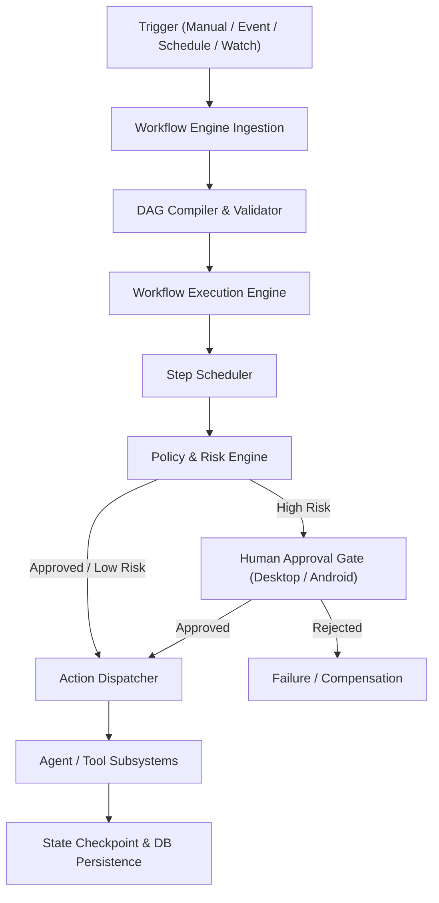

### 2. Workflow Definition Model

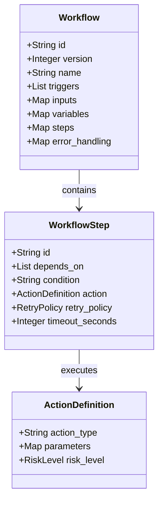

### 3. Workflow Graph DAG

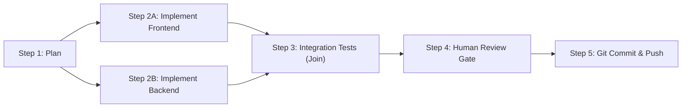

### 4. Workflow Validation Pipeline

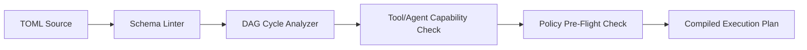

### 5. Workflow Execution Engine Flow

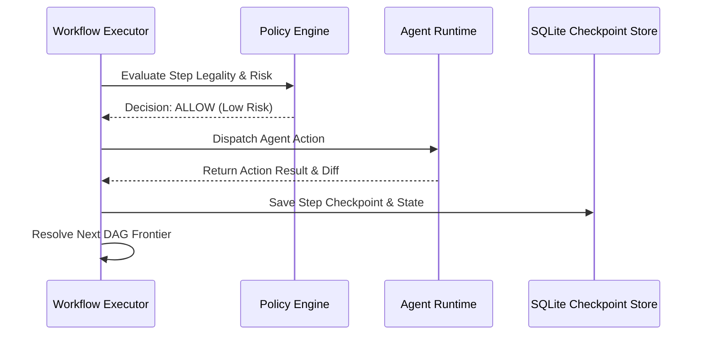

### 6. Policy Evaluation Decision Flow

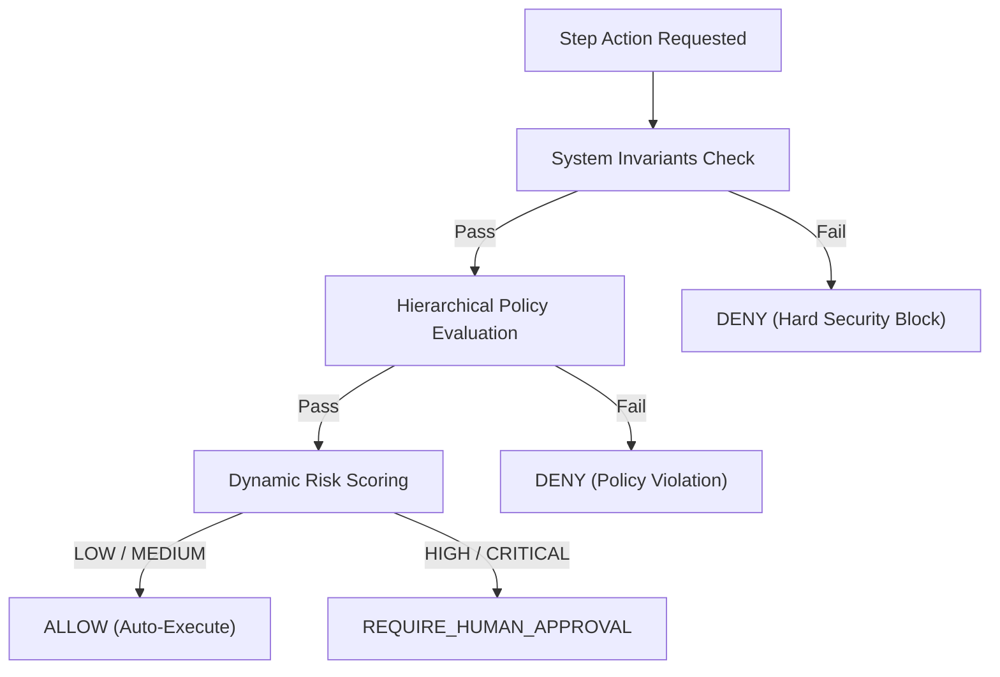

### 7. Human Approval Gate Lifecycle

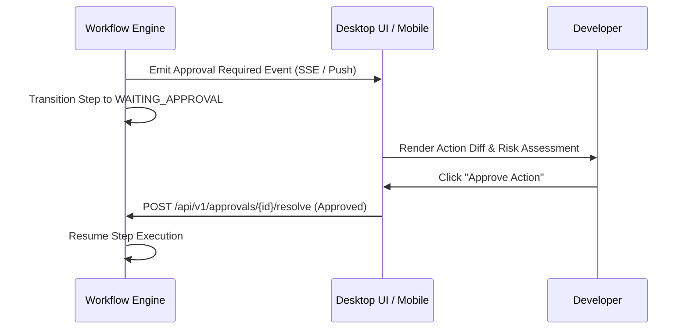

### 8. Retry & Bounded Self-Healing Workflow

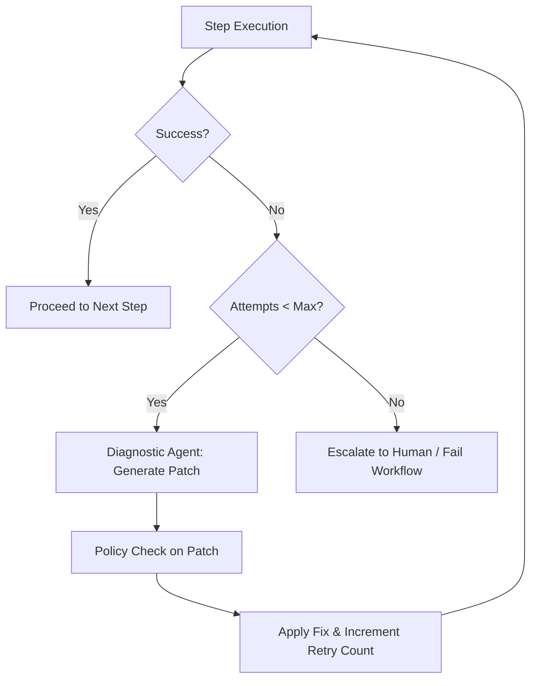

### 9. Checkpoint & Resume Architecture

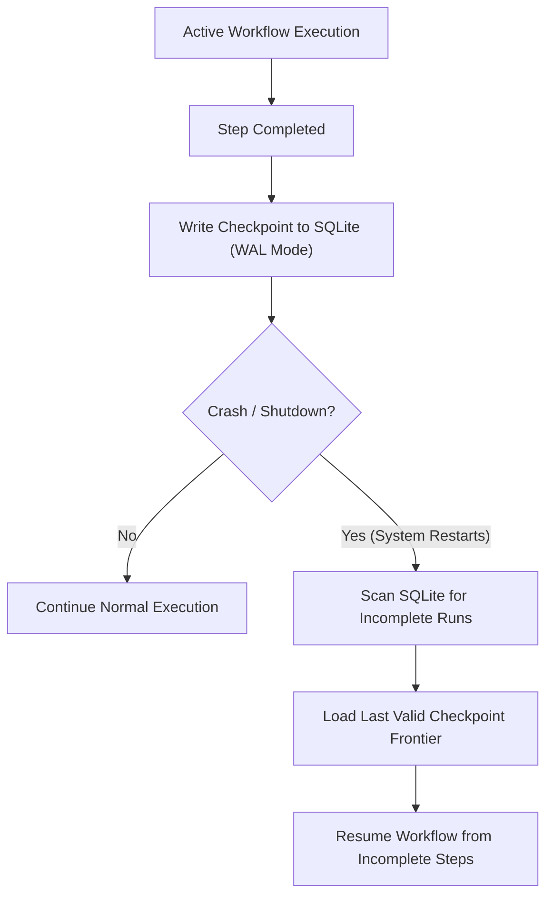

### 10. Parallel Execution & Join Semantics

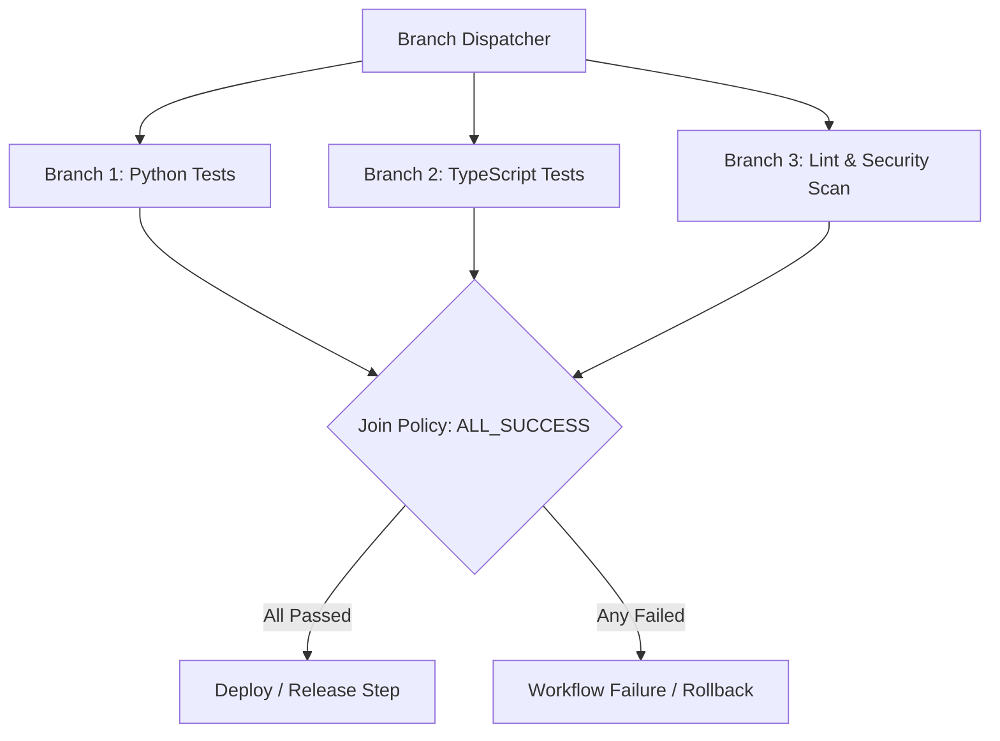

### 11. Scheduled Workflow Lifecycle

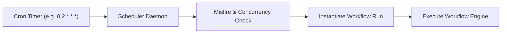

### 12. Event-Driven Workflow Routing

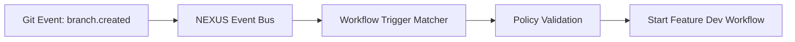

### 13. Subworkflow Encapsulation

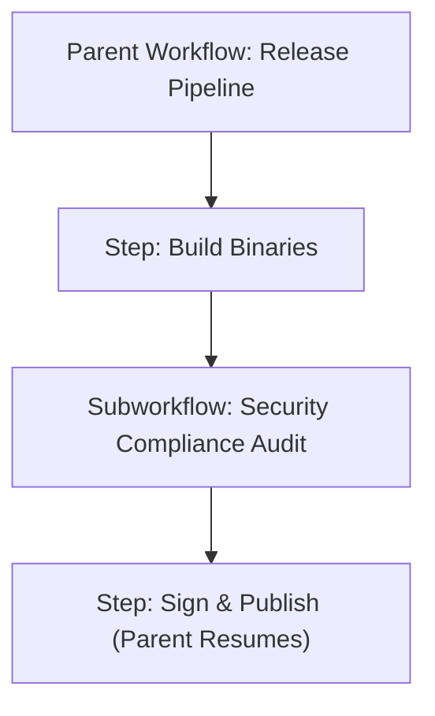

### 14. Mobile Companion Boundary

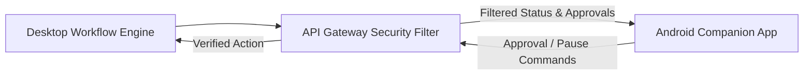

### 15. Complete Unified Workflow & Policy Platform

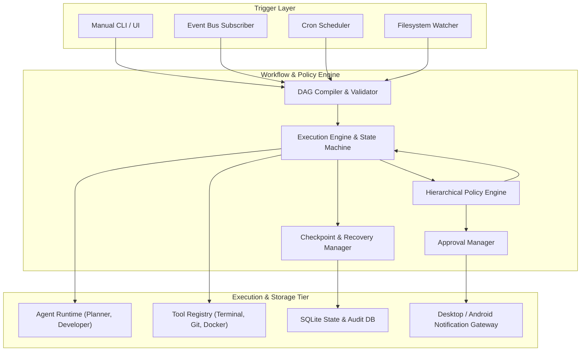

---

## 57. Non-Functional Requirements & Performance Targets

| Quality Attribute | Requirement Specification | Architectural Strategy |
| :--- | :--- | :--- |
| **Reliability** | Zero workflow state corruption across abrupt shutdowns. | SQLite WAL mode with atomic checkpoint transactions. |
| **Determinism** | 100% reproducible step resolution for identical inputs. | Static DAG compilation, explicit variable scoping, immutable versions. |
| **Scheduling Latency**| Step dispatch overhead `< 5 ms` (P95). | In-memory dependency graph with async event loop. |
| **Policy Evaluation**| Policy decision latency `< 2 ms` (P95). | Compiled rule trees and in-memory policy caching. |
| **Memory Footprint** | `< 30 MB` idle overhead for Workflow & Policy Engine. | Lightweight Python core with lazy action instantiation. |
| **Offline Operation** | 100% operational autonomy without internet connectivity. | All scheduling, state, and policy logic executed locally. |

---

## 58. Architectural Trade-Off Analysis

| Decision | Options Evaluated | Selected Architecture | Justification & Rationale |
| :--- | :--- | :--- | :--- |
| **Workflow DSL** | Python Scripts vs YAML vs TOML | **TOML with Schema Validation** | TOML provides superior human readability, native typing, and eliminates Python security execution risks. |
| **Graph Model** | Linear Pipelines vs Arbitrary DAG | **Directed Acyclic Graph (DAG)** | Supports realistic parallel workflows (concurrent testing/linting) while mathematically guaranteeing cycle prevention. |
| **State Persistence** | In-Memory vs Redis vs SQLite | **SQLite Transactional Store** | Aligns with local-first, zero-infrastructure footprint; guarantees durable ACID step checkpoints. |
| **Policy Enforcement**| Imperative Callbacks vs Central Policy Engine | **Central Hierarchical Policy Engine** | Guarantees non-bypassable security invariants across all agent and tool invocations. |

---

## 59. Phased Implementation Roadmap

```
Phase 1: Core DAG Compiler & Execution State Machine
  ├── Implement WorkflowDefinition schema parser (TOML)
  ├── Build DAG cycle detection & dependency resolver
  └── Implement core async WorkflowExecutor and state transitions

Phase 2: Centralized Policy & Risk Classification Engine
  ├── Implement Hierarchical Policy Engine & rule evaluator
  ├── Implement dynamic action risk scoring (LOW, MEDIUM, HIGH, CRITICAL)
  └── Connect Policy Engine to Tool Registry execution gates

Phase 3: Human Approval Integration & Mobile Bridge
  ├── Build Approval Action runner & timeout handlers
  ├── Integrate approval events with Desktop UI and Android companion
  └── Implement interactive pause/resume controls

Phase 4: Checkpointing, Crash Recovery & Bounded Self-Healing
  ├── Implement SQLite transactional step checkpointing
  ├── Build crash recovery on startup
  └── Implement bounded self-healing error analysis loops

Phase 5: Scheduling & Multi-Modal Triggers
  ├── Implement persistent SQLite cron scheduler
  ├── Connect Event Bus topics to workflow trigger routing
  └── Build CLI commands (`nexus workflow run`, `nexus workflow validate`)
```

---

## 60. Architectural Acceptance Criteria

- [x] Comprehensive workflow model defined supporting DAG, parallel, conditional, and approval topologies.
- [x] Declarative TOML DSL specified with Pydantic schema validation and variable interpolation.
- [x] Centralized, non-bypassable Policy Engine defined with 6-tier hierarchical precedence.
- [x] Dynamic 4-tier Action Risk Classification engine established.
- [x] Crash-resilient SQLite checkpointing and startup recovery algorithms specified.
- [x] Multi-tier cancellation, pause/resume, and exponential retry strategies defined.
- [x] Bounded self-healing loops with stagnation detection rules specified.
- [x] Direct integration with Agent Runtime, Tool Registry, Event Bus, and Secret Manager.
- [x] Database schema (`workflows`, `workflow_runs`, `workflow_step_runs`, `workflow_checkpoints`, `policy_evaluations`) defined.
- [x] 15 detailed Mermaid architecture diagrams illustrating all structural workflows.
- [x] Security threat model and failure scenario recovery matrices established.

---

## 61. Open Decisions & TBDs

- **TBD-01: Visual Workflow Builder Canvas**: Evaluate React Flow integration in the desktop UI for visual drag-and-drop workflow editing.
- **TBD-02: WASM-Sandboxed Custom Expression Evaluators**: Evaluate WebAssembly runtimes for executing complex user-defined transformation scripts.
- **TBD-03: Distributed Team Workflow Registry**: Determine protocols for synchronizing verified team workflow templates across distributed workspaces.

---

## 62. Final Architecture Summary

The NEXUS Workflow, Automation & Policy Engine establishes a dependable, enterprise-grade orchestration platform. By synthesizing:
- **Declarative DAG workflow representations**
- **Non-bypassable hierarchical policy enforcement**
- **Transactional SQLite checkpointing and crash recovery**
- **Human-in-the-loop approval enclosures across Desktop and Android**
- **Bounded autonomous self-healing loops**

NEXUS guarantees that complex, multi-step software engineering automations execute with complete determinism, safety, and observability directly on the developer's workstation.

---

## 63. Next Recommended Architecture Document

To complete the foundational architecture specifications for the NEXUS platform, the single next logical architecture document is:

**`NEXUS_DESKTOP_CLIENT_AND_LOCAL_GATEWAY_ARCHITECTURE.md`**  
*(Focusing on the Windows desktop shell lifecycle, Tauri/Electron process bridge, local HTTP/WebSocket gateway hosting, background daemon management, IPC communication, and native OS integration).*
